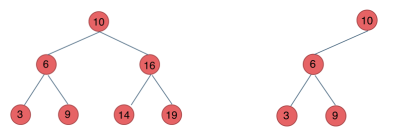

# 一、基本理论

## 1、二叉树的种类

### 1）满二叉树

满二叉树：如果一棵二叉树只有度为0的结点和度为2的结点，并且度为0的结点在同一层上，则这棵二叉树为满二叉树。

如图所示：


这棵二叉树为满二叉树，也可以说深度为k，有2^k-1个节点的二叉树。

### 2）完全二叉树

什么是完全二叉树？

完全二叉树的定义如下：在完全二叉树中，除了最底层节点可能没填满外，其余每层节点数都达到最大值，并且最下面一层的节点都集中在该层最左边的若干位置。若最底层为第 h 层，则该层包含 1~ 2^h -1  个节点。

**大家要自己看完全二叉树的定义，很多同学对完全二叉树其实不是真正的懂了。**

我来举一个典型的例子如题：


### 3）二叉搜索树

前面介绍的树，都没有数值的，而二叉搜索树是有数值的了，**二叉搜索树是一个有序树**。

- 若它的左子树不空，则左子树上所有结点的值均小于它的根结点的值；
- 若它的右子树不空，则右子树上所有结点的值均大于它的根结点的值；
- 它的左、右子树也分别为二叉排序树

下面这两棵树都是搜索树：



### 4）平衡二叉搜索树

平衡二叉搜索树：又被称为AVL（Adelson-Velsky and Landis）树，且具有以下性质：它是一棵空树或它的左右两个子树的高度差的绝对值不超过1，并且左右两个子树都是一棵平衡二叉树。

如图：


最后一棵 不是平衡二叉树，因为它的左右两个子树的高度差的绝对值超过了1。

## 2、二叉树的存储方式

**二叉树可以链式存储，也可以顺序存储。**

那么链式存储方式就用指针， 顺序存储的方式就是用数组。

顾名思义就是顺序存储的元素在内存是连续分布的，而链式存储则是通过指针把分布在散落在各个地址的节点串联一起。

链式存储如图：


链式存储是大家很熟悉的一种方式，那么我们来看看如何顺序存储呢？

其实就是用数组来存储二叉树，顺序存储的方式如图：


用数组来存储二叉树如何遍历的呢？

**如果父节点的数组下标是 i，那么它的左孩子就是 i \* 2 + 1，右孩子就是 i \* 2 + 2。**

但是用链式表示的二叉树，更有利于我们理解，所以一般我们都是用链式存储二叉树。

## 3、二叉树的定义

```java
public class TreeNode {
    int val;
  	TreeNode left;
  	TreeNode right;
  	TreeNode() {}
  	TreeNode(int val) { this.val = val; }
  	TreeNode(int val, TreeNode left, TreeNode right) {
    		this.val = val;
    		this.left = left;
    		this.right = right;
  	}
}
```


# 二、二叉树的遍历方式

## 1、递归法

### 1）前序遍历

```java
/ 前序遍历·递归·LC144_二叉树的前序遍历
class Solution {
    public List<Integer> preorderTraversal(TreeNode root) {
        List<Integer> result = new ArrayList<Integer>();
        preorder(root, result);
        return result;
    }

    public void preorder(TreeNode root, List<Integer> result) {
        if (root == null) {
            return;
        }
        result.add(root.val);
        preorder(root.left, result);
        preorder(root.right, result);
    }
}
```


### 2）中序遍历

```java
class Solution {
    public List<Integer> inorderTraversal(TreeNode root) {
        List<Integer> res = new ArrayList<>();
        inorder(root, res);
        return res;
    }

    void inorder(TreeNode root, List<Integer> list) {
        if (root == null) {
            return;
        }
        inorder(root.left, list);
        list.add(root.val);             // 注意这一句
        inorder(root.right, list);
    }
}
```


### 3）后序遍历

```java
class Solution {
    public List<Integer> postorderTraversal(TreeNode root) {
        List<Integer> res = new ArrayList<>();
        postorder(root, res);
        return res;
    }

    void postorder(TreeNode root, List<Integer> list) {
        if (root == null) {
            return;
        }
        postorder(root.left, list);
        postorder(root.right, list);
        list.add(root.val);             // 注意这一句
    }
}
```


### 4）层序遍历

```java
class Solution {
    public List<List<Integer>> resList = new ArrayList<List<Integer>>();

    public List<List<Integer>> levelOrder(TreeNode root) {
        checkFun01(root,0);
        return resList;
    }

    //DFS--递归方式
    public void checkFun01(TreeNode node, Integer deep) {
        if (node == null) return;
        deep++;

        if (resList.size() < deep) {
            //当层级增加时，list的Item也增加，利用list的索引值进行层级界定
            List<Integer> item = new ArrayList<Integer>();
            resList.add(item);
        }
        resList.get(deep - 1).add(node.val);

        checkFun01(node.left, deep);
        checkFun01(node.right, deep);
    }
}
```


## 2、迭代法

为什么可以用迭代法（非递归的方式）来实现二叉树的前后中序遍历呢？

**递归的实现就是：每一次递归调用都会把函数的局部变量、参数值和返回地址等压入调用栈中**，然后递归返回的时候，从栈顶弹出上一次递归的各项参数，所以这就是递归为什么可以返回上一层位置的原因。

### 1）前序遍历

写法一：

```java
// 前序遍历顺序：中-左-右，入栈顺序：中-右-左
class Solution {
    public List<Integer> preorderTraversal(TreeNode root) {
        List<Integer> result = new ArrayList<>();
        if (root == null){
            return result;
        }
        Stack<TreeNode> stack = new Stack<>();
        stack.push(root);
        while (!stack.isEmpty()){
            TreeNode node = stack.pop();
            result.add(node.val);
            if (node.right != null){
                stack.push(node.right);
            }
            if (node.left != null){
                stack.push(node.left);
            }
        }
        return result;
    }
}
```


写法二（正经写法）：

```java
class Solution {
    public List<Integer> preorderTraversal(TreeNode root) {
        List<Integer> res = new ArrayList<Integer>();
        if (root == null) {
            return res;
        }

        Deque<TreeNode> stack = new LinkedList<TreeNode>();
        TreeNode node = root;
        while (!stack.isEmpty() || node != null) {
            while (node != null) {
                res.add(node.val);
                stack.push(node);
                node = node.left;
            }
            node = stack.pop();
            node = node.right;
        }
        return res;
    }
}

```


### 2）中序遍历

```java
class Solution {
    public List<Integer> inorderTraversal(TreeNode root) {
        List<Integer> res = new ArrayList<Integer>();
        Deque<TreeNode> stk = new LinkedList<TreeNode>();
        while (root != null || !stk.isEmpty()) {
            while (root != null) {
                stk.push(root);
                root = root.left;
            }
            root = stk.pop();
            res.add(root.val);
            root = root.right;
        }
        return res;
    }
}
```


### 3）后序遍历

```java
class Solution{
    public List<Integer> method1(TreeNode root) {
        List<Integer> ans=new LinkedList<>();
        Stack<TreeNode> stack=new Stack<>();
        TreeNode prev=null;
        //主要思想：
        //由于在某颗子树访问完成以后，接着就要回溯到其父节点去
        //因此可以用prev来记录访问历史，在回溯到父节点时，可以由此来判断，上一个访问的节点是否为右子树
        while(root!=null||!stack.isEmpty()){
            while(root!=null){
                stack.push(root);
                root=root.left;
            }
            //从栈中弹出的元素，左子树一定是访问完了的
            root=stack.pop();
            //现在需要确定的是是否有右子树，或者右子树是否访问过
            //如果没有右子树，或者右子树访问完了，也就是上一个访问的节点是右子节点时
            //说明可以访问当前节点
            if(root.right==null||prev==root.right){
                ans.add(root.val);
                //更新历史访问记录，这样回溯的时候父节点可以由此判断右子树是否访问完成
                prev=root;
                root=null;
            }else{
            //如果右子树没有被访问，那么将当前节点压栈，访问右子树
                stack.push(root);
                root=root.right;
            }
        }
        return ans;
    }
}
```

### 4）层序遍历

```java
class Solution {
    public List<List<Integer>> resList = new ArrayList<List<Integer>>();

    public List<List<Integer>> levelOrder(TreeNode root) {
        checkFun02(root);
        return resList;
    }

    //BFS--迭代方式--借助队列
    public void checkFun02(TreeNode node) {
        if (node == null) return;
        Queue<TreeNode> que = new LinkedList<TreeNode>();
        que.offer(node);

        while (!que.isEmpty()) {
            List<Integer> itemList = new ArrayList<Integer>();
            int len = que.size();

            while (len > 0) {
                TreeNode tmpNode = que.poll();
                itemList.add(tmpNode.val);

                if (tmpNode.left != null) que.offer(tmpNode.left);
                if (tmpNode.right != null) que.offer(tmpNode.right);
                len--;
            }

            resList.add(itemList);
        }

    }
}
```


# 三、二叉树的属性

## 1、[对称二叉树](https://leetcode-cn.com/problems/symmetric-tree/)

### 1）题目

给你一个二叉树的根节点 `root` ， 检查它是否轴对称。

**示例 1：**


> 输入：root = [1,2,2,3,4,4,3]<br>
> 输出：true

**示例 2：**


> 输入：root = [1,2,2,null,3,null,3]<br>
> 输出：false

**提示：**

> - 树中节点数目在范围 `[1, 1000]` 内<br>
> - `-100 <= Node.val <= 100`

### 2）递归法

```java
class Solution {
    public boolean isSymmetric(TreeNode root) {
        return check(root, root);
    }

    public boolean check(TreeNode p, TreeNode q) {
        if (p == null && q == null) {
            return true;
        }
        if (p == null || q == null) {
            return false;
        }
        return p.val == q.val && check(p.left, q.right) && check(p.right, q.left);
    }
}
```

### 3）迭代法

```java
class Solution {
    public boolean isSymmetric(TreeNode root) {
        if(root == null){
            return true;
        }
        Deque<TreeNode> queue = new LinkedList();
        queue.offer(root);
        queue.offer(root);
        while(!queue.isEmpty()){
            TreeNode node1 = queue.poll();
            TreeNode node2 = queue.poll();

            if(node1 == null && node2 == null){
                continue;
            }

            if(node1 == null || node2 == null || node1.val != node2.val){
                return false;
            }

            queue.offer(node1.left);
            queue.offer(node2.right);

            queue.offer(node1.right);
            queue.offer(node2.left);
        }
        return true;
    }
}
```


## 2、[二叉树的最大深度](https://leetcode-cn.com/problems/maximum-depth-of-binary-tree/)

### 1）题目

给定一个二叉树，找出其最大深度。

二叉树的深度为根节点到最远叶子节点的最长路径上的节点数。

说明: 叶子节点是指没有子节点的节点。

示例：

> 给定二叉树 [3,9,20,null,null,15,7]，
>
> 
>
> 返回它的最大深度 3 。

### 2）深度优先搜索

```java
class Solution {
    public int maxDepth(TreeNode root) {
        if(root == null){
            return 0;
        }
        return Math.max(maxDepth(root.left),maxDepth(root.right))+1;
    }
}
```

### 3）广度优先搜索

```java
class Solution {
    public int maxDepth(TreeNode root) {
        if(root == null){
            return 0;
        }
        int depth = 0;
        Deque<TreeNode> queue = new LinkedList();
        queue.offer(root);
        while(!queue.isEmpty()){
            int size = queue.size();
            for(int i = 0 ; i < size; i++){
                TreeNode node = queue.poll();
                if(node.left != null){
                    queue.offer(node.left);
                }
                if(node.right != null){
                    queue.offer(node.right);
                }
            }
            depth++;
        }
        return depth;
    }
}
```

## 3、[二叉树的最小深度](https://leetcode-cn.com/problems/minimum-depth-of-binary-tree/)

### 1）题目

给定一个二叉树，找出其最小深度。

最小深度是从根节点到最近叶子节点的最短路径上的节点数量。

**说明：**叶子节点是指没有子节点的节点。

**示例 1：**


> 输入：root = [3,9,20,null,null,15,7]<br>
> 输出：2

**示例 2：**

> 输入：root = [2,null,3,null,4,null,5,null,6]<br>
> 输出：5

**提示：**

- 树中节点数的范围在 `[0, 105]` 内
- `-1000 <= Node.val <= 1000`

### 2）深度优先搜索

```java
class Solution {
    public int minDepth(TreeNode root) {
        if(root == null){
            return 0;
        }else if(root.left == null){
            return minDepth(root.right) + 1;
        }else if(root.right == null){
            return minDepth(root.left) + 1;
        }else{
            return Math.min(minDepth(root.left),minDepth(root.right)) + 1;
        }
    }
}
```

### 3）广度优先搜索

```java
class Solution {
    public int minDepth(TreeNode root) {
        if(root == null){
            return 0;
        }
        Deque<TreeNode> queue = new LinkedList();
        queue.offer(root);
        int depth = 1;
        while(!queue.isEmpty()){
            int size = queue.size();
            for(int i = 0 ; i < size ; i++){
                TreeNode node = queue.poll();
                if(node.left == null && node.right == null){
                	return depth;
                }
                if(node.left != null){
                    queue.offer(node.left);
                }
                if(node.right != null){
                    queue.offer(node.right);
                }
            }
            depth++;
        }
        return depth;
    }
}
```

## 4、[完全二叉树的节点个数](https://leetcode-cn.com/problems/count-complete-tree-nodes/)

### 1）题目

给你一棵 完全二叉树 的根节点 root ，求出该树的节点个数。

完全二叉树 的定义如下：在完全二叉树中，除了最底层节点可能没填满外，其余每层节点数都达到最大值，并且最下面一层的节点都集中在该层最左边的若干位置。若最底层为第 h 层，则该层包含 1~ 2^h 个节点。

**示例 1：**


> 输入：root = [1,2,3,4,5,6]<br>
> 输出：6

**示例 2：**

> 输入：root = []<br>
> 输出：0

**示例 3：**

> 输入：root = [1]<br>
> 输出：1

**提示：**

> 树中节点的数目范围是[0, 5 * 104]<br>
> 0 <= Node.val <= 5 * 104<br>
> 题目数据保证输入的树是 完全二叉树

### 2）解体思路

对于没有约束的二叉树而言，可以很简单地想到使用下面这个递归的解法：

```java
public int countNodes(TreeNode root) {
    if (root == null){
        return 0;
    }
    return countNodes(root.left) + countNodes(root.right) + 1;
}
```

但这是一个普适的解法，对于此题给的完全二叉树的特点没有利用起来，进一步考虑如何使用完全二叉树的特点更快解出此题。

首先需要明确完全二叉树的定义：**它是一棵空树或者它的叶子节点只出在最后两层，若最后一层不满则叶子节点只在最左侧。**

再来回顾一下满二叉的节点个数怎么计算，如果满二叉树的层数为h，则总节点数为：2^h - 1.
那么我们来对 root 节点的左右子树进行高度统计，分别记为 left 和 right，有以下两种结果：

1. left == right。这说明，左子树一定是满二叉树，因为节点已经填充到右子树了，左子树必定已经填满了。所以左子树的节点总数我们可以直接得到，是 2^left - 1，加上当前这个 root 节点，则正好是 2^left。再对右子树进行递归统计。
2. left != right。说明此时最后一层不满，但倒数第二层已经满了，可以直接得到右子树的节点个数。同理，右子树节点 +root 节点，总数为 2^right。再对左子树进行递归查找。

关于如何计算二叉树的层数，可以利用下面的递归来算，当然对于完全二叉树，可以利用其特点，不用递归直接算，具体请参考最后的完整代码。

```java
private int countLevel(TreeNode root){
    if(root == null){
        return 0;
    }
    return Math.max(countLevel(root.left),countLevel(root.right)) + 1;
}
```

如何计算 `2^left`，最快的方法是移位计算，因为运算符的优先级问题，记得加括号哦。

### 3）完整代码

```java
/**
 * Definition for a binary tree node.
 * public class TreeNode {
 *     int val;
 *     TreeNode left;
 *     TreeNode right;
 *     TreeNode(int x) { val = x; }
 * }
 */
class Solution {
    public int countNodes(TreeNode root) {
        if(root == null){
           return 0;
        } 
        int left = countLevel(root.left);
        int right = countLevel(root.right);
        if(left == right){
            return countNodes(root.right) + (1<<left);
        }else{
            return countNodes(root.left) + (1<<right);
        }
    }
    private int countLevel(TreeNode root){
        int level = 0;
        while(root != null){
            level++;
            root = root.left;
        }
        return level;
    }
}
```

## 5、[平衡二叉树](https://leetcode-cn.com/problems/balanced-binary-tree/)

### 1）题目

给定一个二叉树，判断它是否是高度平衡的二叉树。

本题中，一棵高度平衡二叉树定义为：*一个二叉树每个节点 的左右两个子树的高度差的绝对值不超过 1 。*

**示例 1：**


> 输入：root = [3,9,20,null,null,15,7]<br>
> 输出：true

**示例 2：**


> 输入：root = [1,2,2,3,3,null,null,4,4]<br>
> 输出：false

**示例 3：**

> 输入：root = []<br>
> 输出：true

**提示：**

- 树中的节点数在范围 `[0, 5000]` 内
- `-104 <= Node.val <= 104`

### 2）题解

```java
class Solution {
    public boolean isBalanced(TreeNode root) {
        if(root == null){
            return true;
        }
        int left = level(root.left);
        int right = level(root.right);
        return Math.abs(left-right) <= 1 && isBalanced(root.left) && isBalanced(root.right);
    }

    private int level(TreeNode node){
        if(node == null){
            return 0;
        }
        return Math.max(level(node.left),level(node.right)) + 1;
    }
}
```

## 6、[二叉树的所有路径](https://leetcode-cn.com/problems/binary-tree-paths/)

### 1）题目

给你一个二叉树的根节点 `root` ，按 **任意顺序** ，返回所有从根节点到叶子节点的路径。

**叶子节点** 是指没有子节点的节点。

**示例 1：**


> 输入：root = [1,2,3,null,5]<br>
> 输出：["1->2->5","1->3"]

示例 2：

> 输入：root = [1]<br>
> 输出：["1"]


提示：

> 树中节点的数目在范围 [1, 100] 内<br>
> -100 <= Node.val <= 100

### 2）题解

```java
class Solution {
    private List<String> res = new ArrayList();

    public List<String> binaryTreePaths(TreeNode root) {
        if(root == null){
            return res;
        }
        dfs(root,"");
        return res;
    }

    private void dfs(TreeNode root,String str){
        if(root == null){
            return;
        }
        StringBuilder sb = new StringBuilder(str);
        sb.append(root.val);
        if(root.left == null && root.right == null){
            res.add(sb.toString());
            return;
        }else{
            sb.append("->");
            dfs(root.left,sb.toString());
            dfs(root.right,sb.toString());
        }
    }
}
```


## 7、[二叉树的直径](https://leetcode-cn.com/problems/diameter-of-binary-tree/)

### 1）题目

给定一棵二叉树，你需要计算它的直径长度。一棵二叉树的直径长度是任意两个结点路径长度中的最大值。这条路径可能穿过也可能不穿过根结点。

**示例 :**

给定二叉树：


> 返回 **3**, 它的长度是路径 [4,2,1,3] 或者 [5,2,1,3]。

### 2）题解

```java
class Solution {
    int ans;
    public int diameterOfBinaryTree(TreeNode root) {
        ans = 1;
        depth(root);
        return ans - 1;
    }
    public int depth(TreeNode node) {
        if (node == null) {
            return 0; // 访问到空节点了，返回0
        }
        int L = depth(node.left); // 左儿子为根的子树的深度
        int R = depth(node.right); // 右儿子为根的子树的深度
        ans = Math.max(ans, L+R+1); // 计算d_node即L+R+1 并更新ans
        return Math.max(L, R) + 1; // 返回该节点为根的子树的深度
    }
}
```


# 四、二叉树的修改与构造

## 1、[翻转二叉树](https://leetcode-cn.com/problems/invert-binary-tree/)

### 1）题目

给你一棵二叉树的根节点 root ，翻转这棵二叉树，并返回其根节点。

示例 1：


> 输入：root = [4,2,7,1,3,6,9]<br>
> 输出：[4,7,2,9,6,3,1]

示例 2：


> 输入：root = [2,1,3]<br>
> 输出：[2,3,1]

示例 3：

> 输入：root = []<br>
> 输出：[]


提示：

> 树中节点数目范围在 [0, 100] 内<br>
> -100 <= Node.val <= 100

### 2）递归法

```java
class Solution {
    public TreeNode invertTree(TreeNode root) {
        if (root == null) {
            return null;
        }
        TreeNode left = invertTree(root.left);
        TreeNode right = invertTree(root.right);
        root.left = right;
        root.right = left;
        return root;
    }
}
```

### 3）迭代法

```java
class Solution {
    public TreeNode invertTree(TreeNode root) {
        if(root == null){
            return null;
        }
        Deque<TreeNode> queue = new LinkedList();
        queue.offer(root);
        while(!queue.isEmpty()){
            TreeNode node = queue.poll();
            TreeNode temp = node.left;
            node.left = node.right;
            node.right = temp;
            if(node.left != null){
                queue.offer(node.left);
            }
            if(node.right != null){
                queue.offer(node.right);
            }
        }
        return root;
    }
}
```


## 2、[最大二叉树](https://leetcode-cn.com/problems/maximum-binary-tree/)

给定一个不重复的整数数组 nums 。 最大二叉树 可以用下面的算法从 nums 递归地构建:

1. 创建一个根节点，其值为 nums 中的最大值。
2. 递归地在最大值 左边 的 子数组前缀上 构建左子树。
3. 递归地在最大值 右边 的 子数组后缀上 构建右子树。

返回 nums 构建的 最大二叉树 。

**示例 1：**


> 输入：nums = [3,2,1,6,0,5]<br>
> 输出：[6,3,5,null,2,0,null,null,1]

**示例 2：**


> 输入：nums = [3,2,1]<br>
> 输出：[3,null,2,null,1]

### 2）题解

```java
class Solution {
    public TreeNode constructMaximumBinaryTree(int[] nums) {
        TreeNode root = handle(nums,0,nums.length-1);
        return root;
    }

    private TreeNode handle(int[] nums,int left,int right){
        if(left > right){
            return null;
        }
        int index = findMax(nums,left,right);
        TreeNode node = new TreeNode(nums[index]);
        node.left = handle(nums,left,index-1);
        node.right = handle(nums,index+1,right);
        return node;
    }

    private int findMax(int[] nums,int left,int right){
        int idx = left;
        for(int i = left + 1; i <= right;i ++){
            if(nums[idx] < nums[i]){
                idx = i;
            }
        }
        return idx;
    }
}
```

## 3、[合并二叉树](https://leetcode-cn.com/problems/merge-two-binary-trees/)

### 1）题目

给你两棵二叉树： root1 和 root2 。

想象一下，当你将其中一棵覆盖到另一棵之上时，两棵树上的一些节点将会重叠（而另一些不会）。你需要将这两棵树合并成一棵新二叉树。合并的规则是：如果两个节点重叠，那么将这两个节点的值相加作为合并后节点的新值；否则，不为 null 的节点将直接作为新二叉树的节点。

返回合并后的二叉树。

注意: 合并过程必须从两个树的根节点开始。

**示例 1：**


> 输入：root1 = [1,3,2,5], root2 = [2,1,3,null,4,null,7]<br>
> 输出：[3,4,5,5,4,null,7]

**示例 2：**

> 输入：root1 = [1], root2 = [1,2]<br>
> 输出：[2,2]

**提示：**

- 两棵树中的节点数目在范围 `[0, 2000]` 内
- `-104 <= Node.val <= 104`

### 2）题解

```java
class Solution {
    public TreeNode mergeTrees(TreeNode t1, TreeNode t2) {
        if (t1 == null) {
            return t2;
        }
        if (t2 == null) {
            return t1;
        }
        TreeNode merged = new TreeNode(t1.val + t2.val);
        merged.left = mergeTrees(t1.left, t2.left);
        merged.right = mergeTrees(t1.right, t2.right);
        return merged;
    }
}
```


# 五、求二叉搜索树的属性

## 1、[二叉搜索树中的搜索](https://leetcode-cn.com/problems/search-in-a-binary-search-tree/)

### 1）题目

给定二叉搜索树（BST）的根节点 root 和一个整数值 val。

你需要在 BST 中找到节点值等于 val 的节点。 返回以该节点为根的子树。 如果节点不存在，则返回 null 。

**示例 1:**


> 输入：root = [4,2,7,1,3], val = 2<br>
> 输出：[2,1,3]

**示例2**


> 输入：root = [4,2,7,1,3], val = 5<br>
> 输出：[]

### 2）我的题解

```java
class Solution {
    public TreeNode searchBST(TreeNode root, int val) {
        if(root == null){
            return null;
        }
        if(root.val == val){
            return root;
        }else if(root.val < val){
            return searchBST(root.right,val);
        }else{
            return searchBST(root.left,val);
        }
    }
}
```


## 2、[验证二叉搜索树](https://leetcode-cn.com/problems/validate-binary-search-tree/)

### 1）题目

给你一个二叉树的根节点 root ，判断其是否是一个有效的二叉搜索树。

有效 二叉搜索树定义如下：

- 节点的左子树只包含 小于 当前节点的数。
- 节点的右子树只包含 大于 当前节点的数。
- 所有左子树和右子树自身必须也是二叉搜索树。

**示例 1：**


> 输入：root = [2,1,3]<br>
> 输出：true

**示例 2：**


> 输入：root = [5,1,4,null,null,3,6]<br>
> 输出：false<br>
> 解释：根节点的值是 5 ，但是右子节点的值是 4 。

**提示：**

- 树中节点数目范围在`[1, 104]` 内
- `-231 <= Node.val <= 231 - 1`

### 2）题解

```java
class Solution {
    public boolean isValidBST(TreeNode root) {
        return isValid(root,null,null);
    }

    public boolean isValid(TreeNode root , Integer low, Integer high){
        if(root == null){
            return true;
        }
        if((low!=null && root.val <= low)|| (high!= null && root.val >= high)){
            return false;
        }
        return isValid(root.left,low,root.val) && isValid(root.right,root.val,high);
    }
}
```

## 3、[二叉搜索树的最小绝对差](https://leetcode-cn.com/problems/minimum-absolute-difference-in-bst/)

### 1）题目

给你一个二叉搜索树的根节点 `root` ，返回 **树中任意两不同节点值之间的最小差值** 。

差值是一个正数，其数值等于两值之差的绝对值。

**示例 1：**


> 输入：root = [4,2,6,1,3]<br>
> 输出：1

**示例 2：**


> 输入：root = [1,0,48,null,null,12,49]<br>
> 输出：1

**提示：**

- 树中节点的数目范围是 `[2, 104]`
- `0 <= Node.val <= 105`

### 2）题解（中序遍历）

```java
class Solution {
    int res = Integer.MAX_VALUE;
    int pre = -1;

    public int getMinimumDifference(TreeNode root) {
        dfs(root);
        return res;
    }

    private void dfs(TreeNode root){
        if(root == null){
            return;
        }
        dfs(root.left);
        if(pre == -1){
            pre = root.val;
        }else{
            res = Math.min(res,root.val - pre);
            pre = root.val;
        }
        dfs(root.right);
    }
}
```


# 六、二叉树公共祖先问题

# 七、二叉树的修改与改造