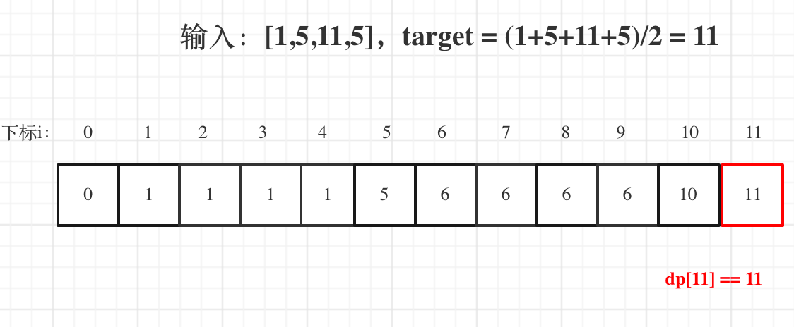
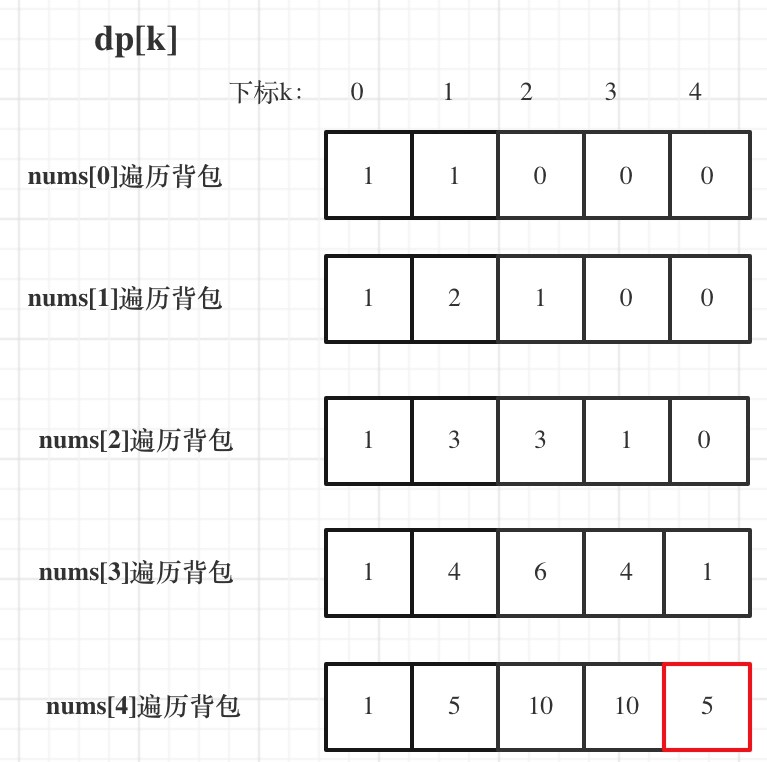

# 一、概念

动态规划，英文：Dynamic Programming，简称DP，如果某一问题有很多重叠子问题，使用动态规划是最有效的。

所以动态规划中每一个状态一定是由上一个状态推导出来的，**这一点就区分于贪心**，贪心没有状态推导，而是从局部直接选最优的。

# 二、基础题题目

## 1、[使用最小花费爬楼梯](https://leetcode-cn.com/problems/min-cost-climbing-stairs/)

### 1）题目

给你一个整数数组 cost ，其中 cost[i] 是从楼梯第 i 个台阶向上爬需要支付的费用。一旦你支付此费用，即可选择向上爬一个或者两个台阶。

你可以选择从下标为 0 或下标为 1 的台阶开始爬楼梯。

请你计算并返回达到楼梯顶部的最低花费。

示例 1：

> 输入：cost = [10,15,20]
> 输出：15
> 解释：你将从下标为 1 的台阶开始。
>
> 支付 15 ，向上爬两个台阶，到达楼梯顶部。
> 总花费为 15 。

示例 2：

> 输入：cost = [1,100,1,1,1,100,1,1,100,1]
> 输出：6
> 解释：你将从下标为 0 的台阶开始。
>
> - 支付 1 ，向上爬两个台阶，到达下标为 2 的台阶。
> - 支付 1 ，向上爬两个台阶，到达下标为 4 的台阶。
> - 支付 1 ，向上爬两个台阶，到达下标为 6 的台阶。
> - 支付 1 ，向上爬一个台阶，到达下标为 7 的台阶。
> - 支付 1 ，向上爬两个台阶，到达下标为 9 的台阶。
> - 支付 1 ，向上爬一个台阶，到达楼梯顶部。
> 总花费为 6 。
>


提示：

> 2 <= cost.length <= 1000
> 0 <= cost[i] <= 999

### 2）代码

```java
class Solution {
    public int minCostClimbingStairs(int[] cost) {
        int n = cost.length;
        int dp[] = new int[n+1];
        dp[0] = 0;
        dp[1] = 0;
        for(int i = 2; i <= n ; i ++){
            dp[i] += Math.min(dp[i-1]+cost[i-1],dp[i-2]+cost[i-2]);
        }
        return dp[n];
    }
}
```

### 3）优化

```java
class Solution {
    public int minCostClimbingStairs(int[] cost) {
        int n = cost.length;
        int pre = 0;
        int cur = 0;
        for(int i = 2; i <= n ; i ++){
            int next = Math.min(pre+cost[i-2],cur+cost[i-1]);
            pre = cur;
            cur = next;
        }
        return cur;
    }
}
```

## 2、[不同路径 II](https://leetcode-cn.com/problems/unique-paths-ii/)

### 1）题目

一个机器人位于一个 m x n 网格的左上角 （起始点在下图中标记为 “Start” ）。

机器人每次只能向下或者向右移动一步。机器人试图达到网格的右下角（在下图中标记为 “Finish”）。

现在考虑网格中有障碍物。那么从左上角到右下角将会有多少条不同的路径？

网格中的障碍物和空位置分别用 1 和 0 来表示。

示例 1：


> 输入：obstacleGrid = [[0,0,0],[0,1,0],[0,0,0]]
> 输出：2
> 解释：3x3 网格的正中间有一个障碍物。
> 从左上角到右下角一共有 2 条不同的路径：
>
> 1. 向右 -> 向右 -> 向下 -> 向下
> 2. 向下 -> 向下 -> 向右 -> 向右
>

示例 2：


> 输入：obstacleGrid = [[0,1],[0,0]]
> 输出：1


提示：

> m == obstacleGrid.length
> n == obstacleGrid[i].length
> 1 <= m, n <= 100
> obstacleGrid[i][j] 为 0 或 1

### 2）我的代码

```java
class Solution {
    public int uniquePathsWithObstacles(int[][] obstacleGrid) {
        int n = obstacleGrid.length;
        int m = obstacleGrid[0].length;
        int[][] dp = new int[n][m];
        dp[0][0] = obstacleGrid[0][0] == 1 ? 0:1;
        for(int i = 0 ; i < n ; i ++){
            for(int j = 0 ; j < m ; j ++){
                if(obstacleGrid[i][j] == 1){
                    continue;
                }
                if(i > 0 && obstacleGrid[i-1][j] != 1){
                    dp[i][j] += dp[i-1][j];
                }
                if(j > 0 && obstacleGrid[i][j-1] != 1){
                    dp[i][j] += dp[i][j-1];
                }
            }
        }
        return dp[n-1][m-1];
    }
}
```

### 3）官解

```java
class Solution {
    public int uniquePathsWithObstacles(int[][] obstacleGrid) {
        int n = obstacleGrid.length, m = obstacleGrid[0].length;
        int[] f = new int[m];

        f[0] = obstacleGrid[0][0] == 0 ? 1 : 0;
        for (int i = 0; i < n; ++i) {
            for (int j = 0; j < m; ++j) {
                if (obstacleGrid[i][j] == 1) {
                    f[j] = 0;
                    continue;
                }
                if (j - 1 >= 0 && obstacleGrid[i][j - 1] == 0) {
                    f[j] += f[j - 1];
                }
            }
        }
        
        return f[m - 1];
    }
}
```

## 3、[整数拆分](https://leetcode-cn.com/problems/integer-break/)

### 1）题目

给定一个正整数 n ，将其拆分为 k 个 正整数 的和（ k >= 2 ），并使这些整数的乘积最大化。

返回 你可以获得的最大乘积 。

示例 1:

> 输入: n = 2
> 输出: 1
> 解释: 2 = 1 + 1, 1 × 1 = 1。

示例 2:

> 输入: n = 10
> 输出: 36
> 解释: 10 = 3 + 3 + 4, 3 × 3 × 4 = 36。


提示:

> 2 <= n <= 58

### 2）解题思路

1. 确定dp数组（dp table）以及下标的含义

dp[i]：分拆数字i，可以得到的最大乘积为dp[i]。

dp[i]的定义讲贯彻整个解题过程，下面哪一步想不懂了，就想想dp[i]究竟表示的是啥！

2. 确定递推公式

可以想 dp[i]最大乘积是怎么得到的呢？

其实可以从1遍历j，然后有两种渠道得到dp[i].

- 一个是j * (i - j) 直接相乘。
- 一个是j * dp[i - j]，相当于是拆分(i - j)，对这个拆分不理解的话，可以回想dp数组的定义。

### 3）代码

```java
class Solution {
    public int integerBreak(int n) {
        int dp[] = new int[n+1];
        dp[1] = 1;
        for(int i = 2; i <= n ; i++){
            for(int j = 1; j <= i; j ++){
                dp[i] = Math.max(dp[i],Math.max(j*(i-j),j*dp[i-j]));
            }
        }
        return dp[n];
    }
}
```

# 三、背包问题

## 1、01背包问题

### 1）[01背包](https://www.acwing.com/problem/content/description/2/)

#### 1. 题目

有 N 件物品和一个容量是 V 的背包。每件物品只能使用一次。

第 i 件物品的体积是 vi，价值是 wi。

求解将哪些物品装入背包，可使这些物品的总体积不超过背包容量，且总价值最大。
输出最大价值。

**输入格式**

> 第一行两个整数，N，V用空格隔开，分别表示物品数量和背包容积。
>
> 接下来有 N 行，每行两个整数 vi,wi，用空格隔开，分别表示第 i 件物品的体积和价值。

**输出格式**

> 输出一个整数，表示最大价值。

**数据范围**

> 0<N,V≤1000
> 0<vi,wi≤1000

**输入样例**

> 4 5
> 1 2
> 2 4
> 3 4
> 4 5

**输出样例：**

> 8

#### 2. 代码

```java
import java.util.*;

public class Main {

    public static void main(String[] args) {
        Scanner scanner = new Scanner(System.in);
        int n = scanner.nextInt();
        int v = scanner.nextInt();
        int[] volume = new int[n + 1];
        int[] weight = new int[n + 1];
        for (int i = 1; i <= n; i++) {
            volume[i] = scanner.nextInt();
            weight[i] = scanner.nextInt();
        }
        int dp[][] = new int[n + 1][v + 1];
        for(int i = 1; i <= n; i ++){
            for(int j = 1; j <= v; j ++){
                dp[i][j] = dp[i-1][j];
                if(j >= volume[i]){
                    dp[i][j] = Math.max(dp[i-1][j],dp[i-1][j-volume[i]]+weight[i]);
                }
            }
        }
        System.out.println(dp[n][v]);
    }

}
```

#### 3. 优化(滚动数组)

```java
import java.util.*;

public class Main {

    public static void main(String[] args) {
        Scanner scanner = new Scanner(System.in);
        int n = scanner.nextInt();
        int v = scanner.nextInt();
        int[] volume = new int[n + 1];
        int[] weight = new int[n + 1];
        for (int i = 1; i <= n; i++) {
            volume[i] = scanner.nextInt();
            weight[i] = scanner.nextInt();
        }
        int dp[] = new int[v + 1];
        for(int i = 1; i <= n; i ++){
            for(int j = v; j >= volume[i]; j --){
                dp[j] = Math.max(dp[j],dp[j-volume[i]]+weight[i]);
            }
        }
        System.out.println(dp[v]);
    }

}
```

### 2）[分割等和子集](https://leetcode-cn.com/problems/partition-equal-subset-sum/)

#### 1. 题目

给你一个 只包含正整数 的 非空 数组 nums 。请你判断是否可以将这个数组分割成两个子集，使得两个子集的元素和相等。 

示例 1：

> 输入：nums = [1,5,11,5]
> 输出：true
> 解释：数组可以分割成 [1, 5, 5] 和 [11] 。

示例 2：

> 输入：nums = [1,2,3,5]
> 输出：false
> 解释：数组不能分割成两个元素和相等的子集。


提示：

> 1 <= nums.length <= 200
> 1 <= nums[i] <= 100

#### 2. 分析

1. 确定dp数组以及下标的含义

01背包中，dp[j] 表示： 容量为j的背包，所背的物品价值可以最大为dp[j]。

**套到本题，dp[j]表示 背包总容量是j，最大可以凑成j的子集总和为dp[j]**。

2. 确定递推公式

01背包的递推公式为：dp[j] = max(dp[j], dp[j - weight[i]] + value[i]);

本题，相当于背包里放入数值，那么物品i的重量是nums[i]，其价值也是nums[i]。

所以递推公式：dp[j] = max(dp[j], dp[j - nums[i]] + nums[i]);

3. dp数组如何初始化

在01背包，一维dp如何初始化，已经讲过，

从dp[j]的定义来看，首先dp[0]一定是0。

如果如果题目给的价值都是正整数那么非0下标都初始化为0就可以了，如果题目给的价值有负数，那么非0下标就要初始化为负无穷。

**这样才能让dp数组在递归公式的过程中取的最大的价值，而不是被初始值覆盖了**。



#### 3. 代码

```java
class Solution {
    public boolean canPartition(int[] nums) {
        if(nums == null || nums.length == 0) return false;
        int n = nums.length;
        int sum = 0;
        for(int num : nums){
            sum += num;
        }
        //总和为奇数，不能平分
        if(sum % 2 != 0) return false;
        int target = sum / 2;
        int[] dp = new int[target + 1];
        for(int i = 0; i < n; i++){
            for(int j = target; j >= nums[i]; j--){
                //物品 i 的重量是 nums[i]，其价值也是 nums[i]
                dp[j] = Math.max(dp[j], dp[j-nums[i]] + nums[i]);
            }
        }
        return dp[target] == target;
    }
}
```

### 3）[最后一块石头的重量 II](https://leetcode-cn.com/problems/last-stone-weight-ii/)

#### 1.题目

有一堆石头，用整数数组 stones 表示。其中 stones[i] 表示第 i 块石头的重量。

每一回合，从中选出任意两块石头，然后将它们一起粉碎。假设石头的重量分别为 x 和 y，且 x <= y。那么粉碎的可能结果如下：

如果 x == y，那么两块石头都会被完全粉碎；
如果 x != y，那么重量为 x 的石头将会完全粉碎，而重量为 y 的石头新重量为 y-x。
最后，最多只会剩下一块 石头。返回此石头 最小的可能重量 。如果没有石头剩下，就返回 0。

示例 1：

> 输入：stones = [2,7,4,1,8,1]
> 输出：1
> 解释：
> 组合 2 和 4，得到 2，所以数组转化为 [2,7,1,8,1]，
> 组合 7 和 8，得到 1，所以数组转化为 [2,1,1,1]，
> 组合 2 和 1，得到 1，所以数组转化为 [1,1,1]，
> 组合 1 和 1，得到 0，所以数组转化为 [1]，这就是最优值。

示例 2：

> 输入：stones = [31,26,33,21,40]
> 输出：5

示例 3：

> 输入：stones = [1,2]
> 输出：1


提示：

> 1 <= stones.length <= 30
> 1 <= stones[i] <= 100

#### 2.代码

```java
class Solution {
    public int lastStoneWeightII(int[] stones) {
        int n = stones.length, sum = 0;
        for(int stone : stones){
            sum += stone;
        }
        int target = sum / 2;
        int dp[] = new int[target+1];
        for(int i = 0 ; i < n; i ++){
            for(int j = target; j >= stones[i]; j--){
                dp[j] = Math.max(dp[j],dp[j-stones[i]]+stones[i]);
            }
        }
        return sum - 2 * dp[target];
    }
}
```

### 4）[目标和](https://leetcode-cn.com/problems/target-sum/)

#### 1. 题目

给你一个整数数组 nums 和一个整数 target 。

向数组中的每个整数前添加 '+' 或 '-' ，然后串联起所有整数，可以构造一个 表达式 ：

例如，nums = [2, 1] ，可以在 2 之前添加 '+' ，在 1 之前添加 '-' ，然后串联起来得到表达式 "+2-1" 。
返回可以通过上述方法构造的、运算结果等于 target 的不同 表达式 的数目。

示例 1：

> 输入：nums = [1,1,1,1,1], target = 3
> 输出：5
> 解释：一共有 5 种方法让最终目标和为 3 。
> -1 + 1 + 1 + 1 + 1 = 3
> +1 - 1 + 1 + 1 + 1 = 3
> +1 + 1 - 1 + 1 + 1 = 3
> +1 + 1 + 1 - 1 + 1 = 3
> +1 + 1 + 1 + 1 - 1 = 3

示例 2：

> 输入：nums = [1], target = 1
> 输出：1


提示：

> 1 <= nums.length <= 20
> 0 <= nums[i] <= 1000
> 0 <= sum(nums[i]) <= 1000
> -1000 <= target <= 1000

#### 2. 思路

本题要如何使表达式结果为target，

既然为target，那么就一定有 left组合 - right组合 = target。

left + right等于sum，而sum是固定的。

公式来了， left - (sum - left) = target -> left = (target + sum)/2 。

target是固定的，sum是固定的，left就可以求出来。

此时问题就是在集合nums中找出和为left的组合。

例如：dp[j]，j 为5，

- 已经有一个1（nums[i]） 的话，有 dp[4]种方法 凑成 dp[5]。
- 已经有一个2（nums[i]） 的话，有 dp[3]种方法 凑成 dp[5]。
- 已经有一个3（nums[i]） 的话，有 dp[2]中方法 凑成 dp[5]
- 已经有一个4（nums[i]） 的话，有 dp[1]中方法 凑成 dp[5]
- 已经有一个5 （nums[i]）的话，有 dp[0]中方法 凑成 dp[5]

那么凑整dp[5]有多少方法呢，也就是把 所有的 dp[j - nums[i]] 累加起来。



#### 3. 动归代码

```java
class Solution {
    public int findTargetSumWays(int[] nums, int target) {
        int sum = 0;
        for(int num : nums){
            sum += num;
        }
        if((target+sum) % 2 !=0){
            return 0;
        }
        int x = (target+sum)/2;
        if(x < 0) x = -x;
        int dp[] = new int[x+1];
        dp[0] = 1;
        for(int i = 0; i < nums.length; i ++){
            for(int j = x; j >= nums[i]; j --){
                dp[j] += dp[j-nums[i]];
            }
        }
        return dp[x];
    }
}
```

#### 4. 回溯代码

```java
class Solution {
    int count = 0;

    public int findTargetSumWays(int[] nums, int target) {
        dfs(nums,0,0,target);
        return count;
    }

    private void dfs(int[] nums,int sum , int index,int target){
        if(index == nums.length){
            if(sum == target){
                count++;
            }
        }else{
            dfs(nums,sum+nums[index],index+1,target);
            dfs(nums,sum-nums[index],index+1,target);
        }
    }
}
```

### 5）[一和零](https://leetcode-cn.com/problems/ones-and-zeroes/)

#### 1. 题目

给你一个二进制字符串数组 strs 和两个整数 m 和 n 。

请你找出并返回 strs 的最大子集的长度，该子集中 最多 有 m 个 0 和 n 个 1 。

如果 x 的所有元素也是 y 的元素，集合 x 是集合 y 的 子集 。

示例 1：

> 输入：strs = ["10", "0001", "111001", "1", "0"], m = 5, n = 3
> 输出：4
> 解释：最多有 5 个 0 和 3 个 1 的最大子集是 {"10","0001","1","0"} ，因此答案是 4 。
> 其他满足题意但较小的子集包括 {"0001","1"} 和 {"10","1","0"} 。{"111001"} 不满足题意，因为它含 4 个 1 ，大于 n 的值 3 。

示例 2：

> 输入：strs = ["10", "0", "1"], m = 1, n = 1
> 输出：2
> 解释：最大的子集是 {"0", "1"} ，所以答案是 2 。


提示：

> 1 <= strs.length <= 600
> 1 <= strs[i].length <= 100
> strs[i] 仅由 '0' 和 '1' 组成
> 1 <= m, n <= 100

#### 2. 思路

这道题和经典的背包问题非常相似，但是和经典的背包问题只有一种容量不同，这道题有两种容量，即选取的字符串子集中的 00 和 11 的数量上限。

经典的背包问题可以使用二维动态规划求解，两个维度分别是物品和容量。这道题有两种容量，因此需要使用三维动态规划求解，三个维度分别是字符串、00 的容量和 11 的容量。

定义三维数组 \textit{dp}dp，其中 \textit{dp}[i][j][k]dp[i][j][k] 表示在前 ii 个字符串中，使用 jj 个 00 和 kk 个 11 的情况下最多可以得到的字符串数量。假设数组 \textit{str}str 的长度为 ll，则最终答案为 \textit{dp}[l][m][n]dp[l][m][n]。

#### 3. 代码

```java
class Solution {
    public int findMaxForm(String[] strs, int m, int n) {
        int length = strs.length;
        int[][][] dp = new int[length + 1][m + 1][n + 1];
        for (int i = 1; i <= length; i++) {
            int[] zerosOnes = getZerosOnes(strs[i - 1]);
            int zeros = zerosOnes[0], ones = zerosOnes[1];
            for (int j = 0; j <= m; j++) {
                for (int k = 0; k <= n; k++) {
                    dp[i][j][k] = dp[i - 1][j][k];
                    if (j >= zeros && k >= ones) {
                        dp[i][j][k] = Math.max(dp[i][j][k], dp[i - 1][j - zeros][k - ones] + 1);
                    }
                }
            }
        }
        return dp[length][m][n];
    }

    public int[] getZerosOnes(String str) {
        int[] zerosOnes = new int[2];
        int length = str.length();
        for (int i = 0; i < length; i++) {
            zerosOnes[str.charAt(i) - '0']++;
        }
        return zerosOnes;
    }
}

```

#### 4. 优化

```java
class Solution {
    public int findMaxForm(String[] strs, int m, int n) {
        int[][] dp = new int[m + 1][n + 1];
        int length = strs.length;
        for (int i = 0; i < length; i++) {
            int[] zerosOnes = getZerosOnes(strs[i]);
            int zeros = zerosOnes[0], ones = zerosOnes[1];
            for (int j = m; j >= zeros; j--) {
                for (int k = n; k >= ones; k--) {
                    dp[j][k] = Math.max(dp[j][k], dp[j - zeros][k - ones] + 1);
                }
            }
        }
        return dp[m][n];
    }

    public int[] getZerosOnes(String str) {
        int[] zerosOnes = new int[2];
        int length = str.length();
        for (int i = 0; i < length; i++) {
            zerosOnes[str.charAt(i) - '0']++;
        }
        return zerosOnes;
    }
}
```


## 2、完全背包问题

### 1）[完全背包](https://www.acwing.com/problem/content/3/)

#### 1. 题目

有 N 种物品和一个容量是 V 的背包，每种物品都有无限件可用。

第 i 种物品的体积是 vi，价值是 wi。

求解将哪些物品装入背包，可使这些物品的总体积不超过背包容量，且总价值最大。
输出最大价值。

**输入格式**

第一行两个整数，N，V，用空格隔开，分别表示物品种数和背包容积。

接下来有 N 行，每行两个整数 vi,wi，用空格隔开，分别表示第 i 种物品的体积和价值。

**输出格式**

输出一个整数，表示最大价值。

**数据范围**

0<N,V≤1000
0<vi,wi≤1000

**输入样例**

> 4 5
> 1 2
> 2 4
> 3 4
> 4 5

**输出样例：**

> 10

#### 2. 代码

```java
import java.util.*;

public class Main{
    public static void main(String[] args){
        Scanner scanner = new Scanner(System.in);
        int n = scanner.nextInt();
        int v = scanner.nextInt();
        int volume[] = new int[n+1];
        int weight[] = new int[n+1];
        for(int i = 1; i <= n; i ++){
            volume[i] = scanner.nextInt();
            weight[i] = scanner.nextInt();
        }
        int dp[][] = new int[n+1][v+1];
        for(int i = 1; i <= n ; i ++){
            for(int j = 1; j <= v; j ++){
                for(int k = 0; k * volume[i] <= j; k ++){
                    dp[i][j] = Math.max(dp[i][j],dp[i-1][j-k*volume[i]]+k*weight[i]);
                }
            }
        }
        System.out.println(dp[n][v]);
    }
}
```

#### 3. 优化

```java
import java.util.Scanner;

public class Main{
    public static void main(String[] args){
        Scanner scanner = new Scanner(System.in);
        int num = scanner.nextInt();
        int volume = scanner.nextInt();
        int v[] = new int[num+1];
        int w[] = new int[num+1];
        for(int i = 1; i <= num; i ++){
            v[i] = scanner.nextInt();
            w[i] = scanner.nextInt();
        }
        int dp[] = new int[volume+1];
        for(int i = 1; i <= num; i ++){
            for(int j = v[i]; j <= volume; j ++){
                dp[j] = Math.max(dp[j],dp[j-v[i]]+w[i]);
            }
        }
        System.out.println(dp[volume]);
    }
}
```

### 2）[零钱兑换 II](https://leetcode-cn.com/problems/coin-change-2/)

#### 1. 题目

给你一个整数数组 coins 表示不同面额的硬币，另给一个整数 amount 表示总金额。

请你计算并返回可以凑成总金额的硬币组合数。如果任何硬币组合都无法凑出总金额，返回 0 。

假设每一种面额的硬币有无限个。 

题目数据保证结果符合 32 位带符号整数。

示例 1：

> 输入：amount = 5, coins = [1, 2, 5]
> 输出：4
> 解释：有四种方式可以凑成总金额：
> 5=5
> 5=2+2+1
> 5=2+1+1+1
> 5=1+1+1+1+1

示例 2：

> 输入：amount = 3, coins = [2]
> 输出：0
> 解释：只用面额 2 的硬币不能凑成总金额 3 。

示例 3：

> 输入：amount = 10, coins = [10] 
> 输出：1


提示：

> 1 <= coins.length <= 300
> 1 <= coins[i] <= 5000
> coins 中的所有值 互不相同
> 0 <= amount <= 5000。

#### 2. 题解

```java
class Solution {
    public int change(int amount, int[] coins) {
        int dp[] = new int[amount+1];
        dp[0] = 1;
        for(int i = 0 ; i < coins.length; i ++){
            for(int j = coins[i] ; j <= amount; j ++){
                dp[j] += dp[j-coins[i]];
            }
        }
        return dp[amount];
    }
}
```

### 3）[零钱兑换](https://leetcode-cn.com/problems/coin-change/)

#### 1. 题目

给你一个整数数组 coins ，表示不同面额的硬币；以及一个整数 amount ，表示总金额。

计算并返回可以凑成总金额所需的 最少的硬币个数 。如果没有任何一种硬币组合能组成总金额，返回 -1 。

你可以认为每种硬币的数量是无限的。

示例 1：

> 输入：coins = [1, 2, 5], amount = 11
> 输出：3 
> 解释：11 = 5 + 5 + 1

示例 2：

> 输入：coins = [2], amount = 3
> 输出：-1

示例 3：

> 输入：coins = [1], amount = 0
> 输出：0


提示：

> 1 <= coins.length <= 12
> 1 <= coins[i] <= 231 - 1
> 0 <= amount <= 104

#### 2. 题解

```java
class Solution {
    public int coinChange(int[] coins, int amount) {
        int dp[] = new int[amount+1];
        Arrays.fill(dp,amount+1);
        int n = coins.length;
        //当金额为0时需要的硬币数目为0
        dp[0] = 0;
        for(int i = 0 ; i < n; i ++){
            for(int j = coins[i] ; j <= amount; j ++){
                dp[j] = Math.min(dp[j],dp[j-coins[i]]+1);
            }
        }
        return dp[amount] == amount+1 ? -1 : dp[amount];
    }
}
```

### 4）[完全平方数](https://leetcode-cn.com/problems/perfect-squares/)

#### 1. 题目

给你一个整数 n ，返回 和为 n 的完全平方数的最少数量 。

完全平方数 是一个整数，其值等于另一个整数的平方；换句话说，其值等于一个整数自乘的积。例如，1、4、9 和 16 都是完全平方数，而 3 和 11 不是。

示例 1：

> 输入：n = 12
> 输出：3 
> 解释：12 = 4 + 4 + 4

示例 2：

> 输入：n = 13
> 输出：2
> 解释：13 = 4 + 9

提示：

> 1 <= n <= 104

#### 2. 题解

```java
class Solution {
    public int numSquares(int n) {
        int dp[] = new int[n+1];
        Arrays.fill(dp,n+1);
        dp[0] = 0;
        for(int i = 1; i <= n; i ++){
            for(int j = 1; j * j <= i;j ++){
                dp[i] = Math.min(dp[i],dp[i-j*j]+1);
            }
        }
        return dp[n];
    }
}
```


# 四、打家劫舍

## 1、[打家劫舍](https://leetcode-cn.com/problems/house-robber/)

### 1）题目

你是一个专业的小偷，计划偷窃沿街的房屋。每间房内都藏有一定的现金，影响你偷窃的唯一制约因素就是相邻的房屋装有相互连通的防盗系统，如果两间相邻的房屋在同一晚上被小偷闯入，系统会自动报警。

给定一个代表每个房屋存放金额的非负整数数组，计算你 不触动警报装置的情况下 ，一夜之内能够偷窃到的最高金额。

示例 1：

> 输入：[1,2,3,1]
> 输出：4
> 解释：偷窃 1 号房屋 (金额 = 1) ，然后偷窃 3 号房屋 (金额 = 3)。
>      偷窃到的最高金额 = 1 + 3 = 4 。

示例 2：

> 输入：[2,7,9,3,1]
> 输出：12
> 解释：偷窃 1 号房屋 (金额 = 2), 偷窃 3 号房屋 (金额 = 9)，接着偷窃 5 号房屋 (金额 = 1)。
>      偷窃到的最高金额 = 2 + 9 + 1 = 12 。


提示：

> 1 <= nums.length <= 100
> 0 <= nums[i] <= 400

### 2）题解

```java
class Solution {
    public int rob(int[] nums) {
        if(nums.length == 1){
            return nums[0];
        }
        int first = nums[0];
        int second = Math.max(nums[0],nums[1]);
        for(int i = 2; i < nums.length; i ++){
            int cur = Math.max(first+nums[i],second);
            first = second;
            second = cur;
        }
        return second;
    }
}
```

## 2、[打家劫舍 II](https://leetcode-cn.com/problems/house-robber-ii/)

### 1）题目

你是一个专业的小偷，计划偷窃沿街的房屋，每间房内都藏有一定的现金。这个地方所有的房屋都 围成一圈 ，这意味着第一个房屋和最后一个房屋是紧挨着的。同时，相邻的房屋装有相互连通的防盗系统，如果两间相邻的房屋在同一晚上被小偷闯入，系统会自动报警 。

给定一个代表每个房屋存放金额的非负整数数组，计算你 在不触动警报装置的情况下 ，今晚能够偷窃到的最高金额。

示例 1：

> 输入：nums = [2,3,2]
> 输出：3
> 解释：你不能先偷窃 1 号房屋（金额 = 2），然后偷窃 3 号房屋（金额 = 2）, 因为他们是相邻的。

示例 2：

> 输入：nums = [1,2,3,1]
> 输出：4
> 解释：你可以先偷窃 1 号房屋（金额 = 1），然后偷窃 3 号房屋（金额 = 3）。 偷窃到的最高金额 = 1 + 3 = 4 。

示例 3：

> 输入：nums = [1,2,3]
> 输出：3


提示：

> 1 <= nums.length <= 100
> 0 <= nums[i] <= 1000

### 2）题解

```java
class Solution {
    public int rob(int[] nums) {
        if(nums.length == 1){
            return nums[0];
        }
        if(nums.length == 2){
            return Math.max(nums[0],nums[1]);
        }
        int n = nums.length;
        return Math.max(robHandle(nums,0,n-1),robHandle(nums,1,n));
    }

    private int robHandle(int[] nums,int start, int end){
        int first = nums[start];
        int second = Math.max(nums[start],nums[start+1]);
        for(int i = start + 2; i < end; i++){
            int cur = Math.max(nums[i]+first,second);
            first = second;
            second = cur;
        }
        return second;
    }
}
```

## 3、[打家劫舍 III](https://leetcode-cn.com/problems/house-robber-iii/)


# 六、子序列问题

## 1、子序列（不连续）

### 1. [最长递增子序列](https://leetcode-cn.com/problems/longest-increasing-subsequence/)

#### 1）题目

给你一个整数数组 nums ，找到其中最长严格递增子序列的长度。

子序列 是由数组派生而来的序列，删除（或不删除）数组中的元素而不改变其余元素的顺序。例如，[3,6,2,7] 是数组 [0,3,1,6,2,2,7] 的子序列。


示例 1：

> 输入：nums = [10,9,2,5,3,7,101,18]
> 输出：4
> 解释：最长递增子序列是 [2,3,7,101]，因此长度为 4 。

示例 2：

> 输入：nums = [0,1,0,3,2,3]
> 输出：4

示例 3：

> 输入：nums = [7,7,7,7,7,7,7]
> 输出：1


提示：

> 1 <= nums.length <= 2500
> -104 <= nums[i] <= 104

#### 2）动态规划

```java
class Solution {
    public int lengthOfLIS(int[] nums) {
        if (nums.length == 0) {
            return 0;
        }
        int[] dp = new int[nums.length];
        dp[0] = 1;
        int maxans = 1;
        for (int i = 1; i < nums.length; i++) {
            dp[i] = 1;
            for (int j = 0; j < i; j++) {
                if (nums[i] > nums[j]) {
                    dp[i] = Math.max(dp[i], dp[j] + 1);
                }
            }
            maxans = Math.max(maxans, dp[i]);
        }
        return maxans;
    }
}
```

#### 3）贪心+二分

```java
class Solution {
    public int lengthOfLIS(int[] nums) {
        //贪心法
        int n = nums.length;
        int d[] = new int[n+1];
        int len = 1;
        d[len] = nums[0];
        for(int i = 1; i < n ; i ++){
            if(d[len] < nums[i]){
                d[++len] = nums[i];
            }else{
                int left = 1, right = len, pos = 0;
                while(left <= right){
                    int mid =  (right + left) >> 1;
                    if(d[mid] < nums[i]){
                        pos = mid;
                        left = mid + 1;
                    }else{
                        right = mid - 1;
                    }
                }
                d[pos+1] = nums[i];
            }
        }
        return len;
    }
}
```


### 2. [倒卖战利品](https://www.nowcoder.com/questionTerminal/2f8a06421eea4dfe837453c8be6cb210)

#### 1）题目

在游戏中，击败魔物后，薯队长获得了N件宝物，接下来得把这些宝物卖给宝物回收员来赚点小钱。这个回收员有个坏毛病，每次卖给他一件宝 物后，之后他就看不上比这件宝物差的宝物了。在这个世界中，衡量宝物的好坏有两个维度，稀有度X和实用度H，回收员在回收一个宝物A 后，下一个宝物的稀有度和实用度都不能低于宝物A。那么薯队长如何制定售卖顺序，才能卖给回收员宝物总个数最多。                                         

##### **输入描述:**

> 第一行一个正整数N。 接下来N行。每行两个整数分别表示X    和    H X1    H1 X2    H2 … XN    HN
>
> 输入限制： 对于70%的数据： 
> 0<N<10^4 
> 0<Xi<10^6 
> 0<Hi<10^6 
> 100%的数据：
> 0<N<10^6
> 0<Xi<10^6 
> 0<Hi<10^6

##### **输出描述:**

> 一个整数，表示最多可以卖出的宝物数

**示例1**

> 输入
>
> > 4
> > 3 2
> > 1 1 
> > 1 3
> > 1 2
>
> 输出
>
> > 3

#### 2）题解

```java
import java.util.*;

public class Main {
    public static int getMax(int[] nums) {
        int len = 1, n = nums.length;
        if (n == 0) {
            return 0;
        }
        int[] d = new int[n + 1];
        d[len] = nums[0];
        for (int i = 1; i < n; ++i) {
            if (nums[i] > d[len]) {
                d[++len] = nums[i];
            } else {
                int l = 1, r = len, pos = 0; 
                while (l <= r) {
                    int mid = (l + r) >> 1;
                    if (d[mid] < nums[i]) {
                        pos = mid;
                        l = mid + 1;
                    } else {
                        r = mid - 1;
                    }
                }
                d[pos + 1] = nums[i];
            }
        }
        return len;
    }

    public static void main(String []args){
        Scanner scanner = new Scanner(System.in);
        int n = scanner.nextInt();
        int arr[][] = new int[n][2];
        for(int i = 0 ; i < n ; i++){
            arr[i][0] = scanner.nextInt();
            arr[i][1] = scanner.nextInt();
        }
        Arrays.sort(arr,(o1,o2)->o1[0] != o2[0] ? o1[0]-o2[0] : o1[1]-o2[1]);
        int temp[] = new int[n];
        for(int i = 0 ; i < n ; i++){
            temp[i] = arr[i][1];
        }
        int res = getMax(temp);
        System.out.println(res);
    }
}
```


### 3. [ 最长公共子序列](https://leetcode-cn.com/problems/longest-common-subsequence/)

#### 1）题目

给定两个字符串 text1 和 text2，返回这两个字符串的最长 公共子序列 的长度。如果不存在 公共子序列 ，返回 0 。

一个字符串的 子序列 是指这样一个新的字符串：它是由原字符串在不改变字符的相对顺序的情况下删除某些字符（也可以不删除任何字符）后组成的新字符串。

例如，"ace" 是 "abcde" 的子序列，但 "aec" 不是 "abcde" 的子序列。
两个字符串的 公共子序列 是这两个字符串所共同拥有的子序列。

示例 1：

> 输入：text1 = "abcde", text2 = "ace" 
> 输出：3  
> 解释：最长公共子序列是 "ace" ，它的长度为 3 。

示例 2：

> 输入：text1 = "abc", text2 = "abc"
> 输出：3
> 解释：最长公共子序列是 "abc" ，它的长度为 3 。

示例 3：

> 输入：text1 = "abc", text2 = "def"
> 输出：0
> 解释：两个字符串没有公共子序列，返回 0 。


提示：

> 1 <= text1.length, text2.length <= 1000
> text1 和 text2 仅由小写英文字符组成。

#### 2）题解

```java
class Solution {
    public int longestCommonSubsequence(String text1, String text2) {
        int n1 = text1.length();
        int n2 = text2.length();
        int dp[][] = new int[n1+1][n2+1];
        for(int i = 1; i <= n1; i ++){
            char a = text1.charAt(i-1);
            for(int j = 1 ; j <= n2; j ++){
                char b = text2.charAt(j-1);
                if(a == b){
                    dp[i][j] = dp[i-1][j-1] + 1;
                }else{
                    dp[i][j] = Math.max(dp[i-1][j],dp[i][j-1]);
                }
            }
        }
        return dp[n1][n2];
    }
}
```


### 4. [不相交的线](https://leetcode-cn.com/problems/uncrossed-lines/)

#### 1）题目

在两条独立的水平线上按给定的顺序写下 nums1 和 nums2 中的整数。

现在，可以绘制一些连接两个数字 nums1[i] 和 nums2[j] 的直线，这些直线需要同时满足满足：

 nums1[i] == nums2[j]
且绘制的直线不与任何其他连线（非水平线）相交。
请注意，连线即使在端点也不能相交：每个数字只能属于一条连线。

以这种方法绘制线条，并返回可以绘制的最大连线数。

**示例 1：**


> 输入：nums1 = [1,4,2], nums2 = [1,2,4]
> 输出：2
> 解释：可以画出两条不交叉的线，如上图所示。 
> 但无法画出第三条不相交的直线，因为从 nums1[1]=4 到 nums2[2]=4 的直线将与从 nums1[2]=2 到 nums2[1]=2 的直线相交。

示例 2：

> 输入：nums1 = [2,5,1,2,5], nums2 = [10,5,2,1,5,2]
> 输出：3

示例 3：

> 输入：nums1 = [1,3,7,1,7,5], nums2 = [1,9,2,5,1]
> 输出：2


提示：

> 1 <= nums1.length, nums2.length <= 500
> 1 <= nums1[i], nums2[j] <= 2000

#### 2）题解

```java
class Solution {
    public int maxUncrossedLines(int[] nums1, int[] nums2) {
        int n1 = nums1.length;
        int n2 = nums2.length;
        int dp[][] = new int[n1+1][n2+1];
        int max = 0;
        for(int i = 1; i <= n1; i ++){
            for(int j = 1; j <= n2; j ++){
                if(nums1[i-1] == nums2[j-1]){
                    dp[i][j] = dp[i-1][j-1] + 1;
                }else{
                    dp[i][j] = Math.max(dp[i-1][j],dp[i][j-1]);
                }
                max = Math.max(dp[i][j],max);
            }
        }
        return max;
    }
}
```


## 2、子序列（连续）

### 1. [最长连续递增序列](https://leetcode-cn.com/problems/longest-continuous-increasing-subsequence/)

#### 1）题目

给定一个未经排序的整数数组，找到最长且 连续递增的子序列，并返回该序列的长度。

连续递增的子序列 可以由两个下标 l 和 r（l < r）确定，如果对于每个 l <= i < r，都有 nums[i] < nums[i + 1] ，那么子序列 [nums[l], nums[l + 1], ..., nums[r - 1], nums[r]] 就是连续递增子序列。

示例 1：

> 输入：nums = [1,3,5,4,7]
> 输出：3
> 解释：最长连续递增序列是 [1,3,5], 长度为3。
> 尽管 [1,3,5,7] 也是升序的子序列, 但它不是连续的，因为 5 和 7 在原数组里被 4 隔开。 

示例 2：

> 输入：nums = [2,2,2,2,2]
> 输出：1
> 解释：最长连续递增序列是 [2], 长度为1。


提示：

> 1 <= nums.length <= 104
> -109 <= nums[i] <= 109

#### 2）题解

```java
class Solution {
    public int findLengthOfLCIS(int[] nums) {
        int n = nums.length;
        int dp[] = new int[n];
        Arrays.fill(dp,1);
        int count = 1;
        for(int i = 1; i < nums.length; i ++){
            if(nums[i] > nums[i-1]){
                dp[i] = dp[i-1]+1;
                count = Math.max(count,dp[i]);
            }
        }
        return count;
    }
}
```


### 2. [最长重复子数组](https://leetcode-cn.com/problems/maximum-length-of-repeated-subarray/)

#### 1）题目

给两个整数数组 nums1 和 nums2 ，返回 两个数组中 公共的 、长度最长的子数组的长度 。

示例 1：

> 输入：nums1 = [1,2,3,2,1], nums2 = [3,2,1,4,7]
> 输出：3
> 解释：长度最长的公共子数组是 [3,2,1] 。

示例 2：

> 输入：nums1 = [0,0,0,0,0], nums2 = [0,0,0,0,0]
> 输出：5


提示：

> 1 <= nums1.length, nums2.length <= 1000
> 0 <= nums1[i], nums2[i] <= 100

#### 2）题解

```java
class Solution {
    public int findLength(int[] nums1, int[] nums2) {
        int result = 0;
        int[][] dp = new int[nums1.length + 1][nums2.length + 1];
        
        for (int i = 1; i < nums1.length + 1; i++) {
            for (int j = 1; j < nums2.length + 1; j++) {
                if (nums1[i - 1] == nums2[j - 1]) {
                    dp[i][j] = dp[i - 1][j - 1] + 1;
                    result = Math.max(result, dp[i][j]);
                }
            }
        }
        
        return result;
    }
}
```

#### 3）滚动数据优化

```java
class Solution {
    public int findLength(int[] nums1, int[] nums2) {
        int[] dp = new int[nums2.length + 1];
        int result = 0;

        for (int i = 1; i <= nums1.length; i++) {
            for (int j = nums2.length; j > 0; j--) {
                if (nums1[i - 1] == nums2[j - 1]) {
                    dp[j] = dp[j - 1] + 1;
                } else {
                    dp[j] = 0;
                }
                result = Math.max(result, dp[j]);
            }
        }
        return result;
    }
}
```


## 3、编辑距离


## 4、回文


