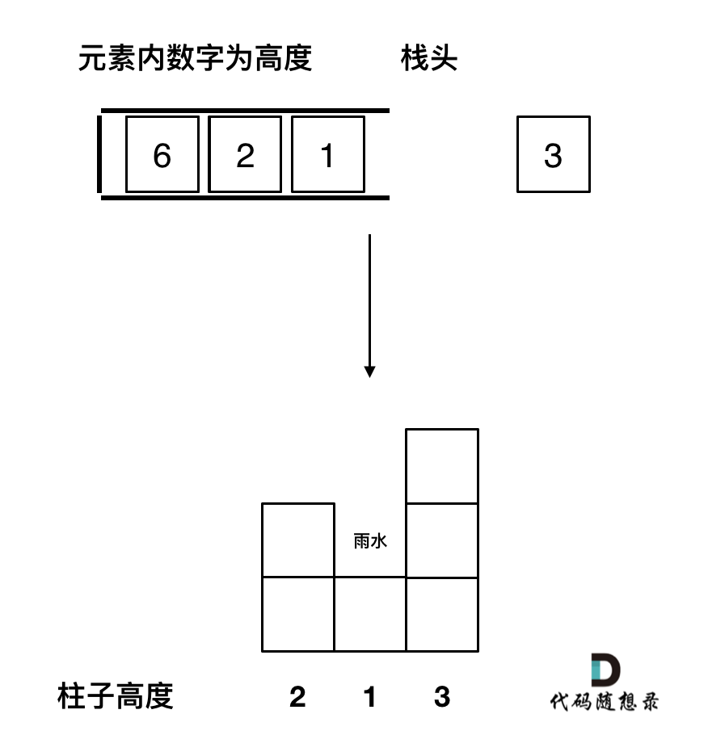

# 单调栈

**通常是一维数组，要寻找任一个元素的右边或者左边第一个比自己大或者小的元素的位置，此时我们就要想到可以用单调栈了**。

时间复杂度为$O(n)$。

那么单调栈的原理是什么呢？为什么时间复杂度是$O(n)$就可以找到每一个元素的右边第一个比它大的元素位置呢？

单调栈的本质是空间换时间，因为在遍历的过程中需要用一个栈来记录右边第一个比当前元素的元素，优点是只需要遍历一次。

在使用单调栈的时候首先要明确如下几点：

1. 单调栈里存放的元素是什么？

单调栈里只需要存放元素的下标i就可以了，如果需要使用对应的元素，直接T[i]就可以获取。

2. 单调栈里元素是递增呢？ 还是递减呢？

## 1、[每日温度](https://leetcode-cn.com/problems/daily-temperatures/)

### 1）题目

给定一个整数数组 temperatures ，表示每天的温度，返回一个数组 answer ，其中 answer[i] 是指在第 i 天之后，才会有更高的温度。如果气温在这之后都不会升高，请在该位置用 0 来代替。

示例 1:

> 输入: temperatures = [73,74,75,71,69,72,76,73]
> 输出: [1,1,4,2,1,1,0,0]

示例 2:

> 输入: temperatures = [30,40,50,60]
> 输出: [1,1,1,0]

示例 3:

> 输入: temperatures = [30,60,90]
> 输出: [1,1,0]


提示：

> 1 <= temperatures.length <= 105
> 30 <= temperatures[i] <= 100
> 通过次数247,811提交次数361,576

### 2）分析：

如本题其实就是找找到一个元素右边第一个比自己大的元素。此时就应该想到用单调栈了。

### 3）题解：

```java
class Solution {
    public int[] dailyTemperatures(int[] temperatures) {
        int n = temperatures.length;
        int[] res = new int[n];
        Stack<Integer> stack = new Stack();
        for(int i = 0 ; i < n ; i ++){
            while(!stack.isEmpty() && temperatures[stack.peek()] < temperatures[i]){
                res[stack.peek()] = i - stack.pop();
            }
            stack.push(i);
        }
        return res;
    }
}
```


## 2、[下一个更大元素I](https://leetcode-cn.com/problems/next-greater-element-i/)

### 1）题目

nums1 中数字 x 的 下一个更大元素 是指 x 在 nums2 中对应位置 右侧 的 第一个 比 x 大的元素。

给你两个 没有重复元素 的数组 nums1 和 nums2 ，下标从 0 开始计数，其中nums1 是 nums2 的子集。

对于每个 0 <= i < nums1.length ，找出满足 nums1[i] == nums2[j] 的下标 j ，并且在 nums2 确定 nums2[j] 的 下一个更大元素 。如果不存在下一个更大元素，那么本次查询的答案是 -1 。

返回一个长度为 nums1.length 的数组 ans 作为答案，满足 ans[i] 是如上所述的 下一个更大元素 。

示例 1：

> 输入：nums1 = [4,1,2], nums2 = [1,3,4,2].
> 输出：[-1,3,-1]
> 解释：nums1 中每个值的下一个更大元素如下所述：
>
> \- 4 ，nums2 = [1,3,4,2]。不存在下一个更大元素，所以答案是 -1 。
>
> \- 1 ，nums2 = [1,3,4,2]。下一个更大元素是 3 。
>
> \- 2 ，nums2 = [1,3,4,2]。不存在下一个更大元素，所以答案是 -1 。

示例 2：

> 输入：nums1 = [2,4], nums2 = [1,2,3,4].
> 输出：[3,-1]
> 解释：nums1 中每个值的下一个更大元素如下所述：
>
> \- 2 ，用加粗斜体标识，nums2 = [1,2,3,4]。下一个更大元素是 3 。
>
> \- 4 ，用加粗斜体标识，nums2 = [1,2,3,4]。不存在下一个更大元素，所以答案是 -1 。
>
>
> 提示：
>
> 1 <= nums1.length <= nums2.length <= 1000
> 0 <= nums1[i], nums2[i] <= 104
> nums1和nums2中所有整数 互不相同
> nums1 中的所有整数同样出现在 nums2 中

### 2）我的题解

```java
class Solution {
    public int[] nextGreaterElement(int[] nums1, int[] nums2) {
        Stack<Integer> stack = new Stack();
        Map<Integer,Integer> map = new HashMap();
        int n1 = nums1.length;
        int n2 = nums2.length;
        int arr[] = new int[n2];
        Arrays.fill(arr,-1);
        for(int i = 0 ; i < n2; i ++){
            map.put(nums2[i],i);
            while(!stack.isEmpty() && nums2[stack.peek()] < nums2[i]){
                arr[stack.pop()] = nums2[i];
            }
            stack.push(i);
        }
        int res[] = new int[n1];
        for(int i = 0; i < n1; i ++){
            res[i] = arr[map.get(nums1[i])];
        }
        return res;
    }
}
```

### 3）官方题解

```java
class Solution {
    public int[] nextGreaterElement(int[] nums1, int[] nums2) {
        Map<Integer, Integer> map = new HashMap<Integer, Integer>();
        Deque<Integer> stack = new ArrayDeque<Integer>();
        for (int i = nums2.length - 1; i >= 0; --i) {
            int num = nums2[i];
            while (!stack.isEmpty() && num >= stack.peek()) {
                stack.pop();
            }
            map.put(num, stack.isEmpty() ? -1 : stack.peek());
            stack.push(num);
        }
        int[] res = new int[nums1.length];
        for (int i = 0; i < nums1.length; ++i) {
            res[i] = map.get(nums1[i]);
        }
        return res;
    }
}

```


## 3、[下一个更大元素II](https://leetcode-cn.com/problems/next-greater-element-ii/)

### 1）题目

给定一个循环数组 nums （ nums[nums.length - 1] 的下一个元素是 nums[0] ），返回 nums 中每个元素的 下一个更大元素 。

数字 x 的 下一个更大的元素 是按数组遍历顺序，这个数字之后的第一个比它更大的数，这意味着你应该循环地搜索它的下一个更大的数。如果不存在，则输出 -1 。

示例 1:

> 输入: nums = [1,2,1]
> 输出: [2,-1,2]
> 解释: 第一个 1 的下一个更大的数是 2；
> 数字 2 找不到下一个更大的数； 
> 第二个 1 的下一个最大的数需要循环搜索，结果也是 2。

示例 2:

> 输入: nums = [1,2,3,4,3]
> 输出: [2,3,4,-1,4]


提示:

> 1 <= nums.length <= 104
> -109 <= nums[i] <= 109

### 2）题解

```java
class Solution {
    public int[] nextGreaterElements(int[] nums) {
        int n = nums.length;
        int[] ret = new int[n];
        Arrays.fill(ret, -1);
        Deque<Integer> stack = new LinkedList<Integer>();
        for (int i = 0; i < n * 2 - 1; i++) {
            while (!stack.isEmpty() && nums[stack.peek()] < nums[i % n]) {
                ret[stack.pop()] = nums[i % n];
            }
            stack.push(i % n);
        }
        return ret;
    }
}

```

## 4*、[接雨水](https://leetcode-cn.com/problems/trapping-rain-water/)

### 1）题目

给定 `n` 个非负整数表示每个宽度为 `1` 的柱子的高度图，计算按此排列的柱子，下雨之后能接多少雨水。

示例 1：


> 输入：height = [0,1,0,2,1,0,1,3,2,1,2,1]
> 输出：6
> 解释：上面是由数组 [0,1,0,2,1,0,1,3,2,1,2,1] 表示的高度图，在这种情况下，可以接 6 个单位的雨水（蓝色部分表示雨水）。

示例 2：

> 输入：height = [4,2,0,3,2,5]
> 输出：9


提示：

> n == height.length
> 1 <= n <= 2 * 104
> 0 <= height[i] <= 105
>

### 2）双指针法

#### 1. 分析：

**按照列来计算的话，宽度一定是1了，我们再把每一列的雨水的高度求出来就可以了。**

可以看出每一列雨水的高度，取决于，该列 左侧最高的柱子和右侧最高的柱子中最矮的那个柱子的高度。

这句话可以有点绕，来举一个理解，例如求列4的雨水高度，如图：


列4 左侧最高的柱子是列3，高度为2（以下用lHeight表示）。

列4 右侧最高的柱子是列7，高度为3（以下用rHeight表示）。

列4 柱子的高度为1（以下用height表示）

那么列4的雨水高度为 列3和列7的高度最小值减列4高度，即： min(lHeight, rHeight) - height。

列4的雨水高度求出来了，宽度为1，相乘就是列4的雨水体积了。

此时求出了列4的雨水体积。

一样的方法，只要从头遍历一遍所有的列，然后求出每一列雨水的体积，相加之后就是总雨水的体积了。

#### 2. 代码：

```java
class Solution {
    public int trap(int[] height) {
        int n = height.length, sum = 0;
        if(n <= 2){
            return 0;
        }
        for(int i = 1; i < n -1; i ++){
            int left = height[i], right = height[i];
            for(int l = i - 1; l >= 0; l --){
                left = Math.max(left,height[l]);
            }
            for(int r = i + 1; r < n; r ++){
                right = Math.max(right,height[r]);
            }
            int h = Math.min(left,right) - height[i];
            if(h > 0){
                sum += h;
            }
        }
        return sum;
    }
}
```

### 3）动态规划法

#### 1. 分析

在上一节的双指针解法中，我们可以看到只要记录左边柱子的最高高度 和 右边柱子的最高高度，就可以计算当前位置的雨水面积，这就是通过列来计算。

当前列雨水面积：min(左边柱子的最高高度，记录右边柱子的最高高度) - 当前柱子高度。

为了得到两边的最高高度，使用了双指针来遍历，每到一个柱子都向两边遍历一遍，这其实是有重复计算的。我们把每一个位置的左边最高高度记录在一个数组上（maxLeft），右边最高高度记录在一个数组上（maxRight）。这样就避免了重复计算，这就用到了动态规划。

当前位置，左边的最高高度是前一个位置的左边最高高度和本高度的最大值。

即从左向右遍历：maxLeft[i] = max(height[i], maxLeft[i - 1]);

从右向左遍历：maxRight[i] = max(height[i], maxRight[i + 1]);

这样就找到递推公式。

#### 2. 代码

```java
class Solution {
    public int trap(int[] height) {
        int n = height.length,sum = 0;
        if(n <= 2){
            return 0;
        }
        int pre[] = new int[n];
        int next[] = new int[n];
        pre[0] = height[0];
        for(int i = 1 ; i < n ; i ++){
            pre[i] = Math.max(pre[i-1],height[i]);
        }
        next[n-1] = height[n-1];
        for(int i = n-2; i >= 0 ; i --){
            next[i] = Math.max(next[i+1],height[i]);
        }
        for(int i = 0 ; i < n ; i ++){
            int h = Math.min(pre[i],next[i]) - height[i];
            if(h > 0){
                sum += h;
            }
        }
        return sum;
    }
}
```

### 4）单调栈

#### 1. 分析

1. 首先单调栈是按照行方向来计算雨水，如图：


2. 使用单调栈内元素的顺序：

从大到小还是从小到大呢？

从栈头（元素从栈头弹出）到栈底的顺序应该是从小到大的顺序。

因为一旦发现添加的柱子高度大于栈头元素了，此时就出现凹槽了，栈头元素就是凹槽底部的柱子，栈头第二个元素就是凹槽左边的柱子，而添加的元素就是凹槽右边的柱子。

如图：



3. 遇到相同高度的柱子怎么办。

遇到相同的元素，更新栈内下标，就是将栈里元素（旧下标）弹出，将新元素（新下标）加入栈中。

例如 5 5 1 3 这种情况。如果添加第二个5的时候就应该将第一个5的下标弹出，把第二个5添加到栈中。

**因为我们要求宽度的时候 如果遇到相同高度的柱子，需要使用最右边的柱子来计算宽度**。

如图所示：


4. 栈里要保存什么数值

是用单调栈，其实是通过 长 * 宽 来计算雨水面积的。

长就是通过柱子的高度来计算，宽是通过柱子之间的下标来计算，

那么栈里有没有必要存一个pair<int, int>类型的元素，保存柱子的高度和下标呢。

其实不用，栈里就存放int类型的元素就行了，表示下标，想要知道对应的高度，通过height[stack.top()] 就知道弹出的下标对应的高度了。

#### 2. 代码

```java
class Solution {
    public int trap(int[] height) {
        int n = height.length, sum = 0;
        if(n <= 2){
            return 0;
        }
        Stack<Integer> stack = new Stack();
        stack.push(0);
        for(int i = 1; i < n; i ++){
            int top = stack.peek();
            if(height[top] == height[i]){
                stack.pop();
                stack.push(i);
            }else if(height[top] > height[i]){
                stack.push(i);
            }else{
                while(!stack.isEmpty() && height[top] < height[i]){
                    int bottom = stack.pop();
                    if(!stack.isEmpty()){
                        int left = stack.peek();
                        int w = i - left - 1;
                        int h = Math.min(height[i],height[left]) - height[bottom];
                        sum += w * h;
                        top = stack.peek();
                    }
                }
                stack.push(i);
            }
            
        }
        return sum;
    }
}
```

## 5、[柱状图中最大的矩形](https://leetcode-cn.com/problems/largest-rectangle-in-histogram/)

给定 n 个非负整数，用来表示柱状图中各个柱子的高度。每个柱子彼此相邻，且宽度为 1 。

求在该柱状图中，能够勾勒出来的矩形的最大面积。

示例 1:


> 输入：heights = [2,1,5,6,2,3]
> 输出：10
> 解释：最大的矩形为图中红色区域，面积为 10

示例 2：


> 输入： heights = [2,4]
> 输出： 4


提示：

> 1 <= heights.length <=105
> 0 <= heights[i] <= 104

### 1）双指针法

```java
class Solution {
    public int largestRectangleArea(int[] heights) {
        int n = heights.length, max = 0;
        for(int i = 0; i < n ; i++){
            int left = i, right = i;
            for(; left >= 0; left--){
                if(heights[left] < heights[i]){
                   break; 
                }
            }
            for(; right < n; right++){
                if(heights[right] < heights[i]){
                    break; 
                }
            }
            int w = right - left - 1;
            max = Math.max(max,w*heights[i]);
        }
        return max;
    }
}
```

如上代码并不能通过leetcode，超时了，因为时间复杂度是$O(n^2)$。

### 2）动态规划法

```java
class Solution {
    public int largestRectangleArea(int[] heights) {
        int length = heights.length;
        int[] minLeftIndex = new int [length];
        int[] maxRigthIndex = new int [length];
        // 记录左边第一个小于该柱子的下标
        minLeftIndex[0] = -1 ;
        for (int i = 1; i < length; i++) {
            int t = i - 1;
            // 这里不是用if，而是不断向右寻找的过程
            while (t >= 0 && heights[t] >= heights[i]) t = minLeftIndex[t];
            minLeftIndex[i] = t;
        }
        // 记录每个柱子 右边第一个小于该柱子的下标
        maxRigthIndex[length - 1] = length;
        for (int i = length - 2; i >= 0; i--) {
            int t = i + 1;
            while(t < length && heights[t] >= heights[i]) t = maxRigthIndex[t];
            maxRigthIndex[i] = t;
        }
        // 求和
        int result = 0;
        for (int i = 0; i < length; i++) {
            int sum = heights[i] * (maxRigthIndex[i] - minLeftIndex[i] - 1);
            result = Math.max(sum, result);
        }
        return result;
    }
}
```

### 3）单调栈法

```java
class Solution {
    int largestRectangleArea(int[] heights) {
        Stack<Integer> st = new Stack<Integer>();
        
        // 数组扩容，在头和尾各加入一个元素
        int [] newHeights = new int[heights.length + 2];
        newHeights[0] = 0;
        newHeights[newHeights.length - 1] = 0;
        for (int index = 0; index < heights.length; index++){
            newHeights[index + 1] = heights[index];
        }

        heights = newHeights;
        
        st.push(0);
        int result = 0;
        // 第一个元素已经入栈，从下标1开始
        for (int i = 1; i < heights.length; i++) {
            // 注意heights[i] 是和heights[st.top()] 比较 ，st.top()是下标
            if (heights[i] > heights[st.peek()]) {
                st.push(i);
            } else if (heights[i] == heights[st.peek()]) {
                st.pop(); // 这个可以加，可以不加，效果一样，思路不同
                st.push(i);
            } else {
                while (heights[i] < heights[st.peek()]) { // 注意是while
                    int mid = st.peek();
                    st.pop();
                    int left = st.peek();
                    int right = i;
                    int w = right - left - 1;
                    int h = heights[mid];
                    result = Math.max(result, w * h);
                }
                st.push(i);
            }
        }
        return result;
    }
}
```

