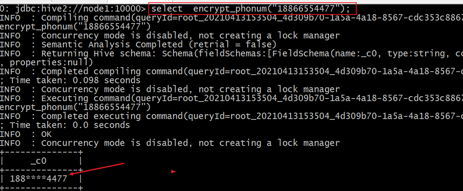
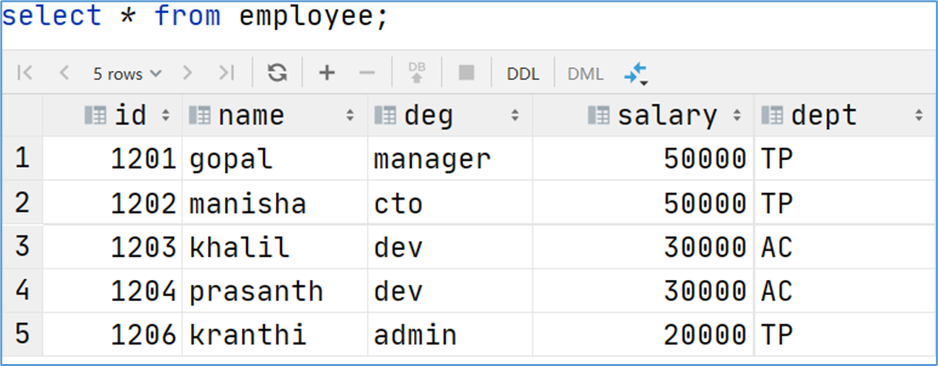

# 一、数据仓库基础与Apache Hive入门

## 1、数据仓库

### 1）数据仓库概念

数据仓库（英语：Data Warehouse，简称数仓、DW）,是一个用于存储、分析、报告的数据系统。数据仓库的目的是构建**面向分析**的集成化数据环境，为企业提供决策支持（Decision Support）。

数据仓库本身并不“生产”任何数据，其数据来源于不同外部系统；同时数据仓库自身也不需要“消费”任何的数据，其结果开放给各个外部应用使用，这也是为什么叫“仓库”，而不叫“工厂”的原因。


### 2）数据仓库为何而来

为了分析数据而来，分析结果给企业决策提供支撑。

#### 1. OLTP环境开展分析可行吗

可以，但是没必要。

信息总是用作两个目的：操作型记录的保存和分析型决策的制定。数据仓库是信息技术长期发展的产物。

OLTP的核心是面向业务，支持业务，支持事务。所有的业务操作可以分为读、写两种操作，一般来说读的压力明显大于写的压力。如果在OLTP环境直接开展各种分析，有以下问题需要考虑：

- 数据分析也是对数据进行读取操作，会让读取压力倍增；
- OLTP仅存储数周或数月的数据；
- 数据分散在不同系统不同表中，字段类型属性不统一；

当分析所涉及数据规模较小的时候，在业务低峰期时可以在OLTP系统上开展直接分析。但是为了更好的进行各种规模的数据分析，同时也不影响OLTP系统运行，此时需要构建一个集成统一的数据分析平台。

该平台的目的很简单：**面向分析，支持分析**。并且和OLTP系统解耦合。

基于这种需求，数据仓库的雏形开始在企业中出现了。

#### 2. 数据仓库的构建

如数仓定义所说,数仓是一个用于存储、分析、报告的数据系统，目的是构建面向分析的集成化数据环境。我们把这种面向分析、支持分析的系统称之为OLAP（联机分析处理）系统。数据仓库是OLAP一种。

### 3）数据仓库主要特征

#### 1. 面向主题性


数据库中，最大的特点是面向应用进行数据的组织，各个业务系统可能是相互分离的。而数据仓库则是面向主题的。主题是一个抽象的概念，是较高层次上企业信息系统中的数据综合、归类并进行分析利用的抽象。在逻辑意义上，它是对应企业中某一宏观分析领域所涉及的分析对象。

操作型处理（传统数据）对数据的划分并不适用于决策分析。而基于主题组织的数据则不同，它们被划分为各自独立的领域，每个领域有各自的逻辑内涵但互不交叉，在抽象层次上对数据进行完整、一致和准确的描述。

#### 2. 集成性


确定主题之后，就需要获取和主题相关的数据。当下企业中主题相关的数据通常会分布在多个操作型系统中，彼此分散、独立、异构。因此在数据进入数据仓库之前，必然要经过统一与综合，对数据进行抽取、清理、转换和汇总，这一步是数据仓库建设中最关键、最复杂的一步，所要完成的工作有：

1. 要统一源数据中所有矛盾之处，如字段的同名异义、异名同义、单位不统一、字长不一致，等等。
2. 进行数据综合和计算。数据仓库中的数据综合工作可以在从原有数据库抽取数据时生成，但许多是在数据仓库内部生成的，即进入数据仓库以后进行综合生成的。

#### 3. 非易失性

数据仓库是分析数据的平台，而不是创造数据的平台。我们是通过数仓去分析数据中的规律，而不是去创造修改其中的规律。因此数据进入数据仓库后，它便稳定且不会改变。

操作型数据库主要服务于日常的业务操作，使得数据库需要不断地对数据实时更新，以便迅速获得当前最新数据，不至于影响正常的业务运作。在数据仓库中只要保存过去的业务数据，不需要每一笔业务都实时更新数据仓库，而是根据商业需要每隔一段时间把一批较新的数据导入数据仓库。

数据仓库的数据反映的是一段相当长的时间内历史数据的内容，是不同时点的数据库快照的集合，以及基于这些快照进行统计、综合和重组的导出数据。

数据仓库的用户对数据的操作大多是数据查询或比较复杂的挖掘，一旦数据进入数据仓库以后，一般情况下被较长时间保留。数据仓库中一般有大量的查询操作，但修改和删除操作很少。

#### 4. 时变性

数据仓库包含各种粒度的历史数据，数据可能与某个特定日期、星期、月份、季度或者年份有关。

虽然数据仓库的用户不能修改数据，但并不是说数据仓库的数据是永远不变的。分析的结果只能反映过去的情况，当业务变化后，挖掘出的模式会失去时效性。因此数据仓库的数据需要随着时间更新，以适应决策的需要。从这个角度讲，数据仓库建设是一个项目，更是一个过程 。

数据仓库的数据随时间的变化表现在以下几个方面：

1. 数据仓库的数据时限一般要远远长于操作型数据的数据时限。
2. 操作型系统存储的是当前数据，而数据仓库中的数据是历史数据。
3. 数据仓库中的数据是按照时间顺序追加的，它们都带有时间属性。

### 4）数据仓库、数据集市

数据仓库是面向整个集团组织的数据，数据集市是面向单个部门使用的。可以认为数据集市是数据仓库的子集，也有人把数据集市叫做小型数据仓库。数据集市通常只涉及一个主题领域，例如市场营销或销售。因为它们较小且更具体，所以它们通常更易于管理和维护，并具有更灵活的结构。


### 5）数据仓库分层架构

#### 1. 数仓分层思想

数据仓库的特点是本身不生产数据，也不最终消费数据。按照数据流入流出数仓的过程进行分层就显得水到渠成。

数据分层每个企业根据自己的业务需求可以分成不同的层次，但是最基础的分层思想，理论上数据分为三个层，操作型数据层（ODS）、数据仓库层(DW)和数据应用层(DA)。


#### 2. 阿里巴巴数仓3层架构


1. **ODS层（Operation Data Store）**：直译：操作型数据层。也称之为源数据层、数据引入层、数据暂存层、临时缓存层。此层存放未经过处理的原始数据至数据仓库系统，结构上与源系统保持一致，是数据仓库的数据准备区。主要完成基础数据引入到数仓的职责，和数据源系统进行解耦合，同时记录基础数据的历史变化。

2. **DW层（Data Warehouse）**：数据仓库层。内部具体包括DIM维度表、DWD和DWS，由ODS层数据加工而成。主要完成数据加工与整合，建立一致性的维度，构建可复用的面向分析和统计的明细事实表，以及汇总公共粒度的指标。

   > *公共维度层（DIM）：基于维度建模理念思想，建立整个企业一致性维度。*
   >
   > *公共汇总粒度事实层（DWS、DWB）：以分析的主题对象作为建模驱动，基于上层的应用和产品的指标需求，构建公共粒度的汇总指标事实表，以宽表化手段物理化模型*
   >
   > *明细粒度事实层（DWD）:* 将明细事实表的某些重要维度属性字段做适当冗余，即宽表化处理。

3. **数据应用层（DA或ADS）**：面向最终用户，面向业务定制提供给产品和数据分析使用的数据。包括前端报表、分析图表、KPI、仪表盘、OLAP专题、数据挖掘等分析。

## 2、Apache Hive入门

### 1）Hive概述

#### 1. 什么是Hive


Apache Hive是一款建立在Hadoop之上的开源数据仓库系统，可以将存储在Hadoop文件中的*结构化、半结构化*数据文件**映射**为一张数据库表，基于表提供了一种类似SQL的查询模型，称为Hive查询语言（HQL），用于访问和分析存储在Hadoop文件中的大型数据集。

Hive核心是将**HQL转换为MapReduce**程序，然后将程序提交到Hadoop群集执行。Hive由Facebook实现并开源。

#### 2. 为什么使用Hive

- 使用Hadoop MapReduce直接处理数据所面临的问题 

  - 人员学习成本太高 需要掌握java语言

  - MapReduce实现复杂查询逻辑开发难度太大 

  - 使用Hive处理数据的好处 

- 操作接口采用类SQL语法，提供快速开发的能力（简单、容易上手）

  - 避免直接写MapReduce，减少开发人员的学习成本 

  - 支持自定义函数，功能扩展很方便

  - 背靠Hadoop，擅长存储分析海量数据集

#### 3. Hive和Hadoop的关系


从功能来说，数据仓库软件，至少需要具备下述两种能力：

1. 存储数据的能力

2. 分析数据的能力

Apache Hive作为一款大数据时代的数据仓库软件，当然也具备上述两种能力。只不过Hive并不是自己实现了上述两种能力，而是借助Hadoop。

**Hive利用HDFS存储数据，利用MapReduce查询分析数据**。

这样突然发现Hive没啥用，不过是套壳Hadoop罢了。其实不然，Hive的最大的魅力在于用户专注于编写HQL，Hive帮您转换成为MapReduce程序完成对数据的分析。

### 2）Hive架构、组件

#### 1. 架构图


#### 2. 组件

- **用户接口**：包括 CLI、JDBC/ODBC、WebGUI。其中，CLI(command line interface)为shell命令行；Hive中的Thrift服务器允许外部客户端通过网络与Hive进行交互，类似于JDBC或ODBC协议。WebGUI是通过浏览器访问Hive。
- **元数据存储**：通常是存储在关系数据库如 mysql/derby中。Hive 中的元数据包括表的名字，表的列和分区及其属性，表的属性（是否为外部表等），表的数据所在目录等。
- **Driver驱动程序**，包括语法解析器、计划编译器、优化器、执行器:完成 HQL 查询语句从词法分析、语法分析、编译、优化以及查询计划的生成。生成的查询计划存储在 HDFS 中，并在随后有执行引擎调用执行。
- **执行引擎**：Hive本身并不直接处理数据文件。而是通过执行引擎处理。当下Hive支持MapReduce、Tez、Spark3种执行引擎。

### 3）Hive数据模型

> 数据模型：用来描述数据、组织数据和对数据进行操作，是对现实世界数据特征的描述。Hive的数据模型类似于RDBMS库表结构，此外还有自己特有模型。
>
> Hive中的数据可以在粒度级别上分为三类：Table 表、Partition分区、Bucket 分桶
>
> 

#### 1. DataBases

Hive作为一个数据仓库，在结构上积极向传统数据库看齐，也分数据库（Schema），每个数据库下面有各自的表组成。默认数据库default。

Hive的数据都是存储在HDFS上的，默认有一个根目录，在hive-site.xml中，由参数`hive.metastore.warehouse.dir`指定。默认值为`/user/hive/warehouse`。

因此，Hive中的数据库在HDFS上的存储路径为：`${hive.metastore.warehouse.dir}/databasename.db`

比如，名为itcast的数据库存储路径为：`/user/hive/warehouse/itcast.db`

#### 2. Tables

Hive表与关系数据库中的表相同。Hive中的表所对应的数据是存储在Hadoop的文件系统中，而表相关的元数据是存储在RDBMS中。

在Hadoop中，数据通常驻留在HDFS中，尽管它可以驻留在任何Hadoop文件系统中，包括本地文件系统或S3。Hive有两种类型的表：

1. Managed Table内部表、托管表
2. External Table外部表

创建表时，默是内部表。Hive中的表的数据在HDFS上的存储路径为：`${hive.metastore.warehouse.dir}/databasename.db/tablename`

比如,itcast的数据库下t_user表存储路径为：`/user/hive/warehouse/itcast.db/t_user`

#### 3. Partitions

Partition分区是hive的一种优化手段表。**分区是指根据分区列（例如“日期day”）的值将表划分为不同分区**。这样可以更快地对指定分区数据进行查询。

分区在存储层面上的表现是:table表目录下以子文件夹形式存在。

一个文件夹表示一个分区。子文件命名标准：**分区列=分区值**

#### 4. Buckets

Bucket分桶表是hive的一种优化手段表。**分桶是指根据表中字段（例如“编号ID”）的值,经过hash计算规则将数据文件划分成指定的若干个小文件**。


分桶规则：hashfunc(ID) % 桶个数，余数相同的分到同一个文件。

分桶的好处是可以优化join查询和方便抽样查询。Bucket分桶表在hdfs中表现为同一个表目录下数据根据hash散列之后变成多个文件。

## 3、Apache Hive 安装部署

### 1）元数据相关名词

#### 1. Metadata

**Metadata即元数据**。元数据包含用Hive创建的database、table、表的位置、类型、属性，字段顺序类型等元信息。元数据存储在关系型数据库中。如hive内置的Derby、或者第三方如MySQL等。

#### 2. Metastore

**Metastore即元数据服务**。Metastore服务的作用是管理metadata元数据，对外暴露服务地址，让各种客户端通过连接metastore服务，由metastore再去连接MySQL数据库来存取元数据。

有了metastore服务，就可以有多个客户端同时连接，而且这些客户端不需要知道MySQL数据库的用户名和密码，只需要连接metastore 服务即可。某种程度上也保证了hive元数据的安全。


### 2）metastore三种配置方式

metastore服务配置有3种模式：**内嵌模式**、**本地模式**、**远程模式**。区分3种配置方式的关键是弄清楚两个问题：

- Metastore服务是否需要单独配置、单独启动？
- Metadata是存储在内置的derby中，还是第三方RDBMS，比如Mysql。


#### 1. 内嵌模式


- **内嵌模式**（Embedded Metastore）是metastore默认部署模式。此种模式下，元数据存储在内置的Derby数据库，并且**Derby数据库和metastore服务都嵌入在主HiveServer进程中**，当启动HiveServer进程时，Derby和metastore都会启动。不需要额外起Metastore服务。
- 但是一次只能支持一个活动用户，适用于测试体验，不适用于生产环境。

#### 2. 本地模式


- **本地模式**（Local Metastore）下，Hive Metastore服务与主HiveServer进程在同一进程中运行，但是存储元数据的数据库在单独的进程中运行，并且可以在单独的主机上。metastore服务将通过JDBC与metastore数据库进行通信。
- 本地模式采用外部数据库来存储元数据，推荐使用MySQL。
- hive根据`hive.metastore.uris` 参数值来判断，**如果为空，则为本地模式**。
- 缺点是：每启动一次hive服务，都内置启动了一个metastore。

#### 3. 远程模式


- **远程模式**（Remote Metastore）下，Metastore服务在其自己的单独JVM上运行，而不在HiveServer的JVM中运行。如果其他进程希望与Metastore服务器通信，则可以使用Thrift Network API进行通信。
- 在生产环境中，建议用远程模式来配置Hive Metastore。在这种情况下，其他依赖hive的软件都可以通过Metastore访问hive。由于还可以完全屏蔽数据库层，因此这也带来了更好的可管理性/安全性。
- 远程模式下，需要配置hive.metastore.uris 参数来指定metastore服务运行的机器ip和端口，并且**需要单独手动启动metastore服务**。

### 3）部署实战

#### 1. 安装前准备

Apache Hive是一款基于Hadoop的数据仓库软件，通常部署运行在Linux系统之上。因此不管使用何种方式配置Hive Metastore，必须要先保证服务器的基础环境正常，Hadoop集群健康可用。

- 服务器基础环境：集群时间同步、防火墙关闭、主机Host映射、免密登录、JDK安装；
- Hadoop集群：启动Hive之前必须先启动Hadoop集群。特别要注意，需等待HDFS安全模式关闭之后再启动运行Hive。

Hive不是分布式安装运行的软件，其分布式的特性主要借由Hadoop完成。包括分布式存储、分布式计算。

#### 2. 内嵌式安装

```shell
# 上传解压安装包
cd /export/server/
tar zxvf apache-hive-3.1.2-bin.tar.gz
mv apache-hive-3.1.2-bin hive

#解决hadoop、hive之间guava版本差异
cd /export/server/hive
rm -rf lib/guava-19.0.jar
cp /export/server/hadoop-3.1.4/share/hadoop/common/lib/guava-27.0-jre.jar ./lib/

#修改hive环境变量文件 添加Hadoop_HOME
cd /export/server/hive/conf/
mv hive-env.sh.template hive-env.sh
vim hive-env.sh
export HADOOP_HOME=/export/server/hadoop-3.1.4
export HIVE_CONF_DIR=/export/server/hive/conf
export HIVE_AUX_JARS_PATH=/export/server/hive/lib

#初始化metadata
cd /export/server/hive
bin/schematool -dbType derby -initSchema

#启动hive服务
bin/hive
```

注意：Hive3版本需要用户手动进行元数据初始化动作。内嵌模式下，判断是否初始化成功的依据是执行命令之后输出信息和执行命令的当前路径下是否有文件产生。


#### 3. 本地模式安装

本地模式和内嵌模式最大的区别就是：本地模式使用mysql来存储元数据。

```shell
# 上传解压安装包
cd /export/server/
tar zxvf apache-hive-3.1.2-bin.tar.gz
mv apache-hive-3.1.2-bin hive

#解决hadoop、hive之间guava版本差异
cd /export/server/hive
rm -rf lib/guava-19.0.jar
cp /export/server/hadoop-3.1.4/share/hadoop/common/lib/guava-27.0-jre.jar ./lib/

#添加mysql jdbc驱动到hive安装包lib/文件下
mysql-connector-java-5.1.32.jar

#修改hive环境变量文件 添加Hadoop_HOME
cd /export/server/hive/conf/
mv hive-env.sh.template hive-env.sh
vim hive-env.sh
export HADOOP_HOME=/export/server/hadoop-3.1.4
export HIVE_CONF_DIR=/export/server/hive/conf
export HIVE_AUX_JARS_PATH=/export/server/hive/lib

#新增hive-site.xml 配置mysql等相关信息
vim hive-site.xml


#初始化metadata
cd /export/server/hive
bin/schematool -initSchema -dbType mysql -verbos
#初始化成功会在mysql中创建74张表

#启动hive服务
bin/hive
```

hive-site.xml

```xml
<configuration>
    <!-- 存储元数据mysql相关配置 -->
    <property>
        <name>javax.jdo.option.ConnectionURL</name>
        <value> jdbc:mysql://node1:3306/hive?createDatabaseIfNotExist=true&amp;useSSL=false&amp;useUnicode=true&amp;characterEncoding=UTF-8</value>
    </property>

    <property>
        <name>javax.jdo.option.ConnectionDriverName</name>
        <value>com.mysql.jdbc.Driver</value>
    </property>

    <property>
        <name>javax.jdo.option.ConnectionUserName</name>
        <value>root</value>
    </property>

    <property>
        <name>javax.jdo.option.ConnectionPassword</name>
        <value>hadoop</value>
    </property>

    <!-- 关闭元数据存储授权  -->
    <property>
        <name>hive.metastore.event.db.notification.api.auth</name>
        <value>false</value>
    </property>

    <!-- 关闭元数据存储版本的验证 -->
    <property>
        <name>hive.metastore.schema.verification</name>
        <value>false</value>
    </property>
</configuration>
```

#### 4. 远程模式安装

```sh
# 上传解压安装包
cd /export/server/
tar zxvf apache-hive-3.1.2-bin.tar.gz
mv apache-hive-3.1.2-bin hive

#解决hadoop、hive之间guava版本差异
cd /export/server/hive
rm -rf lib/guava-19.0.jar
cp /export/server/hadoop-3.1.4/share/hadoop/common/lib/guava-27.0-jre.jar ./lib/

#添加mysql jdbc驱动到hive安装包lib/文件下
mysql-connector-java-5.1.32.jar

#修改hive环境变量文件 添加Hadoop_HOME
cd /export/server/hive/conf/
mv hive-env.sh.template hive-env.sh
vim hive-env.sh
export HADOOP_HOME=/export/server/hadoop-3.1.4
export HIVE_CONF_DIR=/export/server/hive/conf
export HIVE_AUX_JARS_PATH=/export/server/hive/lib

#新增hive-site.xml 配置mysql等相关信息
vim hive-site.xml

#初始化metadata
cd /export/server/hive
bin/schematool -initSchema -dbType mysql -verbos
#初始化成功会在mysql中创建74张表

```

hive-site.xml

```xml
<configuration>
    <!-- 存储元数据mysql相关配置 -->
    <property>
        <name>javax.jdo.option.ConnectionURL</name>
        <value> jdbc:mysql://node1:3306/hive?createDatabaseIfNotExist=true&amp;useSSL=false&amp;useUnicode=true&amp;characterEncoding=UTF-8</value>
    </property>

    <property>
        <name>javax.jdo.option.ConnectionDriverName</name>
        <value>com.mysql.jdbc.Driver</value>
    </property>

    <property>
        <name>javax.jdo.option.ConnectionUserName</name>
        <value>root</value>
    </property>

    <property>
        <name>javax.jdo.option.ConnectionPassword</name>
        <value>hadoop</value>
    </property>

    <!-- H2S运行绑定host -->
    <property>
        <name>hive.server2.thrift.bind.host</name>
        <value>node1</value>
    </property>

    <!-- 远程模式部署metastore 服务地址 -->
    <property>
        <name>hive.metastore.uris</name>
        <value>thrift://node1:9083</value>
    </property>

    <!-- 关闭元数据存储授权  -->
    <property>
        <name>hive.metastore.event.db.notification.api.auth</name>
        <value>false</value>
    </property>

    <!-- 关闭元数据存储版本的验证 -->
    <property>
        <name>hive.metastore.schema.verification</name>
        <value>false</value>
    </property>
</configuration>
```

如果在远程模式下，直接运行hive服务，在执行操作的时候会报错，错误信息如下：


在远程模式下，必须首先启动Hive metastore服务才可以使用hive。因为metastore服务和hive server是两个单独的进程了。

**手动启动Metastore服务**

```sh
#前台启动  关闭ctrl+c
/export/server/hive/bin/hive --service metastore

#后台启动 进程挂起  关闭使用jps + kill
#输入命令回车执行 再次回车 进程将挂起后台
nohup /export/server/hive/bin/hive --service metastore &

#前台启动开启debug日志
/export/server/hive/bin/hive --service metastore --hiveconf hive.root.logger=DEBUG,console
```

后台启动的输出日志信息，在/root目录下，nohup.out。


## 4、客户端的使用

### 1） Hive Client、Hive Beeline Client

Hive发展至今，总共历经了两代客户端工具。

第一代客户端（deprecated不推荐使用）：$HIVE_HOME/bin/hive, 是一个 shellUtil。主要功能：一是可用于以交互或批处理模式运行Hive查询；二是用于Hive相关服务的启动，比如metastore服务。

**第二代客户端（recommended 推荐使用）：$HIVE_HOME/bin/beeline**，是一个JDBC客户端，是官方强烈推荐使用的Hive命令行工具，和第一代客户端相比，性能加强安全性提高。


Beeline Shell在嵌入式模式和远程模式下均可工作。在嵌入式模式下，它运行嵌入式 Hive(类似于Hive Client)，而远程模式下beeline通过 Thrift 连接到单独的 HiveServer2 服务上，这也是官方推荐在生产环境中使用的模式。

那么问题来了，HiveServer2是什么？HiveServer1哪里去了？

### 2）HiveServer、HiveServer2服务

HiveServer、HiveServer2都是Hive自带的两种服务，允许客户端在不启动CLI的情况下对Hive中的数据进行操作，且两个都允许远程客户端使用多种编程语言如java，python等向hive提交请求，取回结果。

但是，HiveServer不能处理多于一个客户端的并发请求。因此在Hive-0.11.0版本中重写了HiveServer代码得到了HiveServer2，进而解决了该问题。HiveServer已经被废弃。

HiveServer2支持多客户端的并发和身份认证，旨在为开放API客户端如JDBC、ODBC提供更好的支持。

### 3）Hive服务和客户端关系梳理

HiveServer2通过Metastore服务读写元数据。所以在远程模式下，启动HiveServer2之前必须先首先启动metastore服务。

特别注意：远程模式下，Beeline客户端只能通过HiveServer2服务访问Hive。而Hive Client是通过Metastore服务访问的。具体关系如下：


### 4）Hive Client使用

在hive安装包的bin目录下，有hive提供的第一代客户端 `bin/hive`。该客户端可以访问hive的metastore服务，从而达到操作hive的目的。

> **友情提示**：如果您是远程模式部署，请手动启动运行metastore服务。如果是内嵌模式和本地模式，直接运行`bin/hive`，metastore服务会内嵌一起启动。

可以直接在启动Hive metastore服务的机器上使用bin/hive客户端操作，此时不需要进行任何配置。

```sh
#远程模式 首先启动metastore服务
/export/server/hive/bin/hive --service metastore
#克隆CRT会话窗口 使用hive client连接
/export/server/hive/bin/hive
```

如果需要在其他机器上通过bin/hive访问hive metastore服务，只需要在该机器的hive-site.xml配置中添加metastore服务地址即可。

```sh
#上传hive安装包到另一个机器上，比如node3：
cd /export/server/
tar zxvf apache-hive-3.1.2-bin.tar.gz
mv apache-hive-3.1.2-bin hive

#解决hadoop、hive之间guava版本差异
cd /export/server/hive/
rm -rf lib/guava-19.0.jar
cp /export/server/hadoop-3.1.4/share/hadoop/common/lib/guava-27.0-jre.jar ./lib/

#修改hive环境变量文件 添加Hadoop_HOME
cd /export/server/hive/conf
mv hive-env.sh.template hive-env.sh
vim hive-env.sh
export HADOOP_HOME=/export/server/hadoop-3.1.4

#添加metastore服务地址
cd /export/server/hive/conf/
vim  hive-site.xml

<configuration>
    <property>
        <name>hive.metastore.uris</name>
        <value>thrift://node1:9083</value>
    </property>
</configuration>
```

### 5）Hive Beeline Client使用

beeline客户端无法直接访问metastore服务的，**需要单独启动hiveserver2服务**。

在hive运行的服务器上，首先启动metastore服务，然后启动hiveserver2服务。

```sh
#先启动metastore服务 然后启动hiveserver2服务
nohup /export/server/hive/bin/hive --service metastore &
nohup /export/server/hive/bin/hive --service hiveserver2 &
```

在node3上使用beeline客户端进行连接访问。需要注意hiveserver2服务启动之后需要稍等一会才可以对外提供服务。

Beeline是JDBC的客户端，通过JDBC协议和Hiveserver2服务进行通信，协议的地址是：**jdbc:hive2://node1:10000**

```sh
[root@node3 ~]# /export/server/hive/bin/beeline 
Beeline version 3.1.2 by Apache Hive
beeline> ! connect jdbc:hive2://node1:10000				#访问HiveServer2协议
Connecting to jdbc:hive2://node1:10000
Enter username for jdbc:hive2://node1:10000: root
Enter password for jdbc:hive2://node1:10000: 
Connected to: Apache Hive (version 3.1.2)
Driver: Hive JDBC (version 3.1.2)
Transaction isolation: TRANSACTION_REPEATABLE_READ
0: jdbc:hive2://node1:10000> 
```


# 二、HiveSQL数据定义语言

## 1、建表基础

### 1）完整建表语法树


- **蓝色**字体是建表语法的关键字，用于指定某些功能。
- **[]**中括号的语法表示可选。
- **|**表示使用的时候，左右语法二选一。
- 建表语句中的语法顺序要和上述语法规则保持一致。

### 2）数据类型

#### 1. 原生数据类型


#### 2. 复杂数据类型


#### 3. 数据类型隐式、显示转换

与SQL类似，HQL支持隐式和显式类型转换。 

原生类型从窄类型到宽类型的转换称为隐式转换，反之，则不允许。

下表描述了类型之间允许的隐式转换：


显式类型转换使用CAST函数。

例如，CAST（'100'as INT）会将100字符串转换为100整数值。 如果强制转换失败，例如CAST（'INT'as INT），该函数返回NULL。

> **注意**
>
> - 英文字母大小写不敏感；
> - 除SQL数据类型外，还支持Java数据类型，比如：string；
> - int和string是使用最多的，大多数函数都支持；
> - 复杂数据类型的使用通常需要和分隔符指定语法配合使用。
> - 如果定义的数据类型和文件不一致，hive会尝试隐式转换，但是不保证成功。

### 3）读写文件机制

#### 1. SerDe是什么

SerDe是Serializer、Deserializer的简称，目的是用于序列化和反序列化。序列化是对象转化为字节码的过程；而反序列化是字节码转换为对象的过程。

Hive使用SerDe（和FileFormat）读取和写入行对象。


需要注意的是，“key”部分在读取时会被忽略，而在写入时key始终是常数。基本上**行对象存储在“value”中**。

#### 2. Hive读写文件流程

**Hive**读取文件机制：首先调用InputFormat（默认TextInputFormat），返回一条一条kv键值对记录（默认是一行对应一条记录）。然后调用SerDe（默认LazySimpleSerDe）的Deserializer，将一条记录中的value根据分隔符切分为各个字段。

**Hive**写文件机制：将Row写入文件时，首先调用SerDe（默认LazySimpleSerDe）的Serializer将对象转换成字节序列，然后调用OutputFormat将数据写入HDFS文件中。

#### 3. ROW FORMAT相关语法

在Hive的建表语句中，和ROW FORMAT相关的语法为：


其中ROW FORMAT是语法关键字，DELIMITED和SERDE二选其一。

如果使用delimited表示使用默认的`LazySimpleSerDe类`来处理数据。


> hive建表时如果没有row format语法。此时**字段之间默认的分割符是'\001'**，是一种特殊的字符，使用的是ascii编码的值，键盘是打不出来的。

如果数据文件格式比较特殊可以使用`ROW FORMAT SERDE serde_name`指定其他的Serde类来处理数据,甚至支持用户自定义SerDe类。

### 4）文件存储路径

#### 1. 默认存储路径

Hive表默认存储路径是由${HIVE_HOME}/conf/hive-site.xml配置文件的hive.metastore.warehouse.dir属性指定。默认值是：/user/hive/warehouse。


在该路径下，文件将根据所属的库、表，有规律的存储在对应的文件夹下。


#### 2. 指定存储路径

在Hive建表的时候，可以通过**location语法来更改数据在HDFS上的存储路径**，使得建表加载数据更加灵活方便。

语法：`LOCATION '<hdfs_location>'`。

对于已经生成好的数据文件，使用location指定路径将会很方便。

## 2、建表高阶

### 1）内、外部表

**内部表（Internal table）**也称为被Hive拥有和管理的托管表（Managed table）。默认情况下创建的表就是内部表，Hive拥有该表的结构和文件。当删除内部表时，它会删除数据以及表的元数据。

**外部表（External table）**中的数据不是Hive拥有或管理的，只管理表元数据的生命周期。要创建一个外部表，需要使用EXTERNAL语法关键字。删除外部表只会删除元数据，而不会删除实际数据。在Hive外部仍然可以访问实际数据。

可以使用DESC FORMATTED itcast. student_ext;来获取表的描述信息，从中可以看出表的类型：


> **内部表和外部表区别**
>
> 
>
> **如何选择内部表、外部表**
>
> 1. 当需要通过Hive完全管理控制表的整个生命周期时，请使用内部表。
> 2. 当文件已经存在或位于远程位置时，请使用外部表，因为即使删除表，文件也会被保留。

### 2）分区表

#### 1. 概念

当Hive表对应的数据量大、文件多时，为了避免查询时全表扫描数据，Hive支持根据用户指定的字段进行分区，分区的字段可以是日期、地域、种类等具有标识意义的字段。比如把一整年的数据根据月份划分12个月（12个分区），后续就可以查询指定月份分区的数据，尽可能避免了全表扫描查询。


#### 2. 建表语法

```hive
CREATE TABLE table_name (column1 data_type, column2 data_type) 
PARTITIONED BY (partition1 data_type, partition2 data_type,….);
```

需要注意：分区字段不能是表中已经存在的字段，因为分区字段最终也会以虚拟字段的形式显示在表结构上。

#### 3. 数据加载 - 静态分区

所谓**静态分区**指的是分区的字段值是由用户在加载数据的时候手动指定的。

语法如下：

```hive
load data [local] inpath ' ' into table tablename partition(分区字段='分区值'...);
```

Local表示数据是位于本地文件系统还是HDFS文件系统。

**举例：**

静态加载数据操作如下，文件都位于Hive服务器所在机器本地文件系统上。


```hive
load data local inpath '/root/hivedata/archer.txt' into table t_all_hero_part partition(role='sheshou');
load data local inpath '/root/hivedata/assassin.txt' into table t_all_hero_part partition(role='cike');
load data local inpath '/root/hivedata/mage.txt' into table t_all_hero_part partition(role='fashi');
load data local inpath '/root/hivedata/support.txt' into table t_all_hero_part partition(role='fuzhu');
load data local inpath '/root/hivedata/tank.txt' into table t_all_hero_part partition(role='tanke');
load data local inpath '/root/hivedata/warrior.txt' into table t_all_hero_part partition(role='zhanshi');
```

#### 4. 数据加载 -动态分区

所谓**动态分区**指的是分区的字段值是基于查询结果自动推断出来的。核心语法就是insert+select。

启用hive动态分区，需要在hive会话中设置两个参数：

```sql
#开启动态分区功能
set hive.exec.dynamic.partition=true;	

#指定动态分区的模式:分为nonstick非严格模式和strict严格模式。strict严格模式要求至少有一个分区为静态分区。
set hive.exec.dynamic.partition.mode=nonstrict;		 
```

**举例**

创建一张新的分区表**t_all_hero_part_dynamic**

```sql
create table t_all_hero_part_dynamic(
         id int,
         name string,
         hp_max int,
         mp_max int,
         attack_max int,
         defense_max int,
         attack_range string,
         role_main string,
         role_assist string
) partitioned by (role string)
row format delimited
fields terminated by "\t";
```

执行动态分区插入

```sql
insert into table t_all_hero_part_dynamic 
partition(role) select tmp.*,tmp.role_main from t_all_hero tmp; #tmp表为全表信息
```

动态分区插入时，分区值是根据查询返回字段位置自动推断的。

#### 5. 本质

分区的概念提供了一种将Hive表数据分离为多个文件/目录的方法。**不同分区对应着不同的文件夹，同一分区的数据存储在同一个文件夹下**。只需要根据分区值找到对应的文件夹，扫描本分区下的文件即可，避免全表数据扫描。

> **注意：**
>
> - 分区表不是建表的必要语法规则，是一种**优化手段**表，可选；
> - 分区**字段不能是表中已有的字段**，不能重复；
> - 分区字段是**虚拟字段**，其数据并不存储在底层的文件中；
> - 分区字段值的确定来自于用户价值数据手动指定（**静态分区**）或者根据查询结果位置自动推断（**动态分区**）
> - Hive**支持多重分区**，也就是说在分区的基础上继续分区，划分更加细粒度

### 3）分桶表

#### 1. 概念

一种用于优化查询而设计的表类型。该功能可以让数据分解为若干个部分易于管理。

在分桶时，我们要指定根据哪个字段将数据分为几桶（几个部分）。默认规则是：Bucket number = hash_function(bucketing_column) mod num_buckets。

可以发现桶编号相同的数据会被分到同一个桶当中。

#### 2. 语法

```hive
--分桶表建表语句
CREATE [EXTERNAL] TABLE [db_name.]table_name
[(col_name data_type, ...)]
CLUSTERED BY (col_name)
INTO N BUCKETS;
```

其中CLUSTERED BY (col_name)表示根据哪个字段进行分；

INTO N BUCKETS表示分为几桶（也就是几个部分）。

需要注意的是，分桶的字段必须是表中已经存在的字段。

#### 3. 优点

和非分桶表相比，分桶表的使用好处有以下几点：

1. 基于分桶字段查询时，减少全表扫描；

2. JOIN时可以提高MR程序效率，减少笛卡尔积数量；

   对于JOIN操作两个表有一个相同的列，如果对这两个表都进行了分桶操作。那么将保存相同列值的桶进行JOIN操作就可以，可以大大较少JOIN的数据量。

3. 分桶表数据进行抽样。

   当数据量特别大时，对全体数据进行处理存在困难时，抽样就显得尤其重要了。抽样可以从被抽取的数据中估计和推断出整体的特性，是科学实验、质量检验、社会调查普遍采用的一种经济有效的工作和研究方法。

### 4）事务表

#### 1. 背景知识

Hive本身从设计之初时，就是不支持事务的，因为**Hive的核心目标**是将已经存在的结构化数据文件映射成为表，然后提供基于表的SQL分析处理，是一款**面向分析**的工具。且映射的数据通常存储于HDFS上，而HDFS是不支持随机修改文件数据的。

这个定位就意味着在早期的Hive的SQL语法中是没有update，delete操作的，也就没有所谓的事务支持了，因为都是select查询分析操作。

从Hive0.14版本开始，具有ACID语义的事务已添加到Hive中，以解决以下场景下遇到的问题：

- **流式传输数据**。使用如Apache Flume或Apache Kafka之类的工具将数据流式传输到Hadoop集群中。虽然这些工具可以每秒数百行或更多行的速度写入数据，但是Hive只能每隔15分钟到一个小时添加一次分区。频繁添加分区会很快导致表中大量的分区。因此通常使用这些工具将数据流式传输到现有分区中，但是这会使读者感到脏读（也就是说，他们将在开始查询后看到写入的数据），并将许多小文件留在目录中，这将给NameNode带来压力。通过事务功能，同时允许读者获得一致的数据视图并避免过多的文件。
- **尺寸变化缓慢**。在典型的星型模式数据仓库中，维度表随时间缓慢变化。例如，零售商将开设新商店，需要将其添加到商店表中，或者现有商店可能会更改其平方英尺或某些其他跟踪的特征。这些更改导致插入单个记录或更新 记录（取决于所选策略）。
- **数据重述**。有时发现收集的数据不正确，需要更正。从Hive 0.14开始，可以通过INSERT，UPDATE和 DELETE支持这些用例 。

#### 2. 局限性

Hive的设计目标不是为了支持事务操作，而是支持分析操作，且最终基于HDFS的底层存储机制使得文件的增加删除修改操作需要动一些小心思。具体限制如下：

- 尚不支持BEGIN，COMMIT和ROLLBACK。所有语言操作都是自动提交的。
- 仅支持**ORC文件格式（STORED AS ORC）**。
- 默认情况下事务配置为关闭。需要**配置参数开启**使用。
- 表必须是**分桶表（Bucketed）**才可以使用事务功能。
- 表参数**transactional必须为true**；
- 外部表不能成为ACID表，不允许从非ACID会话读取/写入ACID表。

#### 3. 案例

如果不做任何配置修改，直接针对Hive中已有的表进行Update、Delete、Insert操作，可以发现，只有insert语句可以执行，Update和Delete操作会报错。


Insert插入操作能够成功的原因在于，底层是直接把数据写在一个新的文件中的。

下面看一下如何在Hive中配置开启事务表，并且进行操作

```hive
--Hive中事务表的创建使用
--1、开启事务配置（可以使用set设置当前session生效 也可以配置在hive-site.xml中）
set hive.support.concurrency = true; --Hive是否支持并发
set hive.enforce.bucketing = true; --从Hive2.0开始不再需要  是否开启分桶功能
set hive.exec.dynamic.partition.mode = nonstrict; --动态分区模式  非严格
set hive.txn.manager = org.apache.hadoop.hive.ql.lockmgr.DbTxnManager; --
set hive.compactor.initiator.on = true; --是否在Metastore实例上运行启动线程和清理线程
set hive.compactor.worker.threads = 1; --在此metastore实例上运行多少个压缩程序工作线程。

--2、创建Hive事务表
create table trans_student(
    id int,
    name String,
    age int
)clustered by (id) into 2 buckets stored as orc TBLPROPERTIES('transactional'='true');

--3、针对事务表进行insert update delete操作
insert into trans_student (id, name, age)
values (1,"allen",18);

update trans_student
set age = 20
where id = 1;

delete from trans_student where id =1;

select *
from trans_student;
```

### 5）视图

#### 1. 概念

视图是用来简化操作的，它其实是一张虚表，在视图中不缓冲记录，也没有提高查询性能。

#### 2. 相关语法

```hive
--hive中有一张真实的基础表t_usa_covid19
select *
from itcast.t_usa_covid19;

--1、创建视图
create view v_usa_covid19 as select count_date, county,state,deaths from t_usa_covid19 limit 5;

--能否从已有的视图中创建视图呢  可以的
create view v_usa_covid19_from_view as select * from v_usa_covid19 limit 2;

--2、显示当前已有的视图 
show tables;
show views;--hive v2.2.0之后支持

--3、视图的查询使用
select *
from v_usa_covid19;

--能否插入数据到视图中呢？
--不行 报错  SemanticException:A view cannot be used as target table for LOAD or INSERT
insert into v_usa_covid19 select count_date,county,state,deaths from t_usa_covid19;

--4、查看视图定义
show create table v_usa_covid19;

--5、删除视图
drop view v_usa_covid19_from_view;
--6、更改视图属性
alter view v_usa_covid19 set TBLPROPERTIES ('comment' = 'This is a view');
--7、更改视图定义
alter view v_usa_covid19 as  select county,deaths from t_usa_covid19 limit 2;
```

#### 3. 优点

1. 将真实表中特定的列数据提供给用户，保护数据隐式
2. 降低查询的复杂度，优化查询语句

### 6）物化视图

#### 1. 概念

物化视图（Materialized View）是一个包括查询结果的数据库对像，可以用于**预先计算并保存表连接或聚集等耗时较多的操作的结果**。

Hive引入物化视图的目的就是为了优化数据查询访问的效率,相当于从数据预处理的角度优化数据访问。

> **物化视图和视图的区别：**
>
> - 视图是虚拟的，逻辑存在的，只有定义没有存储数据。
> - 物化视图是真实的，物理存在的，里面存储着预计算的数据。
>
> - 不同于视图，物化视图能够缓存数据，在创建物化视图的时候就把数据缓存起来了，hive把物化视图当成一张“表”，将数据缓存。而视图只是创建一个虚表，只有表结构，没有数据，实际查询的时候再去改写SQL去访问实际的数据表。
> - 视图的目的是简化降低查询的复杂度，而物化视图的目的是提高查询性能。

#### 2. 语法

```hive
--物化视图的创建语法
CREATE MATERIALIZED VIEW [IF NOT EXISTS] [db_name.]materialized_view_name
    [DISABLE REWRITE]
    [COMMENT materialized_view_comment]
    [PARTITIONED ON (col_name, ...)]
    [CLUSTERED ON (col_name, ...) | DISTRIBUTED ON (col_name, ...) SORTED ON (col_name, ...)]
    [
    [ROW FORMAT row_format]
    [STORED AS file_format]
    | STORED BY 'storage.handler.class.name' [WITH SERDEPROPERTIES (...)]
  ]
  [LOCATION hdfs_path]
  [TBLPROPERTIES (property_name=property_value, ...)]
AS SELECT ...;
```

语法说明：

- 物化视图创建后，select查询执行数据自动落地，"自动"也即在query的执行期间，任何用户对该物化视图是不可见的
- 默认该物化视图可被用于查询优化器optimizer查询重写（在物化视图创建期间可以通过DISABLE REWRITE参数设置禁止使用）
- SerDe和storage format非强制参数，可以用户配置，默认可用hive.materializedview.serde、 hive.materializedview.fileformat
- 物化视图可以使用custom storage handlers存储在外部系统（如druid）


## 3、其他语法

### 1）Database DDL操作

> Hive中 DATABASE的概念和RDBMS中类似，我们称之为数据库。
>
> 在Hive中， DataBase和Schema是可互换的，使用DATABASE或SCHEMA都可以

#### 1. Create databas

```hive
CREATE (DATABASE|SCHEMA) [IF NOT EXISTS] database_name
[COMMENT database_comment]
[LOCATION hdfs_path]
[WITH DBPROPERTIES (property_name=property_value, ...)];
```

- **COMMENT**：数据库的注释说明语句
- **LOCATION**：指定数据库在HDFS存储位置，默认/user/hive/warehouse
- **WITH DBPROPERTIES**：用于指定一些数据库的属性配置。

#### 2. Describe database

Hive中的**DESCRIBE DATABASE**语句用于显示Hive中数据库的名称，其注释（如果已设置）及其在文件系统上的位置等信息。

```hive
DESCRIBE DATABASE/SCHEMA [EXTENDED] db_name;
```

**EXTENDED**：用于显示更多信息。

#### 3. Use database

Hive中的**USE DATABASE**语句用于选择特定的数据库,切换当前会话使用哪一个数据库进行操作。

```hive
USE database_name;
```

#### 4. Drop database

Hive中的**DROP DATABASE**语句用于删除（删除）数据库。

默认行为是RESTRICT，这意味着仅在数据库为空时才删除它。要删除带有表的数据库，我们可以使用**CASCADE**。

```hive
DROP (DATABASE|SCHEMA) [IF EXISTS] database_name [RESTRICT|CASCADE];
```

#### 5. Alter database

Hive中的**ALTER DATABASE**语句用于更改与Hive中的数据库关联的元数据。

```hive
--更改数据库属性
ALTER (DATABASE|SCHEMA) database_name SET DBPROPERTIES (property_name=property_value, ...);

--更改数据库所有者
ALTER (DATABASE|SCHEMA) database_name SET OWNER [USER|ROLE] user_or_role;

--更改数据库位置
ALTER (DATABASE|SCHEMA) database_name SET LOCATION hdfs_path;
```

### 2）Table DDL操作

#### 1. Describe table

Hive中的**DESCRIBE table**语句用于显示Hive中表的元数据信息。

```hive
describe formatted [db_name.]table_name;
describe extended [db_name.]table_name;
```

如果指定了EXTENDED关键字，则它将以Thrift序列化形式显示表的所有元数据。如果指定了FORMATTED关键字，则它将以表格格式显示元数据。


#### 2. Drop Table

DROP TABLE删除该表的元数据和数据。如果已配置垃圾桶（且未指定PURGE），则该表对应的数据实际上将移动到.Trash/Current目录，而元数据完全丢失。删除EXTERNAL表时，该表中的数据不会从文件系统中删除，只删除元数据。

如果指定了PURGE，则表数据不会进入.Trash/Current目录，跳过垃圾桶直接被删除。因此如果DROP失败，则无法挽回该表数据。

```hive
DROP TABLE [IF EXISTS] table_name [PURGE];    -- (Note: PURGE available in Hive 0.14.0 and later)
```

#### 3. Truncate Table

从表中删除所有行。可以简单理解为清空表的所有数据但是保留表的元数据结构。如果HDFS启用了垃圾桶，数据将被丢进垃圾桶，否则将被删除。

```hive
TRUNCATE [TABLE] table_name;
```

#### 4. Alter Table

```hive
--1、更改表名
ALTER TABLE table_name RENAME TO new_table_name;

--2、更改表属性
ALTER TABLE table_name SET TBLPROPERTIES (property_name = property_value, ... );
--更改表注释
ALTER TABLE student SET TBLPROPERTIES ('comment' = "new comment for student table");

--3、更改SerDe属性
ALTER TABLE table_name SET SERDE serde_class_name [WITH SERDEPROPERTIES (property_name = property_value, ... )];
ALTER TABLE table_name [PARTITION partition_spec] SET SERDEPROPERTIES serde_properties;
ALTER TABLE table_name SET SERDEPROPERTIES ('field.delim' = ',');
--移除SerDe属性
ALTER TABLE table_name [PARTITION partition_spec] UNSET SERDEPROPERTIES (property_name, ... );

--4、更改表的文件存储格式 该操作仅更改表元数据。现有数据的任何转换都必须在Hive之外进行。
ALTER TABLE table_name  SET FILEFORMAT file_format;

--5、更改表的存储位置路径
ALTER TABLE table_name SET LOCATION "new location";

--6、更改列名称/类型/位置/注释
CREATE TABLE test_change (a int, b int, c int);
// First change column a's name to a1.
ALTER TABLE test_change CHANGE a a1 INT;
// Next change column a1's name to a2, its data type to string, and put it after column b.
ALTER TABLE test_change CHANGE a1 a2 STRING AFTER b;
// The new table's structure is:  b int, a2 string, c int.
// Then change column c's name to c1, and put it as the first column.
ALTER TABLE test_change CHANGE c c1 INT FIRST;
// The new table's structure is:  c1 int, b int, a2 string.
// Add a comment to column a1
ALTER TABLE test_change CHANGE a1 a1 INT COMMENT 'this is column a1';

--7、添加/替换列
--使用ADD COLUMNS，您可以将新列添加到现有列的末尾但在分区列之前。
--REPLACE COLUMNS 将删除所有现有列，并添加新的列集。
ALTER TABLE table_name ADD|REPLACE COLUMNS (col_name data_type,...);
```

### 3）分区 DDL操作

#### 1. Add partition

分区值仅在为字符串时才应加引号。位置必须是数据文件所在的目录。

ADD PARTITION会更改表元数据，但不会加载数据。如果分区位置中不存在数据，查询将不会返回任何结果。

```hive
--1、增加分区
ALTER TABLE table_name ADD PARTITION (dt='20170101') location
    '/user/hadoop/warehouse/table_name/dt=20170101'; 
--一次添加一个分区

ALTER TABLE table_name ADD PARTITION (dt='2008-08-08', country='us') location '/path/to/us/part080808'
                       PARTITION (dt='2008-08-09', country='us') location '/path/to/us/part080809';  
--一次添加多个分区
```

#### 2. rename partition

```hive
--2、重命名分区
ALTER TABLE table_name PARTITION partition_spec RENAME TO PARTITION partition_spec;
ALTER TABLE table_name PARTITION (dt='2008-08-09') RENAME TO PARTITION (dt='20080809');
```

#### 3. delete partition

可以使用ALTER TABLE DROP PARTITION删除表的分区。这将删除该分区的数据和元数据。

```hive
--3、删除分区
ALTER TABLE table_name DROP [IF EXISTS] PARTITION (dt='2008-08-08', country='us');
ALTER TABLE table_name DROP [IF EXISTS] PARTITION (dt='2008-08-08', country='us') PURGE; --直接删除数据 不进垃圾桶
```

#### 4. msck partition

Hive将每个表的分区列表信息存储在其metastore中。但是，如果将新分区直接添加到HDFS（例如通过使用hadoop fs -put命令）或从HDFS中直接删除分区文件夹，则除非用户ALTER TABLE table_name ADD/DROP PARTITION在每个新添加的分区上运行命令，否则metastore（也就是Hive）将不会意识到分区信息的这些更改。

但是，用户可以使用修复表选项运行metastore check命令。

```hive
--修复分区
MSCK [REPAIR] TABLE table_name [ADD/DROP/SYNC PARTITIONS];
```

MSC命令的默认选项是“添加分区”。使用此选项，它将把HDFS上存在但元存储中不存在的所有分区添加到元存储中。DROP PARTITIONS选项将从已经从HDFS中删除的metastore中删除分区信息。SYNC PARTITIONS选项等效于调用ADD和DROP PARTITIONS。

如果存在大量未跟踪的分区，则可以批量运行MSCK REPAIR TABLE，以避免OOME（内存不足错误）。

#### 5. Alter partition

```hive
--5、修改分区
--更改分区文件存储格式
ALTER TABLE table_name PARTITION (dt='2008-08-09') SET FILEFORMAT file_format;
--更改分区位置
ALTER TABLE table_name PARTITION (dt='2008-08-09') SET LOCATION "new location";
```

## 4、SHOW语法

Show相关的语句提供了一种查询Hive metastore的方法。可以帮助用户查询相关信息。

```hive
--1、显示所有数据库 SCHEMAS和DATABASES的用法 功能一样
show databases;
show schemas;

--2、显示当前数据库所有表/视图/物化视图/分区/索引
show tables;
SHOW TABLES [IN database_name]; --指定某个数据库

--3、显示当前数据库下所有视图
Show Views;
SHOW VIEWS 'test_*'; -- show all views that start with "test_"
SHOW VIEWS FROM test1; -- show views from database test1
SHOW VIEWS [IN/FROM database_name];

--4、显示当前数据库下所有物化视图
SHOW MATERIALIZED VIEWS [IN/FROM database_name];

--5、显示表分区信息，分区按字母顺序列出，不是分区表执行该语句会报错
show partitions table_name;

--6、显示表/分区的扩展信息
SHOW TABLE EXTENDED [IN|FROM database_name] LIKE table_name;
show table extended like student;

--7、显示表的属性信息
SHOW TBLPROPERTIES table_name;
show tblproperties student;

--8、显示表、视图的创建语句
SHOW CREATE TABLE ([db_name.]table_name|view_name);
show create table student;

--9、显示表中的所有列，包括分区列。
SHOW COLUMNS (FROM|IN) table_name [(FROM|IN) db_name];
show columns  in student;

--10、显示当前支持的所有自定义和内置的函数
show functions;

--11、Describe desc
--查看表信息
desc extended table_name;
--查看表信息（格式化美观）
desc formatted table_name;
--查看数据库相关信息
describe database database_name;
```

# 三、HiveSQL 数据操控 DML

## 1、Load加载数据

在将数据load加载到表中时，Hive不会进行任何转换。

加载操作是将数据文件移动到与Hive表对应的位置的纯复制/移动操作。

```hive
LOAD DATA [LOCAL] INPATH 'filepath' [OVERWRITE] INTO TABLE tablename [PARTITION (partcol1=val1, partcol2=val2 ...)]

-- (3.0 or later)
LOAD DATA [LOCAL] INPATH 'filepath' [OVERWRITE] INTO TABLE tablename [PARTITION (partcol1=val1, partcol2=val2 ...)] [INPUTFORMAT 'inputformat' SERDE 'serde']
```

### 1）filepath

filepath表示的待移动数据的路径，可以引用一个文件（在这种情况下，Hive将文件移动到表中），也可以是一个目录（在这种情况下，Hive将把该目录中的所有文件移动到表中）。

相对路径，例如：project/data1 

绝对路径，例如：/user/hive/project/data1 

具有schema的完整URI，例如：hdfs://namenode:9000/user/hive/project/data1

### 2）LOCAL

如果指定了LOCAL， load命令将在本地文件系统中查找文件路径。如果指定了相对路径，它将相对于用户的当前工作目录进行解释。用户也可以为本地文件指定完整的URI-例如：`file:///user/hive/project/data1`。

> **注意**
>
> - 如果对HiveServer2服务运行此命令。这里的**本地文件系统指的是Hiveserver2服务所在机器的本地Linux文件系统**，不是Hive客户端所在的本地文件系统。
> - 如果没有指定LOCAL关键字，如果filepath指向的是一个完整的URI，hive会直接使用这个URI。 否则如果没有指定schema或者authority，Hive会使用在hadoop配置文件中定义的schema 和 authority，即参数fs.default.name指定的（不出意外，都是HDFS）

### 3）OVERWRITE 

如果使用了OVERWRITE关键字，则目标表（或者分区）中的内容会被删除，然后再将 filepath 指向的文件/目录中的内容添加到表/分区中。

### 4）3.0新特性

Hive 3.0及更高版本中，除了移动复制操作之外，还支持其他加载操作，因为Hive在内部在某些场合下会将加载重写为INSERT AS SELECT。

比如，如果表具有分区，则load命令没有指定分区，则将load转换为INSERT AS SELECT，并假定最后一组列为分区列。如果文件不符合预期的架构，它将引发错误。

```hive
-------hive 3.0 load命令新特性------------------
CREATE TABLE if not exists tab1 (col1 int, col2 int)
PARTITIONED BY (col3 int)
row format delimited fields terminated by ',';

LOAD DATA LOCAL INPATH '/root/hivedata/tab1.txt' INTO TABLE tab1;
--tab1.txt内容如下
11,22,1
33,44,2
```

本来加载的时候没有指定分区，语句是报错的，但是文件的格式符合表的结构，前两个是col1,col2,最后一个是分区字段col3，则此时会将load语句转换成为insert as select语句。

在Hive3.0中，还支持使用inputformat、SerDe指定任何Hive输入格式，例如文本，ORC等。

## 2、INSERT 插入数据

### 1）INSERT + SELECT

Hive中insert主要是结合select查询语句使用，将查询结果插入到表中，例如：

```hive
INSERT OVERWRITE TABLE tablename1 [PARTITION (partcol1=val1, partcol2=val2 ...) [IF NOT EXISTS]] select_statement1 FROM from_statement;

INSERT INTO TABLE tablename1 [PARTITION (partcol1=val1, partcol2=val2 ...)] select_statement1 FROM from_statement;
```

INSERT OVERWRITE将覆盖表或分区中的任何现有数据。

需要保证查询结果列的数目和需要插入数据表格的列数目一致。

如果查询出来的数据类型和插入表格对应的列数据类型不一致，将会进行转换，但是不能保证转换一定成功，转换失败的数据将会为NULL。

### 2）multiple inserts多重插入

multiple inserts可以翻译成为多次插入，多重插入，核心是：一次扫描，多次插入。其功能也体现出来了就是减少扫描的次数。例如：

```hive
------------multiple inserts----------------------
--当前库下已有一张表student
select * from student;
--创建两张新表
create table student_insert1(sno int);
create table student_insert2(sname string);
--多重插入
from student
insert overwrite table student_insert1
select num
insert overwrite table student_insert2
select name;
```

### 3）dynamic partition insert动态分区插入

分区的值是由后续的select查询语句的结果来动态确定的。根据查询结果自动分区。

#### 1. 配置参数

| 参数                             | 值     | 说明                                                         |
| -------------------------------- | ------ | ------------------------------------------------------------ |
| hive.exec.dynamic.partition      | true   | 需要设置true为启用动态分区插入                               |
| hive.exec.dynamic.partition.mode | strict | 在strict模式下，用户必须至少指定一个静态分区，以防用户意外覆盖所有分区；在nonstrict模式下，允许所有分区都是动态的 |

#### 2. 案例

```hive
--动态分区插入
--1、首先设置动态分区模式为非严格模式 默认已经开启了动态分区功能
set hive.exec.dynamic.partition = true;
set hive.exec.dynamic.partition.mode = nonstrict;

--2、当前库下已有一张表student
select * from student;

--3、创建分区表 以sdept作为分区字段
--注意：分区字段名不能和表中的字段名重复。
create table student_partition(Sno int,Sname string,Sex string,Sage int) partitioned by(Sdept string);

--4、执行动态分区插入操作
insert into table student_partition partition(Sdept)
select Sno,Sname,Sex,Sage,Sdept from student;
--其中，Sno,Sname,Sex,Sage作为表的字段内容插入表中
--Sdept作为分区字段值
```

最终执行结果如下，可以发现实现了自动分区：


### 4）insert + directory导出数据

Hive支持将select查询的结果导出成文件存放在文件系统中。语法格式如下：

```hive
--标准语法:
INSERT OVERWRITE [LOCAL] DIRECTORY directory1
    [ROW FORMAT row_format] [STORED AS file_format] (Note: Only available starting with Hive 0.11.0)
SELECT ... FROM ...

--Hive extension (multiple inserts):
FROM from_statement
INSERT OVERWRITE [LOCAL] DIRECTORY directory1 select_statement1
[INSERT OVERWRITE [LOCAL] DIRECTORY directory2 select_statement2] ...

--row_format
: DELIMITED [FIELDS TERMINATED BY char [ESCAPED BY char]] [COLLECTION ITEMS TERMINATED BY char]
[MAP KEYS TERMINATED BY char] [LINES TERMINATED BY char]
```

## 3、事务

### 1）Hive事务表的局限性

- 尚不支持BEGIN，COMMIT和ROLLBACK。所有语言操作都是自动提交的。
- 仅支持ORC文件格式（STORED AS ORC）。
- 默认情况下事务配置为关闭。需要配置参数开启使用。
- 表必须是分桶表（Bucketed）才可以使用事务功能。外部表无法创建事务表。
- 表参数transactional必须为true；
- 外部表不能成为ACID表，不允许从非ACID会话读取/写入ACID表。

### 2）案例

```hive
--Hive中事务表的创建使用
--1、开启事务配置（可以使用set设置当前session生效 也可以配置在hive-site.xml中）
set hive.support.concurrency = true; --Hive是否支持并发
set hive.enforce.bucketing = true; --从Hive2.0开始不再需要  是否开启分桶功能
set hive.exec.dynamic.partition.mode = nonstrict; --动态分区模式  非严格
set hive.txn.manager = org.apache.hadoop.hive.ql.lockmgr.DbTxnManager; --
set hive.compactor.initiator.on = true; --是否在Metastore实例上运行启动压缩合并
set hive.compactor.worker.threads = 1; --在此metastore实例上运行多少个压缩程序工作线程。

--2、创建Hive事务表
create table trans_student(
    id int,
    name String,
    age int
)clustered by (id) into 2 buckets stored as orc TBLPROPERTIES('transactional'='true');

--3、针对事务表进行insert update delete操作
insert into trans_student (id, name, age)
values (1,"allen",18);

update trans_student
set age = 20
where id = 1;

delete from trans_student where id =1;

select *
from trans_student;
```

## 4、Update、Delete

略

## 5、Select

### 1）语法树

```sql
[WITH CommonTableExpression (, CommonTableExpression)*] 
SELECT [ALL | DISTINCT] select_expr, select_expr, ...
  FROM table_reference
  [WHERE where_condition]
  [GROUP BY col_list]
  [ORDER BY col_list]
  [CLUSTER BY col_list
    | [DISTRIBUTE BY col_list] [SORT BY col_list]
  ]
 [LIMIT [offset,] rows]
```

table_reference指示查询的输入。它可以是普通物理表，视图，join查询结果或子查询结果。

表名和列名不区分大小写。

### 2）查询执行顺序

```hive
SELECT [ALL | DISTINCT] select_expr, select_expr, ...
  FROM table_reference
  [WHERE where_condition]
  [GROUP BY col_list]
  [ORDER BY col_list]
  [CLUSTER BY col_list
    | [DISTRIBUTE BY col_list] [SORT BY col_list]
  ]
 [LIMIT [offset,] rows]
```

在查询过程中执行顺序：**from>where>group（含聚合）>having>order>select**。

所以聚合语句(sum,min,max,avg,count)要比having子句优先执行，而where子句在查询过程中执行优先级别优先于聚合语句(sum,min,max,avg,count)。

结合下面SQL感受一下：

### 3）排序

- order by会对输入做全局排序，因此只有一个reducer，会导致当输入规模较大时，需要较长的计算时间。
- sort by不是全局排序，其在数据进入reducer前完成排序。因此，如果用sort by进行排序，并且设置mapred.reduce.tasks>1，则sort by只保证每个reducer的输出有序，不保证全局有序。
- distribute by(字段)根据指定字段将数据分到不同的reducer，分发算法是hash散列。
- Cluster by(字段) 除了具有Distribute by的功能外，还会对该字段进行排序。

如果distribute和sort的字段是同一个时，此时，cluster by = distribute by + sort **by**


### 4）联合查询

UNION用于将来自多个SELECT语句的结果合并为一个结果集。

```sql
select_statement UNION [ALL | DISTINCT] select_statement UNION [ALL | DISTINCT] select_statement ...
```

使用DISTINCT关键字与只使用UNION默认值效果一样，都会删除重复行。

使用ALL关键字，不会删除重复行，结果集包括所有SELECT语句的匹配行（包括重复行）。

每个select_statement返回的列的数量和名称必须相同。

### 5）子查询

1. from

子查询返回结果中的列必须具有唯一的名称。子查询返回结果中的列在外部查询中可用，就像真实表的列一样。子查询也可以是带有UNION的查询表达式。Hive支持任意级别的子查询，也就是所谓的嵌套子查询。

2. where

```sql
--where子句中子查询（Subqueries）
--不相关子查询，相当于IN、NOT IN,子查询只能选择一个列。
--（1）执行子查询，其结果不被显示，而是传递给外部查询，作为外部查询的条件使用。
--（2）执行外部查询，并显示整个结果。　　
SELECT *
FROM student_hdfs
WHERE student_hdfs.num IN (select num from student_local limit 2);

--相关子查询，指EXISTS和NOT EXISTS子查询
--子查询的WHERE子句中支持对父查询的引用
SELECT A
FROM T1
WHERE EXISTS (SELECT B FROM T2 WHERE T1.X = T2.Y);
```

### 6）Common Table Expressions（CTE）

1. CTE介绍

公用表表达式（CTE）是一个临时结果集，该结果集是从WITH子句中指定的简单查询派生而来的，该查询紧接在SELECT或INSERT关键字之前。

CTE仅在单个语句的执行范围内定义。一个或多个CTE可以在Hive SELECT，INSERT， CREATE TABLE AS SELECT或CREATE VIEW AS SELECT语句中使用。

2. 案例

```sql
--选择语句中的CTE
with q1 as (select sno,sname,sage from student where sno = 95002)
select *
from q1;

-- from风格
with q1 as (select sno,sname,sage from student where sno = 95002)
from q1
select *;

-- chaining CTEs 链式
with q1 as ( select * from student where sno = 95002),
     q2 as ( select sno,sname,sage from q1)
select * from (select sno from q2) a;


-- union案例
with q1 as (select * from student where sno = 95002),
     q2 as (select * from student where sno = 95004)
select * from q1 union all select * from q2;

--视图，CTAS和插入语句中的CTE
-- insert
create table s1 like student;

with q1 as ( select * from student where sno = 95002)
from q1
insert overwrite table s1
select *;

select * from s1;

-- ctas
create table s2 as
with q1 as ( select * from student where sno = 95002)
select * from q1;

-- view
create view v1 as
with q1 as ( select * from student where sno = 95002)
select * from q1;

select * from v1;
```

## 6、JOIN连接查询

### 1）语法

在**Hive**中，当下版本3.1.2总共支持**6种join语法**。分别是：

**inner** join（内连接）、**left** join（左连接）、**right** join（右连接）、**full outer** join（全外连接）、l**eft semi** join（左半开连接）、**cross** join（交叉连接，也叫做笛卡尔乘积）。

#### 1. 规则树

```sql
join_table:
    table_reference [INNER] JOIN table_factor [join_condition]
  | table_reference {LEFT|RIGHT|FULL} [OUTER] JOIN table_reference join_condition
  | table_reference LEFT SEMI JOIN table_reference join_condition
  | table_reference CROSS JOIN table_reference [join_condition] (as of Hive 0.10)

table_reference:
    table_factor
  | join_table

table_factor:
    tbl_name [alias]
  | table_subquery alias
  | ( table_references )

join_condition:
    ON expression
```

- **table_reference**：是join查询中使用的表名，也可以是子查询别名（查询结果当成表参与join）。
- **table_factor**：与table_reference相同,是联接查询中使用的表名,也可以是子查询别名。
- **join_condition**：join查询关联的条件， 如果在两个以上的表上需要连接，则使用AND关键字。

#### 2. 语法丰富

从Hive 0.13.0开始，支持**隐式联接表示法**（请参阅HIVE-5558）。这允许FROM子句连接以逗号分隔的表列表，而省略JOIN关键字。例如：

```sql
SELECT *
FROM table1 t1, table2 t2, table3 t3
WHERE t1.id = t2.id AND t2.id = t3.id AND t1.zipcode = '02535';
```

从Hive 2.2.0开始，**支持ON子句中的复杂表达式，支持不相等连接**（请参阅HIVE-15211和HIVE-15251）。在此之前，Hive不支持不是相等条件的联接条件。

```sql
SELECT a.* FROM a JOIN b ON (a.id = b.id)
SELECT a.* FROM a JOIN b ON (a.id = b.id AND a.department = b.department)
SELECT a.* FROM a LEFT OUTER JOIN b ON (a.id <> b.id)
```

### 2）类型

#### 1. Hive inner join

**内连接**是最常见的一种连接，它也被称为普通连接，而关系模型提出者E.FCodd（埃德加•科德）最早称之为自然连接。其中inner可以省略。**inner join == join** 等价于早期的连接语法。

内连接，只有进行连接的两个表中都存在与连接条件相匹配的数据才会被留下来。


#### 2. Hive left join

**left join**中文叫做是左外连接(Left Outer Jion)或者**左连接**，其中outer可以省略，left outer join是早期的写法。

left join的核心就在于left左。左指的是join关键字左边的表，简称左表。

通俗解释：join时以左表的全部数据为准，右边与之关联；左表数据全部返回，右表关联上的显示返回，关联不上的显示null返回。


#### 3. Hive right join

**right join**中文叫做是右外连接(Right Outer Jion)或者**右连接**，其中outer可以省略。

right join的核心就在于Right右。右指的是join关键字右边的表，简称右表。

通俗解释：join时以右表的全部数据为准，左边与之关联；右表数据全部返回，左表关联上的显示返回，关联不上的显示null返回。

很明显，right join和left join之间很相似，重点在于以哪边为准，也就是一个方向的问题。


#### 4. Hive full outer join

**full outer join 等价 full join** ,中文叫做全外连接或者外连接。

包含左、右两个表的全部行，不管另外一边的表中是否存在与它们匹配的行 在功能上，它等价于对这两个数据集合分别进行左外连接和右外连接，然后再使用消去重复行的操作将上述两个结果集合并为一个结果集。


#### 5. Hive left semi join

**左半开连接**（LEFT SEMI JOIN）会返回左边表的记录，前提是其记录对于右边的表满足ON语句中的判定条件。

从效果上来看有点像inner join之后只返回左表的结果。

#### 6. Hive cross join

**交叉连接cross join**，将会返回被连接的两个表的笛卡尔积，返回结果的行数等于两个表行数的乘积。对于**大表来说，cross join慎用**。

在SQL标准中定义的cross join就是无条件的inner join。返回两个表的笛卡尔积,无需指定关联键。

在HiveSQL语法中，cross join 后面可以跟where子句进行过滤，或者on条件过滤。

### 3）使用注意事项

1. 允许使用复杂的联接表达式

```sql
SELECT a.* FROM a JOIN b ON (a.id = b.id)
SELECT a.* FROM a JOIN b ON (a.id = b.id AND a.department = b.department)
SELECT a.* FROM a LEFT OUTER JOIN b ON (a.id <> b.id)
```

2. 同一查询中可以连接2个以上的表

```sql
SELECT a.val, b.val, c.val FROM a JOIN b ON (a.key = b.key1) JOIN c ON (c.key = b.key2)
```

3. 如果每个表在联接子句中使用相同的列，则Hive将多个表上的联接转换为单个MR作业

```sql
SELECT a.val, b.val, c.val FROM a JOIN b ON (a.key = b.key1) JOIN c ON (c.key = b.key1)
-- 由于联接中仅涉及b的key1列，因此被转换为1个MR作业来执行
SELECT a.val, b.val, c.val FROM a JOIN b ON (a.key = b.key1) JOIN c ON (c.key = b.key2)
-- 会转换为两个MR作业，因为在第一个连接条件中使用了b中的key1列，而在第二个连接条件中使用了b中的key2列。第一个map / reduce作业将a与b联接在一起，然后将结果与c联接到第二个map / reduce作业中。
```

4. join时的最后一个表会通过reducer流式传输，并在其中缓冲之前的其他表，因此，将大表放置在最后有助于减少reducer阶段缓存数据所需要的内存

```sql
SELECT a.val, b.val, c.val FROM a JOIN b ON (a.key = b.key1) JOIN c ON (c.key = b.key1)
-- 由于联接中仅涉及b的key1列，因此被转换为1个MR作业来执行，并且表a和b的键的特定值的值被缓冲在reducer的内存中。然后，对于从c中检索的每一行，将使用缓冲的行来计算联接。
SELECT a.val, b.val, c.val FROM a JOIN b ON (a.key = b.key1) JOIN c ON (c.key = b.key2)
-- 计算涉及两个MR作业。其中的第一个将a与b连接起来，并缓冲a的值，同时在reducer中流式传输b的值。在第二个MR作业中，将缓冲第一个连接的结果，同时将c的值通过reducer流式传输。
```

5. 在join的时候，可以通过语法STREAMTABLE提示指定要流式传输的表。如果省略STREAMTABLE提示，则Hive将流式传输最右边的表。

```sql
SELECT /*+ STREAMTABLE(a) */ a.val, b.val, c.val FROM a JOIN b ON (a.key = b.key1) JOIN c ON (c.key = b.key1)
-- a,b,c三个表都在一个MR作业中联接，并且表b和c的键的特定值的值被缓冲在reducer的内存中。然后，对于从a中检索到的每一行，将使用缓冲的行来计算联接。如果省略STREAMTABLE提示，则Hive将流式传输最右边的表。
```

6. join在WHERE条件之前进行。

7. 如果除一个要连接的表之外的所有表都很小，则可以将其作为仅map作业执行

```sql
SELECT /*+ MAPJOIN(b) */ a.key, a.value FROM a JOIN b ON a.key = b.key
-- 不需要reducer。对于A的每个Mapper，B都会被完全读取。限制是不能执行FULL / RIGHT OUTER JOIN b。
```

还有一些其他相关的使用注意事项，可以参考官方

https://cwiki.apache.org/confluence/display/Hive/LanguageManual+Joins

# 四、Hive参数配置

## 1、CLIs and Commands客户端和命令

### 1）Hive CLI

`$HIVE_HOME/bin/hive`是一个shellUtil,通常称之为hive的第一代客户端或者旧客户端，主要功能有两个：

1. 用于以**交互式**或**批处理模式**运行**Hive查询**，注意，此时作为客户端，需要并且能够访问的是Hive metastore服务，而不是hiveserver2服务；
2. 用于hive相关**服务的启动**，比如metastore服务。

可以通过运行"hive -H" 或者 "hive --help"来查看命令行选项：

```sh
-e <quoted-query-string>        执行命令行-e参数后指定的sql语句 运行完退出。
-f <filename>                  执行命令行-f参数后指定的sql文件 运行完退出。
-H,--help                      打印帮助信息
    --hiveconf <property=value>   设置参数
-S,--silent                     静默模式
-v,--verbose                   详细模式，将执行sql回显到console
   --service service_name        启动hive的相关服务
```

#### 1. Batch Mode批处理模式

当使用**-e或-f选项**运行`$HIVE_HOME/bin/hive`时，它将以批处理模式执行SQL命令。所谓的批处理可以理解为一次性执行，执行完毕退出。

```sh
#-e
$HIVE_HOME/bin/hive -e 'show databases'

#-f
cd ~
#编辑一个sql文件 里面写上合法正确的sql语句
vim hive.sql
show databases;
#执行 从客户端所在机器的本地磁盘加载文件
$HIVE_HOME/bin/hive -f /root/hive.sql
#也可以从其他文件系统加载sql文件执行
$HIVE_HOME/bin/hive -f hdfs://<namenode>:<port>/hive-script.sql
$HIVE_HOME/bin/hive -f s3://mys3bucket/s3-script.sql
#使用静默模式将数据从查询中转储到文件中
$HIVE_HOME/bin/hive -S -e 'select * from itheima.student' > a.txt
```

#### 2. Interactive Shell 交互式模式

所谓交互式模式可以理解为客户端和hive服务一直保持连接，除非手动退出客户端。

```sh
/export/server/hive/bin/hive

hive> show databases;
OK
default
itcast
itheima
Time taken: 0.028 seconds, Fetched: 3 row(s)

hive> use itcast;
OK
Time taken: 0.027 seconds

hive> exit;
```

#### 3. 启动服务、修改配置

远程模式部署方式下，hive metastore服务需要单独配置手动启动，此时就可以使用Hive CLI来进行相关服务的启动，hiveserver2服务类似。

```sh
#--service
$HIVE_HOME/bin/hive --service metastore
$HIVE_HOME/bin/hive --service hiveserver2

#--hiveconf
$HIVE_HOME/bin/hive --hiveconf hive.root.logger=DEBUG,console
```

### 2）BeeLine CLI

$HIVE_HOME/**bin/beeline**被称之为第二代客户端或者新客户端，是一个JDBC客户端，是官方强烈推荐使用的Hive命令行工具，和第一代客户端相比，性能加强安全性提高。Beeline在嵌入式模式和远程模式下均可工作。

在嵌入式模式下，它运行嵌入式Hive(类似于Hive CLI)；

**远程模式下beeline通过Thrift连接到单独的HiveServer2服务上**，这也是官方推荐在生产环境中使用的模式。

常见的使用方式如下所示，在启动hiveserver2服务的前提下使用beeline远程连接：

```sh
[root@node3 ~]# /export/server/hive/bin/beeline 
Beeline version 3.1.2 by Apache Hive
beeline> ! connect jdbc:hive2://node1:10000
Connecting to jdbc:hive2://node1:10000
Enter username for jdbc:hive2://node1:10000: root
Enter password for jdbc:hive2://node1:10000: 
Connected to: Apache Hive (version 3.1.2)
Driver: Hive JDBC (version 3.1.2)
Transaction isolation: TRANSACTION_REPEATABLE_READ
0: jdbc:hive2://node1:10000>
```

beeline支持的参数非常多，可以通过官方文档进行查询

[https://cwiki.apache.org/confluence/display/Hive/HiveServer2+Clients#HiveServer2Clients-Beeline%E2%80%93NewCommandLineShell](https://cwiki.apache.org/confluence/display/Hive/HiveServer2+Clients%23HiveServer2Clients-Beeline–NewCommandLineShell)

## 2、Configuration Properties配置属性

### 1）配置属性概述

**Hive配置属性的规范列表是在HiveConf.Java类中管理**的，因此请参考该HiveConf.java文件，以获取Hive当前使用的发行版中可用的配置属性的完整列表。从Hive 0.14.0开始，会从HiveConf.java类中直接生成配置模板文件hive-default.xml.template，它是当前版本配置及其默认值的可靠来源。

详细的配置参数大全可以参考Hive官网配置参数，在页面使用ctrl+f进行搜索。

https://cwiki.apache.org/confluence/display/Hive/Configuration+Properties

### 2）修改配置属性方式

#### 方式1：hive-site.xml配置文件

在$HIVE_HOME/conf路径下，可以添加一个hive-site.xml文件，把需要定义修改的配置属性添加进去，这个配置文件会影响到这个Hive安装包的任何一种服务启动、客户端使用方式，可以理解为是Hive的全局配置。

比如我们指定使用MySQL作为Hive元数据的存储介质，那么就需要把Hive连接MySQL的相关属性配置在hive-site.xml文件中，这样不管是本地模式还是远程模式启动，不管客户端本地连接还是远程连接，都将访问同一个元数据存储介质，大家使用的元数据都是一致的。

```xml
<configuration>
    <!-- 存储元数据mysql相关配置 -->
    <property>
        <name>javax.jdo.option.ConnectionURL</name>
        <value> jdbc:mysql://node1:3306/hive?createDatabaseIfNotExist=true&amp;useSSL=false&amp;useUnicode=true&amp;characterEncoding=UTF-8</value>
    </property>

    <property>
        <name>javax.jdo.option.ConnectionDriverName</name>
        <value>com.mysql.jdbc.Driver</value>
    </property>

    <property>
        <name>javax.jdo.option.ConnectionUserName</name>
        <value>root</value>
    </property>

    <property>
        <name>javax.jdo.option.ConnectionPassword</name>
        <value>hadoop</value>
    </property>
</configuration>
```

#### 方式2：hiveconf命令行参数

hiveconf是一个命令行的参数，用于在使用Hive CLI或者Beeline CLI的时候指定配置参数。这种方式的配置在整个的会话session中有效，会话结束，失效。

比如在启动hive服务的时候，为了更好的查看启动详情，可以通过hiveconf参数修改日志级别：

```sh
$HIVE_HOME/bin/hive --hiveconf hive.root.logger=DEBUG,console
```

#### 方式3：set命令

在Hive CLI或Beeline中使用s**et****命令**为set命令之后的所有SQL语句设置配置参数，这个也是会话级别的。

这种方式也是用户日常开发中使用最多的一种配置参数方式。因为Hive倡导一种：**谁需要、谁配置、谁使用**的一种思想，避免你的属性修改影响其他用户的修改。

```sh
#启用hive动态分区，需要在hive会话中设置两个参数：
set hive.exec.dynamic.partition=true;
set hive.exec.dynamic.partition.mode=nonstrict;
```

#### 方式4：服务器特定的配置文件

您可以设置特定metastore的配置值hivemetastore-site.xml中，并在HiveServer2特定的配置值hiveserver2-site.xml中。

Hive Metastore服务器读取$HIVE_CONF_DIR或类路径中可用的hive-site.xml以及hivemetastore-site.xml配置文件。

HiveServer2读取$ HIVE_CONF_DIR或类路径中可用的hive-site.xml以及hiveserver2-site.xml。

如果HiveServer2以嵌入式模式使用元存储，则还将加载hivemetastore-site.xml。

> **总结**
>
> 配置文件的优先顺序如下，后面的优先级越高：
>
> hive-site.xml-> hivemetastore-site.xml-> hiveserver2-site.xml->' -hiveconf'命令行参数
>
> 从Hive 0.14.0开始，会从HiveConf.java类中直接生成配置模板文件hive-default.xml.template，它是当前版本配置变量及其默认值的可靠来源。
>
> hive-default.xml.template 位于安装根目录下的conf目录中，并且 hive-site.xml 也应在同一目录中创建。
>
> 从 Hive 0.14.0开始， 您可以使用SHOW CONF命令显示有关配置变量的信息。
>
> 配置方式的优先级顺序，优先级依次递增：
>
> set参数生命>hiveconf命令行参数>hive-site.xml配置文件。
>
> 即**set参数声明覆盖命令行参数hiveconf，命令行参数覆盖配置文件hive-site.xml设定。**
>
> 日常的开发使用中，如果不是核心的需要全局修改的参数属性，建议大家使用set命令进行设置。
>
> 另外，Hive也会读入Hadoop的配置，因为Hive是作为Hadoop的客户端启动的，Hive的配置会覆盖Hadoop的配置。

# 五、Hive内置运算符

随着Hive版本的不断发展，在Hive SQL中支持的、内置的运算符也越来越多。可以使用下面的命令查看当下支持的运算符和函数，并且查看其详细的使用方式。

https://cwiki.apache.org/confluence/display/Hive/LanguageManual+UDF

也可以使用课程附件中的中文版本运算符函数说明文档进行查看。

```sh
--显示所有的函数和运算符
show functions;
--查看运算符或者函数的使用说明
describe function +;
--使用extended 可以查看更加详细的使用说明
describe function extended +;
```


## 1、关系运算符

**关系运算符**是二元运算符，执行的是两个操作数的比较运算。每个关系运算符都返回boolean类型结果（TRUE或FALSE）。

- 等值比较: = 、==
- 不等值比较: <> 、!=
- 小于比较: <
- 小于等于比较: <=
- 大于比较: >
- 大于等于比较: >=
- 空值判断: IS NULL 
- 非空判断: IS NOT NULL
- LIKE比较: LIKE
- JAVA的LIKE操作: RLIKE
- REGEXP操作: REGEXP

```sh
--is null空值判断
select 1 from dual where 'itcast' is null;

--is not null 非空值判断
select 1 from dual where 'itcast' is not null;

--like比较： _表示任意单个字符 %表示任意数量字符
--否定比较： NOT A like B
select 1 from dual where 'itcast' like 'it_';
select 1 from dual where 'itcast' like 'it%';
select 1 from dual where not 'itcast' like 'hadoo_';

--rlike：确定字符串是否匹配正则表达式，是REGEXP_LIKE()的同义词。
select 1 from dual where 'itcast' rlike '^i.*t$';
select 1 from dual where '123456' rlike '^\\d+$';  --判断是否全为数字
select 1 from dual where '123456aa' rlike '^\\d+$';

--regexp：功能与rlike相同 用于判断字符串是否匹配正则表达式
select 1 from dual where 'itcast' regexp '^i.*t$';
```

## 2、算术运算符

算术运算符操作数必须是数值类型。 分为一元运算符和二元运算符; 一元运算符，只有一个操作数; 二元运算符有两个操作数,运算符在两个操作数之间。

- 加法操作: +
- 减法操作: -
- 乘法操作: *
- 除法操作: /
- 取整操作: div
- 取余操作: %
- 位与操作: &
- 位或操作: |
- 位异或操作: ^
- 位取反操作: ~

```sh
--取整操作: div  给出将A除以B所得的整数部分。例如17 div 3得出5。
select 17 div 3;

--取余操作: %  也叫做取模  A除以B所得的余数部分
select 17 % 3;

--位与操作: &  A和B按位进行与操作的结果。 与表示两个都为1则结果为1
select 4 & 8 from dual;  --4转换二进制：0100 8转换二进制：1000
select 6 & 4 from dual;  --4转换二进制：0100 6转换二进制：0110

--位或操作: |  A和B按位进行或操作的结果  或表示有一个为1则结果为1
select 4 | 8 from dual;
select 6 | 4 from dual;

--位异或操作: ^ A和B按位进行异或操作的结果 异或表示两个不同则结果为1
select 4 ^ 8 from dual;
select 6 ^ 4 from dual;
```

## 3、逻辑运算符

- 与操作: A AND B
- 或操作: A OR B
- 非操作: NOT A 、!A
- 在:A IN (val1, val2, ...)
- 不在:A NOT IN (val1, val2, ...)
- 逻辑是否存在: [NOT] EXISTS (subquery)

```sh
--与操作: A AND B   如果A和B均为TRUE，则为TRUE，否则为FALSE。如果A或B为NULL，则为NULL。
select 1 from dual where 3>1 and 2>1;
--或操作: A OR B   如果A或B或两者均为TRUE，则为TRUE，否则为FALSE。
select 1 from dual where 3>1 or 2!=2;
--非操作: NOT A 、!A   如果A为FALSE，则为TRUE；如果A为NULL，则为NULL。否则为FALSE。
select 1 from dual where not 2>1;
select 1 from dual where !2=1;
--在:A IN (val1, val2, ...)  如果A等于任何值，则为TRUE。
select 1 from dual where 11 in(11,22,33);
--不在:A NOT IN (val1, val2, ...) 如果A不等于任何值，则为TRUE
select 1 from dual where 11 not in(22,33,44);
--逻辑是否存在: [NOT] EXISTS (subquery) 如果子查询返回至少一行，则为TRUE。
select A.* from A
where exists (select B.id from B where A.id = B.id)
```


# 六、Hive函数入门

## 1、函数概述

如同RDBMS中标准SQL语法一样，Hive SQL也内建了不少函数，满足于用户在不同场合下的数据分析需求，提高开发SQL数据分析的效率。

可以使用show functions查看当下版本支持的函数，并且可以通过**describe function extended funcname**来查看函数的使用方式和方法。


## 2、函数分类

**内置的函数**，可以根据函数的应用类型进行归纳分类，比如：数值类型函数、日期类型函数、字符串类型函数、集合函数、条件函数等；

**用户自定义函数**，可以根据函数的输入输出行数进行分类，比如：UDF、UDAF、UDTF。

### 1）内置函数

所谓的**内置函数（buildin）**指的是Hive开发实现好，直接可以使用的函数,也叫做内建函数。

官方文档地址：https://cwiki.apache.org/confluence/display/Hive/LanguageManual+UDF

内置函数根据应用归类整体可以分为以下8大种类型，我们将对其中重要的，使用频率高的函数使用进行详细讲解。

#### 1. String Functions 字符串函数

主要针对字符串数据类型进行操作，比如下面这些：

- 字符串长度函数：length
- 字符串反转函数：reverse
- 字符串连接函数：concat
- 带分隔符字符串连接函数：concat_ws
- 字符串截取函数：substr,substring
- 字符串转大写函数：upper,ucase
- 字符串转小写函数：lower,lcase
- 去空格函数：trim
- 左边去空格函数：ltrim
- 右边去空格函数：rtrim
- 正则表达式替换函数：regexp_replace
- 正则表达式解析函数：regexp_extract
- URL解析函数：parse_url
- json解析函数：get_json_object
- 空格字符串函数：space
- 重复字符串函数：repeat
- 首字符ascii函数：ascii
- 左补足函数：lpad
- 右补足函数：rpad
- 分割字符串函数: split
- 集合查找函数: find_in_set

```hive
------------String Functions 字符串函数------------
describe function extended find_in_set;

--字符串长度函数：length(str | binary)
select length("angelababy");

--字符串反转函数：reverse
select reverse("angelababy");

--字符串连接函数：concat(str1, str2, ... strN)
select concat("angela","baby");

--带分隔符字符串连接函数：concat_ws(separator, [string | array(string)]+)
select concat_ws('.', 'www', array('itcast', 'cn'));

--字符串截取函数：substr(str, pos[, len]) 或者  substring(str, pos[, len])
select substr("angelababy",-2); --pos是从1开始的索引，如果为负数则倒着数
select substr("angelababy",2,2);

--字符串转大写函数：upper,ucase
select upper("angelababy");
select ucase("angelababy");

--字符串转小写函数：lower,lcase
select lower("ANGELABABY");
select lcase("ANGELABABY");

--去空格函数：trim 去除左右两边的空格
select trim(" angelababy ");

--左边去空格函数：ltrim
select ltrim(" angelababy ");

--右边去空格函数：rtrim
select rtrim(" angelababy ");

--正则表达式替换函数：regexp_replace(str, regexp, rep)
select regexp_replace('100-200', '(\\d+)', 'num');

--正则表达式解析函数：regexp_extract(str, regexp[, idx]) 提取正则匹配到的指定组内容
select regexp_extract('100-200', '(\\d+)-(\\d+)', 2);

--URL解析函数：parse_url 注意要想一次解析出多个 可以使用parse_url_tuple这个UDTF函数
select parse_url('http://www.itcast.cn/path/p1.php?query=1', 'HOST');

--json解析函数：get_json_object
--空格字符串函数：space(n) 返回指定个数空格
select space(4);

--重复字符串函数：repeat(str, n) 重复str字符串n次
select repeat("angela",2);

--首字符ascii函数：ascii
select ascii("angela");  --a对应ASCII 97

--左补足函数：lpad
select lpad('hi', 5, '??');  --???hi
select lpad('hi', 1, '??');  --h

--右补足函数：rpad
select rpad('hi', 5, '??');

--分割字符串函数: split(str, regex)
select split('apache hive', '\\s+');

--集合查找函数: find_in_set(str,str_array)
select find_in_set('a','abc,b,ab,c,def');
```

#### 2. Date Functions 日期函数

主要针对时间、日期数据类型进行操作，比如下面这些：

- 获取当前日期: current_date
- 获取当前时间戳: current_timestamp
- UNIX时间戳转日期函数: from_unixtime
- 获取当前UNIX时间戳函数: unix_timestamp
- 日期转UNIX时间戳函数: unix_timestamp
- 指定格式日期转UNIX时间戳函数: unix_timestamp
- 抽取日期函数: to_date
- 日期转年函数: year
- 日期转月函数: month
- 日期转天函数: day
- 日期转小时函数: hour
- 日期转分钟函数: minute
- 日期转秒函数: second
- 日期转周函数: weekofyear
- 日期比较函数: datediff
- 日期增加函数: date_add
- 日期减少函数: date_sub

```hive
--获取当前日期: current_date
select current_date();

--获取当前时间戳: current_timestamp
--同一查询中对current_timestamp的所有调用均返回相同的值。
select current_timestamp();

--获取当前UNIX时间戳函数: unix_timestamp
select unix_timestamp();

--UNIX时间戳转日期函数: from_unixtime
select from_unixtime(1618238391);
select from_unixtime(0, 'yyyy-MM-dd HH:mm:ss');

--日期转UNIX时间戳函数: unix_timestamp
select unix_timestamp("2011-12-07 13:01:03");

--指定格式日期转UNIX时间戳函数: unix_timestamp
select unix_timestamp('20111207 13:01:03','yyyyMMdd HH:mm:ss');

--抽取日期函数: to_date
select to_date('2009-07-30 04:17:52');

--日期转年函数: year
select year('2009-07-30 04:17:52');

--日期转月函数: month
select month('2009-07-30 04:17:52');

--日期转天函数: day
select day('2009-07-30 04:17:52');

--日期转小时函数: hour
select hour('2009-07-30 04:17:52');

--日期转分钟函数: minute
select minute('2009-07-30 04:17:52');

--日期转秒函数: second
select second('2009-07-30 04:17:52');

--日期转周函数: weekofyear 返回指定日期所示年份第几周
select weekofyear('2009-07-30 04:17:52');

--日期比较函数: datediff  日期格式要求'yyyy-MM-dd HH:mm:ss' or 'yyyy-MM-dd'
select datediff('2012-12-08','2012-05-09');

--日期增加函数: date_add
select date_add('2012-02-28',10);

--日期减少函数: date_sub
select date_sub('2012-01-1',10);
```

#### 3. Mathematical Functions 数学函数

主要针对数值类型的数据进行数学计算，比如下面这些：

- 取整函数: round
- 指定精度取整函数: round
- 向下取整函数: floor
- 向上取整函数: ceil
- 取随机数函数: rand
- 二进制函数: bin
- 进制转换函数: conv
- 绝对值函数: abs

```hive
--取整函数: round  返回double类型的整数值部分 （遵循四舍五入）
select round(3.1415926);

--指定精度取整函数: round(double a, int d) 返回指定精度d的double类型
select round(3.1415926,4);

--向下取整函数: floor
select floor(3.1415926);
select floor(-3.1415926);

--向上取整函数: ceil
select ceil(3.1415926);
select ceil(-3.1415926);

--取随机数函数: rand 每次执行都不一样 返回一个0到1范围内的随机数
select rand();

--指定种子取随机数函数: rand(int seed) 得到一个稳定的随机数序列
select rand(2);

--二进制函数:  bin(BIGINT a)
select bin(18);

--进制转换函数: conv(BIGINT num, int from_base, int to_base)
select conv(17,10,16);

--绝对值函数: abs
select abs(-3.9);
```

#### 4. Collection Functions 集合函数

主要针对集合这样的复杂数据类型进行操作，比如下面这些：

- 集合元素size函数: size(Map<K.V>) size(Array<T>)
- 取map集合keys函数: map_keys(Map<K.V>)
- 取map集合values函数: map_values(Map<K.V>)
- 判断数组是否包含指定元素: array_contains(Array<T>, value)
- 数组排序函数:sort_array(Array<T>)

```hive
--集合元素size函数: size(Map<K.V>) size(Array<T>)
select size(`array`(11,22,33));
select size(`map`("id",10086,"name","zhangsan","age",18));

--取map集合keys函数: map_keys(Map<K.V>)
select map_keys(`map`("id",10086,"name","zhangsan","age",18));

--取map集合values函数: map_values(Map<K.V>)
select map_values(`map`("id",10086,"name","zhangsan","age",18));

--判断数组是否包含指定元素: array_contains(Array<T>, value)
select array_contains(`array`(11,22,33),11);
select array_contains(`array`(11,22,33),66);

--数组排序函数:sort_array(Array<T>)
select sort_array(`array`(12,2,32));
```

#### 5. Conditional Functions 条件函数

主要用于条件判断、逻辑判断转换这样的场合，比如：

- if条件判断: if(boolean testCondition, T valueTrue, T valueFalseOrNull)
- 空判断函数: isnull( a )
- 非空判断函数: isnotnull ( a )
- 空值转换函数: nvl(T value, T default_value)
- 非空查找函数: COALESCE(T v1, T v2, ...)
- **条件转换函数:** **CASE a WHEN b THEN c [WHEN d THEN e]\* [ELSE f] END**
- nullif( a, b ): 如果a = b，则返回NULL；否则返回NULL。否则返回一个
- assert_true: 如果'condition'不为真，则引发异常，否则返回null

```hive
--使用之前课程创建好的student表数据
select * from student limit 3;

--if条件判断: if(boolean testCondition, T valueTrue, T valueFalseOrNull)
select if(1=2,100,200);
select if(sex ='男','M','W') from student limit 3;

--空判断函数: isnull( a )
select isnull("allen");
select isnull(null);

--非空判断函数: isnotnull ( a )
select isnotnull("allen");
select isnotnull(null);

--空值转换函数: nvl(T value, T default_value)
select nvl("allen","itcast");
select nvl(null,"itcast");

--非空查找函数: COALESCE(T v1, T v2, ...)
--返回参数中的第一个非空值；如果所有值都为NULL，那么返回NULL
select COALESCE(null,11,22,33);
select COALESCE(null,null,null,33);
select COALESCE(null,null,null);

--条件转换函数: CASE a WHEN b THEN c [WHEN d THEN e]* [ELSE f] END
select case 100 when 50 then 'tom' when 100 then 'mary' else 'tim' end;
select case sex when '男' then 'man' else 'women' end from student limit 3;

--nullif( a, b ):
-- 果a = b，则返回NULL；否则返回NULL。否则返回一个
select nullif(11,11);
select nullif(11,12);

--assert_true(condition)
--如果'condition'不为真，则引发异常，否则返回null
SELECT assert_true(11 >= 0);
SELECT assert_true(-1 >= 0);
```

#### 6. Type Conversion Functions 类型转换函数

主要用于显式的数据类型转换，有下面两种函数：

- 任意数据类型之间转换:cast

```hive
--任意数据类型之间转换:cast
select cast(12.14 as bigint);
select cast(12.14 as string);
```

#### 7. Data Masking Functions 数据脱敏函数

主要完成对数据脱敏转换功能，屏蔽原始数据，主要如下：

- mask
- mask_first_n(string str[, int n]
- mask_last_n(string str[, int n])
- mask_show_first_n(string str[, int n])
- mask_show_last_n(string str[, int n])
- mask_hash(string|char|varchar str)

```hive
--mask
--将查询回的数据，大写字母转换为X，小写字母转换为x，数字转换为n。
select mask("abc123DEF");
select mask("abc123DEF",'-','.','^'); --自定义替换的字母

--mask_first_n(string str[, int n]
--对前n个进行脱敏替换
select mask_first_n("abc123DEF",4);

--mask_last_n(string str[, int n])
select mask_last_n("abc123DEF",4);

--mask_show_first_n(string str[, int n])
--除了前n个字符，其余进行掩码处理
select mask_show_first_n("abc123DEF",4);

--mask_show_last_n(string str[, int n])
select mask_show_last_n("abc123DEF",4);

--mask_hash(string|char|varchar str)
--返回字符串的hash编码。
select mask_hash("abc123DEF");
```

#### 8. Misc. Functions 其他杂项函数

hive调用java方法: java_method(class, method[, arg1[, arg2..]])

- 反射函数: reflect(class, method[, arg1[, arg2..]])
- 取哈希值函数:hash
- current_user()、logged_in_user()、current_database()、version()
- SHA-1加密: sha1(string/binary)
- SHA-2家族算法加密：sha2(string/binary, int) (SHA-224, SHA-256, SHA-384, SHA-512)
- crc32加密:
- MD5加密: md5(string/binary)

```hive
--hive调用java方法: java_method(class, method[, arg1[, arg2..]])
select java_method("java.lang.Math","max",11,22);

--反射函数: reflect(class, method[, arg1[, arg2..]])
select reflect("java.lang.Math","max",11,22);

--取哈希值函数:hash
select hash("allen");

--current_user()、logged_in_user()、current_database()、version()

--SHA-1加密: sha1(string/binary)
select sha1("allen");

--SHA-2家族算法加密：sha2(string/binary, int)  (SHA-224, SHA-256, SHA-384, SHA-512)
select sha2("allen",224);
select sha2("allen",512);

--crc32加密:
select crc32("allen");

--MD5加密: md5(string/binary)
select md5("allen");
```

### 2）用户自定义函数

**用户自定义函数简称UDF**，源自于英文user-defined function。自定义函数总共有3类，是根据函数输入输出的行数来区分的，分别是：

- **UDF**（User-Defined-Function）普通函数，一进一出
- **UDAF**（User-Defined Aggregation Function）聚合函数，多进一出
- **UDTF**（User-Defined Table-Generating Functions）表生成函数，一进多出

> **UDF分类标准扩大化**
>
> 虽然说UDF叫做用户自定义函数，其分类标准主要针对的是用户编写开发的函数。
>
> 但是这套UDF分类标准可以扩大到Hive的所有函数中：**包括内置函数和自定义函数**。因为不管是什么类型的行数，一定满足于输入输出的要求，那么从输入几行和输出几行上来划分没有任何毛病。千万不要被UD（User-Defined）这两个字母所迷惑，照成视野的狭隘。
>
> 比如Hive官方文档中，针对聚合函数的标准就是内置的UDAF类型。
>
> 

#### 1. UDF普通函数

UDF函数通常把它叫做普通函数，最大的特点是一进一出，也就是输入一行输出一行。比如round这样的取整函数，接收一行数据，输出的还是一行数据。


#### 2. UDAF 聚合函数

UDAF函数通常把它叫做聚合函数，A所代表的单词就是Aggregation聚合的意思。最大的特点是多进一出，也就是输入多行输出一行。比如count、sum这样的函数。


- count:统计检索到的总行数。
- sum:求和
- avg:求平均
- min:最小值
- max:最大值
- 数据收集函数（去重）: collect_set(col)
- 数据收集函数（不去重）: collect_list(col)


#### 3. UDTF 表生成函数

UDTF函数通常把它叫做表生成函数，T所代表的单词是Table-Generating表生成的意思。最大的特点是一进多出，也就是输入一行输出多行。

之所以叫做表生成函数，原因在于这类型的函数作用返回的结果类似于表（多行数据嘛），同时，UDTF函数也是我们接触比较少的函数，陌生。比如explode函数。


### 3）案例：用户自定义UDF

#### 1. 需求

在企业中处理数据的时候，对于敏感数据往往需要进行脱敏处理。比如手机号。我们常见的处理方式是将手机号中间4位进行****处理。

Hive中没有这样的函数可以直接实现功能，虽然可以通过各种函数的嵌套调用最终也能实现，但是效率不高，现要求自定义开发实现Hive函数，满足上述需求。

1、 能够对输入数据进行非空判断、位数判断处理

2、 能够实现校验手机号格式，把满足规则的进行`****`处理

3、对于不符合手机号规则的数据原封不动不处理

#### 2. 实现步骤

通过业务分析，可以发现我们需要实现的函数是一个输入一行输出一行的函数，也就是所说的UDF普通函数。

根据Hive当中的UDF开发规范，实现步骤如下：

1. 写一个java类，继承UDF，并重载evaluate方法；

2. 程序打成jar包，上传服务器添加到hive的classpath；

   hive>add JAR /home/hadoop/udf.jar;

3. 注册成为临时函数（给UDF命名）；

   create temporary function 函数名 as 'UDF类全路径';

4. 使用函数

#### 3. 代码实现

pom.xml：

```xml
<dependencies>
    <dependency>
        <groupId>org.apache.hive</groupId>
        <artifactId>hive-exec</artifactId>
        <version>3.1.2</version>
    </dependency>
    <dependency>
        <groupId>org.apache.hadoop</groupId>
        <artifactId>hadoop-common</artifactId>
        <version>3.1.4</version>
    </dependency>
</dependencies>
<build>
    <plugins>
        <plugin>
            <groupId>org.apache.maven.plugins</groupId>
            <artifactId>maven-shade-plugin</artifactId>
            <version>2.2</version>
            <executions>
                <execution>
                    <phase>package</phase>
                    <goals>
                        <goal>shade</goal>
                    </goals>
                    <configuration>
                        <filters>
                            <filter>
                                <artifact>*:*</artifact>
                                <excludes>
                                    <exclude>META-INF/*.SF</exclude>
                                    <exclude>META-INF/*.DSA</exclude>
                                    <exclude>META-INF/*.RSA</exclude>
                                </excludes>
                            </filter>
                        </filters>
                    </configuration>
                </execution>
            </executions>
        </plugin>
    </plugins>
</build>
```

业务代码EncryptPhoneNumber

```java
package cn.itcast.hive.udf;

import org.apache.commons.lang.StringUtils;
import org.apache.hadoop.hive.ql.exec.UDF;

import java.util.regex.Matcher;
import java.util.regex.Pattern;

/**
 * @description: hive自定义函数UDF 实现对手机号中间4位进行****加密
 * @author: Itcast
 */
public class EncryptPhoneNumber extends UDF {
    /**
     * 重载evaluate方法 实现函数的业务逻辑
     * @param phoNum  入参：未加密手机号
     * @return 返回：加密后的手机号字符串
     */
    public String evaluate(String phoNum){
        String encryptPhoNum = null;
        //手机号不为空 并且为11位
        if (StringUtils.isNotEmpty(phoNum) && phoNum.trim().length() == 11 ) {
            //判断数据是否满足中国大陆手机号码规范
            String regex = "^(1[3-9]\\d{9}$)";
            Pattern p = Pattern.compile(regex);
            Matcher m = p.matcher(phoNum);
            if (m.matches()) {//进入这里都是符合手机号规则的
                //使用正则替换 返回加密后数据
                encryptPhoNum = phoNum.trim().replaceAll("()\\d{4}(\\d{4})","$1****$2");
            }else{
                //不符合手机号规则 数据直接原封不动返回
                encryptPhoNum = phoNum;
            }
        }else{
            //不符合11位 数据直接原封不动返回
            encryptPhoNum = phoNum;
        }
        return encryptPhoNum;
    }
}
```

#### 4. 部署实测

**1.打jar包上传服务器**


把jar包上传到Hiveserver2服务运行所在机器的linux系统，或者HDFS文件系统。


**2.添加至Hive Classpath**

在客户端中使用命令把jar包添加至classpath。


**3.注册临时函数**


**4.功能效果演示**



# 七、Hive函数进阶

## 1、UDTF之explode函数

### 1）explode语法功能

explode函数接收map或者array类型的数据作为参数，然后把参数中的每个元素炸开变成一行数据。一个元素一行。这样的效果正好满足于输入一行输出多行。

> **explode(a)**  - separates the elements of  array a into multiple  rows, or the elements of a  map into multiple rows and columns.

### 2）explode函数的使用


### 3）案例：NBA总冠军球队名单

#### 1. 业务需求

有一份数据《The_NBA_Championship.txt》，关于部分年份的NBA总冠军球队名单：


第一个字段表示的是球队名称，第二个字段是获取总冠军的年份，字段之间以，分割；

获取总冠军**年份之间以|进行分割**。

需求：使用Hive建表映射成功数据，对数据拆分，要求拆分之后数据如下所示：


并且最好根据年份的倒序进行排序。

#### 2. 代码实现

```hive
--step1:建表
create table the_nba_championship(
    team_name string,
    champion_year array<string>
) row format delimited
fields terminated by ','
collection items terminated by '|';

--step2:加载数据文件到表中
load data local inpath '/root/hivedata/The_NBA_Championship.txt' into table the_nba_championship;

--step3:验证
select *
from the_nba_championship;
```


下面使用explode函数：

```hive
--step4:使用explode函数对champion_year进行拆分 俗称炸开
select explode(champion_year) from the_nba_championship;

select team_name,explode(champion_year) from the_nba_championship;
```


#### 3. explode使用限制

在select条件中，如果只有explode函数表达式，程序执行是没有任何问题的；

但是如果在select条件中，包含explode和其他字段，就会报错。错误信息为：

**org.apache.hadoop.hive.ql.parse.SemanticException:UDTF's are not supported outside the SELECT clause, nor nested in expressions**

那么如何理解这个错误呢？为什么在select的时候，explode的旁边不支持其他字段的同时出现？

#### 4. explode语法限制原因

1. explode函数属于UDTF函数，即表生成函数；
2. explode函数执行返回的结果可以理解为一张虚拟的表，其数据来源于源表；
3. 在select中只查询源表数据没有问题，只查询explode生成的虚拟表数据也没问题
4. 但是不能在只查询源表的时候，既想返回源表字段又想返回explode生成的虚拟表字段
5. 通俗点讲，有两张表，不能只查询一张表但是返回分别属于两张表的字段；
6. 从SQL层面上来说应该对两张表进行关联查询
7. Hive专门提供了语法lateral View侧视图，专门用于搭配explode这样的UDTF函数，以满足上述需要。


## 2、Lateral View侧视图

### 1）概念

**Lateral View**是一种特殊的语法，主要用于**搭配UDTF类型功能的函数一起使用**，用于解决UDTF函数的一些查询限制的问题。

侧视图的原理是将UDTF的结果构建成一个类似于视图的表，然后将原表中的每一行和UDTF函数输出的每一行进行连接，生成一张新的虚拟表。这样就避免了UDTF的使用限制问题。使用lateral view时也可以对UDTF产生的记录设置字段名称，产生的字段可以用于group by、order by 、limit等语句中，不需要再单独嵌套一层子查询。

一般只要使用UDTF，就会固定搭配lateral view使用。

官方链接：

https://cwiki.apache.org/confluence/display/Hive/LanguageManual+LateralView

### 2）UDTF配合侧视图使用

针对上述NBA冠军球队年份排名案例，使用explode函数+lateral view侧视图，可以完美解决：

```hive
--lateral view侧视图基本语法如下
select …… from tabelA lateral view UDTF(xxx) 别名 as col1,col2,col3……;

select a.team_name ,b.year
from the_nba_championship a lateral view explode(champion_year) b as year

--根据年份倒序排序
select a.team_name ,b.year
from the_nba_championship a lateral view explode(champion_year) b as year
order by b.year desc;
```

## 3、Aggregation聚合函数

### 1）基础聚合

HQL提供了几种内置的**UDAF聚合函数**，例如max（...），min（...）和avg（...）。这些我们把它称之为基础的聚合函数。

通常情况下，聚合函数会与GROUP BY子句一起使用。 如果未指定GROUP BY子句，默认情况下，它会汇总所有行数据。

```hive
--------------基础聚合函数-------------------
--1、测试数据准备
drop table if exists student;
create table student(
    num int,
    name string,
    sex string,
    age int,
    dept string)
row format delimited
fields terminated by ',';
--加载数据
load data local inpath '/root/hivedata/students.txt' into table student;
--验证
select * from student;

--场景1：没有group by子句的聚合操作
select count(*) as cnt1,count(1) as cnt2 from student; --两个一样

--场景2：带有group by子句的聚合操作 注意group by语法限制
select sex,count(*) as cnt from student group by sex;

--场景3：select时多个聚合函数一起使用
select count(*) as cnt1,avg(age) as cnt2 from student;

--场景4：聚合函数和case when条件转换函数、coalesce函数、if函数使用
select
    sum(CASE WHEN sex = '男'THEN 1 ELSE 0 END)
from student;

select
    sum(if(sex = '男',1,0))
from student;

--场景5：聚合参数不支持嵌套聚合函数
select avg(count(*))  from student;

--聚合参数针对null的处理方式
--null null 0
select max(null), min(null), count(null);
--下面这两个不支持null
select sum(null), avg(null);

--场景5：聚合操作时针对null的处理
CREATE TABLE tmp_1 (val1 int, val2 int);
INSERT INTO TABLE tmp_1 VALUES (1, 2),(null,2),(2,3);
select * from tmp_1;
--第二行数据(NULL, 2) 在进行sum(val1 + val2)的时候会被忽略
select sum(val1), sum(val1 + val2) from tmp_1;
--可以使用coalesce函数解决
select
    sum(coalesce(val1,0)),
    sum(coalesce(val1,0) + val2)
from tmp_1;

--场景6：配合distinct关键字去重聚合
--此场景下，会编译期间会自动设置只启动一个reduce task处理数据  性能可能会不会 造成数据拥堵
select count(distinct sex) as cnt1 from student;
--可以先去重 在聚合 通过子查询完成
--因为先执行distinct的时候 可以使用多个reducetask来跑数据
select count(*) as gender_uni_cnt
from (select distinct sex from student) a;

--案例需求：找出student中男女学生年龄最大的及其名字
--这里使用了struct来构造数据 然后针对struct应用max找出最大元素 然后取值
select sex,
max(struct(age, name)).col1 as age,
max(struct(age, name)).col2 as name
from student
group by sex;

select struct(age, name) from student;
select struct(age, name).col1 from student;
select max(struct(age, name)) from student;
```


### 2）增强聚合

#### 1. 概述

增强聚合的grouping_sets、cube、rollup这几个函数主要适用于OLAP多维数据分析模式中，多维分析中的**维**指的分析问题时看待问题的维度、角度。

#### 2. 环境准备

下面我们来准备一下数据，通过案例更好的理解函数的功能含义

字段：月份、天、用户cookieid


```hive
--表创建并且加载数据
CREATE TABLE cookie_info(
   month STRING,
   day STRING,
   cookieid STRING
) ROW FORMAT DELIMITED
FIELDS TERMINATED BY ',';

load data local inpath '/root/hivedata/cookie_info.txt' into table cookie_info;

select * from cookie_info;
```

#### 3. Grouping sets

**grouping sets**是一种将多个group by逻辑写在一个sql语句中的便利写法。

等价于将不同维度的GROUP BY结果集进行UNION ALL。

GROUPING__ID表示结果属于哪一个分组集合。

```hive
---group sets---------
SELECT
    month,
    day,
    COUNT(DISTINCT cookieid) AS nums,
    GROUPING__ID
FROM cookie_info
GROUP BY month,day
GROUPING SETS (month,day)
ORDER BY GROUPING__ID;

--grouping_id表示这一组结果属于哪个分组集合，
--根据grouping sets中的分组条件month，day，1是代表month，2是代表day

--等价于
SELECT month,NULL,COUNT(DISTINCT cookieid) AS nums,1 AS GROUPING__ID FROM cookie_info GROUP BY month
UNION ALL
SELECT NULL as month,day,COUNT(DISTINCT cookieid) AS nums,2 AS GROUPING__ID FROM cookie_info GROUP BY day;
```


```hive
--再比如
SELECT
    month,
    day,
    COUNT(DISTINCT cookieid) AS nums,
    GROUPING__ID
FROM cookie_info
GROUP BY month,day
GROUPING SETS (month,day,(month,day))
ORDER BY GROUPING__ID;

--等价于
SELECT month,NULL,COUNT(DISTINCT cookieid) AS nums,1 AS GROUPING__ID FROM cookie_info GROUP BY month
UNION ALL
SELECT NULL,day,COUNT(DISTINCT cookieid) AS nums,2 AS GROUPING__ID FROM cookie_info GROUP BY day
UNION ALL
SELECT month,day,COUNT(DISTINCT cookieid) AS nums,3 AS GROUPING__ID FROM cookie_info GROUP BY month,day;
```

#### 4. Cube

cube的语法功能指的是：根据GROUP BY的维度的所有组合进行聚合。

对于cube,如果有n个维度,则所有组合的总个数是：**2^n**。

比如Cube有a,b,c3个维度，则所有组合情况是：((a,b,c),(a,b),(b,c),(a,c),(a),(b),(c),())。

```hive
------cube---------------
SELECT
    month,
    day,
    COUNT(DISTINCT cookieid) AS nums,
    GROUPING__ID
FROM cookie_info
GROUP BY month,day
WITH CUBE
ORDER BY GROUPING__ID;

--等价于
SELECT NULL,NULL,COUNT(DISTINCT cookieid) AS nums,0 AS GROUPING__ID FROM cookie_info
UNION ALL
SELECT month,NULL,COUNT(DISTINCT cookieid) AS nums,1 AS GROUPING__ID FROM cookie_info GROUP BY month
UNION ALL
SELECT NULL,day,COUNT(DISTINCT cookieid) AS nums,2 AS GROUPING__ID FROM cookie_info GROUP BY day
UNION ALL
SELECT month,day,COUNT(DISTINCT cookieid) AS nums,3 AS GROUPING__ID FROM cookie_info GROUP BY month,day;
```

#### 5. Rollup

cube的语法功能指的是：根据GROUP BY的维度的所有组合进行聚合。

rollup是Cube的子集，以最左侧的维度为主，从该维度进行层级聚合。

比如ROLLUP有a,b,c3个维度，则所有组合情况是：((a,b,c),(a,b),(a),())。

```hive
--rollup-------------
--比如，以month维度进行层级聚合：
SELECT
    month,
    day,
    COUNT(DISTINCT cookieid) AS nums,
    GROUPING__ID
FROM cookie_info
GROUP BY month,day
WITH ROLLUP
ORDER BY GROUPING__ID;

--把month和day调换顺序，则以day维度进行层级聚合：
SELECT
    day,
    month,
    COUNT(DISTINCT cookieid) AS uv,
    GROUPING__ID
FROM cookie_info
GROUP BY day,month
WITH ROLLUP
ORDER BY GROUPING__ID;
```

## 4、窗口函数

### 1）窗口函数概述

窗口函数（Window functions）是一种SQL函数，非常适合于数据分析，因此也叫做OLAP函数，其最大特点是：输入值是从SELECT语句的结果集中的一行或多行的“窗口”中获取的。你也可以理解为窗口有大有小（行有多有少）。

通过OVER子句，窗口函数与其他SQL函数有所区别。如果函数具有OVER子句，则它是窗口函数。如果它缺少OVER子句，则它是一个普通的聚合函数。

窗口函数可以简单地解释为类似于聚合函数的计算函数，但是通过GROUP BY子句组合的常规聚合会隐藏正在聚合的各个行，最终输出一行，**窗口函数聚合后还可以访问当中的各个行，并且可以将这些行中的某些属性添加到结果集中**。


为了更加直观感受窗口函数，我们通过sum聚合函数进行普通常规聚合和窗口聚合，一看效果。




### 2）窗口函数语法

```hive
Function(arg1,..., argn) OVER ([PARTITION BY <...>] [ORDER BY <....>] [<window_expression>])

--其中Function(arg1,..., argn) 可以是下面分类中的任意一个
    --聚合函数：比如sum max avg等
    --排序函数：比如rank row_number等
    --分析函数：比如lead lag first_value等

--OVER [PARTITION BY <...>] 类似于group by 用于指定分组  每个分组你可以把它叫做窗口
--如果没有PARTITION BY 那么整张表的所有行就是一组

--[ORDER BY <....>]  用于指定每个分组内的数据排序规则 支持ASC、DESC

--[<window_expression>] 用于指定每个窗口中 操作的数据范围 默认是窗口中所有行

```

### 3）案例：网站用户页面浏览次数分析

在网站访问中，经常使用cookie来标识不同的用户身份，通过cookie可以追踪不同用户的页面访问情况，有下面两份数据：


字段含义：cookieid 、访问时间、pv数（页面浏览数）。


字段含义：cookieid、访问时间、访问页面url。

在Hive中创建两张表表，把数据加载进去用于窗口分析。

```hive
---建表并且加载数据
create table website_pv_info(
   cookieid string,
   createtime string,   --day
   pv int
) row format delimited
fields terminated by ',';

create table website_url_info (
    cookieid string,
    createtime string,  --访问时间
    url string       --访问页面
) row format delimited
fields terminated by ',';

load data local inpath '/root/hivedata/website_pv_info.txt' into table website_pv_info;
load data local inpath '/root/hivedata/website_url_info.txt' into table website_url_info;

select * from website_pv_info;
select * from website_url_info;
```

#### 1. 窗口聚合函数

从Hive v2.2.0开始，支持DISTINCT与窗口函数中的聚合函数一起使用。

这里以sum()函数为例，其他聚合函数使用类似。

```hive
-----窗口聚合函数的使用-----------
--1、求出每个用户总pv数  sum+group by普通常规聚合操作
select cookieid,sum(pv) as total_pv from website_pv_info group by cookieid;

--2、sum+窗口函数 总共有四种用法 注意是整体聚合 还是累积聚合
--sum(...) over( )对表所有行求和
--sum(...) over( order by ... ) 连续累积求和
--sum(...) over( partition by... ) 同组内所有行求和
--sum(...) over( partition by... order by ... ) 在每个分组内，连续累积求和

--需求：求出网站总的pv数 所有用户所有访问加起来
--sum(...) over( )对表所有行求和
select cookieid,createtime,pv,sum(pv) over() as total_pv
from website_pv_info;
```


```hive
--需求：求出每个用户总pv数
--sum(...) over( partition by... )，同组内所行求和
select cookieid,createtime,pv,sum(pv) over(partition by cookieid) as total_pv
from website_pv_info;
```


```hive
--需求：求出每个用户截止到当天，累积的总pv数
--sum(...) over( partition by... order by ... )，在每个分组内，连续累积求和
select cookieid,createtime,pv,
       sum(pv) over(partition by cookieid order by createtime) as current_total_pv
from website_pv_info;
```


#### 2. 窗口表达式

我们知道，在**sum(...) over( partition by... order by ... )语法完整**的情况下，进行的累积聚合操作，默认累积聚合行为是：**从第一行聚合到当前行**。

Window expression窗口表达式给我们提供了一种控制行范围的能力，比如向前2行，向后3行。

语法如下：

关键字是rows between，包括下面这几个选项

- preceding：往前

- following：往后

- current row：当前行

- unbounded：边界

- unbounded preceding 表示从前面的起点

- unbounded following：表示到后面的终点

```hive
---窗口表达式
--第一行到当前行
select cookieid,createtime,pv,
       sum(pv) over(partition by cookieid order by createtime rows between unbounded preceding and current row) as pv2
from website_pv_info;

--向前3行至当前行
select cookieid,createtime,pv,
       sum(pv) over(partition by cookieid order by createtime rows between 3 preceding and current row) as pv4
from website_pv_info;

--向前3行 向后1行
select cookieid,createtime,pv,
       sum(pv) over(partition by cookieid order by createtime rows between 3 preceding and 1 following) as pv5
from website_pv_info;

--当前行至最后一行
select cookieid,createtime,pv,
       sum(pv) over(partition by cookieid order by createtime rows between current row and unbounded following) as pv6
from website_pv_info;

--第一行到最后一行 也就是分组内的所有行
select cookieid,createtime,pv,
       sum(pv) over(partition by cookieid order by createtime rows between unbounded preceding  and unbounded following) as pv6
from website_pv_info;
```

#### 3. 窗口排序函数

窗口排序函数用于给每个分组内的数据打上排序的标号。注意窗口排序函数不支持窗口表达式。总共有4个函数需要掌握：

- **row_number**：在每个分组中，为每行分配一个从1开始的唯一序列号，<u>递增，不考虑重复；</u>
- **rank**: 在每个分组中，为每行分配一个从1开始的序列号，<u>考虑重复，挤占后续位置；</u>
- **dense_rank**: 在每个分组中，为每行分配一个从1开始的序列号，<u>考虑重复，不挤占后续位置；</u>

```hive
-----窗口排序函数
SELECT
    cookieid,
    createtime,
    pv,
    RANK() OVER(PARTITION BY cookieid ORDER BY pv desc) AS rn1,
    DENSE_RANK() OVER(PARTITION BY cookieid ORDER BY pv desc) AS rn2,
    ROW_NUMBER() OVER(PARTITION BY cookieid ORDER BY pv DESC) AS rn3
FROM website_pv_info
WHERE cookieid = 'cookie1';
```


```hive
--需求：找出每个用户访问pv最多的Top3 重复并列的不考虑
SELECT * from
(SELECT
    cookieid,
    createtime,
    pv,
    ROW_NUMBER() OVER(PARTITION BY cookieid ORDER BY pv DESC) AS seq
FROM website_pv_info) tmp where tmp.seq <4;
```


还有一个函数，叫做**ntile函数**，其功能为：将每个分组内的数据分为指定的若干个桶里（分为若干个部分），并且为每一个桶分配一个桶编号。

如果不能平均分配，则优先分配较小编号的桶，并且各个桶中能放的行数最多相差1。

有时会有这样的需求：如果数据排序后分为三部分，业务人员只关心其中的一部分，如何将这中间的三分之一数据拿出来呢?NTILE函数即可以满足。

```hive
--把每个分组内的数据分为3桶
SELECT
    cookieid,
    createtime,
    pv,
    NTILE(3) OVER(PARTITION BY cookieid ORDER BY createtime) AS rn2
FROM website_pv_info
ORDER BY cookieid,createtime;
```


```hive
--需求：统计每个用户pv数最多的前3分之1天。
--理解：将数据根据cookieid分 根据pv倒序排序 排序之后分为3个部分 取第一部分
SELECT * from
(SELECT
     cookieid,
     createtime,
     pv,
     NTILE(3) OVER(PARTITION BY cookieid ORDER BY pv DESC) AS rn
 FROM website_pv_info) tmp where rn =1
```


#### 4. 窗口分析函数

- LAG(col,n,DEFAULT) 用于统计窗口内往上第n行值

  第一个参数为列名，第二个参数为往上第n行（可选，默认为1），第三个参数为默认值（当往上第n行为NULL时候，取默认值，如不指定，则为NULL）；

- LEAD(col,n,DEFAULT) 用于统计窗口内往下第n行值

  第一个参数为列名，第二个参数为往下第n行（可选，默认为1），第三个参数为默认值（当往下第n行为NULL时候，取默认值，如不指定，则为NULL）；

- FIRST_VALUE 取分组内排序后，截止到当前行，第一个值；

- LAST_VALUE 取分组内排序后，截止到当前行，最后一个值；

```hive
-----------窗口分析函数----------
--LAG
SELECT cookieid,
       createtime,
       url,
       ROW_NUMBER() OVER(PARTITION BY cookieid ORDER BY createtime) AS rn,
       LAG(createtime,1,'1970-01-01 00:00:00') OVER(PARTITION BY cookieid ORDER BY createtime) AS last_1_time,
       LAG(createtime,2) OVER(PARTITION BY cookieid ORDER BY createtime) AS last_2_time
FROM website_url_info;
```


```hive
--LEAD
SELECT cookieid,
       createtime,
       url,
       ROW_NUMBER() OVER(PARTITION BY cookieid ORDER BY createtime) AS rn,
       LEAD(createtime,1,'1970-01-01 00:00:00') OVER(PARTITION BY cookieid ORDER BY createtime) AS next_1_time,
       LEAD(createtime,2) OVER(PARTITION BY cookieid ORDER BY createtime) AS next_2_time
FROM website_url_info;

--FIRST_VALUE
SELECT cookieid,
       createtime,
       url,
       ROW_NUMBER() OVER(PARTITION BY cookieid ORDER BY createtime) AS rn,
       FIRST_VALUE(url) OVER(PARTITION BY cookieid ORDER BY createtime) AS first1
FROM website_url_info;

```


```hive
--LAST_VALUE
SELECT cookieid,
       createtime,
       url,
       ROW_NUMBER() OVER(PARTITION BY cookieid ORDER BY createtime) AS rn,
       LAST_VALUE(url) OVER(PARTITION BY cookieid ORDER BY createtime) AS last1
FROM website_url_info;
```


## 5、抽样函数

### 1）抽样概述

当数据量过大时，我们可能需要查找数据子集以加快数据处理速度分析。 这就是**抽样、采样，**一种用于识别和分析数据中的子集的技术，以发现整个数据集中的模式和趋势。


在HQL中，可以通过三种方式采样数据：随机采样，存储桶表采样和块采样。

### 2）随机抽样

随机抽样使用rand（）函数和LIMIT关键字来获取数据。 使用了DISTRIBUTE和SORT关键字，可以确保数据也随机分布在mapper和reducer之间，使得底层执行有效率。 

ORDER BY 和rand（）语句也可以达到相同的目的，但是表现不好。因为ORDER BY是全局排序，只会启动运行一个Reducer。

```hive
--数据表
select * from student;

--需求：随机抽取2个学生的情况进行查看
SELECT * FROM student
DISTRIBUTE BY rand() SORT BY rand() LIMIT 2;

--使用order by+rand也可以实现同样的效果 但是效率不高
SELECT * FROM student
    ORDER BY rand() LIMIT 2;
```


### 3）Block块抽样

Block块采样允许select随机获取n行数据，即数据大小或n个字节的数据。 

采样粒度是HDFS块大小。

```hive
---block抽样
--根据行数抽样
SELECT * FROM student TABLESAMPLE(1 ROWS);

--根据数据大小百分比抽样
SELECT * FROM student TABLESAMPLE(50 PERCENT);

--根据数据大小抽样
--支持数据单位 b/B, k/K, m/M, g/G
SELECT * FROM student TABLESAMPLE(1k);
```

### 4）Bucket table分桶表抽样

这是一种特殊的采样方法，针对分桶表进行了优化。

```hive
---bucket table抽样
--根据整行数据进行抽样
SELECT * FROM t_usa_covid19_bucket TABLESAMPLE(BUCKET 1 OUT OF 2 ON rand());

--根据分桶字段进行抽样 效率更高
describe formatted t_usa_covid19_bucket;
SELECT * FROM t_usa_covid19_bucket TABLESAMPLE(BUCKET 1 OUT OF 2 ON state);

```

# 八、Hive函数重要案例

## 1、多字节分隔符

### 1）应用场景

#### 1. Hive中的分隔符

Hive中默认使用**单字节分隔符**来加载文本数据，例如逗号、制表符、空格等等，默认的分隔符为\001。根据不同文件的不同分隔符，我们可以通过在创建表时使用 **row format delimited fields terminated by ‘单字节分隔符’** 来指定文件中的分割符，确保正确将表中的每一列与文件中的每一列实现一一对应的关系。


#### 2. 特殊数据

在实际工作中，我们遇到的数据往往不是非常规范化的数据，例如我们会遇到以下的两种情况：

1. 每一行数据的分隔符是多字节分隔符，例如：”||”、“--”等；


2. 数据的字段中包含了分隔符


上图中每列的分隔符为空格，但是数据中包含了分割符，**时间字段中也有空格**

> 如果使用正常的加载数据的方式将数据加载到表中，就会出以下两种错误：
>
> - 数据发生了错位，没有正确的加载每一列的数据（Hive中默认只支持单字节分隔符，无法识别多字节分隔符）；
> - 某个字段（包含分隔符的字段）被切分成了两个字段，后面所有的字段出现了错位。

### 2）解决方案

#### 1. 方案一：替换分隔符

1. **方案概述**

面对情况一，如果数据中的分隔符是多字节分隔符，可以使用程序提前将数据中的多字节分隔符替换为单字节分隔符，然后使用Hive加载，就可以实现正确加载对应的数据。

例如：原始数据中的分隔符为“||”


2. **程序开发**

可以在ETL阶段通过一个MapReduce程序，将“||”替换为单字节的分隔符“|”，示例程序如下：

```java
import org.apache.hadoop.conf.Configuration;
import org.apache.hadoop.conf.Configured;
import org.apache.hadoop.fs.Path;
import org.apache.hadoop.io.LongWritable;
import org.apache.hadoop.io.NullWritable;
import org.apache.hadoop.io.Text;
import org.apache.hadoop.mapreduce.Job;
import org.apache.hadoop.mapreduce.Mapper;
import org.apache.hadoop.mapreduce.lib.input.FileInputFormat;
import org.apache.hadoop.mapreduce.lib.input.TextInputFormat;
import org.apache.hadoop.mapreduce.lib.output.TextOutputFormat;
import org.apache.hadoop.util.Tool;
import org.apache.hadoop.util.ToolRunner;

import java.io.IOException;

/**
 * @ClassName ChangeSplitCharMR
 * @Description TODO MapReduce实现将多字节分隔符转换为单字节符
 * @Create By  itcast
 */
public class ChangeSplitCharMR extends Configured implements Tool {
    public int run(String[] arg) throws Exception {
        /**
         * 构建Job
         */
        Job job = Job.getInstance(this.getConf(),"changeSplit");
        job.setJarByClass(ChangeSplitCharMR.class);

        /**
         * 配置Job
         */
        //input：读取需要转换的文件
        job.setInputFormatClass(TextInputFormat.class);
        Path inputPath = new Path("datas/split/test01.txt");
        FileInputFormat.setInputPaths(job,inputPath);

        //map：调用Mapper
        job.setMapperClass(ChangeSplitMapper.class);
        job.setMapOutputKeyClass(Text.class);
        job.setMapOutputValueClass(NullWritable.class);

        //reduce：不需要Reduce过程
        job.setNumReduceTasks(0);

        //output
        job.setOutputFormatClass(TextOutputFormat.class);
        Path outputPath = new Path("datas/output/changeSplit");
        TextOutputFormat.setOutputPath(job,outputPath);

        /**
         * 提交Job
         */
        return job.waitForCompletion(true) ? 0 : -1;
    }

    //程序入口
    public static void main(String[] args) throws Exception {
        //调用run
        Configuration conf = new Configuration();
        int status = ToolRunner.run(conf, new ChangeSplitCharMR(), args);
        System.exit(status);
    }

    public static class ChangeSplitMapper extends Mapper<LongWritable,Text,Text,NullWritable>{
        //定义输出的Key
        private Text outputKey = new Text();
        //定义输出的Value
        private NullWritable outputValue = NullWritable.get();

        @Override
        protected void map(LongWritable key, Text value, Context context) throws IOException, InterruptedException {
            //获取每条数据
            String line = value.toString();
            //将里面的||转换为|
            String newLine = line.replaceAll("\\|\\|", "|");
            //替换后的内容作为Key
            this.outputKey.set(newLine);
            //输出结果
            context.write(this.outputKey,this.outputValue);
        }
    }
}
```

3. **总结：**

在ETL阶段可以直接对数据进行分隔符的替换，通过替换分隔符将多字节分隔符更改为单字节分隔符，就可以解决数据加载的问题，但是这种方式有对应的优缺点，并不是所有的场景适用于该方法。

- **优点**：实现方式较为简单，基于字符串替换即可
- **缺点**：无法满足情况2的需求


#### 2. 方案二：RegexSerDe正则加载

1. **概述：**

面对情况一和情况二的问题，Hive中提供了一种特殊的方式来解决，Hive提供了一种特殊的Serde来加载特殊数据的问题，使用正则匹配来加载数据，匹配每一列的数据。

官网地址：[https://cwiki.apache.org/confluence/display/Hive/GettingStarted#GettingStarted-ApacheWeblogData](https://cwiki.apache.org/confluence/display/Hive/GettingStarted%23GettingStarted-ApacheWeblogData)


2. **什么是SerDe**

**Hive的SerDe提供了序列化和反序列化两个功能**，SerDe是英文Serialize和Deserilize的组合缩写，用于实现将Hive中的对象进行序列化和将数据进行反序列化。

**Serialize就是序列化**，用于将Hive中使用的java object转换成能写入hdfs的字节序列，或者其他系统能识别的流文件。Hive中的insert语句用于将数据写入HDFS，所以就会调用序列化实现。Hive中的调用过程如下：


**Deserilize就是反序列化**，用于将字符串或者二进制数据流转换成Hive能识别的java object对象。所有Hive中的Select语句在查询数据时，需要将HDFS中的数据解析为Hive中对象，就需要进行反序列化。Hive可以方便的将数据加载到表中而不需要对数据进行转换，这样在处理海量数据时可以节省大量的时间。Hive中的调用过程如下：


3. **Hive中包含的SerDe**

官网地址：https://cwiki.apache.org/confluence/display/Hive/SerDe


Hive中默认提供了多种SerDe用于解析和加载不同类型的数据文件，常用的有**ORCSerde 、RegexSerde、JsonSerDe**等。


4. **RegexSerDe的功能**

RegexSerde是Hive中专门为了满足复杂数据场景所提供的正则加载和解析数据的接口，使用RegexSerde可以指定正则表达式加载数据，根据正则表达式匹配每一列数据。上述过程中遇到的情况一和情况二的问题，都可以通过RegexSerDe使用正则表达式来加载实现。


5. **RegexSerDe解决多字节分隔符**

分析数据格式，构建正则表达式：

- 原始数据格式：

  `01||周杰伦||中国||台湾||男||七里香`

- 正则表达式定义每一列：

  `([0-9]*)\\|\\|(.*)\\|\\|(.*)\\|\\|(.*)\\|\\|(.*)\\|\\|(.*)`

- 基于正则表达式，使用RegexSerde建表

```hive
--如果表已存在就删除表
drop table if exists singer;
--创建表
create table singer(
 id string,--歌手id
 name string,--歌手名称
 country string,--国家
 province string,--省份
 gender string,--性别
 works string--作品
)
--指定使用RegexSerde加载数据
ROW FORMAT SERDE 'org.apache.hadoop.hive.serde2.RegexSerDe'
--指定正则表达式
WITH SERDEPROPERTIES (
  "input.regex" = "([0-9]*)\\|\\|([^}]*)\\|\\|([^}]*)\\|\\|([^}]*)\\|\\|([^}]*)\\|\\|([^}]*)"
);
```


6. **RegexSerDe解决数据中包含分割符**

分析数据格式，构建正则表达式

- 原始数据格式

  `192.168.88.100 [08/Nov/2020:10:44:33 +0800] "GET /hpsk_sdk/index.html HTTP/1.1" 200 328`

- 正则表达式定义每一列

  `([^ ]*) ([^}]*) ([^ ]*) ([^ ]*) ([^ ]*) ([0-9]*) ([^ ]*)`

- 基于正则表达式，使用RegexSerde建表

```hive
--如果表存在，就删除表
drop table if exists apachelog;
--创建表
create table apachelog(
 ip string,      --IP地址
 stime string,    --时间
 mothed string,  --请求方式
 url string,     --请求地址
 policy string,  --请求协议
 stat string,    --请求状态
 body string     --字节大小
)
--指定使用RegexSerde加载数据
ROW FORMAT SERDE 'org.apache.hadoop.hive.serde2.RegexSerDe'
--指定正则表达式
WITH SERDEPROPERTIES (
  "input.regex" = "([^ ]*) ([^}]*) ([^ ]*) ([^ ]*) ([^ ]*) ([0-9]*) ([^ ]*)"
);
```


7. **总结**

RegexSerde使用简单，对于各种复杂的数据场景，都可以通过正则定义匹配每行中的每个字段，基本上可以满足大多数场景的需求，工作中推荐使用该方式来实现对于复杂数据的加载。


#### 3. 解决方案三：自定义InputFormat

1. **方案概述**

Hive中也允许使用自定义InputFormat来解决以上问题，通过在自定义InputFormat，来自定义解析逻辑实现读取每一行的数据。

2. **自定义InputForamt**

自定义InputFormat继承自TextInputFormat，读取数据时将每条数据中的”||”全部替换成“|”

- 自定义InputFormat

```java
import org.apache.hadoop.io.LongWritable;
import org.apache.hadoop.io.Text;
import org.apache.hadoop.mapred.*;

import java.io.IOException;

/**
 * @ClassName UserInputFormat
 * @Description TODO 用于实现自定义InputFormat，读取每行数据
 * @Create By     Itcast
 */

public class UserInputFormat extends TextInputFormat {
    @Override
    public RecordReader<LongWritable, Text> getRecordReader(InputSplit genericSplit, JobConf job,
                                                            Reporter reporter) throws IOException {
        reporter.setStatus(genericSplit.toString());
        UserRecordReader reader = new UserRecordReader(job,(FileSplit)genericSplit);
        return reader;
    }
}
```

- 自定义RecordReader

```java
import org.apache.commons.logging.Log;
import org.apache.commons.logging.LogFactory;
import org.apache.hadoop.conf.Configuration;
import org.apache.hadoop.fs.FSDataInputStream;
import org.apache.hadoop.fs.FileSystem;
import org.apache.hadoop.fs.Path;
import org.apache.hadoop.fs.Seekable;
import org.apache.hadoop.io.LongWritable;
import org.apache.hadoop.io.Text;
import org.apache.hadoop.io.compress.*;
import org.apache.hadoop.mapred.FileSplit;
import org.apache.hadoop.mapred.LineRecordReader;
import org.apache.hadoop.mapred.RecordReader;

import java.io.IOException;
import java.io.InputStream;

/**
 * @ClassName UserRecordReader
 * @Description TODO 用于自定义读取器，在自定义InputFormat中使用，将读取到的每行数据中的||替换为|
 * @Create By     Itcast
 */


public class UserRecordReader implements RecordReader<LongWritable, Text> {
    private static final Log LOG = LogFactory.getLog(LineRecordReader.class.getName());
    int maxLineLength;
    private CompressionCodecFactory compressionCodecs = null;
    private long start;
    private long pos;
    private long end;
    private LineReader in;
    private Seekable filePosition;
    private CompressionCodec codec;
    private Decompressor decompressor;

    public UserRecordReader(Configuration job, FileSplit split) throws IOException {
        this.maxLineLength = job.getInt("mapred.linerecordreader.maxlength", Integer.MAX_VALUE);
        start = split.getStart();
        end = start + split.getLength();
        final Path file = split.getPath();
        compressionCodecs = new CompressionCodecFactory(job);
        codec = compressionCodecs.getCodec(file);
        FileSystem fs = file.getFileSystem(job);
        FSDataInputStream fileIn = fs.open(split.getPath());
        if (isCompressedInput()) {
            decompressor = CodecPool.getDecompressor(codec);
            if (codec instanceof SplittableCompressionCodec) {
                final SplitCompressionInputStream cIn = ((SplittableCompressionCodec) codec)
                        .createInputStream(fileIn, decompressor, start, end,
                                SplittableCompressionCodec.READ_MODE.BYBLOCK);
                in = new LineReader(cIn, job);
                start = cIn.getAdjustedStart();
                end = cIn.getAdjustedEnd();
                filePosition = cIn; // take pos from compressed stream
            } else {
                in = new LineReader(codec.createInputStream(fileIn, decompressor), job);
                filePosition = fileIn;
            }
        } else {
            fileIn.seek(start);
            in = new LineReader(fileIn, job);
            filePosition = fileIn;
        }
        if (start != 0) {
            start += in.readLine(new Text(), 0, maxBytesToConsume(start));
        }
        this.pos = start;
    }

    private boolean isCompressedInput() {
        return (codec != null);
    }

    private int maxBytesToConsume(long pos) {
        return isCompressedInput() ? Integer.MAX_VALUE : (int) Math.min(Integer.MAX_VALUE, end - pos);
    }

    private long getFilePosition() throws IOException {
        long retVal;
        if (isCompressedInput() && null != filePosition) {
            retVal = filePosition.getPos();
        } else {
            retVal = pos;
        }
        return retVal;
    }

    public LongWritable createKey() {
        return new LongWritable();
    }

    public Text createValue() {
        return new Text();
    }

    /**
     * Read a line.
     */
    public synchronized boolean next(LongWritable key, Text value) throws IOException {
        while (getFilePosition() <= end) {
            key.set(pos);
            int newSize = in.readLine(value, maxLineLength, Math.max(maxBytesToConsume(pos), maxLineLength));
            String str = value.toString().replaceAll("\\|\\|", "\\|");
            value.set(str);
            pos += newSize;
            if (newSize == 0) {
                return false;
            }
            if (newSize < maxLineLength) {
                return true;
            }
            LOG.info("Skipped line of size " + newSize + " at pos " + (pos - newSize));
        }
        return false;
    }

    public float getProgress() throws IOException {
        if (start == end) {
            return 0.0f;
        } else {
            return Math.min(1.0f, (getFilePosition() - start) / (float) (end - start));
        }
    }

    public synchronized long getPos() throws IOException {
        return pos;
    }

    public synchronized void close() throws IOException {
        try {
            if (in != null) {
                in.close();
            }
        } finally {
            if (decompressor != null) {
                CodecPool.returnDecompressor(decompressor);
            }
        }
    }

    public static class LineReader extends org.apache.hadoop.util.LineReader {
        LineReader(InputStream in) {
            super(in);
        }

        LineReader(InputStream in, int bufferSize) {
            super(in, bufferSize);
        }

        public LineReader(InputStream in, Configuration conf) throws IOException {
            super(in, conf);
        }
    }
}

```

3. **基于自定义Input创建表**

- 将开发好的InputFormat打成jar包，放入Hive的lib目录中


- 在Hive中，将jar包添加到环境变量中

`add jar /export/server/hive-3.1.2-bin/lib/HiveUserInputFormat.jar;`

该方法可以实现临时添加，如果希望永久生效，重启Hive即可

- 创建表，指定自定义的InputFormat读取数据

```hive
--如果表已存在就删除表
drop table if exists singer;
--创建表
create table singer(
 id string,--歌手id
 name string,--歌手名称
 country string,--国家
 province string,--省份
 gender string,--性别
 works string--作品
)
--指定使用分隔符为|
row format delimited fields terminated by '|'
stored as 
--指定使用自定义的类实现解析
inputformat 'bigdata.itcast.cn.hive.mr.UserInputFormat' 
outputformat 'org.apache.hadoop.hive.ql.io.HiveIgnoreKeyTextOutputFormat';
```

### 3）总结

当数据文件中出现多字节分隔符或者数据中包含了分隔符时，会导致数据加载与实际表的字段不匹配的问题，基于这个问题我们提供了三种方案：替换分隔符、正则加载及自定义InputFormat来实现，其中替换分隔符无法解决数据中存在分隔符的问题，自定义InputFormat的开发成本较高，所以整体推荐使用正则加载的方式来实现对于特殊数据的处理。
