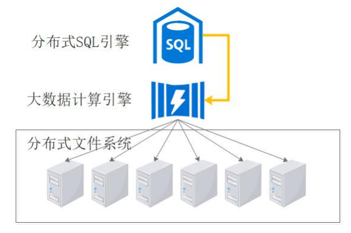
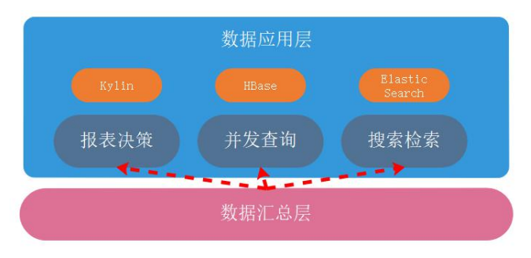
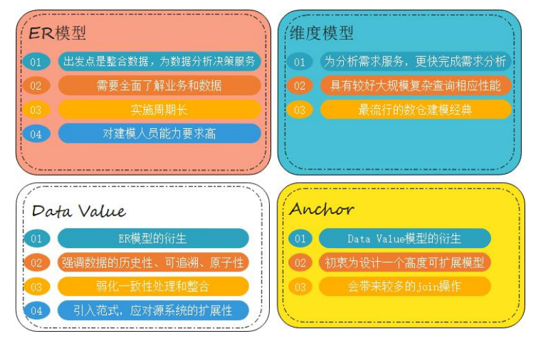

# 一、简介

## 1、诞生背景

- **历史数据积存：**历史数据使用频率低，堆积在业务库中，导致性能下降；
- **企业数据分析需要：**各个部门自己建立独立的数据抽取系统，导致数据不一致；

## 2、基本概述

### 1）数据仓库

- 由数据仓库之父比尔·恩门（Bill Inmon）提出

- 数据仓库是一个面向主题的、集成的、非易失的且随时间变化的数据集合
- 主要用于组织积累的历史数据，并使用分析方法（OLAP、数据分析）进行分析整理，进而 辅助决策，为管理者、企业系统提供数据支持，构建商业智能

### 2）数据仓库特点

- 面向主题：为数据分析提供服务，根据主题将原始数据集合在一起；
- 集成：原始数据来源于不同数据源，要整合成最终数据，需要经过抽取、清洗、转换的过程；


- 非易失：保存的数据是一系列历史快照，不允许被修改，只允许通过工具进行查询、分析；
- 时变性：数仓会定期接收、集成新的数据，从而反映出数据的最新变化。


### 3）数据仓库 VS 数据

数据库面向事务设计，属于OLTP（在线事务处理）系统，主要操作是随机读写；在设计时尽 量避免冗余，常采用符合范式规范来设计；

数据仓库是面向主题设计的，属于OLAP（在线分析处理）系统，主要操作是批量读写；关注数据整合，以及分析、处理性能；会有意引入冗余，采用反范式方式设计。


## 3、技术实现

### 1）传统数据仓库

由关系型数据库组成MPP（大规模并行处理）集群。


**问题：**

- 扩展性有限；
- 热点问题。

### 2）大数据数据仓库

利用大数据天然的扩展性，完成海量数据的存放

将SQL转换为大数据计算引擎任务，完成数据分析



**问题：**

- SQL支持率；
- 事务支持。

## 4、MPP & 分布式架

### 1）MPP架构


- 传统数仓中常见的技术架构，将单机数据库节点组成集群，提升整体处理性能；
- 节点间为非共享架构（Share Nothing），每个节点都有独立的磁盘存储系统和内存系统；
- 每台数据节点通过专用网络或者商业通用网络互相连接，彼此协同计算，作为整体提供服务；
- 设计上优先考虑C(一致性)，其次考虑 A(可用性)，尽量做好P(分区容错性)。

**1. 优点：**

运算方式精细，延迟低、吞吐低；

适合中等规模的结构化数据处理

**2. 缺点：**

存储位置不透明，通过Hash确定数据所在的物理节点，查询任务在所有节点均会执行；

并行计算时，单节点瓶颈会成为整个系统短板，容错性差；

分布式事务的实现会导致扩展性降低。

### 2）分布式架构


- 大数据中常见的技术架构，也称为Hadoop架构/批处理架构；
- 各节点实现场地自治（可以单独运行局部应用），数据在集群中全局透明共享；
- 每台节点通过局域网或广域网相连，节点间的通信开销较大，在运算时致力减少数据移动；
- 优先考虑的是P（分区容错性），然后是A（可用性），最后再考虑C（一致性）

**特点：**

解决了单点故障问题，会将出错的任务调度到其他副本节点；

运算方式粗犷，吞吐量大；

扩展性极强，适合处理非结构化、半结构化数据；

需要将中间结果进行存储，且数据移动开销较大。

### 3）MPP + 分布式架构

数据存储采用分布式架构中的公共存储，提高分区容错性；

上层架构采用MPP，减少运算延迟。

## 5、常见产品

### 1）传统数据库


- Oracle RAC
- DB2
- Teradata
- Greenplum

### 2）大数据数据仓库


- Hive
- Spark SQL
- HBase
- Impala
- HAWQ
- TID

# 二、架构

## 1、架构图


## 2、ETL流程

- 将数据从来源端经过抽取（extract）、交互转换（transform）、加载（load）至目的端的过程；
- 构建数据仓库的重要一环，用户从数据源抽取出所需的数据，经过数据清洗，最终按照预先定义好的数据仓库模型，将数据加载到数据仓库中去；
- ETL 规则的设计和实施约占整个数据仓库搭建工作量的 60%～80%。


### 1）数据抽取

抽取的数据源可以分为结构化数据、非结构化数据、半结构化数据；

结构化数据一般采用JDBC、数据库日志方式，非 | 半结构化数据会监听文件变动

**抽取方式：**


- 数据抽取方式有全量同步、增量同步两种方式；
- 全量同步会将全部数据进行抽取，一般用于初始化数据装载；
- 增量同步方式会检测数据的变动，抽取发生变动的数据，一般用于数据更新

### 2）数据转换

数据转换要经历数据清洗和转换两个阶段：

- 数据清洗主要是对出现的重复、二义性、不完整、违反业务或逻辑规则等问题的数据进行统一的处理；
- 数据转换主要是对数据进行标准化处理，进行字段、数据类型、数据定义的转换；

结构化数据在转换过程中的逻辑较为简单，非 | 半结构化数据的转换会较为复杂。

### 3）数据加载

将最后处理完的数据导入到对应的目标源里。

结构化数据ETL工具：

> ### 常用工具
>
> **1. 结构化数据ETL工具**
>
> 
>
> - Sqoop
> - Kettle
> - Datastage
> - Informatica
> - Kafka
>
> **2. 非|半结构化数据ETL工具**
>
> 
>
> - Flume 
> - Logstash

## 3、数据积存

### 1）操作数据层（ODS）

- 数据与原业务数据保持一致，可以增加字段用来进行数据管理
- 存储的历史数据是只读的，提供业务系统查询使用
- 业务系统对历史数据完成修改后，将update_type字段更新为UPDATE，追加回ODS中


- 在离线数仓中，业务数据定期通过ETL流程导入到ODS中，导入方式有全量、增量两种
  - 全量导入：数据第一次导入时，选择此种方式；
  - 增量导入：数据非第一次导入，每次只需要导入新增、更改的数据，建议使用外连接&全覆盖方式；

### 2）数据明细层（DWD）

- 数据明细层对ODS层的数据进行清洗、标准化、维度退化（时间、分类、地域）；
- 数据仍然满足3NF模型，为分析运算做准备；


## 4、数据分析

### 1）数据汇总层（DWS）

- 数据汇总层的数据对数据明细层的数据，按照分析主题进行计算汇总，存放便于分析的宽表
- 存储模型并非3NF，而是注重数据聚合，复杂查询、处理性能更优的数仓模型，如维度模型


### 2）数据应用层（ADS）

- 数据应用层也被称为数据集市
- 存储数据分析结果，为不同业务场景提供接口，减轻数据仓库的负担（数据仓库擅长数据分析，直接开放业务查询接口，会加重其负担）



# 三、建模方法

## 1、基本概念

### 1）OLTP系统建模方法

- OLTP（在线事务处理）系统中，主要操作是随机读写
- 为了保证数据一致性、减少冗余，常使用关系模型
- 在关系模型中，使用三范式规则来减少冗余


### 2）OLAP（在线联机分析）

OLAP系统，主要操作是复杂分析查询；关注数据整合，以及分析、处理性能；

OLAP根据数据存储的方式不同，又分为ROLAP、MOLAP、HOLAP

> #### OLAP系统分类
>
> - ROLAP（Relation OLAP，关系型 OLAP）：使用关系模型构建，存储系统一般为RDBMS；
> - MOLAP（Multidimensional OLAP，多维型 OLAP）：预先聚合计算，使用多维数组的形式保存数据结果，加快查询分析时间；
> - HOLAP（Hybrid OLAP，混合架构的 OLAP）：ROLAP 和 MOLAP 两者的集成；如低层是关系型的，高层是多维矩阵型的；查询效率高于ROLAP，低于MOLAP。

## 2、ROLAP

### 1）ROLAP系统建模方法

典型的数据仓库建模方法有ER模型、维度模型（重点）、Data Value、Anchor



### 2）维度模型

- 维度模型中，表被分为维度表、事实表，维度是对事实的一种组织；
- 维度一般包含分类、时间、地域等。


- 维度模型分为星型模型、雪花模型、星座模型

> #### 1. 星型模型
>
> 标准的星型模型，维度只有一层，分析性能最优
>
> 
>
> #### 2. 雪花模型
>
> 雪花模型具有多层维度，比较接近三范式设计，较为灵活
>
> 
>
> #### 3. 星座模型
>
> 星座模型基于多个事实表，事实表之间会共享一些维度表
>
> 是大型数据仓库中的常态，是业务增长的结果，与模型设计无关
>
> 

- 维度模型建立后，方便对数据进行多维分析

### 3）宽表模型

宽表模型是维度模型的衍生，适合join性能不佳的数据仓库产品

宽表模型将维度冗余到事实表中，形成宽表，以此减少join操作


## 3、MOLAP

### 1）MOLAP系统建模方法

- MOLAP将数据进行预结算，并将聚合结果存储到CUBE模型中
- CUBE模型以多维数组的形式，物化到存储系统中，加快后续的查询
- 生成CUBE需要大量的时间、空间，维度预处理可能会导致数据膨胀


### 2）常见MOLAP产品

- Kylin
- Druid


### 3）OLAP多维分析

- OLAP主要操作是复杂查询，可以多表关联，使用COUNT、SUM、AVG等聚合函数
- OLAP对复杂查询操作做了直观的定义，包括钻取、切片、切块、旋转

#### 1. 钻取

- 对维度不同层次的分析，通过改变维度的层次来变换分析的粒度 
- 钻取包括上卷（Roll-up）、下钻(Drill-down)
- 上卷（Roll-up），也称为向上钻取，指从低层次到高层次的切换
- 下钻(Drill-down)，指从高层次到低层次的切换


#### 2. 切片、切块

- 选择某个维度进行分割称为切片
- 按照多维进行的切片称为切


#### 3. 旋转

对维度方向的互换，类似于交换坐标轴上卷（Roll-up）


# 四、最佳实践

## 1、表的类型

### 1）事实表

一般是指一个现实存在的业务对象，比如用户，商品，商家，销售员等等。


### 2）维度表

- 一般是指对应一些业务状态，代码的解释表。也可以称之为码表
- 通常使用维度对事实表中的数据进行统计、聚合运算


### 3）事务事实表

- 随着业务不断产生的数据，一旦产生不会再变化，如交易流水、操作日志、出库入库记录


### 4）周期快照事实表

- 随着业务周期型的推进而变化，完成间隔周期内的度量统计，如年、季度累计
- 使用周期+状态度量的组合，如年累计订单数，年是周期，订单总数是量度


### 5）累积快照事实表

- 记录不确定周期的度量统计，完全覆盖一个事实的生命周期，如订单状态表
- 通常有多个时间字段，用于记录生命周期中的关键时间点
- 只有一条记录，针对此记录不断更新


> #### 实现方式一
>
> - 使用日期分区表，全量数据记录，每天的分区存储昨天全量数据与当天增量数据合并的结果
> - 数据量大会导致全量表膨胀，存储大量永远不更新的冷数据，对性能影响较大
> - 适用于数据量少的情况
>
> #### 实现方式二
>
> - 使用日期分区表，推测数据最长生命周期，存储周期内数据；周期外的冷数据存储到归档表
> - 需要保留多天的分区数据，存储消耗依然很大
>
> #### 实现方式三
>
> - 使用日期分区表，以业务实体的结束时间分区，每天的分区存放当天结束的数据；设计一个 时间非常大的分区，如9999-12-31，存放截止当前未结束的数据
> - 已结束的数据存放到相应分区，存放未结束数据的分区，数据量也不会很大，ETL性能好
> - 无存储浪费，数据全局唯一
> - 业务系统可能无法标识业务实体的结束时间，可以使用其它相关业务系统的结束标志作为此 业务系统的结束，也可以使用最长生命周期时间或前端系统的数据归档时间

### 6）拉链表

- 拉链表记录每条信息的生命周期，用于保留数据的所有历史（变更）状态
- 拉链表将表数据的随机修改方式，变为顺序追加


## 2、ETL策略

### 1）全量同步

- 数据初始化装载一定使用全量同步的方式
- 因为业务、技术原因，使用全量同步的方式做周期数据更新，直接覆盖原有数据即可

### 2）增量同步

- 传统数据整合方案中，大多采用merge方式（update+insert）
- 主流大数据平台不支持update操作，可采用全外连接+数据全量覆盖方式（如果担心数据更新出错，可以采用分区方式，每天保存最新的全量版本，保留较短周期）


## 3、任务调度

### 1）为什么需要任务调度

- 解决任务单元间的依赖关系
- 自动化完成任务的定时执行


### 2）常见任务类型

- Shell
- Java程序
- Mapreduce程序
-  SQL脚本

### 3）常见调度工具

- Azkaban
- Ooz


# 五、项目实战

## 1、项目概述

### 1）项目背景

- 某电商企业，因数据积存、分析需要，筹划搭建数据仓库，提供数据分析访问接口；
- 项目一期需要完成数仓建设，并完成用户复购率的分析计算，支持业务查询需求

### 2）复购率计算

- 复购率是指在一段时间间隔内，多次重复购买产品的用户，占全部人数的比率；
- 统计各个一级品类下，品牌月单次复购率，和多次复购率


## 2、数据描述


## 3、架构设计


## 4、环境搭建

### 1）环境说明


### 2）集群规划


### 3）搭建流程

### 4）整体开发流程

1. 业务数据生成 
2. ETL数据导入 
3. 创建ODS层，并完成HDFS数据接入
4. 创建DWD层，并完成ODS层数据导入
5. 创建DWS层，导入DWD层数据
6. 创建ADS层，完成复购率计算
7. 编写脚本，将ADS层的数据导出到Mysql中，供业务查询
8. 使用Azkaban调度器，实现脚本自动化运行


## 5、项目开发

### 1）业务数据生成

1. 进入Mysql，创建数据库Mall

```shell
export MYSQL_PWD=DBa2020*
mysql -uroot -e "create database m
```

2. 上传数据生成sql脚本到Mysql安装节点
3. 使用命令方式，将数据生成sql脚本导入到Mysql中

```shell
mysql -uroot mall < {pathToSQL}
```

4. 进入Mysql，生成数据

```sql
use mall;
#生成日期2020-06-10日数据、订单300个、用户200个、商品sku300个、不删除数据
CALL init_data('2020-06-10'
,300,200,300,FALSE);
```

### 2）ETL数据导入

1. ETL数据导入

```shell
mkdir –p /home/warehouse/shell
```

2. 编写Sqoop数据导入脚本，脚本内容见课程材料

```shell
cd /home/warehouse/shell
vim sqoop_import.s
```

3. 赋予脚本执行权限，并运行脚本

```shell
chmod +x /home/warehouse/shell/sqoop_import.sh
./sqoop_import.sh all 2020-06
```

4. 通过Web界面查看HDFS的`/origin_data/mall/db/`目录下是否存在导入数据

### 3）ODS层创建&数据接入

1. 进入Hive安装节点，启动Hive元数据服务

```shell
hive --service hiveserver2 &
hive --service metastor
```

2. 在`/home/warehouse/sql`目录下编写ods_ddl.sql，创建与业务数据库一致的数据表

```shell
vim /home/warehouse/sql/ods_ddl.sql
```

3. 将ods_ddl.sql导入到Hive中

```shell
hive -f /home/warehouse/sql/ods_ddl.sql
```

4. 在/home/warehouse/shell/目录下编写ods_db.sh脚本，完成数据导入操作

```shell
vim /home/warehouse/shell/ods
```

5. 为脚本赋权，并执行

```shell
chmod +x /home/shell/warehouse/ods_db.sh
ods_db.sh 2020-06-1
```

### 4）DWD层创建&数据接入

> DWD层分析
>
> - 对ODS层数据进行清洗、维度退化
> - 因业务库数据质量高，所以只需要去空数据即可
> - 分类表可以进行维度退化，维度合并到商品表
>
> 

1. 在/home/warehouse/sql目录下编写dwd_ddl.sql，创建DWD层数据表

```shell
vim /home/warehouse/sql/dwd_ddl.sql
```

2. 将dwd_ddl.sql导入到Hive中

```shell
hive -f /home/warehouse/sql/dwd_ddl.sql
```

3. 在/home/warehouse/shell目录下编写dwd_db.sh脚本，完成数据导入操作

```shell
vim /home/warehouse/shell/dwd_db.sh
```

4. 为脚本赋权，并执行

```shell
chmod +x /home/warehouse/shell/dwd_db.sh 
./dwd_db.sh 2020-06-10
```

5. 查看是否执行成功

```sql
select * from dwd_sku_info where dt='2020-06-10' limit
```

### 5）DWS层创建&数据接入

> DWS层分析
>
> - 将具有相同分析主题的DWD层数据，聚合成宽表模型，便于数据分析与计算
> - 主题的归纳具有通用性，后续也可能会随着分析业务的增加而扩展
>
> 

1. 在`/home/warehouse/sql`目录下编写dws_ddl.sql，创建DWS层数据表

```shell
vim /home/warehouse/sql/dws_ddl.sql
```

2. 将dws_ddl.sql导入到Hive中

```shell
hive -f /home/warehouse/sql/dws_ddl.sql
```

3. 在`/home/warehouse/shell`目录下编写dws_db.sh脚本，完成数据导入操作

```shell
vim /home/warehouse/shell/dws_db.sh
```

4. 为脚本赋权，并执行

```shell
chmod +x /home/warehouse/shell/dws_db.sh 
./dws_db.sh 2020-06-10
```

5. 查看是否执行成功

```sql
select * from dws_user_action where dt='2020-06-10' limit 2; 
select * from dws_sale_detail_daycount where dt='2020-06-10' limit 2
```

### 6）ADS层创建&数据接入

> ADS层分析
>
> - 统计各个一级品类下，品牌月单次复购率，和多次复购率
>
> 

1. 在/home/warehouse/sql目录下编写ads_sale_ddl.sql，创建DWS层数据表

```shell
vim /home/warehouse/sql/ads_sale_ddl.sql
```

2. 将ads_sale_ddl.sql导入到Hive中

```shell
hive -f /home/warehouse/sql/ads_sale_ddl.sql
```

3. 在/home/warehouse/shell目录下编写ads_sale.sh脚本，完成数据导入操作

```shell
vim /home/warehouse/shell/ads_sale.sh
```

4. 为脚本赋权，并执行

```shell
chmod +x /home/warehouse/shell/ads_sale.sh
/home/warehouse/shell/ads_sale.sh 2020-06-10
```

5. 查看是否执行成功

```sql
select * from ads_sale_tm_category1_stat_mn limit 2;
```

### 7）ADS层数据导出

1. 在Mysql节点的/home/warehouse/sql目录下编写mysql_sale_ddl.sql，创建数据表

```shell
vim /home/warehouse/sql/mysql_sale_ddl.sql
```

2. 将mysql_sale_ddl.sql导入到Mysql中

```shell
export MYSQL_PWD=DBa2020* 
mysql -uroot mall < /home/warehouse/sql/mysql_sale_ddl.sql 
```

3. 在Sqoop节点的/home/warehouse/shell目录下编写sqoop导出脚本，完成数据导入操作

```shell
vim /home/warehouse/shell/sqoop_export.sh
```

4. 为脚本赋权，并执行

```shell
chmod +x /home/warehouse/shell/sqoop_export.sh 
/home/warehouse/shell/sqoop_export.sh all
```

5. 在Mysql中查看是否执行成功

```sql
SELECT * FROM ads_sale_tm_category1_stat_mn;
```

### 8）Azkaban自动化调度

1. 在Mysql中执行SQL，生成数据

```shell
CALL init_data('2020-06-12',300,200,300,FALSE);
```

2. 编写azkaban运行job，并打包成mall-job.zip文件

3. 在3台虚拟机中同时启动Azkaban

```shell
azkaban-executor-start.sh
```

4. 在存放shell脚本的虚拟机上启动Azkaban Web服务器

```shell
cd /opt/app/azkaban/server
azkaban-web-start.sh
```

5. 访问Azkaban Web界面，端口8443

6. 上传并运行job，运行时指定executor为shell脚本存放的服务器，并配置脚本参数

```shell
useExecutor node03
dt 2020-06-12
```
