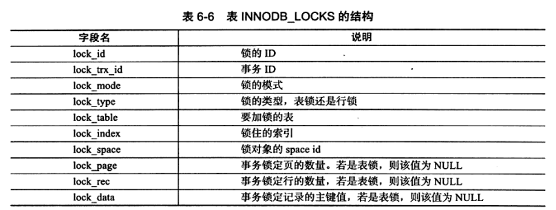
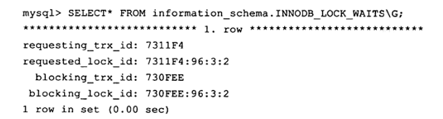
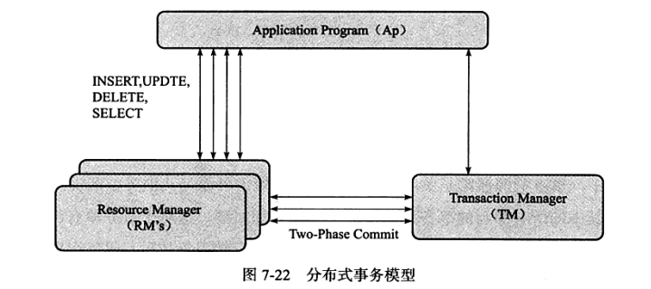

# 一、MySQL体系结构和存储引擎

## 1、数据库和实例

数据库：物理操作系统文件或其他形式文件类型的集合。

实例：MySQL数据库由后台线程以及一个共享内存区组成。

> 在MySQL数据库中，实例与数据库的关通常系是一一对应的，即一个实例对应一个数据库，一个数据库对应一个实例。但是，在集群情况下可能存在一个数据库被多个数据实例使用的情况。

## 2、体系结构

- **连接池：**管理、缓冲用户的连接；
- **管理服务和工具组件：**系统管理和控制工具，如备份恢复、MySQL复制、集群等；
- **SQL接口组件：**接受用户的SQL命令，并且返回用户需要的查询结果；
- **查询分析器组件：**SQL命令传递到解析器时会被解析器验证和解析（权限、语法结构）；
- **优化器组件：**SQL语句在查询前会使用查询优化器进行优化；
- **缓冲组件：**如果查询缓存命中查询结果，查询语句可以从这里获得结果；
- **插件式存储引擎**
- **物理文件**

**存储引擎式基于表的，而不是数据库。**

## 3、存储引擎

### 1）InnoDB

InnoDB存储引擎支持事务，其设计目标主要面向在线事务处理（OLTP）的应用。其特点是行锁设计、支持外键，并支持类似于Oracle的非锁定读，即默认读取操作不会产生锁。

InnoDB通过使用多版本并发控制（MVCC）来获得高并发性，并且实现了SQL标准的4种隔离级别，默认为REPEATABLE级别。

对于表中数据的存储，InnoDB存储引擎采用了聚集（clustered）的方式，因此每张表的存储都是按主键的顺序进行存放。

### 2）MyISAM

MyISAM存储引擎不支持事务、表锁设计，支持全文索引，主要面向一些OLAP数据库应用。

MyISAM存储引擎表由MYD和MYI组成，MYD用来存放数据文件，MYI用来存放索引文件。

### 3）Memory

将表中的数据存放在内存中，如果数据库重启或发生崩溃，表中的数据都将消失。它非常适合用于存储临时数据的临时表，以及数据仓库中的纬度表。Memory存储引擎默认使用哈希索引，而不是我们熟悉的B+树索引。

只支持表锁，并发性能较差，并且不支持TEXT和BLOB列类型。最重要的是，存储变长字段（varchar）时是按照定常字段（char）的方式进行的，因此会浪费内存。

---

# 二、InnoDB存储引擎

## 1、InnoDB 体系结构

### 1）后台线程

1. **Master Thread：**非常核心的后台线程，主要负责将缓冲池中的数据异步刷新到磁盘，保证数据的一致性。
2. **IO Thread：**主要负责IO请求的回调处理，包含write、read、insert buffer 和 log IO Thread。
3. **Purge Thread：**回收已经使用分配的undo页，如：事务提交后，其所使用的undolog可能不再需要了。
4. **Page Cleaner Thread：**处理脏页的刷新。

> 查看版本：`SHOW VARIABLES LIKE 'innodb_version'\G;`
>
> 查看状态：`SHOW INNODB STATUS\G;`

### 2）内存

1. **缓冲池：**缓冲池其实是一块内存区域，通过内存的速度来弥补磁盘速度较慢对数据性能的影响。

> **InnoDB存储引擎的内存管理**
>
> - LRU List：LRU列表用来管理已经读取的页。
> - Free List：LRU列表用来管理已经读取的页，但当数据库刚启动时，LRU列表是空的，即没有任何的页。这时页都存放在Free列表中。当需要从缓冲池中分页时，首先从Free列表中查找是否有可用的空闲页，若有则将该页从Free列表中删除，放入到LRU列表中。否则，根据LRU算法，淘汰LRU列表末尾的页，将该内存空间分配给新的页。
> - Flush List：在LRU列表中的页被修改后，称该页为脏页（dirty page），即缓冲池中的页和磁盘上的页的数据产生了不一致。Flush列表中的页即为脏页列表。需要注意的是，脏页既存在于LRU列表中，也存在于Flush列表中。LRU列表用来管理缓冲池中页的可用性，Flush列表用来管理将页刷新回磁盘，二者互不影响。

2. **重做日志缓冲：**InnoDB存储引擎首先将重做日志信息先放入到这个缓冲区，然后按一定频率将其刷新到重做日志文件。只需要保证每秒产生的事务量再这个缓冲大小之内即可。8MB的重做日志缓冲池足以满足绝大部分的应用。

> **以下三种情况会将重做日志缓冲中的内容刷新到外部磁盘的重做日志文件中：**
>
> 1. Master Thread 每一秒将重做日志缓冲刷新到重做日志文件；
> 2. 每个事务提交时会将重做日志缓冲刷新到重做日志文件；
> 3. 当重做日志缓冲池剩余空间小于1/2时，重做日志缓冲刷新到重做日志文件。

3. **额外的内存池：**在对一些数据结构本身的内存进行分配时，需要从而外的内存池中进行申请，当该区域的内存不够时，会从缓冲池中进行申请。

## 2、Checkpoint技术

### 1）目的

- **缩短数据库的恢复时间：**当数据库发生宕机时，数据库不需要重做所有的日志，因为Checkpoint之前的页都已经刷新回磁盘。故数据库只需对Checkpoint后的重做日志进行恢复。这样就大大缩短了恢复的时间；
- **缓冲池不够用时，将脏页刷新到磁盘：**当缓冲池不够用时，根据LRU算法会溢出最近最少使用的页，若此页为脏页，那么需要强制执行Checkpoint，将脏页也就是页的新版本刷回磁盘；
- **重做日志不可用时，刷新脏页：**重做日志出现不可用的情况是因为当前事务数据库系统对重做日志的设计都是循环使用的，并不是让其无限增大的，这从成本及管理上都是比较困难的。重做日志可以被重用的部分是指这些重做日志已经不再需要，即当数据库发生宕机时，数据库恢复操作不需要这部分的重做日志，因此这部分就可以被覆盖重用。若此时重做日志还需要使用，那么必须强制产生Checkpoint，将缓冲池中的页至少刷新到当前重做日志的位置。

### 2）种类

1. **Sharp Checkpoint：**发生在数据库关闭时将所有的脏页都刷新到磁盘，这是默认的工作方式；
2. **Fuzzy Checkpoint：**只刷新一部分脏页。
   1. Master Thread Checkpoint：刷新一定比列的页回磁盘（异步过程，不会阻塞用户线程）；
   2. FLUSH_LRU_LIST Checkpoint：保证一定数量的空闲页可用，会阻塞用户的查询操作；
   3. Async/Sync Flush Checkpoint：保证重做日志的循环使用的可用性；
   4. Dirty Page too much Checkpoint：保证缓冲池有足够可用的页。

## 3、InnoDB关键特性

### 1）插入缓冲（Insert Buffer）

在InnoDB存储引擎中，主键是行唯一的标识符。通常应用程序中行记录的插入顺序是按照主键递增的顺序进行插入的。因此，插入聚集索引（Primary Key）一般是顺序的，不需要磁盘的随机读取。因此，对于这类情况下的插入操作，速度是非常快的。

对于非聚集索引的插入或更新操作，不是每一次直接插入到索引页中，而是先判断插入的非聚集索引页是否在缓冲池中，若在，则直接插入；若不在，则先放入到一个Insert Buffer对象中，好似欺骗。数据库这个非聚集的索引已经插到叶子节点，而实际并没有，只是存放在另一个位置。然后再以一定的频率和情况进行Insert Buffer和辅助索引页子节点的merge（合并）操作，这时通常能将多个插入合并到一个操作中（因为在一个索引页中），这就大大提高了对于非聚集索引插入的性能。

> 使用条件：
>
> - 索引是辅助索引；
> - 索引不是唯一的。

### 2）两次写

**含义：**当使用重做日志进行数据恢复时发生写失效，即某个页本身已经发生了损坏，再对其进行重做是没有意义的。因此，在应用重做日志前，用户需要一个页的副本，当写入失效发生时，先通过页的副本来还原该页，再进行重做，这就是doublewrite。

**过程：**

doublewrite由两部分组成，一部分是内存中的doublewrite buffer，大小为2MB，另一部分是物理磁盘上共享表空间中连续的128个页，即2个区（extent），大小同样为2MB。在对缓冲池的脏页进行刷新时，并不直接写磁盘，而是会通过memcpy函数将脏页先复制到内存中的doublewrite buffer，之后通过doublewrite buffer再分两次，每次1MB顺序地写入共享表空间的物理磁盘上，然后马上调用fsync函数，同步磁盘，避免缓冲写带来的问题。在这个过程中，因为doublewrite页是连续的，因此这个过程是顺序写的，开销并不是很大。在完成doublewrite页的写入后，再将doublewrite buffer中的页写入各个表空间文件中，此时的写入则是离散的。

### 3）自适应哈希索引

InnoDB存储引擎会监控表上个索引页的查询。如果观察到建立哈希索引可以带来速度提升，则建立哈希索引，称之为自适应哈希索引。

### 4）异步IO

为了提高磁盘操作性能，采用异步IO的方式来处理磁盘操作。

### 5）刷新临界表

当刷新一个脏页时，InnoDB存储引擎会检测该页所在区的所有页，如果是脏页，那么一起进行刷新。

---

# 三、文件

## 1、参数文件

1.  **含义：**当MySQL实例启动时，数据库会先去读一个配置参数文件，用来寻找数据库的各种文件所在位置以及指定某些初始化参数。
2. **类型：**
   - 动态参数：可以在MySQL实例运行中进行修改；
   - 静态参数：在整个实例生命周期内都不能更改，就好像时只读的；
   - session：表明该参数的修改是基于当前会话的；
   - gloabal：表明该参数的修改是基于整个实例的生命周期；

## 2、日志文件

### 1）错误日志

在遇到问题时首先查看该文件以便定位问题，该文件不仅记录了所有的错误信息，也记录一些警告信息和正确的信息。

### 2）慢查询日志

慢查询日志可帮助DBA定位可能存在问题的SQL语句，从而进行SQL语句层面的优化。可以使用show variables like ‘slow_query_log’查看是否开启，如果状态值为OFF，可以使用 `set GLOBAL slow_query_log = on`来开启，它会在datadir下产生一个【主机名】-slow.log的文件。

- 查看阈值：`show VARIABLES like 'long_query_time'`
- 设置阈值：`set long_query_time=0.5`（大于0.5秒的SQL语句，正好等于long_query_time并不会被记录）

### 3）查询日志

记录了所有对MySQL数据库请求的信息。

### 4）二进制日志

1. 含义：二进制日志记录了对MySQL数据库执行更改的所有操作，即使这些操作并没有导致数据库发生变化。默认情况下是不开启的。
2. 作用：某些数据的恢复需要二进制日志；用作主从同步；判断是否有对数据库进行注入的攻击。
3. 记录格式：statement、row、mixed。

## 3、套接子文件

在UNIX系统下本地连接MySQL可以采用UNIX域套接字方式，这种方式需要一个套接字文件。

## 4、pid文件

当MySQL实例启动时，会将自己的进程ID写入到一个文件中——该文件即为pid文件。

## 5、表结构定义文件

MySQL数据的存储时根据表进行的，每个表都会有与之对应的文件，但不论表采用何种存储引擎，MySQL都有一个以frm为后缀的文件，这个文件记录了该表的表结构定义。

## 6、InnoDB存储引擎文件

### 1）表空间文件

InnoDB采用将存储的数据按表空间（tablespace）进行存放的设计，如果设置了`innodb_data_file_path`参数，所有基于InnoDB存储引擎的表的数据都会记录到该共享表空间中。若设置了`innodb_file_per_table`，则用户可以将每个基于InnoDB存储引擎的表产生一个独立表空间。独立表空间的命名规则为：`表名.ibd`。通过这样的方式，用户不用将所有数据都存放于默认的表空间中。

### 2）重做日志文件

当实例或介质失败时，重做日志文件就能派上用场。

重做日志文件的大小设置对于InnoDB存储引擎的性能有着非常大的影响。一方面重做日志文件不能设置得太大，如果设置得很大，在恢复时可能需要很长的时间；另外一方面又不能设置得太小了，否则可能导致一个事务得日志需要多次切换重做日志文件。此外，重做日志文件太小会导致频繁地发生async checkpoint，导致性能地抖动。

---

# 四、表

## 1、索引组织表

在InnoDB存储引擎中，表都是根据主键顺序组织存放的，这种存储结构的表称为索引组织表。

> 在InnoDB存储引擎表中，每张表都有个主键（Primary Key），如果在创建表时没有显式地定义主键，则InnoDB存储引擎会按如下方式选择或创建主键： 
>
> ❑首先判断表中是否有非空的唯一索引（Unique NOT NULL），如果有，则该列即为主键。 
>
> ❑如果不符合上述条件，InnoDB存储引擎自动创建一个6字节大小的指针。
>
> 当表中有多个非空唯一索引时，InnoDB存储引擎将选择建表时第一个定义的非空唯一索引为主键。这里需要非常注意的是，主键的选择根据的是定义索引的顺序，而不是建表时列的顺序。

## 2、InnoDB逻辑存储结构

从InnoDB存储引擎的逻辑存储结构看，所有数据都被逻辑地存放在一个空间中，称之为表空间（tablespace）。表空间又由段（segment）、区（extent）、页（page）组成。页在一些文档中有时也称为块（block）。

1. 表空间：表空间可以看做是存储引擎逻辑结构的最高层，所有的数据（数据、索引和插入缓冲Bitmap页，及其他类的数据，如回滚（undo）信息，插入缓冲索引页、系统事务信息，二次写缓冲（Double write buffer）等）都存放在表空间中。
2. 段：常见的段有数据段（索引）、索引段（非索引节点）、回滚段等。
3. 区：由连续页组成的空间，在任何情况下每个区的大小都为1MB。
4. 页：页是InnoDB磁盘管理的最小单位。
5. 行：InnoDB存储引擎是面向列的，也就说数据是按行进行存放的。

## 3、InnoDB行记录格式

1. Compact：在MySQL5.0中引入的，其设计目标是高效地存储数据；
2. Redundant：为了兼容之前版本地也格式；
3. Compressed：新的文件格式，常常在其中地行数据会以zlib的算法进行压缩；
4. Dynamic。

> 查看当前表使用的行格式：`SHOW TABLE STATUS LIKE 'mytest%'\G`

## 4、InnoDB数据页结构

## 5、约束

### 1）数据完整性

一般来说，数据完整性有以下三种形式：

1. 实体完整性：保证表重要有一个主键；
2. 域完整性：保证数据每列的值满足特定的条件；
3. 参照完整性：保证两张表之间的关系。

> 对于InnoDB存储引擎本身而言，提供了以下几种约束：
>
> - Primary Key 
> - Unique Key 
> - Foreign Key 
> - Default 
> - NOT NULL

### 2）约束和索引的区别

当用户创建了一个唯一索引就创建了一个唯一的约束。但是约束和索引的概念还是有所不同的，约束更是一个逻辑的概念，用来保证数据的完整性，而索引是一个数据结构，既有逻辑上的概念，在数据库中还代表着物理存储的方式。

### 3）ENUM和SET约束

MySQL数据库不支持传统的CHECK约束，但是通过ENUM和SET类型可以解决部分这样的约束需求。

例如表上有一个性别类型，规定域的范围只能是male或female，在这种情况下用户可以通过ENUM类型来进行约束。

### 4）触发器与约束

触发器的作用是在执行INSERT、DELETE和UPDATE命令之前或之后自动调用SQL命令或存储过程。

通过触发器，用户可以实现MySQL数据库本身并不支持的一些特性，如对于传统CHECK约束的支持，物化视图、高级复制、审计等特性。

### 5）外键约束

> 外键用来保证参照完整性，MySQL数据库的MyISAM存储引擎本身并不支持外键，对于外键的定义只是起到一个注释的作用。

外键的定义如下：

（外键定义时的ON DELETE和ON UPDATE表示在对父表进行DELETE和UPDATE操作时，对子表所做的操作）

1. **CASCADE** ：表示当父表发生DELETE或UPDATE操作时，对相应的子表中的数据也进行DELETE或UPDATE操作；
2. **SET NULL** ：当父表发生DELETE或UPDATE操作时，相应的子表中的数据被更新为NULL值，但是子表中相对应的列必须允许为NULL值；
3. **NO ACTION**： 当父表发生DELETE或UPDATE操作时，抛出错误，不允许这类操作发生；
4. **RESTRICT**：当父表发生DELETE或UPDATE操作时，抛出错误，不允许这类操作发生。

如果定义外键时没有指定ON DELETE或ON UPDATE，RESTRICT就是默认的外键设置。由于MySQL数据库的外键约束都是即时检查（immediate check），因此在MySQL数据库中NO ACTION和RESTRICT的功能是相同的。

## 6、视图

视图（View）是一个命名的虚表，它由一个SQL查询来定义，可以当做表使用。与持久表（permanent table）不同的是，视图中的数据没有实际的物理存储。

视图的主要用途之一是被用做一个抽象装置，特别是对于一些应用程序，程序本身不需要关心基表（base table）的结构，只需要按照视图定义来取数据或更新数据，因此，视图同时在一定程度上起到一个安全层的作用。

## 7、分区表

### 1）概述

分区功能并不是在存储引擎层完成的，因此不是只有InnoDB存储引擎支持分区，常见的存储引擎MyISAM、NDB等都支持。但也并不是所有的存储引擎都支持。

分区的过程是将一个表或索引分解为多个更小、更可管理的部分。就访问数据库的应用而言，从逻辑上讲，只有一个表或一个索引，但是在物理上这个表或索引可能由数十个物理分区组成。每个分区都是独立的对象，可以独自处理，也可以作为一个更大对象的一部分进行处理。

> **子分区**
>
> 子分区是在分区的基础上再进行分区，有时也称这种分区为复合分区。MySQL数据库允许在RANGE和LIST的分区上再进行HASH或KEY的子分区，

### 2）类型

1. RANGE分区：行数据基于属于一个给定连续区间的列值被放入分区；
2. LIST分区：和RANGE分区类型，只是LIST分区面向的是离散的值；
3. HASH分区：根据用户自定义的表达式的返回值来进行分区，返回值不能为负数；
4. KEY分区：根据MySQL数据库提供的哈希函数来进行分区；
5. COLUMNS分区：可视为RANGE分区和LIST分区的一种进化。COLUMNS分区可以直接使用非整型的数据进行分区，分区根据类型直接比较而得，不需要转化为整型。此外，RANGECOLUMNS分区可以对多个列的值进行分区。

### 3）分区和性能

对于OLAP的应用，分区的确是可以很好地提高查询的性能，因为OLAP应用大多数查询需要频繁地扫描一张很大的表。假设有一张1亿行的表，其中有一个时间戳属性列。用户的查询需要从这张表中获取一年的数据。如果按时间戳进行分区，则只需要扫描相应的分区即可。这就是前面介绍的Partition Pruning技术。

然而对于OLTP的应用，分区应该非常小心。在这种应用下，通常不可能会获取一张大表中10%的数据，大部分都是通过索引返回几条记录即可。而根据B+树索引的原理可知，对于一张大表，一般的B+树需要2～3次的磁盘IO。因此B+树可以很好地完成操作，不需要分区的帮助，并且设计不好的分区会带来严重的性能问题。

---

# 五、索引与算法

# 六、锁

## 1、什么是锁

锁是数据库系统区别与文件系统的一个关键特性。锁机制用于管理对共享资源的并发访问。

数据库系统使用锁是为了支持对共享资源进行并发访问，提供数据的完整性和一致性。

## 2、lock与latch

- latch：一般称为闩锁（轻量级的锁），因为其要求锁定的时间必须非常短。其目的是用来保证并发线程操作临界资源的正确性，并且通常没有死锁检测的机制。
- lock：锁的对象是事务，用来锁定的是数据库中的对象，如表、页、行。

## 3、InnoDB存储引擎中的锁

### 1）锁的类型

- 共享锁：允许事务读一行数据。
- 排他锁：允许事务删除或更新一行数据。
- 意向共享锁：事务想要获得一张表中某几行的共享锁。
- 意向排他锁：事务想要获得一张表中某几行的排他锁。

若将上锁的对象看成一棵树，那么对最下层的对象上锁，也就是对最细粒度的对象进行上锁，那么首先需要对粗粒度的对象上锁。如图，如果需要对页上的记录r进行上X锁，那么分别需要对数据库A、表、页上意向锁IX，最后对记录r上X锁。若其中任何一个部分导致等待，那么该操作需要等待粗粒度锁的完成。

可以通过`SELECT * FROM information_schema.INNODB_TRX\G;`来分析当前事务锁。

如果需要查看锁，可以执行：`SELECT * FROM information_schema.INNODB_LOCKS\G;`

还可以通过表INNODB_LOCK_WAITS来查看当前事务的等待状态：`SELECT * FROM information_schema.INNODB_LOCK_WAITS\G;`

### 2）一致性非锁定读

一致性的非锁定读（consistent nonlocking read）是指InnoDB存储引擎通过行多版本控制（multi versioning）的方式来读取当前执行时间数据库中行的数据。如果读取的行正在执行DELETE或UPDATE操作，这时读取操作不会因此去等待行上锁的释放。相反地，InnoDB存储引擎会去读取行的一个快照数据。

> **读取快照数据是不需要上锁的，因为没有事务需要对历史的数据进行修改操作。**

在READ COMMITTED事务隔离级别下，对于快照数据，非一致性读总是读取被锁定行的最新一份快照数据。而在REPEATABLE READ事务隔离级别下，对于快照数据，非一致性读总是读取事务开始时的行数据版本。

### 3）一致性锁定读

在某些情况下，用户需要显式地对数据库读取操作进行加锁以保证数据逻辑的一致性。而这要求数据库支持加锁语句，即使是对于SELECT的只读操作。

- SELECT…FOR UPDATE
- SELECT…LOCK IN SHARE MODE

### 4）自增长与锁

在InnoDB存储引擎的内存结构中，对每个含有自增长值的表都有一个自增长计数器（auto-increment counter）。当对含有自增长的计数器的表进行插入操作时，这个计数器会被初始化，插入操作会依据这个自增长的计数器值加1赋予自增长列。这个实现方式称做AUTO-INC Locking。这种锁其实是采用一种特殊的表锁机制，为了提高插入的性能，锁不是在一个事务完成后才释放，而是在完成对自增长值插入的SQL语句后立即释放。

从MySQL 5.1.22版本开始，InnoDB存储引擎中提供了一种轻量级互斥量的自增长实现机制，这种机制大大提高了自增长值插入的性能……

另外，在InnoDB存储引擎中，自增长值的列必须是索引，同时必须是索引的第一个列。如果不是第一个列，则MySQL数据库会抛出异常，而MyISAM存储引擎没有这个问题，下面的测试反映了这两个存储引擎的不同：

### 5）外键和锁

在InnoDB存储引擎中，对于一个外键列，如果没有显式地对这个列加索引，InnoDB存储引擎自动对其加一个索引，因为这样可以避免表锁。

对于外键值的插入或更新，首先需要查询父表中的记录，即SELECT父表。但是对于父表的SELECT操作，不是使用一致性非锁定读的方式，因为这样会发生数据不一致的问题，因此这时使用的是`SELECT…LOCK IN SHARE MODE`方式，即主动对父表加一个S锁。如果这时父表上已经这样加X锁，子表上的操作会被阻塞，如图：

## 4、锁算法

### 1）行锁的三种算法

- Record Lock：单个行记录上的锁；
- Gap Lock：间隙锁，锁定一个范围，但不含记录本身；
- Next-Key Lock∶Gap Lock+Record Lock，锁定一个范围，并且锁定记录本身。

> 当查询的索引含有**唯一属性**时，InnoDB存储引擎会对Next-Key Lock进行优化，将其降级为Record Lock，即仅锁住索引本身，而不是范围。

### 2）解决Phantom Problem

Phantom Problem是指在同一事务下，连续执行两次同样的SQL语句可能导致不同的结果，第二次的SQL语句可能会返回之前不存在的行。

在默认的事务隔离级别下，即REPEATABLE READ下，InnoDB存储引擎采用Next-Key Locking机制来避免Phantom Problem（幻像问题）。

> InnoDB存储引擎默认的事务隔离级别是REPEATABLE READ，在该隔离级别下，其采用Next-Key Locking的方式来加锁。而在事务隔离级别READ COMMITTED下，其仅采用Record Lock，因此不能解决幻读的问题。

## 5、锁问题

- 脏读：一个事务读取到另外一个事务中未提交的数据；
- 不可重复读：一个事务内两次读到的数据是不一样的；
- 丢失更新：一个事务的更新操作会被另外一个书屋的更新操作所覆盖，从而导致数据的不一致。

## 6、阻塞

因为不同锁之间的兼容性关系，在有些时刻一个事务中的锁需要等待另一个事务中的锁释放它所占用的资源，这就是阻塞。阻塞并不是一件坏事，其是为了确保事务可以并发且正常地运行。

在InnoDB存储引擎中，参数innodb_lock_wait_timeout用来控制等待的时间（默认是50秒）：

`SET @@innodb_lock_wait_timeout = 60;`

## 7、死锁

死锁是指两个或两个以上的事务在执行过程中，因争夺锁资源而造成的一种互相等待的现象。

解决死锁问题最简单的一种方法是超时，即当两个事务互相等待时，当一个等待时间超过设置的某一阈值时，其中一个事务进行回滚，另一个等待的事务就能继续进行。在InnoDB存储引擎中，参数innodb_lock_wait_timeout用来设置超时的时间。

 超时机制虽然简单，但是其仅通过超时后对事务进行回滚的方式来处理，或者说其是根据FIFO的顺序选择回滚对象。但若超时的事务所占权重比较大，如事务操作更新了很多行，占用了较多的undo log，这时采用FIFO的方式，就显得不合适了，因为回滚这个事务的时间相对另一个事务所占用的时间可能会很多。

因此，除了超时机制，当前数据库还都普遍采用wait-for graph（等待图）的方式来进行死锁检测。较之超时的解决方案，这是一种更为主动的死锁检测方式。InnoDB存储引擎也采用的这种方式。

> InnoDB存储引擎并不会回滚大部分的错误异常，但是死锁除外。发现死锁后，InnoDB存储引擎会马上回滚一个事务。

## 8、锁升级

锁升级（Lock Escalation）是指将当前锁的粒度降低。举例来说，数据库可以把一个表的1000个行锁升级为一个页锁，或者将页锁升级为表锁。如果在数据库的设计中认为锁是一种稀有资源，而且想避免锁的开销，那数据库中会频繁出现锁升级现象。

Microsoft SQL Server数据库的设计认为锁是一种稀有的资源，在适合的时候会自动地将行、键或分页锁升级为更粗粒度的表级锁。**这种升级保护了系统资源，防止系统使用太多的内存来维护锁，在一定程度上提高了效率。。但是锁升级带来的一个问题却是因为锁粒度的降低而导致并发性能的降低。**

InnoDB存储引擎不存在锁升级的问题。因为其不是根据每个记录来产生行锁的，相反，其根据每个事务访问的每个**页**对锁进行管理的，采用的是位图的方式。因此不管一个事务锁住页中一个记录还是多个记录，其开销通常都是一致的。

举例：

假设一张表有3 000 000个数据页，每个页大约有100条记录，那么总共有300 000 000条记录。若有一个事务执行全表更新的SQL语句，则需要对所有记录加X锁。若根据每行记录产生锁对象进行加锁，并且每个锁占用10字节，则仅对锁管理就需要差不多需要3GB的内存。而InnoDB存储引擎根据页进行加锁，并采用位图方式，假设每个页存储的锁信息占用30个字节，则锁对象仅需90MB的内存。由此可见两者对于锁资源开销的差距之大。

---

# 七、事务

## 1、认识事务

对于InnoDB存储引擎而言，其默认的事务隔离级别为READ REPEATABLE，完全遵循和满足事务的ACID特性。

### 1）概述

1. **原子性**

原子性指整个数据库事务是不可分割的工作单位。只有使事务中所有的数据库操作都执行成功，才算整个事务成功。

2. **一致性**

一致性指事务将数据库从一种状态转 变为下一种一致的状态。在事务开始之前和事务结束以后，数据库的 完整性约束没有被破坏。

3. **隔离性**

事务的隔离性要求每个读写事务的对象对其他事务 的操作对象能相互分离，即该事务提交前对其他事务都不可见，通常 这使用锁来实现。

4. **持久性**

事务一旦提交，其结果就是永久性的。即 使发生宕机等故障，数据库也能将数据恢复。

> 若不是数据库本身发生故障，而是一些外部的原因，如RAID卡损坏、自然灾害等原因导致数据库发生问 题，那么所有提交的数据可能都会丢失。因此持久性保证事务系统的高可靠性（High Reliability），而不是高可用性（High Availability）。对于高可用性的实现，事务本身并不能保证，需要一些系统共同配合来完成

### 2）分类

1. **扁平事务**

事务类型中最简单的一种，但在实 际生产环境中，这可能是使用最为频繁的事务。在扁平事务中，所有 操作都处于同一层次，其由BEGIN WORK开始，由COMMIT WORK 或ROLLBACK WORK结束，其间的操作是原子的，要么都执行，要么都回滚。因此扁平事务是应用程序成为原子操作的基本组成模块。

2. **带有保存点的扁平事务**

除了支持扁平事务支持的操作外，允许在事务执行过程中回滚到同一事 务中较早的一个状态。**保存点**（Savepoint）用来通知系统应该记住事务当前的状态，以便当之后发生错误时，事务能回到保存点当时的状态。

> 带有保存点的扁平事务，当发生系统崩溃时，所有的保存点都将消失， 因为其保存点是易失的（volatile），而非持久的（persistent）。这意味着当进行恢复时，事务需要从开始处重新执行，而不能从最近的一个保存点继续执行。

3. **链事务**

在提交一个事务时，释放不需要的数据对象，将必 要的处理上下文隐式地传给下一个要开始的事务。注意，提交事务操 作和开始下一个事务操作将合并为一个原子操作。这意味着下一个事 务将看到上一个事务的结果，就好像在一个事务中进行的一样。

4. **嵌套事务**

嵌套事务是一个层次结构框架。由一个顶层事务控制着各个层次的事务。顶层事务之 下嵌套的事务被称为子事务，其控制每一个局部 的变换。

5. **分布式事务**

通常是一个在分布式环境 下运行的扁平事务，因此需要根据数据所在位置访问网络中的不同节点。

> 对于InnoDB存储引擎来说，其支持扁平事务、带有保存点的事务、链 事务、分布式事务。对于嵌套事务，其并不原生支持，因此，对有并 行事务需求的用户来说，MySQL数据库或InnoDB存储引擎就显得无 能为力了。然而用户仍可以通过带有保存点的事务来模拟串行的嵌套事务。

## 2、事务的实现

### 1）redo

重做日志用来实现事务的持久性，即事务ACID中的D。其由两部分组成：一是内存中的重做日志缓冲（redo log buffer），其是易失的； 二是重做日志文件（redo log file），其是持久的。

### 2）undo

事务有时需要进行回滚操作，这时就需要undo。undo是逻辑日志，可以将数据逻辑地恢复到原来的样子，所有修改都被逻辑地取消了，但是数据结构和本身在回滚之后可能大不相同。

undo的另一个作用是MVCC，即在InnoDB存储引擎 中MVCC的实现是通过undo来完成。当用户读取一行记录时，若该记 录已经被其他事务占用，当前事务可以通过undo读取之前的行版本信 息，以此实现非锁定读取。

> undo log会产生redo log，也就是 undo log的产生会伴随着redo log的产生，这是因为undo log也需要持久性的保护。

### 3）purge

purge用于最终完成delete和update操作。这样设计是因为InnoDB 存储引擎支持MVCC，所以记录不能在事务提交时立即进行处理。这 时其他事物可能正在引用这行，故InnoDB存储引擎需要保存记录之前 的版本。而是否可以删除该条记录通过purge来进行判断。

### 4）group commit

为了提高磁盘fsync的效率，当前数据库都提 供了group commit的功能，即一次fsync可以刷新确保多个事务日志 被写入文件。

对于InnoDB存储引擎来说，事务提交时会进行两个阶段 的操作： 

1. 修改内存中事务对应的信息，并且将日志写入重做日志缓冲。 
2. 调用fsync将确保日志都从重做日志缓冲写入磁盘。

**group commit失效**

然而在InnoDB1.2之前，在开启二进制日志后，InnoDB存储引擎的group commit会失效。为了保证存储引擎层中 的事务和二进制日志的一致性，二者之间使用了两阶段事务，步骤如下：

1）当事务提交时InnoDB存储引擎进行prepare操作。 

2）MySQL数据库上层写入二进制日志。 

3）InnoDB存储引擎层将日志写入重做日志文件。 

​	a）修改内存中事务对应的信息，并且将日志写入重做日志缓冲。 

​	b）调用fsync将确保日志都从重做日志缓冲写入磁盘。

为了保证MySQL数据库上层二进制日志的写入顺序和InnoDB层的事务提交顺序一致，MySQL数据库内部使用了 prepare_commit_mutex这个锁。但是在启用这个锁之后，步骤3） 中的步骤a）步不可以在其他事务执行步骤b）时进行，从而导致了 group commit失效。

**解决方案**

MySQL 5.6 BLGC的实现方式是将事务提交的过程分为几个步骤来完 成，如图所示。

在MySQL数据库上层进行提交时首先按顺序将其放入一个队列中，队 列中的第一个事务称为：

1. leader，其他事务称为follower，leader控制 着follower的行为。BLGC的步骤分为以下三个阶段： Flush阶段，将每个事务的二进制日志写入内存中。
2. Sync阶段，将内存中的二进制日志刷新到磁盘，若队列中有多个事 务，那么仅一次fsync操作就完成了二进制日志的写入，这就是 BLGC。
3. Commit阶段，leader根据顺序调用存储引擎层事务的提交， InnoDB存储引擎本就支持group commit，因此修复了原先由于锁 prepare_commit_mutex导致group commit失效的问题。

##  3、事务控制语句

- `START TRANSACTION|BEGIN`：显式地开启一个事务。 

> START TRANSACTION、BEGIN语句都可以在MySQL命令行下显式 地开启一个事务。但是在存储过程中，MySQL数据库的分析器会自动 将BEGIN识别为BEGIN…END，因此在存储过程中只能使用START TRANSACTION语句来开启一个事务。

- `COMMIT`：要想使用这个语句的最简形式，只需发出COMMIT。也可以更详细一些，写为COMMIT WORK，不过这二者几乎是等价的。COMMIT会提交事务，并使得已对数据库做的所有修改成为永久性的。 
- `ROLLBACK`：要想使用这个语句的最简形式，只需发出 ROLLBACK。同样地，也可以写为ROLLBACK WORK，但是二者几 乎是等价的。回滚会结束用户的事务，并撤销正在进行的所有未提交 的修改。 
- `SAVEPOINT identifier`∶SAVEPOINT允许在事务中创建一个保存点，一个事务中可以有多个SAVEPOINT。 
- `RELEASE SAVEPOINT identifier`：删除一个事务的保存点，当没有一个保存点执行这句语句时，会抛出一个异常。 
- `ROLLBACK TO[SAVEPOINT]identifier`：这个语句与SAVEPOINT 命令一起使用。可以把事务回滚到标记点，而不回滚在此标记点之前的任何工作。

> 一个容易犯的错误是ROLLBACK TO SAVEPOINT，虽然有 ROLLBACK，但其并不是真正地结束一个事务，因此即使执行了 ROLLBACK TO SAVEPOINT，之后也需要显式地运行COMMIT或 ROLLBACK命令。

- `SET TRANSACTION`：这个语句用来设置事务的隔离级别。 InnoDB存储引擎提供的事务隔离级别有：READ UNCOMMITTED、 READ COMMITTED、REPEATABLE READ、SERIALIZABLE。

## 4、隐式提交的SQL语句

以下这些SQL语句会产生一个隐式的提交操作，即执行完这些语句 后，会有一个隐式的COMMIT操作。

- DDL语句：ALTER DATABASE...UPGRADE DATA DIRECTORY NAME，ALTER EVENT，ALTER PROCEDURE，ALTER TABLE， ALTER VIEW，CREATE DATABASE，CREATE EVENT，CREATE INDEX，CREATE PROCEDURE，CREATE TABLE，CREATE TRIGGER，CREATE VIEW，DROP DATABASE，DROP EVENT， DROP INDEX，DROP PROCEDURE，DROP TABLE，DROP TRIGGER，DROP VIEW，RENAME TABLE，TRUNCATE TABLE。 
- 用来隐式地修改MySQL架构的操作：CREATE USER、DROP USER、GRANT、RENAME USER、REVOKE、SET PASSWORD。 
- 管理语句：ANALYZE TABLE、CACHE INDEX、CHECK TABLE、 LOAD INDEX INTO CACHE、OPTIMIZE TABLE、REPAIR TABLE。

## 5、分布式事务

### 1）MySQL数据库分布式事务

分布式事务指的是允许多个独立的事务资源 （transactional resources）参与到一个全局的事务中。事务资源通常是关系型数据库系统（允许是不同的数据库如MySQL与Oracle），但也可以是其他类型的资源。全局事务要求在其中的所有参与的事务要么都提交，要么都回滚，这对于事务原有的ACID要求又有了提高。

InnoDB存储引擎提供了对XA事务的支持，并通过XA事务来支持分布式事务的实现。在使用分布式事务时，InnoDB存储 引擎的事务隔离级别必须设置为SERIALIZABLE。

XA事务由一个或多个资源管理器（Resource Managers）、一个事 务管理器（Transaction Manager）以及一个应用程序（Application Program）组成。

- 资源管理器：提供访问事务资源的方法。通常一个数据库就是一个 资源管理器。
- 事务管理器：协调参与全局事务中的各个事务。需要和参与全局事 务的所有资源管理器进行通信。 
- 应用程序：定义事务的边界，指定全局事务中的操作。

在MySQL数据库的分布式事务中，资源管理器就是MySQL数据库，事 务管理器为连接MySQL服务器的客户端。

### 2）内部XA事务

在MySQL数据库中还存在另外一种分布式事务，其在存储引擎与 插件之间，又或者在存储引擎与存储引擎之间，称之为内部XA事务。

最为常见的内部XA事务存在于binlog与InnoDB存储引擎之间。MySQL数据库在binlog与InnoDB存储引擎之间采用XA事务。当事务提交时， InnoDB存储引擎会先做一个PREPARE操作，将事务的xid写入，接着 进行二进制日志的写入，如图7-24所示。如果在InnoDB存储引擎提 交前，MySQL数据库宕机了，那么MySQL数据库在重启后会先检查准 备的UXID事务是否已经提交，若没有，则在存储引擎层再进行一次提交操作。

