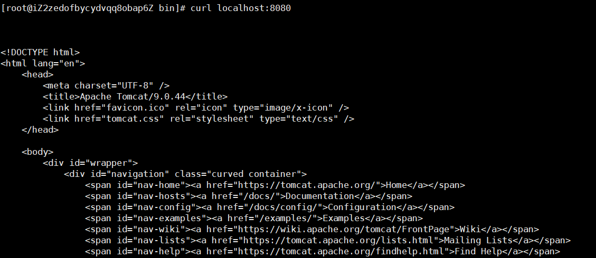
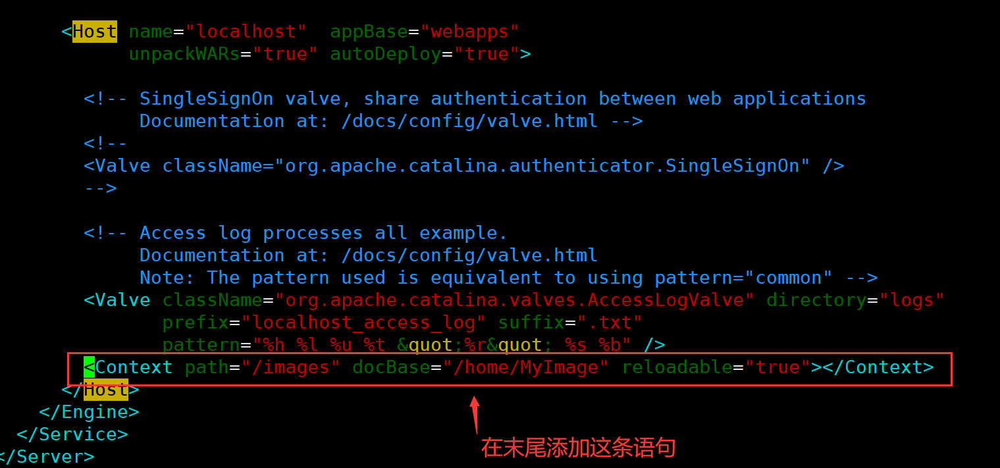

# 一、Linux 概述

## 1、什么是Linux？

Linux是基于Linux内核的操作系统。它是一个开源操作系统，可以在不同的硬件平台上运行。它为用户提供了免费的低成本操作系统。这是一个用户友好的环境，他们可以在其中轻松修改和创建源代码的变体。

## 2、Linux和Unix的区别

1. 开源性

   Linux是一款开源操作系统，不需要付费，即可使用；Unix是一款对源码实行知识产权保护的传统商业软件，使用需要付费授权使用。

2. 跨平台性

   Linux操作系统具有良好的跨平台性能，可运行在多种硬件平台上；Unix操作系统跨平台性能较弱，大多需与硬件配套使用。

3. 可视化界面

   Linux除了进行命令行操作，还有窗体管理系统；Unix只是命令行下的系统。

4. 硬件环境

   Linux操作系统对硬件的要求较低，安装方法更易掌握；Unix对硬件要求比较苛刻，按照难度较大。

5. 用户群体

   Linux的用户群体很广泛，个人和企业均可使用；Unix的用户群体比较窄，多是安全性要求高的大型企业使用，如银行、电信部门等，或者Unix硬件厂商使用，如Sun等。

相比于Unix操作系统，Linux操作系统更受广大计算机爱好者的喜爱，主要原因是Linux操作系统具有Unix操作系统的全部功能，并且能够在普通PC计算机上实现全部的Unix特性，开源免费的特性，更容易普及使用！

## 3、Linux的体系结构

从大的方面讲，Linux的体系结构可以分为两块：

- 用户空间：用户空间又包括用户的应用进程，C库。
- 内核空间：内核空间又包括系统调用接口、内核、平台架构相关的代码。

> **为什么Linux体系结构要分为用户空间和内核空间？**
>
> 1. 现代CPU实现了不同的工作模式，不同模式下CPU可以执行的指令和访问的寄存器不同；
> 2. Linux从CPU的角度触发，为了保护内核的安全，把系统分成了两部分。
>
> 用户空间和内核空间是程序执行的**两种不同的状态**，我们可以通过两种方式完成用户空间到内核空间的转移：1）系统调用；2）硬件中断。

## 4、简述Linux文件系统

在 Linux 操作系统中，所有被操作系统管理的资源，例如网络接口卡、磁盘驱动器、打印机、输入输出设备、普通文件或是目录都被看作是一个文件。

也就是说在 Linux 系统中有一个重要的概念：**一切都是文件**。其实这是 Unix 哲学的一个体现，而 Linux 是重写 Unix 而来，所以这个概念也就传承了下来。在 Unix 系统中，把一切资源都看作是文件，包括硬件设备。UNIX系统把每个硬件都看成是一个文件，通常称为设备文件，这样用户就可以用读写文件的方式实现对硬件的访问。

Linux 支持 5 种文件类型，如下图所示：


## 5、Linux 的目录结构是怎样的？

## 


**常见目录说明**：

- /bin： 存放二进制可执行文件(ls,cat,mkdir等)，常用命令一般都在这里；
- /etc： 存放系统管理和配置文件；
- /home： 存放所有用户文件的根目录，是用户主目录的基点，比如用户user的主目录就是/home/user，可以用~user表示；
- **/usr **： 用于存放系统应用程序；
- /opt： 额外安装的可选应用程序包所放置的位置。一般情况下，我们可以把tomcat等都安装到这里；
- /proc： 虚拟文件系统目录，是系统内存的映射。可直接访问这个目录来获取系统信息；
- /root： 超级用户（系统管理员）的主目录（特权阶级o）；
- /sbin: 存放二进制可执行文件，只有root才能访问。这里存放的是系统管理员使用的系统级别的管理命令和程序。如ifconfig等；
- /dev： 用于存放设备文件；
- /mnt： 系统管理员安装临时文件系统的安装点，系统提供这个目录是让用户临时挂载其他的文件系统；
- /boot： 存放用于系统引导时使用的各种文件；
- **/lib **： 存放着和系统运行相关的库文件 ；
- /tmp： 用于存放各种临时文件，是公用的临时文件存储点；
- /var： 用于存放运行时需要改变数据的文件，也是某些大文件的溢出区，比方说各种服务的日志文件（系统启动日志等。）等；
- /lost+found： 这个目录平时是空的，系统非正常关机而留下“无家可归”的文件（windows下叫什么.chk）就在这里。

## 6、为什么我们要把服务器部署在Linux上而不是windows上

1. **自由开源**

开源对于公司来说，意味着不用为操作系统支付任何费用，如果公司要为windows的商用购买正版，那么一套也不便宜。
如果公司内部有大牛，那么完全可以手动修改linux源码，让其成为为自己公司“定制”的操作系统。

2. **稳定性**

Linux系统以其最终的稳定性而闻名。在windows上，我们进程看到系统崩溃或者卡死，但是在linux上，这种情况发生的几率极小，并且linux系统还可以同时处理多个任务，在Windows配置中，更改配置通常需要重新启动。但是在linux中则不需要重启，配置的更改都可在系统运行时完成，且不会影响到不相关的服务，同样，windows服务器经常进行碎片整理，但是在linux上完全不需要这样做。

3. **安全**

在安全方面，Linux显然比Windows更安全，因为Linux主要基于最初从多用户操作系统开发的UNIX操作系统。只有管理员或root用户具有管理权限，其次Linux也会病毒和恶意软件的攻击频率很低，很多病毒都是针对于windows，而针对linux的病毒比起windows少太多太多。其次，玩linux的用户群基本上都是计算机方面的人员，加上linux社区庞大，一般发现漏洞，很快会被并提交到linux开源社区。

4. **成本低**

上面对于成本已经说到了一点，因为linux开源，企业不用为操作系统支付更多的费用。
linux系统比起windows来说占用的系统资源更小。windows的图形化界面非常占用系统资源，很多小伙伴的windows系统一启动，什么软件都没打开，内存就被吃掉好几个G。由于linux系统上没有图形化界面，那么可以省去系统开销，对于企业来说，如果说同样的硬件设备，在windows上只能部署5个应用服务，那么在linux上可以部署8个或者更多。这意味着企业可以直接降低硬件成本。

# 二、常用命令

## 1、基本命令

### 1）find

```shell
#在/home目录下查找以.txt结尾的文件名
find /home -name "*.txt"

#同上，但忽略大小写
find /home -iname "*.txt"

#匹配文件路径或者文件
find /usr/ -path "*local*"

#在/usr 目录下找出大小超过 10MB 的文件
find /usr -type f -size +10240k
```

### 2）ls

```shell
#以易读的方式显示文件大小(显示为 MB,GB…)：
ls -lh

#以最后修改时间升序列出文件：
ls -ltr

#在文件名后面显示文件类型：
ls -F
```

### 3）mkdir

```shell
#使用 -p 选项可以创建一个路径上所有不存在的目录：
mkdir -p dir1/dir2/dir3/dir4/
```

### 4）df

```shell
# 磁盘：disk
#显示文件系统的磁盘使用情况，默认情况下 df -k 将以字节为单位输出磁盘的使用量
df -k

#使用 df -h 选项可以以更符合阅读习惯的方式显示磁盘使用量
df -h

#使用 df -T 选项显示文件系统类型（type）。
df -T
```

### 5）cp

```shell
#拷贝 file1 到 file2 ，并保持文件的权限、属主和时间戳：
cp -p file1 file2
```

### 6）grep

```shell
#在文件中查找字符串(不区分大小写)：
grep -i "the" demo_file

#输出成功匹配的行，以及该行之后的三行：
grep -A 3 -i "example" demo_text
```

## 2、解压命令

### 1）tar

```shell
#创建一个新的tar文件：
tar -cvf test.tar test/

#解压tar文件：
tar -zxvf test.tar

#查看tar文件：
tar -tvf archive_name.tar
```

> tar命令解压缩语法：     
>
> ​	-x   解包      
>
> ​	-v  显示详细信息      
>
> ​	-f   指定解压文件      
>
> ​	-z   解压缩 

### 2）gzip

```shell
#创建一个 *.gz 的压缩文件：
gzip test.txt

#解压 *.gz 文件：
gzip -d test.txt.gz

#显示压缩的比率：
gzip -l *.gz
```

### 3）bzip2

```shell
#创建 *.bz2 压缩文件：
bzip2 test.txt

#解压 *.bz2 文件：
bzip2 -d test.txt.bz2
```

### 4）unzip

```shell
#解压 *.zip 文件：
unzip test.zip

#查看 *.zip 文件的内容：
unzip -l jasper.zip 。
```

## 3、系统命令

### 1）export

```shell
#输出跟字符串 jdk 匹配的环境变量：
export grep | jdk

#设置全局环境变量：
export ORACLE_HOME=/u01/app/oracle/product/10.2.0 
```

### 2）kill

```shell
#查找某个进程得到它的进程号
ps -ef | grep vim
ramesh    7243  7222  9 22:43 pts/2    00:00:00 vim

#然后再使用 kill -9 进程号终止该进程（实际场景并不会这么做）
kill -9 7243
```

### 3）useradd

```shell
#创建一个用户名为“lin”的新用户
useradd lin

#给lin用户设置密码
passwd lin

#切换到lin用户（root可随意切换）
su lin

#在root用户下删除lin用户的密码
passwd -d lin

#彻底删除lin用户
userdel lin -r
```

### 4）yum

> **yum**（全称为 Yellow dog Updater Modified）是一个在Fedora和RedHat以及SUSE中的Shell前端软件包管理器。基於RPM包管理，能够从指定的服务器自动下载RPM包并且安装，可以自动处理依赖性关系，并且一次安装所有依赖的软体包，无须繁琐地一次次下载、安装。

```shell
#使用 yum 安装 apache ：
yum install httpd

#更新 apache ：
yum update httpd

#卸载/删除 apache ：
yum remove httpd
```

### 5）rpm

> **rpm**是由红帽公司开发的软件包管理方式，使用rpm我们可以方便的进行软件的安装、查询、卸载、升级等工作。但是rpm软件包之间的依赖性问题往往会很繁琐,尤其是软件由多个rpm包组成时。

#### 1. RPM包命名原则：

httpd-2.2.15-15.el6.centos.1.i686.rpm

- ​	- httpd  软件包名 
- ​	- 2.2.15 软件版本 
- ​	- 15  软件发布的次数 
- ​	- el6.centos 适合的Linux平台 
- ​	- i686  适合的硬件平台 
- ​	- rpm  rpm包扩展名

#### 2. 命令选项：

- -i（install）  安装  
- -v（verbose） 显示详细信息   
- -h（hash） 显示进度  
- --nodeps 不检测依赖性
- -U（upgrade）  升级
- -e（erase） 卸载

#### 3. 演示

```shell
#使用 rpm 安装 apache ：
rpm -ivh httpd-2.2.3-22.0.1.el5.i386.rpm

#更新 apache ：
rpm -uvh httpd-2.2.3-22.0.1.el5.i386.rpm

#卸载/删除 apache ：
rpm -ev httpd 
```

### 6）shutdown （基本不用）

```shell
#关闭系统并立即关机：
shutdown -h now

#10 分钟后关机：
shutdown -h +10

#重启：
shutdown -r now

#重启期间强制进行系统检查：
shutdown -Fr now
```

### 7）service 命令

```shell
#查看服务状态：
service firewalld status

#查看所有服务状态：
service --status-all

#重启服务：
service firewalld restart
```

### 8）chmod

```shell
chmod 743 hello.txt
# 4-读取权限，2-写入权限，1-执行权限
#第一位表示属主
#第二位表示属主的组
#第三位表示其它
```

### 9）uname

查看系统与内核相关信息。

选项： 

- ​	-a： 查看系统所有相关信息； 
- ​	-r： 查看内核版本； 
- ​	-s： 查看内核名称。 

```shell
uname -a
Linux linjie 3.10.0-1160.11.1.el7.x86_64 #1 SMP Fri Dec 18 16:34:56 UTC 2020 x86_64 x86_64 x86_64 GNU/Linux
```

### 10）whereis

搜索命令所在目录及帮助文档路径。

```shell
#查找 ls 的位置
whereis ls
```

### 11）locate

locate 命名可以显示某个指定文件（或一组文件）的路径，它会使用由 updatedb 创建的数据库。

```shell
#显示系统中所有包含 crontab 字符串的文件
locate crontab
```

### 12）man

英文原意：manual（手册）

功能描述：获得帮助信息。

```shell
##显示ls命令的文档
man ls
```

## 4、网络命令

### 1）ifconfig

```shell
#查看和配置 Linux 系统的网络接口(无法查看公网ip)
ifconfig

#查看所有网络接口及其状态
ifconfig -s

#使用 up 和 down 命令启动或停止某个接口
ifconfig eth0 up
ifconfig eth0 down
```

### 2）ping

功能描述：测试网络连通性。

```shell
#ping 一个远程主机，只发 5 个数据包（-c 指定发送次数）
ping -c 5 gmail.com
```

> **如何禁止服务器被 ping** 
>
> ```shell
> [root@node0 ~]# echo 0 > /proc/sys/net/ipv4/icmp_echo_ignore_all  // 这个时候，别人是可以 ping 通自己的
> [root@node1 ~]# ping  192.168.6.6
> PING 192.168.6.6 (192.168.6.6) 56(84) bytes of data.
> 64 bytes from 192.168.6.6: icmp_seq=1 ttl=64 time=1.79 ms
> 64 bytes from 192.168.6.6: icmp_seq=2 ttl=64 time=0.597 ms
> 
> [root@node0 ~]# echo 1 > /proc/sys/net/ipv4/icmp_echo_ignore_all
> [root@node1 ~]# ping 192.168.6.6    // ping 不能了
> PING 192.168.6.6 (192.168.6.6) 56(84) bytes of data.
> --- 192.168.6.6 ping statistics ---
> 93 packets transmitted, 0 received, 100% packet loss, time 92168ms
> ```

### 3）curl

```shell
# curl 测试某个 URL 是否可以访问
curl www.baidu.com

# 设置访问的超时时间是 20 秒
curl --connect-timeout 20 www.baidu.com
```

### 4）wget

```shell
#使用 wget 从网上下载软件、音乐、视频：
wget http://prdownloads.sourceforge.net/sourceforge/nagios/nagios-3.2.1.tar.gz

#下载文件并以指定的文件名保存文件:
wget -O taglist.zip http://www.vim.org/scripts/download_script.php?src_id=7701
```

## 5、资源命令

### 1）ps

```shell
# 查看当前正在运行的所有进程：
ps -ef | more

# 以树状结构显示当前正在运行的进程，H选项表示显示进程的层次结构：
ps - efH | more

# 查看所有的java进程：
ps -ef | grep java
或
jps -m

```

### 2）uptime

这个命令可以快速查看机器的负载情况。这些数据表示等待 CPU 资源的进程和阻塞在不可中断 IO 进程（进程状态为 D）的数量。

命令的输出分别表示 1 分钟、5 分钟、15 分钟的平均负载情况。通过这三个数据，可以了解服务器负载是在趋于紧张还是趋于缓解。


### 3）vmstat

vmstat 命令，每行会输出一些系统核心指标，这些指标可以让我们更详细的了解系统状态。后面跟的参数 1 ，表示每秒输出一次统计信息。


- r：等待在CPU资源的进程数。这个数据比平均负载更加能够体现 CPU 负载情况，数据中不包含等待 IO 的进程。如果这个数值大于机器 CPU 核数，那么机器的 CPU 资源已经饱和。

- free：系统可用内存数（以千字节为单位），如果剩余内存不足，也会导致系统性能问题。
- si，so：交换区写入和读取的数量。如果这个数据不为 0 ，说明系统已经在使用交换区（swap），机器物理内存已经不足。
- us, sy, id, wa, st：这些都代表了 CPU 时间的消耗，它们分别表示用户时间(user)、系统（内核）时间(sys)、空闲时间(idle)、IO等待时间(wait)和被偷走的时间(stolen，一般被其他虚拟机消耗)。

上述这些 CPU 时间，可以让我们很快了解 CPU 是否处于繁忙状态。一般情况下，如果用户时间和系统时间相加非常大，CPU 出于忙于执行指令。如果IO等待时间很长，那么系统的瓶颈可能在磁盘 IO 。

示例命令的输出可以看见，大量 CPU 时间消耗在用户态，也就是用户应用程序消耗了 CPU 时间。这不一定是性能问题，需要结合 r 队列，一起分析。

### 4）free


free 命令可以查看系统内存的使用情况，`-m` 参数表示按照兆字节展示。

### 5）sar

可以查看网络设备的吞吐率。在排查性能问题时，可以通过网络设备的吞吐量，判断网络设备是否已经饱和。

```shell
# 查看网卡流量 ,每秒显示一次，总共显示5次
sar -n DEV 1 5
```

### 6）top

通过这个命令，可以相对全面的查看系统负载的来源。同时，top 命令支持排序，可以按照不同的列排序，方便查找出诸如内存占用最多的进程、CPU占用率最高的进程等。

### 7）netstat

```shell
# 查看系统开启了哪些端口
netstat -tunlp

# 查看有关java的网络连接状况
netstat -tunlp | grep java

# 查看网络连接状况
netstat -an
```

## 6、防火墙命令

```shell
# 查看防火墙状态
systemctl status firewalld

# 开启6379端口
firewall-cmd --zone=public --add-port=6379/tcp --permanent

# 重启防火墙
systemctl restart firewalld

# 查看开放的端口号
firewall-cmd --permanent --list-port

# 关闭防火墙
systemctl stop firewalld

# 启动防火墙
systemctl start firewalld
```

# 三、shell脚本语言

## 1、定义开头

`#!/bin/bash`

“#!“用来声明脚本由什么shell解释，否则使用默认shell

**1、运行前需加上可执行权限**


**2、三种运行方式**

- **./xxx.sh**

  ./xxx.sh :先按照 文件中#!指定的解析器解析

  如果#！指定指定的解析器不存在 才会使用系统默认的解析器

- **bash xxx.sh**

  如果bash不存在 才会使用默认解析器

- **. xxx.sh**

  直接使用默认解析器解析（不会执行第一行的#！指定的解析器）但是第一行还是要写的

## 2、变量

```shell
# 定义变量(变量和等号、等号和数值之间不要有空格)
num=100

# 引用变量
$num

# 清除变量值
unset num

# 从键盘上读入值
echo "请输入num的值："
read num

# 在一行上显示和添加提示
read -p "请输入num的值：" num

# 读取多个值
read data1 data2

# 设置只读变量(进行修改将报错)
readonly num=10

# 设置全局变量
【test.sh】
#!/bin/bash
export DATA=250
【退回到终端】
source test.sh
env或echo $DATA

# 如果想在PATH变量中追加一个路径，写法如下：
export PATH=$PATH:/需要添加的路径
```

> **注意**
>
> 1. 变量名只能包含英文字母下划线，不能以数字开头；
>
> 2. 等号两边不能直接接空格符，若变量中本身就包含了空格，则整个字符串都要用双引号、或单引号括起来；
>
> 3. 双引号 和 单引号的区别：
>
>    - 双引号：可以解析变量的值；
>    - 单引号：不能解析变量的值。
>
>    

## 3、预设变量

- $#：传给shell脚本参数的数量
- $*：传给shell脚本参数的内容
- $1、$2、$3、……、$9：运行脚本时传递给其的参数，用空格隔开
- $?：命令执行后的返回状态（用于检查上一个命令是否正确，0表示正确，非0表示出现错误）
- $0：当前执行的进程名
- $$：当前进程的进程号（最常见的用途是用作保存临时文件不会重复）


运行结果：


## 4、脚本标量的特殊用法

- ""（双引号）：包含的变量会被解释

- ''（单引号）：包含的变量不会被解释

- ``（反引号）：反引号中的内容作为系统命令，并执行其内容，可以替换输出为一个变量

  ```shell
  echo "taday is `date`"
  taday is Thu Oct 7 08:09:39 CST 2021
  ```

- \（转义字符）：同c语言 \n \t \r \a等，echo命令需加-e转义

  

- `(命令序列)`：（()由子shell 完成）

  

- `{命令序列}`：（{}由当前的shell执行）

  

## 6、变量的扩展

1. 判断变量是否存在

   ```shell
   #!/bin/bash
   # ${num:-val} 如果num存在，整个表达式的值为num，否则为val
   echo ${num:-100}	#100
   num=200
   echo ${num:-100}	#200
   ```

   ```shell
   #!/bin/bash
   # ${num:=100} 如果num存在，整个表达式的值为num；否则为val，同时将num的值赋值为val
   echo ${num:=100}	#100
   echo "num=$num"
   ```

2. 字符串的操作

   ```shell
   #!/bin/bash
   str="hehe:haha:xixi:lala"
   # 测量字符串的长度${#str}
   echo "str的长度为：${#str}"	#19
   
   # 从下标3为位置提取字符串
   echo ${str:3}				#"e:haha:xixi:lala"
   
   # 从下标3为位置提取长度为6字节
   echo ${str:3:6}				#"e:haha"
   
   # ${str/old/new} 用new替换str出现的第一个old
   echo ${str/:/#}				#"hehe#haha:xixi:lala"
   
   # ${str//old/new} 用new替换str所有的old
   echo ${str//:/#}			#"hehe#haha#xixi#lala"
   ```

## 7、条件测试

test命令：用于测试字符串、文件状态和数字
test命令有两种格式：test condition 或[ condition ]（使用方括号时，要注意在条件两边加上空格。）

1. **文件测试**
   - `-e`是否存在
   - `-d`是否是目录
   - `-f`是否是文件
   - `-r`是否是可读
   - `-w`是否是可写
   - `-x`是否是可执行
   - `-L`是否是符号连接
   - `-c`是否是字符设备
   - `-b`是否是块设备
   - `-s`文件非空
2. **字符串测试**
   - `=`是否相等
   - `!=`是否不等
   - `-z`是否是空串
   - `-n`是否是非空串
3. **数字测试**
   - `-eq`数值相等
   - `-ne`数值不等
   - `-gt`数1大于数2
   - `-ge`数1大于等于数2
   - `-le`数1小于等于数2
   - `-lt`数1小于数2
4. **复合语句测试**、
   - `&&`
   - `||`
   - `-a`相当于and
   - `-o`相当于or
   - `!`取反

## 8、控制语句格式

1. **if**

   1. 格式：

      ```shell
      格式一：
      if [条件1]; then
          执行第一段程序
      else
          执行第二段程序
      fi
      格式二：
      if [条件1]; then
          执行第一段程序
      elif [条件2]；then
      执行第二段程序
      else
          执行第三段程序
      fi
      ```

   2. 案例：

      （判断当前路径下有没有文件夹 有就进入创建文件 没有 就创建文件夹 再进入创建文件）

      ```shell
      #!/bin/bash
      read -p "请输入文件夹的名字：" dirName
      
      if [ -e $dirName ];then
      	echo "$dirName是存在的 即将进入文件夹"
      	cd $dirName
      	echo "即将创建文件名为test.c"
      	touch test.c
      else
      	echo "该文件 不存在 即将创建该文件夹"
      	mkdir $dirName
      	echo "即将进入$dirName里面"
      	cd $dirName
      	echo "即将创建test.c"
      	touch test.c
      fi
      ```

2. **case**

   1. 格式：

      ```shell
      case $变量名称 in
      	"第一个变量内容")
      	程序段一
      	;;			#相当于break
      	"第二个变量内容")
      	程序段二
      	;;			#相当于break
      	*)
      	其它程序段
      	exit 1
      esac
      ```

   2. 案例：

      ```shell
      #!/bin/bash
      read -p "请输入yes/no:" yes
      case $yes in
      	yes | y* | Y*)
      	echo "输入了$yes"
      	;;
      	no | n* | N*)
      	echo "输入了$yes"
      	;;
      	*)
      	echo "输入了其它内容"
      esac
      ```

3. **for**

   1. 格式：

      ```shell
      格式一：
      for(( 初始值;限制值;执行步阶 ))
      	do
      		程序段
      	done
      
      格式二：
      for var in con1 con2 con3 ……
      	do
      		程序段
      	done
      #第一个循环时，$var的内容为con1
      #第二个循环时，$var的内容为con2
      #第三个循环时，$var的内容为con3
      ```

   2. 案例：

      1. 案例一：

         ```shell
         #!/bin/bash
         declare -i sum=0	
         declare -i i=0
         # declare用来声明shell变量、设置变量属性，也可写作typeset；
         # declare -i s代表强制把s变量当作int参数来处理
         for (( i = 0;i<=100;i++))
         do
         	sum=sum+i
         done
         echo "sum=$sum"
         ```

      2. 案例二：

         ```shell
         #!/bin/bash
         for fileName in `ls`
         do
         	if [ -d $fileName ];then
         		echo "$fileName是文件夹"
         	elif [ -f $fileName ];then
         		echo "$fileName是普通文件"
         	fi
         done
         ```

4. **while**

   格式：

   ```shell
   while [ condition ]			#当condition成立时进入while循环
   	do
   		程序段
   	done
   ```

5. ==**until**==

   格式：

   ```shell
   until [ condition ]			#当condition成立时退出循环
   	do
   		程序段
   	done
   ```

6. ==**break continue**==

7. ==**函数**==

   1. 格式：

      ```shell
      # 定义函数的格式
      格式一：
      函数名(){
      	命令……
      }
      
      格式二：
      function 函数名(){
      	命令……
      }
      
      （所有函数在使用前必须定义，必须将函数放在脚本开始部分，直至shell解释器首次发现它时，才可以使用）
      
      # 调用函数的格式
      函数名 param1 param2 ……
      使用参数：$1、$2、……、$9
      
      #返回值
      return 从函数中返回，用最后状态命令决定返回值
      return 0 无错误返回
      return 1 有错误返回
      ```

   2. 案例：

      1. 案例一：

         ```shell
         #!/bin/bash
         # 函数定义
         getMax(){
         	if [ $1 -gt $2 ];then
         		return $1
         	else
         		return $2
         	fi
         }
         
         read -p "请输入数值1：" data1
         read -p "请输入数值2：" data2
         # 函数调用
         getMax $data1 $data2
         echo "$?"
         ```

      2. 案例二（函数在另外一个文件上）：

         【fun.sh】

         ```shell
         #!/bin/bash
         # 函数定义
         getMax(){
         	if [ $1 -gt $2 ];then
         		return $1
         	else
         		return $2
         	fi
         }
         ```

         【sh.sh】

         ```shell
         #!/bin/bash
         
         #导入函数
         source fun.sh
         
         read -p "请输入数值1：" data1
         read -p "请输入数值2：" data2
         
         #调用函数
         x $data1 $data2
         
         #$? 只有一个字节
         echo "$data1和$data2的最大值：$?"
         ```

# 四、面试题

## 1、如何规划一台Linux主机？

1. 确定机器是要做什么的，比如是做WEB还是DB等，因为不同的用途，机器的配置会有所不同；
2. 确定好之后，就要定系统需要怎么安装，默认安装哪些系统、分区怎么做。
3. 需要优化系统的哪些参数，需要创建哪些用户等等的。

## 2、当用户反馈网站访问慢，你会如何处理？

### 1）首先我们需要哪些方面的因素会导致网站访问慢？

1. 服务器出口带宽不够用
   - 本身服务器购买的出口带宽比较小。一旦并发量大的话，就会造成分给每个用户的出口带宽就小，访问速度自然就会慢。
   - 跨运营商网络导致带宽缩减。例如：公司网站放在电信的网络上，那么客户这边对接是联通带宽，这也可能导致带宽的缩减。
2. 服务器负载过大，导致响应不过来
   - 分析系统负载，使用`w`命令或者`uptime`命令查看系统负载。如果负载过高，则使用`top`命令查看CPU，MEM等占用情况，要么是CPU繁忙，要么是内存不够；
   - 如果这两者都正常，再去使用`sar -n DEV`命令分析网卡流量，分析是不是遭到了攻击。一旦分析出问题的原因，采取对应的措施解决，如决定要不要杀死一些进程，或者禁止一些访问等。
3. 数据库瓶颈
   - 如果慢查询比较多。那么就要开发人员或 DBA 协助进行 SQL 语句的优化；
   - 如果数据库响应慢，考虑可以加一个数据库缓存，如 Redis 等。然后，也可以搭建 MySQL 主从，一台 MySQL 服务器负责写，其他几台从数据库负责读。
4. 网站开发代码没有优化好
   - 例如 SQL 语句没有优化，导致数据库读写相当耗时。

### 2）针对网站访问慢，怎么去排查？

1. 首先要确定是用户端还是服务端的问题。当接到用户反馈访问慢，那边自己立即访问网站看看，如果自己这边访问快，基本断定是用户端问题，就需要耐心跟客户解释，协助客户解决问题；
2. 如果访问也慢，那么可以利用浏览器的调试功能，看看加载那一项数据消耗时间过多，是图片加载慢，还是某些数据加载慢；
3. 针对服务器负载情况。查看服务器硬件(网络、CPU、内存)的消耗情况。如果是购买的云主机，比如阿里云，可以登录阿里云平台提供各方面的监控，比如 CPU、内存、带宽的使用情况；
4. 如果发现硬件资源消耗都不高，那么就需要通过查日志，比如看看 MySQL慢查询的日志，看看是不是某条 SQL 语句查询慢，导致网站访问慢。

### 3）怎么去解决？

1. 如果是出口带宽问题，那么就申请加大出口带宽；
2. 如果慢查询比较多，那么就需要开发人员或DBA协助进行SQL语句的优化；
3. 如果数据库响应慢，考虑可以加一个数据库缓存，如Redis等。然后也可以搭建MySQL主从，一台MySQL服务器负责写，其它几台负责读；
4. 申请购买CDN服务，加速用户的访问；
5. 如果访问还是比较慢，那就需要从整体架构上进行优化。如搭建分布式架构。

## 3、如何排查CPU load过高问题

[参考博客：《cpu load过高问题排查》](https://www.cnblogs.com/lddbupt/p/5779655.html)


top命令中load average显示的是最近1分钟、5分钟和15分钟的系统平均负载。

### 1）load average的概念

系统的load是指正在运行和准备好运行的进程的总数。load average就是一定实践内的load数量。

一般来说只要每个CPU的当前活动进程数不大于3那么系统的性能就是良好的，如果每个CPU的任务数大于5，那么就表示这台机器的性能有严重问题。

Load Average 就是一段时间(1min,5min,15min)内平均Load。**平均负载的最佳值是1**，这意味着每个进程都可以在一个完整的CPU 周期内完成。

### 2）cpu load高的排查思路

1. 首先排查哪些进程cpu占用率高，通过`ps ux`命令

   

2. 查看对应java进程的每个线程的CPU占用率。通过`ps -Lp 25245 cu`

   

3. 追踪线程内部，查看load过高原因。通过命令：`jstack 25245`。

   或者打印线程 jstack `pidof java` > stack.out

   查找到对应的threadid, 再反查代码。

### 3）一般经验

cpu load的飙升，一方面可能和 full gc 次数的增大有关，一反面可能和死循环有关系。

### 4）数据库系统load高的一般原因

1. 业务并发调用全表扫描/带有order by 排序的SQL语句；

2. SQL语句没有合适索引/执行计划出错/update/delete where扫描全表,阻塞其他访问相同表的sql执行；

3. 存在秒杀类似的业务比如聚划算10点开团或者双十一秒杀,瞬时海量访问给数据库带来冲击；

4. 数据库做逻辑备份(需要全表扫描)或者多实例的压缩备份(压缩时需要大量的cpu计算,会导致系统服务器load飙高)；

   > 逻辑备份是指使用软件技术从数据库中导出数据并写入一个输出文件，该文件的格式一般与原数据库的文件格式不同，只是原数据库中数据内容的一个映像。因此，逻辑备份文件只能用来对数据库进行逻辑恢复，即数据导入，而不能按数据库原来的存储特征进行物理恢复。逻辑备份一般用于增量备份，即备份那些在上次备份以后改变的数据。

5. （磁盘写入方式改变 比如有writeback 变为 write through）

### 5）数据库层面上的排查

1. `top -c`检查当前占用cpu资源最多的进程命令。-c 是为了显示出进程对应的执行命令语句，方便查看是什么操作导致系统load飙高；

2. 根据不同的情况获取**pid** 或者MySQL的端口号；

3. 如果是MySQL 数据库服务导致laod 飙高，则可以使用如下命令：

   ```sql
   show processlist;
   SELECT * FROM  INFORMATION_SCHEMA.PROCESSLIST WHERE COMMAND <> 'sleep' AND TIME>100;
   ```

4. 获取异常的sql之后，可以建立相对应的索引或通过增加缓存的方式来解决。

# 五、实战

## 1、安装jdk

1. 下载jdk

[1.8官网下载](https://www.oracle.com/java/technologies/javase/javase-jdk8-downloads.html#license-lightbox)


2. 完成后使用xftp传输到云服务器的home目录下

3. 解压

```shell
tar -zxvf jdk-8u281-linux-x64.tar.gz
```

4. 新建文件夹

```shelll
mkdir /usr/local/java
```

5. 将解压得到的文件夹移动到/usr/local/java目录下

```shell
mv jdk1.8.0_281 /usr/local/java
```

6. 修改profile文件

```shell
vim /etc/profile
```

7. 在尾部追加一下内容

```shell
#配置java
export JAVA_HOME=/usr/local/java/jdk1.8.0_281
export CLASSPATH=$JAVA_HOME/lib/
export PATH=$PATH:$JAVA_HOME/bin
export PATH JAVA_HOME CLASSPATH
```

8. 更新profile文件

```shell
source /etc/profile
```

9. 测试jdk

```shell
java -version
```

10. 成功


## 2、安装Tomcat

1. 下载

[Tomcat9.0官网](https://mirrors.tuna.tsinghua.edu.cn/apache/tomcat/tomcat-9/v9.0.44/bin/apache-tomcat-9.0.44.tar.gz)


2. 完成后使用xftp传输到云服务器的home目录下

3. 解压

```shell
tar -zxvf apache-tomcat-9.0.44.tar.gz
```

4. 新建文件夹

```shell
mkdir /usr/local/tomcat
```

5. 将解压得到的文件夹移动到/usr/local/java目录下

```shell
mv apache-tomcat-9.0.44 /usr/local/tomcat
```

6. 修改profile文件

```sh
vim /etc/profile
```

7. 在尾部追加一下内容

```shell
#配置tomcat
export  TOMCAT_HOME=/usr/local/tomcat
export  PATH=$PATH:$JAVA_HOME/bin:$TOMCAT_HOME/bin

```

8. 更新profile文件

```shell
source /etc/profile
```

9. 测试

```shell
#进入bin目录
cd /usr/local/tomcat/apache-tomcat-9.0.44/bin

#启动tomcat
./startup.sh
```

10. 结果




## 3、Java项目部署

### 1）jar包和war包的区别：

war是一个web模块，其中需要包括baiWEB-INF，是可以直接运行的WEB模块；

jar一般只是包括一些class文件，在声明了Main_class之后是可以用java命令运行的。

因此，springboot项目应该打成jar包。

### 2）运行jar包的命令：

**命令一：**


`java -jar xxx.jar`

**优化方法一**：

`java -jar xxx.jar &`

（& 表示后台运行，ssh窗口不被锁定，但是关闭窗口时，程序还是会退出）

**优化方法二**：（no hang up(不挂起)）

`nohup java -jar xxx.jar &`

（`nohup java -jar record-web-0.0.1-SNAPSHOT.jar> /dev/null 2> /dev/null &`）

（nohup 表示不挂断运行命令行，当账号退出或关闭终端时，程序仍然运行

当用 nohup 命令执行作业时，该作业的所有输出被重定向到nohup.out的文件中，除非另外指定了输出文件。）

**优化方法三：**

`nohup java -jar xxx.jar >/usr/local/temp.txt &`

（\> /usr/local/temp.txt 表示将所有启动的日志信息记录到temp.txt文件中）

### 3）linux端口占用问题：

查询PID号：`netstat -tunlp`

杀死进程：kill -9 xxx


## 4、部署Vue项目

1. 修改config/index.js里的assetsPublicPath的字段，初始项目是/，现在改为./


2. 使用npm run build进行打包


3. 把项目中的dist文件夹放到服务器上


4. icon图标不显示的处理方法

打开 build/utils.js 文件，在如下位置添加 publicPath: '../../'


## 5、使用Tomcat访问服务器上的图片

1）修改在conf目录下找到`server.xml`文件：


2）修改该文件



- ```xml
  <Context path="/images" docBase="/home/MyImage" reloadable="true"></Context>
  ```

- 其中"/images"为http访问路径，"/home/MyImage"为服务器存放图片的位置

3）启动Tomcat，访问成功！

