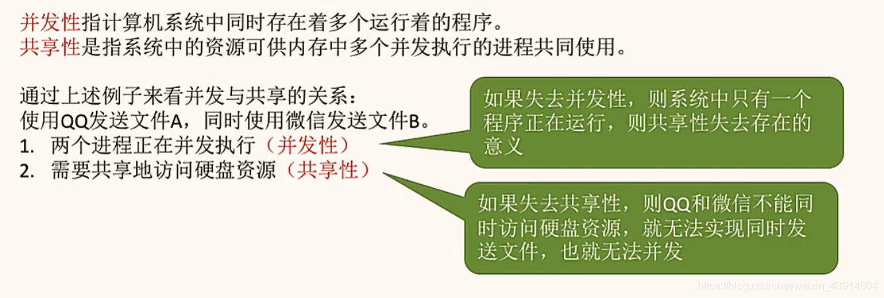
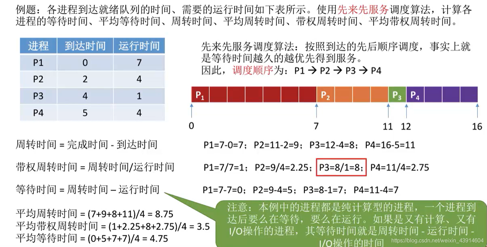
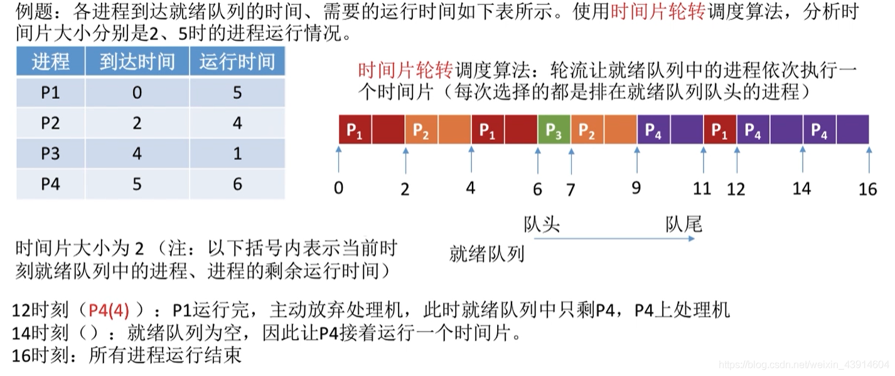
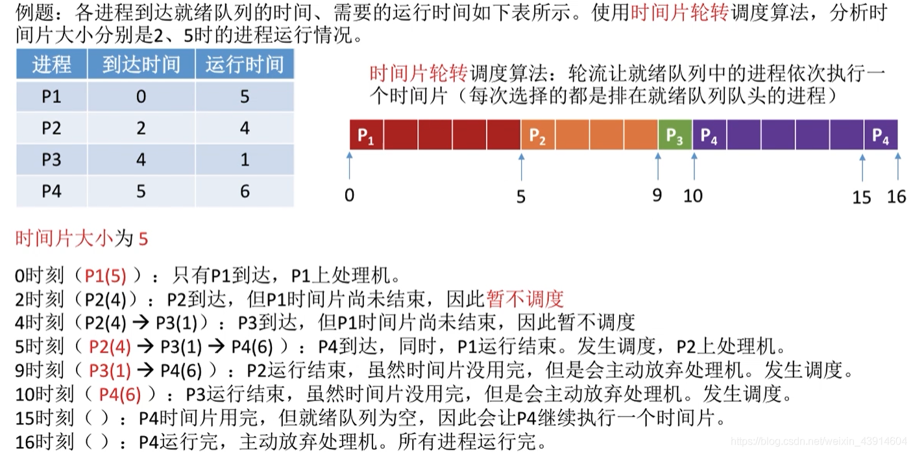
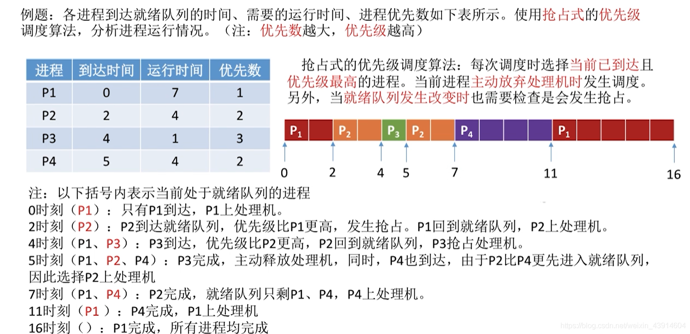
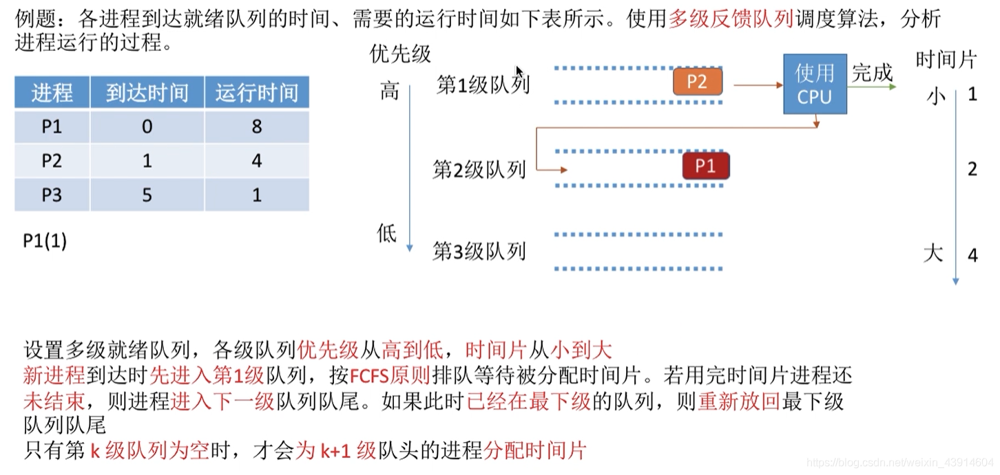

# 一、计算机系统概述

## 1、什么是操作系统

是系统最基本最核心的软件，属于系统软件；

控制和管理整个计算机的硬件和软件资源；

合理的组织、调度计算机的工作与资源分配；

为用户和其他软件提供方便的接口和环境。

## 2、简述一下操作系统的特征

### 1)   并发

- 并发：两个或多个事件在同一`时间间隔内`发生，这些事件在宏观上是同时发生的，在微观上是交替发生的， 操作系统的并发性指系统中同时存在着多个运行的程序
- 并行：两个或多个事件在同一`时刻`发生

### 2)   共享

- 资源共享即共享，是指系统中的资源可以`供内存中多个并发执行的进程`共同使用
- 共享分为两类：互斥共享和同时共享
- 并发性和共享性互为存在条件：



### 3)   虚拟

空间复用技术；

时分复用技术。

### 4)   异步

异步：多道程序环境允许多个程序并发执行，但由于资源有限，如cpu只有一个，进程的执行并不是一贯到底的，而是走走停停的，它以不可预知的速度向前推进。

> **阻塞与非阻塞**
>
> - 阻塞：是指调用线程或者进程被操作系统挂起。
> - 非阻塞：是指调用线程或者进程不会被操作系统挂起。
>
> **同步与异步**
>
> 同步是阻塞模式，异步是非阻塞模式。
>
> - 同步就是指一个进程在执行某个请求的时候，若该请求需要一段时间才能返回信息，那么这个进程将会一直等待下去，直到收到返回信息才继续执行下去；
> - 异步是指进程不需要一直等下去，而是继续执行下面的操作，不管其他进程的状态。当有消息返回式系统会通知进程进行处理，这样可以提高执行的效率。

## 3、什么是系统调用？有何作用

### 1)   含义

系统调用是操作系统提供给应用程序的接口，会使处理器从用户态切换为核心态。

用户态：只能执行非特权指令；

核心态：特权指令和非特权指令都能执行。


> **如何从用户态切换到内核态呢？**
>
> 1. 系统调用：这是用户态进程主动要求切换到内核态的一种方式，用户态进程通过系统调用申请使用操作系统提供的服务程序完成工作，比如 read 操作，比如前例中 fork() 实际上就是执行了一个创建新进程的系统调用。而系统调用的机制其核心还是使用了操作系统为用户特别开放的一个中断来实现，例如Linux的int 80h中断。 
> 2. 异常：当CPU在执行运行在用户态下的程序时，发生了某些事先不可知的异常，这时会触发由当前运行进程切换到处理此异常的内核相关程序中，也就转到了内核态，比如**缺页异常**。 
> 3. 外围设备的中断：当外围设备完成用户请求的操作后，会向CPU发出相应的中断信号，这时CPU会暂停执行下一条即将要执行的指令转而去执行与中断信号对应的处理程序，如果先前执行的指令是用户态下的程序，那么这个转换的过程自然也就发生了由用户态到内核态的切换。比如硬盘读写操作完成，系统会切换到硬盘读写的中断处理程序中执行后续操作等。

### 2)   作用

应用程序可以通过系统调用（程序接口）请求获得操作系统的服务。

### 3)   按功能分类

- 设备管理：完成设备的请求或释放，以及设备启动等功能。

- 文件管理：完成文件的读、写、创建及删除等功能。

- 进程控制：完成进程的创建、撤销、阻塞及唤醒等功能。

- 进程通信：完成进程之间的消息传递或信号传递等功能。

- 内存管理：完成内存的分配、回收以及获取作业占用内存区大小及地址等功能。


# 二、进程管理

## 1、进程

### 1）进程的组成


> **\* PCB是什么？**
>
> （1）PCB主要包含下面几部分的内容：
>
> - 进程的描述信息，比如进程的名称，标识符；
> - 处理机的状态信息，当程序中断是保留此时的信息，以便 CPU 返回时能从断点执行 ；
> - 进程调度信息，比如阻塞原因，状态，优先级等等；
> - 进程控制和资源占用，同步通信机制，链接指针（指向队列中下一个进程的 PCB 地址）
>
> （2）PCB 的作用：
>
> - PCB是进程实体的一部分，是操作系统中最重要的数据结构；
>
> - 由于它的存在，使得多道程序环境下，不能独立运行的程序成为一个能独立运行的基本单位，使得程序可以并发执行 ；
>
> - 系统通过 PCB 来感知进程的存在。（换句话说，PCB 是进程存在的唯一标识） ；
>
> - 进程的组成可以用下图来表示，PCB 就是他唯一标识符。
>
>   

### 2)   进程和程序的关系

**区别**

- 进程是动态的。程序是静态的

- 程序是一个包含了所有指令和数据的静态实体。本身除占用磁盘的存储空间外，并不占用系统如CPU、内存等运行资源。

- 进程由程序段、数据段和PCB构成,会占用系统如CPU、内存等运行资源。

- 一个程序可以启动多个进程来共同完成。


**联系**

- 进程不能脱离具体程序而虚设，程序规定了相应进程所要完成的动作。


### 3)   进程和线程的区别

进程是对运行时程序的封装，是系统进行资源调度和分配的的基本单位，实现了操作系统的并发；

线程是进程的子任务，是CPU调度和分配的基本单位，用于保证程序的实时性，实现进程内部的并发；

一个程序至少有一个进程，一个进程至少有一个线程，线程依赖于进程而存在；

进程在执行过程中拥有独立的内存单元，而多个线程共享进程的内存。


### 4)   进程间的通信方式

#### 1.无名管道：

简答：管道是一种半双工的通信方式，数据只能单向流动，而且只能在具有亲缘关系的进程间使用。进程的亲缘关系通常是指父子进程关系。

详解：匿名管道顾名思义，它没有名字标识，匿名管道是特殊文件只存在于内存，没有存在于文件系统中，shell命令中的「|」竖线就是匿名管道，通信的数据是无格式的流并且大小受限，通信的方式是单向的，数据只能在一个方向上流动，如果要双向通信，需要创建两个管道，再来匿名管道是只能用于存在父子关系的进程间通信，匿名管道的生命周期随着进程创建而建立，随着进程终止而消失。

#### 2.有名管道：

简答：有名管道也是半双工的通信方式，但是它允许无亲缘关系进程间的通信。

详解：命名管道突破了匿名管道只能在亲缘关系进程间的通信限制，因为使用命名管道的前提，需要在文件系统创建一个类型为p的设备文件（mkfifo【管道名】），那么毫无关系的进程就可以通过这个设备文件进行通信。另外，不管是匿名管道还是命名管道，进程写入的数据都是缓存在内核中，另一个进程读取数据时候自然也是从内核中获取，同时通信数据都遵循先进先出原则，不支持lseek之类的文件定位操作。

#### 3.消息队列：

简答：消息队列是由消息的链表，存放在内核中并由消息队列标识符标识。消息队列克服了信号传递信息少、管道只能承载无格式字节流以及缓冲区大小受限等缺点。

详解：消息队列克服了管道通信的数据是无格式的字节流的问题，消息队列实际上是保存在内核的「消息链表」，消息队列的消息体是可以用户自定义的数据类型，发送数据时，会被分成一个一个独立的消息体，当然接收数据时，也要与发送方发送的消息体的数据类型保持一致，这样才能保证读取的数据是正确的。消息队列通信的速度不是最及时的，毕竟每次数据的写入和读取都需要经过用户态与内核态之间的拷贝过程。

#### 4.共享内存：

简答：共享内存就是映射一段能被其他进程所访问的内存，这段共享内存由一个进程创建，但多个进程都可以访问。共享内存是最快的IPC方式，它是针对其他进程间通信方式运行效率低而专门设计的。它往往与其他通信机制，如信号量，配合使用，来实现进程间的同步和通信。

详解：共享内存可以解决消息队列通信中用户态与内核态之间数据拷贝过程带来的开销，它直接分配一个共享空间，每个进程都可以直接访问，就像访问进程自己的空间一样快捷方便，不需要陷入内核态或者系统调用，大大提高了通信的速度，享有最快的进程间通信方式之名。但是便捷高效的共享内存通信，带来新的问题，多进程竞争同个共享资源会造成数据的错乱。那么，就需要信号量来保护共享资源，以确保任何时刻只能有一个进程访问共享资源，这种方式就是互斥访问。

#### 5.信号量：

（书接上文）信号量不仅可以实现访问的互斥性，还可以实现进程间的同步，信号量其实是一个计数器，表示的是资源个数，其值可以通过两个原子操作来控制，分别是P操作和V操作。

信号量是一个计数器，可以用来控制多个进程对共享资源的访问。它常作为一种锁机制，防止某进程正在访问共享资源时，其他进程也访问该资源。因此，主要作为进程间以及同一进程内不同线程之间的同步手段。

#### 6.信号：

简答：信号是一种比较复杂的通信方式，用于通知接收进程某个事件已经发生。

详解：与信号量名字很相似的叫信号，它俩名字虽然相似，但功能一点儿都不一样。信号是进程间通信机制中唯一的异步通信机制，信号可以在应用进程和内核之间直接交互，内核也可以利用信号来通知用户空间的进程发生了哪些系统事件，信号事件的来源主要有硬件来源（如键盘Cltr+C）和软件来源（如kill命令），一旦有信号发生，进程有三种方式响应信号1.执行默认操作、2.捕捉信号、3.忽略信号。有两个信号是应用进程无法捕捉和忽略的，即SIGKILL和SEGSTOP，这是为了方便我们能在任何时候结束或停止某个进程。

#### 7.套接字：

简答：套接字也是一种进程间通信机制，与其他通信机制不同的是，它可用于不同机器间的进程通信。

详解：Socket实际上不仅用于不同的主机进程间通信，还可以用于本地主机进程间通信，可根据创建Socket的类型不同，分为三种常见的通信方式，一个是基于TCP协议的通信方式，一个是基于UDP协议的通信方式，一个是本地进程间通信方式。

### 5)   进程的调度算法

#### 1.      先来先服务FCFS

算法原则：按照作业/进程到达的先后顺序进行服务，是一种非抢占式的算法；

用于作业/进程调度：用于作业调度时，考虑的是哪个作业先到达后备队列；用于进程调度时，考虑的是哪个进程先到达就绪队列；

优点：公平、算法实现简单，不会产生“饥饿”现象

缺点：对长作业有利，对短作业不利；非抢占式算法

例题：



#### 2.      短作业优先SJF

算法思想：追求最少的平均等待时间、最少的平均周转时间、最少的平均带权周转时间；

算法规则：最短的作业/进程优先得到服务（“最短”指服务的时间最短）；

优点：“最短的”平均等待时间、平均周转时间

缺点：不公平。对短作业有利，对长作业不利。可能产生饥饿现象。另外，作业/进程的运行时间是由用户提供的，并不一定真实，不一定能做到真正的短作业优先

抢占式、非抢占式算法；

例题：（非抢占式）


例题：（抢占式）


#### 3.      高相应比优先HRRN

算法思想：要综合考虑作业/进程的等待时间和要求服务的时间；

算法原则：在每次调度时先计算各个进程的响应比，选择相应比最高的进程为其服务

相应比=（等待时间+要求服务时间）/要求服务时间

优点：综合考虑了等待时间和运行时间（要求服务时间）等待时间相同时，要求服务时间短的优先（SJF的优点），要求服务时间相同时，等待长的优先（FCFS的优点），对于长作业来说，随着等待时间越来越大，从而避免了长作业饥饿的问题。

非抢占式算法；

例题：


#### 4.      时间片轮转-RR

- 算法思想：公平地、轮流地为各个进程服务，让每个进程在一定时间间隔

- 算法原则：按照各进程到达就绪队列的顺序，轮流让各个进程执行一个时间片。若进程未在一个时间片执行完，则剥夺处理机，将进程重新放到就绪队尾重新排队。


- 优点：公平；响应快，适用于分时操作系统，不会产生饥饿现象


- 缺点：
  - 由于高频率的进程切换，因此有一定开销
  - 不区分任务的紧急程度

- 时间片长度的选择：
  - 太小：进程切换过于频繁，系统花费大量的时间来处理进程切换
  - 太大：时间片轮转调度算法退化为先来先服务调度算法

- 抢占式算法；

- 例题：






#### 5.      优先级调度算法

- 算法思想：随着计算机的发展，特别是实时操作系统的出现，越来越多的应用场景需要根据任务的紧急程度来决定处理顺序；
- 算法原则：调度时选择优先级最高的进程
- 优点：
  - 用优先级区分紧急程度、重要程度，适用于实时操作系统
  - 可灵活地调整对各种进程的偏好程度
- 缺点：若源源不断地有高优先级的进程到来，则可能导致饥饿现象

- 抢占式、非抢占式；
- 例题（非抢占式）


- 例题（抢占式）



#### 6.      多级反馈队列

- 算法思想：对其它调度算法的折中平衡；
- 算法原则
  - 设置多级就绪队列，各级队列优先级从高到低，时间片从小到大
  - 新进程到达时先进入第1级队列，按FCFS原则排队等待被分配时间片，若用完时间片进程还未结束，则进程进入下一级队列队尾。若果此时已经是在最下级的队列，则重新放回到该队列队尾
  - 只有第k级队列为空时，才会为k+1级对头的进程分配时间片

- 优点：综合了FCFS、RR、SPF等算法的优点


- 缺点：可能产生饥饿；
- 例题：



> 1. **批处理系统：**
>
> 批处理系统没有太多的用户操作，在该系统中，调度算法目标是保证吞吐量和周转时间（从提交到终止的时间）。（FCFS，SJ，HRRN）。
>
> 2. **交互式系统：**
>
> 交互式系统有大量的用户交互操作，在该系统中调度算法的目标是快速地进行响应。（RR，优先级调度算法，多级反馈队列）。
>
> 3. **实时系统：**
>
> 实时系统要求一个请求在一个确定时间内得到响应。
>
> 分为硬实时和软实时，前者必须满足绝对的截止时间，后者可以容忍一定的超时。

## 2、线程

### 1）什么是线程

线程是一个基本的CPU执行单元，也是程序执行流的最小单位。引入线程后，不仅是进程之间可以并发，进程内的各线程之间也可以并发，从而进一步提升了系统的并发度，使得一个进程内也可以并发处理各种任务（如QQ视频、文字聊天、传文件）。

> **什么是协程**
>
> 协程是用户态的轻量级线程，是线程内部的基本单位。无需线程上下文切换的开销、无需原子操作锁定及同步的开销、方便切换控制流，简化编程模型。

### 2）线程间的同步方式

#### 1.互斥量

采用互斥对象机制，只有拥有互斥对象的线程才有访问公共资源的权限。因为互斥对象只有一个，所以可以保证公共资源不会被多个线程同时访问。比如Java中的synchronized关键词和各种Lock都是这种机制。

> **生产者消费者模型：**
>
> ```c
> mutex = 1;
> empty = N;
> full = 0;
> 
> void Producer() {
>     P(empty); // 生产者生产一个产品，消耗一个缓冲区 
>     P(mutex);
>     ....      // 临界区
>     V(mutex);
>     V(full); // 产品数量加1
> }
> 
> void Consumer() {
>     P(full); // 消费者消耗一个产品，释放一个缓冲区
>     P(mutex); // 临界区上锁
>     ....
>     V(mutex); // 临界区锁释放
>     V(empty); // 增加一个缓冲区
> }
> 
> void P(S){
>     S--;
>     if(S < 0) block();  // 如果小于0，代表资源没了
> }
> 
> void V(S){
>     S++;
>     if(S >= 0) wakeUp(); // 如果小于等于0，代表有进程仍然在等待，通知他们ok了
> }
> ```

#### 2.信号量

它允许同一时刻多个线程访问同一资源，但是需要控制同一时刻访问此资源的最大线程数量。类似Semaphore；

#### 3.事件

Wait/Notify：通过通知操作的方式来保持多线程同步，还可以方便的实现多线程优先级的比较操作。

### 3）死锁

#### 1.死锁、死循环、饥饿的区别？

#### 2.产生的条件

- 互斥：只有对必须互斥使用的资源的争抢才会导致死锁

- 不可剥夺：进程所获得的资源在为使用前，不能有其他进程强行夺走，只能主动释放

- 占有并等待：进程已经保持了至少一个资源，但又提出了新的资源请求，而该资源又被其他进程所占有；

- 循环等待：存在一种进程资源的循环等待链，链中的每一个进程已获得的资源同时被下一个进程所请求。


#### 3.死锁的处理策略

- 预防死锁：破坏死锁产生的四个必要条件中的一个或几个

- 避免死锁：通过某种方法防止系统进入不安全状态，从而避免死锁（银行家算法）

- 死锁的检测和解除：允许死锁的发生，不过操作系统会负责检测出死锁的发生，然后采取某种措施解除死锁。

### 4)   线程的状态

- 创建态：线程正在被创建，操作系统为线程分配资源、初始化PCB；
- 就绪态：线程已处于准备运行状态，即进程获得了除了处理器之外的一切所需资源，一旦得到处理器资源(处理器分配的时间片)即可运行；
- 运行态：占有CPU，并在CPU上运行；
- 阻塞态：线程正在等待某一事件而暂停运行如等待某资源为可用或等待IO操作完成。即使处理器空闲，该线程也不能运行；
- 终止态：线程正在从系统中消失。可能是线程正常结束或其他原因中断退出运行。

### 5）进程和线程创建和撤销的过程中发生了什么事情？

在应用中创建一个子进程的过程如下：

- 申请空白的PCB
- 初始化进程描述信息
- 为进程分配资源以及地址空间
- 将其插入就绪队列中。

进程正常结束或者异常结束，外界的干预（比如我们在任务管理器中强制停止某个进程的运行）。

- 查找需要撤销的进程的 PCB 
- 如果进程处于运行状态，终止进程并进行调度 
- 终止子孙进程 - 归还资源 
- 将它从所在的队列中移除

# 三、内存管理

## 1、 负责内存空间的分配与回收

### 1)   分配

#### 1.  连续分配管理方式

- 单一连续分配（内碎片）（只能有一道用户程序）


- 固定分区分配（内碎片）（最早的、最简单的一种可运行多道程序的内存管理方式）
  - 区大小相等
  - 分区大小不等


- 动态分区分配（外碎片）

  - 首次适应

  

  - 最佳适应

  

  - 最坏适应

  

  - 临近适应

  

四种算法归纳比较：


#### 2.  非连续分配管理方式

1. **基本分页存储管理**

主存分为大小相等且固定的一页一页的形式，页较小，相对相比于块式管理的划分力度更大，提高了内存利用率，减少了碎片。页式管理通过页表对应逻辑地址和物理地址。

> 两种技术：
>
> 多级页表：引入多级页表的主要目的是为了避免把全部页表一直放在内存中占用过多空间，特别是那些根本就不需要的页表就不需要保留在内存中。多级页表属于时间换空间的典型场景（章目录->节目录->具体页）；
>
> 快表（TLB）：引入了快表来加速虚拟地址到物理地址的转换。我们可以把快表理解为一种特殊的高速缓冲存储器（Cache）。
>
> 转换流程：
>
> 1、根据虚拟地址中的页号查快表；
>
> 2、如果该页在快表中，直接从快表中读取相应的物理地址；
>
> 3、如果该页不在快表中，就访问内存中的页表，再从页表中得到物理地址，同时将页表中的该映射表项添加到快表中；
>
> 4、当快表填满后，又要登记新页时，就按照一定的淘汰策略淘汰掉快表中的一个页

2. **基本分段存储管理**

段式管理把主存分为一段段的，每一段的空间又要比一页的空间小很多。但是，最重要的是段是有实际意义的，每个段定义了一组逻辑信息，例如,有主程序段MAIN、子程序段X、数据段D及栈段S等。段式管理通过段表对应逻辑地址和物理地址。

3. **段页式存储管理**

段页式管理机制结合了段式管理和页式管理的优点。简单来说段页式管理机制就是把主存先分成若干段，每个段又分成若干页，也就是说段页式管理机制中段与段之间以及段的内部的都是离散的。

> **基本分页存储管理和基本分段存储管理区别和相同点：**
>
> 区别
>
> 页的大小是固定的，由操作系统决定；而段的大小不固定，取决于我们当前运行的程序。
>
> 分页仅仅是为了满足操作系统内存管理的需求，对用户是不可见的，而段是逻辑信息的单位，在程序中可以体现为代码段，数据段，能够更好满足用户的需要。
>
> 相同点
>
> 分页机制和分段机制都是为了提高内存利用率，减少内存碎片。
>
> 页和段都是离散存储的，所以两者都是离散分配内存的方式。但是，每个页和段中的内存是连续的。

### 2)   回收

1. **内碎片&外碎片：**
   - 内碎片：分配给某进程的内存区域中，有些部分没用上
   - 外碎片：内存中的某些空闲分区由于太小难以利用
2. **回收方式：**
   1. 情况一：回收区的后面有一个相邻的空闲分区——两个相邻的分区合并为一个
   2. 情况二：回收区的前面有一个相邻的空闲分区——两个相邻的分区合并为一个

   3. 情况三：回收区的前、后各有一个相邻的空闲分区——三个相邻的分区合并为一个

   4. 情况四：回收区的前、后都没有相邻的空闲分区——新增一个表项

## 2、提供某种技术从逻辑上对内存空间进行扩充

### 1)   覆盖技术

- 思想：将程序分为多个段（多个模块）。常用的段常驻内存，不常用的段在需要时调入内存。内存中分为一个“固定区”和若干个‘’覆盖区“；
- 缺点：必须由程序员声明覆盖结构，操作系统完成自动覆盖。对用户不透明，增加了用户编程的负担。覆盖技术只用于早期的操作系统。

### 2)   交换技术

内存空间紧张时，系统将内存中某些进程暂时换出外存，把外存中某些已具备运行条件的进程换入内存（进程在磁盘和内存间动态调度），磁盘分为文件去和交换区，换出的进程放在交换区中。

### 3)   虚拟存储技术

#### 1.局部性原理

表现：

**空间局部性：**一旦程序访问了某个存储单元，在不久之后，其附近的存储单元也将被访问，即程序在一段时间内所访问的地址，可能集中在一定的范围之内，这是因为指令通常是顺序存放、顺序执行的，数据也一般是以向量、数组、表等形式簇聚存储的。

**时间局部性：**如果程序中的某条指令一旦执行，不久以后该指令可能再次执行；如果某数据被访问过，不久以后该数据可能再次被访问。产生时间局部性的典型原因，是由于在程序中存在着大量的循环操作。

时间局部性是通过将近来使用的指令和数据保存到高速缓存存储器中，并使用高速缓存的层次结构实现。空间局部性通常是使用较大的高速缓存，并将预取机制集成到高速缓存控制逻辑中实现。虚拟内存技术实际上就是建立了“内存一外存”的两级存储器的结构，利用局部性原理实现髙速缓存。

#### 2.虚拟内存

- **概念：**程序不需要全部装入即可运行，运行时根据需要动态调入数据，若内存不够，还需换出一些数据。

- **表现：**

  - 多次性
  - 兑换性
  - 虚拟性

- **实现方法：**

  - 请求分页管理

    建立在分页管理之上，为了支持虚拟存储器功能而增加了请求调页功能和页面置换功能。请求分页是目前最常用的一种实现虚拟存储器的方法。请求分页存储管理系统中，在作业开始运行之前，仅装入当前要执行的部分段即可运行。假如在作业运行的过程中发现要访问的页面不在内存，则由处理器通知操作系统按照对应的页面置换算法将相应的页面调入到主存，同时操作系统也可以将暂时不用的页面置换到外存中。

    > 页面分配策略
    >
    > a) 驻留集
    >
    > 指请求分页式存储管理中给进程分配的内存块的集合
    >
    > b) 页面分配、置换策略
    >
    > 固定分配vs可变分配：区别在于进程运行期间驻留集大小是否可变
    >
    > 局部置换vs全局置换：区别在于发生缺页时是否只能从进程自己的页面中选择一个换出
    >
    > 固定分配局部置换：进程运行前分配一定数量的物理块，缺页时只能换出进程自己的某一个页
    >
    > 可变分配全局置换：只要缺页就分配新的物理块，可能来自空闲物理块，也可能需要换出别的进程页面
    >
    > 可变分配局部置换：频繁缺页的进程，多分配一些物理块；缺页率很低的进程，回收一些物理块，直到缺页率合适。
    >
    > c) 何时调入页面
    >
    > 预调页策略：运行于进程运行前
    >
    > 请求调页策略：进程运行时，发现缺页再调入
    >
    > d) 抖动现象（颠簸）
    >
    > 页面频繁换入换出的现象。主要原因是分配给进程的物理块太少。
    >
    > e) 工作集
    >
    > 在某段时间间隔里，进程实际访问页面的集合。驻留集大小一般不能小于工作集，否则，进程在运行过程中将频繁缺页。

  - 请求分段管理

    建立在分段存储管理之上，增加了请求调段功能、分段置换功能。请求分段储存管理方式就如同请求分页储存管理方式一样，在作业开始运行之前，仅装入当前要执行的部分段即可运行；在执行过程中，可使用请求调入中断动态装入要访问但又不在内存的程序段；当内存空间已满，而又需要装入新的段时，根据置换功能适当调出某个段，以便腾出空间而装入新的段。

  - 请求段页式存储管理

**页面置换算法**

最佳置换算法（OPT）


先进先出置换算法（FIFO）（BeLady现象）


BeLady现象：


最近最久未使用算法（LRU）


最近最少使用（LFU）Least Frequently Used

时钟置换算法（CLOCK）

改进的时钟置换算法

## 3、提供地址转换功能，负责程序的逻辑地址与物理地址的转换

### 1)   绝对装入

在编译时，如果知道程序放到内存的哪个位置，编译程序将产生绝对地址的目标代码。

（只适用于单道程序环境）

### 2)   可重定位装入（静态重定位）

根据内存的当前情况，将装入模块装入到内存的适当位置。装入时对地址进行“重定位”，将逻辑地址变换为物理地址（地址变换实在装入前完成的）

（用于早期的多道批处理系统）

### 3)   动态运行时装入

装入程序把装入模块装入内存后，并不会立即把逻辑地址装换位物理地址，而是把地址转换推迟到程序真正要执行时才执行。因此装入内存后的所有地址依然是逻辑地址。这种方式需要一个重定位寄存器。

（现代操作系统）

## 4、保证各进程在各自存储空间的运行，互不干扰

在CPU中设置一对上、下限寄存器，存放寄存器的上、下限地址。进程的指令要访问某个地址时，CPU检查是否越界；

采用重定位寄存器（又称基址寄存器）和界地址寄存器（又称限长寄存器）进行越界检查。重定位寄存器中存放的是进程的起始物理地址。界地址寄存器中存放的是最大逻辑地址。