# 一、概念

> 数据结构就是研究数据的**逻辑结构**和**物理结构**以及它们之间**相互关系**，并对这种结构定义相应的运算，而且确保经过这些运算后所得到的新结构仍然是原来的结构类型。

1. 数据：所有能被输入到计算机中，且能被计算机处理的符号的集合。是计算机操作的对象的总称。
2. 数据元素：数据（集合）中的一个“个体”，数据及结构中讨论的基本单位
3. 数据项：数据的不可分割的最小单位。一个数据元素可由若干个数据项组成。
4. 数据类型：在一种程序设计语言中，变量所具有的数据种类。整型、浮点型、字符型等等
5. **逻辑结构：**数据之间的相互关系。
   1. 集合 结构中的数据元素除了同属于一种类型外，别无其它关系。
   2. 线性结构 数据元素之间一对一的关系
   3. 树形结构 数据元素之间一对多的关系
   4. 图状结构或网状结构 结构中的数据元素之间存在多对多的关系
6. **物理结构/存储结构：**数据在计算机中的表示。物理结构是描述数据具体在内存中的存储（如：顺序结构、链式结构、索引结构、哈希结构）等
7. 在数据结构中,从逻辑上可以将其分为线性结构和非线性结构
8. 数据结构的基本操作的设置的最重要的准则是,实现应用程序与存储结构的独立。实现应用程序是“逻辑结构”，存储的是“物理结构”。逻辑结构主要是对该结构操作的设定，物理结构是描述数据具体在内存中的存储（如：顺序结构、链式结构、索引结构、希哈结构）等。
9. 顺序存储结构中，线性表的逻辑顺序和物理顺序总是一致的。但在链式存储结构中，线性表的逻辑顺序和物理顺序一般是不同的。
10. 算法五个特性： 有穷性、确定性、可行性、输入、输出

11. 算法设计要求：正确性、可读性、健壮性、高效率与低存储量需求。(好的算法)
12. 算法的描述有伪程序、流程图、N-S结构图等。E-R图是实体联系模型，不是程序的描述方式。
13. 设计算法在执行时间时需要考虑：算法选用的规模、问题的规模
14. 时间复杂度：算法的执行时间与原操作执行次数之和成正比。时间复杂度有小到大：O(1)、O(logn)、O(n)、O(nlogn)、O(n2)、O(n3)。幂次时间复杂度有小到大O(2n)、O(n!)、O(nn)
15. 空间复杂度：若输入数据所占空间只取决于问题本身，和算法无关，则只需要分析除输入和程序之外的辅助变量所占额外空间。

---


# 二、线性表

## 1、定义

零个或多个数据元素的有限序列。

## 2、顺序存储结构

把线性表的结点按逻辑顺序依次存放在一组地址连续的存储单元里。用这种方法存储的线性表简称顺序表。是一种随机存取的存储结构。顺序存储指内存地址是一块的，随机存取指访问时可以按下标随机访问，存储和存取是不一样的。如果是存储，则是指按顺序的，如果是存取，则是可以随机的，可以利用元素下标进行。数组比线性表速度更快的是：原地逆序、返回中间节点、选择随机节点。

- 便于线性表的构造和任意元素的访问
- 插入：插入新结点，之后结点后移。平均时间复杂度:O(n)
- 删除：删除节点，之后结点前移。平均时间复杂度:O(n)

## 3、链式存储结构

用一组任意的存储单元来依次存放线性表的结点，这组存储单元即可以是连续的，也可以是不连续的，甚至是零散分布在内存中的任意位置上的。因此，链表中结点的逻辑次序和物理次序不一定相同。为了能正确表示结点间的逻辑关系，在存储每个结点值的同时，还必须存储指示其后继结点的地址。data域是数据域，用来存放结点的值。next是指针域（亦称链域），用来存放结点的直接后继的地址（或位置）。不需要事先估计存储空间大小。

### 1）单链表

中每个结点的存储地址是存放在其前趋结点next域中，而开始结点无前趋，故应设头指针head指向开始结点。同时，由于最后一个结点无后继，故结点的指针域为空，即NULL。头插法建表(逆序)、尾插法建表(顺序)。增加头结点的目的是算法实现上的方便，但增大了内存开销。

- 查找：只能从链表的头指针出发，顺链域next逐个结点往下搜索，直到搜索到第i个结点为止。因此，链表不是随机存取结构。
- 插入：先找到表的第i-1的存储位置，然后插入。新结点先连后继，再连前驱。
- 删除：首先找到ai-1的存储位置p。然后令p–>next指向ai的直接后继结点，即把ai从链上摘下。最后释放结点ai的空间.r=p->next;p->next=r->next;delete r。

### 2）静态链表

用一维数组来实现线性链表，这种用一维数组表示的线性链表，称为静态链表。静态：体现在表的容量是一定的。（数组的大小）；链表：插入与删除同前面所述的动态链表方法相同。静态链表中指针表示的是下一元素在数组中的位置。静态链表是用数组实现的，是顺序的存储结构，在物理地址上是连续的，而且需要预先分配大小。动态链表是用申请内存函数（C是malloc,C++是new）动态申请内存的，所以在链表的长度上没有限制。动态链表因为是动态申请内存的，所以每个节点的物理地址不连续，要通过指针来顺序访问。静态链表在插入、删除时也是通过修改指针域来实现的，与动态链表没有什么分别。

### 3）循环链表

是一种头尾相接的链表。其特点是无须增加存储量，仅对表的链接方式稍作改变，即可使得表处理更加方便灵活。

> 在单链表中，将终端结点的指针域NULL改为指向表头结点的或开始结点，就得到了单链形式的循环链表，并简单称为单循环链表。由于循环链表中没有NULL指针，故涉及遍历操作时，其终止条件就不再像非循环链表那样判断p或p->next是否为空，而是判断它们是否等于某一指定指针，如头指针或尾指针等。

### 4）双向链表

在单链表的每个结点里再增加一个指向其直接前趋的指针域prior。这样就形成的链表中有两个方向不同的链。双链表一般由头指针唯一确定的，将头结点和尾结点链接起来构成循环链表，并称之为双向链表。设指针p指向某一结点，则双向链表结构的对称性可用下式描述：p—>prior—>next=p=p—>next—>prior。从两个方向搜索双链表，比从一个方向搜索双链表的方差要小。

插入：先搞定插入节点的前驱和后继，再搞定后结点的前驱，最后搞定前结点的后继。

在有序双向链表中定位删除一个元素的平均时间复杂度为O(n)；

可以直接删除当前指针所指向的节点。而不需要像单向链表中，删除一个元素必须找到其前驱。因此在插入数据时，单向链表和双向链表操作复杂度相同，而删除数据时，双向链表的性能优于单向链表

---


# 三、栈和队列

## 1、栈

栈(Stack)是限制在表的一端进行插入和删除运算的线性表，通常称插入、删除的这一端为栈顶(Top)，另一端为栈底(Bottom)。先进后出。top= -1时为空栈，top=0只能说明栈中只有一个元素，并且元素进栈时top应该自增

### 1）存储结构

1. 顺序存储栈：顺序存储结构。
2. 链栈：链式存储结构。插入和删除操作仅限制在链头位置上进行。栈顶指针就是链表的头指针。通常不会出现栈满的情况。 不需要判断栈满但需要判断栈空。

### 2）应用

- 括号匹配的检验。
- 表达式求解：前缀、中缀、后缀。
- 实现递归：多个函数嵌套调用的规则是：后调用先返回。
- 浏览器历史纪录。

> 不是所有的递归程序都需要栈来保护现场，比方说求阶乘的，是单向递归，直接用循环去替代从1乘到n就是结果了，另外一些需要栈保存的也可以用队列等来替代。不是所有的递归转化为非递归都要用到栈。转化为非递归主要有两种方法：对于尾递归或单向递归，可以用循环结构算法代替

## 2、队列

队列(Queue)也是一种运算受限的线性表。它只允许在表的一端进行插入，而在另一端进行删除。允许删除的一端称为队头(front)，允许插入的一端称为队尾(rear)。先进先出。

### 1）存储结构

- 顺序队列：顺序存储结构。当头尾指针相等时队列为空。在非空队列里，头指针始终指向队头前一个位置，而尾指针始终指向队尾元素的实际位置。
- 循环队列：在循环队列中进行出队、入队操作时，头尾指针仍要加1，朝前移动。只不过当头尾指针指向向量上界（MaxSize-1）时，其加1操作的结果是指向向量的下界0。除非向量空间真的被队列元素全部占用，否则不会上溢。因此，除一些简单的应用外，真正实用的顺序队列是循环队列。故队空和队满时头尾指针均相等。因此，我们无法通过front=rear来判断队列“空”还是“满”。
- 链队列：链式存储结构。限制仅在表头删除和表尾插入的单链表。显然仅有单链表的头指针不便于在表尾做插入操作，为此再增加一个尾指针，指向链表的最后一个结点。

### 2）应用

消息队列。

---

# 四、串

串(String)是零个或多个字符组成的有限序列。长度为零的串称为**空串**(Empty String)，它不包含任何字符。通常将仅由一个或多个空格组成的串称为**空白串**(Blank String) 注意：空串和空白串的不同，例如“ ”和“”分别表示长度为1的空白串和长度为0的空串。

串的表示和实现：

1. 定长顺序存储表示。静态存储分配的顺序表。
2. 堆分配存储表示。存储空间是在程序执行过程中动态分配而得。所以也称为动态存储分配的顺序表
3. 串的链式存储结构。

串匹配：将主串称为目标串，子串称之为模式串。蛮力法匹配。KMP算法匹配。Boyer-Moore算法匹配。

---


# 五、数组和广义表

数组和广义表可看成是一种特殊的线性表，其特殊在于: 表中的元素本身也是一种线性表。内存连续。根据下标在O(1)时间
读/写任何元素。

**二维数组，多维数组，广义表、树、图都属于非线性结构**

## 1、数组

数组的顺序存储：行优先顺序；列优先顺序。数组中的任一元素可以在相同的时间内存取，即顺序存储的数组是一个随机存取结构。

关联数组(Associative Array)，又称映射（Map）、字典（ Dictionary）是一个抽象的数据结构，它包含着类似于(键，值)的有序对。 不是线性表。

## 2、广义表

广义表（Lists，又称列表）是线性表的推广。广义表是n(n≥0)个元素a1,a2,a3,…,an的有限序列，其中ai或者是原子项，或者是一个广义表。若广义表LS（n>=1)非空，则a1是LS的表头，其余元素组成的表(a2,…an)称为LS的表尾。广义表的元素可以是广义表，也可以是原子，广义表的元素也可以为空。表尾是指除去表头后剩下的元素组成的表，表头可以为表或单元素值。所以表尾不可以是单个元素值。

> 例子：
>
> A=（）——A是一个空表，其长度为零。
> B=（e）——表B只有一个原子e，B的长度为1。
> C=（a,(b,c,d))——表C的长度为2，两个元素分别为原子a和子表(b,c,d)。
> D=（A，B，C）——表D的长度为3，三个元素都是广义 表。显然，将子表的值代入后，则有D=(( ),(e),(a,(b,c,d)))。
> E=（a,E）——这是一个递归的表，它的长度为2，E相当于一个无限的广义表E=(a,(a,(a,(a,…)))).

三个结论：

1. 广义表的元素可以是子表，而子表的元素还可以是子表。由此，广义表是一个多层次的结构，可以用图形象地表示
2. 广义表可为其它表所共享。例如在上述例4中，广义表A，B，C为D的子表，则在D中可以不必列出子表的值，而是通过子表的名称来引用。
3. 广义表的递归性

---


# 六、树

一种**非线性**结构。树是递归结构，在树的定义中又用到了树的概念。

## 1、基本概念

- 树结点：包含一个数据元素及若干指向子树的分支；
- 孩子结点：结点的子树的根称为该结点的孩子；
- 双亲结点：B结点是A结点的孩子，则A结点是B结点的双亲；
- 兄弟结点：同一双亲的孩子结点；
- 堂兄结点：同一层上结点；
- 结点层次：根结点的层定义为1；根的孩子为第二层结点，依此类推；
- 树的高（深）度：树中最大的结点层
- 结点的度：结点子树的个数
- 树的度： 树中最大的结点度。
- 叶子结点：也叫终端结点，是度为0的结点；
- 分枝结点：度不为0的结点（非终端结点）；
- 森林：互不相交的树集合；
- 有序树：子树有序的树，如：家族树；
- 无序树：不考虑子树的顺序；

## 2、二叉树

二叉树可以为空。二叉树结点的子树要区分左子树和右子树，即使只有一棵子树也要进行区分，说明它是左子树，还是右子树。这是二叉树与树的最主要的差别。注意区分：二叉树、**二叉查找树/二叉排序树/二叉搜索树**、**二叉平衡(查找)树**。

**二叉平衡树肯定是一颗二叉排序树。堆不是一颗二叉平衡树。**

**二叉树与树是不同的，二叉树不等价于分支树最多为二的有序树。当一个结点只包含一个子节点时，对于有序树并无左右孩子之分，而对于二叉树来说依然有左右孩子之分，所以二叉树与树是两种不同的结构。**

### 1）性质

1. 在二叉树的第 i 层上至多有2^(i-1)个结点。
2. 深度为 k 的二叉树上至多含 2^k-1 个结点（k≥1）。
3. 对任何一棵二叉树，若它含有n0个叶子结点、n2个度为 2 的结点，则必存在关系式：n0= n2+1。
4. 具有 n 个结点的完全二叉树的深度为⎣log2 n⎦+1 。
5. n个结点的二叉树中，完全二叉树具有最小的路径长度。

### 2）存储结构

#### 1.顺序存储结构

一般用于满或完全二叉树，防止存储空间的浪费，结点之间的层次关系由性质5确定。

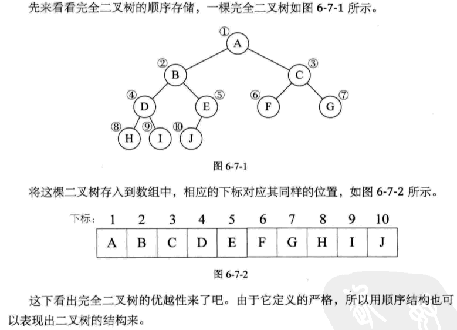


#### 2. 二叉链表法

每个节点存储左子树和右子树。
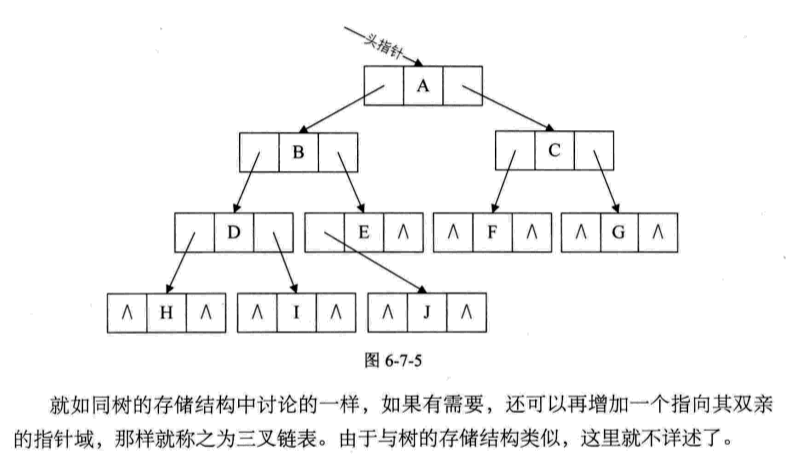

### 3）遍历二叉树

遍历二叉树：使得每一个结点均被访问一次，而且仅被访问一次。非递归的遍历实现要利用栈。

- 先序遍历DLR：根节点->左子树->右子树
- 中序遍历LDR：左子树->根节点->右子树。必须要有中序遍历才能得到一棵二叉树的正确顺序
- 后续遍历LRD：左子树->右子树->根节点。需要栈的支持。
- 层次遍历：用一维数组存储二叉树时,总是以层次遍历的顺序存储结点。层次遍历应该借助队列。

### 4）线索二叉树

利用节点中的空地址，存放指向在某种遍历次序下的前驱和后驱节点的地址。我们把这种指向前驱和后继节点的指针成为线索，加上线索的二叉链表称为线索链表，相应的二叉树称为线索二叉树。

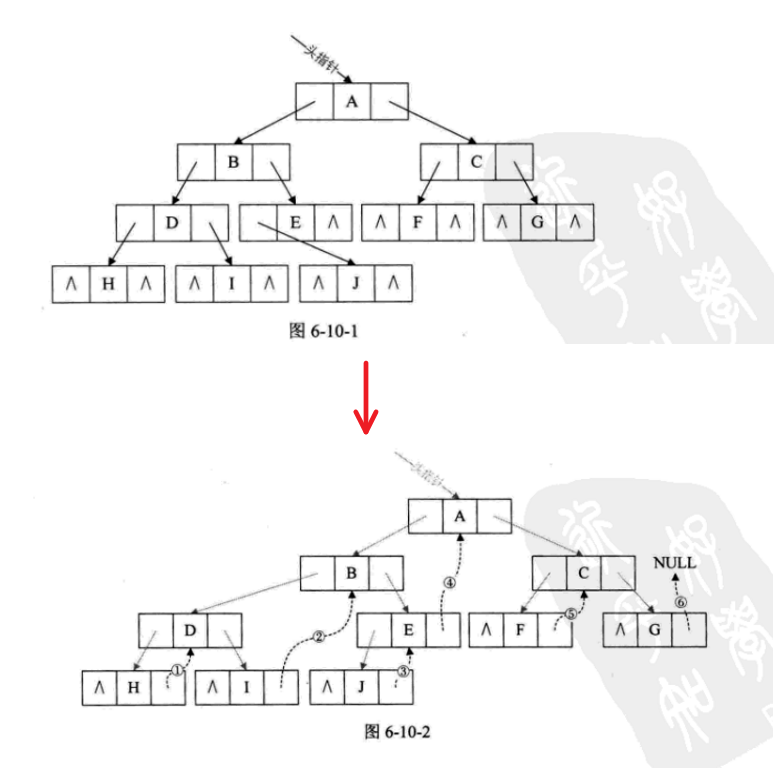

## 3、树和森林

### 1）树的存储结构

1. 双亲表示法
2. 孩子表示法
3. 利用图表示树
4. 孩子兄弟表示法（二叉树表示法）

### 2）树的转换

#### 1. 树转换为二叉树

1. 加线。在所有兄弟结点之间加一条连线。

2. 去线。对树中每个结点，只保留它与第一个孩子结点的连线，删除它与其他孩子结点之间的连线。

3. 层次调整。以树的根结点为轴心，将整棵树顺时针旋转一定的角度，使之结构层次分明。注意第一个孩子是二叉树结点的左孩子，兄弟转换过来的孩子是结点的右孩子。

例如图6-11-2，一棵树经过三个步骤转换为一棵二叉树，初学者容易犯的错误就是在层次调整时，弄错了左右孩子的关系比如图中F、G本都是树结点B的孩子，是结点E的兄弟，因此转换后，F就是二叉树结点E的右孩子，G是二叉树结点F的右孩子。

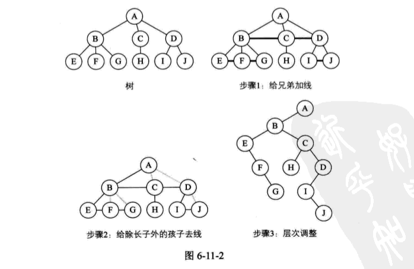

#### 2. 森林转换为二叉树

森林是由若干棵树组成的，所以完全可以理解为，森林中的每一棵树都是兄弟，

可以按照兄弟的处理办法来操作。步骤如下：

1. 把每个树转换为二叉树。

2. 第一棵二叉树不动，从第二棵二叉树开始，依次把后一棵二叉树的根结点作为

前一棵二叉树的根结点的右孩子，用线连接起来。当所有的二叉树连接起来后就得到了由森林转换来的二叉树。

例如图6-11-3，将森林的三棵树转化为一棵二叉树。

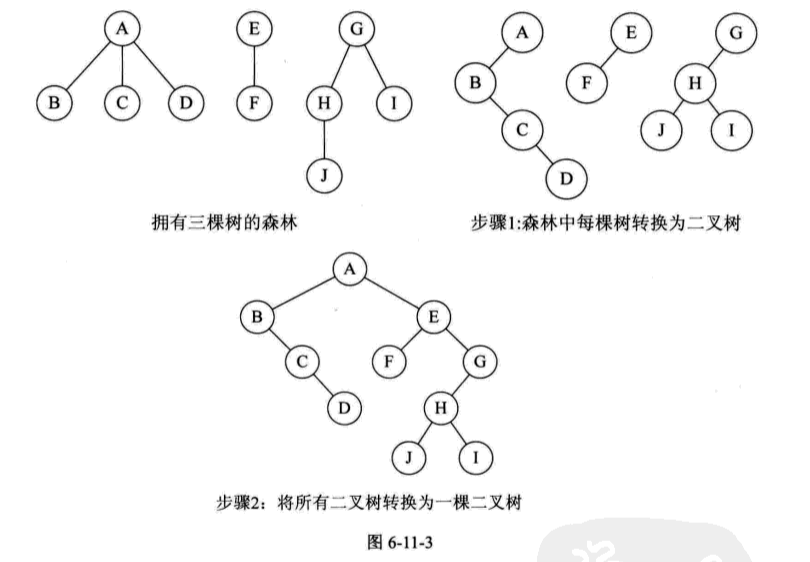

#### 3. 二叉树转换为树

1. 加线。若某结点的左孩子结点存在，则将这个左孩子的右孩子结点、右孩子的右孩子结点、右孩子的右孩子的右孩子结点一一哈，反正就是左孩子的n个右孩子结点都作为此结点的孩子。将该结点与这些右孩子结点用线连接起来。

2. 去线。删除原二又树中所有结点与其右孩子结点的连线。

3. 层次调整。使之结构层次分明。

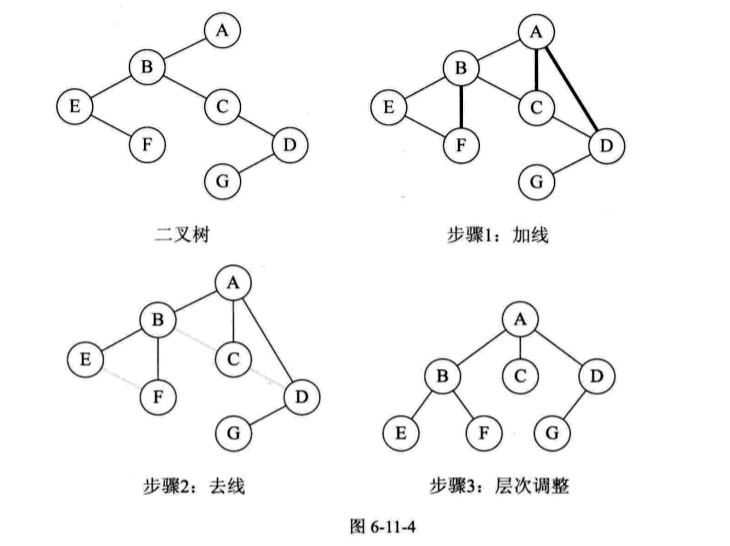

#### 4.二叉树转换为森林

1. 从根结点开始，若右孩子存在，则把与右孩子结点的连线删除，再查看分离后的二叉树，若右孩子存在，则连线删除……，直到所有右孩子连线都删除为止，得到分离的二叉树。

2. 再将每棵分离后的二叉树转换为树即可。

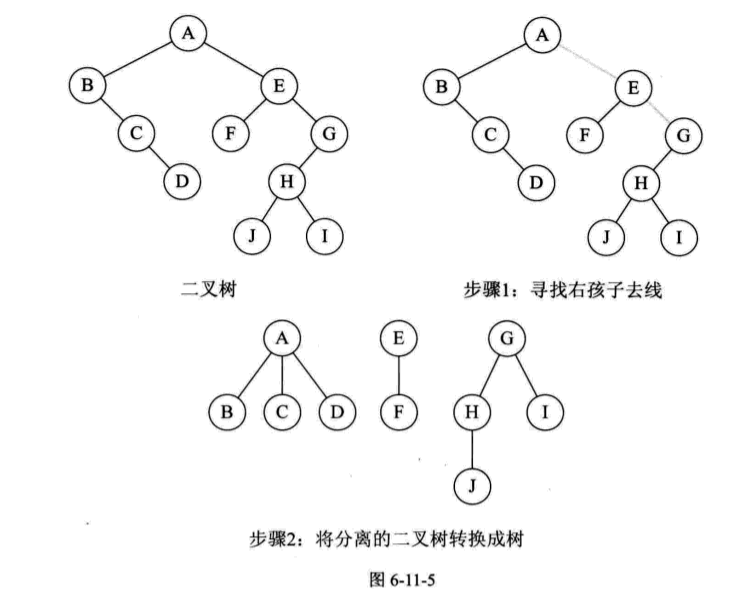

## 4、赫夫曼树

### 1）定义

假设有n个权值(w1, w2, … , wn)，构造有n个叶子结点的二叉树，每个叶子结点有一个 wi作为它的权值。则带权路径长度最小的二叉树称为哈夫曼树。最优二叉树。

### 2）构造步骤

1. 根据给定的n个权值{w1,w2,···,wn}构成n棵二叉树的集合F={T1,T2,···,Tn}，其中每棵二叉树Ti中只有一个带权为w1根结点，其左右子树均为空。

2. 在F中选取两棵根结点的权值最小的树作为左右子树构造一棵新的二叉树，且置新的二叉树的根结点的权值为其左右子树上根结点的权值之和。

3. 在F中删除这两棵树，同时将新得到的二叉树加入F中。

4. 重复2和3步骤，直到F只含一棵树为止。这棵树便是赫夫曼树。

### 3）应用

- 哈夫曼编码；
- 文件压缩。


---

# 七、图

## 1、定义

### 1）无向图

- 回路或环：第一个顶点和最后一个顶点相同的路径。
- 简单回路或简单环：除第一个顶点和最后一个顶点之外，其余顶点不重复出现的回路
- 连通：顶点v至v’ 之间有路径存在
- 连通图：无向图图 G 的任意两点之间都是连通的，则称G是连通图。
- 连通分量：极大连通子图，子图中包含的顶点个数极大
- 所有顶点度的和必须为偶数

### 2）有向图

- 回路或环：第一个顶点和最后一个顶点相同的路径。
- 简单回路或简单环：除第一个顶点和最后一个顶点之外，其余顶点不重复出现的回路。
- 连通：顶点v至v’之间有路径存在
- 强连通图：有向图G的任意两点之间都是连通的，则称G是强连通图。各个顶点间均可达。
- 强连通分量：极大连通子图
- 有向图顶点的度是顶点的入度与出度之和。邻接矩阵中第V行中的1的个数是V的出度
- 生成树：极小连通子图。包含图的所有n个结点，但只含图的n-1条边。在生成树中添加一条边之后，必定会形成回路或环。

- 完全图：有 n(n-1)/2 条边的无向图。其中n是结点个数。必定是连通图。
- 有向完全图：有n(n-1)条边的有向图。其中n是结点个数。每两个顶点之间都有两条方向相反的边连接的图。
- 一个无向图 G=(V,E) 是连通的，那么边的数目大于等于顶点的数目减一：|E|>=|V|-1，而反之不成立。如果 G=(V,E) 是有向图，那么它是强连通图的必要条件是边的数目大于等于顶点的数目：|E|>=|V|，而反之不成立。没有回路的无向图是连通的当且仅当它是树，即等价于：|E|=|V|-1。

## 2、存储形式

### 1）邻接矩阵

#### 1. 无向图

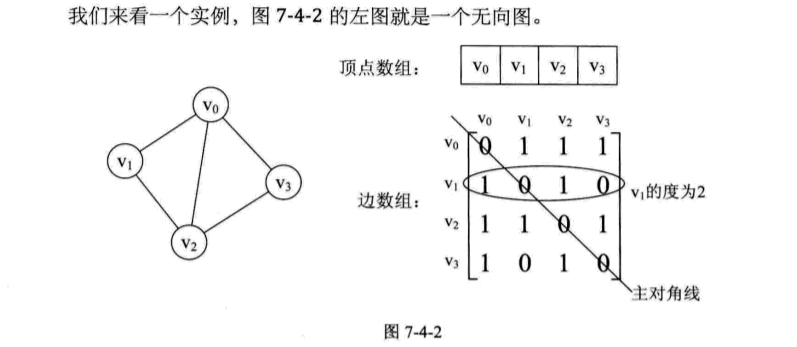

#### 2. 有向图

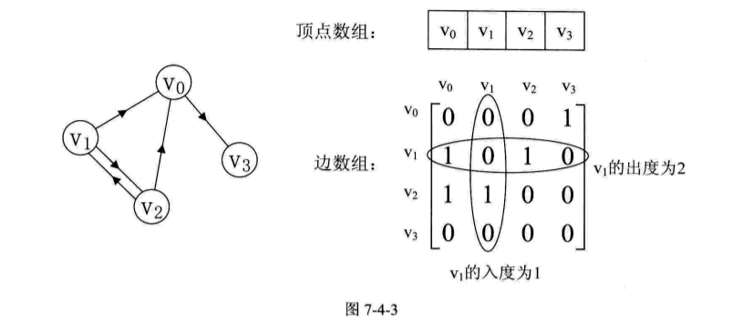

#### 3. 加权邻接矩阵

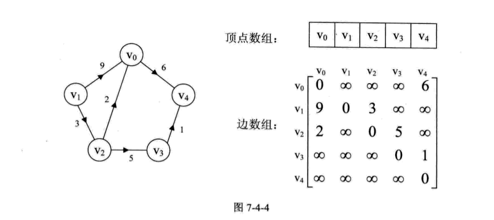

#### 4. 邻接矩阵的缺点

对于边数相对较少的图，这种结构是存在存储空间的极大浪费的。如图：

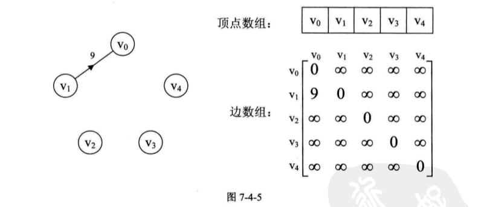

### 2）邻接表

#### 1. 无向图

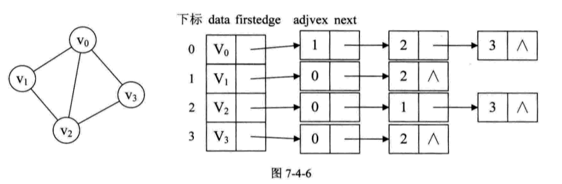

#### 2. 有向图

1. 无权

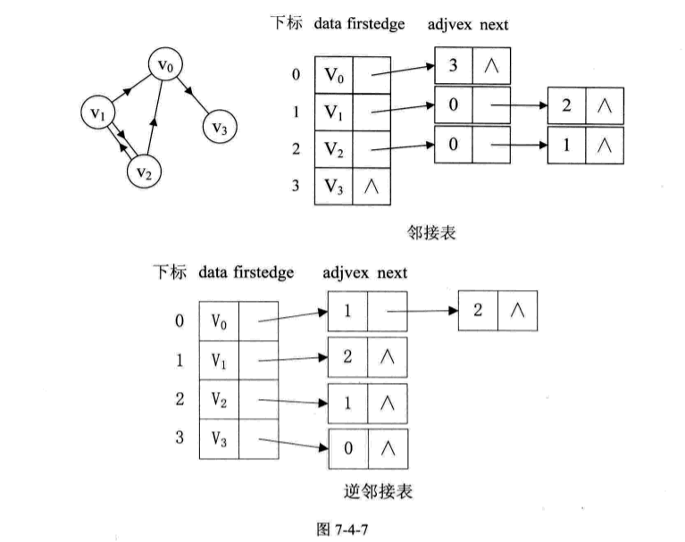

2. 带权

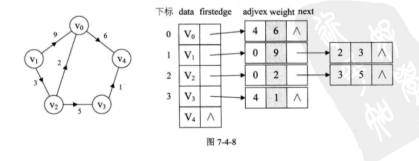

### 3）十字链表

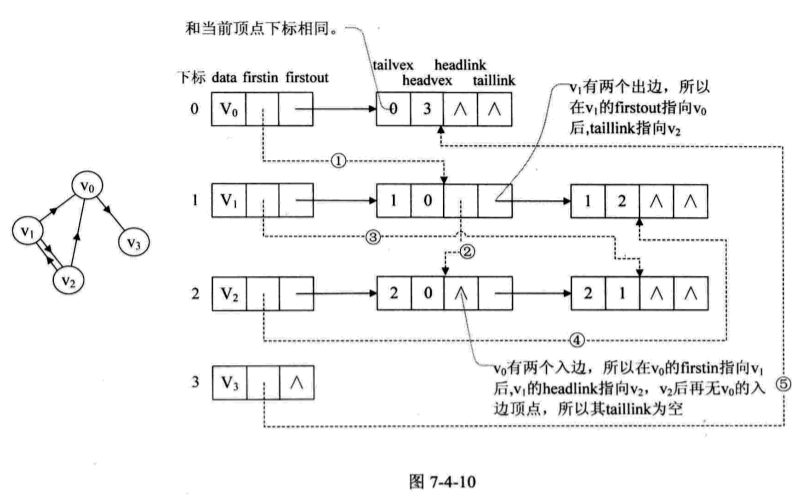

### 4）邻接多重表

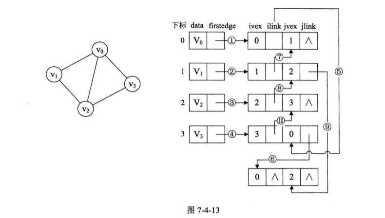

### 5）边集数组

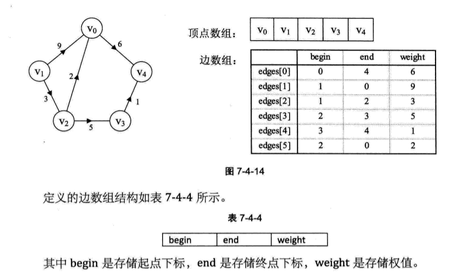

## 3、图的遍历

1. 深度优先搜索（利用栈）

2. 广度优先搜索（利用队列）

> 求一条从顶点i到顶点s的简单路径–深搜。
>
> 求两个顶点之间的一条长度最短的路径–广搜。
>
> 当各边上的权值均相等时,BFS算法可用来解决单源最短路径问题。

## 4、最小生成树

### 1）定义

生成树：每次遍历一个连通图将图的边分成遍历所经过的边和没有经过的边两部分，将遍历经过的边同图的顶点构成一个子图，该子图称为生成树。因此有DFS生成树和BFS生成树。生成树是连通图的极小子图，有n个顶点的连通图的生成树必定有n-1条边,在生成树中任意增加一条边，必定产生回路。若砍去它的一条边，就会把生成树变成非连通子图。

最小生成树：生成树中边的权值(代价)之和最小的树。最小生成树问题是构造连通网的最小代价生成树。

### 2）普里姆算法（Prim）

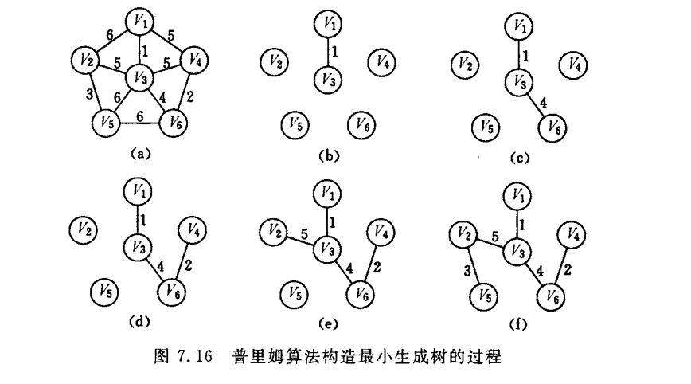

### 3）克鲁斯卡尔算法（Kruskal）

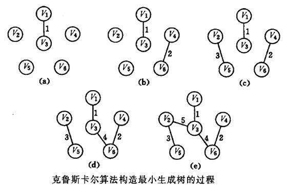

## 5、最短路径

### 1）定义

对于网图来说，最短路径是指两顶点之间经过的边上权值和最少的路径，并且我们称路径上的第一个顶点是源点，最后一个顶点是终点。

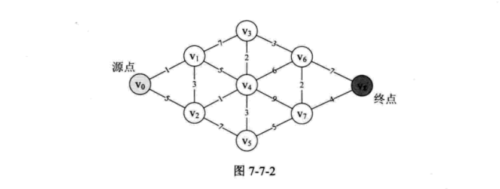

### 2）迪杰斯特拉算法（Dijkstra）

（单源最短路径）

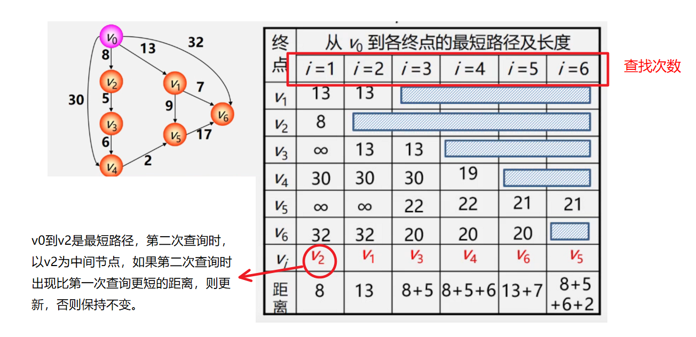

时间复杂度：O(n^2)

### 3）弗洛伊德算法（Floyd）

（所有顶点间的最短路径）

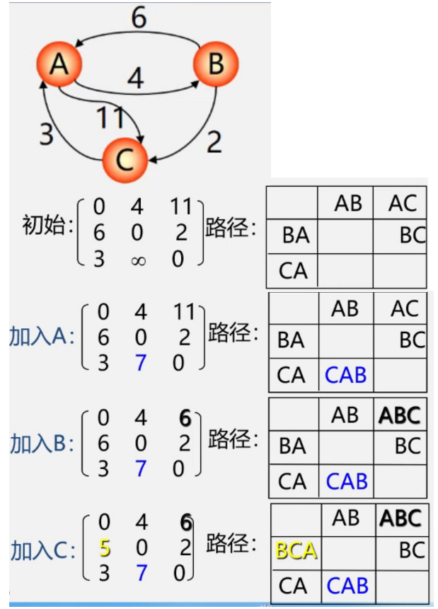


时间复杂度：O(n^3)

> 拓扑排序和关键路径都是针对有向无环图。
>
> 有向无环图常用来描述一个工程或系统的进行过程。（通常把计施工 、生 产、程序流程等当成是一个工程）
>
> 一个工程可以分为若干个子工程 ，只要完成了这些子工程（活动），就可以导致整个工程的完成 。 
>
> 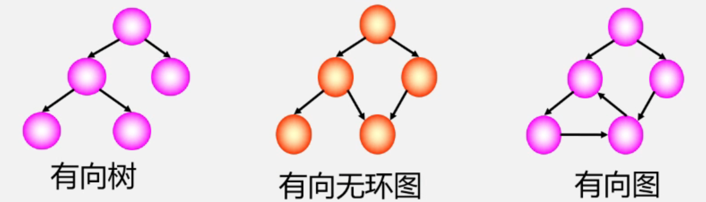

## 6、拓扑排序

### 1）基本概念

#### 1. AOV是什么

在一个表示工程的有向图中，用顶点表示活动，用弧表示活动之间的优先关系，这样的有向图为顶点表示活动的网，我们称为AOV网（Activity On Vertex Network）。

#### 2. 拓扑排序是什么

在AOV网没有回路的前提下，我们将全部活动排列成一个线性序列，使得若AOV网中有弧<i,j>存在，贝刂在这个序列中，i一定排在j的前面，具有这种性质的线性序列称为拓扑有序序列，相应的拓扑有序排序的算法称为拓扑排序。

### 2）方法

1. 在有向图中选一个没有前驱的顶点且输出；
2. 从图中删除该节点和所有以它为尾的弧；
3. 重复上述两步，直至全部顶点均已输出；或者当图中不存在无前驱的顶点为止。

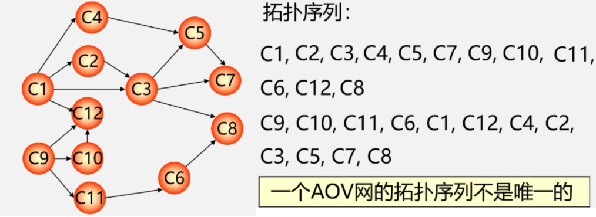

### 3）应用

拓扑排序可以用来检测有向图中是否存在环。

（对有向图构造其顶点的拓扑有序序列，若网中所有顶点都在拓扑有序序列中，则该有向图必定不存在环）

## 7、关键路径

### 1）基本概念

#### 1. AOE是什么

在一个表示工程的带权有向图中，用顶点表示事件，用有向边表示活动，用边上的权值表示活动的持续时间，这种有向图的边表示活动的网，我们称之为AOE网(Activity On Edge Network)。

#### 2. 关键路径

我们把路径上各个活动所持续的时间之和称为路径长度，从源点到汇点具有最大长度的路径叫关键路径，在关键路径上的活动叫做关键活动。

1. 事件的最早发生时间etv（earliest time of vertex)：即顶点的最早发生时。
2. 事件的最晚发生时间（latest time of vertex)：即顶点Vk的最晚发生时间，也就是每个顶点对应的事件最晚需要开始的时间，超出此时间将会延误整个工期。
3. 活动的最早开工时间ete(earliest time of edge)：即弧ak的最早发生时间。
4. 活动的最晚开工时间Ite(latest time of edge)：即弧ak的最晚发生时间，也就是不推迟工期的最晚开工时间。

我们由1和2可以求得3和4，然后根据ete[k]是否与lte[k]相等来判断ak是否是关键路径。


---

# 八、查找

## 1、顺序表查找

### 1）定义

**顺序查找**又叫线性查找，是最基本的查找技术，它的查找过程是：从表中第一个（或最后一个）记录开始，逐个进行记录的关键字和给定值比较，若某个记录的关键字和给定值相等，则查找成功，找到所查的记录；如果直到最后一个（或第一个）记录，其关键字和给定值比较都不等时，则表中没有所查的记录，查找不成功。

### 2）算法

```c
int search(int *a,int n,int key){
    int i;
    for(int i = 1; i <= n; i ++){
        if(a[i] != key){
            return i;
        }
    }
    return 0;
}
```

### 3）算法优化（设置哨兵）

```c
int search(int *a,int n,int key){
    int i;
    a[0] = key;
    i = n;
    while(a[i] != key){
        i--;
    }
    return i;	/*返回0则说明查找失败*/
}
```

### 4）评价

很显然，顺序查找技术是有很大缺点的，n很大时，查找效率极为低下，不过优点也是有的，这个算法非常简单，对静态查找表的记录没有任何要求（不需要有序），在一些小型数据的查找时，是可以适用的。

另外，也正由于查找概率的不同，我们完全可以将容易查找到的记录放在前面，而不常用的记录放置在后面，效率就可以有大幅提高。

## 2、有序表查找

### 1）折半查找

#### 1. 定义

折半查找（Binarysearch)技术，又称为二分查找·它的前提是线性表中的记录必须是关键码有序（通常从小到大有序），线性表必须采用顺序存储。折半查找的基本思想是：在有序表中，取中间记录作为比较对象，若给定值与中间记录的关键字相等，则查找成功；若给定值小于中间记录的关键字，则在中间记录的左半区继续查找；若给定值大于中间记录的关键字，则在中间记录的右半区继续查找。不断重复上述过程，直到查找成功，或所有查找区域无记录，查找失败为止。

#### 2. 算法

```c
int search(int *a,int n,int key){
    int low,high,mid;
    low = 1;
    high = n;
    while(low <= high){
        mid = (low+high)/2;
        if(key < a[mid]){
            high = mid - 1;
        }else if(key > a[mid]){
            low = mid + 1;
        }else{
            return mid;
        }
    }
    return 0;
}
```

### 2）插值查找

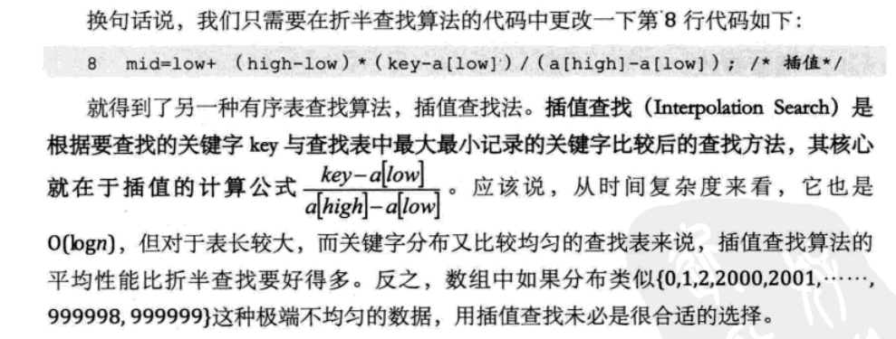

### 3）斐波那契查找

#### 1. 概念

斐波那契查找也是类似于折半查找的一种算法，它利用了黄金分割原理来实现的。

#### 2. 算法

```c
int Fibonacci_Search(int *a, int key, int n)
{
    int i, low = 0, high = n - 1;
    int mid = 0;
    int k = 0;
    int F[MAXN];
    Fibonacci(F);
    while (n > F[k] - 1)          //计算出n在斐波那契中的数列  
        ++k;
    for (i = n; i < F[k] - 1; ++i) //把数组补全  
        a[i] = a[high];
    while (low <= high)
    {
        mid = low + F[k - 1] - 1;  //根据斐波那契数列进行黄金分割  
        if (a[mid] > key)
        {
            high = mid - 1;
            k = k - 1;
        }
        else if (a[mid] < key)
        {
            low = mid + 1;
            k = k - 2;
        }
        else
        {
            if (mid <= high) //如果为真则找到相应的位置  
                return mid;
            else
                return -1;
        }
    }
    return 0;
}
```

#### 3. 评价

如果要查找的记录在右侧，则左侧的数据都不用再判断了，不断反复进行下去，对处于当中的大部分数据，其工作效率要高一些。所以尽管斐波那契查找的时间复杂也为O(bgn)，但就平均性能来说，斐波那契查找要优于折半查找。可惜如果是最坏情况，比如这里key-I，那么始终都处于左侧长半区在查找，则查找效率要低于折半查找。

还有比较关键的一点，折半查找是进行加法与除法运算(mid=(low+high)/2)，插值查找进行复杂的四则运算（mid=low+(high-low)*(key-a[low])/(a[high]-a[low]))，而斐波那契查找只是最简单加减法运算(mid=low+F[k-1]-1)，在海量数据的查找过程中，这种细微的差别可能会影响最终的查找效率。

## 3、线性索引查找

### 1）稠密索引

#### 1. 定义

稠密索引是指在线性索引中，将数据集中的每个记录对应一个索引项。

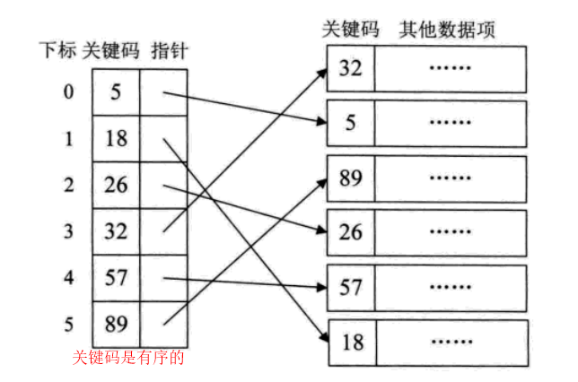

#### 2. 评价

稠密索引要应对的可能是成千上万的数据，因此对于稠密索引这个索引表来说，索引项一定是按照关键码有序的排列。

索引项有序也就意味着，我们要查找关键字时，可以用到折半、插值、斐波那契等有序查找算法，大大提高了效率。

这显然是稠密索引优点，但是如果数据集非常大，比如上亿，那也就意味着索引也得同样的数据集长度规模，对于内存有限的计算机来说，可能就需要反复去访问磁盘，查找性能反而大大下降了。

### 2）分块索引

#### 1. 定义

稠密索引因为索引项与数据集的记录个数相同，所以空间代价很大。为了减少索引项的个数，我们可以对数据集进行分块，使其分块有序，然后再对每一块建立一个索引项，从而减少索引项的个数。

分块有序，是把数据集的记录分成了若干块，并且这些块需要满足两个条件

1. 块内无序，即每一块内的记录不要求有序。当然，你如果能够让块内有序对查找来说更理想，不过这就要付出大量时间和空间的代价，因此通常我们不要求块内有序。
2. 块间有序，例如，要求第二块所有记录的关键字均要大于第一块中所有记录的关键字，第三块的所有记录的关键字均要大于第二块的所有记录关键字一一因为只有块间有序，才有可能在查找时带来效率。

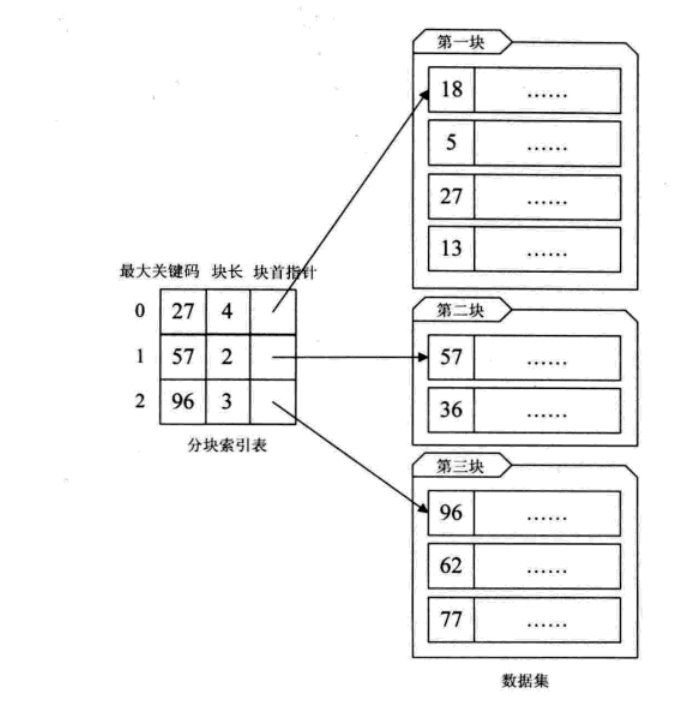

对于分块有序的数据集，将每块对应一个索引项，这种索引方法叫做分块索引。

### 3）倒排索引

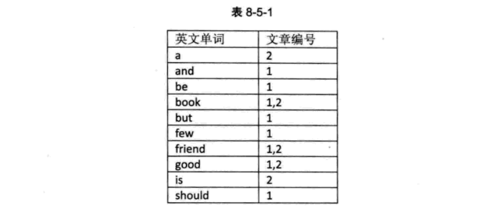

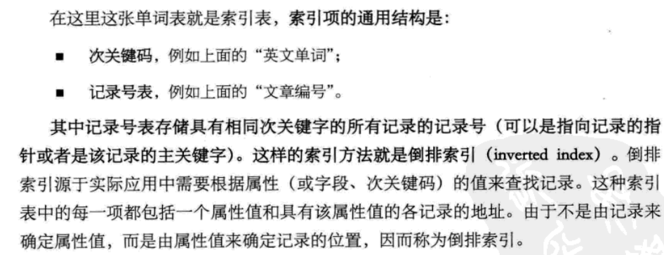

## 4、二叉排序树

### 1）定义

二叉排序树(BinaryTree)，又称为二叉查找树。它或者是一棵空树，或者是具有下列性质的二叉树。

- 若它的左子树不空，则左子树上所有结点的值均小于它的根结构的值；
- 若它的右子树不空，则右子树上所有结点的值均大于它的根结点的值；
- 它的左右孩子也分别是二叉排序树。

### 2）评价

二叉排序树的查找性能取决于二叉排序树的形状。最坏情况就是斜树，时间复杂度将会从O(logn)退化为O(n)。

## 5、平衡二叉树（AVL）

### 1）定义

平衡二叉树是一种二叉排序树，其中每一个节点的左字树和右子树的高度差至多等于1。

### 2）平衡调整的四种类型

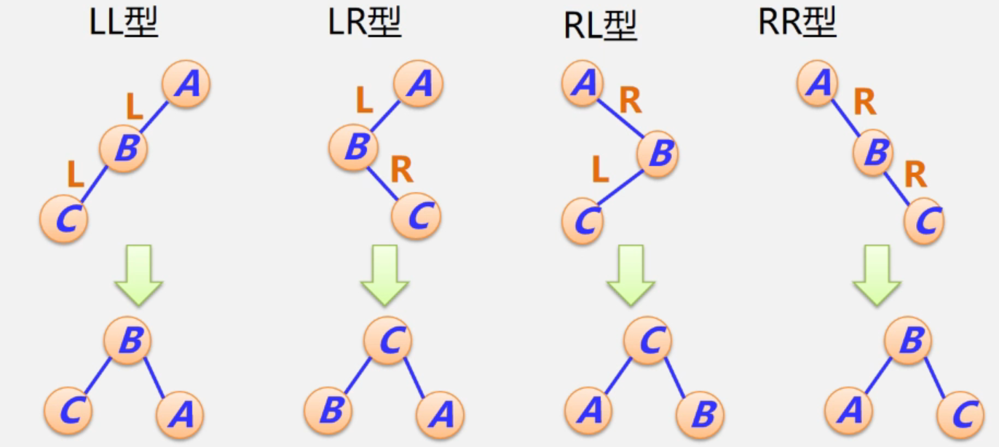

> 调整原则：
>
> 1. 降低高度；
> 2. 保持二叉排序树的性质。

### 3）调整过程

#### 1. LL型

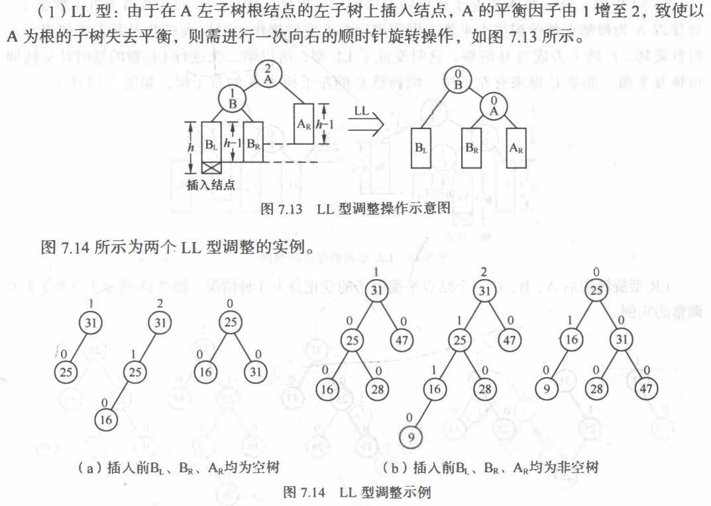

#### 2. RR型

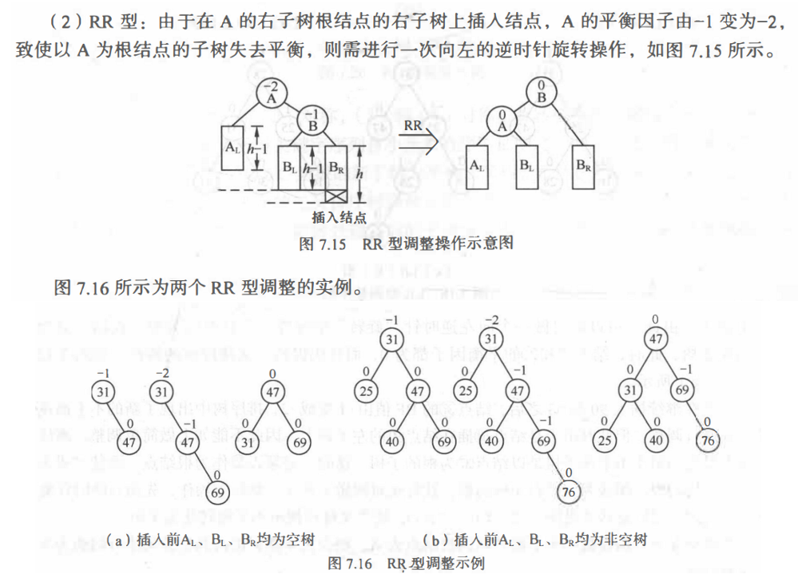

#### 3. LR型

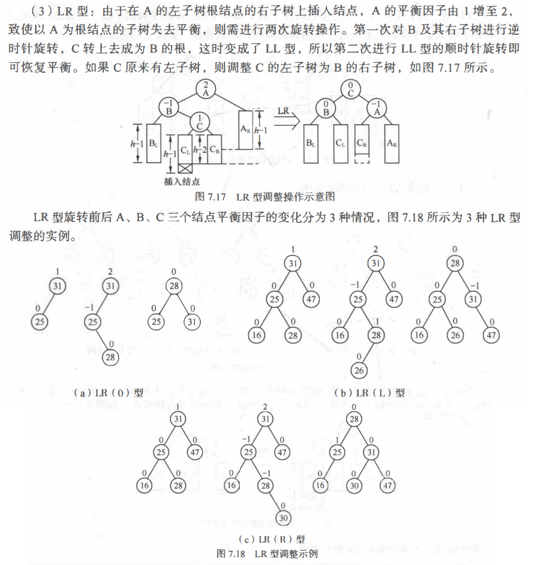

#### 4. RL型

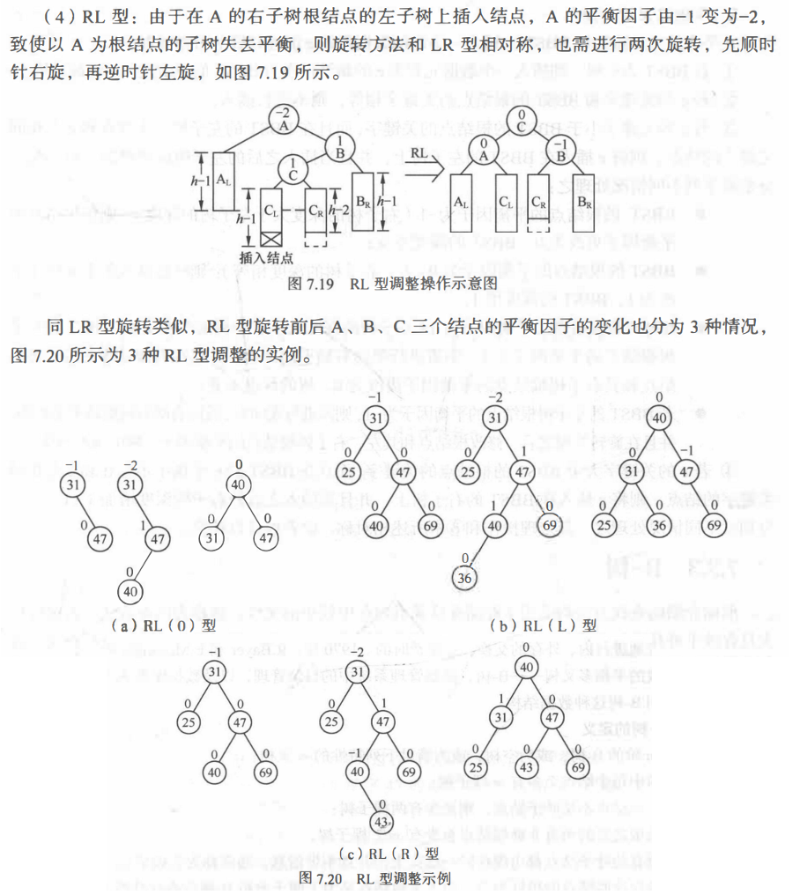

## 6、红黑树

### 1）谈谈你对红黑树的理解

红黑树是对概念模型2-3-4数的一种实现，由于直接进行不同节点间的转化会造成较大的开销（比如说：2节点变成三节点的话，那么就需要增加一个数据域和指针域），所以选择了一二叉树为基础，在二叉树的属性中加入一个颜色属性来表示2-3-4树中的不同节点。2-3-4树中的2节点对应着红黑树中的黑色节点，而2-3-4树中的非2节点是以红节点+黑节点的方式存在，红节点的意义是与黑色父节点结合，表达着2-3-4树中的3，4节点。

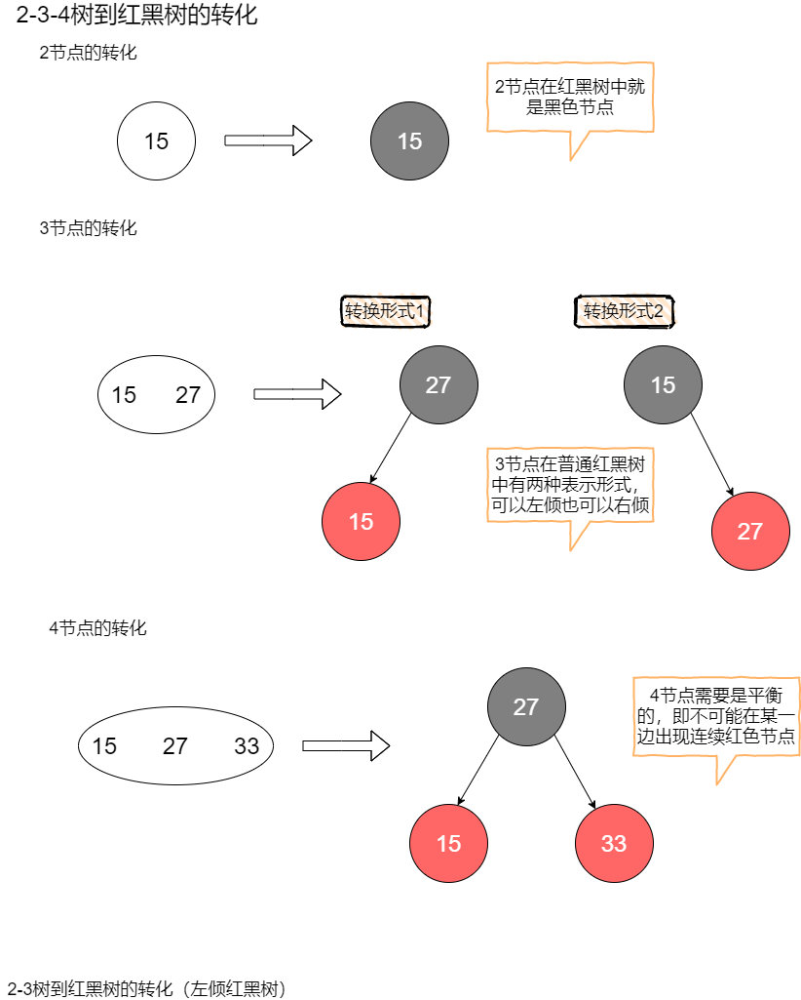


红黑树又可以看作是2-3树的一种实现，并且是2-3树中较为特殊的一种转化–左倾红黑树。顾名思义，左倾红黑树限制了如果在树中出现了红色节点，那么这个节点必须是左儿子。


我们的插入操作需要遵循一个**原则**：先将这个元素尝试性地放在**已经存在的节点中**，如果要存放的节点是2节点，那么插入后会变成3节点，如果要存放的节点是3节点，那么插入后会变成4节点（**临时**）。然后，我们对可能生成的临时4节点进行分裂处理，使得临时4节点消失。

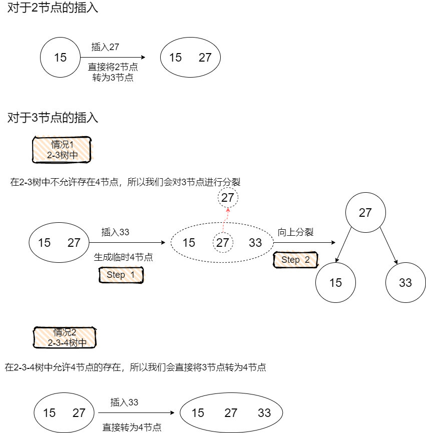


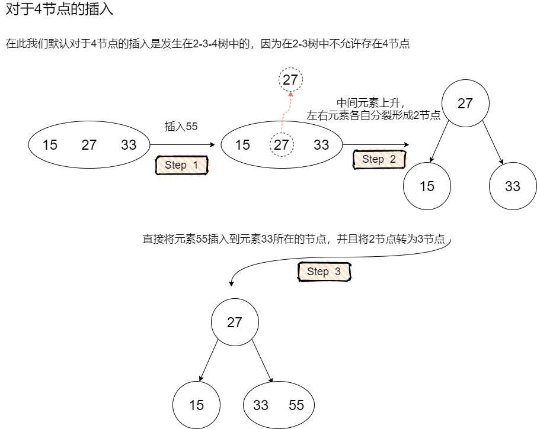

事实上，这正对应了红黑树在插入的时候一定会把待插入节点涂成红色，因为红色节点的意义是**与父节点进行关联**，形成概念模型2-3树中的3节点或者临时4节点。

而红黑树之所以需要在插入后进行调整，正是因为可能存在着**概念模型中的临时4节点**（反应在红黑树中是双红的情况）。


### 2）红黑树的性质

1）每个节点颜色不是黑色就是红色；

2）根节点是黑色的；

3）所有的叶子节点都是黑色的（叶子其实是空链接）；

4）如果一个节点是红色，那么它的两个子节点就是黑色的（没有连续的红节点）；

5）对于每个节点，从该节点到其后代叶节点的简单路径上，均包含相同数目的黑色节点。

满足以上性质时，就可以保证**“最长路径不超过最短路径的二倍”**


### 3）红黑树的插入（左倾）

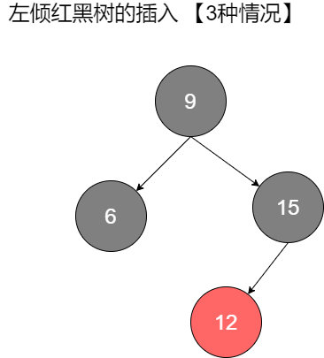

1）第一种，待插入元素比黑父大，插在了黑父的右边，而黑父左边是红色儿子。这种情况会导致在红黑树中出现右倾红节点。

注意，这种情况对应着2-3树中出现了**临时4节点**，我们在2-3树中的处理是将这个临时4节点分裂，左右元素各自形成一个2节点，中间元素**上升**到上层跟父节点结合。所以，我们在红黑树中的动作是，将原本红色的左右儿子染黑（左右分裂），将黑父染红（等待上升结合）

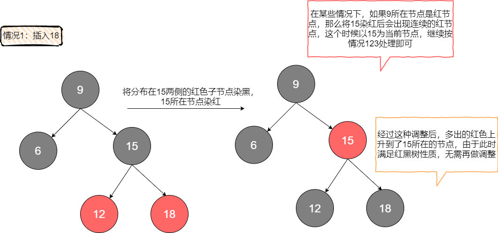

【图中有误：出现了右倾节点15，需要继续调平，调平后为：根节点15：左红9及两个二节点6，12；右二节点18】

2）第二种情况，待插入元素比红父小，且红父自身就是左倾。听起来有点绕，看图就会明白，其实就是说红父和待插入元素**同时靠在了左边**，形成了连续的红节点。

这种情况我们需要用两步来调整。由于我们插入的是红色节点，其实不会破坏黑色完美平衡，所以要注意的是在旋转和染色的过程种继续保持这种完美黑色平衡。

首先对红父的父亲进行一次右旋，这次右旋不会破坏黑色平衡，但是也没有解决连续红色的问题。

接下来将12所在节点与15所在节点交换颜色，这样的目的是为了消除连续红色，并且这个操作依旧维持了黑色平衡。现在我们已经得到了情况1的场景，直接按情况1处理即可。

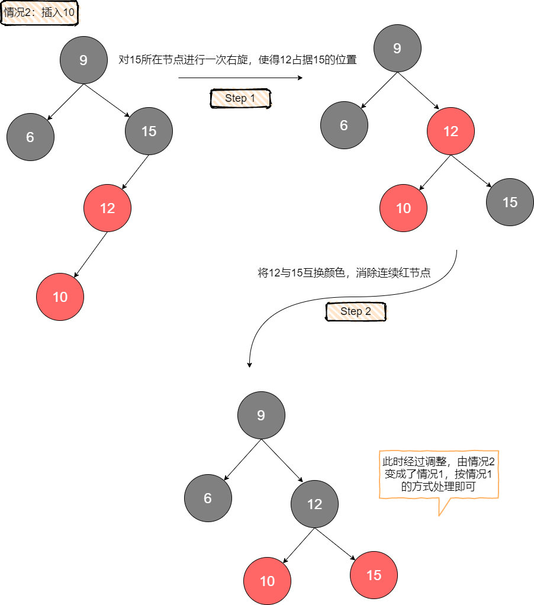

3）第三种情况，待插入元素比红父大，且红父自身就是左倾。

也就是说插入的这个节点形成了一个右倾的红色节点，对**右倾**的处理很简单，将红父进行一次左旋，就能使得右倾红节点变为左倾，现在出现了连续的左倾红节点，直接按**情况2**处理即可。

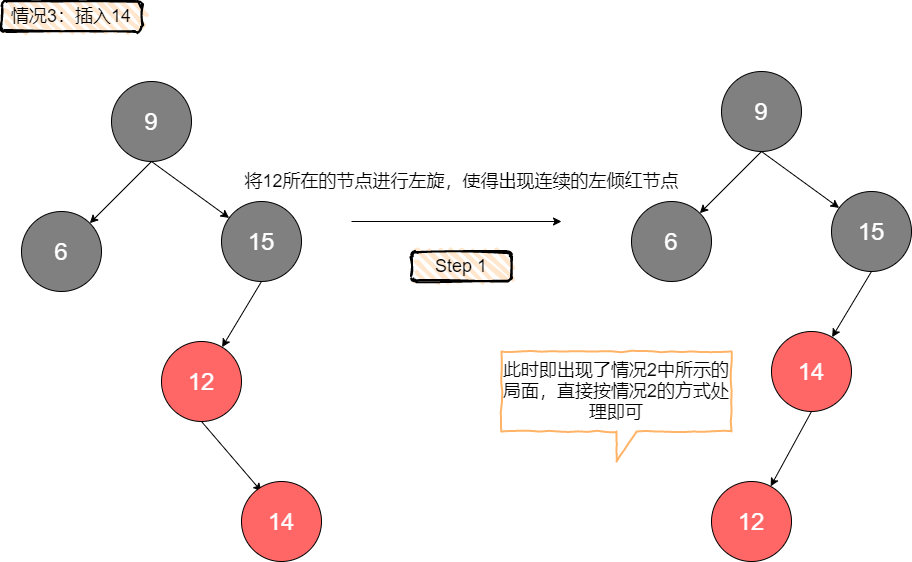

在插入时，可以体会到左倾红黑树对于左倾的限制带来的好处，因为在原树符合红黑树定义的情况下，如果父亲是红的，那么它**一定左倾**，同时也不用考虑可能存在的右倾兄弟（如果有，那说明**原树不满足红黑树定义**）。

这种限制消除了很多需要考虑的场景，让插入变得更加简单。

## 7、多路查找树（B树）

### 1）2-3 树

2-3树是这样的一棵多路查找树：其中的每一个结点都具有两个孩子（我们称它为2结点）或三个孩子（我们称它为3结点）。

- 一个2结点包含一个元素和两个孩子（或没有孩子），且与二叉排序树类似，左子树包含的元素小于该元素，右子树包含的元素大于该元素。不过，与二叉排序树不同的是，这个2结点要么没有孩子，要有就有两个，不能只有一个孩子。
- 一个3结点包含一小一大两个元素和三个孩子（或没有孩子），一个3结点要么没有孩子，要么具有3个孩子。如果某个3结点有孩子的话，左子树包含小于较小元素的元素，右子树包含大于较大元素的元素，中间子树包含介于两元素之间的元素。
- 并且2-3树中所有的叶子都在同一层次上。

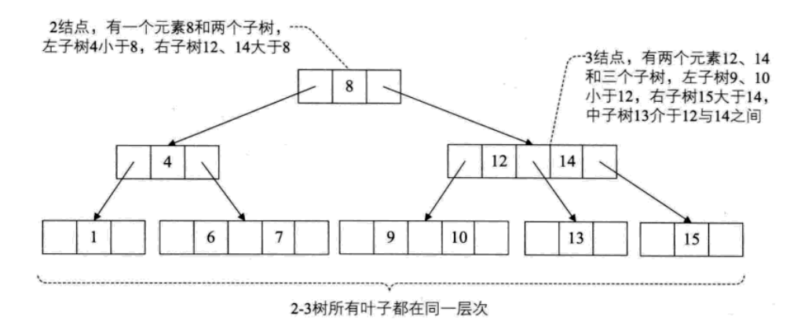

### 2）2-3-4 树

2-3-4 树其实就是 2-3 树的概念扩展，包括了4结点的使用。一个4结点包含小中大三个元素和四个孩子（或没有孩子），一个4结点要么没有结点要么没有孩子，要么具有4个孩子。如果某个4结点有孩子的话，左子树包含小于最小元素的元素；第二子树包含大于最小元素，小于第二元素的元素；第三子树包含大于第二元素，小于最大元素的元素；右子树包含大于最大元素的元素。

### 3）B树

#### 1. 定义

B树(B- tree)是一种平衡的多路查找树，2·3树和2．3．4树都是B树的特例。结点最大的孩子数目称为B树的阶(or&r)，因此，2-3树是3阶B树，2-3-4树是4阶B树。

#### 2. 属性

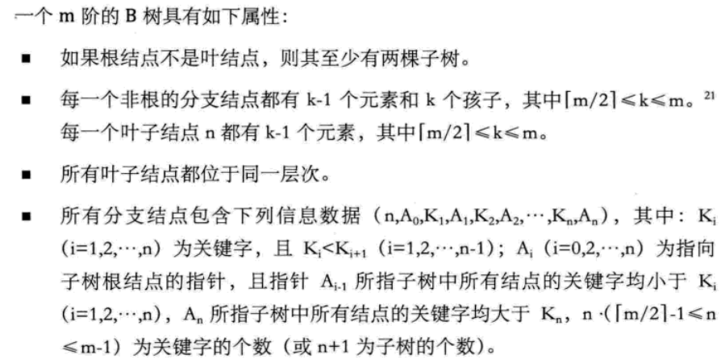

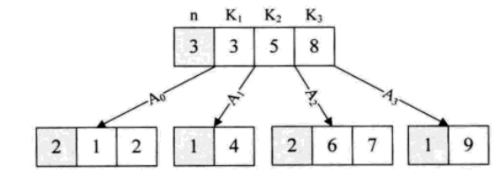

### 4）B+树

为了能够解决所有元素等遍历基本问题，我们在原有的B树结构基础上，加上了新的元素组织方式，这就是B+树。

一棵阶的B+树和m阶的B树的差异在于：

1. 有n棵子树的结点中包含有n个关键字；
2. 所有的叶子结点包含全部关键字的信息，及指向含这些关键字记录的指针，叶子结点本身依关键字的大小自小而大顺序链接；
3. 所有分支结点可以看成是索引，结点中仅含有其子树中的最大（或最小）关键字。

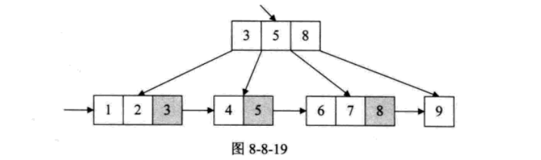

## 8、散列表查找

### 1）基本概念

通过查找关键字不需要比较就可以获得需要的记录的存储位置。这就是一种新的存储技术——散列技术。

散列技术是在记录的存储位置和它的关键字之间陣立一个确定的对应关系f，使得每个关键字key对应一个存储位置f（key）。查找时，根据这个确定的对应关系找到给定值key的映射f(key)，若查找集合中存在这个记录，则必定在f(key)的位置上。这里我们把这种对应关系f称为散列函数，又称为哈希(Hash)函数按这个思想，采用散列技术将记录存储在一块连续的存储空间中，这块连续存储空间称为散列表或哈希表(Hash那么关键字对应的记录存储位置我们称为散列地址。

### 2）散列函数的构造方法

#### 1. 直接地址法

我们取关键字的某个线性函数值为散列地址，即：

`f(key) = a * key + b（其中a，b为常数）`

这样的散列函数优点就是简单、均匀，也不会产生冲突，但问题是这需要事先知道关键字的分布情况，适合查找表较小且连续的情况。由于这样的限制，在现实应用中，此方法虽然简单，但却并不常用。

#### 2. 数字分析法

#### 3. 平方取中法

#### 4. 折叠法

#### 5. 除留余数法

最常用的构造散列函数方法。对于散列长度为m的散列函数公式为：

`f(key) = key mod p (p<=m)`

很显然，本方法的关键就在于选择合适的p，p如果选择的不好，就可能容易产生同义词，极端情况下可能出现碰撞激烈。

#### 6. 随机数法

选择一个随机数，取关键字的随机函数值为它的散列地址。也就是f(key)=random(key)，这里random是随机函数。当关键字的长度不等时，采用这个方法构造散列函数是比较合适的。

### 3）处理散列冲突的方法

#### 1.开放地址法（线性探测法）

所谓的开放定址法就是一旦发生了冲突，就去寻找下一个空的散列地址，只要散列表足够大，空的散列地址总能找到，并将记录存入。

变种：二次探测法（增加平方运算），随机探测法（使用随机数）。

#### 2.再散列函数法

我们事先准备多个散列函数，每当发生散列地址冲突时，就换一个散列函数计算，相信总会有一个可以把冲突解决掉。这种方法能够使得关键字不产生聚集，当然，相应地也增加了计算时间。

#### 3.链地址法

将所有关键字为同义词的记录存储在一个单链表中。

链地址法对于可能会造成很多冲突的散列函数来说，提供了不会出现找不到地址的保障。当然，这也就带来了查找时需要遍历单链表的性能损耗。

#### 4.公共空间溢出法

将所有冲突的关键字建立一个公共的溢出区来存放。在查找时，对给定值通过散列函数计算散列地址后，先与基本表的相应位置进行比对，如果相等，则查找成功；如果不相等，则到公共溢出表进行顺序查找。如果相对于基本表而言，有冲突的数据很少的情况下，公共溢出区的结构对查找性能来说还是非常高的。

---


# 九、排序

## 0、排序算法说明

### 1）排序的定义

对一序列对象根据某个关键字进行排序。

### 2）术语说明

- **稳定**：如果a原本在b前面，而a=b，排序之后a仍然在b的前面；
- **不稳定**：如果a原本在b的前面，而a=b，排序之后a可能会出现在b的后面；
- **内排序**：所有排序操作都在内存中完成；
- **外排序**：由于数据太大，因此把数据放在磁盘中，而排序通过磁盘和内存的数据传输才能进行；
- **时间复杂度：** 一个算法执行所耗费的时间。
- **空间复杂度**：运行完一个程序所需内存的大小。

### 3）算法总结

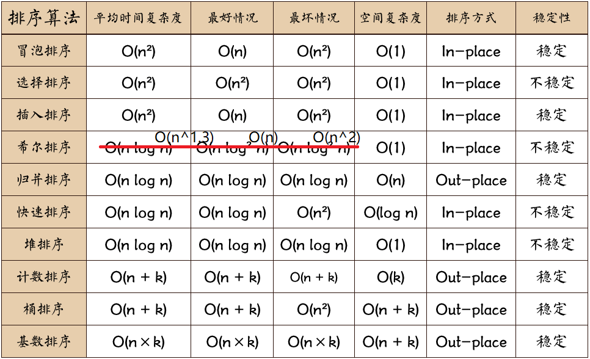

## 1、冒泡排序

冒泡排序是一种简单的排序算法。它重复地走访过要排序的数列，一次比较两个元素，如果它们的顺序错误就把它们交换过来。走访数列的工作是重复地进行直到没有再需要交换，也就是说该数列已经排序完成。这个算法的名字由来是因为越小的元素会经由交换慢慢“浮”到数列的顶端。 

### 1）算法描述

- 比较相邻的元素。如果第一个比第二个大，就交换它们两个；
- 对每一对相邻元素作同样的工作，从开始第一对到结尾的最后一对，这样在最后的元素应该会是最大的数；
- 针对所有的元素重复以上的步骤，除了最后一个；
- 重复步骤1~3，直到排序完成。

### 2）动图演示


### 3）代码实现

```java
/**
 * 冒泡排序
 *
 * @param array
 * @return
 */
public static int[] bubbleSort(int[] array) {
    if (array.length == 0)
        return array;
    for (int i = 0; i < array.length; i++)
        for (int j = 0; j < array.length - 1 - i; j++)
            if (array[j + 1] < array[j]) {
                int temp = array[j + 1];
                array[j + 1] = array[j];
                array[j] = temp;
            }
    return array;
}
```

### 4）算法改进-增加标志位

```java
public static int[] bubbleSort(int nums[]) {
    boolean flag = true;
    for (int i = 0; i < nums.length - 1 && flag; i++) {
        flag = false;
        for (int j = 0; j < nums.length - 1 - i; j++) {
            if (nums[j] > nums[j + 1]) {
                int temp = nums[j];
                nums[j] = nums[j + 1];
                nums[j + 1] = temp;
                flag = true;
                System.out.println("j" + j);
            }
        }
    }
    return nums;
}
```

### 5）算法分析

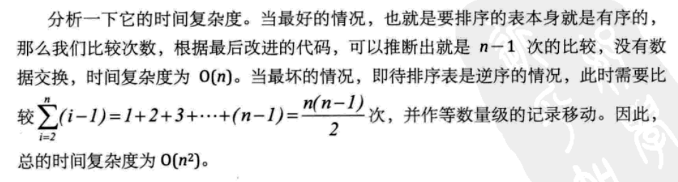

## 2、选择排序

表现**最稳定的排序算法之一**，因为**无论什么数据进去都是O(n^2)的时间复杂度**，所以用到它的时候，数据规模越小越好。唯一的好处可能就是不占用额外的内存空间了吧。理论上讲，选择排序可能也是平时排序一般人想到的最多的排序方法了吧。

选择排序(Selection-sort)是一种简单直观的排序算法。它的工作原理：首先在未排序序列中找到最小（大）元素，存放到排序序列的起始位置，然后，再从剩余未排序元素中继续寻找最小（大）元素，然后放到已排序序列的末尾。以此类推，直到所有元素均排序完毕。 

### 1）算法描述

n个记录的直接选择排序可经过n-1趟直接选择排序得到有序结果。具体算法描述如下：

- 初始状态：无序区为R[1..n]，有序区为空；
- 第 i 趟排序(i=1,2,3…n-1)开始时，当前有序区和无序区分别为R[1..i-1]和R(i..n）。该趟排序从当前无序区中-选出关键字最小的记录 R[k]，将它与无序区的第1个记录R交换，使R[1..i]和R[i+1..n)分别变为记录个数增加1个的新有序区和记录个数减少1个的新无序区；
- n-1趟结束，数组有序化了。

### 2）动图演示


### 3）代码实现

```java
/**
 * 选择排序
 * @param array
 * @return
 */
public static int[] selectionSort(int[] array) {
    if (array.length == 0)
        return array;
    for (int i = 0; i < array.length; i++) {
        int minIndex = i;
        for (int j = i; j < array.length; j++) {
            if (array[j] < array[minIndex]) //找到最小的数
                minIndex = j; //将最小数的索引保存
        }
        int temp = array[minIndex];
        array[minIndex] = array[i];
        array[i] = temp;
    }
    return array;
}
```

### 4）算法分析

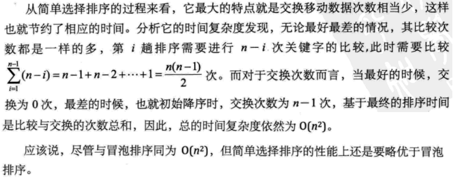

**另外：选择排序是一种不稳定的排序算法。**

## 3、插入排序

插入排序（Insertion-Sort）的算法描述是一种简单直观的排序算法。它的工作原理是通过构建有序序列，对于未排序数据，在已排序序列中从后向前扫描，找到相应位置并插入。插入排序在实现上，通常采用in-place排序（即只需用到O(1)的额外空间的排序），因而在从后向前扫描过程中，需要反复把已排序元素逐步向后挪位，为最新元素提供插入空间。

### 1）算法描述

一般来说，插入排序都采用in-place在数组上实现。具体算法描述如下：

- 从第一个元素开始，该元素可以认为已经被排序；
- 取出下一个元素，在已经排序的元素序列中从后向前扫描；
- 如果该元素（已排序）大于新元素，将该元素移到下一位置；
- 重复步骤3，直到找到已排序的元素小于或者等于新元素的位置；
- 将新元素插入到该位置后；
- 重复步骤2~5。

### 2）动图演示


### 3）代码实现

```java
/**
 * 插入排序
 * @param array
 * @return
 */
public static int[] insertSort(int[] nums) {
    for (int i = 1; i < nums.length; i++) {
        int cur = nums[i];
        int preIndex = i - 1;
        while (preIndex >= 0 && cur < nums[preIndex]) {
            nums[preIndex + 1] = nums[preIndex];
            preIndex--;
        }
        nums[preIndex + 1] = cur;
    }
    return nums;
}
```

### 4）算法分析

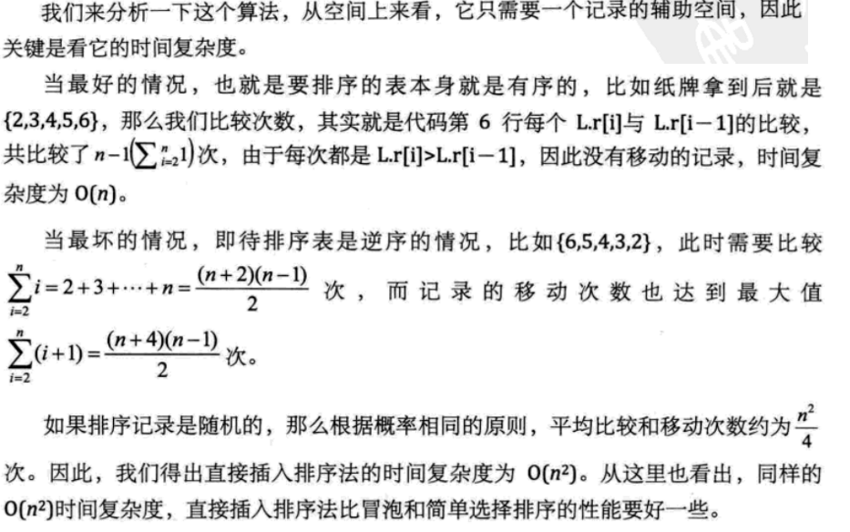

## 4、希尔排序

希尔排序是希尔（Donald Shell）于1959年提出的一种排序算法。希尔排序也是一种插入排序，它是简单插入排序经过改进之后的一个更高效的版本，也称为缩小增量排序，同时该算法是冲破O(n^2）的第一批算法之一。它与插入排序的不同之处在于，它会优先比较距离较远的元素。希尔排序又叫缩小增量排序。

**希尔排序是把记录按下表的一定增量分组，对每组使用直接插入排序算法排序；随着增量逐渐减少，每组包含的关键词越来越多，当增量减至1时，整个文件恰被分成一组，算法便终止。**

### 1）算法描述

我们来看下希尔排序的基本步骤，在此我们选择增量gap=length/2，缩小增量继续以gap = gap/2的方式，这种增量选择我们可以用一个序列来表示，**{n/2,(n/2)/2...1}**，称为**增量序列**。希尔排序的增量序列的选择与证明是个数学难题，我们选择的这个增量序列是比较常用的，也是希尔建议的增量，称为希尔增量，但其实这个增量序列不是最优的。此处我们做示例使用希尔增量。

先将整个待排序的记录序列分割成为若干子序列分别进行直接插入排序，具体算法描述：

- 选择一个增量序列t1，t2，…，tk，其中ti>tj，tk=1；
- 按增量序列个数k，对序列进行k 趟排序；
- 每趟排序，根据对应的增量ti，将待排序列分割成若干长度为m 的子序列，分别对各子表进行直接插入排序。仅增量因子为1 时，整个序列作为一个表来处理，表长度即为整个序列的长度。

### 2）过程演示


### 3）代码实现

```java
public static int[] shellSort(int arr[]) {
        int n = arr.length;
        int gap = n / 2;
        while (gap > 0) {
            for (int i = gap; i < n; i++) {
                int cur = arr[i];
                int preIndex = i - gap;
                while (preIndex >= 0 && arr[preIndex] > cur) {
                    arr[preIndex + gap] = arr[preIndex];
                    preIndex -= gap;
                }
                arr[preIndex + gap] = cur;
            }
            gap /= 2;
        }
        return arr;
    }
```

### 4）算法分析

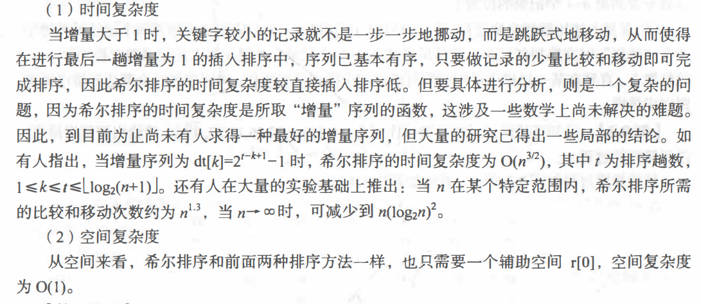


## 5、归并排序

和选择排序一样，归并排序的性能不受输入数据的影响，但表现比选择排序好的多，因为始终都是O(n log n）的时间复杂度。代价是需要额外的内存空间。

归并排序是建立在归并操作上的一种有效的排序算法。该算法是采用分治法（Divide and Conquer）的一个非常典型的应用。归并排序是一种稳定的排序方法。将已有序的子序列合并，得到完全有序的序列；即先使每个子序列有序，再使子序列段间有序。若将两个有序表合并成一个有序表，称为2-路归并。 

### 1）算法描述

- 把长度为n的输入序列分成两个长度为n/2的子序列；
- 对这两个子序列分别采用归并排序；
- 将两个排序好的子序列合并成一个最终的排序序列。

### 2）动图演示


### 3）代码实现

```java
public static int[] mergeSort(int arr[]) {
    if (arr.length < 2) {
        return arr;
    }
    int mid = arr.length / 2;
    int left[] = Arrays.copyOfRange(arr, 0, mid);
    int right[] = Arrays.copyOfRange(arr, mid, arr.length);
    return merge(mergeSort(left), mergeSort(right));
}

public static int[] merge(int[] left, int[] right) {
    int[] result = new int[left.length + right.length];
    for (int index = 0, i = 0, j = 0; index < result.length; index++) {
        if (i >= left.length) {
            result[index] = right[j++];
        } else if (j >= right.length) {
            result[index] = left[i++];
        } else if (left[i] > right[j]) {
            result[index] = right[j++];
        } else {
            result[index] = left[i++];
        }
    }
    return result;
}
```


### 4）算法分析

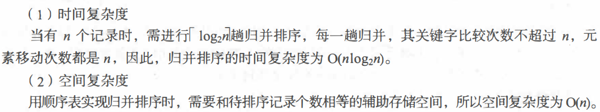


## 6、快速排序

快速排序的基本思想：通过一趟排序将待排记录分隔成独立的两部分，其中一部分记录的关键字均比另一部分的关键字小，则可分别对这两部分记录继续进行排序，以达到整个序列有序。

### 1）算法描述

快速排序使用分治法来把一个串（list）分为两个子串（sub-lists）。具体算法描述如下：

- 从数列中挑出一个元素，称为 “基准”（**pivot**）；
- 重新排序数列，所有元素比基准值小的摆放在基准前面，所有元素比基准值大的摆在基准的后面（相同的数可以到任一边）。在这个分区退出之后，该基准就处于数列的中间位置。这个称为分区（partition）操作；
- 递归地（recursive）把小于基准值元素的子数列和大于基准值元素的子数列排序。

### 2）动图演示


### 3）代码实现

```java
public static void quickSort(int[] array, int low, int hight) {
    if (array.length < 1 || low < 0 || hight >= array.length || low > hight) return;
    if (low < hight) {
        int privotpos = partition(array, low, hight);
        quickSort(array, low, privotpos - 1);
        quickSort(array, privotpos + 1, hight);
    }
}

public static int partition(int[] array, int low, int high) {
    int privot = array[low];
    while (low < high) {
        while (low < high && array[high] >= privot) --high;
        array[low] = array[high];
        while (low < high && array[low] <= privot) ++low;
        array[high] = array[low];
    }
    array[low] = privot;
    return low;
}
```


### 4）算法分析

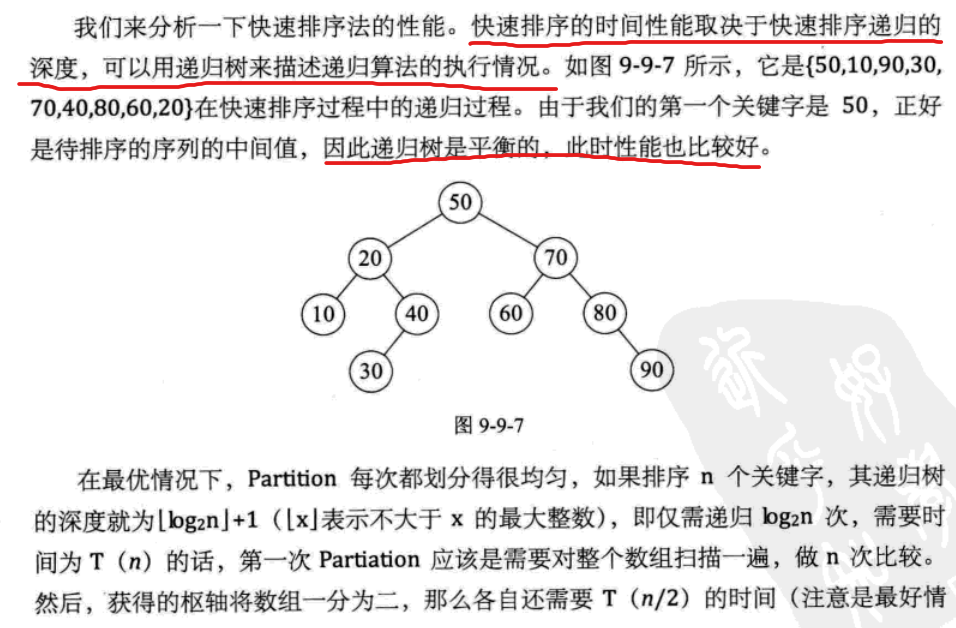

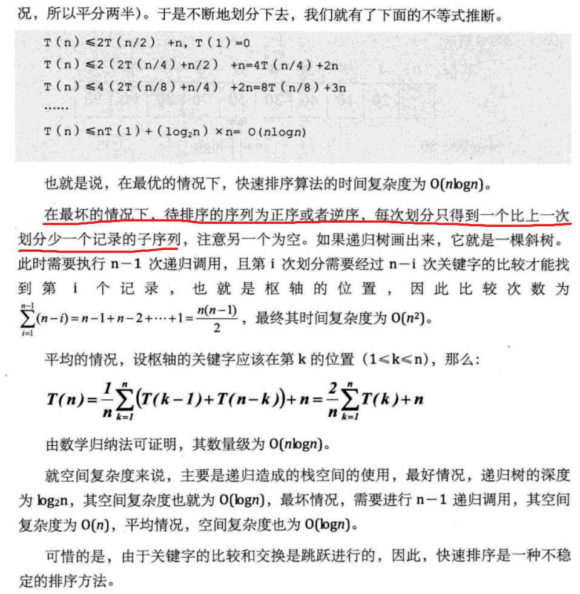

## 7、堆排序

堆排序（Heapsort）是指利用堆这种数据结构所设计的一种排序算法。堆积是一个近似完全二叉树的结构，并同时满足堆积的性质：即子结点的键值或索引总是小于（或者大于）它的父节点。

### 1）算法描述

- 将初始待排序关键字序列(R1,R2….Rn)构建成大顶堆，此堆为初始的无序区；
- 将堆顶元素R[1]与最后一个元素R[n]交换，此时得到新的无序区(R1,R2,……Rn-1)和新的有序区(Rn),且满足R[1,2…n-1]<=R[n]；
- 由于交换后新的堆顶R[1]可能违反堆的性质，因此需要对当前无序区(R1,R2,……Rn-1)调整为新堆，然后再次将R[1]与无序区最后一个元素交换，得到新的无序区(R1,R2….Rn-2)和新的有序区(Rn-1,Rn)。不断重复此过程直到有序区的元素个数为n-1，则整个排序过程完成。

### 2）动图演示


### 3）代码实现

```java
public static void heapAdjust(int[] array, int index, int length) {
    int max = index;
    int lchild = 2 * index;
    int rchild = 2 * index + 1;
    if (lchild < length && array[lchild] > array[max]) {
        max = lchild;
    }
    if (rchild < length && array[rchild] > array[max]) {
        max = rchild;
    }
    if (max != index) {
        int temp = array[index];
        array[index] = array[max];
        array[max] = temp;
        heapAdjust(array, max, length);
    }
}

public static int[] heapSort(int arr[]) {
    //将数组转换为大顶堆
    int length = arr.length;
    for (int i = (length / 2 - 1); i >= 0; i--) {       //从第（length / 2 - 1）开始转换
        heapAdjust(arr, i, length);
    }
    //将堆顶的元素和最后一个元素交换，并重新调整堆
    for (int i = length - 1; i >= 0; i--) {
        int temp = arr[i];
        arr[i] = arr[0];
        arr[0] = temp;
        heapAdjust(arr, 0, i);
    }
    return arr;
}
```

### 4）算法分析

它的运行时间主要是消耗在初始构建堆和在重建堆时的反复筛选上。

在构建堆的过程中，因为我们是完全二又树从最下层最右边的非终端结点开始构建，将它与其孩子进行比较和若有必要的互换，对于每个非终端结点来说，其实最多进行两次比较和互换操作，因此整个构建堆的时间复杂度为O(n)。

在正式排序时，第i次取堆顶记录重建堆需要用O(logn)的时间（完全二叉树的某个结点到根结点的距离为[logi]+1），并且需要取n-1次堆顶记录，因此，重建堆的时间复杂度为O(logn)。

所以总体来说，堆排序的时间复杂度为O(logn)。由于堆排序对原始记录的排序状态并不敏感，因此它无论是最好、最坏和平均时间复杂度均为O(logn)。这在性能上显然要远远好过于冒泡、简单选择、直接插人的0（n2）的时间复杂度了。

空间复杂度上，它只有一个用来交换的暂存单元，也非常的不错。不过由于记录的比较与交换是跳跃式进行，因此堆排序也是一种不稳定的排序方法。

另外，由于初始构建堆所需的比较次数较多，因此，它并不适合待排序序列个数较少的情况。

## 8、小结

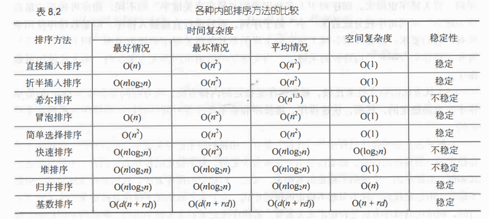