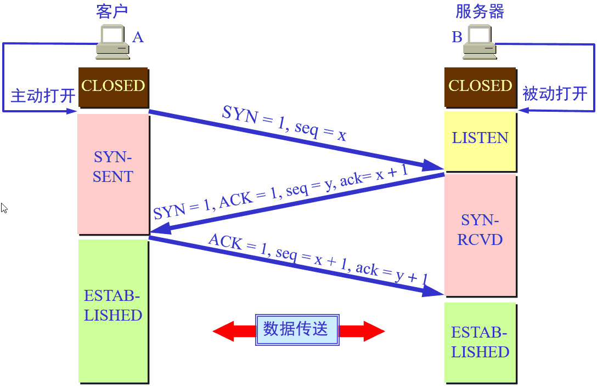
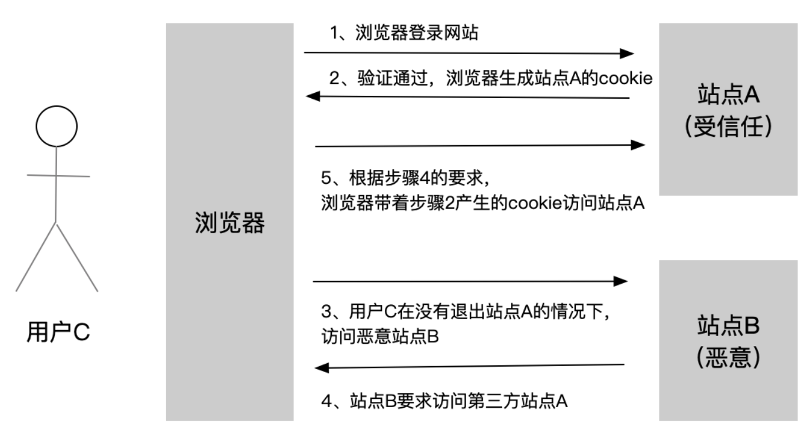
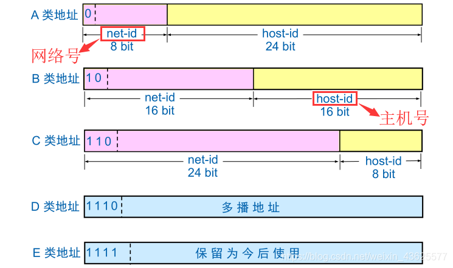

# 一、网络协议

## 1、网络协议的含义

在计算机网络要做到有条不紊地交换数据，就必须遵守一些事先约定好的规则，比如交换数据的格式、是否需要发送一个应答信息。这些规则被称为网络协议。

## 2、为什么要对网络协议分层

**1)   优点**

- 简化问题难度和复杂度。由于各层之间独立，我们可以分割大问题为小问题。
- 灵活性好。当其中一层的技术变化时，只要层间接口关系保持不变，其他层不受影响。
- 易于实现和维护。
- 促进标准化工作。分开后，每层功能可以相对简单地被描述。

**2)   缺点**

功能可能出现在多个层里，产生了额外开销。

## 3、体系结构

### 1)   OSI的体系结构

应用层（Application）、表示层（Presentation）、会话层（Session）、运输层（Transport）、网络层（Network）、数据链路层（DataLink）、物理层（Physical）。

### 2)   TCP/IP的体系结构

应用层、运输层、网际层和网络接口层。

### 3)   五层协议的体系机构

应用层、运输层、网络层，数据链路层和物理层。

# 二、五层协议体系结构

## 1、应用层

通过应用进程间的交互来完成特定网络应用。

常见的协议：如域名系统DNS，支持万维网应用的HTTP协议，支持电子邮件的SMTP协议等

## 2、运输层

负责向两台主机<u>**进程**</u>之间的通信提供通用的数据传输服务。

### 1) 传输控制协议-TCP

提供面向连接的，可靠的数据传输服务。

#### 1.TCP协议如何来保证传输的可靠性？

首先，采用三次握手来建立TCP连接，四次握手来释放TCP连接，从而保证建立的传输信道是可靠的。

其次，TCP采用了连续ARQ协议（回退N，Go-back-N；超时自动重传）(自动重传请求（AutomaticRepeat-reQuest，ARQ）)来保证数据传输的正确性，使用滑动窗口协议来保证接方能够及时处理所接收到的数据，进行流量控制。

最后，TCP使用慢开始、拥塞避免、快重传和快恢复来进行拥塞控制，避免网络拥塞。

> 数据包校验：目的是检测数据在传输过程中的任何变化，若校验出包有错，则丢弃报文段并且不给出响应，这时TCP发送数据端超时后会重发数据；
>
> 对失序数据包重排序：既然TCP报文段作为IP数据报来传输，而IP数据报的到达可能会失序，因此TCP报文段的到达也可能会失序。TCP将对失序数据进行重新排序，然后才交给应用层；
>
> 丢弃重复数据：对于重复数据，能够丢弃重复数据；
>
> 应答机制：当TCP收到发自TCP连接另一端的数据，它将发送一个确认。这个确认不是立即发送，通常将推迟几分之一秒；
>
> 超时重发：当TCP发出一个段后，它启动一个定时器，等待目的端确认收到这个报文段。如果不能及时收到一个确认，将重发这个报文段；
>
> 流量控制：TCP连接的每一方都有固定大小的缓冲空间。TCP的接收端只允许另一端发送接收端缓冲区所能接纳的数据，这可以防止较快主机致使较慢主机的缓冲区溢出，这就是流量控制。TCP使用的流量控制协议是可变大小的滑动窗口协议。
>
> 拥塞控制：拥塞控制就是防止过多的数据注入网络中，这样可以使网络中的路由器或链路不致过载。注意，拥塞控制和流量控制不同，前者是一个全局性的过程，而后者指点对点通信量的控制。
>
> 慢启动：不要一开始就发送大量的数据，先探测一下网络的拥塞程度，也就是说由小到大逐渐增加拥塞窗口的大小;
>
> 拥塞避免：拥塞避免算法让拥塞窗口缓慢增长，即每经过一个往返时间RTT就把发送方的拥塞窗口cwnd加1，而不是加倍，这样拥塞窗口按线性规律缓慢增长。
>
> 快重传：快重传要求接收方在收到一个失序的报文段后就立即发出重复确认（为的是使发送方及早知道有报文段没有到达对方）而不要等到自己发送数据时捎带确认。快重传算法规定，发送方只要一连收到三个重复确认就应当立即重传对方尚未收到的报文段，而不必继续等待设置的重传计时器时间到期。
>
> 快恢复：快重传配合使用的还有快恢复算法，当发送方连续收到三个重复确认时，就执行“乘法减小”算法，把ssthresh门限减半，但是接下去并不执行慢开始算法：因为如果网络出现拥塞的话就不会收到好几个重复的确认，所以发送方现在认为网络可能没有出现拥塞。所以此时不执行慢开始算法，而是将cwnd设置为ssthresh的大小，然后执行拥塞避免算法。

#### 2.      运行在TCP协议上的协议

HTTP（HypertextTransferProtocol，超文本传输协议），主要用于普通浏览。

HTTPS（HTTPoverSSL，安全超文本传输协议）,HTTP协议的安全版本。

FTP（FileTransferProtocol，文件传输协议），用于文件传输。

POP3（PostOfficeProtocol,version3，邮局协议），收邮件用。

SMTP（SimpleMailTransferProtocol，简单邮件传输协议），用来发送电子邮件。

TELNET（TeletypeovertheNetwork，网络电传），通过一个终端（terminal）登陆到网络。

SSH（SecureShell，用于替代安全性差的TELNET），用于加密安全登陆用。

### 2) 用户数据协议-UDP

提供无连接的，尽最大努力的数据传输服务（不保证数据传输的可靠性）。

#### 运行在UDP协议上的协议：

BOOTP（BootProtocol，启动协议），应用于无盘设备。

NTP（NetworkTimeProtocol，网络时间协议），用于网络同步。

DNS（DomainNameService，域名服务），用于完成地址查找，邮件转发等工作。

DHCP（DynamicHostConfigurationProtocol，动态主机配置协议），动态配置IP地址。

### 3) TCP和UDP的区别

|              | UDP                                        | TCP                                    |
| ------------ | ------------------------------------------ | -------------------------------------- |
| 是否连接     | 无连接                                     | 面向连接                               |
| 是否可靠     | 不可靠，不使用流量控制和拥塞控制           | 可靠，使用流量控制和拥塞控制           |
| 连接对象个数 | 支持一对一，一对多，多对一和多对多交互通信 | 只能是一对一通信                       |
| 传输方式     | 面向报文                                   | 面向字节流                             |
| 首部开销     | 首部开销小，仅8字节                        | 首部最小20字节，最大60字节             |
| 场景         | 适用于实时应用（IP电话、视频会议、直播等） | 适用于要求可靠传输的应用，例如文件传输 |

## 3、网络层

选择合适的网间路由和交换结点，确保计算机通信的数据<u>及时</u>传送。

## 4、数据链路层

两台主机之间的数据传输，总是在一段一段的链路上传送的，这就需要使用专门的链路层的协议。

- 封装成帧
- 透明传输
- 差错检测

## 5、物理层

实现相邻计算机节点之间比特流的透明传送，尽可能屏蔽掉具体传输介质和物理设备的差异。

# 三、常见面试题

## 1、Http和Https的区别

Http协议运行在TCP之上，明文传输，客户端与服务器端都无法验证对方的身份；Https是身披SSL(SecureSocketLayer)外壳的Http，运行于SSL上，SSL运行于TCP之上，是添加了加密和认证机制的HTTP。二者之间存在如下不同：

- 端口不同：Http与Https使用不同的连接方式，用的端口也不一样，前者是80，后者是443；
- 资源消耗：和HTTP通信相比，Https通信会由于加减密处理消耗更多的CPU和内存资源；
- 开销：Https通信需要证书，而证书一般需要向认证机构购买；
- 加密机制：HTTP没有任何加密机制，而Https采用共享密钥加密和公开密钥加密并用的混合加密机制

## 2、http2.0有哪些新特性

- 增加二进制分帧

HTTP2.0在应用层跟传送层之间增加了一个二进制分帧层，从而能够达到在不改动HTTP的语义，HTTP方法，状态码，URI以及首部字段的情况下，突破HTTP1.1的性能限制，改进传输性能，实现低延迟和高吞吐量

- 压缩头部

HTTP2.0在客户端和服务端使用首部表来跟踪和存储之间发送的键-值对，对相同请求而言不需要再次发送请求和相应发送，通信期间几乎不会改变的通用键值

- 多路复用

对HTTP1.1而言，浏览器通常有并行连接的限制，即最多几个并行链接。而多路复用允许通过单一的HTTP2.0连接发起多重的请求-相应消息，这意味着HTTP2.0的通信都在一个连接上完成了，这个连接可以承载任意数量的双向数据流。

- 请求优先级

在每个HTTP2.0的流里面有个优先值，这个优先值确定着客户端跟服务器处理不同的流采取不同的优先级策略，高优先级优先发送，但这不是绝对的(绝对等待会导致首队阻塞问题)

- 服务器提示

HTTP2.0新增加服务器提示，可以先于客户端检测到将要请求的资源，提前通知客户端，服务器不发送所有资源的实体，只发送资源的URL，客户端接到提示后会进行验证缓存，如果真需要这些资源，则正式发起请求（服务器主动更新静态资源）

## 3、加密

### 1）对称加密

**概念**

对称加密指的就是加密和解密使用同一个秘钥，所以叫做对称加密。对称加密只有一个秘钥，作为私钥。

**常见算法**

DES，AES，3DES等等。

### 2）非对称加密

**概念**

非对称加密指的是：加密和解密使用不同的秘钥，一把作为公开的公钥，另一把作为私钥。公钥加密的信息，只有私钥才能解密。私钥加密的信息，只有公钥才能解密。

**常见算法**

常见的非对称加密算法：RSA，ECC

## 4、三次握手

### 1）标志位含义

- **序号：**seq序号，占32位，用来标识从TCP源端向目的端发送的字节流，发起方发送数据时对此进行标记。
- **确认序号：**ack序号，占32位，只有ACK标志位为1时，确认序号字段才有效，ack=seq+1。
- **标志位：**
  - ACK：确认序号有效
  - FIN：释放一个连接。
  - PSH：接收方应该尽快将这个报文交给应用层。
  - RST：重置连接。
  - SYN：发起一个新连接。
  - URG：紧急指针（urgentpointer）有效。

### 2）本质

确认通信双方收发数据的能力。

### 3）过程

1. 第一次握手

客户端要向服务端发起连接请求，首先客户端随机生成一个起始序列号ISN(比如是100)，那客户端向服务端发送的报文段包含SYN标志位(也就是SYN=1)，序列号seq=100。

2. 第二次握手

服务端收到客户端发过来的报文后，发现SYN=1，知道这是一个连接请求，于是将客户端的起始序列号100存起来，并且随机生成一个服务端的起始序列号(比如是300)。然后给客户端回复一段报文，回复报文包含SYN和ACK标志(也就是SYN=1,ACK=1)、序列号seq=300、确认号ack=101(客户端发过来的序列号+1)。

3. 第三次握手

客户端收到服务端的回复后发现ACK=1并且ack=101,于是知道服务端已经收到了序列号为100的那段报文；同时发现SYN=1，知道了服务端同意了这次连接，于是就将服务端的序列号300给存下来。然后客户端再回复一段报文给服务端，报文包含ACK标志位(ACK=1)、ack=301(服务端序列号+1)、seq=101(第一次握手时发送报文是占据一个序列号的，所以这次seq就从101开始，需要注意的是不携带数据的ACK报文是不占据序列号的，所以后面第一次正式发送数据时seq还是101)。当服务端收到报文后发现ACK=1并且ack=301，就知道客户端收到序列号为300的报文了，就这样客户端和服务端通过TCP建立了连接。

### 4）为什么要有三次握手，两次不可以吗

在某个TCP连接中，A向B发送的连接请求SYN报文段滞留在网络中的某处。于是A超时重传，与B建立了TCP连接，交换了数据，最后也释放了TCP连接。

但滞留在网络中某处的陈旧的SYB报文段，现在突然传送到B了。如果不使用三次握手，那么B就以为A现在请求建立TCP连接，于是就分配资源，等待A传送数据。但A并没有想要建立TCP连接，也不会向B传送数据。B就白白等待A发送数据。

如果使用三次握手，那么B在收到A发送的陈旧的SYN报文段后，就向A发送SYN报文段，选择自己的序号seq=y，并确认收到A的SYN报文段，其确认号ack=x+1。当A收到B的SYN报文段时，从确认好就可得知不应当理睬这个SYB报文段（因为A现在并没有发送seq=x的SYN报文段）。这时，A发送复位报文段。在这个报文段中，RST=1，ACK=1，其确认号ack=y+1。我们注意到，虽然A拒绝了TCP连接的建立（发送了复位报文段），但对B发送的SYN报文段还是确认收到了。

B收到A的RST报文段后，就知道不能建立TCP连接，不会等待A发送数据了。

## 5、四次挥手

### 1）过程

前文：比如客户端初始化的序列号ISA=100，服务端初始化的序列号ISA=300。TCP连接成功后客户端总共发送了1000个字节的数据，服务端在客户端发FIN报文前总共回复了2000个字节的数据。

1. 第一次挥手

当客户端的数据都传输完成后，客户端向服务端发出连接释放报文(当然数据没发完时也可以发送连接释放报文并停止发送数据)，释放连接报文包含FIN标志位(FIN=1)、序列号seq=1101(100+1+1000，其中的1是建立连接时占的一个序列号)。需要注意的是客户端发出FIN报文段后只是不能发数据了，但是还可以正常收数据；另外FIN报文段即使不携带数据也要占据一个序列号。

2. 第二次挥手

服务端收到客户端发的FIN报文后给客户端回复确认报文，确认报文包含ACK标志位(ACK=1)、确认号ack=1102(客户端FIN报文序列号1101+1)、序列号seq=2300(300+2000)。此时服务端处于关闭等待状态，而不是立马给客户端发FIN报文，这个状态还要持续一段时间，因为服务端可能还有数据没发完。

3. 第三次挥手

服务端将最后数据(比如50个字节)发送完毕后就向客户端发出连接释放报文，报文包含FIN和ACK标志位(FIN=1,ACK=1)、确认号和第二次挥手一样ack=1102、序列号seq=2350(2300+50)。

4. 第四次挥手

客户端收到服务端发的FIN报文后，向服务端发出确认报文，确认报文包含ACK标志位(ACK=1)、确认号ack=2351、序列号seq=1102。注意客户端发出确认报文后不是立马释放TCP连接，而是要经过2MSL(最长报文段寿命的2倍时长)后才释放TCP连接。而服务端一旦收到客户端发出的确认报文就会立马释放TCP连接，所以服务端结束TCP连接的时间要比客户端早一些。

### 2）为什么TCP连接的时候是3次，关闭的时候却是4次？

因为只有在客户端和服务端都没有数据要发送的时候才能断开TCP。而客户端发出FIN报文时只能保证客户端没有数据发了，服务端还有没有数据发客户端是不知道的。而服务端收到客户端的FIN报文后只能先回复客户端一个确认报文来告诉客户端我服务端已经收到你的FIN报文了，但我服务端还有一些数据没发完，等这些数据发完了服务端才能给客户端发FIN报文(所以不能一次性将确认报文和FIN报文发给客户端，就是这里多出来了一次)。

### 3）为什么客户端发出第四次挥手的确认报文后要等2MSL的时间才能释放TCP连接？

这里同样是要考虑丢包的问题，如果第四次挥手的报文丢失，服务端没收到确认ack报文就会重发第三次挥手的报文，这样报文一去一回最长时间就是2MSL，所以需要等这么长时间来确认服务端确实已经收到了。

### 4）如果已经建立了连接，但是客户端突然出现故障了怎么办？

TCP设有一个保活计时器，客户端如果出现故障，服务器不能一直等下去，白白浪费资源。服务器每收到一次客户端的请求后都会重新复位这个计时器，时间通常是设置为2小时，若两小时还没有收到客户端的任何数据，服务器就会发送一个探测报文段，以后每隔75秒钟发送一次。若一连发送10个探测报文仍然没反应，服务器就认为客户端出了故障，接着就关闭连接。

## 6、常用HTTP状态码

| **类别**    | **原因短语**                                                 |
| ----------- | ------------------------------------------------------------ |
| **【1XX】** | **Informational（信息性状态码）接受的请求正在处理**          |
| **【2XX】** | **Success（成功状态码）请求正常处理完毕**                    |
| 【200】     | 表示从客户端发来的请求在服务器端被正确处理                   |
| 【202】     | 表示服务器已接受了请求，但尚未对其进行处理。                 |
| 【204】     | No content，表示请求成功，但响应报文不含实体的主体部分       |
| 【206】     | Partial Content，进行范围请求成功                            |
| **【3XX】** | **Redirection（重定向状态码）需要进行附加操作以完成请求**    |
| 【301】     | moved permanently，永久性重定向，表示资源已被分配了新的URL   |
| 【302】     | found，临时性重定向，表示资源临时被分配了新的URL             |
| 【303】     | see other，表示资源存在着另一个URL，应使用GET方法获取资源（对于301/302/303响应，几乎所有浏览器都会删除报文主体并自动用GET重新请求） |
| 【304】     | not modified，表示服务器允许访问资源，但请求未满足条件的情况（与重定向无关） |
| 【307】     | temporary redirect，临时重定向，和302含义类似，但是期望客户端保持请求方法不变向新的地址发出请求 |
| **【4XX】** | **Client Error（客户端错误状态码）服务器无法处理请求**       |
| 【400】     | bad request，请求报文存在语法错误                            |
| 【401】     | unauthorized，表示发送的请求需要有通过HTTP认证的认证信息     |
| 【403】     | forbidden，表示对请求资源的访问被服务器拒绝，可在实体主体部分返回原因描述 |
| 【404】     | not found，表示在服务器上没有找到请求的资源                  |
| 【405】     | Method Not Allowed，客户端请求中的方法被禁止（请求方式不正确） |
| **【5XX】** | **Server Error（服务器错误状态码）服务器处理请求出错**       |
| 【500】     | internal sever error，表示服务器端在执行请求时发生了错误     |
| 【501】     | Not Implemented，表示服务器不支持当前请求所需要的某个功能    |
| 【503】     | service unavailable，表明服务器暂时处于超负载或正在停机维护，无法处理请求 |

## 7、GET与POST区别

Get是不安全的，因为在传输过程，数据被放在请求的URL中；Post的所有操作对用户来说都是不可见的。但是这种做法也不时绝对的，大部分人的做法也是按照上面的说法来的，但是也可以在get请求加上requestbody，给post请求带上URL参数。

Get请求提交的url中的数据最多只能是2048字节，这个限制是浏览器或者服务器给添加的，http协议并没有对url长度进行限制，目的是为了保证服务器和浏览器能够正常运行，防止有人恶意发送请求。Post请求则没有大小限制。

Get限制Form表单的数据集的值必须为ASCII字符；而Post支持整个ISO10646字符集

Get执行效率却比Post方法好。Get是form提交的默认方法。

GET产生一个TCP数据包；POST产生两个TCP数据包。

对于GET方式的请求，浏览器会把httpheader和data一并发送出去，服务器响应200（返回数据）

而对于POST，浏览器先发送header，服务器响应100continue，浏览器再发送data，服务器响应200ok（返回数据）。

## 8、Session、Cookie和Token的主要区别

### 1）什么是cookie

cookie是由Web服务器保存在用户浏览器上的小文件（key-value格式），包含用户相关的信息。客户端向服务器发起请求，如果服务器需要记录该用户状态，就使用response向客户端浏览器颁发一个Cookie。客户端浏览器会把Cookie保存起来。当浏览器再请求该网站时，浏览器把请求的网址连同该Cookie一同提交给服务器。服务器检查该Cookie，以此来辨认用户身份。

### 2）什么是session

session是依赖Cookie实现的。session是服务器端对象。

session是浏览器和服务器会话过程中，服务器分配的一块储存空间。服务器默认为浏览器在cookie中设置sessionid，浏览器在向服务器请求过程中传输cookie包含sessionid，服务器根据sessionid获取出会话中存储的信息，然后确定会话的身份信息。

### 3）什么是Token

Token的引入：Token是在客户端频繁向服务端请求数据，服务端频繁的去数据库查询用户名和密码并进行对比，判断用户名和密码正确与否，并作出相应提示，在这样的背景下，Token便应运而生。

Token的定义：Token是服务端生成的一串字符串，以作客户端进行请求的一个令牌，当第一次登录后，服务器生成一个Token便将此Token返回给客户端，以后客户端只需带上这个Token前来请求数据即可，无需再次带上用户名和密码。

使用Token的目的：Token的目的是为了减轻服务器的压力，减少频繁的查询数据库，使服务器更加健壮。

Token是在服务端产生的。如果前端使用用户名/密码向服务端请求认证，服务端认证成功，那么在服务端会返回Token给前端。前端可以在每次请求的时候带上Token证明自己的合法地位

### 4）cookie与session区别

存储位置与安全性

cookie数据存放在客户端上，安全性较差，session数据放在服务器上，安全性相对更高；

存储空间

单个cookie保存的数据不能超过4K，很多浏览器都限制一个站点最多保存20个cookie，session无此限制

占用服务器资源

session一定时间内保存在服务器上，当访问增多，占用服务器性能，考虑到服务器性能方面，应当使用cookie。

### 5）session与token区别

session机制存在服务器压力增大，CSRF跨站伪造请求攻击，扩展性不强等问题；

session存储在服务器端，token存储在客户端

token提供认证和授权功能，作为身份认证，token安全性比session好；

session这种会话存储方式方式只适用于客户端代码和服务端代码运行在同一台服务器上，token适用于项目级的前后端分离（前后端代码运行在不同的服务器下）

## 9、从输入网址到获得页面的过程

（1）域名解析，其实就是根据用户输入的网址去寻找它对应的IP地址，比如输入 www.baidu.com 的网址就会经历以下过程：

1. 先从浏览器缓存里找IP,因为浏览器会缓存DNS记录一段时间
2. 如没找到,再从Hosts文件查找是否有该域名和对应IP
3. 如没找到,再从路由器缓存找
4. 如没好到,再从DNS缓存查找
5. 如果都没找到,浏览器域名服务器向根域名服务器(baidu.com)查找域名对应IP,还没找到就把请求转发到下一级,直到找到IP

（2）浏览器获得域名对应的IP地址以后，浏览器向服务器请求建立链接，发起三次握手；

（3）TCP/IP链接建立起来后，浏览器向服务器发送HTTP请求；

（4）服务器接收到这个请求，并根据路径参数映射到特定的请求处理器进行处理，并将处理结果及相应的视图返回给浏览器；

（5）浏览器解析并渲染视图，若遇到对js文件、css文件及图片等静态资源的引用，则重复上述步骤并向服务器请求这些资源；

（6）浏览器根据其请求到的资源、数据渲染页面，最终向用户呈现一个完整的页面。

## 10、常见的WEB攻击手段

### 1）XSS攻击

**概念**

XSS（Cross Site Scripting）跨站脚本攻击，为了不与层叠样式表（CSS）混淆，故将跨站脚本攻击缩写为XSS。原理即在网页中嵌入恶意脚本，当用户打开网页时，恶意脚本便开始在用户浏览器上执行，以盗取客户端cookie、用户名、密码，甚至下载木马程式，危害可想而知。

**含义**

之所以会发生XSS攻击，是因为用户输入的数据变成了代码， 因此需要对用户输入的数据进行HTML转义处理，将输出的“尖括号”、“单引号”、“引号”之类的特色符号进行转义。

| HTML | HTML转义后的字符 |
| ---- | ---------------- |
| <    | \&lt;            |
| >    | \&gt;            |
| ‘    | \&amp;           |
| “    | \&quot;          |

### 2）CSRF攻击

**概念**

CSRF攻击的全称跨站请求伪造（Cross Site Request Forgery），通过盗用用户的身份信息，以你的名义向第三方网站发起恶意请求，若转账、盗取账号、发信息、邮件。流程框图如下：

所以CSRF攻击一般场景是：

1、用户登录受信站点A，生成本地cookie；
2、用户没有退出站点A，访问了恶意站点B。

**防御**

1、将cookie设置为HttpOnly

CSRF攻击很大程度是利用了浏览器的cookie，为了防止站内XSS漏洞，cookie设置HttpOnly属性，JS脚本就无法读取到cookie中的信息，避免攻击者伪造cookie的情况出现。

2、增加token

CSRF攻击之所以成功，主要是攻击中伪造了用户请求，而用户请求的验证信息都在cookie中，攻击者就可以利用cookie伪造请求通过安全验证。因此抵御CSRF攻击的关键就是，在请求中放入攻击者不能伪造的信息，并且信息不在cookie中。

鉴于此，开发人员可以在http请求中以参数的形式加一个token，此token在服务端生成，也在服务端校验，服务端的每次会话都可以用同一个token。如果验证token不一致，则认为至CSRF攻击，拒绝请求。

### 3）SQL注入攻击

**含义**

SQL注入攻击就是把SQL命令伪装成正常的http请求参数，传递到服务端，欺骗服务器最终执行恶意的SQL命令，达到入侵目的。

**防御**

使用ORM框架如：mybatis。

### 4）文件上传漏洞

倘若web网站没有对文件类型进行严格的校验，导致可执行文件上传到了服务器，恶意程序就会执行。

为了避免恶意文件上传，需要对上传文件类型进行白名单校验，并限制文件大小，上传文件进行重命名。

### 5）DDoS

**含义**

DDoS（Distributed Denial Of Service）攻击即分布式服务攻击，借助公共网络，将数量庞大的计算器设备（肉鸡）联合起来，对一个或多个目标发动攻击，从而达到瘫痪目标主机的目的。

1、SYN flood

攻击者伪造大量无效IP，不断与目标主机建立TCP链接，导致服务器维护了一个非常大的链接等待列表，占用大量系统资源，直至新链接无法建立。

这种攻击是利用了TCP三次握手的异常处理机制，即第三次握手，服务端在没有收到客户端ACK报文时，服务端会进行多次SYN+ACK重试，然后维护一个等待列表，而系统会为即将建立的TCP连接分配一部分资源。资源耗尽，系统也就无法再建立TCP连接。

2、DNS query flood

攻击者伪造大量无效域名，发送给目标服务器解析，这些域名均为无效域名，导致DNS服务器耗用大量资源去处理这些无效域名，造成DNS解析域名超时，达到攻击目的。

## 11、RESTful是什么？

RESTful是一种软件架构风格，用于约束客户端和服务器交互，满足这些约束条件和原则的应用程序或设计就是 RESTful。比如HTTP协议使用同一个URL地址，通过GET，POST，PUT，DELETE等方式实现查询、提交、删除数据。

## 12、 HTTP常用Method

1. `GET`：GET 方法的首要目的是 **获取资源**。

2. `POST`：POST 方法的首要目的是 **提交**，POST 方法一般用于添加资源。

3. `HEAD`：HEAD 方法用于获取报头信息，例如检查 cache 是否被修改，是否过期？

   （HEAD 方法与 GET 方法类似，但并不会返回响应主体）

4. `OPTIONS`：OPTIONS 方法的首要目的是 **预检请求**（Priflight Request）。

5. `PUT `：更新资源。 对后台来说 PUT 方法的参数是一个完整的资源对象，它包含了对象的所有字段。

6. `PATCH`：更新资源。对后台来说 PATCH 方法的参数只包含我们需要修改的资源对象的字段。

7. `DELETE`：DELETE 方法一般用于删除资源。

## 13、IP地址分类编址

- A类：1.0.0.0 - 127.255.255.255 （二进制表示为：00000001 00000000 00000000 00000000 -- 01111111 11111111 11111111 11111111）。最后一个是广播地址。其子网掩码为255.0.0.0，每个网络只能包含 (2^24) - 2=16777214台计算机（除去一个网络地址和一个广播位）。因此一般用于大型网络。

- B类：128.0.0.0 - 191.255.255.255（二进制表示为：10000000 00000000 00000000 00000000--10111111 11111111 11111111 11111111）。 最后一个是广播地址。其子网掩码为255.255.0.0，每个网络最多只能包含 (2^16) - 2=65534台计算机。一般用于中型规模网络。

- C类：192.0.0.0 - 223.255.255.255（二进制表示为: 11000000 00000000 00000000 00000000 - 11011111 11111111 11111111 11111111）。最后一个是广播地址。其子网掩码为255.255.255.0，每个网络最多只能包含 (2^8) - 2=254台计算机。一般用于小型网络。