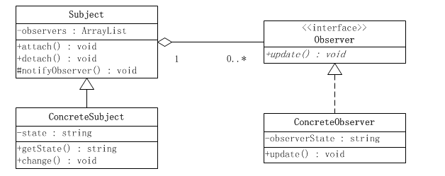

> 设计模式（Design pattern）是一套被反复使用、多数人知晓的、经过分类编目的、代码设计经验的总结，是可复用面向对象软件的基础。**使用设计模式是为了可重用代码、让代码更容易被他人理解、保证代码可靠性。**
>

# 一、设计模式的分类

总体来说23种设计模式分为三大类：
**创建型模式（共五种）：**工厂方法模式、抽象工厂模式、单例模式、建造者模式、原型模式。
**结构型模式（共七种）：**适配器模式、装饰器模式、代理模式、外观模式、桥接模式、组合模式、享元模式。
**行为型模式（共十一种）：**策略模式、模板方法模式、观察者模式、迭代子模式、责任链模式、命令模式、备忘录模式、状态模式、访问者模式、中介者模式、解释器模式。

# 二、设计模式的六大原则

## 0、开闭原则（总原则）

对扩展开放，对修改封闭。在程序需要进行拓展的时候，不能去修改原有的代码，而是要扩展原有代码，实现一个热插拔的效果。所以一句话概括就是：为了使程序的扩展性好，易于维护和升级。
想要达到这样的效果，我们需要使用接口和抽象类等，后面的具体设计中我们会提到这点。

## 1、单一职责原则

每个类应该实现单一的职责，否则就应该把类拆分

## 2、里氏替换原则

任何基类可以出现的地方，子类一定可以出现。里氏替换原则是继承复用的基石，只有当衍生类可以替换基类，软件单位的功能不受到影响时，基类才能真正被复用，而衍生类也能够在基类的基础上增加新的行为。

## 3、依赖倒转原则

面向接口编程，依赖于抽象而不依赖于具体。写代码时用到具体类时，不与具体类交互，而与具体类的上层接口交互。

## 4、接口隔离原则

每个接口中不存在子类用不到却必须实现的方法，如果不然，就要将接口拆分。使用多个隔离的接口，比使用单个接口（多个接口方法集合到一个的接口）要好。

## 5、迪米特法则（最少知道原则）

一个类对自己依赖的类知道的越少越好。无论被依赖的类多么复杂，都应该将逻辑封装在方法的内部，通过public方法提供给外部。这样当被依赖的类变化时，才能最小的影响该类。

## 6、合成复用原则

尽量首先使用合成/聚合的方式，而不是使用继承。

# 三、常用设计模式

## 1、工厂方法模式

### 1）普通工厂模式

#### 1. 含义

建立一个工厂类，对实现了同一接口的一些类进行实例的创建。

#### 2. 优点

使用工厂方法模式，创建客户所需产品，用户只需关心产品对应的工厂，其他都不用知道。添加新产品时，只需添加一个具体工厂和一个具体产品即可。

#### 3. 缺点

添加新产品时，需要同时添加具体工厂和具体产品，所以系统中类的个数是成对增加，增加了系统的复杂度。

#### 4. 适用场景

客户端不知道它所需要的对象的类。

#### 5. 案例

```java
public interface Sender {  
    public void Send();  
}  
public class MailSender implements Sender {  
    @Override  
    public void Send() {  
        System.out.println("this is mailsender!");  
    }  
}  
public class SmsSender implements Sender {  
    @Override  
    public void Send() {  
        System.out.println("this is sms sender!");  
    }  
}  
public class SendFactory {  
    public Sender produce(String type) {  
        if ("mail".equals(type)) {  
            return new MailSender();  
        } else if ("sms".equals(type)) {  
            return new SmsSender();  
        } else {  
            System.out.println("请输入正确的类型!");  
            return null;  
        }  
    }  
}  
public class FactoryTest {  
  
    public static void main(String[] args) {  
        SendFactory factory = new SendFactory();  
        Sender sender = factory.produce("sms");  
        sender.Send();  
    }  
}  

//输出：this is sms sender!
```

### 2）多个工厂方法模式

对普通工厂方法模式的改进，在普通工厂方法模式中，如果传递的字符串出错，则不能正确创建对象，而多个工厂方法模式是提供多个工厂方法，分别创建对象。

将上面的代码做下修改，改动下SendFactory类就行，如下：

```java
public class SendFactory {  
      
    public Sender produceMail(){  
        return new MailSender();  
    }  
      
    public Sender produceSms(){  
        return new SmsSender();  
    }  
}  
public class FactoryTest {  
  
    public static void main(String[] args) {  
        SendFactory factory = new SendFactory();  
        Sender sender = factory.produceMail();  
        sender.Send();  
    }  
}  

//this is mailsender!
```

### 3）静态工厂方法模式

将上面的多个工厂方法模式里的方法置为静态的，不需要创建实例，直接调用即可。

```java
public class SendFactory {  
      
    public static Sender produceMail(){  
        return new MailSender();  
    }  
      
    public static Sender produceSms(){  
        return new SmsSender();  
    }  
}  
public class FactoryTest {  
  
    public static void main(String[] args) {      
        Sender sender = SendFactory.produceMail();  
        sender.Send();  
    }  
}  
//this is mailsender!
```

> 总结：
>
> 凡是出现了大量的产品需要创建，并且具有共同的接口时，可以通过工厂方法模式进行创建。在以上的三种模式中，第一种如果传入的字符串有误，不能正确创建对象，第三种相对于第二种，不需要实例化工厂类，所以，大多数情况下，我们会选用第三种——静态工厂方法模式。

## 2、抽象工厂模式

工厂方法模式有一个问题就是，类的创建依赖工厂类，也就是说，如果想要拓展程序，必须对工厂类进行修改，这违背了闭包原则，所以，从设计角度考虑，有一定的问题，如何解决？就用到抽象工厂模式，创建多个工厂类，这样一旦需要增加新的功能，直接增加新的工厂类就可以了，不需要修改之前的代码。

### 1）优点

易于交换产品系列；使具体的创建实例过程与客户端分离。

### 2）缺点

实现增加功能时，需改动的地方比较多。

### 3）适用场景

系统功能结构稳定，不需新增功能。

### 4）案例

```java
public interface Sender {  
    public void Send();  
}  
public class MailSender implements Sender {  
    @Override  
    public void Send() {  
        System.out.println("this is mailsender!");  
    }  
}  
public class SmsSender implements Sender {  
  
    @Override  
    public void Send() {  
        System.out.println("this is sms sender!");  
    }  
}  
public interface Provider {  
    public Sender produce();  
}  
public class SendMailFactory implements Provider {  
      
    @Override  
    public Sender produce(){  
        return new MailSender();  
    }  
}  
public class SendSmsFactory implements Provider{  
  
    @Override  
    public Sender produce() {  
        return new SmsSender();  
    }  
}  
public class Test {  
  
    public static void main(String[] args) {  
        Provider provider = new SendMailFactory();  
        Sender sender = provider.produce();  
        sender.Send();  
    }  
}  
```

### 5）案例类图


## 3、单例模式

[【推荐阅读】线程安全单例面试题大全](/notes/computer/线程安全单例面试题)

单例模式确保某个类只有一个实例，而且自行实例化并向整个系统提供这个实例。在计算机系统中，线程池、缓存、日志对象、对话框、打印机、显卡的驱动程序对象常被设计成单例。比如每台计算机可以有若干个打印机，但只能有一个Printer Spooler，以避免两个打印作业同时输出到打印机中。

### 1）懒汉式单例

```java
//懒汉式单例类.在第一次调用的时候实例化自己 
public class Singleton {
    private Singleton() {}
    private static Singleton single=null;
    //静态工厂方法 
    public static Singleton getInstance() {
         if (single == null) {  
             single = new Singleton();
         }  
        return single;
    }
} 
```

Singleton通过将构造方法限定为private避免了类在外部被实例化，在同一个虚拟机范围内，Singleton的唯一实例只能通过getInstance()方法访问。

(事实上，通过Java反射机制是能够实例化构造方法为private的类的，那基本上会使所有的Java单例实现失效。)

但是以上懒汉式单例的实现没有考虑**线程安全问题**，它是线程不安全的，并发环境下很可能出现多个Singleton实例，要实现线程安全，有以下三种方式，都是对getInstance这个方法改造，保证了懒汉式单例的线程安全。

**1、在getInstance方法上加同步**

```java
public static synchronized Singleton getInstance() {
    if (single == null) {  
        single = new Singleton();
    }  
    return single;
}

```

**2、双重检查锁定**

```java
public static Singleton getInstance() {
    if (singleton == null) {  
        synchronized (Singleton.class) {  
            if (singleton == null) {  
                singleton = new Singleton(); 
            }  
        }  
    }  
    return singleton; 
}

```

**3、静态内部类**（推荐）

```java
public class Singleton {  
    private static class LazyHolder {  
       private static final Singleton INSTANCE = new Singleton();  
    }  
    private Singleton (){}  
    public static final Singleton getInstance() {  
       return LazyHolder.INSTANCE;  
    }  
}  

```

这种方式是当被调用getInstance()时才去加载静态内部类LazyHolder，LazyHolder在加载过程中会实例化一个静态的Singleton，因为利用了classloader的机制来保证初始化instance时只有一个线程，所以Singleton肯定只有一个，是线程安全的，这种比上面1、2都好一些，既实现了线程安全，又避免了同步带来的性能影响。

### 2）饿汉式单例

```java
//饿汉式单例类.在类初始化时，已经自行实例化 
public class Singleton1 {
    private Singleton1() {}
    private static final Singleton1 single = new Singleton1();
    //静态工厂方法 
    public static Singleton1 getInstance() {
        return single;
    }
}
```

饿汉式在类创建的同时就已经创建好一个静态的对象供系统使用，以后不再改变，所以天生是线程安全的。

> **饿汉式和懒汉式区别:**
>
> 饿汉就是类一旦加载，就把单例初始化完成，保证getInstance的时候，单例是已经存在的了，
> 而懒汉比较懒，只有当调用getInstance的时候，才回去初始化这个单例。
> 另外从以下两点再区分以下这两种方式：
>
> 1. 线程安全：
>    - 饿汉式天生就是线程安全的，可以直接用于多线程而不会出现问题；
>    - 懒汉式本身是非线程安全的，为了实现线程安全有几种写法，分别是上面的1、2、3，这三种实现在资源加载和性能方面有些区别。
> 2. 资源加载和性能：
>    - 饿汉式在类创建的同时就实例化一个静态对象出来，不管之后会不会使用这个单例，都会占据一定的内存，但是相应的，在第一次调用时速度也会更快，因为其资源已经初始化完成；
>    - 而懒汉式顾名思义，会延迟加载，在第一次使用该单例的时候才会实例化对象出来，第一次调用时要做初始化，如果要做的工作比较多，性能上会有些延迟，之后就和饿汉式一样了。

## 4、建造者模式

### 1）概念

将一个复杂的构建与其表示相分离，使得同样的构建过程可以创建不同的表示。

与抽象工厂的区别：在建造者模式里，有个指导者，由指导者来管理建造者，用户是与指导者联系的，指导者联系建造者最后得到产品。即建造模式可以强制实行一种分步骤进行的建造过程。

建造模式是将复杂的内部创建封装在内部，对于外部调用的人来说，只需要传入建造者和建造工具，对于内部是如何建造成成品的，调用者无需关心。

### 2）建造者模式结构组成

- **Product**: 表示被构造的复杂对象,其中包含需要构建的部件属性。
- **Builder**: 创建一个产品对象的各个部件指定抽象接口。
- **ConcreteBuilder**： 实现Builder的接口以构造和装配该产品的各个部件，定义并明确它所创建的表示。
- **Director**： 调用具体建造者角色以创建产品对象。

### 3）优点

使建造代码与表示代码分离，由于建造者隐藏了该产品是如何组装的，所以若需要改变一个产品的内部表示，只需要再定义一个具体的建造者就可以。

### 4）缺点

如果产品内部变化复杂，会增加系统的难度和运行成本。

### 5）适用场景

创建复杂对象的算法应该独立于该对象的组成部分以及它们的装配方式；产品有较多的共同点，组成部分相似。

### 6）下面以构建一辆汽车为例，写示例代码：

1.Product角色:组装一辆汽车首先的有各种配件，如发动机、轮胎、座椅等。

```java
public class Car{
    public String engine;
    public String tyre;
    public String seat;
    public Car(){

    }

    public String getEngine() {
        return engine;
    }
    public void setEngine(String engine) {
        this.engine = engine;
    }
    public String getTyre() {
        return tyre;
    }
    public void setTyre(String tyre) {
        this.tyre = tyre;
    }
    public String getSeat() {
        return seat;
    }
    public void setSeat(String seat) {
        this.seat = seat;
    }

}
```

2.Builder角色:知道了所需配件后，就需要生产配件了，定义一个生产配件的抽象建造者接口。

```java
public interface Builder {
    String buildEngine();
    String buildTyre();
    String buildSeat();
}  
```

3.ConcreteBuilder角色:实现抽象的 建造者接口生成具体的建造者，并开始生产具体的配件。

```java
public class CarBuilder implements Builder{

    @Override
    public String buildEngine() {
        // 生产发动机
        return "发动机";
    }

    @Override
    public String buildTyre() {
        // 生产轮胎
        return "轮胎";
    }

    @Override
    public String buildSeat() {
        // 生产座椅
        return "座椅";
    }
}
```

4.Director角色:在生产出配件后，由指导者指导组装配件生成汽车。

```java
public class CarDirector {
    
    CarBuilder cb;
    
    public CarDirector(CarBuilder cb){
        this.cb=cb;
    }
    
    public Car constructCar(){
        Car car=new Car();
        car.setEngine(cb.buildEngine());
        car.setTyre(cb.buildTyre());
        car.setSeat(cb.buildSeat());
        return car;
    }
}
```

5.最终得到一辆汽车:

```java
public class Client {
    public static void main(String[] args) {
        CarDirector carDirector=new CarDirector(new CarBuilder());
        Car car=carDirector.constructCar();
        System.out.println(car.getEngine()+car.getTyre()+car.getSeat());
    }
}
```

### 7）类图


## 5、适配器模式

适配器模式，把一个类接口变化成客户端所期待的另一个类的接口，使原来因接口不匹配而无法一起工作的类能够一起工作。

Java源码中的例子：如Java IO中的java.io.InputStreamReader(InputStream) 和java.io.OutputStreamWriter(OutputStream)就是典型的适配器模式，通过InputStreamReader、OutputStreamWriter适配器将字节流转换为字符流。

- 优点：灵活性、扩展性好
- 缺点：不支持多重继承（针对类适配器）
- 适用场景：系统的数据和行为都正确，但接口不符。主要应用于希望**复用一些现存的类**，但是接口由于复用环境不一致的情况。

### 1）类适配器

Target(目标角色)：客户所期待的接口。目标可以是具体的或抽象的类，也可以是接口。
Adaptee(源角色)：现在需要适配的类。
Adapter(适配器)：适配器类是本模式的核心。适配器把源接口转换成目标接口。显然，这一角色不可以是接口，而必须是具体类。

```java
/**
 * 目标角色，如举例中需要转换成的三相插头
 */
public interface Target {
     void handleReq();
}   

/**
 * 源角色，需要被适配的类，如举例中的两脚插头
 */
public class Adaptee {
     public void request(){
        System.out.println( "可以完成客户请求的需要的功能!" );
    }
}   

/**
 * 适配器，把源接口转换成目标接口，即将两脚插头转换为三脚插头
 *
 */
public class Adapter extends Adaptee implements Target{
     public void handleReq() {
         super.request();
    }
}

/**
 * 客户端类，通过三脚插座进行工作
 *
 */
public class Client {
    public void work(Target t){
        t.handleReq();
    }
    public static void main(String[] args){
        Client c = new Client();
        Target t = new Adapter();
        c.work(t);
    }
}
```

### 2）对象适配器

```java
/**
 * 适配器，把源接口转换成目标接口，即将两脚插头转换为三脚插头
 *
 */
public class Adapter implements Target{
    Adaptee adaptee;
    public Adapter(Adaptee adaptee){
         this.adaptee = adaptee ;
    }
     public void handleReq() {
         adaptee.request();
    }

}

public class Client {
    public void work(Target  t){
        t.handleReq();
    }
     public static void main(String[]  args ) {
        Client c =new Client();
        Adaptee adaptee = new Adaptee();
        Target t = new Adapter(adaptee);
        c.work(t);
    }
}

```

上面这种实现的适配器称为类适配器，因为 Adapter 类既继承了 Adaptee （被适配类），也实现了 Target 接口（因为 Java 不支持多继承，所以这样来实现），在 Client 类中我们可以根据需要选择并创建任一种符合需求的子类，来实现具体功能。另外一种适配器模式是对象适配器，它不是使用多继承或继承再实现的方式，而是使用直接关联，或者称为委托的方式，通过组合的方式跟适配对象组合。

测试结果与上面的一致。 使用对象适配器模式，可以使得 Adapter 类（适配类）根据传入的 Adaptee 对象达到适配多个不同被适配类的功能，当然，此时我们可以为多个被适配类提取出一个接口或抽象类。这样看起来的话，似乎对象适配器模式更加灵活一点。

### 3）适配器的使用场景

- 系统需要使用现有的类，而这些类的接口不符合系统的接口。
- 想要建立一个可以重用的类，用于与一些彼此之间没有太大关联的一些类，包括一些可能在将来引进的类一起工作。
- 两个类所做的事情相同或相似，但是具有不同接口的时候。
- 旧的系统开发的类已经实现了一些功能，但是客户端却只能以另外接口的形式访问，但我们不希望手动更改原有类的时候。

## 6、装饰模式

装饰(Decorate)模式又称为包装(Wrapper)模式。可以动态的为一个对象增加新的功能。

### 1）优点

装饰模式是一种用于代替继承的技术，无须通过继承增加子类就能扩展对象的新功能；

使用对象的关联关系代替继承关系，更加灵活，同时避免类型体系的快速膨胀。

### 2）缺点

由于使用装饰模式，可以比使用继承关系需要较少数目的类。使用较少的类，当然使设计比较易于进行。但是，在另一方面，使用装饰模式会产生比使用继承关系更多的对象。更多的对象会使得查错变得困难，特别是这些对象看上去都很相像。

### 3）适用场景

当系统需要新功能的时候，新加的东西仅仅是为了满足一些只在某种特定情况下才会执行的特殊行为的需要。

### 4）示例

抽象构件

```java
public interface AbstractCar {
    void move();
}  
```

具体构建

```java
public class Car implements AbstractCar{

    public void move() {
        System.out.println("路上行驶");
    }
}
```

装饰角色

```java
public class SuperCar implements AbstractCar{
    protected AbstractCar car;
    public SuperCar(AbstractCar car){
        this.car=car;
    }

    public void move() {
        car.move();
    }
}
```

具体装饰角色

```java
/**
 * 飞行汽车  
*/   

public class FlyCar extends SuperCar{

    public FlyCar(AbstractCar car) {
        super(car);
    }

    public void fly() {
        System.out.println("空中行驶汽车");
    }

    @Override
    public void move() {
        super.move();
         fly();
    }

}

/**
 * 水上汽车
 */
public class WaterCar extends SuperCar{

    public WaterCar(AbstractCar car) {
        super(car);
    }

    public void swim() {
        System.out.println("水上行驶汽车");
    }
    @Override
    public void move() {
        super.move();
        swim();
    }
}
```

客户端

```java
public class Client {

    public static void main(String[] args) {
        Car car=new Car();
        car.move();

        System.out.println("------增加新功能,飞行------");
        FlyCar flyCar=new FlyCar(car);
        flyCar.move();

        System.out.println("------新增加功能，水上行驶-----");
        WaterCar waterCar=new WaterCar(car);
        waterCar.move();

        System.out.println("-----新增加两个功能，飞行与水上行驶-----");
        WaterCar waterCar2=new WaterCar(flyCar);
        waterCar2.move();

    }

}
//输出结果
路上行驶
------增加新功能,飞行------
路上行驶
空中行驶汽车
------新增加功能，水上行驶-----
路上行驶
水上行驶汽车
-----新增加两个功能，飞行与水上行驶-----
路上行驶
空中行驶汽车
水上行驶汽车
```

### 5）类图


### 6）装饰模式在Java I/O库中的应用

IO流实现细节：

- **Component抽象构件角色：**io流中的InputStream,OutputStream,Reader,Writer

- **ConcreteComponent具体构件角色：**io流中的FileInputStream,FileOutputStream

- **Decorate装饰角色：**持有抽象构件的引用，FilterInputStream,FilterOutputStream

- **ConcreteDecorate具体装饰角色：**负责给构件对象添加新的责任BufferedInputStream,BufferedOutputStream等


## 7、代理模式

为某个对象提供一个代理，从而控制这个代理的访问。代理类和委托类具有共同的父类或父接口，这样在任何使用委托类对象的地方都可以使用代理类对象替代。代理类负责请求的预处理、过滤、将请求分配给委托类处理、以及委托类处理完请求的后续处理。

1. 优点：降低耦合度，扩展性好；
2. 缺点：处理速度变慢。

### 1）静态代理

由程序员创建或工具生成代理类的源码，再编译代理类。所谓静态也就是在程序运行前就已经存在代理类的字节码文件，代理类和委托类的关系在运行前就确定了。

示例代码：

1. 抽象角色

   ```java
   public interface AbstractSubject { 
       void doSomething();
   }   
   ```

2. 真实角色

   ```java
   public class RealSubject implements AbstractSubject {
       @Override
       public void doSomething() {
           System.out.println("真实角色被使用");
       }
   }
   ```

3. 代理角色

   ```java
   public class ProxySubject implements AbstractSubject {
       private AbstractSubject real;
   
       public ProxySubject(AbstractSubject real) {
           this.real = real;
       }
   
       @Override
       public void doSomething() {
           real.doSomething();
       }
   
       public void doOtherthing() {
   
       }
   }
   ```

4. 客户端

   ```java
   public class Client {
       public static void main(String[] args) {
           RealSubject real = new RealSubject();
           ProxySubject proxy = new ProxySubject(real);
           proxy.doSomething();
       }
   }
   ```

5. 静态代理的优缺点

   - **优点：**业务类只需要关注业务逻辑本身，保证了业务类的重用性。这是代理的共有优点。
   - **缺点：**代理对象的一个接口只服务于一种类型的对象，如果要代理的方法很多，势必要为每一种方法都进行代理，静态代理在程序规模稍大时就无法胜任了。如果接口增加一个方法，除了所有实现类需要实现这个方法外，所有代理类也需要实现此方法。增加了代码维护的复杂度。

### 2）动态代理

动态代理类的源码是程序在运行期间**由JVM根据反射等机制动态生成的**，所以不存在代理类的字节码文件。代理角色和真实角色的联系在程序运行时确定。

#### 1. 首先看看和动态代理相关JavaAPI

**① java.lang.reflect.Proxy**

这是Java动态代理机制生成的所有代理类的父类，它提供了一组静态的方法来为一组接口动态的生成代理类及其对象。

Proxy类的静态方法：

```java
//方法 1: 该方法用于获取指定代理对象所关联的调用处理器  
static InvocationHandler getInvocationHandler(Object proxy )
    
//方法 2：该方法用于获取关联于指定类装载器和一组接口的动态代理类的类对象  
static Class getProxyClass(ClassLoader loader,Class[] interfaces)  

//方法 3：该方法用于判断指定类对象是否是一个动态代理类  
static boolean isProxyClass(Class cl)
    
//方法 4：该方法用于为指定类装载器、一组接口及调用处理器生成动态代理类实例
static Object newProxyInstance(ClassLoader loader,  Class[] interfaces, InvocationHandler  h )   
```

**②java.lang.reflect.InvocationHandler**

这是调用处理器接口，它自定义了一个 invoke 方法，用于集中处理在动态代理类对象上的方法调用，通常在该方法中实现对委托类的代理访问。每次生成动态代理类对象时都要指定一个对应的调用处理器对象。

InvocationHandler核心方法

```java
//该方法负责集中处理动态代理类上的所有方法调用。第一个参数既是代理类实例，第二个参数是被调用的方法对象 //第三个方法是调用参数。调用处理器根据这三个参数进行预处理或分派到委托类实例上反射执行   
Object invoke(Object proxy,Method method,Object[] args )     
```

**③java.lang.reflect.ClassLoader**

这是类装载器类，负责将类的字节码装载到 Java 虚拟机（JVM）中并为其定义类对象，然后该类才能被使用。Proxy 静态方法生成动态代理类同样需要通过类装载器来进行装载才能使用，它与普通类的唯一区别就是其字节码是由 JVM 在运行时动态生成的而非预存在于任何一个 .class 文件中。每次生成动态代理类对象时都需要指定一个类装载器对象 。


#### 2. 动态代理实现步骤

- 实现InvocationHandler接口创建自己的调用处理器 。
- 给Proxy类提供ClassLoader和代理接口类型数组创建动态代理类 。
- 执行真实角色具体任务。

#### 3.  示例代码

1. 抽象角色和真实角色代码与上述相同。

2. 创建自己的调用处理器：

   ```java
   public class SubjectHandler implements InvocationHandler{
       AbstractSubject real;
       public SubjectHandler(AbstractSubject real){
           this.real=real;
       }
   
       @Override
       public Object invoke(Object obj, Method method, Object[] args)throws Throwable {
           System.out.println("代理类预处理任务");
           //利用反射机制将请求分派给委托类处理。Method的invoke返回Object对象作为方法执行结果。  
     //因为示例程序没有返回值，所以这里忽略了返回值处理
           method.invoke(real, args);
           System.out.println("代理类后续处理任务");
           return null;
       }
   
   }
   ```

3. 客户端 :

   ```java
   public class Client {
   
       public static void main(String[] args) {
           RealSubject real=new RealSubject();
           SubjectHandler handler=new SubjectHandler(real);
           //生成代理类对象
           AbstractSubject proxy=(AbstractSubject) Proxy.newProxyInstance(ClassLoader.getSystemClassLoader(), new Class[]{AbstractSubject.class},handler);
           proxy.doSomething();
       }
   }
   
   ```

#### 4. 动态代理的优缺点

- 优点：动态代理与静态代理相比较，最大的好处是接口中声明的所有方法都被转移到调用处理器一个集中的方法中处理（InvocationHandler.invoke）。这样，在接口方法数量比较多的时候，我们可以进行灵活处理，而不需要像静态代理那样每一个方法进行中转。
- 缺点：Proxy 已经设计得非常优美，但是还是有一点点小小的遗憾之处，那就是它始终无法摆脱仅支持 interface 代理的桎梏，因为它的设计注定了这个遗憾。回想一下那些动态生成的代理类的继承关系图，它们已经注定有一个共同的父类叫 Proxy。Java 的继承机制注定了这些动态代理类们无法实现对 class 的动态代理，原因是多继承在 Java 中本质上就行不通。

## 8、策略模式

### 1）示例

下面是某个市场人员接到单后的报价策略，报价策略很复杂，可以简单作如下分类：
普通客户小批量，不打折
普通客户大批量，打9折
老客户小批量，打8.5折
老客户大批量，打8折
我们通常可以适用条件语句进行处理，代码如下：

```java
public class Test {
    public double getPrice(String type ,double price ){
        if(type.equals("普通客户小批量")){
            System.out.println("不打折");
            return price;
        }else if(type.equals("普通客户大批量")){
            System.out.println("打9折");
            return price*0.9;
        }else if(type.equals("老客户小批量")){
            System.out.println("打8.5折");
            return price*0.85;
        }else if(type.equals("老客户大批量")){
            System.out.println("打8折");
            return price*0.8;
        }
        return price;
    }
}

```

这样实现起来比较简单，符合一般开人员的思路，但是当类型特别多，算法比较复杂时，整个条件控制代码会变得很长，难于维护。这时我们可以采用策略模式，将不同的策略分开，委派给不同的对象管理。
使用策略模式实现：

```java
public interface Strategy {
    /**
     * 
     * @param price 商品原价
     * @return 打折后价格
     */
    public double getPrice(double price);
}


public class NewCustomerFewStrategy implements Strategy{

    public double getPrice(double price) {
        System.out.println("普通客户小批量，不打折");
        return price;
    }
}

public class NewCustomerManyStrategy implements Strategy{

    public double getPrice(double price) {
        System.out.println("普通客户大批量，打9折");
        return price*0.9;
    }
}

public class OldCustomerFewStrategy implements Strategy{

    public double getPrice(double price) {
        System.out.println("老客户小批量，打8.5折");
        return price*0.85;
    }
}

public class OldCustomerManyStrategy implements Strategy{

    public double getPrice(double price) {
        System.out.println("老客户大批量，打8折");
        return price;
    }
} 


public class Context {
    private Strategy strategy;//持有策略引用

    public Context(Strategy strategy) {
        this.strategy = strategy;
    }
    public void printPrice(double price ){
        System.out.println("价格为："+strategy.getPrice(price));
    }
}


public class Client {
     public static void main(String[] args) {
        Strategy strategy= new NewCustomerFewStrategy();
        Context context= new Context(strategy);
        context.printPrice(100);
    }

}  

//输出结果
//普通客户小批量，不打折
//价格为：100.0  
```

从上面的示例可以看出，策略模式仅仅封装算法，提供新的算法插入到已有系统中，以及老算法从系统中“退休”的方法，策略模式并不决定在何时使用何种算法。在什么情况下使用什么算法是由客户端决定的。

### 2）优缺点

- **优点：**
  - 策略模式提供了管理相关的算法族的办法。策略类的等级结构定义了一个算法或行为族。恰当使用继承可以把公共的代码移到父类里面，从而避免代码重复。
  - 使用策略模式可以避免使用多重条件(if-else)语句。多重条件语句不易维护，它把采取哪一种算法或采取哪一种行为的逻辑与算法或行为的逻辑混合在一起，统统列在一个多重条件语句里面，比使用继承的办法还要原始和落后。
- **缺点：**
  - 客户端必须知道所有的策略类，并自行决定使用哪一个策略类。这就意味着客户端必须理解这些算法的区别，以便适时选择恰当的算法类。换言之，策略模式只适用于客户端知道算法或行为的情况。
    由于策略模式把每个具体的策略实现都单独封装成为类，如果备选的策略很多的话，那么对象的数目就会很可观。

## 9、模板方法模式

模板方法模式是类的行为模式。准备一个抽象类，将部分逻辑以具体方法以及具体构造函数的形式实现，然后声明一些抽象方法来迫使子类实现剩余的逻辑。不同的子类可以以不同的方式实现这些抽象方法，从而对剩余的逻辑有不同的实现。这就是模板方法模式的用意。
比如定义一个操作中的算法的骨架，将步骤延迟到子类中。模板方法使得子类能够不去改变一个算法的结构即可重定义算法的某些特定步骤。

### 1）示例

以准备去学校所要做的工作（prepareGotoSchool）为例，假设需要分三步：穿衣服（dressUp），吃早饭（eatBreakfast），带上东西（takeThings）。学生和老师要做得具体事情肯定有所区别。

抽象类AbstractClass

```java
public abstract class AbstractPerson{   
     //以下是不同子类根据自身特性完成的具体步骤  
     protected abstract void dressUp();  
     protected abstract void eatBreakfast();  
     protected abstract void takeThings(); 
    //抽象类定义整个流程骨架  
     public void prepareGotoSchool(){  
          dressUp();  
          eatBreakfast();  
          takeThings();  
     } 
} 

```

具体类ConcreteClass

```java
public class Student extends AbstractPerson{  
     @Override  
     protected void dressUp() {  
          System.out.println(“穿校服");  
     }  
     @Override  
     protected void eatBreakfast() {  
          System.out.println(“吃妈妈做好的早饭");  
     }  
  
     @Override  
     protected void takeThings() {  
          System.out.println(“背书包，带上家庭作业和红领巾");  
     }  
}  

```

```java
public class Teacher extends AbstractPerson{  
     @Override  
     protected void dressUp() {  
          System.out.println(“穿工作服");  
     }  
     @Override  
     protected void eatBreakfast() {  
          System.out.println(“做早饭，照顾孩子吃早饭");  
     }  
  
     @Override  
     protected void takeThings() {  
          System.out.println(“带上昨晚准备的考卷");  
     }  
}  

```

```java
public class Client {  
     public static void main(String[] args) {  
     Student student = new Student()  
     student.prepareGotoSchool();  
  
     Teacher teacher  = new Teacher()  
     teacher.prepareGotoSchool();  
     }  
}  
```


### 2）优缺点

- 优点：

  模板方法模式通过把不变的行为搬移到超类，去除了子类中的重复代码。
  子类实现算法的某些细节，有助于算法的扩展。
  通过一个父类调用子类实现的操作，通过子类扩展增加新的行为，符合“开放-封闭原则”。

- 缺点：每个不同的实现都需要定义一个子类，这会导致类的个数的增加，设计更加抽象。

## 10、观察者模式

观察者模式定义了一个一对多的依赖关系，让多个观察者对象同时监听同一个主题对象。当这个主题状态发生改变时，会通知所有观察者对象，让它们自动更新自己。

### 1）模型结构



- 抽象主题角色(Subject)：把所有对观察者对象的引用保存在一个集合中，每个抽象主题角色都可以有任意数量的观察者。抽象主题提供一个接口，可以增加和删除观察者角色。一般用一个抽象类和接口来实现。
- 具体主题角色(ConcreteSubject)：在具体主题内部状态改变时，给所有登记过的观察者发出通知。具体主题角色通常用一个子类实现。
- 抽象观察者角色(Observer)：为所有具体的观察者定义一个接口，在得到主题的通知时更新自己。
- 具体观察者角色(ConcreteObserver)：该角色实现抽象观察者角色所要求的更新接口，以便使本身的状态与主题的状态相协调。通常用一个子类实现。如果需要，具体观察者角色可以保存一个指向具体主题角色的引用。

### 2）代码示例

抽象观察者角色:

```java
public interface Observer {
    void update(Subject sub);
}
```

具体观察者角色:

```java
public class ConcreteObserver implements Observer{
    private int myState;//与目标对象state值保持一致

    public void update(Subject sub) {
        myState =((ConcreteSubject)sub).getState();
        System.out.println("观察者得到的值："+myState);
    }
}  
```

抽象主题角色:

```java
public class Subject {
    protected List<Observer> list=new ArrayList<Observer>();

    public void registerObserve(Observer obs){
        list.add(obs);
    }

    public void removeObserve(Observer obs){
        list.remove(obs);
    }

    //通知所有的观察者更新状态
    public void notifyAllObserve(){
        for(Observer obs:list){
            obs.update(this);
        }
    }
}
```

具体主题角色:

```java
public class ConcreteSubject extends Subject{
    private int state;

    public int getState() {
        return state;
    }

    //主题对象发生变化，通知所有观察者
    public void setState(int state) {
        this.state = state;
        this.notifyAllObserve();
    }
}
```

客户端 :

```java
public class Client {

    public static void main(String[] args) {
        //目标对象
        ConcreteSubject cs=new ConcreteSubject();

        //创建多个具体观察者
        ConcreteObserver observe1=new ConcreteObserver();
        ConcreteObserver observe2=new ConcreteObserver();
        ConcreteObserver observe3=new ConcreteObserver();

        //注册观察者
        cs.registerObserve(observe1);
        cs.registerObserve(observe2);
        cs.registerObserve(observe3);

        //改变被观察者状态
        cs.setState(2);

    }
}
//输出结果
//观察者得到的值：2
//观察者得到的值：2
//观察者得到的值：2
```


### 3）推模式与拉模式

推模式：每次都会把通知以广播的方式发送给所有观察者，所有观察者只能被动接收，推送的信息通常是主题对象的全部或部分数据 。

拉模式： 主题对象在通知观察者的时候，只传递少量信息。如果观察者需要更具体的信息，由观察者主动到主题对象中获取，相当于是观察者从主题对象中拉数据。一般这种模型的实现中，会把主题对象自身通过update()方法传递给观察者，这样在观察者需要获取数据的时候，就可以通过这个引用来获取了 。

比较： 推模式是假定主题对象知道观察者需要的数据；而拉模式是主题对象不知道观察者具体需要什么数据，没有办法的情况下，干脆把自身传递给观察者，让观察者自己去按需要取值。

### 4）Java自带对观察者模式的支持

JavaSE中提供了java.util.Observable和java.util.Observer来实现观察者模式。

代码示例：

1. 具体目标对象：

   ```java
   public class ConcreteSubject extends Observable{
       private int state;
   
       public int getState() {
           return state;
       }
       public void setState(int state) {
           this.state = state;//目标对象状态发生改变
   
           setChanged();//表示目标对象已经做了更改
           notifyObservers(state);//通知所有观察者
       }
   }
   ```

   

2. 具体观察者：

   ```java
   public class ConcreteObserver implements Observer{
       private int mystate;
       public void update(Observable o, Object arg) {
           mystate=((ConcreteSubject)o).getState();
           System.out.println("观察者接收到的状态:"+mystate);
       }
   }
   ```

   

3. 客户端：

   ```java
   public class Client {
       public static void main(String[] args) {
           //创建具体主题
           ConcreteSubject cs=new ConcreteSubject();
   
           //创建观察者
           ConcreteObserver observer1=new ConcreteObserver();
           ConcreteObserver observer2=new ConcreteObserver();
           ConcreteObserver observer3=new ConcreteObserver();
   
           //将观察者加入到目标对象观察者集合
           cs.addObserver(observer1);
           cs.addObserver(observer2);
           cs.addObserver(observer3);
   
           //目标对象改变
           cs.setState(100);
       }
   }
   //输出结果：
   //观察者接收到的状态:100
   //观察者接收到的状态:100
   //观察者接收到的状态:100
   ```

   

## 11、桥接模式

将抽象与实现分离，使它们可以独立变化。它是用组合关系代替继承关系来实现，从而降低了抽象和实现这两个可变维度的耦合度。

### 1）优点

- 由于抽象与实现分离，所以扩展能力强；
- 其实现细节对客户透明。

### 2）缺点

由于聚合关系建立在抽象层，要求开发者针对抽象化进行设计与编程，这增加了系统的理解与设计难度。

### 3）案例

- 实现化角色:定义实现化角色的接口，供扩展抽象化角色调用。

```java
public interface Brand {
    
    void open();

    void close();

    void call();
}
```

- 具体实现化角色：给出实现化角色接口的具体实现。

```java
public class XiaoMi implements Brand {
    @Override
    public void open() {
        System.out.println(" 小米手机开机 ");
    }

    @Override
    public void close() {
        System.out.println(" 小米手机关机 ");
    }

    @Override
    public void call() {
        System.out.println(" 小米手机打电话 ");
    }
}

public class Vivo implements Brand {
    @Override
    public void open() {
        System.out.println(" Vivo手机开机 ");
    }

    @Override
    public void close() {
        System.out.println(" Vivo手机关机 ");
    }

    @Override
    public void call() {
        System.out.println(" Vivo手机打电话 ");
    }
}
```

- 抽象化（Abstraction）角色：定义抽象类，并包含一个对实现化对象的引用。

```java
public abstract class Phone {
    //组合品牌
    private Brand brand;

    //构造器
    public Phone(Brand brand) {
        super();
        this.brand = brand;
    }

    protected void open() {
        this.brand.open();
    }

    protected void close() {
        brand.close();
    }

    protected void call() {
        brand.call();
    }
}
```

- 扩展抽象化（Refined  Abstraction）角色：是抽象化角色的子类，实现父类中的业务方法，并通过组合关系调用实现化角色中的业务方法。

```java
public class FoldedPhone extends Phone {
    //构造器
    public FoldedPhone(Brand brand) {
        super(brand);
    }

    public void open() {
        super.open();
        System.out.println(" 折叠样式手机 ");
    }

    public void close() {
        super.close();
        System.out.println(" 折叠样式手机 ");
    }

    public void call() {
        super.call();
        System.out.println(" 折叠样式手机 ");
    }
}


public class UpRightPhone extends Phone {
    //构造器
    public UpRightPhone(Brand brand) {
        super(brand);
    }

    public void open() {
        super.open();
        System.out.println(" 直立样式手机 ");
    }

    public void close() {
        super.close();
        System.out.println(" 直立样式手机 ");
    }

    public void call() {
        super.call();
        System.out.println(" 直立样式手机 ");
    }
}
```

- 测试：

```java
public class Client {
    public static void main(String[] args) {
        //获取折叠式手机 (样式 + 品牌 )
        Phone phone1 = new FoldedPhone(new XiaoMi());
        phone1.open();
        phone1.call();
        phone1.close();

        System.out.println("=======================");

        Phone phone2 = new FoldedPhone(new Vivo());

        phone2.open();
        phone2.call();
        phone2.close();

        System.out.println("==============");

        UpRightPhone phone3 = new UpRightPhone(new XiaoMi());

        phone3.open();
        phone3.call();
        phone3.close();

        System.out.println("==============");

        UpRightPhone phone4 = new UpRightPhone(new Vivo());

        phone4.open();
        phone4.call();
        phone4.close();
    }
}
```

### 4）用例图


### 5）应用

JDBC加载Driver使用的就是桥接模式。