# 一、初始ElasticSearch

## 1、了解ES

### 1）elasticsearch的作用

elasticsearch是一款非常强大的开源搜索引擎，具备非常多强大功能，可以帮助我们从海量数据中快速找到需要的内容。

例如：

- 在GitHub搜索代码
- 在电商网站搜索商品
- 在谷歌搜索答案
- 在打车软件搜索附近的车

### 2）ELK技术栈

elasticsearch结合kibana、Logstash、Beats，也就是elastic stack（ELK）。被广泛应用在日志数据分析、实时监控等领域：


而elasticsearch是elastic stack的核心，负责存储、搜索、分析数据。

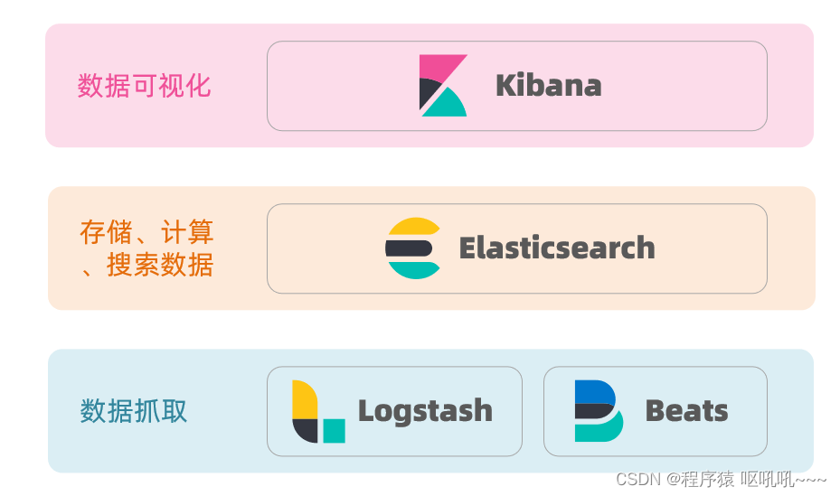

### 3）Lucene

elasticsearch底层是基于**lucene**来实现的。

**Lucene**是一个Java语言的搜索引擎类库，是Apache公司的顶级项目，由DougCutting于1999年研发。官网地址：https://lucene.apache.org/ 。

1）Lucene的优势：

- 易拓展
- 高性能

2）Lucene的缺点：

- 只限于Java语言开发
- 学习曲线陡峭
- 不支持水平拓展

> 相比于Lucene，elasticSearch具备下列优势：
>
> - 支持分布式，可水平拓展
> - 提供Resultful接口，可被任意语言调用

### 4）发展历史

- 2004年Shay Banon基于Lucene开发了Compass

- 2010年Shay Banon 重写了Compass，取名为Elasticsearch。

### 5）elasticsearch VS solr

| 维度              | Elasticsearch        | Solr                           |
| :---------------- | :------------------- | :----------------------------- |
| **设计理念**      | 分布式、实时、云原生 | 功能丰富、配置驱动、传统企业级 |
| **架构模式**      | 天生分布式，内置协调 | SolrCloud + ZooKeeper          |
| **数据格式**      | 仅 JSON              | JSON、XML、CSV 等              |
| **查询接口**      | RESTful JSON DSL     | HTTP + XML/JSON 参数           |
| **实时性**        | 近实时（~1秒延迟）   | 写入时可能阻塞查询             |
| **日志/时序数据** | ✅ 天生适合（ELK 栈） | ❌ 不够优化                     |
| **文本分析**      | 强                   | 更强（40+ 语言、更细粒度控制） |

- Elasticsearch 和 Solr 都是基于 Lucene 的搜索引擎，但设计哲学不同。
- **Elasticsearch 是分布式优先**：天生为云原生、海量数据、实时场景设计。它内置节点发现和协调，不需要 ZooKeeper，API 是 RESTful JSON，对开发者友好。特别适合日志分析（ELK 栈）、实时搜索、应用内搜索。
- **Solr 是功能优先**：作为传统企业级搜索引擎，它功能更丰富——分面搜索更强、文本分析更细粒度、支持多种数据格式。但代价是依赖 ZooKeeper、配置复杂、实时写入性能较差。
- **选型建议**：新项目、日志场景、实时性要求高 → 选 ES；已有 Java 生态、需要精细搜索功能、结构化数据为主 → 选 Solr。两者在电商搜索领域有重叠，但整体趋势是 ES 正在成为主流选择。

> ### ES是如何实现NRT的？
>
> ES 的 NRT 核心由 **refresh** 机制实现，而非 flush。
>
> 写入流程是：文档先写入内存缓冲区和 Translog。默认每秒执行一次 refresh，将缓冲区文档生成新的 Segment，此时数据变得**可搜索**——这就是 NRT 的由来。但此时数据可能还在 OS 缓存中，未真正落盘。
>
> 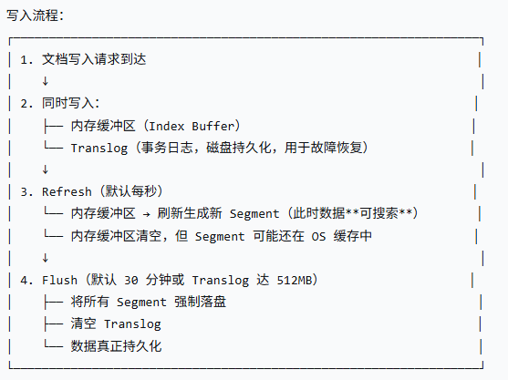
>
> 真正的持久化由 **flush** 完成：默认 30 分钟或 Translog 达到 512MB 时，将 Segment 强制刷盘并清空 Translog。
>
> 所以总结：**refresh 管搜索可见性，flush 管数据持久性**。NRT 的"近"就在这 1 秒的 refresh 间隔。

## 2、倒排索引

倒排索引的概念是基于MySQL这样的正向索引而言的。

### 1）正向索引

那么什么是正向索引呢？例如给下表（tb_goods）中的id创建索引：

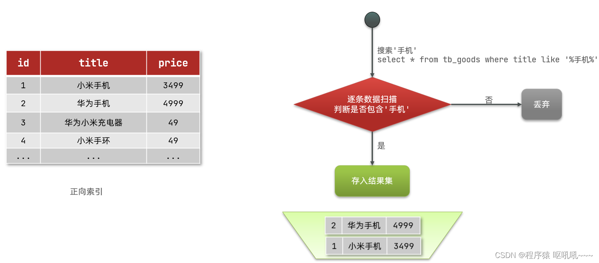

如果是根据id查询，那么直接走索引，查询速度非常快。

但如果是基于title做模糊查询，只能是逐行扫描数据，流程如下：

1）用户搜索数据，条件是title符合"%手机%"

2）逐行获取数据，比如id为1的数据

3）判断数据中的title是否符合用户搜索条件

4）如果符合则放入结果集，不符合则丢弃。回到步骤1

逐行扫描，也就是全表扫描，随着数据量增加，其查询效率也会越来越低。当数据量达到数百万时，就是一场灾难。

### 2）倒排索引

倒排索引中有两个非常重要的概念：

- 文档（Document）：用来搜索的数据，其中的每一条数据就是一个文档。例如一个网页、一个商品信息

- 词条（Term）：对文档数据或用户搜索数据，利用某种算法分词，得到的具备含义的词语就是词条。例如：我是中国人，就可以分为：我、是、中国人、中国、国人这样的几个词条

**创建倒排索引**是对正向索引的一种特殊处理，流程如下：

- 将每一个文档的数据利用算法分词，得到一个个词条

- 创建表，每行数据包括词条、词条所在文档id、位置等信息

- 因为词条唯一性，可以给词条创建索引，例如hash表结构索引

如图：

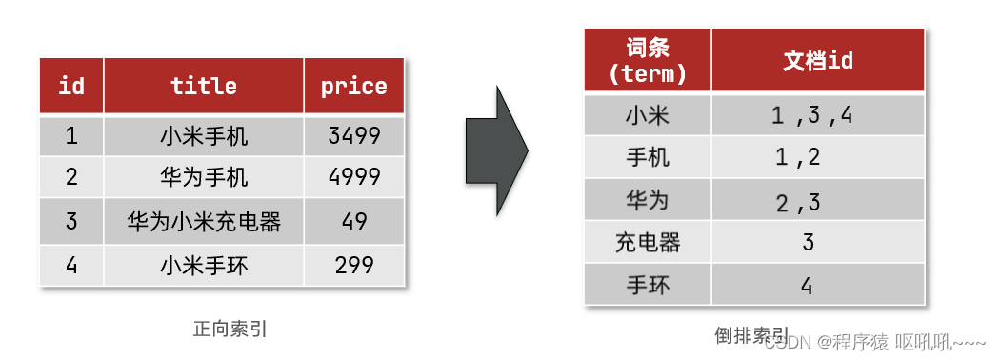

倒排索引的**搜索流程**如下（以搜索"华为手机"为例）：

1）用户输入条件"华为手机"进行搜索。

2）对用户输入内容**分词**，得到词条：华为、手机。

3）拿着词条在倒排索引中查找，可以得到包含词条的文档id：1、2、3。

4）拿着文档id到正向索引中查找具体文档。

如图：

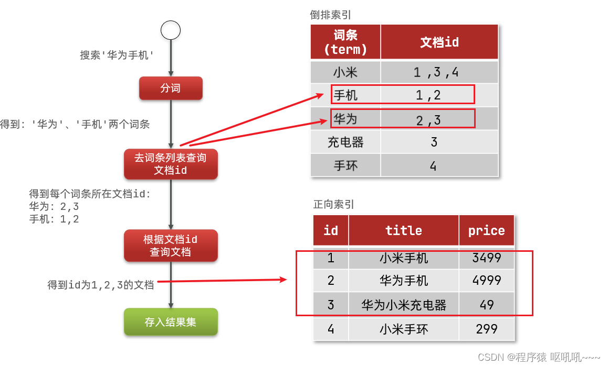

虽然要先查询倒排索引，再查询正向索引，但是无论是词条、还是文档id都建立了索引，查询速度非常快！无需全表扫描。

### 3）正向和倒排

那么为什么一个叫做正向索引，一个叫做倒排索引呢？

- **正向索引**是最传统的，根据id索引的方式。当根据词条查询时，必须先逐条获取每个文档，然后判断文档中是否包含所需要的词条，是**根据文档找词条的过程**。

- 而**倒排索引**则相反，是先找到用户要搜索的词条，根据词条得到保护词条的文档的id，然后根据id获取文档。是**根据词条找文档的过程**。

是不是恰好反过来了？

那么两者方式的优缺点是什么呢？

> **正向索引：**
>
> 优点：
>
> - 可以给多个字段创建索引
>
> - 根据索引字段搜索、排序速度非常快
>
>
> 缺点：
>
> - 根据非索引字段，或者索引字段中的部分词条查找时，只能全表扫描。
>
> **倒排索引**：
>
> 优点：
>
> - 根据词条搜索、模糊搜索时，速度非常快
>
> 缺点：
>
> - 只能给词条创建索引，而不是字段
> - 无法根据字段做排序

### 4）总结

#### 1.1 结构

倒排索引是 ES 实现高性能全文检索的核心。它和正排索引相反，不是用文档去找词，而是用词去找文档。它的核心数据结构由三部分组成：**Term Index**（FST 结构，常驻内存）、**Term Dictionary**（有序的词项字典，存在磁盘）、**Posting List**（文档 ID 列表，包含词频和位置信息）。

当用户搜索一个词时，ES 先在内存的 Term Index 中快速定位到磁盘上的 Term Dictionary 位置，然后读取对应的 Posting List，就能直接拿到匹配的文档 ID 列表，整个过程非常高效。

相比之下，传统关系型数据库的 `LIKE '%xx%'` 需要全表扫描，所以 ES 在全文搜索场景下具有压倒性的性能优势。

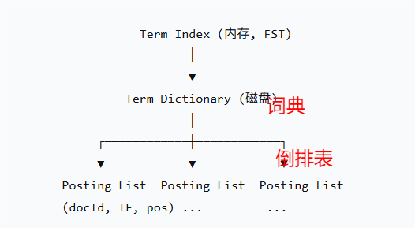

> #### FST是什么？
>
> FST 是 Lucene 实现 Term Index 的核心数据结构，本质是一个**压缩版的字典树**。
>
> 它的核心优势是：**在内存中存储海量的词项前缀信息，并且支持极高的压缩率**。它通过共享公共前缀和后缀，把一个 100GB 的 Term Dictionary 压缩成几百 MB 的 Term Index，常驻内存。
>
> 当用户查询一个词时，ES 先在内存的 FST 中快速定位到该词项在磁盘上的位置（Block 地址），然后只需要一次磁盘 I/O 读取 Term Dictionary 中对应的 Block，再读取 Posting List，就能拿到结果。
>
> 这种 ‘内存 FST + 磁盘 Dictionary’ 的分层设计，是 ES 在有限内存下实现海量数据快速检索的关键。
>
> #### FST 能动态更新吗？
>
> 不能。FST 是不可变结构，一旦构建就不能修改。这和 ES 的 Segment 机制一致——新写入的数据生成新的 Segment 和新的 FST，查询时合并多个 FST 的结果。后台的 Segment Merge 也会重建 FST。

#### 1.2 工作流程

**1. 写入流程（索引阶段）**

`原始文档 → 分词 → 词项列表 → 排序 → 合并相同词项 → 写入倒排索引`

具体步骤：

1. **分词**：将文档内容切分成一个个词项（Token）
2. **处理**：转小写、去停用词、词干提取（running → run）
3. **构建倒排**：为每个词项记录文档ID、位置、频率等信息
4. **写入磁盘**：生成 Segment，每个 Segment 有自己的倒排索引


**2. 查询流程（搜索阶段）**

`查询词 → 分词 → 在 Term Index 中定位 → 在 Term Dictionary 中查找 → 读取 Posting List → 合并结果 → 返回文档`

#### 1.3 原理

倒排索引是 ES 全文搜索的核心，本质是'词到文档'的映射。它采用三层结构：

**Term Index** 在内存中，使用 FST 结构，通过共享前缀压缩，快速定位词项在磁盘上的位置，类似字典的字母索引。

**Term Dictionary** 在磁盘上，是所有词项的有序列表，每个词项指向对应的 Posting List，类似字典的正文。

**Posting List** 在磁盘上，存储文档ID列表、词频、位置信息，用于相关性计算和短语查询，并采用 FOR、Roaring Bitmap 等压缩技术节省空间。

查询时，先在内存的 Term Index 中定位，然后读取磁盘上的 Term Dictionary 获取指针，再读取 Posting List 拿到文档ID列表，最后合并结果并计算相关性得分。

这种设计用极小的内存成本（Term Index）换取了极高的查询性能，是 ES 能在海量数据下实现毫秒级全文检索的根本原因。

## 3、常见概念

elasticsearch中有很多独有的概念，与mysql中略有差别，但也有相似之处。

### 1）文档和字段

elasticsearch是面向**文档（Document）**存储的，可以是数据库中的一条商品数据，一个订单信息。文档数据会被序列化为json格式后存储在elasticsearch中：

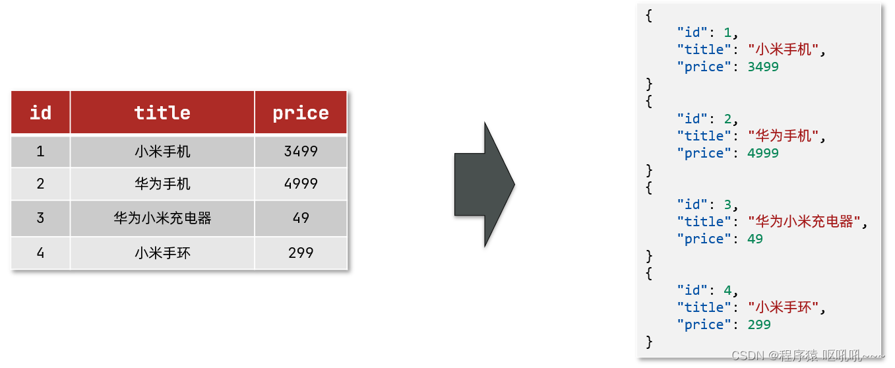

而Json文档中往往包含很多的**字段（Field）**，类似于数据库中的列。

### 2）索引和映射

**索引（Index）**，就是相同类型的文档的集合。

例如：

- 所有用户文档，就可以组织在一起，称为用户的索引；

- 所有商品的文档，可以组织在一起，称为商品的索引；

- 所有订单的文档，可以组织在一起，称为订单的索引；

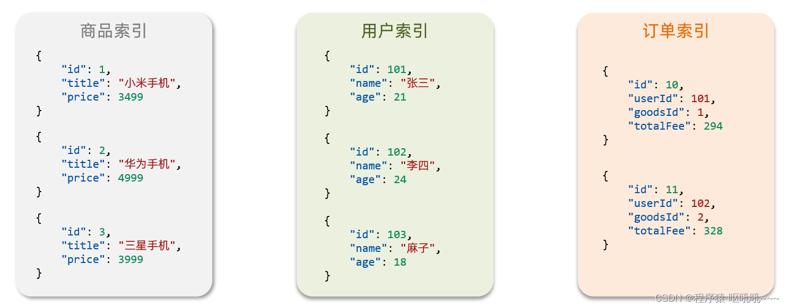

因此，我们可以把索引当做是数据库中的表。

数据库的表会有约束信息，用来定义表的结构、字段的名称、类型等信息。因此，索引库中就有**映射（mapping）**，是索引中文档的字段约束信息，类似表的结构约束。

### 3）mysql与elasticsearch

我们统一的把mysql与elasticsearch的概念做一下对比：

| **MySQL** | **Elasticsearch** | **说明**                                                     |
| --------- | ----------------- | ------------------------------------------------------------ |
| Table     | Index             | 索引(index)，就是文档的集合，类似数据库的表(table)           |
| Row       | Document          | 文档（Document），就是一条条的数据，类似数据库中的行（Row），文档都是JSON格式 |
| Column    | Field             | 字段（Field），就是JSON文档中的字段，类似数据库中的列（Column） |
| Schema    | Mapping           | Mapping（映射）是索引中文档的约束，例如字段类型约束。类似数据库的表结构（Schema） |
| SQL       | DSL               | DSL是elasticsearch提供的JSON风格的请求语句，用来操作elasticsearch，实现CRUD |

是不是说，我们学习了elasticsearch就不再需要mysql了呢？

并不是如此，两者各自有自己的擅长支出：

- Mysql：擅长事务类型操作，可以**确保数据的安全和一致性**

- Elasticsearch：擅长海量数据的**搜索、分析、计算**


因此在企业中，往往是两者结合使用：

- 对安全性要求较高的写操作，使用mysql实现

- 对查询性能要求较高的搜索需求，使用elasticsearch实现


两者再基于某种方式，实现数据的同步，保证一致性

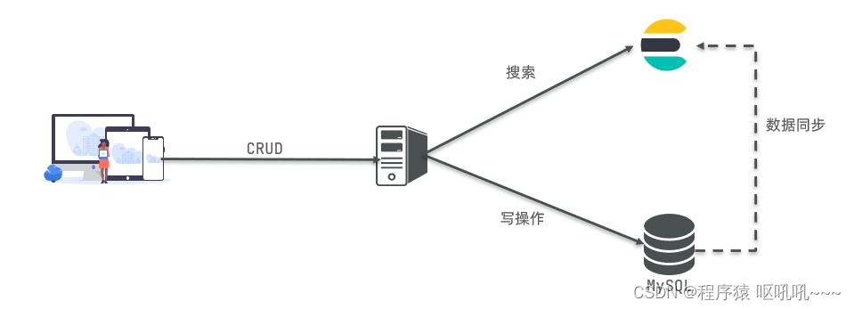

## 4、安装

略

### 1）分词器的作用是什么？

- 创建倒排索引时对文档分词

- 用户搜索时，对输入的内容分词

### 2）IK分词器有几种模式？

- ik_smart：智能切分，粗粒度

- ik_max_word：最细切分，细粒度

### 3）IK分词器如何拓展词条？如何停用词条？

- 利用config目录的IkAnalyzer.cfg.xml文件添加拓展词典和停用词典

- 在词典中添加拓展词条或者停用词条

---


# 二、索引库操作

索引库就类似数据库表，mapping映射就类似表的结构。

我们要向es中存储数据，必须先创建“库”和“表”。

## 1、mapping映射属性

mapping是对索引库中文档的约束，常见的mapping属性包括：

- type：字段数据类型，常见的简单类型有：

  - 字符串：text（可分词的文本）、keyword（精确值，例如：品牌、国家、ip地址）

  - 数值：long、integer、short、byte、double、float、

  - 布尔：boolean

  - 日期：date

  - 对象：object

  - 嵌套：nested
  
  - 输入建议：completion
- index：是否创建索引，默认为true
- analyzer：使用哪种分词器
- properties：该字段的子字段

```json
{
    "age": 21,
    "weight": 52.1,
    "isMarried": false,
    "info": "黑马程序员Java讲师",
    "email": "zy@itcast.cn",
    "score": [99.1, 99.5, 98.9],
    "name": {
        "firstName": "云",
        "lastName": "赵"
    }
}
```

对应的每个字段映射（mapping）：

- age：类型为 integer；参与搜索，因此需要index为true；无需分词器

- weight：类型为float；参与搜索，因此需要index为true；无需分词器

- isMarried：类型为boolean；参与搜索，因此需要index为true；无需分词器

- info：类型为字符串，需要分词，因此是text；参与搜索，因此需要index为true；分词器可以用ik_smart

- email：类型为字符串，但是不需要分词，因此是keyword；不参与搜索，因此需要index为false；无需分词器

- score：虽然是数组，但是我们只看元素的类型，类型为float；参与搜索，因此需要index为true；无需分词器

- name：类型为object，需要定义多个子属性

- name.firstName；类型为字符串，但是不需要分词，因此是keyword；参与搜索，因此需要index为true；无需分词器

- name.lastName；类型为字符串，但是不需要分词，因此是keyword；参与搜索，因此需要index为true；无需分词器

> #### 为什么MySql必须是强Schema，而Es采用的是弱Schema？
>
> 强 Schema 是指数据必须严格按照预定义的结构（字段名、类型、约束）才能写入，MySQL 是典型代表。写入前必须建表，写入时校验，不符合就报错。
>
> 它的优点是**数据质量高、类型安全、存储高效**，缺点是**灵活性差、结构变更成本高**。
>
> ES 默认是弱 Schema（动态映射），写入时自动推断字段类型，新增字段自动添加。这带来了灵活性，但可能引入脏数据。如果业务需要，ES 也支持通过 `dynamic: strict` 开启强 Schema 模式。
>
> 选择哪种取决于场景：业务主数据用强 Schema（MySQL），日志、爬虫等用弱 Schema（ES）。
>
> #### keyword和text的区别
>
> 1）keyword 字段的特点和适用场景：
> - 特点：
>   - 不会被分词器处理。
>   - 适用于精确匹配（term-level queries）。
>   - 适用于聚合（aggregations）、排序（sorting）和去重（deduplication）。
> - 应用场景：用户名、电子邮件地址、IP 地址、标签、分类等不需要进行全文搜索的字段。因为这些字段需要进行精确匹配，比如查找用户名为“john_doe”的所有记录。
>
> 2）text 字段的特点和适用场景：
> - 特点：
>   - 会被分词器处理，通常先被分成多个词（tokens），然后每个词会被单独索引。
>   - 适用于全文检索（full-text search）。
> - 应用场景：文章内容、产品描述、评论等需要进行全文搜索的字段。因为这些字段需要查找包含特定词语或短语的记录，比如查找所有包含“数据科学”这个短语的文章。

## 2、索引库的CRUD

这里我们统一使用Kibana编写DSL的方式来演示。

### 1）创建索引库和映射

**基本语法：**

- 请求方式：PUT

- 请求路径：/索引库名，可以自定义

- 请求参数：mapping映射

格式：

```json
PUT /索引库名称
{
  "mappings": {
    "properties": {
      "字段名":{
        "type": "text",
        "analyzer": "ik_smart"
      },
      "字段名2":{
        "type": "keyword",
        "index": "false"
      },
      "字段名3":{
        "properties": {
          "子字段": {
            "type": "keyword"
          }
        }
      },
      // ...略
    }
  }
}
```

**示例：**

```json
PUT /heima
{
  "mappings": {
    "properties": {
      "info":{
        "type": "text",
        "analyzer": "ik_smart"
      },
      "email":{
        "type": "keyword",
        "index": "falsae"
      },
      "name":{
        "properties": {
          "firstName": {
            "type": "keyword"
          }
        }
      },
      // ... 略
    }
  }
}
```

### 2）查询索引库

**基本语法**：

- 请求方式：GET

- 请求路径：/索引库名

- 请求参数：无

格式：

`GET /索引库名`

示例：

```json
GET /heima
```

### 3）修改索引库

倒排索引结构虽然不复杂，但是一旦数据结构改变（比如改变了分词器），就需要重新创建倒排索引，这简直是灾难。因此索引库**一旦创建，无法修改mapping**。

虽然无法修改mapping中已有的字段，但是却允许添加新的字段到mapping中，因为不会对倒排索引产生影响。

**语法说明**

```json
PUT /索引库名/_mapping
{
  "properties": {
    "新字段名":{
      "type": "integer"
    }
  }
}
```

**示例**

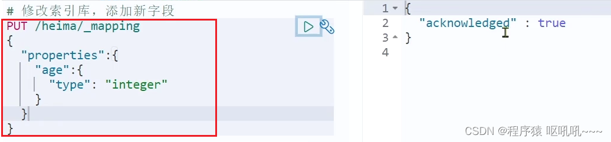

### 4）删除索引库

**语法：**

- 请求方式：DELETE

- 请求路径：/索引库名

- 请求参数：无

**格式：**

`DELETE /索引库名`

## 3、动态映射&静态映射

| 维度                               | 静态映射                                            | 动态映射                         |
| :--------------------------------- | :-------------------------------------------------- | :------------------------------- |
| **定义方式**                       | 手动在 `mappings` 中指定                            | ES 自动推断                      |
| **字段类型**                       | 精确控制（`text`、`keyword`、`integer`、`date` 等） | ES 根据 JSON 类型推测            |
| **`text` 是否有 `keyword` 子字段** | 只有显式定义才有                                    | 默认自动添加（ES 5.x+）          |
| **新增字段**                       | 需手动更新 mappings                                 | 自动添加                         |
| **类型变更**                       | 不可变（需重建索引）                                | 不可变（一旦推断，不能改）       |
| **适用场景**                       | 生产环境、核心业务索引                              | 开发测试、日志、动态字段多的场景 |
| **风险**                           | 需要预先知道字段结构                                | 可能推断错误，导致后续查询异常   |

### 1）静态映射

#### 1. 基本语法

```json
PUT /products
{
  "mappings": {
    "properties": {
      "id": { "type": "integer" },
      "name": { 
        "type": "text",
        "fields": {
          "keyword": { "type": "keyword" }
        }
      },
      "price": { "type": "float" },
      "created_at": { "type": "date" },
      "tags": { "type": "keyword" },
      "description": { "type": "text", "analyzer": "ik_max_word" }
    }
  }
}
```

#### 2. 核心特点

- **精确控制：**明确指定每个字段的类型和属性
- **不可变性：**字段类型一旦创建，
- **不能修改：**（只能新增字段）
- **性能最优：**避免动态推断的开销，索引结构可预测
- **文档清晰：**mappings 本身就是索引的文档说明

#### 3. 局限性

```json
// 如果需要修改字段类型，只能重建索引
POST /_reindex
{
  "source": { "index": "products" },
  "dest": { "index": "products_v2" }
}
```

### 2）动态映射

#### 1. 默认行为

ES 默认开启动态映射，写入文档时自动创建索引和映射：

```json
// 不预先创建索引，直接写入
POST /users/_doc/1
{
  "name": "张三",
  "age": 25,
  "email": "zhangsan@example.com",
  "is_active": true,
  "created_at": "2024-01-15T10:30:00Z"
}
```

#### 2. 类型推断规则

| JSON 类型            | ES 推断的类型                |
| :------------------- | :--------------------------- |
| `null`               | 不添加字段                   |
| `true` / `false`     | `boolean`                    |
| `123`                | `long`                       |
| `123.45`             | `float`                      |
| `"2024-01-15"`       | `date`（如果符合 date 格式） |
| `"hello world"`      | `text` + `keyword` 子字段    |
| `["a", "b"]`         | 根据第一个元素推断           |
| `{ "key": "value" }` | `object`                     |

#### 3. 动态映射的三种模式

通过 `dynamic` 参数控制：

| 值             | 行为                                    | 适用场景                   |
| :------------- | :-------------------------------------- | :------------------------- |
| `true`（默认） | 自动添加新字段                          | 开发测试、字段多变的场景   |
| `false`        | 忽略新字段（不索引，但 _source 中保留） | 生产环境，只索引预定义字段 |
| `strict`       | 遇到新字段**抛出异常**                  | 严格 schema 管控的场景     |

示例：

```json
PUT /users
{
  "mappings": {
    "dynamic": "strict",
    "properties": {
      "name": { "type": "text" }
    }
  }
}

// 写入一个未定义的字段 phone，会报错
POST /users/_doc/1
{
  "name": "张三",
  "phone": "13800000000"   // ❌ 抛出异常
}
```

#### 4. 动态映射模板

可以自定义动态映射规则，覆盖默认行为：

```json
PUT /my_index
{
  "mappings": {
    "dynamic_templates": [
      {
        "strings_as_keyword": {
          "match_mapping_type": "string",
          "mapping": {
            "type": "keyword"      // 所有字符串都映射为 keyword
          }
        }
      },
      {
        "dates_as_date": {
          "match": "*_at",          // 以 _at 结尾的字段映射为 date
          "mapping": {
            "type": "date"
          }
        }
      },
      {
        "integers_as_long": {
          "match_mapping_type": "long",
          "mapping": {
            "type": "long"
          }
        }
      }
    ]
  }
}
```

**常用动态模板场景：**

| 场景                            | 规则                                                         |
| :------------------------------ | :----------------------------------------------------------- |
| 所有字符串存为 `keyword`        | `match_mapping_type: "string"` → `type: "keyword"`           |
| IP 地址自动识别                 | `match: "*_ip"` → `type: "ip"`                               |
| 特定前缀字段用不同分词器        | `match: "content_*"` → `analyzer: "ik_max_word"`             |
| 关闭 `text` 的 `keyword` 子字段 | `match_mapping_type: "string"` → `type: "text"`, `fields` 不设置 |

### 3）总结

ES 的映射分为静态映射和动态映射。

**静态映射**是在创建索引时手动定义字段类型，优点是精确可控、性能可预测，缺点是字段类型一旦创建就不能修改。生产环境的核心业务索引推荐使用静态映射，并设置 `dynamic: strict` 来防止意外字段混入。

**动态映射**是 ES 默认开启的特性，写入文档时自动推断字段类型。它的优点是灵活、快速迭代，适合日志、监控等字段多变的场景。但动态映射也有几个坑：类型推断可能出错、`text` 字段会自动添加 `keyword` 子字段导致存储膨胀、字段数量可能爆炸。

实际生产中，我会根据场景选择：核心业务用静态映射，日志类数据用动态映射 + 动态模板来控制规则。如果需要修改已有字段类型，只能通过 `_reindex` 重建索引。

## 4、索引设计调优

#### 1）分片和副本数量：

合理设置主分片和副本分片的数量，确保集群负载均衡，提高数据的可用性和查询性能。

#### 2）映射类型：

定义合理的映射（Mapping），避免使用动态映射模式，确保字段类型定义明确，减少索引开销。

#### 3）分词和分析器：

选择合适的分词器（Tokenizer）和分析器（Analyzer），避免过度分词，提高搜索精度和效率。

#### 4）字段存储和压缩：

根据查询需求，决定哪些字段需要存储（Stored Fields），并使用合适的压缩算法（如 LZ4）来减少磁盘空间的占用。

#### 5）索引周期和滚动索引：

对于时间序列数据，使用滚动索引策略，定期创建新索引并将旧数据归档，保持索引体积在可控范围内。

#### 6）模板和别名：

使用索引模板（Index Template）和别名（Alias）管理索引的生命周期和访问控制，提高管理效率。

---


# 三、文档操作

## 1、新增文档

**语法**

```json
POST /索引库名/_doc/文档id
{
    "字段1": "值1",
    "字段2": "值2",
    "字段3": {
        "子属性1": "值3",
        "子属性2": "值4"
    },
    // ...
}
```

**示例**

```json
POST /heima/_doc/1
{
    "info": "黑马程序员Java讲师",
    "email": "zy@itcast.cn",
    "name": {
        "firstName": "云",
        "lastName": "赵"
    }
}
```

**响应**

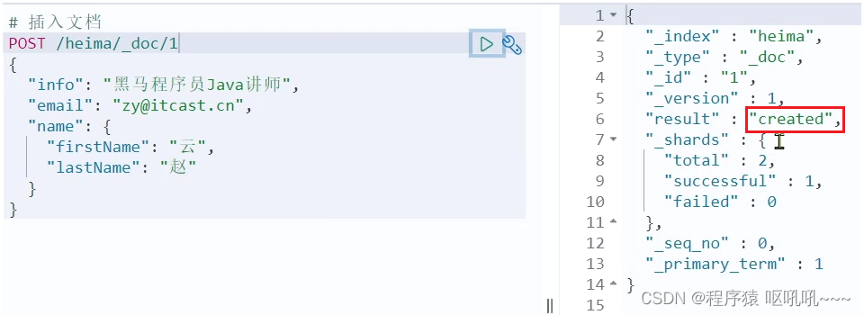


## 2、查询文档

**语法**

`GET /{索引库名称}/_doc/{id}`

**示例**

```json
GET /heima/_doc/1
```

**响应**

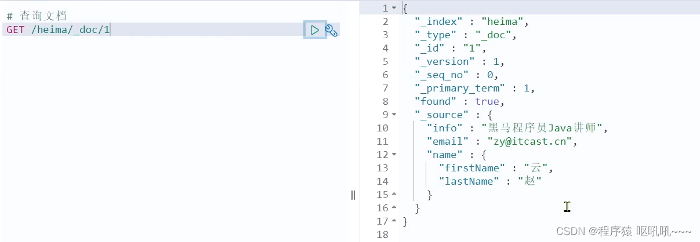

## 3、删除文档

**语法**

```json
DELETE /{索引库名}/_doc/id值
```

**示例**

```json
# 根据id删除数据
DELETE /heima/_doc/1
```

**响应**

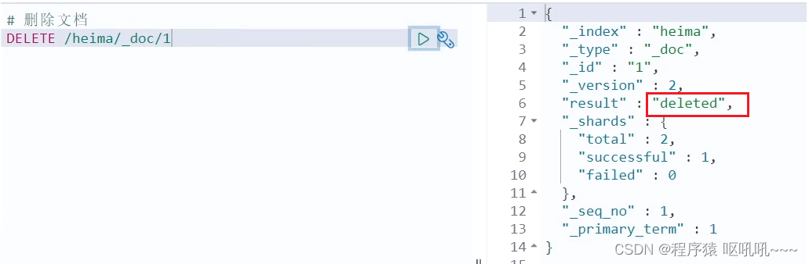

## 4、修改文档

修改有两种方式：

- 全量修改：直接覆盖原来的文档

- 增量修改：修改文档中的部分字段

### 1）全量修改

全量修改是覆盖原来的文档，其本质是：

- 根据指定的id删除文档

- 新增一个相同id的文档

**注意**：如果根据id删除时，id不存在，第二步的新增也会执行，也就从修改变成了新增操作了。

**语法**

```json
PUT /{索引库名}/_doc/文档id
{
    "字段1": "值1",
    "字段2": "值2",
    // ... 略
}
```

**示例**

```json
PUT /heima/_doc/1
{
    "info": "黑马程序员高级Java讲师",
    "email": "zy@itcast.cn",
    "name": {
        "firstName": "云",
        "lastName": "赵"
    }
}
```


### 2）增量修改

增量修改是只修改指定id匹配的文档中的部分字段。

**语法：**

```json
POST /{索引库名}/_update/文档id
{
    "doc": {
         "字段名": "新的值",
    }
}
```

**示例**

```json
POST /heima/_update/1
{
  "doc": {
    "email": "ZhaoYun@itcast.cn"
  }
}
```

---


# 四、RestAPI

1）引入es的RestHighLevelClient依赖

```xml
<dependency>
    <groupId>org.elasticsearch.client</groupId>
    <artifactId>elasticsearch-rest-high-level-client</artifactId>
</dependency>
```

2）初始化RestHighLevelClient：

```java
RestHighLevelClient client = new RestHighLevelClient(RestClient.builder(
        HttpHost.create("http://192.168.150.101:9200")
));
```

## 1、操作索引

### 1）创建索引库

创建索引库的API如下：

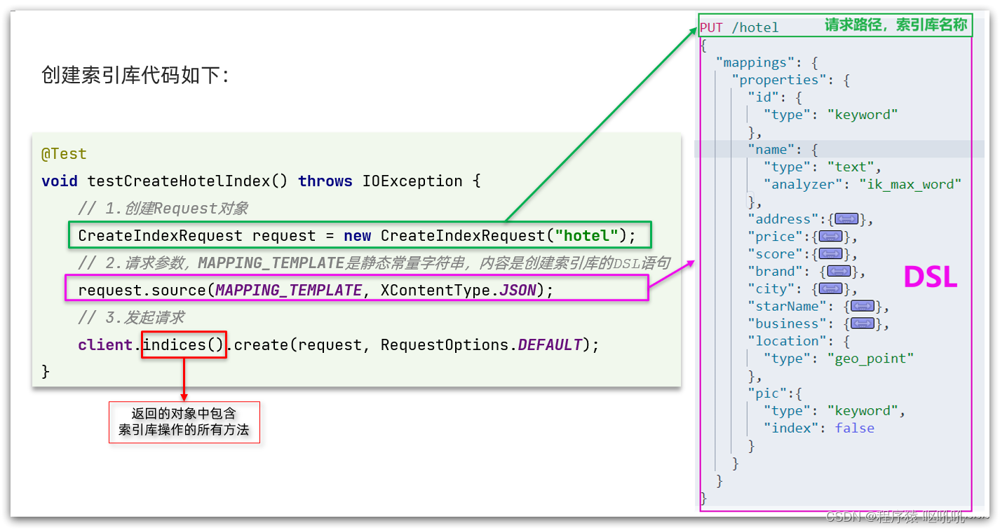

代码分为三步：

- 1）创建Request对象。因为是创建索引库的操作，因此Request是CreateIndexRequest。
- 2）添加请求参数，其实就是DSL的JSON参数部分。因为json字符串很长，这里是定义了静态字符串常量MAPPING_TEMPLATE，让代码看起来更加优雅。

- 3）发送请求，client.indices()方法的返回值是IndicesClient类型，封装了所有与索引库操作有关的方法。

### 2）删除索引库

API如下：

```java
// 1.创建Request对象
DeleteIndexRequest request = new DeleteIndexRequest("hotel");
// 2.发送请求
client.indices().delete(request, RequestOptions.DEFAULT);
```

所以代码的差异，注意体现在Request对象上。依然是三步走：

- 1）创建Request对象。这次是DeleteIndexRequest对象

- 2）准备参数。这里是无参

- 3）发送请求。改用delete方法

### 3）判断索引库是否存在

API如下：

```java
// 1.创建Request对象
GetIndexRequest request = new GetIndexRequest("hotel");
// 2.发送请求
boolean exists = client.indices().exists(request, RequestOptions.DEFAULT);
// 3.输出
System.err.println(exists ? "索引库已经存在！" : "索引库不存在！");
```

本质就是查询，依然是三步走：

- 1）创建Request对象。这次是GetIndexRequest对象

- 2）准备参数。这里是无参

- 3）发送请求。改用exists方法

> **总结**
>
> JavaRestClient操作elasticsearch的流程基本类似。核心是client.indices()方法来获取索引库的操作对象。
>
> 索引库操作的基本步骤：
>
> - 初始化RestHighLevelClient
>
> - 创建XxxIndexRequest。XXX是Create、Get、Delete
>
> - 准备DSL（ Create时需要，其它是无参）
>
> - 发送请求。调用RestHighLevelClient#indices().xxx()方法，xxx是create、exists、delete
>

## 2、操作文档

### 1）新增文档

API如下：

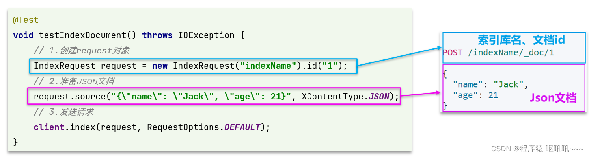

可以看到与创建索引库类似，同样是三步走：

- 1）创建Request对象

- 2）准备请求参数，也就是DSL中的JSON文档

- 3）发送请求

变化的地方在于，这里直接使用client.xxx()的API，不再需要client.indices()了。

### 2）查询文档

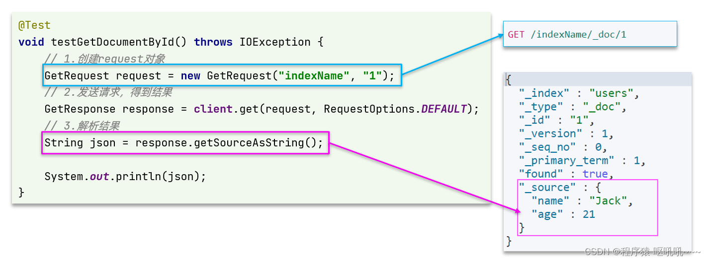

三步走：

- 1）准备Request对象。这次是查询，所以是GetRequest

- 2）发送请求，得到结果。因为是查询，这里调用client.get()方法

- 3）解析结果，就是对JSON做反序列化

### 3）删除文档

```java
// 1.准备Request
DeleteRequest request = new DeleteRequest("hotel", "1");
// 2.发送请求
client.delete(request, RequestOptions.DEFAULT);
```

三步走：

- 1）准备Request对象，因为是删除，这次是DeleteRequest对象。要指定索引库名和id

- 2）准备参数，无参

- 3）发送请求。因为是删除，所以是client.delete()方法

### 4）修改文档

修改我们讲过两种方式：

- 全量修改：本质是先根据id删除，再新增

- 增量修改：修改文档中的指定字段值


在RestClient的API中，全量修改与新增的API完全一致，判断依据是ID：

- 如果新增时，ID已经存在，则修改

- 如果新增时，ID不存在，则新增


这里不再赘述，我们主要关注增量修改。

代码示例如图：

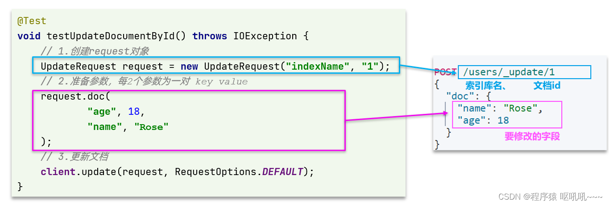

三步走：

- 1）准备Request对象。这次是修改，所以是UpdateRequest

- 2）准备参数。也就是JSON文档，里面包含要修改的字段

- 3）更新文档。这里调用client.update()方法

### 5）批量导入文档

批量处理BulkRequest，其本质就是将多个普通的CRUD请求组合在一起发送。

其中提供了一个add方法，用来添加其他请求：

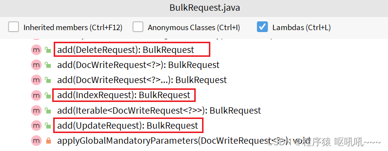

可以看到，能添加的请求包括：

- IndexRequest，也就是新增

- UpdateRequest，也就是修改

- DeleteRequest，也就是删除

因此Bulk中添加了多个IndexRequest，就是批量新增功能了。示例：

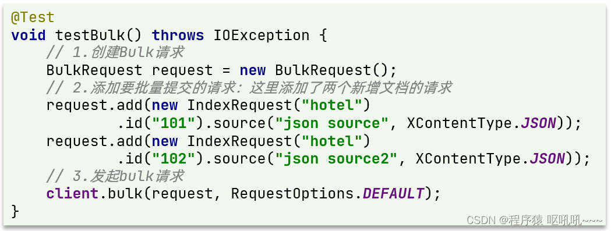

其实还是三步走：

- 1）创建Request对象。这里是BulkRequest

- 2）准备参数。批处理的参数，就是其它Request对象，这里就是多个IndexRequest

- 3）发起请求。这里是批处理，调用的方法为client.bulk()方法

> **小结**
>
> 文档操作的基本步骤：
>
> - 初始化RestHighLevelClient
>
> - 创建XxxRequest。XXX是Index、Get、Update、Delete、Bulk
>
> - 准备参数（Index、Update、Bulk时需要）
>
> - 发送请求。调用RestHighLevelClient#.xxx()方法，xxx是index、get、update、delete、bulk
>
> - 解析结果（Get时需要）

# 五、DSL查询

## 1、DSL查询分类

Elasticsearch提供了基于JSON的DSL（[Domain Specific Language](https://www.elastic.co/guide/en/elasticsearch/reference/current/query-dsl.html)）来定义查询。常见的查询类型包括：

- 查询所有：查询出所有数据，一般测试用。例如：match_all

- 全文检索（full text）查询：利用分词器对用户输入内容分词，然后去倒排索引库中匹配。例如：

  - match_query
  
  
    - multi_match_query
  


- 精确查询：根据精确词条值查找数据，一般是查找keyword、数值、日期、boolean等类型字段。例如：

  - ids
  
  
    - range
  
  
    - term
  
- 通配符查询：查询用于执行通配符模式匹配，`\*` 匹配任意字符序列（包括空），`?` 匹配单个字符。


    - wildcard


- 地理（geo）查询：根据经纬度查询。例如：

  - geo_distance
  
  
    - geo_bounding_box
  


- 复合（compound）查询：复合查询可以将上述各种查询条件组合起来，合并查询条件。例如：

  - bool
  
  
    - function_score
  
- 嵌套查询：存储和查询具有多重层次结构的复杂 JSON 对象


  - nested


查询的语法基本一致：

```json
GET /indexName/_search
{
  "query": {
    "查询类型": {
      "查询条件": "条件值"
    }
  }
}
```

我们以查询所有为例，其中：

- 查询类型为match_all

- 没有查询条件

```json
// 查询所有
GET /indexName/_search
{
  "query": {
    "match_all": {
    }
  }
}
```

其它查询无非就是**查询类型**、**查询条件**的变化。

## 2、全文检索查询

### 1）使用场景

全文检索查询的基本流程如下：

- 对用户搜索的内容做分词，得到词条

- 根据词条去倒排索引库中匹配，得到文档id

- 根据文档id找到文档，返回给用户


比较常用的场景包括：

- 商城的输入框搜索

- 百度输入框搜索

- 因为是拿着词条去匹配，因此参与搜索的字段也必须是可分词的text类型的字段。

### 2）基本语法

常见的全文检索查询包括：

- match查询：单字段查询

- multi_match查询：多字段查询，任意一个字段符合条件就算符合查询条件

match查询语法如下：

```json
GET /indexName/_search
{
  "query": {
    "match": {
      "FIELD": "TEXT"
    }
  }
}
```

mulit_match语法如下：

```json
GET /indexName/_search
{
  "query": {
    "multi_match": {
      "query": "TEXT",
      "fields": ["FIELD1", " FIELD12"]
    }
  }
}
```

### 3）示例

match查询示例：

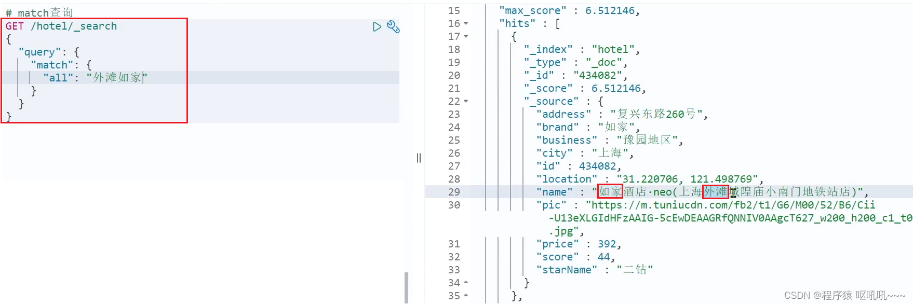

multi_match查询示例：

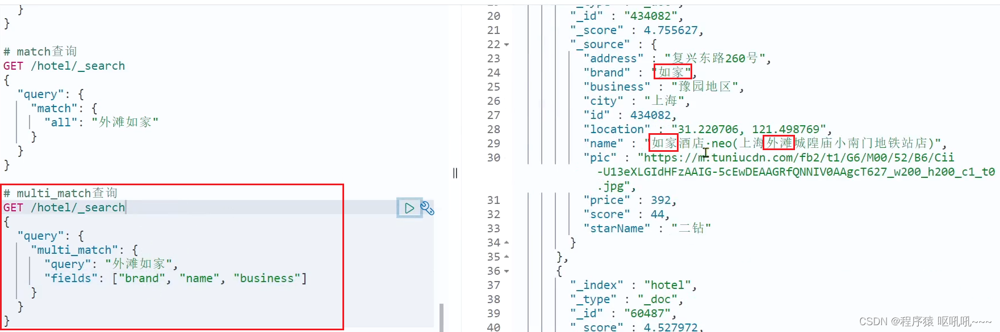

可以看到，两种查询结果是一样的，为什么？

因为将brand、name、business值都利用copy_to复制到了all字段中。因此你根据三个字段搜索，和根据all字段搜索效果当然一样了。

但是，搜索字段越多，对查询性能影响越大，因此建议采用copy_to，然后单字段查询的方式。

### 4）总结

match和multi_match的区别是什么？

- match：根据一个字段查询

- multi_match：根据多个字段查询，参与查询字段越多，查询性能越差

## 3、精准查询

精确查询一般是查找keyword、数值、日期、boolean等类型字段。所以**不会**对搜索条件分词。常见的有：

- term：根据词条精确值查询

- range：根据值的范围查询

### 1）term查询

因为精确查询的字段搜是不分词的字段，因此查询的条件也必须是**不分词**的词条。查询时，用户输入的内容跟自动值完全匹配时才认为符合条件。如果用户输入的内容过多，反而搜索不到数据。

语法说明：

```json
// term查询
GET /indexName/_search
{
  "query": {
    "term": {
      "FIELD": {
        "value": "VALUE"
      }
    }
  }
}
```

示例：

当我搜索的是精确词条时，能正确查询出结果：

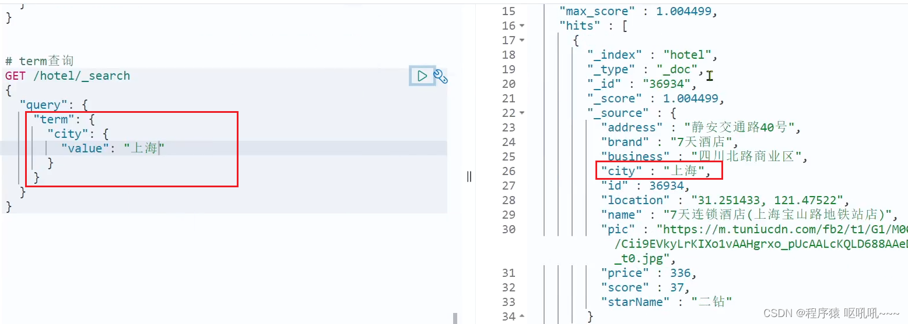

但是，当我搜索的内容不是词条，而是多个词语形成的短语时，反而搜索不到：

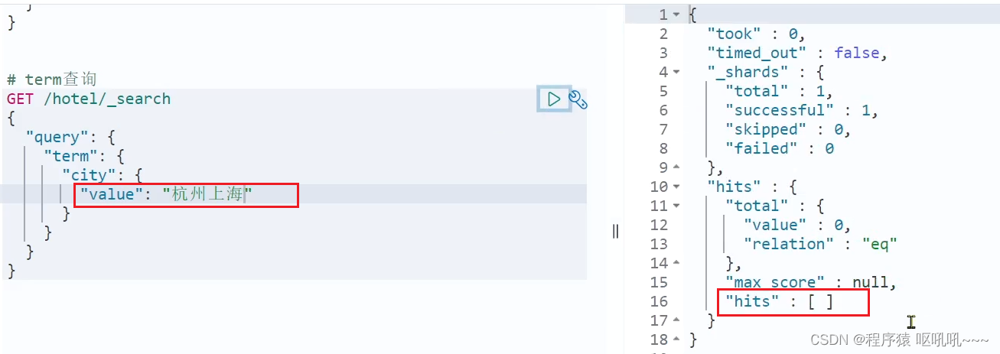


### 2）range查询

范围查询，一般应用在对数值类型做范围过滤的时候。比如做价格范围过滤。

基本语法：

```json
// range查询
GET /indexName/_search
{
  "query": {
    "range": {
      "FIELD": {
        "gte": 10, // 这里的gte代表大于等于，gt则代表大于
        "lte": 20 // lte代表小于等于，lt则代表小于
      }
    }
  }
}
```

示例：

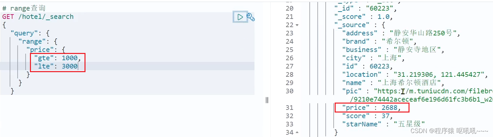

### 3）总结

精确查询常见的有哪些？

- term查询：根据词条精确匹配，一般搜索keyword类型、数值类型、布尔类型、日期类型字段

- range查询：根据数值范围查询，可以是数值、日期的范围

## 4、通配符查询

| 通配符   | 含义                    | 示例     | 匹配结果                     |
| :------- | :---------------------- | :------- | :--------------------------- |
| `*`      | 匹配 0 个或多个任意字符 | `"te*t"` | `"test"`, `"text"`, `"tent"` |
| `?`      | 匹配 1 个任意字符       | `"te?t"` | `"test"`, `"text"`, `"tent"` |
| 组合使用 | 混合使用                | `"t?*t"` | 至少 2 个字符，首尾是 `t`    |

基本语法：

```json
GET /indexName/_search
{
  "query": {
    "wildcard": {
      "name": "XXX*"
    }
  }
}
```

`wildcard` 查询**大小写敏感**，与字段原始存储值一致。

> 通配符查询无法利用倒排索引，需要遍历 Term Dictionary 中的所有词项进行匹配。特别是前缀通配符（如 `*abc`），需要扫描整个字典。
>
> 如果必须使用通配符查询，有几个优化建议：
>
> 1. 尽量使用后缀通配符（`abc*`），可以利用前缀索引
> 2. 使用 ES 8.x 引入的 `wildcard` 字段类型，它针对通配符查询做了专门优化
> 3. 考虑用 n-gram 分词器 + `match` 查询替代
> 4. 设置查询超时，避免慢查询拖垮集群
>
> 实际生产中，我会优先推荐用户使用 `match` 全文搜索或 `prefix` 前缀查询，只有在确实需要灵活通配符匹配时才用 `wildcard`，并且会限制其使用范围和数据量。

## 5、地理坐标查询

所谓的地理坐标查询，其实就是根据经纬度查询，官方文档：https://www.elastic.co/guide/en/elasticsearch/reference/current/geo-queries.html

常见的使用场景包括：

- 携程：搜索我附近的酒店

- 滴滴：搜索我附近的出租车

- 微信：搜索我附近的人

附近的酒店：


附近的车：


### 1）矩形范围查询

矩形范围查询，也就是geo_bounding_box查询，查询坐标落在某个矩形范围的所有文档：


查询时，需要指定矩形的**左上**、**右下**两个点的坐标，然后画出一个矩形，落在该矩形内的都是符合条件的点。

语法如下：

```json
// geo_bounding_box查询
GET /indexName/_search
{
  "query": {
    "geo_bounding_box": {
      "FIELD": {
        "top_left": { // 左上点
          "lat": 31.1,
          "lon": 121.5
        },
        "bottom_right": { // 右下点
          "lat": 30.9,
          "lon": 121.7
        }
      }
    }
  }
}
```

这种并不符合“附近的人”这样的需求，所以我们就不做了。

### 2）附近查询

附近查询，也叫做距离查询（geo_distance）：查询到指定中心点小于某个距离值的所有文档。

换句话来说，在地图上找一个点作为圆心，以指定距离为半径，画一个圆，落在圆内的坐标都算符合条件：


语法说明：

```json
// geo_distance 查询
GET /indexName/_search
{
  "query": {
    "geo_distance": {
      "distance": "15km", // 半径
      "FIELD": "31.21,121.5" // 圆心
    }
  }
}
```

示例：

我们先搜索陆家嘴附近15km的酒店：

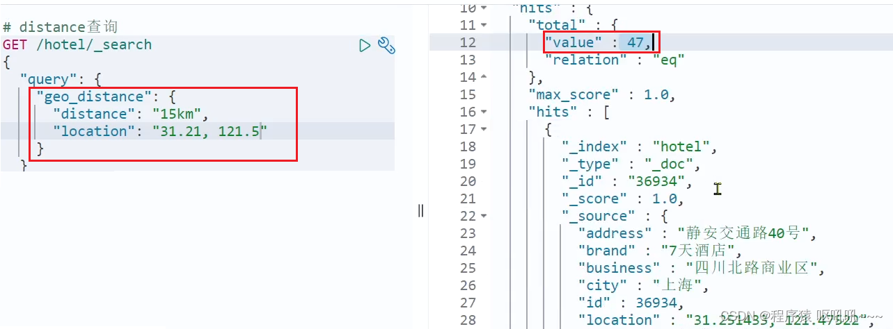

发现共有47家酒店。

然后把半径缩短到3公里：

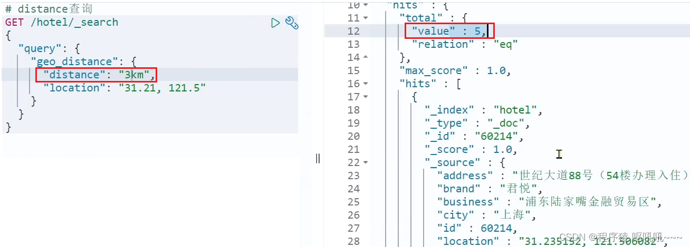

可以发现，搜索到的酒店数量减少到了5家。

## 6、复合查询

复合（compound）查询：复合查询可以将其它简单查询组合起来，实现更复杂的搜索逻辑。常见的有两种：

- fuction score：算分函数查询，可以控制文档相关性算分，控制文档排名

- bool query：布尔查询，利用逻辑关系组合多个其它的查询，实现复杂搜索

### 1）相关性算分

当我们利用match查询时，文档结果会根据与搜索词条的关联度打分（_score），返回结果时按照分值降序排列。

例如，我们搜索 "虹桥如家"，结果如下：

```json
[
  {
    "_score" : 17.850193,
    "_source" : {
      "name" : "虹桥如家酒店真不错",
    }
  },
  {
    "_score" : 12.259849,
    "_source" : {
      "name" : "外滩如家酒店真不错",
    }
  },
  {
    "_score" : 11.91091,
    "_source" : {
      "name" : "迪士尼如家酒店真不错",
    }
  }
]
```

在elasticsearch中，早期使用的打分算法是TF-IDF算法，公式如下：

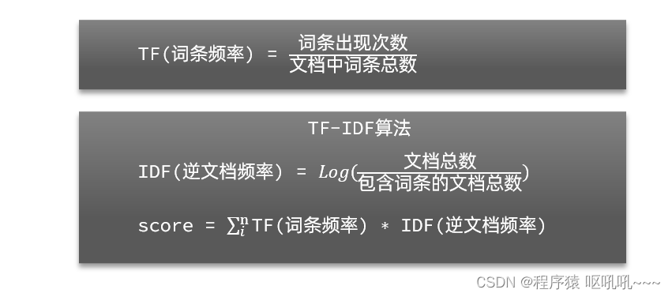

在后来的5.1版本升级中，elasticsearch将算法改进为BM25算法，公式如下：


TF-IDF算法有一各缺陷，就是词条频率越高，文档得分也会越高，单个词条对文档影响较大。而BM25则会让单个词条的算分有一个上限，曲线更加平滑：

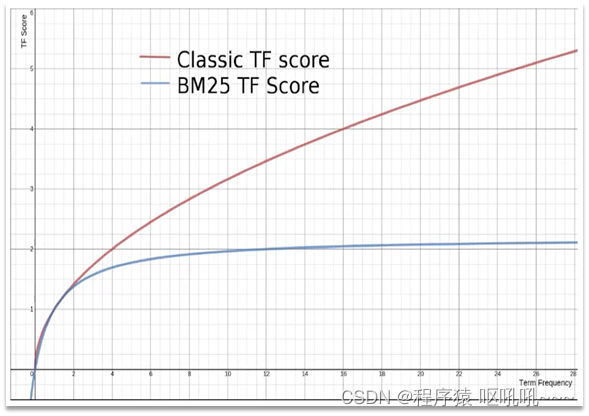

小结：elasticsearch会根据词条和文档的相关度做打分，算法由两种：

- TF-IDF算法

- BM25算法，elasticsearch5.1版本后采用的算法

### 2）算分函数查询

根据相关度打分是比较合理的需求，但**合理的不一定是产品经理需要**的。

以百度为例，你搜索的结果中，并不是相关度越高排名越靠前，而是谁掏的钱多排名就越靠前。如图：


要想人为控制相关性算分，就需要利用elasticsearch中的function score 查询了。

#### 1.1 语法说明

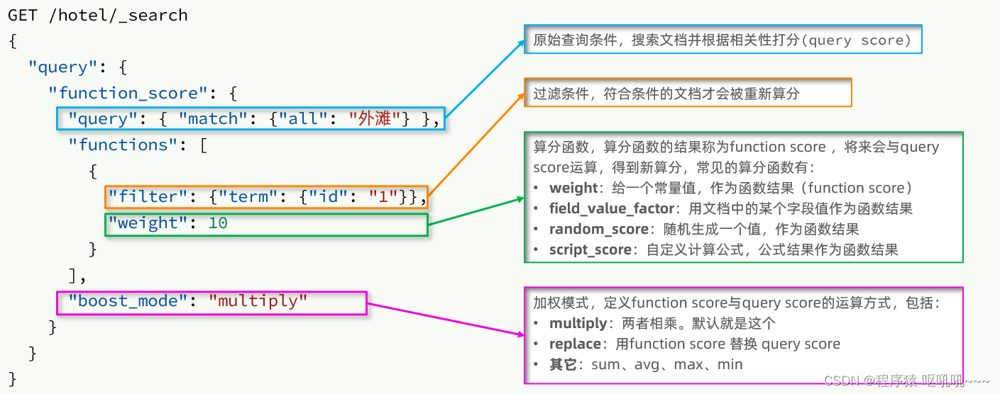

function score 查询中包含四部分内容：

- **原始查询条件：**query部分，基于这个条件搜索文档，并且基于BM25算法给文档打分，原始算分（query score)
- **过滤条件：**filter部分，符合该条件的文档才会重新算分
- **算分函数：**符合filter条件的文档要根据这个函数做运算，得到的函数算分（function score），有四种函数
- **weight：**函数结果是常量
- **field_value_factor：**以文档中的某个字段值作为函数结果
- **random_score：**以随机数作为函数结果
- **script_score：**自定义算分函数算法
- **运算模式：**算分函数的结果、原始查询的相关性算分，两者之间的运算方式，包括：
- **multiply：**相乘
- **replace：**用function score替换query score
- 其它，例如：sum、avg、max、min

function score的运行流程如下：

1）根据原始条件查询搜索文档，并且计算相关性算分，称为原始算分（query score）

2）根据过滤条件，过滤文档

3）符合过滤条件的文档，基于算分函数运算，得到函数算分（function score）

4）将原始算分（query score）和函数算分（function score）基于运算模式做运算，得到最终结果，作为相关性算分

因此，其中的关键点是：

- 过滤条件：决定哪些文档的算分被修改

- 算分函数：决定函数算分的算法

- 运算模式：决定最终算分结果

#### 1.2 示例

需求：给“如家”这个品牌的酒店排名靠前一些

翻译一下这个需求，转换为之前说的四个要点：

- 原始条件：不确定，可以任意变化

- 过滤条件：brand = "如家"

- 算分函数：可以简单粗暴，直接给固定的算分结果，weight

- 运算模式：比如求和


因此最终的DSL语句如下：

```json
GET /hotel/_search
{
  "query": {
    "function_score": {
      "query": {  .... }, // 原始查询，可以是任意条件
      "functions": [ // 算分函数
        {
          "filter": { // 满足的条件，品牌必须是如家
            "term": {
              "brand": "如家"
            }
          },
          "weight": 2 // 算分权重为2
        }
      ],
      "boost_mode": "sum" // 加权模式，求和
    }
  }
}
```

测试，在未添加算分函数时，如家得分如下：

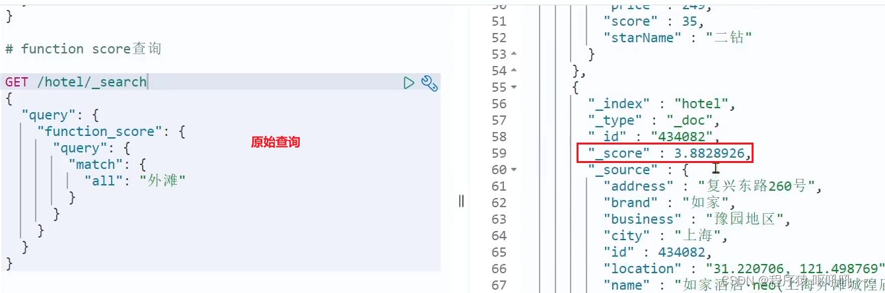

添加了算分函数后，如家得分就提升了：

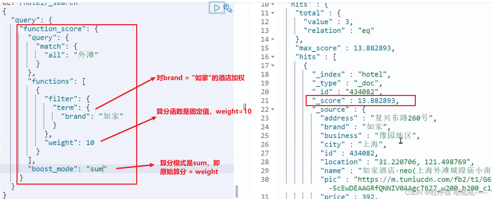

#### 1.3 小结

function score query定义的三要素是什么？

- 过滤条件：哪些文档要加分

- 算分函数：如何计算function score

- 加权方式：function score 与 query score如何运算

### 3）布尔查询

布尔查询是一个或多个查询子句的组合，每一个子句就是一个**子查询**。子查询的组合方式有：

- must：必须匹配每个子查询，类似“与”

- should：选择性匹配子查询，类似“或”

- must_not：必须不匹配，**不参与算分**，类似“非”

- filter：必须匹配，**不参与算分**

比如在搜索酒店时，除了关键字搜索外，我们还可能根据品牌、价格、城市等字段做过滤：


每一个不同的字段，其查询的条件、方式都不一样，必须是多个不同的查询，而要组合这些查询，就必须用bool查询了。

需要注意的是，搜索时，参与打分的字段越多，查询的性能也越差。因此这种多条件查询时，建议这样做：

- 搜索框的关键字搜索，是全文检索查询，使用must查询，参与算分

- 其它过滤条件，采用filter查询。不参与算分

#### 1.1 语法示例

```json
GET /hotel/_search
{
  "query": {
    "bool": {
      "must": [
        {"term": {"city": "上海" }}
      ],
      "should": [
        {"term": {"brand": "皇冠假日" }},
        {"term": {"brand": "华美达" }}
      ],
      "must_not": [
        { "range": { "price": { "lte": 500 } }}
      ],
      "filter": [
        { "range": {"score": { "gte": 45 } }}
      ]
    }
  }
}
```

#### 1.2 示例

需求：搜索名字包含“如家”，价格不高于400，在坐标31.21,121.5周围10km范围内的酒店。

分析：

- 名称搜索，属于全文检索查询，应该参与算分。放到must中

- 价格不高于400，用range查询，属于过滤条件，不参与算分。放到must_not中

- 周围10km范围内，用geo_distance查询，属于过滤条件，不参与算分。放到filter中

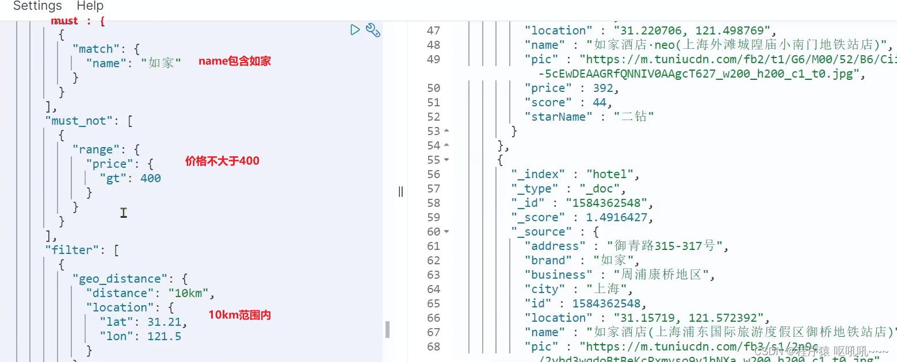

#### 1.3 小结

bool查询有几种逻辑关系？

- must：必须匹配的条件，可以理解为“与”

- should：选择性匹配的条件，可以理解为“或”

- must_not：必须不匹配的条件，不参与打分

- filter：必须匹配的条件，不参与打分

> #### 常见问题

**Q: `match`相当于like，而`term`相当与term对吗？**

`match` 和 `term` 的核心区别在于**是否分析**。

- **`match`** 会对查询词进行分词，然后用分词结果去倒排索引中匹配，适合全文搜索。它**不是** `LIKE`，因为 `LIKE` 做的是通配符匹配，不分词。更准确的类比是 MySQL 的 `MATCH AGAINST`。
- **`term`** 不对查询词做任何分析，直接精确匹配，适合 `keyword` 类型的字段。它的行为类似 SQL 中的 `=`。

一个常见的坑是：对 `text` 字段用 `term` 查询，很可能查不到结果，因为 `text` 字段索引时已经被分成了多个词。反过来，对 `keyword` 字段用 `match`，虽然也能工作（退化为 `term`），但语义上不推荐。

实际开发中，精确匹配用 `term` + `keyword`，全文搜索用 `match` + `text`。

**Q：`match` 和 `match_phrase` 有什么区别？**

> `match` 只要分词结果有匹配即可（词之间可以是任意位置），`match_phrase` 要求分词结果按顺序连续出现。比如搜索 `"华为手机"`，`match` 能匹配 `"华为 5G 手机"`，`match_phrase` 不能。

**Q：`term` 能用于 `text` 字段吗？**

> 能，但几乎不会匹配到，因为 `text` 字段索引时已经分词。除非查询词恰好等于分词后的某个词。比如 `text` 字段存 `"华为手机"`，分词为 `["华为", "手机"]`，`term` 查询 `"华为"` 能匹配，但查询 `"华为手机"` 匹配不到。

**Q：那 `LIKE` 在 ES 里怎么实现？**

> 用 `wildcard` 查询（`keyword` 字段）或 `match_phrase`（`text` 字段）。但 ES 设计上不擅长通配符匹配，性能较差。

## 7、嵌套查询

在 Elasticsearch 中，嵌套类型（Nested Type）字段是一种特殊的数据类型，用来存储复杂的 JSON 对象结构。这种类型与对象类型（Object Type）相似，但其索引方式是不同的。Nested 类型字段在索引时会将每个子文档单独索引，从而保证查询时关联特性能够正确工作。

使用 Nested 类型字段时，可以在查询中进行高效的嵌套查询（nested query），确保嵌套文档的相关性得到正确处理。适用场景包括需要存储和查询具有多重层次结构的复杂 JSON 对象，例如商品属性、用户评论等。

### 1）基本用法

1. 索引创建

```json
//在创建索引时可以定义嵌套类型字段。例如，有以下商品信息需要存储，每个商品有多个不同的属性：
PUT /my_index
{
  "mappings": {
    "properties": {
      "product": {
        "type": "nested", 
        "properties": {
          "name": { "type": "keyword" },
          "attributes": { 
            "type": "nested",
            "properties": {
              "color": { "type": "keyword" },
              "size": { "type": "keyword" }
            }
          }
        }
      }
    }
  }
}
```

2. 嵌套查询

```json
GET /my_index/_search
{
  "query": {
    "nested": {
      "path": "product.attributes",
      "query": {
        "bool": {
          "must": [
            { "match": { "product.attributes.color": "red" } },
            { "match": { "product.attributes.size": "large" } }
          ]
        }
      }
    }
  }
}
```

### 2）使用场景

- 复杂对象的存储和查询：比如电商系统中的商品，具有多层次的属性结构。
- 日志系统：一个日志记录可能包含多个来源信息或事件，每个信息和事件同样具有多个字段。
- 用户评论和评级系统：每个用户的评论和评级分别是一个独立的嵌套结构。

### 4）性能考虑

由于每个嵌套文档被单独索引，所以在写入时的性能相对而言可能会受到一些影响，但查询的准确性大幅提升。因此，使用嵌套类型时需要权衡写入性能和查询准确性。

## 8、建议查询

Completion Suggester 是 Elasticsearch 专门为**自动补全（Auto-Complete）**功能设计的建议器，它在内存中构建一个名为 **FST（Finite State Transducer）** 的紧凑数据结构，查询速度极快（毫秒级），非常适合实时搜索场景

### 1）核心特点

| 特点           | 说明                                    |
| :------------- | :-------------------------------------- |
| **速度快**     | 基于内存 FST 前缀查找，不是倒排索引扫描 |
| **模糊匹配**   | 支持 `fuzzy` 参数处理拼写错误           |
| **权重排序**   | 支持 `weight` 字段控制热门结果排前面    |
| **上下文过滤** | 支持按类别、语言等过滤建议              |

### 2）使用步骤

1. 创建索引，定义 `completion` 字段

```json
PUT /products
{
  "mappings": {
    "properties": {
      "suggest": { "type": "completion" }
    }
  }
}
```

2. 写入数据

```json
// 简单写法
POST /products/_doc/1
{ "suggest": "手机壳" }

// 带权重和多个输入
POST /products/_doc/2
{
  "suggest": {
    "input": ["小米手机", "小米 14 Pro"],
    "weight": 10
  }
}
```

3. 查询

```json
GET /products/_search
{
  "suggest": {
    "my_suggest": {
      "prefix": "手机",
      "completion": { "field": "suggest", "size": 5 }
    }
  }
}
```

### 3）高级功能

1. 模糊匹配（处理拼写错误）

```json
//效果："小来" 仍然能匹配到 "小米手机壳"。
GET /products/_search
{
  "suggest": {
    "my_suggest": {
      "prefix": "小来",
      "completion": {
        "field": "suggest",
        "fuzzy": 
          { 
              "fuzziness": 1,        // 允许 1 个字符的编辑距离
          	  "prefix_length": 1     // 前 1 个字符必须精确匹配
          }			
      }
    }
  }
}
```

2. 上下文过滤（按类别筛选）

```json
// 创建索引时定义上下文
PUT /products
{
  "mappings": {
    "properties": {
      "suggest": {
        "type": "completion",
        "contexts": [
          {
            "name": "category",
            "type": "category"
          }
        ]
      }
    }
  }
}

// 写入带上下文的数据
POST /products/_doc/6
{
  "name": "小米 14 Pro",
  "suggest": {
    "input": ["小米 14 Pro", "小米手机"],
    "contexts": {
      "category": "手机"       // 上下文值
    }
  },
  "price": 3999
}

// 查询时指定上下文
GET /products/_search
{
  "suggest": {
    "product_suggest": {
      "prefix": "小米",
      "completion": {
        "field": "suggest",
        "contexts": {
          "category": "手机"    // 只建议 category 为 "手机" 的
        }
      }
    }
  }
}
```

### 4）性能优化建议

| 优化点       | 建议                                               |
| :----------- | :------------------------------------------------- |
| **字段类型** | 使用 `completion` 类型，不要用 `text` 或 `keyword` |
| **索引大小** | 建议数据量在几百万条以内（FST 内存占用可控）       |
| **权重设置** | 热点商品设置更高权重，提升转化                     |
| **模糊匹配** | `fuzziness` 不要超过 2，`prefix_length` 至少为 1   |
| **上下文**   | 合理使用上下文减少候选集                           |
| **缓存**     | Completion Suggester 默认缓存，重复查询很快        |

---


# 六、搜索结果处理

搜索的结果可以按照用户指定的方式去处理或展示。

## 1、排序

elasticsearch默认是根据相关度算分（_score）来排序，但是也支持自定义方式对搜索[结果排序](https://www.elastic.co/guide/en/elasticsearch/reference/current/sort-search-results.html)。可以排序字段类型有：keyword类型、数值类型、地理坐标类型、日期类型等。

### 1）普通字段排序

keyword、数值、日期类型排序的语法基本一致。

**语法**

```json
GET /indexName/_search
{
  "query": {
    "match_all": {}
  },
  "sort": [
    {
      "FIELD": "desc"  // 排序字段、排序方式ASC、DESC
    }
  ]
}
```

排序条件是一个数组，也就是可以写多个排序条件。按照声明的顺序，当第一个条件相等时，再按照第二个条件排序，以此类推。

**示例**

需求描述：酒店数据按照用户评价（score)降序排序，评价相同的按照价格(price)升序排序


### 2）地理坐标排序

地理坐标排序略有不同。

**语法说明**：

```json
GET /indexName/_search
{
  "query": {
    "match_all": {}
  },
  "sort": [
    {
      "_geo_distance" : {
          "FIELD" : "纬度，经度", // 文档中geo_point类型的字段名、目标坐标点
          "order" : "asc", // 排序方式
          "unit" : "km" // 排序的距离单位
      }
    }
  ]
}
```

这个查询的含义是：

- 指定一个坐标，作为目标点

- 计算每一个文档中，指定字段（必须是geo_point类型）的坐标 到目标点的距离是多少

- 根据距离排序

**示例**

需求描述：实现对酒店数据按照到你的位置坐标的距离升序排序

提示：获取你的位置的经纬度的方式：https://lbs.amap.com/demo/jsapi-v2/example/map/click-to-get-lnglat/

假设我的位置是：31.034661，121.612282，寻找我周围距离最近的酒店。

## 2、分页

elasticsearch 默认情况下只返回top10的数据。而如果要查询更多数据就需要修改分页参数了。elasticsearch中通过修改from、size参数来控制要返回的分页结果：

- from：从第几个文档开始

- size：总共查询几个文档

类似于mysql中的limit ?, ?

### 1）基本的分页

分页的基本语法如下：

```json
GET /hotel/_search
{
  "query": {
    "match_all": {}
  },
  "from": 0, // 分页开始的位置，默认为0
  "size": 10, // 期望获取的文档总数
  "sort": [
    {"price": "asc"}
  ]
}
```

### 2）深度分页问题

现在，我要查询990~1000的数据，查询逻辑要这么写：

```json
GET /hotel/_search
{
  "query": {
    "match_all": {}
  },
  "from": 990, // 分页开始的位置，默认为0
  "size": 10, // 期望获取的文档总数
  "sort": [
    {"price": "asc"}
  ]
}
```

这里是查询990开始的数据，也就是 第990~第1000条 数据。

不过，elasticsearch内部分页时，必须先查询 0~1000条，然后截取其中的990 ~ 1000的这10条：


查询TOP1000，如果es是单点模式，这并无太大影响。

但是elasticsearch将来一定是集群，例如我集群有5个节点，我要查询TOP1000的数据，并不是每个节点查询200条就可以了。(ES是分片存储的方式)

因为节点A的TOP200，在另一个节点可能排到10000名以外了。

因此要想获取整个集群的TOP1000，必须先查询出每个节点的TOP1000，汇总结果后，重新排名，重新截取TOP1000。

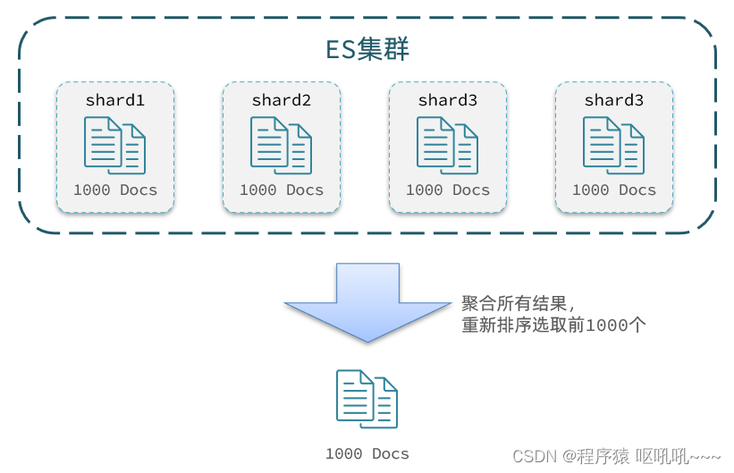

那如果我要查询9900~10000的数据呢？是不是要先查询TOP10000呢？那每个节点都要查询10000条？汇总到内存中？

当查询分页深度较大时，汇总数据过多，对内存和CPU会产生非常大的压力，因此elasticsearch会禁止from+ size 超过10000的请求。

针对深度分页，ES提供了两种解决方案，官方文档：

- search after：分页时需要排序，原理是从上一次的排序值开始，查询下一页数据。官方推荐使用的方式。

- scroll：原理将排序后的文档id形成快照，保存在内存。官方已经不推荐使用。

[你了解elasticsearch深度分页的问题吗？](/notes/database/ElasticSearch深度分页)


### 4）分页总结

分页查询的常见实现方案以及优缺点：

from + size：

- 原理：
  - 标准的分页方式，类似 SQL 的 `LIMIT offset, limit`
  - 每个分片都要把 `from + size` 条数据取出来，传给协调节点
  - 协调节点对所有分片的数据进行全局排序，丢弃前 `from` 条，返回最后 `size` 条

- 优点：支持随机翻页

- 缺点：深度分页问题，默认查询上限（from + size）是10000

- 场景：百度、京东、谷歌、淘宝这样的随机翻页搜索

after search：

- 原理：
  - 每次查询必须指定 `sort` 字段（通常加 `_id` 保证唯一性）
  - 第一页正常查询，返回结果中会包含每条文档的 `sort` 值
  - 下一页请求带上上一页最后一条文档的 `sort` 值（`search_after` 参数）
  - ES 直接从该位置开始取后面 `size` 条数据，无需处理前面的数据

- 优点：没有查询上限（单次查询的size不超过10000）

- 缺点：只能向后逐页查询，不支持随机翻页

- 场景：没有随机翻页需求的搜索，例如手机向下滚动翻页

scroll：

- 原理：
  - 第一次请求时，ES 生成一个**数据快照**（冻结那一刻的索引状态），并返回一个 `scroll_id`
  - 后续请求带上 `scroll_id`，ES 从快照中读取数据，而不是从实时索引中读取
  - 快照期间发生的增删改查不会被反映到 scroll 查询结果中

- 优点：没有查询上限（单次查询的size不超过10000）

- 缺点：会有额外内存消耗，并且搜索结果是非实时的

- 场景：海量数据的获取和迁移。从ES7.1开始不推荐，建议用 after search方案。

> **ES 提供了三种分页方式，各有不同的设计目标和适用场景。**
>
> **`from + size`** 是最简单的方式，支持随机跳页，但存在深度分页问题。当 `from` 很大时，每个分片需要取 `from+size` 条数据到协调节点做全局排序，性能线性下降。ES 默认限制 `max_result_window=10000` 就是为了防止这个问题。适合浅分页场景，比如用户只翻前几页。
>
> **`search after`** 是官方推荐的深度分页方案。它通过记录上一页最后一条文档的排序值，下一页直接从那个位置往后取。每个分片只取 `size` 条数据，性能恒定。缺点是不支持随机跳页，只能顺序翻页。适合移动端滚动加载、后台管理系统的下一页功能。
>
> **`scroll`** 基于快照机制，适合大批量数据导出和数据迁移，不是给用户交互用的。它需要额外内存来保存搜索上下文，并且查询结果是非实时的。ES 7.1 之后官方已不推荐用 scroll 做分页，建议用 `search_after` 替代。

## 3、高亮

### 1）高亮原理

什么是高亮显示呢？

我们在百度，京东搜索时，关键字会变成红色，比较醒目，这叫高亮显示：

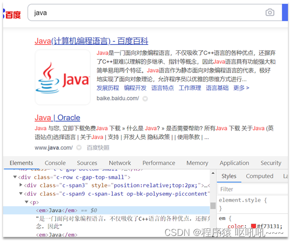

高亮显示的实现分为两步：

- 1）给文档中的所有关键字都添加一个标签，例如<em>标签

- 2）页面给<em>标签编写CSS样式

### 2）实现高亮

高亮的语法：

```json
GET /hotel/_search
{
  "query": {
    "match": {
      "FIELD": "TEXT" // 查询条件，高亮一定要使用全文检索查询
    }
  },
  "highlight": {
    "fields": { // 指定要高亮的字段
      "FIELD": {
        "pre_tags": "<em>",  // 用来标记高亮字段的前置标签
        "post_tags": "</em>" // 用来标记高亮字段的后置标签
      }
    }
  }
}
```

**注意**

- 高亮是对关键字高亮，因此**搜索条件必须带有关键字**，而不能是范围这样的查询。

- 默认情况下，**高亮的字段，必须与搜索指定的字段一致**，否则无法高亮

- 如果要对非搜索字段高亮，则需要添加一个属性：required_field_match=false

**示例**

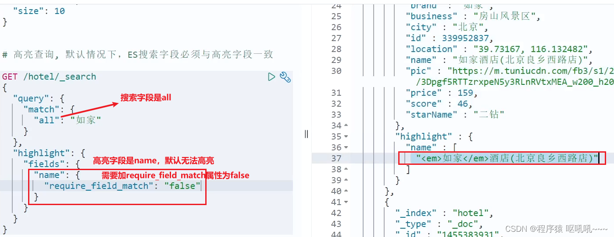

## 4、聚合

**聚合（aggregations）：**可以让我们极其方便的实现对数据的统计、分析、运算。例如：

- 什么品牌的手机最受欢迎？

- 这些手机的平均价格、最高价格、最低价格？

- 这些手机每月的销售情况如何？

实现这些统计功能的比数据库的sql要方便的多，而且查询速度非常快，可以实现近实时搜索效果。

### 1）聚合的种类

聚合常见的有三类：

- **桶（Bucket）**聚合：用来对文档做分组
  - TermAggregation：按照文档字段值分组，例如按照品牌值分组、按照国家分组

  - Date Histogram：按照日期阶梯分组，例如一周为一组，或者一月为一组

- **度量（Metric）**聚合：用以计算一些值，比如：最大值、最小值、平均值等
  - Avg：求平均值
  
  - Max：求最大值
  
  - Min：求最小值
  
  - Stats：同时求max、min、avg、sum等
  
- **管道（pipeline）**聚合：其它聚合的结果为基础做聚合

> **注意：**参加聚合的字段必须是keyword、日期、数值、布尔类型

### 2）Bucket聚合语法

语法如下：

```json
GET /hotel/_search
{
  "size": 0,  // 设置size为0，结果中不包含文档，只包含聚合结果
  "aggs": { // 定义聚合
    "brandAgg": { //给聚合起个名字
      "terms": { // 聚合的类型，按照品牌值聚合，所以选择term
        "field": "brand", // 参与聚合的字段
        "size": 20 // 希望获取的聚合结果数量
      }
    }
  }
}
```

结果如图：

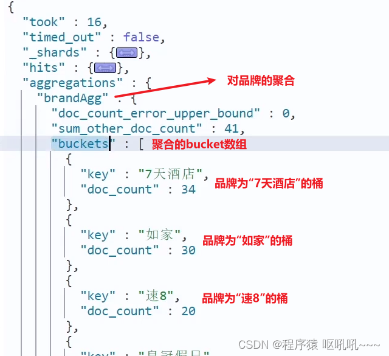

### 3）聚合结果排序

默认情况下，Bucket聚合会统计Bucket内的文档数量，记为_count，并且按照_count降序排序。

我们可以指定order属性，自定义聚合的排序方式：

```json
GET /hotel/_search
{
  "size": 0, 
  "aggs": {
    "brandAgg": {
      "terms": {
        "field": "brand",
        "order": {
          "_count": "asc" // 按照_count升序排列
        },
        "size": 20
      }
    }
  }
}
```

### 4）限定聚合范围

默认情况下，Bucket聚合是对索引库的所有文档做聚合，但真实场景下，用户会输入搜索条件，因此聚合必须是对搜索结果聚合。那么聚合必须添加限定条件。

我们可以限定要聚合的文档范围，只要添加query条件即可：

```json
GET /hotel/_search
{
  "query": {
    "range": {
      "price": {
        "lte": 200 // 只对200元以下的文档聚合
      }
    }
  }, 
  "size": 0, 
  "aggs": {
    "brandAgg": {
      "terms": {
        "field": "brand",
        "size": 20
      }
    }
  }
}
```

这次，聚合得到的品牌明显变少了：

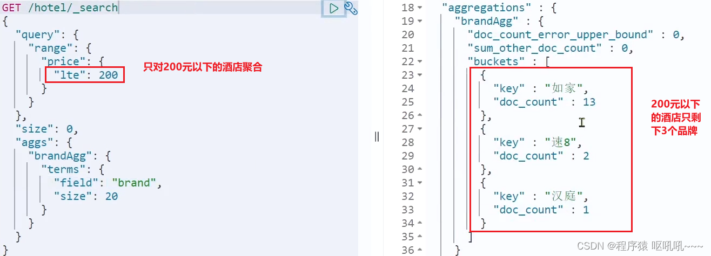

### 5）Metric聚合语法

上节课，我们对酒店按照品牌分组，形成了一个个桶。现在我们需要对桶内的酒店做运算，获取每个品牌的用户评分的min、max、avg等值。

这就要用到Metric聚合了，例如stat聚合：就可以获取min、max、avg等结果。

语法如下：

```json
GET /hotel/_search
{
  "size": 0, 
  "aggs": {
    "brandAgg": { 
      "terms": { 
        "field": "brand", 
        "size": 20
      },
      "aggs": { // 是brands聚合的子聚合，也就是分组后对每组分别计算
        "score_stats": { // 聚合名称
          "stats": { // 聚合类型，这里stats可以计算min、max、avg等
            "field": "score" // 聚合字段，这里是score
          }
        }
      }
    }
  }
}
```

这次的score_stats聚合是在brandAgg的聚合内部嵌套的子聚合。因为我们需要在每个桶分别计算。

另外，我们还可以给聚合结果做个排序，例如按照每个桶的酒店平均分做排序：

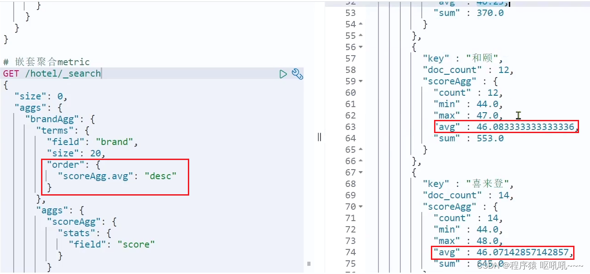

## 总结

查询的DSL是一个大的JSON对象，包含下列属性：

- query：查询条件
- from和size：分页条件
- sort：排序条件
- highlight：高亮条件
- aggs：聚合
  - 聚合必须的三要素：聚合名称、聚合类型、聚合字段；
  - 聚合可配置属性：
    - size：指定聚合结果数量
    - order：指定聚合结果排序方式
    - field：指定聚合字段


示例：

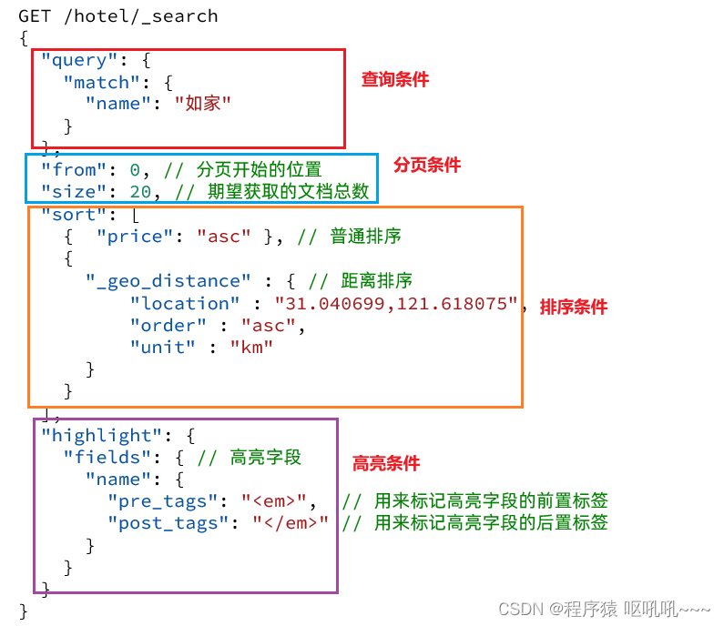

---

# 七、RestClient查询文档

文档的查询同样适用昨天学习的 RestHighLevelClient对象，基本步骤包括：

- 1）准备Request对象

- 2）准备请求参数

- 3）发起请求

- 4）解析响应

## 1、快速入门

我们以match_all查询为例

### 1）发起查询请求

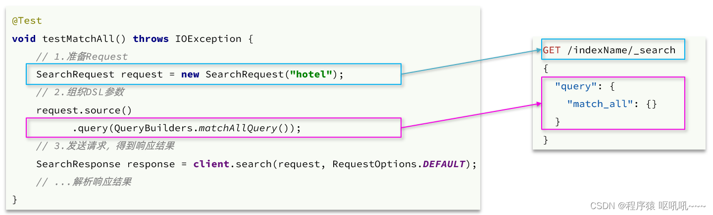

代码解读：

- 第一步，创建SearchRequest对象，指定索引库名

- 第二步，利用request.source()构建DSL，DSL中可以包含查询、分页、排序、高亮等

- query()：代表查询条件，利用QueryBuilders.matchAllQuery()构建一个match_all查询的DSL

- 第三步，利用client.search()发送请求，得到响应

这里关键的API有两个，一个是request.source()，其中包含了查询、排序、分页、高亮等所有功能：

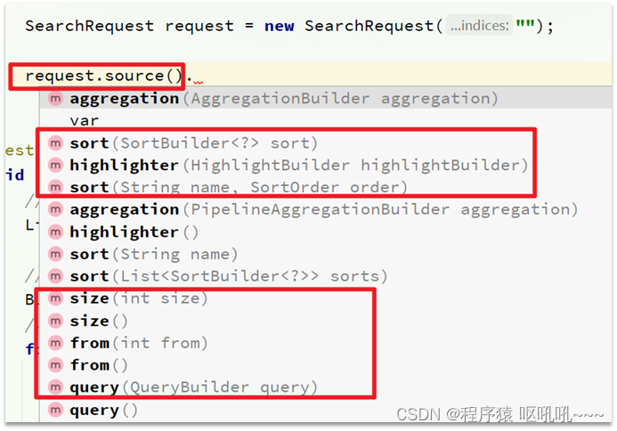

另一个是QueryBuilders，其中包含match、term、function_score、bool等各种查询：

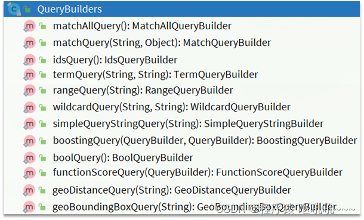

### 2）解析响应

响应结果的解析：

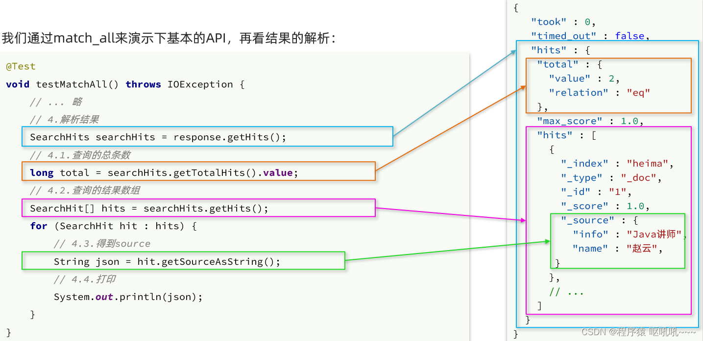

elasticsearch返回的结果是一个JSON字符串，结构包含：

- hits：命中的结果

  - total：总条数，其中的value是具体的总条数值

  - max_score：所有结果中得分最高的文档的相关性算分

  - hits：搜索结果的文档数组，其中的每个文档都是一个json对象
    - _source：文档中的原始数据，也是json对象

因此，我们解析响应结果，就是逐层解析JSON字符串，流程如下：

- SearchHits：通过response.getHits()获取，就是JSON中的最外层的hits，代表命中的结果

  - SearchHits#getTotalHits().value：获取总条数信息

  - SearchHits#getHits()：获取SearchHit数组，也就是文档数组

    - SearchHit#getSourceAsString()：获取文档结果中的_source，也就是原始的json文档数据


### 3）完整代码

完整代码如下：

```java
@Test
void testMatchAll() throws IOException {
    // 1.准备Request
    SearchRequest request = new SearchRequest("hotel");
    // 2.准备DSL
    request.source()
        .query(QueryBuilders.matchAllQuery());
    // 3.发送请求
    SearchResponse response = client.search(request, RequestOptions.DEFAULT);
 
    // 4.解析响应
    handleResponse(response);
}
 
private void handleResponse(SearchResponse response) {
    // 4.解析响应
    SearchHits searchHits = response.getHits();
    // 4.1.获取总条数
    long total = searchHits.getTotalHits().value;
    System.out.println("共搜索到" + total + "条数据");
    // 4.2.文档数组
    SearchHit[] hits = searchHits.getHits();
    // 4.3.遍历
    for (SearchHit hit : hits) {
        // 获取文档source
        String json = hit.getSourceAsString();
        // 反序列化
        HotelDoc hotelDoc = JSON.parseObject(json, HotelDoc.class);
        System.out.println("hotelDoc = " + hotelDoc);
    }
}
```

### 4）总结

查询的基本步骤是：

1. 创建SearchRequest对象

2. 准备Request.source()，也就是DSL。


- ① QueryBuilders来构建查询条件

- ② 传入Request.source() 的 query() 方法


3. 发送请求，得到结果

4. 解析结果（参考JSON结果，从外到内，逐层解析）

## 2、match查询

全文检索的match和multi_match查询与match_all的API基本一致。差别是查询条件，也就是query的部分。

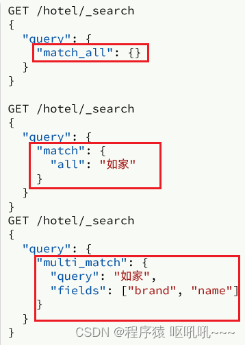

因此，Java代码上的差异主要是request.source().query()中的参数了。同样是利用QueryBuilders提供的方法：


而结果解析代码则完全一致，可以抽取并共享。

完整代码如下：

```java
@Test
void testMatch() throws IOException {
    // 1.准备Request
    SearchRequest request = new SearchRequest("hotel");
    // 2.准备DSL
    request.source()
        .query(QueryBuilders.matchQuery("all", "如家"));
    // 3.发送请求
    SearchResponse response = client.search(request, RequestOptions.DEFAULT);
    // 4.解析响应
    handleResponse(response);
 
}
```

## 3、精确查询

精确查询主要是两者：

- term：词条精确匹配

- range：范围查询

与之前的查询相比，差异同样在查询条件，其它都一样。

查询条件构造的API如下：

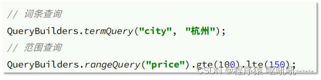

## 4、布尔查询

布尔查询是用must、must_not、filter等方式组合其它查询，代码示例如下：

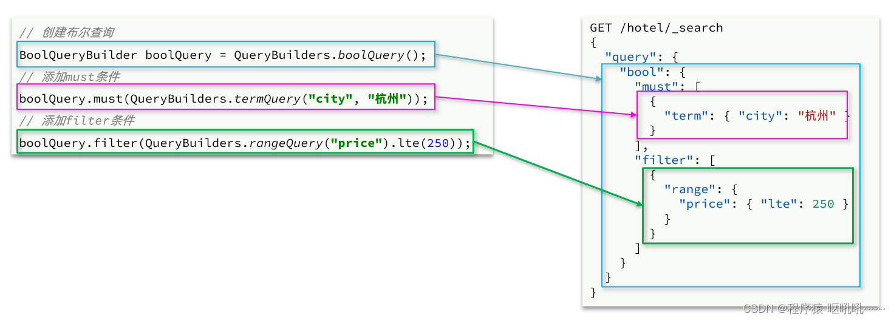

可以看到，API与其它查询的差别同样是在查询条件的构建，QueryBuilders，结果解析等其他代码完全不变。

完整代码如下：

```java
@Test
void testBool() throws IOException {
    // 1.准备Request
    SearchRequest request = new SearchRequest("hotel");
    // 2.准备DSL
    // 2.1.准备BooleanQuery
    BoolQueryBuilder boolQuery = QueryBuilders.boolQuery();
    // 2.2.添加term
    boolQuery.must(QueryBuilders.termQuery("city", "杭州"));
    // 2.3.添加range
    boolQuery.filter(QueryBuilders.rangeQuery("price").lte(250));
 
    request.source().query(boolQuery);
    // 3.发送请求
    SearchResponse response = client.search(request, RequestOptions.DEFAULT);
    // 4.解析响应
    handleResponse(response);
 
}
```

## 5、排序、分页

搜索结果的排序和分页是与query同级的参数，因此同样是使用request.source()来设置。

对应的API如下：

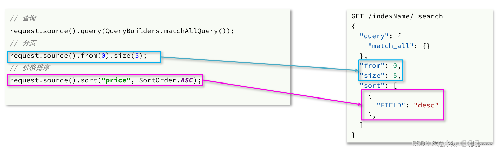

完整代码示例：

```java
@Test
void testPageAndSort() throws IOException {
    // 页码，每页大小
    int page = 1, size = 5;
 
    // 1.准备Request
    SearchRequest request = new SearchRequest("hotel");
    // 2.准备DSL
    // 2.1.query
    request.source().query(QueryBuilders.matchAllQuery());
    // 2.2.排序 sort
    request.source().sort("price", SortOrder.ASC);
    // 2.3.分页 from、size
    request.source().from((page - 1) * size).size(5);
    // 3.发送请求
    SearchResponse response = client.search(request, RequestOptions.DEFAULT);
    // 4.解析响应
    handleResponse(response);
 
}
```

## 6、高亮

高亮的代码与之前代码差异较大，有两点：

- 查询的DSL：其中除了查询条件，还需要添加高亮条件，同样是与query同级。

- 结果解析：结果除了要解析_source文档数据，还要解析高亮结果

### 1）高亮请求构建

高亮请求的构建API如下：

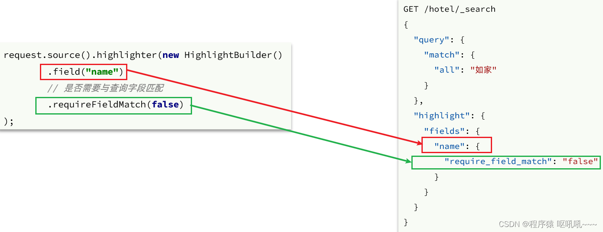

上述代码省略了查询条件部分，但是大家不要忘了：高亮查询必须使用全文检索查询，并且要有搜索关键字，将来才可以对关键字高亮。

完整代码如下：

```java
@Test
void testHighlight() throws IOException {
    // 1.准备Request
    SearchRequest request = new SearchRequest("hotel");
    // 2.准备DSL
    // 2.1.query
    request.source().query(QueryBuilders.matchQuery("all", "如家"));
    // 2.2.高亮
    request.source().highlighter(new HighlightBuilder().field("name").requireFieldMatch(false));
    // 3.发送请求
    SearchResponse response = client.search(request, RequestOptions.DEFAULT);
    // 4.解析响应
    handleResponse(response);
}
```

### 2）高亮结果解析

高亮的结果与查询的文档结果默认是分离的，并不在一起。

因此解析高亮的代码需要额外处理：

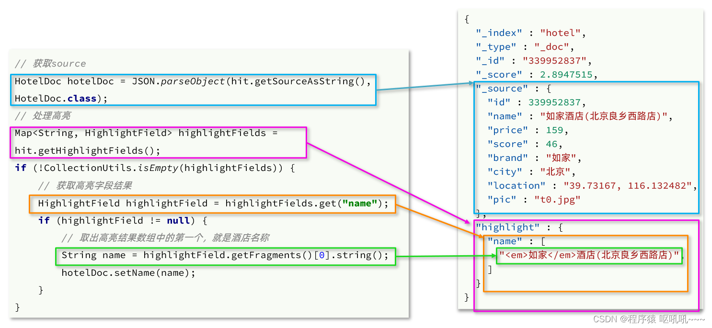

代码解读：

- 第一步：从结果中获取source。hit.getSourceAsString()，这部分是非高亮结果，json字符串。还需要反序列为HotelDoc对象

- 第二步：获取高亮结果。hit.getHighlightFields()，返回值是一个Map，key是高亮字段名称，值是HighlightField对象，代表高亮值

- 第三步：从map中根据高亮字段名称，获取高亮字段值对象HighlightField

- 第四步：从HighlightField中获取Fragments，并且转为字符串。这部分就是真正的高亮字符串了

- 第五步：用高亮的结果替换HotelDoc中的非高亮结果


完整代码如下：

```java
private void handleResponse(SearchResponse response) {
    // 4.解析响应
    SearchHits searchHits = response.getHits();
    // 4.1.获取总条数
    long total = searchHits.getTotalHits().value;
    System.out.println("共搜索到" + total + "条数据");
    // 4.2.文档数组
    SearchHit[] hits = searchHits.getHits();
    // 4.3.遍历
    for (SearchHit hit : hits) {
        // 获取文档source
        String json = hit.getSourceAsString();
        // 反序列化
        HotelDoc hotelDoc = JSON.parseObject(json, HotelDoc.class);
        // 获取高亮结果
        Map<String, HighlightField> highlightFields = hit.getHighlightFields();
        if (!CollectionUtils.isEmpty(highlightFields)) {
            // 根据字段名获取高亮结果
            HighlightField highlightField = highlightFields.get("name");
            if (highlightField != null) {
                // 获取高亮值
                String name = highlightField.getFragments()[0].string();
                // 覆盖非高亮结果
                hotelDoc.setName(name);
            }
        }
        System.out.println("hotelDoc = " + hotelDoc);
    }
}
```

### 3）高亮通用代码

```java
public static <T> List<T> handleResponse2(SearchResponse response, Class<T> clazz) {
    List<T> resultList = new ArrayList<>();

    // 获取搜索命中结果
    SearchHits hits = response.getHits();
    TotalHits totalHits = hits.getTotalHits();
    SearchHit[] hitArray = hits.getHits();

    for (SearchHit searchHit : hitArray) {
        // JSON 解析成指定的泛型对象
        String json = searchHit.getSourceAsString();
        T entity = JSON.parseObject(json, clazz);
        resultList.add(entity);


        // 处理高亮字段
        Map<String, HighlightField> highlightFields = searchHit.getHighlightFields();
        if (highlightFields != null && !highlightFields.isEmpty()) {
            highlightFields.forEach((fieldName, highlightField) -> {
                String highlightedText = highlightField.fragments()[0].toString();
                setFieldValue(entity, fieldName, highlightedText);
            });
        }
        // 打印解析对象
        System.out.println(entity);
    }

    System.out.println("Total Hits: " + totalHits.value);
    return resultList;
}

private static <T> void setFieldValue(T entity, String fieldName, String value) {
    try {
        Field field = entity.getClass().getDeclaredField(fieldName);
        field.setAccessible(true);
        field.set(entity, value);
    } catch (NoSuchFieldException | IllegalAccessException e) {
        System.err.println("Error setting field value: " + e.getMessage());
    }
}
```

## 7、聚合

聚合条件与query条件同级别，因此需要使用request.source()来指定聚合条件。

聚合条件的语法：

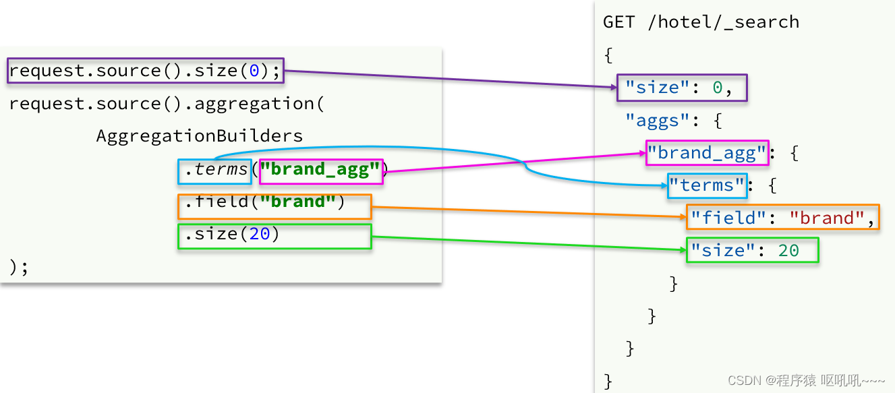

聚合的结果也与查询结果不同，API也比较特殊。不过同样是JSON逐层解析：

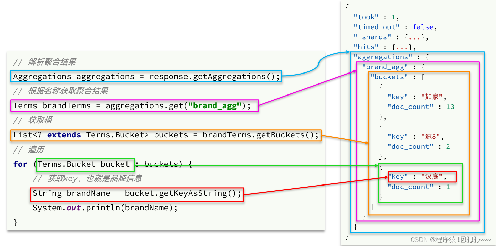

# 八、高级用法

## 1、自动补全

### 1）拼音分词器

要实现根据字母做补全，就必须对文档按照拼音分词。在GitHub上恰好有elasticsearch的拼音分词插件。地址：https://github.com/medcl/elasticsearch-analysis-pinyin

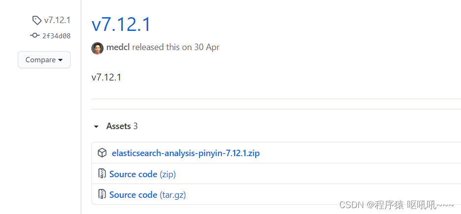

安装方式与IK分词器一样，分三步：

①解压

②上传到虚拟机中，elasticsearch的plugin目录

③重启elasticsearch

④测试

**测试用法如下：**

```json
POST /_analyze
{
  "text": "如家酒店还不错",
  "analyzer": "pinyin"
}
```

**结果：**

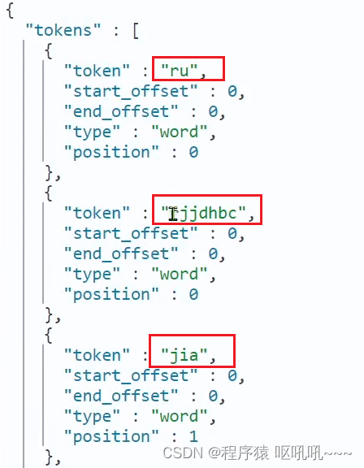

### 2）自定义分词器

默认的拼音分词器会将每个汉字单独分为拼音，而我们希望的是每个词条形成一组拼音，需要对拼音分词器做个性化定制，形成自定义分词器。

elasticsearch中分词器（analyzer）的组成包含三部分：

- character filters：在tokenizer之前对文本进行处理。例如删除字符、替换字符

- tokenizer：将文本按照一定的规则切割成词条（term）。例如keyword，就是不分词；还有ik_smart

- tokenizer filter：将tokenizer输出的词条做进一步处理。例如大小写转换、同义词处理、拼音处理等


文档分词时会依次由这三部分来处理文档：

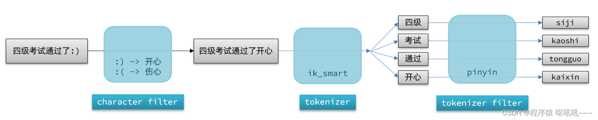

声明自定义分词器的语法如下：

```json
PUT /test
{
  "settings": {
    "analysis": {
      "analyzer": { // 自定义分词器
        "my_analyzer": {  // 分词器名称
          "tokenizer": "ik_max_word",
          "filter": "py"
        }
      },
      "filter": { // 自定义tokenizer filter
        "py": { // 过滤器名称
          "type": "pinyin", // 过滤器类型，这里是pinyin
		  "keep_full_pinyin": false,
          "keep_joined_full_pinyin": true,
          "keep_original": true,
          "limit_first_letter_length": 16,
          "remove_duplicated_term": true,
          "none_chinese_pinyin_tokenize": false
        }
      }
    }
  },
  "mappings": {
    "properties": {
      "name": {
        "type": "text",
        "analyzer": "my_analyzer",
        "search_analyzer": "ik_smart"
      }
    }
  }
}
```

测试：

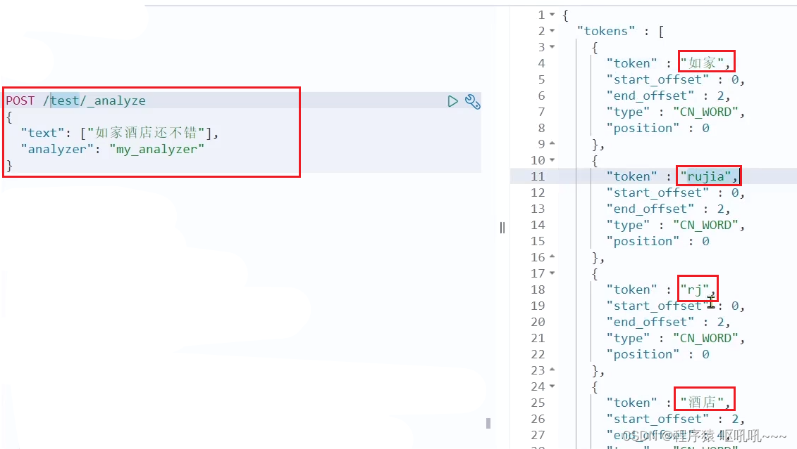

**总结**

如何使用拼音分词器？

- ①下载pinyin分词器

- ②解压并放到elasticsearch的plugin目录

- ③重启即可


如何自定义分词器？

- ①创建索引库时，在settings中配置，可以包含三部分

- ②character filter

- ③tokenizer

- ④filter


拼音分词器注意事项？

为了避免搜索到同音字，搜索时不要使用拼音分词器

> **注意：`search_analyzer` 和 `analyzer` 是不同的概念**
>
> `analyzer` 用于**索引时**分词（写入倒排索引），`search_analyzer` 用于**查询时**分词。如果不单独指定 `search_analyzer`，默认沿用 `analyzer`。分开设置的典型场景是：索引时细粒度分词保证召回率，查询时粗粒度分词保证精准度。

### 3）自动补全查询

elasticsearch提供了Completion Suggester查询来实现自动补全功能。这个查询会匹配以用户输入内容开头的词条并返回。为了提高补全查询的效率，对于文档中字段的类型有一些约束：

- 参与补全查询的字段必须是completion类型。

- 字段的内容一般是用来补全的多个词条形成的数组。


比如，一个这样的索引库：

```json
// 创建索引库
PUT test
{
  "mappings": {
    "properties": {
      "title":{
        "type": "completion"
      }
    }
  }
}
```

然后插入下面的数据：

```json
// 示例数据
POST test/_doc
{
  "title": ["Sony", "WH-1000XM3"]
}
POST test/_doc
{
  "title": ["SK-II", "PITERA"]
}
POST test/_doc
{
  "title": ["Nintendo", "switch"]
}
```

查询的DSL语句如下：

```json
// 自动补全查询
GET /test/_search
{
  "suggest": {
    "title_suggest": {
      "text": "s", // 关键字
      "completion": {
        "field": "title", // 补全查询的字段
        "skip_duplicates": true, // 跳过重复的
        "size": 10 // 获取前10条结果
      }
    }
  }
}
```

代码示例：

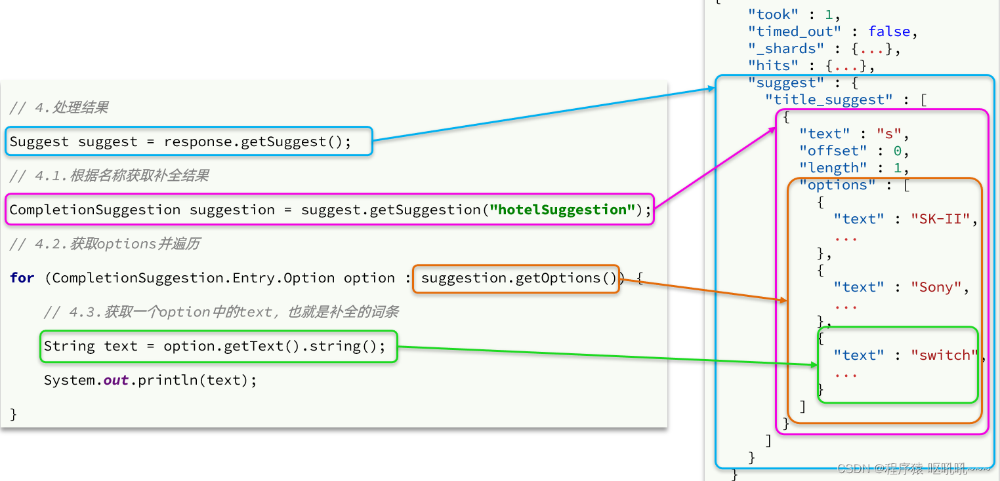

## 2、数据同步

elasticsearch中的酒店数据来自于mysql数据库，因此mysql数据发生改变时，elasticsearch也必须跟着改变，这个就是elasticsearch与mysql之间的**数据同步**。

> **常见的数据同步方案有三种：**
>
> - 同步调用
>
> - 异步通知
>
> - 监听binlog

### 1）同步调用

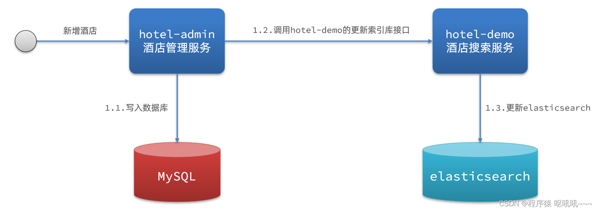

#### 1.1 基本步骤：

- hotel-demo对外提供接口，用来修改elasticsearch中的数据

- 酒店管理服务在完成数据库操作后，直接调用hotel-demo提供的接口

#### 1.2 优点：

1. **实现简单直观**：就是写两个数据源，没有中间件，代码逻辑清晰
2. **实时性最高**：同步双写模式下，ES 和 MySQL 几乎同时更新
3. **依赖少**：不需要额外引入 MQ、Canal 等组件，降低运维成本
4. **事务可控**：可以在同一个事务中控制 MySQL 和 ES 的写入（虽然跨数据源事务有局限性）

#### 1.3 缺点：

1. **业务代码侵入严重**：每个需要同步的地方都要写双写逻辑
2. **一致性难保证**：MySQL 写成功、ES 写失败，数据就不一致了，没有自动重试机制
3. **性能影响**：同步双写会增加接口响应时间；异步双写（线程池）又可能丢数据
4. **耦合度高**：ES 挂了会影响 MySQL 写入（同步模式下），或者需要复杂的降级逻辑

#### 1.4 适用场景

- 并发量不高
- 对一致性要求不那么严格
- 不想引入额外中间件的简单项目

### 2）异步通知

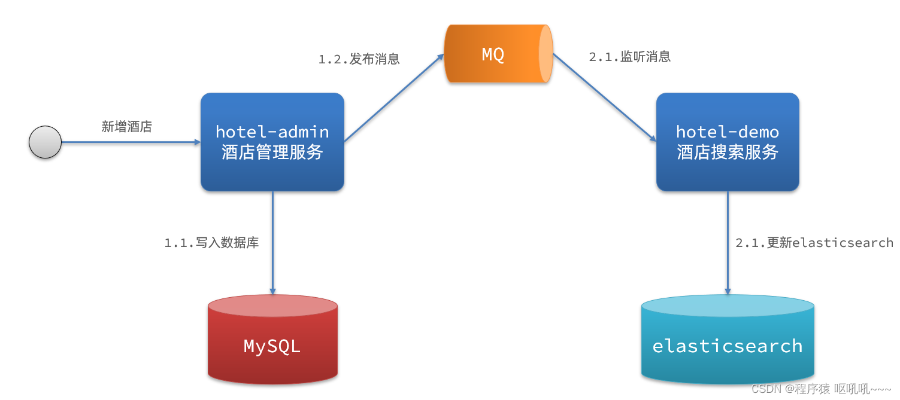

#### 2.1 基本步骤

- hotel-admin对mysql数据库数据完成增、删、改后，发送MQ消息

- hotel-demo监听MQ，接收到消息后完成elasticsearch数据修改

#### 2.2 优点

1. **解耦**：MySQL 写入方不需要知道 ES 的存在，只管发消息
2. **削峰填谷**：MQ 作为缓冲区，避免高并发时 ES 被打垮
3. **可靠性较好**：MQ 有持久化和重试机制，消费失败可以重试 + 死信队列兜底
4. **可扩展**：新增下游（如 Redis、HBase）只需加消费者，不改主流程

####  2.3 缺点

1. **复杂度高**：需要维护 MQ 集群、处理消息丢失、重复消费、顺序性等问题
2. **延迟增加**：正常情况毫秒级，消息积压时可能分钟甚至小时级
3. **最终一致性**：只能保证最终一致，做不到强一致
4. **事务问题**：MySQL 事务和发 MQ 无法原子操作，需要事务消息或本地消息表兜底

#### 2.4 适用场景

- 中高并发场景
- 能接受秒级延迟
- 已有 MQ 基础设施
- 多个下游需要消费同一份数据变更

### 3）监听binlog

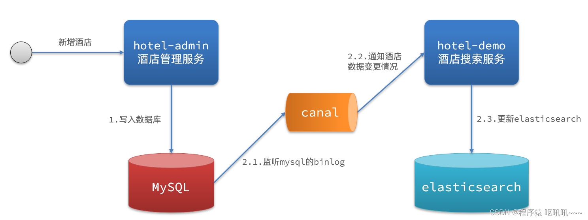

#### 3.1 基本流程

- 给mysql开启binlog功能

- mysql完成增、删、改操作都会记录在binlog中

- hotel-demo基于canal监听binlog变化，实时更新elasticsearch中的内容

#### 3.2 优点

1. **完全无业务侵入**：业务代码只写 MySQL，同步逻辑在外部完成
2. **实时性高**：秒级甚至毫秒级延迟
3. **顺序有保障**：Binlog 天然有序，Canal 按序消费，不会乱序
4. **可靠性强**：Canal 记录消费位点，重启后可续传，不丢数据
5. **统一同步**：所有表的变更都可以统一处理，不遗漏

#### 3.3 缺点

1. **运维成本高**：需要部署和维护 Canal 服务，MySQL 需开启 Binlog（ROW 格式）
2. **全量同步弱**：Canal 只处理增量，首次同步或重建索引需要额外脚本
3. **数据库依赖**：只支持 MySQL（及兼容协议的数据源），其他数据库需换 Flink CDC
4. **字段映射严格**：ES 索引字段名和类型需与 MySQL 精确匹配

#### 3.4 适用场景

- 以 MySQL 为唯一数据源
- 不希望改业务代码
- 需要实时同步到多个下游
- 团队有能力运维 Canal 组件

### 4）优缺点

| 维度           | 双写         | MQ 异步  | Binlog 监听      |
| :------------- | :----------- | :------- | :--------------- |
| **业务侵入**   | 高           | 中       | 无               |
| **实时性**     | 最高（同步） | 秒级     | 秒级/毫秒级      |
| **一致性**     | 弱           | 最终一致 | 最终一致（有序） |
| **复杂度**     | 低           | 中       | 中高             |
| **运维成本**   | 低           | 中       | 中高             |
| **可靠性**     | 低           | 中       | 高               |
| **可扩展性**   | 差           | 好       | 好               |
| **MySQL 要求** | 无           | 无       | 需开启 Binlog    |

方式一：同步调用

- 优点：实现简单，粗暴

- 缺点：业务耦合度高

方式二：异步通知

- 优点：低耦合，实现难度一般

- 缺点：依赖mq的可靠性

方式三：监听binlog

- 优点：完全解除服务间耦合

- 缺点：开启binlog增加数据库负担、实现复杂度高

### 5）MQ同步案例

#### 1.1 引入依赖

```xml
<!--amqp-->
<dependency>
    <groupId>org.springframework.boot</groupId>
    <artifactId>spring-boot-starter-amqp</artifactId>
</dependency>
```

#### 1.2 声明队列交换机名称

在hotel-admin和hotel-demo中的cn.itcast.hotel.constatnts包下新建一个类MqConstants：

```java
package cn.itcast.hotel.constatnts;
 
    public class MqConstants {
    /**
     * 交换机
     */
    public final static String HOTEL_EXCHANGE = "hotel.topic";
    /**
     * 监听新增和修改的队列
     */
    public final static String HOTEL_INSERT_QUEUE = "hotel.insert.queue";
    /**
     * 监听删除的队列
     */
    public final static String HOTEL_DELETE_QUEUE = "hotel.delete.queue";
    /**
     * 新增或修改的RoutingKey
     */
    public final static String HOTEL_INSERT_KEY = "hotel.insert";
    /**
     * 删除的RoutingKey
     */
    public final static String HOTEL_DELETE_KEY = "hotel.delete";
}
```

#### 1.3 声明队列交换机

```java
package cn.itcast.hotel.config;
 
import cn.itcast.hotel.constants.MqConstants;
import org.springframework.amqp.core.Binding;
import org.springframework.amqp.core.BindingBuilder;
import org.springframework.amqp.core.Queue;
import org.springframework.amqp.core.TopicExchange;
import org.springframework.context.annotation.Bean;
import org.springframework.context.annotation.Configuration;
 
@Configuration
public class MqConfig {
    @Bean
    public TopicExchange topicExchange(){
        return new TopicExchange(MqConstants.HOTEL_EXCHANGE, true, false);
    }
 
    @Bean
    public Queue insertQueue(){
        return new Queue(MqConstants.HOTEL_INSERT_QUEUE, true);
    }
 
    @Bean
    public Queue deleteQueue(){
        return new Queue(MqConstants.HOTEL_DELETE_QUEUE, true);
    }
 
    @Bean
    public Binding insertQueueBinding(){
        return BindingBuilder.bind(insertQueue()).to(topicExchange()).with(MqConstants.HOTEL_INSERT_KEY);
    }
 
    @Bean
    public Binding deleteQueueBinding(){
        return BindingBuilder.bind(deleteQueue()).to(topicExchange()).with(MqConstants.HOTEL_DELETE_KEY);
    }
}
```

#### 1.4 发送MQ消息

在hotel-admin中的增、删、改业务中分别发送MQ消息：

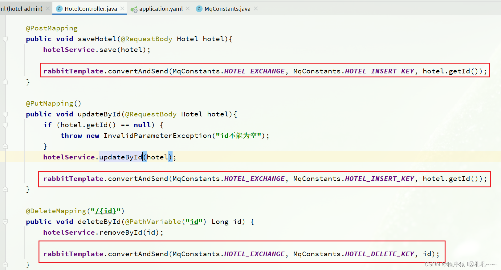

#### 1.5 接收MQ消息

hotel-demo接收到MQ消息要做的事情包括：

- 新增消息：根据传递的hotel的id查询hotel信息，然后新增一条数据到索引库

- 删除消息：根据传递的hotel的id删除索引库中的一条数据


1）首先在hotel-demo的cn.itcast.hotel.service包下的IHotelService中新增新增、删除业务

```java
void deleteById(Long id);
 
void insertById(Long id);
```

2）给hotel-demo中的cn.itcast.hotel.service.impl包下的HotelService中实现业务：

```java
@Override
public void deleteById(Long id) {
    try {
        // 1.准备Request
        DeleteRequest request = new DeleteRequest("hotel", id.toString());
        // 2.发送请求
        client.delete(request, RequestOptions.DEFAULT);
    } catch (IOException e) {
        throw new RuntimeException(e);
    }
}
 
@Override
public void insertById(Long id) {
    try {
        // 0.根据id查询酒店数据
        Hotel hotel = getById(id);
        // 转换为文档类型
        HotelDoc hotelDoc = new HotelDoc(hotel);
 
        // 1.准备Request对象
        IndexRequest request = new IndexRequest("hotel").id(hotel.getId().toString());
        // 2.准备Json文档
        request.source(JSON.toJSONString(hotelDoc), XContentType.JSON);
        // 3.发送请求
        client.index(request, RequestOptions.DEFAULT);
    } catch (IOException e) {
        throw new RuntimeException(e);
    }
}
```

3）编写监听器

在hotel-demo中的cn.itcast.hotel.mq包新增一个类：

```java
package cn.itcast.hotel.mq;
 
import cn.itcast.hotel.constants.MqConstants;
import cn.itcast.hotel.service.IHotelService;
import org.springframework.amqp.rabbit.annotation.RabbitListener;
import org.springframework.beans.factory.annotation.Autowired;
import org.springframework.stereotype.Component;
 
@Component
public class HotelListener {
 
    @Autowired
    private IHotelService hotelService;
 
    /**
     * 监听酒店新增或修改的业务
     * @param id 酒店id
     */
    @RabbitListener(queues = MqConstants.HOTEL_INSERT_QUEUE)
    public void listenHotelInsertOrUpdate(Long id){
        hotelService.insertById(id);
    }
 
    /**
     * 监听酒店删除的业务
     * @param id 酒店id
     */
    @RabbitListener(queues = MqConstants.HOTEL_DELETE_QUEUE)
    public void listenHotelDelete(Long id){
        hotelService.deleteById(id);
    }
}
```

## 3、集群

单机的elasticsearch做数据存储，必然面临两个问题：海量数据存储问题、单点故障问题。

- 海量数据存储问题：将索引库从逻辑上拆分为N个分片（shard），存储到多个节点

- 单点故障问题：将分片数据在不同节点备份（replica ）

**ES集群相关概念**:

集群（cluster）：一组拥有共同的 cluster name 的 节点。

节点（node) ：集群中的一个 Elasticearch 实例

分片（shard） ：索引可以被拆分为不同的部分进行存储，称为分片。在集群环境下，一个索引的不同分片可以拆分到不同的节点中

解决问题：数据量太大，单点存储量有限的问题。

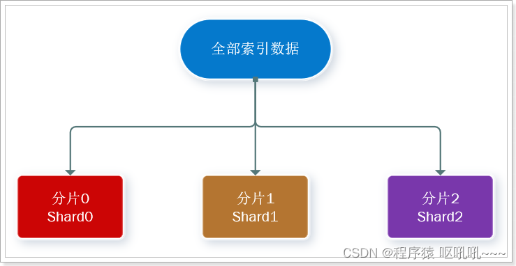

> 此处，我们把数据分成3片：shard0、shard1、shard2

- 主分片（Primary shard）：相对于副本分片的定义。

- 副本分片（Replica shard）每个主分片可以有一个或者多个副本，数据和主分片一样。


数据备份可以保证高可用，但是每个分片备份一份，所需要的节点数量就会翻一倍，成本实在是太高了！

为了在高可用和成本间寻求平衡，我们可以这样做：

- 首先对数据分片，存储到不同节点

- 然后对每个分片进行备份，放到对方节点，完成互相备份


这样可以大大减少所需要的服务节点数量，如图，我们以3分片，每个分片备份一份为例：

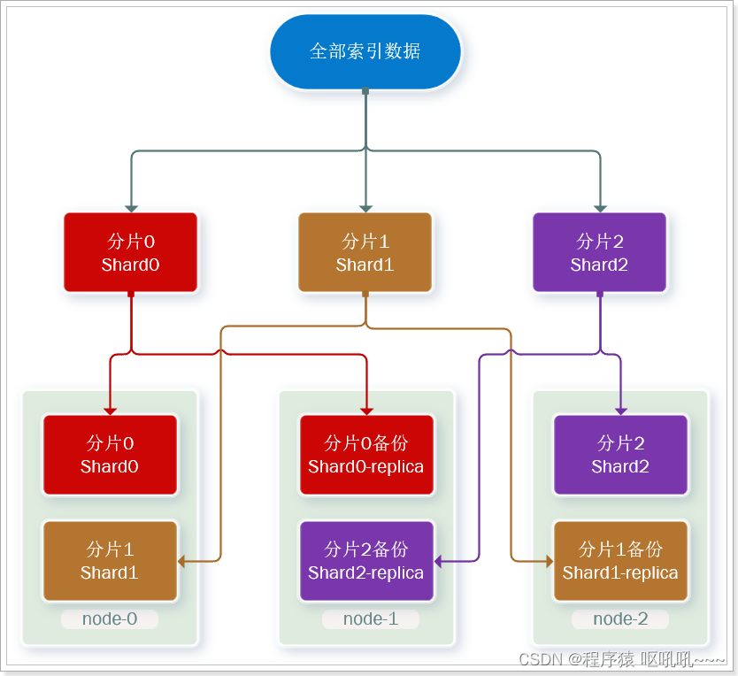

现在，每个分片都有1个备份，存储在3个节点：

- node0：保存了分片0和1

- node1：保存了分片0和2

- node2：保存了分片1和2

### 1）搭建集群

（代办）

### 2）集群脑裂问题

#### 1.1 集群职责划分

elasticsearch中集群节点有不同的职责划分：

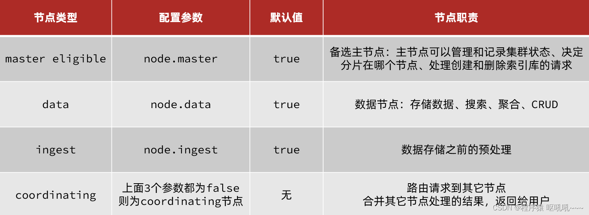

默认情况下，集群中的任何一个节点都同时具备上述四种角色。

但是真实的集群一定要将集群职责分离：

- master节点：对CPU要求高，但是内存要求低

- data节点：对CPU和内存要求都高

- coordinating节点：对网络带宽、CPU要求高


职责分离可以让我们根据不同节点的需求分配不同的硬件去部署。而且避免业务之间的互相干扰。

一个典型的es集群职责划分如图：
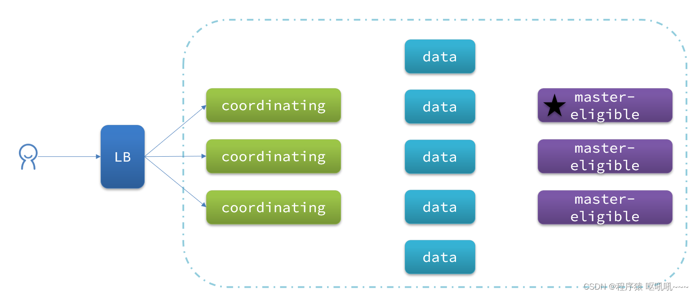

#### 1.2 脑裂问题

脑裂是因为集群中的节点失联导致的。

例如一个集群中，主节点与其它节点失联：

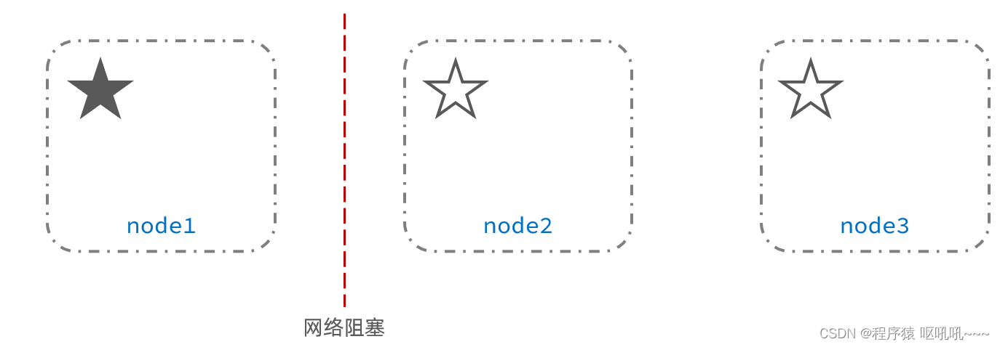


此时，node2和node3认为node1宕机，就会重新选主：

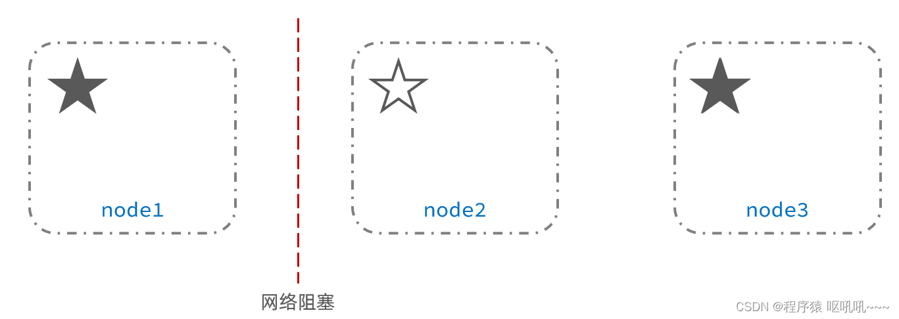

当node3当选后，集群继续对外提供服务，node2和node3自成集群，node1自成集群，两个集群数据不同步，出现数据差异。

当网络恢复后，因为集群中有两个master节点，集群状态的不一致，出现脑裂的情况：

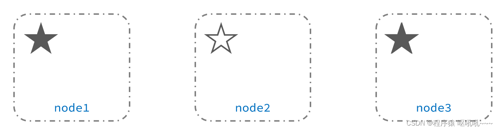


解决脑裂的方案是，要求选票超过 ( eligible节点数量 + 1 ）/ 2 才能当选为主，因此eligible节点数量最好是奇数。对应配置项是discovery.zen.minimum_master_nodes，在es7.0以后，已经成为默认配置，因此一般不会发生脑裂问题

例如：3个节点形成的集群，选票必须超过 （3 + 1） / 2 ，也就是2票。node3得到node2和node3的选票，当选为主。node1只有自己1票，没有当选。集群中依然只有1个主节点，没有出现脑裂。

#### 1.3 小结

master eligible节点的作用是什么？

- 参与集群选主


- 主节点可以管理集群状态、管理分片信息、处理创建和删除索引库的请求


data节点的作用是什么？

- 数据的CRUD


coordinator节点的作用是什么？

- 路由请求到其它节点

- 合并查询到的结果，返回给用户


### 3）集群分布式存储

当新增文档时，应该保存到不同分片，保证数据均衡，那么coordinating node如何确定数据该存储到哪个分片呢？

#### 1.1 分片存储测试

插入三条数据：

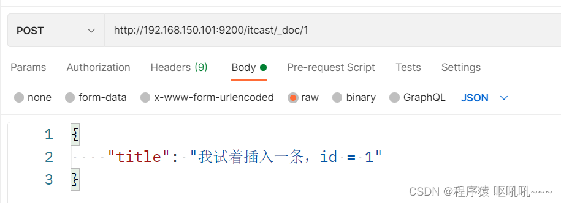


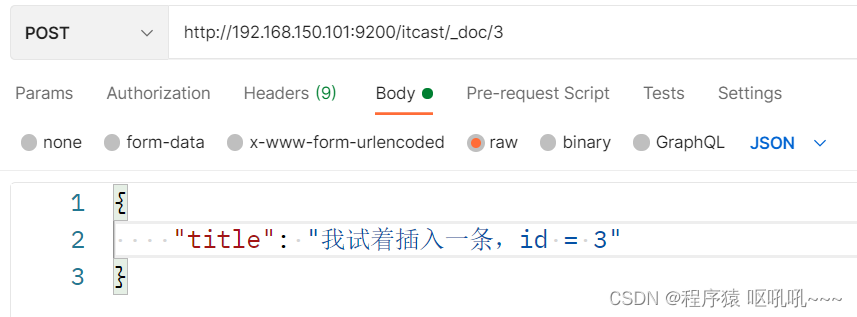

测试可以看到，三条数据分别在不同分片：

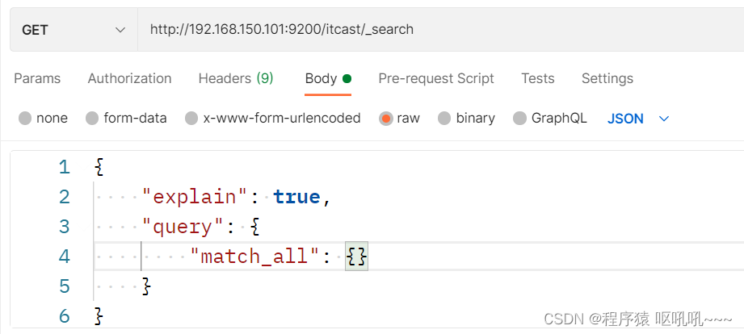

结果：

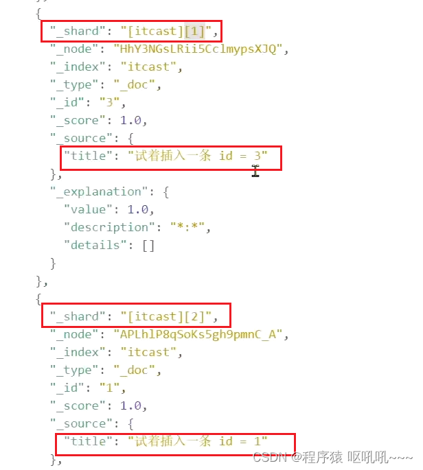

#### 1.2 分片存储原理

elasticsearch会通过hash算法来计算文档应该存储到哪个分片：


说明：

- _routing默认是文档的id

- 算法与分片数量有关，因此索引库一旦创建，分片数量不能修改！

新增文档的流程如下：

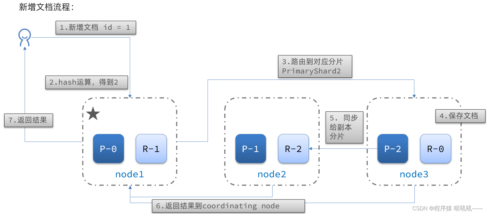

解读：

1）新增一个id=1的文档

2）对id做hash运算，假如得到的是2，则应该存储到shard-2

3）shard-2的主分片在node3节点，将数据路由到node3

4）保存文档

5）同步给shard-2的副本replica-2，在node2节点

6）返回结果给coordinating-node节点

### 4）集群分布式查询

elasticsearch的查询分成两个阶段：

- scatter phase：分散阶段，coordinating node会把请求分发到每一个分片

- gather phase：聚集阶段，coordinating node汇总data node的搜索结果，并处理为最终结果集返回给用户

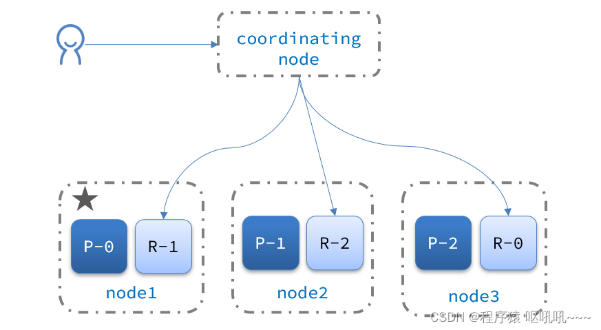

### 5）Node故障转移

集群的master节点会监控集群中的节点状态，如果发现有节点宕机，会立即将宕机节点的分片数据迁移到其它节点，确保数据安全，这个叫做故障转移。

1）例如一个集群结构如图：

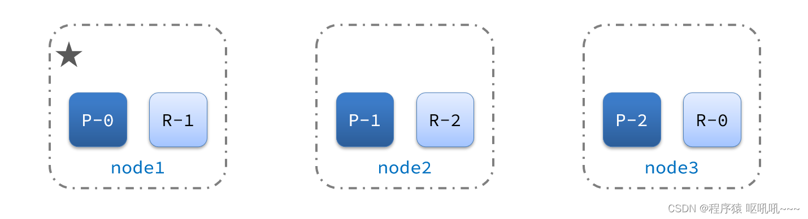

现在，node1是主节点，其它两个节点是从节点。

2）突然，node1发生了故障：

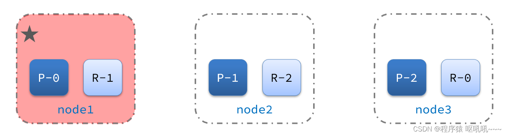

宕机后的第一件事，需要重新选主，例如选中了node2：

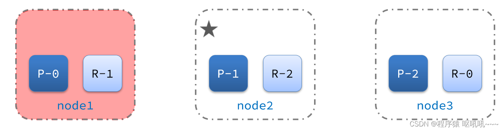

node2成为主节点后，会检测集群监控状态，发现：shard-1、shard-0没有副本节点。因此需要将node1上的数据迁移到node2、node3：

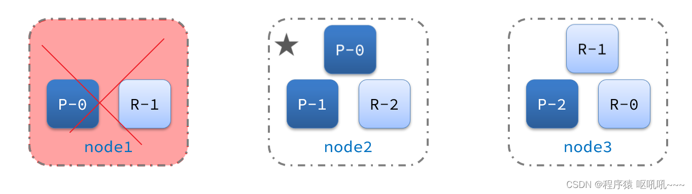

**故障转移期间的读写行为：**

| 操作       | 故障期间行为                                                 |
| :--------- | :----------------------------------------------------------- |
| **写请求** | 如果涉及的主分片不可用（如 P0 所在的 Node A 宕机），写请求失败，返回 `no active shard` |
| **读请求** | 如果配置了 `preference=_replica` 且对应的副本分片在存活节点上，读请求正常返回；否则也会失败 |

### 6）CAT API

#### 1）用途

1. cat API 主要用于在命令行或终端中快速查看一些与 Elasticsearch 相关的重要信息。

2. 常见使用场景包括查看集群健康状态、节点信息、索引大小和文档数等。

#### 2）常用的 cat API 命令

- `_cat/health`：显示集群的健康状态，包括状态（绿色、黄色、红色）、活跃节点数、活动主分片数等。
- `_cat/nodes`：列出集群中所有节点的信息，如节点名称、角色、磁盘使用率等。
- `_cat/indices`：展示所有索引的信息，如节点名称、状态、文档数、存储大小等。
- `_cat/allocation`：显示分片的分配信息，如每个节点的磁盘使用情况、分片分配等。
- `_cat/shard`：列出所有分片的信息，包括在每个节点和其分片编号。

#### 3）示例

- 查看集群状态：`GET /_cat/health?v`

  输出示例：

```shell
epoch      timestamp cluster       status node.total node.data shards pri relo init unassign pending_tasks max_task_wait_time active_shards_percent
1629881012 11:30:12  my_cluster    green  3          3         30     30  0    0    0        0              -                 100.0%
```

- 查看索引信息：`GET /_cat/indices?v`

​		输出示例：

```shell
health status index                           uuid                   pri rep docs.count docs.deleted store.size pri.store.size
yellow open   test_index_1                    Y5J8ouYsR4G76sQog39i2Q   1   1          1            0      3.1kb          3.1kb
green  open   another_index                   Kd5Rlx32SLabFR3vtfx7Og   1   0          5            1      12kb           12kb
```

### 7）如何在高并发场景下保证 Elasticsearch 的读写一致性？

在高并发场景下，ES 默认优先保证高可用和写入性能，而不是强一致性。要保证读写一致性，需要从几个方面入手：

**写入端**：

- 使用 `wait_for_active_shards` 保证足够副本写入（读采用的是轮询的方式，可能读到副本，而写入时是先写主分片再写副本）
- 使用乐观锁（`if_seq_no`）避免丢失更新
- 根据业务需求调整 `refresh_interval`（默认refresh为1s） 和 `translog`（事务日志） 刷盘策略

**读取端**：

- 关键场景用 `preference=_primary` 读主分片
- 需要实时读取时，写入后强制 `refresh`
- 非关键场景接受最终一致性

**架构层面**：

- ES 不适合做唯一数据源，关键数据以 MySQL 为准
- 通过 MQ 或 Canal 异步同步，接受短暂不一致窗口
- 设计幂等消费，避免重复消息导致数据错乱

总之，ES 的一致性是‘可调’的，需要在性能、可用性、一致性之间做权衡。没有银弹，只有适合业务的方案。

## 4、Explain API

Elasticsearch 的 explain API 是用来解释查询过程中文档评分 (score) 是如何计算的，它能提供详细的得分细节和评分过程。这对于调试和优化查询非常有用。通过 explain API，你可以看到查询是如何匹配文档，并且可以深入了解为什么某些文档比其他文档排名靠前。

### 1）使用explain Api的方法

可以在请求中添加`explain`参数，设为`true`。例如：

```json
GET /index_name/_search
{
  "query": {
    "match": {
      "field": "value"
    }
  },
  "explain": true
}
```

### 2）评分机制

在 Elasticsearch 中，评分机制基于 TF-IDF（词频-逆文本频率）算法或 BM25（为了更合理地评估文档相关性）。通过 explain API，我们可以看到每个文档的词频（Term Frequency）、逆文档频率（Inverse Document Frequency）以及字段归一化（Field Norms）等具体的评分因素是如何影响文档得分的。

### 3）优化和调试查询

有了 explain API，开发者能更清晰地理解查询是如何工作的，并据此优化查询。比如，如果某些查询的结果不符合预期，通过分析评分细节就能发现问题所在，是因为某个词的权重问题还是字段配置的问题。

### 4）多字段匹配的复杂性

当查询涉及多个字段时，评分的解释也会变得更加复杂。Explain API 会显示不同字段在总评分中分别贡献了多少，这样有助于我们调整字段的权重。

### 5）工具支持

一些常用的 Elasticsearch 可视化工具，如 Kibana，也提供了支持 explain API 的功能，使得用户可以更直观地查看查询评分解释信息。这样，用户不需要直接编写复杂的查询请求，就能获取解释数据。


## 5、Segment

### 1）Segment和分片的区别

| 概念              | 是什么                                          | 大小关系 |
| :---------------- | :---------------------------------------------- | :------- |
| **分片（Shard）** | 逻辑上的数据分区，一个索引由多个分片组成        | 大       |
| **Segment**       | 分片内部的物理文件，一个分片由多个 Segment 组成 | 小       |

关系：

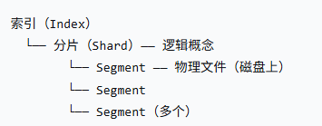

### 2）写入流程：从请求到 Segment

假设你执行一条写入：

```json
POST /orders/_doc/1
{
  "status": "paid",
  "amount": 100
}
```

#### 1. 协调节点 → 主分片

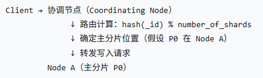

#### 2. 主分片写入内存缓冲区

主分片收到请求后：

1. 将文档写入 **内存缓冲区**（Index Buffer）
2. 同时写入 **事务日志**（Translog，磁盘上，用于故障恢复）

此时数据**还不可搜索**。

#### 3. 主分片 → 副本分片

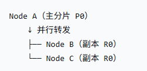

**关键**：主分片会等待副本分片返回确认（可配置 `wait_for_active_shards`），然后才返回客户端成功。

#### 4. Refresh → 生成 Segment

每隔 1 秒（默认），ES 执行 **refresh**：

`内存缓冲区 → 刷新 → 生成新的 Segment（磁盘文件）`

此时数据**变得可搜索**。

**Segment 的内容**：这个 Segment 文件里包含了这个时间段内写入的所有文档的：

- 倒排索引（Term Index、Term Dictionary、Posting List）
- 正排索引（Doc Values）
- 原始 JSON（`_source`）
- 文档元数据

### 3）Segment 内部结构

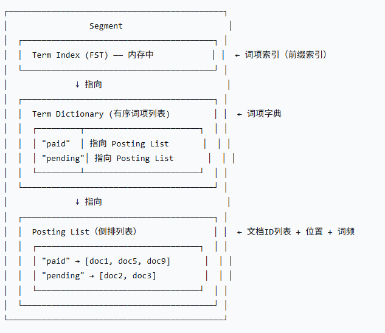


| 组件                | 存储位置    | 作用                                          | 类比                                 |
| :------------------ | :---------- | :-------------------------------------------- | :----------------------------------- |
| **Term Index**      | 内存（FST） | 快速定位 Term 在磁盘上的位置                  | 字典的**目录**（只记录首字母或前缀） |
| **Term Dictionary** | 磁盘        | 存储所有词项，按字典序排序，指向 Posting List | 字典的**正文**                       |
| **Posting List**    | 磁盘        | 存储每个词项对应的文档 ID 列表、词频、位置    | 字典的**页码**（记录哪个词在哪些页） |

**查询流程**

```搜索 "paid"
搜索 "paid"
    ↓
1. 查 Term Index（内存）→ 找到 "paid" 在 Term Dictionary 的 Block 位置
    ↓
2. 读 Term Dictionary（磁盘）→ 获取 "paid" 对应的 Posting List 指针
    ↓
3. 读 Posting List（磁盘）→ 获取文档 ID 列表 [1, 5, 9]
    ↓
4. 返回结果
```

### 4）Segment 是如何生成的

**关键点**：每个分片（无论是主还是副本）**独立地**维护自己的 Segment。

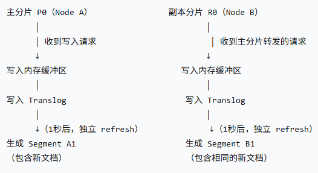

**注意**：

- 主分片和副本分片**各自独立**执行 refresh，生成自己的 Segment
- 它们生成的 Segment 文件**内容相同**（包含相同文档），但文件名不同
- 主分片 refresh 后数据可搜索，副本可能还没 refresh（短暂不一致）

> ES 的 Segment 是磁盘上的物理文件，一旦写入就不可变。一个 Segment 包含多个文档，而不是一个文档一个 Segment。
>
> 由于 Segment 不可变，更新操作不能原地修改，而是采用 **'标记删除 + 写入新文档'** 的方式：
>
> 1. 在旧 Segment 的 `.del` 文件中将旧文档标记为已删除
> 2. 将新文档写入新的 Segment
> 3. 查询时过滤掉被标记删除的文档
>
> 这意味着同一个文档的不同版本可能分布在多个 Segment 中，但查询时只会返回最新的有效版本。
>
> 真正的物理删除发生在后台的 **Segment Merge** 过程中，合并时会丢弃被标记删除的文档，释放磁盘空间。
>
> 这种设计的优点是写入性能高、查询无需加锁，缺点是更新会产生冗余数据，需要靠后台 Merge 来清理。这是 ES 在性能与空间之间做的经典权衡。

## 6、实现自动化清理

ES主要通过**索引生命周期管理（ILM）**和**数据流生命周期（DSL）**两大机制来实现自动化清理。前者功能全面，后者更简洁。

核心思路是：**为你的数据定义一个“保质期”，ES就会在其到期后自动执行清理。**

### 1）索引生命周期管理 (ILM)

ILM是ES官方推荐的处理时序数据（如日志、指标、事件）的标准方式。你可以为索引定义一系列阶段，并设置何时进入“删除(Delete)”阶段。

**1. ILM的四个核心阶段**

| 阶段       | 目的                                         | 可执行的操作                                          |
| :--------- | :------------------------------------------- | :---------------------------------------------------- |
| **Hot**    | 处理正在写入的“热”数据，追求高性能。         | 设置分片数、副本数、优先级等。                        |
| **Warm**   | 处理不再更新但仍需查询的“温”数据，优化存储。 | 迁移到低规格节点、减少副本数、合并段(force merge)等。 |
| **Cold**   | 处理极少查询的“冷”数据，节省成本。           | 迁移到更廉价的存储、冻结索引（节省内存）等。          |
| **Delete** | 处理达到保留期限的过期数据，**执行删除**。   | **直接删除索引**，释放磁盘空间。                      |

**2. 实战：创建一个30天后自动删除的策略**

假设你需要让索引在创建30天后自动删除，可以通过API定义如下策略：

```json
PUT _ilm/policy/auto-delete-policy
{
  "policy": {
    "phases": {
      "hot": {
        "min_age": "0ms",
        "actions": {
          "set_priority": {
            "priority": 100
          }
        }
      },
      "delete": {
        "min_age": "30d",   // 索引创建30天后进入此阶段
        "actions": {
          "delete": {}      // 执行删除操作
        }
      }
    }
  }
}
```

*策略中定义了`hot`和`delete`两个阶段，`delete`阶段会在索引创建满30天（`"min_age": "30d"`）后，执行`delete`操作将其删除。*

**3. 如何应用策略**

策略需要绑定到索引上才能生效。有两种方式：

- **创建索引模板（推荐）**：为符合特定名称规则（如`logs-*`）的新索引自动应用策略。

```json
PUT _index_template/my_logs_template
{
  "index_patterns": ["logs-*"],
  "template": {
    "settings": {
      "index.lifecycle.name": "auto-delete-policy" // 引用上面创建的策略
    }
  }
}
```

- **手动应用到单个索引**：也可以直接为现有索引指定ILM策略。

### 2）数据流生命周期 (DSL) 

对于**数据流(Data Stream)**，ES提供了一种更简化的内置生命周期管理机制。你只需要指定一个**数据保留期限**即可，无需关心复杂的阶段划分。

例如，创建一个数据流并设置数据保留30天：

```json
PUT /_data_stream/my-data-stream
{
  "lifecycle": {
    "enabled": true,
    "data_retention": "30d"  // 数据保留30天后自动删除
  }
}
```

*这个例子创建了一个数据流，并通过`data_retention`参数明确指定，数据将在保留30天后被系统自动清理。*

### 3）其它辅助方案

- **Curator**：一个命令行工具，通过外部定时任务来删除索引，是ILM流行之前的方案，现在更推荐使用ILM。
- **索引回收站**：部分云服务提供的一种安全机制，删除索引时会先放入回收站，可配置自动清空间隔，起到“软删除”的作用。

### 4）总结

ES的自动化清理主要依赖**索引生命周期管理（ILM）**。核心思路是：

1. 通过API创建一个定义数据生命周期的**策略(Policy)**，并在其中明确指定何时进入**删除(Delete)阶段**。
2. 将该策略关联到**索引模板(Index Template)**。
3. 之后，符合模板规则的新索引便会自动应用该策略。当索引达到预设的期限（如“30d”），ILM就会自动执行删除操作，实现全自动化的数据清理

## 7、Snapshot数据备份功能

要通过 Elasticsearch 的 Snapshot 功能进行数据备份和恢复，主要分为以下几个步骤：

### 1）注册快照仓库

首先，需要注册一个快照仓库。这个仓库是用来存储快照文件的，可以是文件系统、HDFS、S3 等。

```json
PUT /_snapshot/my_backup
{
  "type": "fs",
  "settings": {
    "location": "/mnt/backups"
  }
}

```

快照仓库类型：Elasticsearch 支持多种类型的快照仓库，如文件系统（fs）、HDFS、S3、Azure 等。如果使用 AWS S3 等云存储，需要配置相应的插件和权限，以确保 Elasticsearch 可以访问这些仓库。

### 2）创建快照

注册完仓库之后，可以创建快照。创建快照时，可以选择包含集群中的所有索引，或者仅选择特定的索引。

```json
PUT /_snapshot/my_backup/snapshot_1
{
  "indices": "index_1,index_2",
  "ignore_unavailable": true,
  "include_global_state": false
}

```

快照性能优化：在生产环境中，创建快照时可以启用 partial 参数，使快照即使部分索引不可用也能完成。此外，确保仓库的存储路径足够大且性能良好，会有助于快照的速度和稳定性。

### 3）查看快照状态

在创建快照的过程中，可能需要查看快照的状态以确定它是否成功创建。

```json
GET /_snapshot/my_backup/snapshot_1/_status

```

集群状态与配置：包括快照创建、恢复在内的很多操作都会涉及集群的全局状态配置。务必了解集群配置，确保在操作期间集群的健康状态，以防止数据丢失或影响集群性能。

### 4）恢复快照

一旦快照被创建好，可以随时恢复数据。恢复可以恢复整个快照，也可以选择性地恢复某个索引。

```json
POST /_snapshot/my_backup/snapshot_1/_restore
{
  "indices": "index_1",
  "ignore_unavailable": true,
  "include_global_state": false,
  "rename_pattern": "index_(.+)",
  "rename_replacement": "restored_index_$1"
}

```

### 5）监控与管理

监控快照和恢复的过程，以确保数据的一致性和完整性，也可以对老旧的快照进行删除管理。

```json
DELETE /_snapshot/my_backup/snapshot_1

```

> - 自动化与调度：在企业级应用中，往往需要定期备份数据。可以使用 Elasticsearch 的 Curator 工具来自动化快照创建、删除和恢复任务。
>
> - 增量快照：Elasticsearch 的快照是增量的，即后续快照只会备份自上次快照之后改变的数据部分，这样大大提高了备份效率和降低了存储成本。
