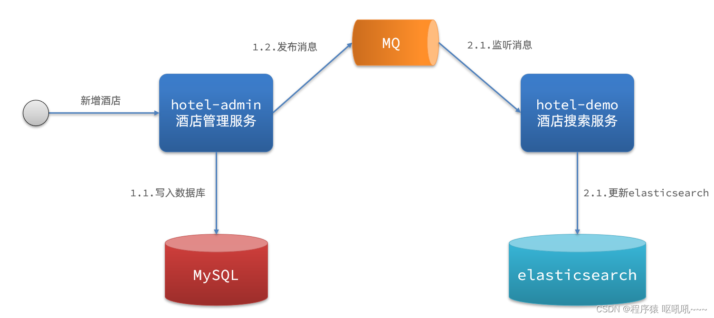

# 一、初始ElasticSearch

## 1、了解ES

### 1）elasticsearch的作用

elasticsearch是一款非常强大的开源搜索引擎，具备非常多强大功能，可以帮助我们从海量数据中快速找到需要的内容。

例如：

- 在GitHub搜索代码
- 在电商网站搜索商品
- 在谷歌搜索答案
- 在打车软件搜索附近的车

### 2）ELK技术栈

elasticsearch结合kibana、Logstash、Beats，也就是elastic stack（ELK）。被广泛应用在日志数据分析、实时监控等领域：


而elasticsearch是elastic stack的核心，负责存储、搜索、分析数据。


### 3）Lucene

elasticsearch底层是基于**lucene**来实现的。

**Lucene**是一个Java语言的搜索引擎类库，是Apache公司的顶级项目，由DougCutting于1999年研发。官网地址：https://lucene.apache.org/ 。

1）Lucene的优势：

- 易拓展
- 高性能

2）Lucene的缺点：

- 只限于Java语言开发
- 学习曲线陡峭
- 不支持水平拓展

> 相比于Lucene，elasticSearch具备下列优势：
>
> - 支持分布式，可水平拓展
> - 提供Resultful接口，可被任意语言调用

### 4）发展历史

- 2004年Shay Banon基于Lucene开发了Compass

- 2010年Shay Banon 重写了Compass，取名为Elasticsearch。

## 2、倒排索引

倒排索引的概念是基于MySQL这样的正向索引而言的。

### 1）正向索引

那么什么是正向索引呢？例如给下表（tb_goods）中的id创建索引：


如果是根据id查询，那么直接走索引，查询速度非常快。

但如果是基于title做模糊查询，只能是逐行扫描数据，流程如下：

1）用户搜索数据，条件是title符合"%手机%"

2）逐行获取数据，比如id为1的数据

3）判断数据中的title是否符合用户搜索条件

4）如果符合则放入结果集，不符合则丢弃。回到步骤1

逐行扫描，也就是全表扫描，随着数据量增加，其查询效率也会越来越低。当数据量达到数百万时，就是一场灾难。

### 2）倒排索引

倒排索引中有两个非常重要的概念：

- 文档（Document）：用来搜索的数据，其中的每一条数据就是一个文档。例如一个网页、一个商品信息

- 词条（Term）：对文档数据或用户搜索数据，利用某种算法分词，得到的具备含义的词语就是词条。例如：我是中国人，就可以分为：我、是、中国人、中国、国人这样的几个词条

**创建倒排索引**是对正向索引的一种特殊处理，流程如下：

- 将每一个文档的数据利用算法分词，得到一个个词条

- 创建表，每行数据包括词条、词条所在文档id、位置等信息

- 因为词条唯一性，可以给词条创建索引，例如hash表结构索引

如图：


倒排索引的**搜索流程**如下（以搜索"华为手机"为例）：

1）用户输入条件"华为手机"进行搜索。

2）对用户输入内容**分词**，得到词条：华为、手机。

3）拿着词条在倒排索引中查找，可以得到包含词条的文档id：1、2、3。

4）拿着文档id到正向索引中查找具体文档。

如图：


虽然要先查询倒排索引，再查询正向索引，但是无论是词条、还是文档id都建立了索引，查询速度非常快！无需全表扫描。

### 3）正向和倒排

那么为什么一个叫做正向索引，一个叫做倒排索引呢？

- **正向索引**是最传统的，根据id索引的方式。当根据词条查询时，必须先逐条获取每个文档，然后判断文档中是否包含所需要的词条，是**根据文档找词条的过程**。

- 而**倒排索引**则相反，是先找到用户要搜索的词条，根据词条得到保护词条的文档的id，然后根据id获取文档。是**根据词条找文档的过程**。

是不是恰好反过来了？

那么两者方式的优缺点是什么呢？

> **正向索引：**
>
> 优点：
>
> - 可以给多个字段创建索引
>
> - 根据索引字段搜索、排序速度非常快
>
>
> 缺点：
>
> - 根据非索引字段，或者索引字段中的部分词条查找时，只能全表扫描。
>
> **倒排索引**：
>
> 优点：
>
> - 根据词条搜索、模糊搜索时，速度非常快
>
> 缺点：
>
> - 只能给词条创建索引，而不是字段
> - 无法根据字段做排序

## 3、常见概念

elasticsearch中有很多独有的概念，与mysql中略有差别，但也有相似之处。

### 1）文档和字段

elasticsearch是面向**文档（Document）**存储的，可以是数据库中的一条商品数据，一个订单信息。文档数据会被序列化为json格式后存储在elasticsearch中：


而Json文档中往往包含很多的**字段（Field）**，类似于数据库中的列。

### 2）索引和映射

**索引（Index）**，就是相同类型的文档的集合。

例如：

- 所有用户文档，就可以组织在一起，称为用户的索引；

- 所有商品的文档，可以组织在一起，称为商品的索引；

- 所有订单的文档，可以组织在一起，称为订单的索引；


因此，我们可以把索引当做是数据库中的表。

数据库的表会有约束信息，用来定义表的结构、字段的名称、类型等信息。因此，索引库中就有**映射（mapping）**，是索引中文档的字段约束信息，类似表的结构约束。

### 3）mysql与elasticsearch

我们统一的把mysql与elasticsearch的概念做一下对比：

| **MySQL** | **Elasticsearch** | **说明**                                                     |
| --------- | ----------------- | ------------------------------------------------------------ |
| Table     | Index             | 索引(index)，就是文档的集合，类似数据库的表(table)           |
| Row       | Document          | 文档（Document），就是一条条的数据，类似数据库中的行（Row），文档都是JSON格式 |
| Column    | Field             | 字段（Field），就是JSON文档中的字段，类似数据库中的列（Column） |
| Schema    | Mapping           | Mapping（映射）是索引中文档的约束，例如字段类型约束。类似数据库的表结构（Schema） |
| SQL       | DSL               | DSL是elasticsearch提供的JSON风格的请求语句，用来操作elasticsearch，实现CRUD |

是不是说，我们学习了elasticsearch就不再需要mysql了呢？

并不是如此，两者各自有自己的擅长支出：

- Mysql：擅长事务类型操作，可以**确保数据的安全和一致性**

- Elasticsearch：擅长海量数据的**搜索、分析、计算**


因此在企业中，往往是两者结合使用：

- 对安全性要求较高的写操作，使用mysql实现

- 对查询性能要求较高的搜索需求，使用elasticsearch实现


两者再基于某种方式，实现数据的同步，保证一致性


## 4、安装

略

### 1）分词器的作用是什么？

- 创建倒排索引时对文档分词

- 用户搜索时，对输入的内容分词

### 2）IK分词器有几种模式？

- ik_smart：智能切分，粗粒度

- ik_max_word：最细切分，细粒度

### 3）IK分词器如何拓展词条？如何停用词条？

- 利用config目录的IkAnalyzer.cfg.xml文件添加拓展词典和停用词典

- 在词典中添加拓展词条或者停用词条

---


# 二、索引库操作

索引库就类似数据库表，mapping映射就类似表的结构。

我们要向es中存储数据，必须先创建“库”和“表”。

## 1、mapping映射属性

mapping是对索引库中文档的约束，常见的mapping属性包括：

- type：字段数据类型，常见的简单类型有：

  - 字符串：text（可分词的文本）、keyword（精确值，例如：品牌、国家、ip地址）

  - 数值：long、integer、short、byte、double、float、

  - 布尔：boolean

  - 日期：date

  - 对象：object

- index：是否创建索引，默认为true

- analyzer：使用哪种分词器

- properties：该字段的子字段

```json
{
    "age": 21,
    "weight": 52.1,
    "isMarried": false,
    "info": "黑马程序员Java讲师",
    "email": "zy@itcast.cn",
    "score": [99.1, 99.5, 98.9],
    "name": {
        "firstName": "云",
        "lastName": "赵"
    }
}
```

对应的每个字段映射（mapping）：

- age：类型为 integer；参与搜索，因此需要index为true；无需分词器

- weight：类型为float；参与搜索，因此需要index为true；无需分词器

- isMarried：类型为boolean；参与搜索，因此需要index为true；无需分词器

- info：类型为字符串，需要分词，因此是text；参与搜索，因此需要index为true；分词器可以用ik_smart

- email：类型为字符串，但是不需要分词，因此是keyword；不参与搜索，因此需要index为false；无需分词器

- score：虽然是数组，但是我们只看元素的类型，类型为float；参与搜索，因此需要index为true；无需分词器

- name：类型为object，需要定义多个子属性

- name.firstName；类型为字符串，但是不需要分词，因此是keyword；参与搜索，因此需要index为true；无需分词器

- name.lastName；类型为字符串，但是不需要分词，因此是keyword；参与搜索，因此需要index为true；无需分词器

## 2、索引库的CRUD

这里我们统一使用Kibana编写DSL的方式来演示。

### 1）创建索引库和映射

**基本语法：**

- 请求方式：PUT

- 请求路径：/索引库名，可以自定义

- 请求参数：mapping映射

格式：

```json
PUT /索引库名称
{
  "mappings": {
    "properties": {
      "字段名":{
        "type": "text",
        "analyzer": "ik_smart"
      },
      "字段名2":{
        "type": "keyword",
        "index": "false"
      },
      "字段名3":{
        "properties": {
          "子字段": {
            "type": "keyword"
          }
        }
      },
      // ...略
    }
  }
}
```

**示例：**

```json
PUT /heima
{
  "mappings": {
    "properties": {
      "info":{
        "type": "text",
        "analyzer": "ik_smart"
      },
      "email":{
        "type": "keyword",
        "index": "falsae"
      },
      "name":{
        "properties": {
          "firstName": {
            "type": "keyword"
          }
        }
      },
      // ... 略
    }
  }
}
```

### 2）查询索引库

**基本语法**：

- 请求方式：GET

- 请求路径：/索引库名

- 请求参数：无

格式：

`GET /索引库名`

示例：

```json
GET /heima
```

### 3）修改索引库

倒排索引结构虽然不复杂，但是一旦数据结构改变（比如改变了分词器），就需要重新创建倒排索引，这简直是灾难。因此索引库**一旦创建，无法修改mapping**。

虽然无法修改mapping中已有的字段，但是却允许添加新的字段到mapping中，因为不会对倒排索引产生影响。

**语法说明**

```json
PUT /索引库名/_mapping
{
  "properties": {
    "新字段名":{
      "type": "integer"
    }
  }
}
```

**示例**


### 4）删除索引库

**语法：**

- 请求方式：DELETE

- 请求路径：/索引库名

- 请求参数：无

**格式：**

`DELETE /索引库名`

---


# 三、文档操作

## 1、新增文档

**语法**

```json
POST /索引库名/_doc/文档id
{
    "字段1": "值1",
    "字段2": "值2",
    "字段3": {
        "子属性1": "值3",
        "子属性2": "值4"
    },
    // ...
}
```

**示例**

```json
POST /heima/_doc/1
{
    "info": "黑马程序员Java讲师",
    "email": "zy@itcast.cn",
    "name": {
        "firstName": "云",
        "lastName": "赵"
    }
}
```

**响应**


## 2、查询文档

**语法**

`GET /{索引库名称}/_doc/{id}`

**示例**

```json
GET /heima/_doc/1
```

**响应**


## 3、删除文档

**语法**

```json
DELETE /{索引库名}/_doc/id值
```

**示例**

```json
# 根据id删除数据
DELETE /heima/_doc/1
```

**响应**


## 4、修改文档

修改有两种方式：

- 全量修改：直接覆盖原来的文档

- 增量修改：修改文档中的部分字段

### 1）全量修改

全量修改是覆盖原来的文档，其本质是：

- 根据指定的id删除文档

- 新增一个相同id的文档

**注意**：如果根据id删除时，id不存在，第二步的新增也会执行，也就从修改变成了新增操作了。

**语法**

```json
PUT /{索引库名}/_doc/文档id
{
    "字段1": "值1",
    "字段2": "值2",
    // ... 略
}
```

**示例**

```json
PUT /heima/_doc/1
{
    "info": "黑马程序员高级Java讲师",
    "email": "zy@itcast.cn",
    "name": {
        "firstName": "云",
        "lastName": "赵"
    }
}
```


### 2）增量修改

增量修改是只修改指定id匹配的文档中的部分字段。

**语法：**

```json
POST /{索引库名}/_update/文档id
{
    "doc": {
         "字段名": "新的值",
    }
}
```

**示例**

```json
POST /heima/_update/1
{
  "doc": {
    "email": "ZhaoYun@itcast.cn"
  }
}
```

---


# 四、RestAPI

1）引入es的RestHighLevelClient依赖

```xml
<dependency>
    <groupId>org.elasticsearch.client</groupId>
    <artifactId>elasticsearch-rest-high-level-client</artifactId>
</dependency>
```

2）初始化RestHighLevelClient：

```java
RestHighLevelClient client = new RestHighLevelClient(RestClient.builder(
        HttpHost.create("http://192.168.150.101:9200")
));
```

## 1、操作索引

### 1）创建索引库

创建索引库的API如下：


代码分为三步：

- 1）创建Request对象。因为是创建索引库的操作，因此Request是CreateIndexRequest。
- 2）添加请求参数，其实就是DSL的JSON参数部分。因为json字符串很长，这里是定义了静态字符串常量MAPPING_TEMPLATE，让代码看起来更加优雅。

- 3）发送请求，client.indices()方法的返回值是IndicesClient类型，封装了所有与索引库操作有关的方法。

### 2）删除索引库

API如下：

```java
// 1.创建Request对象
DeleteIndexRequest request = new DeleteIndexRequest("hotel");
// 2.发送请求
client.indices().delete(request, RequestOptions.DEFAULT);
```

所以代码的差异，注意体现在Request对象上。依然是三步走：

- 1）创建Request对象。这次是DeleteIndexRequest对象

- 2）准备参数。这里是无参

- 3）发送请求。改用delete方法

### 3）判断索引库是否存在

API如下：

```java
// 1.创建Request对象
GetIndexRequest request = new GetIndexRequest("hotel");
// 2.发送请求
boolean exists = client.indices().exists(request, RequestOptions.DEFAULT);
// 3.输出
System.err.println(exists ? "索引库已经存在！" : "索引库不存在！");
```

本质就是查询，依然是三步走：

- 1）创建Request对象。这次是GetIndexRequest对象

- 2）准备参数。这里是无参

- 3）发送请求。改用exists方法

> **总结**
>
> JavaRestClient操作elasticsearch的流程基本类似。核心是client.indices()方法来获取索引库的操作对象。
>
> 索引库操作的基本步骤：
>
> - 初始化RestHighLevelClient
>
> - 创建XxxIndexRequest。XXX是Create、Get、Delete
>
> - 准备DSL（ Create时需要，其它是无参）
>
> - 发送请求。调用RestHighLevelClient#indices().xxx()方法，xxx是create、exists、delete
>

## 2、操作文档

### 1）新增文档

API如下：


可以看到与创建索引库类似，同样是三步走：

- 1）创建Request对象

- 2）准备请求参数，也就是DSL中的JSON文档

- 3）发送请求

变化的地方在于，这里直接使用client.xxx()的API，不再需要client.indices()了。

### 2）查询文档


三步走：

- 1）准备Request对象。这次是查询，所以是GetRequest

- 2）发送请求，得到结果。因为是查询，这里调用client.get()方法

- 3）解析结果，就是对JSON做反序列化

### 3）删除文档

```java
// 1.准备Request
DeleteRequest request = new DeleteRequest("hotel", "1");
// 2.发送请求
client.delete(request, RequestOptions.DEFAULT);
```

三步走：

- 1）准备Request对象，因为是删除，这次是DeleteRequest对象。要指定索引库名和id

- 2）准备参数，无参

- 3）发送请求。因为是删除，所以是client.delete()方法

### 4）修改文档

修改我们讲过两种方式：

- 全量修改：本质是先根据id删除，再新增

- 增量修改：修改文档中的指定字段值


在RestClient的API中，全量修改与新增的API完全一致，判断依据是ID：

- 如果新增时，ID已经存在，则修改

- 如果新增时，ID不存在，则新增


这里不再赘述，我们主要关注增量修改。

代码示例如图：


三步走：

- 1）准备Request对象。这次是修改，所以是UpdateRequest

- 2）准备参数。也就是JSON文档，里面包含要修改的字段

- 3）更新文档。这里调用client.update()方法

### 5）批量导入文档

批量处理BulkRequest，其本质就是将多个普通的CRUD请求组合在一起发送。

其中提供了一个add方法，用来添加其他请求：


可以看到，能添加的请求包括：

- IndexRequest，也就是新增

- UpdateRequest，也就是修改

- DeleteRequest，也就是删除

因此Bulk中添加了多个IndexRequest，就是批量新增功能了。示例：


其实还是三步走：

- 1）创建Request对象。这里是BulkRequest

- 2）准备参数。批处理的参数，就是其它Request对象，这里就是多个IndexRequest

- 3）发起请求。这里是批处理，调用的方法为client.bulk()方法

> **小结**
>
> 文档操作的基本步骤：
>
> - 初始化RestHighLevelClient
>
> - 创建XxxRequest。XXX是Index、Get、Update、Delete、Bulk
>
> - 准备参数（Index、Update、Bulk时需要）
>
> - 发送请求。调用RestHighLevelClient#.xxx()方法，xxx是index、get、update、delete、bulk
>
> - 解析结果（Get时需要）

# 五、DSL查询

## 1、DSL查询分类

Elasticsearch提供了基于JSON的DSL（[Domain Specific Language](https://www.elastic.co/guide/en/elasticsearch/reference/current/query-dsl.html)）来定义查询。常见的查询类型包括：

- 查询所有：查询出所有数据，一般测试用。例如：match_all

- 全文检索（full text）查询：利用分词器对用户输入内容分词，然后去倒排索引库中匹配。例如：

  - match_query


  - multi_match_query


- 精确查询：根据精确词条值查找数据，一般是查找keyword、数值、日期、boolean等类型字段。例如：

  - ids


  - range


  - term


- 地理（geo）查询：根据经纬度查询。例如：

  - geo_distance


  - geo_bounding_box


- 复合（compound）查询：复合查询可以将上述各种查询条件组合起来，合并查询条件。例如：

  - bool


  - function_score


查询的语法基本一致：

```json
GET /indexName/_search
{
  "query": {
    "查询类型": {
      "查询条件": "条件值"
    }
  }
}
```

我们以查询所有为例，其中：

- 查询类型为match_all

- 没有查询条件

```json
// 查询所有
GET /indexName/_search
{
  "query": {
    "match_all": {
    }
  }
}
```

其它查询无非就是**查询类型**、**查询条件**的变化。

## 2、全文检索查询

### 1）使用场景

全文检索查询的基本流程如下：

- 对用户搜索的内容做分词，得到词条

- 根据词条去倒排索引库中匹配，得到文档id

- 根据文档id找到文档，返回给用户


比较常用的场景包括：

- 商城的输入框搜索

- 百度输入框搜索

- 因为是拿着词条去匹配，因此参与搜索的字段也必须是可分词的text类型的字段。

### 2）基本语法

常见的全文检索查询包括：

- match查询：单字段查询

- multi_match查询：多字段查询，任意一个字段符合条件就算符合查询条件

match查询语法如下：

```json
GET /indexName/_search
{
  "query": {
    "match": {
      "FIELD": "TEXT"
    }
  }
}
```

mulit_match语法如下：

```json
GET /indexName/_search
{
  "query": {
    "multi_match": {
      "query": "TEXT",
      "fields": ["FIELD1", " FIELD12"]
    }
  }
}
```

### 3）示例

match查询示例：


multi_match查询示例：


可以看到，两种查询结果是一样的，为什么？

因为将brand、name、business值都利用copy_to复制到了all字段中。因此你根据三个字段搜索，和根据all字段搜索效果当然一样了。

但是，搜索字段越多，对查询性能影响越大，因此建议采用copy_to，然后单字段查询的方式。

### 4）总结

match和multi_match的区别是什么？

- match：根据一个字段查询

- multi_match：根据多个字段查询，参与查询字段越多，查询性能越差

## 3、精准查询

精确查询一般是查找keyword、数值、日期、boolean等类型字段。所以**不会**对搜索条件分词。常见的有：

- term：根据词条精确值查询

- range：根据值的范围查询

### 1）term查询

因为精确查询的字段搜是不分词的字段，因此查询的条件也必须是**不分词**的词条。查询时，用户输入的内容跟自动值完全匹配时才认为符合条件。如果用户输入的内容过多，反而搜索不到数据。

语法说明：

```json
// term查询
GET /indexName/_search
{
  "query": {
    "term": {
      "FIELD": {
        "value": "VALUE"
      }
    }
  }
}
```

示例：

当我搜索的是精确词条时，能正确查询出结果：


但是，当我搜索的内容不是词条，而是多个词语形成的短语时，反而搜索不到：


### 2）range查询

范围查询，一般应用在对数值类型做范围过滤的时候。比如做价格范围过滤。

基本语法：

```json
// range查询
GET /indexName/_search
{
  "query": {
    "range": {
      "FIELD": {
        "gte": 10, // 这里的gte代表大于等于，gt则代表大于
        "lte": 20 // lte代表小于等于，lt则代表小于
      }
    }
  }
}
```

示例：


### 3）总结

精确查询常见的有哪些？

- term查询：根据词条精确匹配，一般搜索keyword类型、数值类型、布尔类型、日期类型字段

- range查询：根据数值范围查询，可以是数值、日期的范围

## 4、地理坐标查询

所谓的地理坐标查询，其实就是根据经纬度查询，官方文档：https://www.elastic.co/guide/en/elasticsearch/reference/current/geo-queries.html

常见的使用场景包括：

- 携程：搜索我附近的酒店

- 滴滴：搜索我附近的出租车

- 微信：搜索我附近的人

附近的酒店：


附近的车：


### 1）矩形范围查询

矩形范围查询，也就是geo_bounding_box查询，查询坐标落在某个矩形范围的所有文档：


查询时，需要指定矩形的**左上**、**右下**两个点的坐标，然后画出一个矩形，落在该矩形内的都是符合条件的点。

语法如下：

```json
// geo_bounding_box查询
GET /indexName/_search
{
  "query": {
    "geo_bounding_box": {
      "FIELD": {
        "top_left": { // 左上点
          "lat": 31.1,
          "lon": 121.5
        },
        "bottom_right": { // 右下点
          "lat": 30.9,
          "lon": 121.7
        }
      }
    }
  }
}
```

这种并不符合“附近的人”这样的需求，所以我们就不做了。

### 2）附近查询

附近查询，也叫做距离查询（geo_distance）：查询到指定中心点小于某个距离值的所有文档。

换句话来说，在地图上找一个点作为圆心，以指定距离为半径，画一个圆，落在圆内的坐标都算符合条件：


语法说明：

```json
// geo_distance 查询
GET /indexName/_search
{
  "query": {
    "geo_distance": {
      "distance": "15km", // 半径
      "FIELD": "31.21,121.5" // 圆心
    }
  }
}
```

示例：

我们先搜索陆家嘴附近15km的酒店：


发现共有47家酒店。

然后把半径缩短到3公里：


可以发现，搜索到的酒店数量减少到了5家。

## 5、复合查询

复合（compound）查询：复合查询可以将其它简单查询组合起来，实现更复杂的搜索逻辑。常见的有两种：

- fuction score：算分函数查询，可以控制文档相关性算分，控制文档排名

- bool query：布尔查询，利用逻辑关系组合多个其它的查询，实现复杂搜索

### 1）相关性算分

当我们利用match查询时，文档结果会根据与搜索词条的关联度打分（_score），返回结果时按照分值降序排列。

例如，我们搜索 "虹桥如家"，结果如下：

```json
[
  {
    "_score" : 17.850193,
    "_source" : {
      "name" : "虹桥如家酒店真不错",
    }
  },
  {
    "_score" : 12.259849,
    "_source" : {
      "name" : "外滩如家酒店真不错",
    }
  },
  {
    "_score" : 11.91091,
    "_source" : {
      "name" : "迪士尼如家酒店真不错",
    }
  }
]
```

在elasticsearch中，早期使用的打分算法是TF-IDF算法，公式如下：


在后来的5.1版本升级中，elasticsearch将算法改进为BM25算法，公式如下：


TF-IDF算法有一各缺陷，就是词条频率越高，文档得分也会越高，单个词条对文档影响较大。而BM25则会让单个词条的算分有一个上限，曲线更加平滑：


小结：elasticsearch会根据词条和文档的相关度做打分，算法由两种：

- TF-IDF算法

- BM25算法，elasticsearch5.1版本后采用的算法

### 2）算分函数查询

根据相关度打分是比较合理的需求，但**合理的不一定是产品经理需要**的。

以百度为例，你搜索的结果中，并不是相关度越高排名越靠前，而是谁掏的钱多排名就越靠前。如图：


要想认为控制相关性算分，就需要利用elasticsearch中的function score 查询了。

#### 1.1 语法说明


function score 查询中包含四部分内容：

- **原始查询条件：**query部分，基于这个条件搜索文档，并且基于BM25算法给文档打分，原始算分（query score)
- **过滤条件：**filter部分，符合该条件的文档才会重新算分
- **算分函数：**符合filter条件的文档要根据这个函数做运算，得到的函数算分（function score），有四种函数
- **weight：**函数结果是常量
- **field_value_factor：**以文档中的某个字段值作为函数结果
- **random_score：**以随机数作为函数结果
- **script_score：**自定义算分函数算法
- **运算模式：**算分函数的结果、原始查询的相关性算分，两者之间的运算方式，包括：
- **multiply：**相乘
- **replace：**用function score替换query score
- 其它，例如：sum、avg、max、min

function score的运行流程如下：

1）根据原始条件查询搜索文档，并且计算相关性算分，称为原始算分（query score）

2）根据过滤条件，过滤文档

3）符合过滤条件的文档，基于算分函数运算，得到函数算分（function score）

4）将原始算分（query score）和函数算分（function score）基于运算模式做运算，得到最终结果，作为相关性算分

因此，其中的关键点是：

- 过滤条件：决定哪些文档的算分被修改

- 算分函数：决定函数算分的算法

- 运算模式：决定最终算分结果

function score的运行流程如下：

1）根据原始条件查询搜索文档，并且计算相关性算分，称为原始算分（query score）

2）根据过滤条件，过滤文档

3）符合过滤条件的文档，基于算分函数运算，得到函数算分（function score）

4）将原始算分（query score）和函数算分（function score）基于运算模式做运算，得到最终结果，作为相关性算分。

因此，其中的关键点是：

- 过滤条件：决定哪些文档的算分被修改

- 算分函数：决定函数算分的算法

- 运算模式：决定最终算分结果

#### 1.2 示例

需求：给“如家”这个品牌的酒店排名靠前一些

翻译一下这个需求，转换为之前说的四个要点：

- 原始条件：不确定，可以任意变化

- 过滤条件：brand = "如家"

- 算分函数：可以简单粗暴，直接给固定的算分结果，weight

- 运算模式：比如求和


因此最终的DSL语句如下：

```json
GET /hotel/_search
{
  "query": {
    "function_score": {
      "query": {  .... }, // 原始查询，可以是任意条件
      "functions": [ // 算分函数
        {
          "filter": { // 满足的条件，品牌必须是如家
            "term": {
              "brand": "如家"
            }
          },
          "weight": 2 // 算分权重为2
        }
      ],
      "boost_mode": "sum" // 加权模式，求和
    }
  }
}
```

测试，在未添加算分函数时，如家得分如下：


添加了算分函数后，如家得分就提升了：


#### 1.3 小结

function score query定义的三要素是什么？

- 过滤条件：哪些文档要加分

- 算分函数：如何计算function score

- 加权方式：function score 与 query score如何运算

### 3）布尔查询

布尔查询是一个或多个查询子句的组合，每一个子句就是一个**子查询**。子查询的组合方式有：

- must：必须匹配每个子查询，类似“与”

- should：选择性匹配子查询，类似“或”

- must_not：必须不匹配，**不参与算分**，类似“非”

- filter：必须匹配，**不参与算分**

比如在搜索酒店时，除了关键字搜索外，我们还可能根据品牌、价格、城市等字段做过滤：


每一个不同的字段，其查询的条件、方式都不一样，必须是多个不同的查询，而要组合这些查询，就必须用bool查询了。

需要注意的是，搜索时，参与打分的字段越多，查询的性能也越差。因此这种多条件查询时，建议这样做：

- 搜索框的关键字搜索，是全文检索查询，使用must查询，参与算分

- 其它过滤条件，采用filter查询。不参与算分

#### 1.1 语法示例

```json
GET /hotel/_search
{
  "query": {
    "bool": {
      "must": [
        {"term": {"city": "上海" }}
      ],
      "should": [
        {"term": {"brand": "皇冠假日" }},
        {"term": {"brand": "华美达" }}
      ],
      "must_not": [
        { "range": { "price": { "lte": 500 } }}
      ],
      "filter": [
        { "range": {"score": { "gte": 45 } }}
      ]
    }
  }
}
```

#### 1.2 示例

需求：搜索名字包含“如家”，价格不高于400，在坐标31.21,121.5周围10km范围内的酒店。

分析：

- 名称搜索，属于全文检索查询，应该参与算分。放到must中

- 价格不高于400，用range查询，属于过滤条件，不参与算分。放到must_not中

- 周围10km范围内，用geo_distance查询，属于过滤条件，不参与算分。放到filter中


#### 1.3 小结

bool查询有几种逻辑关系？

- must：必须匹配的条件，可以理解为“与”

- should：选择性匹配的条件，可以理解为“或”

- must_not：必须不匹配的条件，不参与打分

- filter：必须匹配的条件，不参与打分


---

# 六、搜索结果处理

搜索的结果可以按照用户指定的方式去处理或展示。

## 1、排序

elasticsearch默认是根据相关度算分（_score）来排序，但是也支持自定义方式对搜索[结果排序](https://www.elastic.co/guide/en/elasticsearch/reference/current/sort-search-results.html)。可以排序字段类型有：keyword类型、数值类型、地理坐标类型、日期类型等。

### 1）普通字段排序

keyword、数值、日期类型排序的语法基本一致。

**语法**

```json
GET /indexName/_search
{
  "query": {
    "match_all": {}
  },
  "sort": [
    {
      "FIELD": "desc"  // 排序字段、排序方式ASC、DESC
    }
  ]
}
```

排序条件是一个数组，也就是可以写多个排序条件。按照声明的顺序，当第一个条件相等时，再按照第二个条件排序，以此类推。

**示例**

需求描述：酒店数据按照用户评价（score)降序排序，评价相同的按照价格(price)升序排序


### 2）地理坐标排序

地理坐标排序略有不同。

**语法说明**：

```json
GET /indexName/_search
{
  "query": {
    "match_all": {}
  },
  "sort": [
    {
      "_geo_distance" : {
          "FIELD" : "纬度，经度", // 文档中geo_point类型的字段名、目标坐标点
          "order" : "asc", // 排序方式
          "unit" : "km" // 排序的距离单位
      }
    }
  ]
}
```

这个查询的含义是：

- 指定一个坐标，作为目标点

- 计算每一个文档中，指定字段（必须是geo_point类型）的坐标 到目标点的距离是多少

- 根据距离排序

**示例**

需求描述：实现对酒店数据按照到你的位置坐标的距离升序排序

提示：获取你的位置的经纬度的方式：https://lbs.amap.com/demo/jsapi-v2/example/map/click-to-get-lnglat/

假设我的位置是：31.034661，121.612282，寻找我周围距离最近的酒店。

## 2、分页

elasticsearch 默认情况下只返回top10的数据。而如果要查询更多数据就需要修改分页参数了。elasticsearch中通过修改from、size参数来控制要返回的分页结果：

- from：从第几个文档开始

- size：总共查询几个文档

类似于mysql中的limit ?, ?

### 1）基本的分页

分页的基本语法如下：

```json
GET /hotel/_search
{
  "query": {
    "match_all": {}
  },
  "from": 0, // 分页开始的位置，默认为0
  "size": 10, // 期望获取的文档总数
  "sort": [
    {"price": "asc"}
  ]
}
```

### 2）深度分页问题

现在，我要查询990~1000的数据，查询逻辑要这么写：

```json
GET /hotel/_search
{
  "query": {
    "match_all": {}
  },
  "from": 990, // 分页开始的位置，默认为0
  "size": 10, // 期望获取的文档总数
  "sort": [
    {"price": "asc"}
  ]
}
```

这里是查询990开始的数据，也就是 第990~第1000条 数据。

不过，elasticsearch内部分页时，必须先查询 0~1000条，然后截取其中的990 ~ 1000的这10条：


查询TOP1000，如果es是单点模式，这并无太大影响。

但是elasticsearch将来一定是集群，例如我集群有5个节点，我要查询TOP1000的数据，并不是每个节点查询200条就可以了。(ES是分片存储的方式)

因为节点A的TOP200，在另一个节点可能排到10000名以外了。

因此要想获取整个集群的TOP1000，必须先查询出每个节点的TOP1000，汇总结果后，重新排名，重新截取TOP1000。


那如果我要查询9900~10000的数据呢？是不是要先查询TOP10000呢？那每个节点都要查询10000条？汇总到内存中？

当查询分页深度较大时，汇总数据过多，对内存和CPU会产生非常大的压力，因此elasticsearch会禁止from+ size 超过10000的请求。

针对深度分页，ES提供了两种解决方案，官方文档：

- search after：分页时需要排序，原理是从上一次的排序值开始，查询下一页数据。官方推荐使用的方式。

- scroll：原理将排序后的文档id形成快照，保存在内存。官方已经不推荐使用。


### 3）小结

分页查询的常见实现方案以及优缺点：

from + size：

- 优点：支持随机翻页

- 缺点：深度分页问题，默认查询上限（from + size）是10000

- 场景：百度、京东、谷歌、淘宝这样的随机翻页搜索


after search：

- 优点：没有查询上限（单次查询的size不超过10000）

- 缺点：只能向后逐页查询，不支持随机翻页

- 场景：没有随机翻页需求的搜索，例如手机向下滚动翻页


scroll：

- 优点：没有查询上限（单次查询的size不超过10000）

- 缺点：会有额外内存消耗，并且搜索结果是非实时的

- 场景：海量数据的获取和迁移。从ES7.1开始不推荐，建议用 after search方案。

## 3、高亮

### 1）高亮原理

什么是高亮显示呢？

我们在百度，京东搜索时，关键字会变成红色，比较醒目，这叫高亮显示：


高亮显示的实现分为两步：

- 1）给文档中的所有关键字都添加一个标签，例如<em>标签

- 2）页面给<em>标签编写CSS样式

### 2）实现高亮

高亮的语法：

```json
GET /hotel/_search
{
  "query": {
    "match": {
      "FIELD": "TEXT" // 查询条件，高亮一定要使用全文检索查询
    }
  },
  "highlight": {
    "fields": { // 指定要高亮的字段
      "FIELD": {
        "pre_tags": "<em>",  // 用来标记高亮字段的前置标签
        "post_tags": "</em>" // 用来标记高亮字段的后置标签
      }
    }
  }
}
```

**注意**

- 高亮是对关键字高亮，因此**搜索条件必须带有关键字**，而不能是范围这样的查询。

- 默认情况下，**高亮的字段，必须与搜索指定的字段一致**，否则无法高亮

- 如果要对非搜索字段高亮，则需要添加一个属性：required_field_match=false

**示例**


## 4、聚合

**聚合（aggregations）：**可以让我们极其方便的实现对数据的统计、分析、运算。例如：

- 什么品牌的手机最受欢迎？

- 这些手机的平均价格、最高价格、最低价格？

- 这些手机每月的销售情况如何？

实现这些统计功能的比数据库的sql要方便的多，而且查询速度非常快，可以实现近实时搜索效果。

### 1）聚合的种类

聚合常见的有三类：

- **桶（Bucket）**聚合：用来对文档做分组
  - TermAggregation：按照文档字段值分组，例如按照品牌值分组、按照国家分组

  - Date Histogram：按照日期阶梯分组，例如一周为一组，或者一月为一组

- **度量（Metric）**聚合：用以计算一些值，比如：最大值、最小值、平均值等

  - Avg：求平均值

  - Max：求最大值

  - Min：求最小值

  - Stats：同时求max、min、avg、sum等

- **管道（pipeline）**聚合：其它聚合的结果为基础做聚合

> **注意：**参加聚合的字段必须是keyword、日期、数值、布尔类型

### 2）Bucket聚合语法

语法如下：

```json
GET /hotel/_search
{
  "size": 0,  // 设置size为0，结果中不包含文档，只包含聚合结果
  "aggs": { // 定义聚合
    "brandAgg": { //给聚合起个名字
      "terms": { // 聚合的类型，按照品牌值聚合，所以选择term
        "field": "brand", // 参与聚合的字段
        "size": 20 // 希望获取的聚合结果数量
      }
    }
  }
}
```

结果如图：


### 3）聚合结果排序

默认情况下，Bucket聚合会统计Bucket内的文档数量，记为_count，并且按照_count降序排序。

我们可以指定order属性，自定义聚合的排序方式：

```json
GET /hotel/_search
{
  "size": 0, 
  "aggs": {
    "brandAgg": {
      "terms": {
        "field": "brand",
        "order": {
          "_count": "asc" // 按照_count升序排列
        },
        "size": 20
      }
    }
  }
}
```

### 4）限定聚合范围

默认情况下，Bucket聚合是对索引库的所有文档做聚合，但真实场景下，用户会输入搜索条件，因此聚合必须是对搜索结果聚合。那么聚合必须添加限定条件。

我们可以限定要聚合的文档范围，只要添加query条件即可：

```json
GET /hotel/_search
{
  "query": {
    "range": {
      "price": {
        "lte": 200 // 只对200元以下的文档聚合
      }
    }
  }, 
  "size": 0, 
  "aggs": {
    "brandAgg": {
      "terms": {
        "field": "brand",
        "size": 20
      }
    }
  }
}
```

这次，聚合得到的品牌明显变少了：


### 5）Metric聚合语法

上节课，我们对酒店按照品牌分组，形成了一个个桶。现在我们需要对桶内的酒店做运算，获取每个品牌的用户评分的min、max、avg等值。

这就要用到Metric聚合了，例如stat聚合：就可以获取min、max、avg等结果。

语法如下：

```json
GET /hotel/_search
{
  "size": 0, 
  "aggs": {
    "brandAgg": { 
      "terms": { 
        "field": "brand", 
        "size": 20
      },
      "aggs": { // 是brands聚合的子聚合，也就是分组后对每组分别计算
        "score_stats": { // 聚合名称
          "stats": { // 聚合类型，这里stats可以计算min、max、avg等
            "field": "score" // 聚合字段，这里是score
          }
        }
      }
    }
  }
}
```

这次的score_stats聚合是在brandAgg的聚合内部嵌套的子聚合。因为我们需要在每个桶分别计算。

另外，我们还可以给聚合结果做个排序，例如按照每个桶的酒店平均分做排序：


## 总结

查询的DSL是一个大的JSON对象，包含下列属性：

- query：查询条件
- from和size：分页条件
- sort：排序条件
- highlight：高亮条件
- aggs：聚合
  - 聚合必须的三要素：聚合名称、聚合类型、聚合字段；
  - 聚合可配置属性：
    - size：指定聚合结果数量
    - order：指定聚合结果排序方式
    - field：指定聚合字段


示例：


---

# 七、RestClient查询文档

文档的查询同样适用昨天学习的 RestHighLevelClient对象，基本步骤包括：

- 1）准备Request对象

- 2）准备请求参数

- 3）发起请求

- 4）解析响应

## 1、快速入门

我们以match_all查询为例

### 1）发起查询请求


代码解读：

- 第一步，创建SearchRequest对象，指定索引库名

- 第二步，利用request.source()构建DSL，DSL中可以包含查询、分页、排序、高亮等

- query()：代表查询条件，利用QueryBuilders.matchAllQuery()构建一个match_all查询的DSL

- 第三步，利用client.search()发送请求，得到响应

这里关键的API有两个，一个是request.source()，其中包含了查询、排序、分页、高亮等所有功能：


另一个是QueryBuilders，其中包含match、term、function_score、bool等各种查询：


### 2）解析响应

响应结果的解析：


elasticsearch返回的结果是一个JSON字符串，结构包含：

- hits：命中的结果

  - total：总条数，其中的value是具体的总条数值

  - max_score：所有结果中得分最高的文档的相关性算分

  - hits：搜索结果的文档数组，其中的每个文档都是一个json对象
    - _source：文档中的原始数据，也是json对象

因此，我们解析响应结果，就是逐层解析JSON字符串，流程如下：

- SearchHits：通过response.getHits()获取，就是JSON中的最外层的hits，代表命中的结果

  - SearchHits#getTotalHits().value：获取总条数信息

  - SearchHits#getHits()：获取SearchHit数组，也就是文档数组

    - SearchHit#getSourceAsString()：获取文档结果中的_source，也就是原始的json文档数据


### 3）完整代码

完整代码如下：

```java
@Test
void testMatchAll() throws IOException {
    // 1.准备Request
    SearchRequest request = new SearchRequest("hotel");
    // 2.准备DSL
    request.source()
        .query(QueryBuilders.matchAllQuery());
    // 3.发送请求
    SearchResponse response = client.search(request, RequestOptions.DEFAULT);
 
    // 4.解析响应
    handleResponse(response);
}
 
private void handleResponse(SearchResponse response) {
    // 4.解析响应
    SearchHits searchHits = response.getHits();
    // 4.1.获取总条数
    long total = searchHits.getTotalHits().value;
    System.out.println("共搜索到" + total + "条数据");
    // 4.2.文档数组
    SearchHit[] hits = searchHits.getHits();
    // 4.3.遍历
    for (SearchHit hit : hits) {
        // 获取文档source
        String json = hit.getSourceAsString();
        // 反序列化
        HotelDoc hotelDoc = JSON.parseObject(json, HotelDoc.class);
        System.out.println("hotelDoc = " + hotelDoc);
    }
}
```

### 4）总结

查询的基本步骤是：

1. 创建SearchRequest对象

2. 准备Request.source()，也就是DSL。


- ① QueryBuilders来构建查询条件

- ② 传入Request.source() 的 query() 方法


3. 发送请求，得到结果

4. 解析结果（参考JSON结果，从外到内，逐层解析）

## 2、match查询

全文检索的match和multi_match查询与match_all的API基本一致。差别是查询条件，也就是query的部分。


因此，Java代码上的差异主要是request.source().query()中的参数了。同样是利用QueryBuilders提供的方法：


而结果解析代码则完全一致，可以抽取并共享。

完整代码如下：

```java
@Test
void testMatch() throws IOException {
    // 1.准备Request
    SearchRequest request = new SearchRequest("hotel");
    // 2.准备DSL
    request.source()
        .query(QueryBuilders.matchQuery("all", "如家"));
    // 3.发送请求
    SearchResponse response = client.search(request, RequestOptions.DEFAULT);
    // 4.解析响应
    handleResponse(response);
 
}
```

## 3、精确查询

精确查询主要是两者：

- term：词条精确匹配

- range：范围查询

与之前的查询相比，差异同样在查询条件，其它都一样。

查询条件构造的API如下：


## 4、布尔查询

布尔查询是用must、must_not、filter等方式组合其它查询，代码示例如下：


可以看到，API与其它查询的差别同样是在查询条件的构建，QueryBuilders，结果解析等其他代码完全不变。

完整代码如下：

```java
@Test
void testBool() throws IOException {
    // 1.准备Request
    SearchRequest request = new SearchRequest("hotel");
    // 2.准备DSL
    // 2.1.准备BooleanQuery
    BoolQueryBuilder boolQuery = QueryBuilders.boolQuery();
    // 2.2.添加term
    boolQuery.must(QueryBuilders.termQuery("city", "杭州"));
    // 2.3.添加range
    boolQuery.filter(QueryBuilders.rangeQuery("price").lte(250));
 
    request.source().query(boolQuery);
    // 3.发送请求
    SearchResponse response = client.search(request, RequestOptions.DEFAULT);
    // 4.解析响应
    handleResponse(response);
 
}
```

## 5、排序、分页

搜索结果的排序和分页是与query同级的参数，因此同样是使用request.source()来设置。

对应的API如下：


完整代码示例：

```java
@Test
void testPageAndSort() throws IOException {
    // 页码，每页大小
    int page = 1, size = 5;
 
    // 1.准备Request
    SearchRequest request = new SearchRequest("hotel");
    // 2.准备DSL
    // 2.1.query
    request.source().query(QueryBuilders.matchAllQuery());
    // 2.2.排序 sort
    request.source().sort("price", SortOrder.ASC);
    // 2.3.分页 from、size
    request.source().from((page - 1) * size).size(5);
    // 3.发送请求
    SearchResponse response = client.search(request, RequestOptions.DEFAULT);
    // 4.解析响应
    handleResponse(response);
 
}
```

## 6、高亮

高亮的代码与之前代码差异较大，有两点：

- 查询的DSL：其中除了查询条件，还需要添加高亮条件，同样是与query同级。

- 结果解析：结果除了要解析_source文档数据，还要解析高亮结果

### 1）高亮请求构建

高亮请求的构建API如下：


上述代码省略了查询条件部分，但是大家不要忘了：高亮查询必须使用全文检索查询，并且要有搜索关键字，将来才可以对关键字高亮。

完整代码如下：

```java
@Test
void testHighlight() throws IOException {
    // 1.准备Request
    SearchRequest request = new SearchRequest("hotel");
    // 2.准备DSL
    // 2.1.query
    request.source().query(QueryBuilders.matchQuery("all", "如家"));
    // 2.2.高亮
    request.source().highlighter(new HighlightBuilder().field("name").requireFieldMatch(false));
    // 3.发送请求
    SearchResponse response = client.search(request, RequestOptions.DEFAULT);
    // 4.解析响应
    handleResponse(response);
}
```

### 2）高亮结果解析

高亮的结果与查询的文档结果默认是分离的，并不在一起。

因此解析高亮的代码需要额外处理：


代码解读：

- 第一步：从结果中获取source。hit.getSourceAsString()，这部分是非高亮结果，json字符串。还需要反序列为HotelDoc对象

- 第二步：获取高亮结果。hit.getHighlightFields()，返回值是一个Map，key是高亮字段名称，值是HighlightField对象，代表高亮值

- 第三步：从map中根据高亮字段名称，获取高亮字段值对象HighlightField

- 第四步：从HighlightField中获取Fragments，并且转为字符串。这部分就是真正的高亮字符串了

- 第五步：用高亮的结果替换HotelDoc中的非高亮结果


完整代码如下：

```java
private void handleResponse(SearchResponse response) {
    // 4.解析响应
    SearchHits searchHits = response.getHits();
    // 4.1.获取总条数
    long total = searchHits.getTotalHits().value;
    System.out.println("共搜索到" + total + "条数据");
    // 4.2.文档数组
    SearchHit[] hits = searchHits.getHits();
    // 4.3.遍历
    for (SearchHit hit : hits) {
        // 获取文档source
        String json = hit.getSourceAsString();
        // 反序列化
        HotelDoc hotelDoc = JSON.parseObject(json, HotelDoc.class);
        // 获取高亮结果
        Map<String, HighlightField> highlightFields = hit.getHighlightFields();
        if (!CollectionUtils.isEmpty(highlightFields)) {
            // 根据字段名获取高亮结果
            HighlightField highlightField = highlightFields.get("name");
            if (highlightField != null) {
                // 获取高亮值
                String name = highlightField.getFragments()[0].string();
                // 覆盖非高亮结果
                hotelDoc.setName(name);
            }
        }
        System.out.println("hotelDoc = " + hotelDoc);
    }
}
```

### 3）高亮通用代码

```java
public static <T> List<T> handleResponse2(SearchResponse response, Class<T> clazz) {
    List<T> resultList = new ArrayList<>();

    // 获取搜索命中结果
    SearchHits hits = response.getHits();
    TotalHits totalHits = hits.getTotalHits();
    SearchHit[] hitArray = hits.getHits();

    for (SearchHit searchHit : hitArray) {
        // JSON 解析成指定的泛型对象
        String json = searchHit.getSourceAsString();
        T entity = JSON.parseObject(json, clazz);
        resultList.add(entity);


        // 处理高亮字段
        Map<String, HighlightField> highlightFields = searchHit.getHighlightFields();
        if (highlightFields != null && !highlightFields.isEmpty()) {
            highlightFields.forEach((fieldName, highlightField) -> {
                String highlightedText = highlightField.fragments()[0].toString();
                setFieldValue(entity, fieldName, highlightedText);
            });
        }
        // 打印解析对象
        System.out.println(entity);
    }

    System.out.println("Total Hits: " + totalHits.value);
    return resultList;
}

private static <T> void setFieldValue(T entity, String fieldName, String value) {
    try {
        Field field = entity.getClass().getDeclaredField(fieldName);
        field.setAccessible(true);
        field.set(entity, value);
    } catch (NoSuchFieldException | IllegalAccessException e) {
        System.err.println("Error setting field value: " + e.getMessage());
    }
}
```

## 7、聚合

聚合条件与query条件同级别，因此需要使用request.source()来指定聚合条件。

聚合条件的语法：


聚合的结果也与查询结果不同，API也比较特殊。不过同样是JSON逐层解析：


# 八、高级用法

## 1、自动补全

### 1）拼音分词器

要实现根据字母做补全，就必须对文档按照拼音分词。在GitHub上恰好有elasticsearch的拼音分词插件。地址：https://github.com/medcl/elasticsearch-analysis-pinyin


安装方式与IK分词器一样，分三步：

①解压

②上传到虚拟机中，elasticsearch的plugin目录

③重启elasticsearch

④测试

**测试用法如下：**

```json
POST /_analyze
{
  "text": "如家酒店还不错",
  "analyzer": "pinyin"
}
```

**结果：**


### 2）自定义分词器

默认的拼音分词器会将每个汉字单独分为拼音，而我们希望的是每个词条形成一组拼音，需要对拼音分词器做个性化定制，形成自定义分词器。

elasticsearch中分词器（analyzer）的组成包含三部分：

- character filters：在tokenizer之前对文本进行处理。例如删除字符、替换字符

- tokenizer：将文本按照一定的规则切割成词条（term）。例如keyword，就是不分词；还有ik_smart

- tokenizer filter：将tokenizer输出的词条做进一步处理。例如大小写转换、同义词处理、拼音处理等


文档分词时会依次由这三部分来处理文档：


声明自定义分词器的语法如下：

```json
PUT /test
{
  "settings": {
    "analysis": {
      "analyzer": { // 自定义分词器
        "my_analyzer": {  // 分词器名称
          "tokenizer": "ik_max_word",
          "filter": "py"
        }
      },
      "filter": { // 自定义tokenizer filter
        "py": { // 过滤器名称
          "type": "pinyin", // 过滤器类型，这里是pinyin
		  	 "keep_full_pinyin": false,
          "keep_joined_full_pinyin": true,
          "keep_original": true,
          "limit_first_letter_length": 16,
          "remove_duplicated_term": true,
          "none_chinese_pinyin_tokenize": false
        }
      }
    }
  },
  "mappings": {
    "properties": {
      "name": {
        "type": "text",
        "analyzer": "my_analyzer",
        "search_analyzer": "ik_smart"
      }
    }
  }
}
```

测试：


**总结**

如何使用拼音分词器？

- ①下载pinyin分词器

- ②解压并放到elasticsearch的plugin目录

- ③重启即可


如何自定义分词器？

- ①创建索引库时，在settings中配置，可以包含三部分

- ②character filter

- ③tokenizer

- ④filter


拼音分词器注意事项？

为了避免搜索到同音字，搜索时不要使用拼音分词器

### 3）自动补全查询

elasticsearch提供了Completion Suggester查询来实现自动补全功能。这个查询会匹配以用户输入内容开头的词条并返回。为了提高补全查询的效率，对于文档中字段的类型有一些约束：

- 参与补全查询的字段必须是completion类型。

- 字段的内容一般是用来补全的多个词条形成的数组。


比如，一个这样的索引库：

```json
// 创建索引库
PUT test
{
  "mappings": {
    "properties": {
      "title":{
        "type": "completion"
      }
    }
  }
}
```

然后插入下面的数据：

```json
// 示例数据
POST test/_doc
{
  "title": ["Sony", "WH-1000XM3"]
}
POST test/_doc
{
  "title": ["SK-II", "PITERA"]
}
POST test/_doc
{
  "title": ["Nintendo", "switch"]
}
```

查询的DSL语句如下：

```json
// 自动补全查询
GET /test/_search
{
  "suggest": {
    "title_suggest": {
      "text": "s", // 关键字
      "completion": {
        "field": "title", // 补全查询的字段
        "skip_duplicates": true, // 跳过重复的
        "size": 10 // 获取前10条结果
      }
    }
  }
}
```

代码示例：


## 2、数据同步

elasticsearch中的酒店数据来自于mysql数据库，因此mysql数据发生改变时，elasticsearch也必须跟着改变，这个就是elasticsearch与mysql之间的**数据同步**。

> **常见的数据同步方案有三种：**
>
> - 同步调用
>
> - 异步通知
>
> - 监听binlog

### 1）同步调用


基本步骤如下：

- hotel-demo对外提供接口，用来修改elasticsearch中的数据

- 酒店管理服务在完成数据库操作后，直接调用hotel-demo提供的接口，

### 2）异步通知



流程如下：

- hotel-admin对mysql数据库数据完成增、删、改后，发送MQ消息

- hotel-demo监听MQ，接收到消息后完成elasticsearch数据修改

### 3）监听binlog


流程如下：

- 给mysql开启binlog功能

- mysql完成增、删、改操作都会记录在binlog中

- hotel-demo基于canal监听binlog变化，实时更新elasticsearch中的内容

### 4）优缺点

方式一：同步调用

- 优点：实现简单，粗暴

- 缺点：业务耦合度高

方式二：异步通知

- 优点：低耦合，实现难度一般

- 缺点：依赖mq的可靠性

方式三：监听binlog

- 优点：完全解除服务间耦合

- 缺点：开启binlog增加数据库负担、实现复杂度高

### 5）MQ同步案例

#### 1.1 引入依赖

```xml
<!--amqp-->
<dependency>
    <groupId>org.springframework.boot</groupId>
    <artifactId>spring-boot-starter-amqp</artifactId>
</dependency>
```

#### 1.2 声明队列交换机名称

在hotel-admin和hotel-demo中的cn.itcast.hotel.constatnts包下新建一个类MqConstants：

```java
package cn.itcast.hotel.constatnts;
 
    public class MqConstants {
    /**
     * 交换机
     */
    public final static String HOTEL_EXCHANGE = "hotel.topic";
    /**
     * 监听新增和修改的队列
     */
    public final static String HOTEL_INSERT_QUEUE = "hotel.insert.queue";
    /**
     * 监听删除的队列
     */
    public final static String HOTEL_DELETE_QUEUE = "hotel.delete.queue";
    /**
     * 新增或修改的RoutingKey
     */
    public final static String HOTEL_INSERT_KEY = "hotel.insert";
    /**
     * 删除的RoutingKey
     */
    public final static String HOTEL_DELETE_KEY = "hotel.delete";
}
```

#### 1.3 声明队列交换机

```java
package cn.itcast.hotel.config;
 
import cn.itcast.hotel.constants.MqConstants;
import org.springframework.amqp.core.Binding;
import org.springframework.amqp.core.BindingBuilder;
import org.springframework.amqp.core.Queue;
import org.springframework.amqp.core.TopicExchange;
import org.springframework.context.annotation.Bean;
import org.springframework.context.annotation.Configuration;
 
@Configuration
public class MqConfig {
    @Bean
    public TopicExchange topicExchange(){
        return new TopicExchange(MqConstants.HOTEL_EXCHANGE, true, false);
    }
 
    @Bean
    public Queue insertQueue(){
        return new Queue(MqConstants.HOTEL_INSERT_QUEUE, true);
    }
 
    @Bean
    public Queue deleteQueue(){
        return new Queue(MqConstants.HOTEL_DELETE_QUEUE, true);
    }
 
    @Bean
    public Binding insertQueueBinding(){
        return BindingBuilder.bind(insertQueue()).to(topicExchange()).with(MqConstants.HOTEL_INSERT_KEY);
    }
 
    @Bean
    public Binding deleteQueueBinding(){
        return BindingBuilder.bind(deleteQueue()).to(topicExchange()).with(MqConstants.HOTEL_DELETE_KEY);
    }
}
```

#### 1.4 发送MQ消息

在hotel-admin中的增、删、改业务中分别发送MQ消息：


#### 1.5 接收MQ消息

hotel-demo接收到MQ消息要做的事情包括：

- 新增消息：根据传递的hotel的id查询hotel信息，然后新增一条数据到索引库

- 删除消息：根据传递的hotel的id删除索引库中的一条数据


1）首先在hotel-demo的cn.itcast.hotel.service包下的IHotelService中新增新增、删除业务

```java
void deleteById(Long id);
 
void insertById(Long id);
```

2）给hotel-demo中的cn.itcast.hotel.service.impl包下的HotelService中实现业务：

```java
@Override
public void deleteById(Long id) {
    try {
        // 1.准备Request
        DeleteRequest request = new DeleteRequest("hotel", id.toString());
        // 2.发送请求
        client.delete(request, RequestOptions.DEFAULT);
    } catch (IOException e) {
        throw new RuntimeException(e);
    }
}
 
@Override
public void insertById(Long id) {
    try {
        // 0.根据id查询酒店数据
        Hotel hotel = getById(id);
        // 转换为文档类型
        HotelDoc hotelDoc = new HotelDoc(hotel);
 
        // 1.准备Request对象
        IndexRequest request = new IndexRequest("hotel").id(hotel.getId().toString());
        // 2.准备Json文档
        request.source(JSON.toJSONString(hotelDoc), XContentType.JSON);
        // 3.发送请求
        client.index(request, RequestOptions.DEFAULT);
    } catch (IOException e) {
        throw new RuntimeException(e);
    }
}
```

3）编写监听器

在hotel-demo中的cn.itcast.hotel.mq包新增一个类：

```java
package cn.itcast.hotel.mq;
 
import cn.itcast.hotel.constants.MqConstants;
import cn.itcast.hotel.service.IHotelService;
import org.springframework.amqp.rabbit.annotation.RabbitListener;
import org.springframework.beans.factory.annotation.Autowired;
import org.springframework.stereotype.Component;
 
@Component
public class HotelListener {
 
    @Autowired
    private IHotelService hotelService;
 
    /**
     * 监听酒店新增或修改的业务
     * @param id 酒店id
     */
    @RabbitListener(queues = MqConstants.HOTEL_INSERT_QUEUE)
    public void listenHotelInsertOrUpdate(Long id){
        hotelService.insertById(id);
    }
 
    /**
     * 监听酒店删除的业务
     * @param id 酒店id
     */
    @RabbitListener(queues = MqConstants.HOTEL_DELETE_QUEUE)
    public void listenHotelDelete(Long id){
        hotelService.deleteById(id);
    }
}
```

## 3、集群

单机的elasticsearch做数据存储，必然面临两个问题：海量数据存储问题、单点故障问题。

- 海量数据存储问题：将索引库从逻辑上拆分为N个分片（shard），存储到多个节点

- 单点故障问题：将分片数据在不同节点备份（replica ）

**ES集群相关概念**:

集群（cluster）：一组拥有共同的 cluster name 的 节点。

节点（node) ：集群中的一个 Elasticearch 实例

分片（shard） ：索引可以被拆分为不同的部分进行存储，称为分片。在集群环境下，一个索引的不同分片可以拆分到不同的节点中

解决问题：数据量太大，单点存储量有限的问题。


> 此处，我们把数据分成3片：shard0、shard1、shard2

- 主分片（Primary shard）：相对于副本分片的定义。

- 副本分片（Replica shard）每个主分片可以有一个或者多个副本，数据和主分片一样。


数据备份可以保证高可用，但是每个分片备份一份，所需要的节点数量就会翻一倍，成本实在是太高了！

为了在高可用和成本间寻求平衡，我们可以这样做：

- 首先对数据分片，存储到不同节点

- 然后对每个分片进行备份，放到对方节点，完成互相备份


这样可以大大减少所需要的服务节点数量，如图，我们以3分片，每个分片备份一份为例：


现在，每个分片都有1个备份，存储在3个节点：

- node0：保存了分片0和1

- node1：保存了分片0和2

- node2：保存了分片1和2

### 1）搭建集群

（代办）

### 2）集群脑裂问题

#### 1.1 集群职责划分

elasticsearch中集群节点有不同的职责划分：


默认情况下，集群中的任何一个节点都同时具备上述四种角色。

但是真实的集群一定要将集群职责分离：

- master节点：对CPU要求高，但是内存要求第

- data节点：对CPU和内存要求都高

- coordinating节点：对网络带宽、CPU要求高


职责分离可以让我们根据不同节点的需求分配不同的硬件去部署。而且避免业务之间的互相干扰。

一个典型的es集群职责划分如图：


#### 1.2 脑裂问题

脑裂是因为集群中的节点失联导致的。

例如一个集群中，主节点与其它节点失联：


此时，node2和node3认为node1宕机，就会重新选主：


当node3当选后，集群继续对外提供服务，node2和node3自成集群，node1自成集群，两个集群数据不同步，出现数据差异。

当网络恢复后，因为集群中有两个master节点，集群状态的不一致，出现脑裂的情况：


解决脑裂的方案是，要求选票超过 ( eligible节点数量 + 1 ）/ 2 才能当选为主，因此eligible节点数量最好是奇数。对应配置项是discovery.zen.minimum_master_nodes，在es7.0以后，已经成为默认配置，因此一般不会发生脑裂问题

例如：3个节点形成的集群，选票必须超过 （3 + 1） / 2 ，也就是2票。node3得到node2和node3的选票，当选为主。node1只有自己1票，没有当选。集群中依然只有1个主节点，没有出现脑裂。

#### 1.3 小结

master eligible节点的作用是什么？

- 参与集群选主


- 主节点可以管理集群状态、管理分片信息、处理创建和删除索引库的请求


data节点的作用是什么？

- 数据的CRUD


coordinator节点的作用是什么？

- 路由请求到其它节点

- 合并查询到的结果，返回给用户


### 3）集群分布式存储

当新增文档时，应该保存到不同分片，保证数据均衡，那么coordinating node如何确定数据该存储到哪个分片呢？

#### 1.1 分片存储测试

插入三条数据：


测试可以看到，三条数据分别在不同分片：


结果：


#### 1.2 分片存储原理

elasticsearch会通过hash算法来计算文档应该存储到哪个分片：


说明：

- _routing默认是文档的id

- 算法与分片数量有关，因此索引库一旦创建，分片数量不能修改！

新增文档的流程如下：


解读：

1）新增一个id=1的文档

2）对id做hash运算，假如得到的是2，则应该存储到shard-2

3）shard-2的主分片在node3节点，将数据路由到node3

4）保存文档

5）同步给shard-2的副本replica-2，在node2节点

6）返回结果给coordinating-node节点

### 4）集群分布式查询

elasticsearch的查询分成两个阶段：

- scatter phase：分散阶段，coordinating node会把请求分发到每一个分片

- gather phase：聚集阶段，coordinating node汇总data node的搜索结果，并处理为最终结果集返回给用户


### 5）故障转移

集群的master节点会监控集群中的节点状态，如果发现有节点宕机，会立即将宕机节点的分片数据迁移到其它节点，确保数据安全，这个叫做故障转移。

1）例如一个集群结构如图：


现在，node1是主节点，其它两个节点是从节点。

2）突然，node1发生了故障：


宕机后的第一件事，需要重新选主，例如选中了node2：


node2成为主节点后，会检测集群监控状态，发现：shard-1、shard-0没有副本节点。因此需要将node1上的数据迁移到node2、node3：


