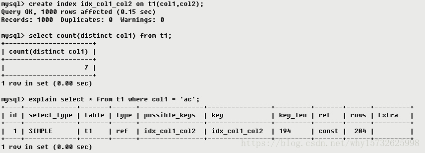
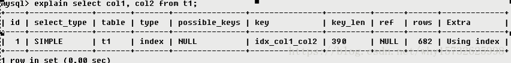
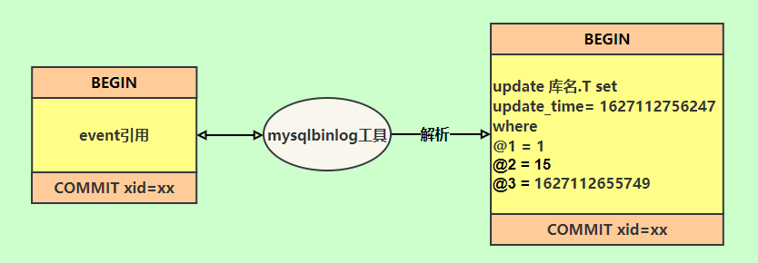
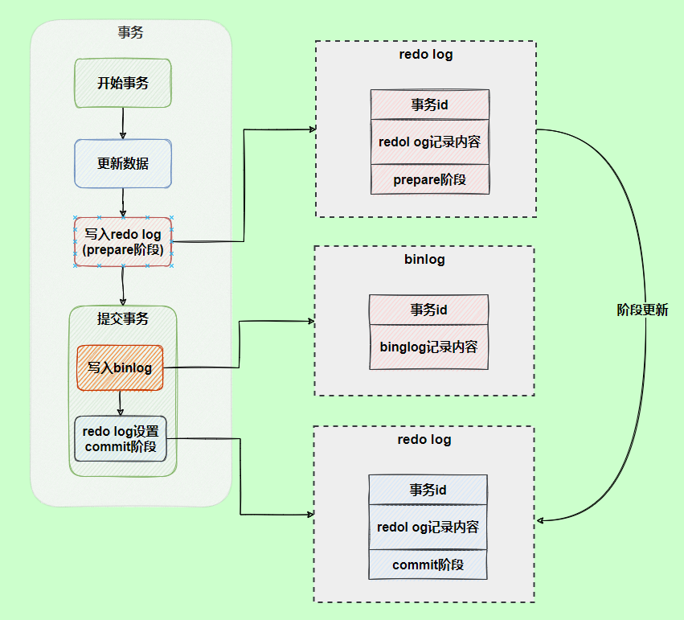

# <font color=green>一、基础知识</font>

## <font color=blue>1、为什么要使用数据库</font>

**数据保存在内存**

优点： 存取速度快

缺点： 数据不能永久保存

**数据保存在文件**

优点： 数据永久保存

缺点：1）速度比内存操作慢，频繁的IO操作。2）查询数据不方便

**数据保存在数据库**

1）数据永久保存

2）使用SQL语句，查询方便效率高。

3）管理数据方便

## <font color=blue>2、什么是SQL</font>

结构化查询语言(Structured Query Language)简称SQL，是一种数据库查询语言。

## <font color=blue>3、SQL语句主要分类</font>

- 数据定义语言DDL（Data Ddefinition Language）CREATE，DROP，ALTER；
- 数据查询语言DQL（Data Query Language）SELECT；
- 数据操纵语言DML（Data Manipulation Language）INSERT，UPDATE，DELETE；
- 数据控制功能DCL（Data Control Language）GRANT，REVOKE，COMMIT，ROLLBACK。

## <font color=blue>4、什么是mysql</font>

MySQL是一个关系型数据库管理系统属于 Oracle 旗下产品。MySQL 是最流行的关系型数据库管理系统之一，在 WEB 应用方面，MySQL是最好的 RDBMS (Relational Database Management System，关系数据库管理系统) 应用软件之一。在Java企业级开发中非常常用，因为 MySQL 是**开源免费**的，并且方便扩展。

## <font color=blue>5、关系查询</font>

### 1）交叉连接

笛卡尔积；

### 2）内连接

等值连接：ON A.id=B.id；
不等值连接：ON A.id > B.id；
自连接：SELECT * FROM A T1 INNER JOIN A T2 ON T1.id=T2.pid。

### 3）外连接

左外连接：LEFT OUTER JOIN, 以左表为主，先查询出左表，按照ON后的关联条件匹配右表，没有匹配到的用NULL填充，可以简写成LEFT JOIN；
右外连接：RIGHT OUTER JOIN, 以右表为主，先查询出右表，按照ON后的关联条件匹配左表，没有匹配到的用NULL填充，可以简写成RIGHT JOIN。

### 4）联合查询

SELECT * FROM A UNION SELECT * FROM B UNION ...
把多个结果集集中在一起，UNION前的结果为基准，需要注意的是联合查询的列数要相等，相同的记录行会合并，如果使用UNION ALL，不会合并重复的记录行，效率 UNION ALL高于 UNION

### 5）全连接

MySQL不支持。连接，可以使用LEFT JOIN 和UNION和RIGHT JOIN联合使用。

> 有2张表，1张R、1张S，R表有ABC三列，S表有CD两列，表中各有三条记录。
>
> R表
>
> | A    | B    | C    |
> | ---- | ---- | ---- |
> | a1   | b1   | c1   |
> | a2   | b2   | c2   |
> | a3   | b3   | c3   |
>
> S表
>
> | C    | D    |
> | ---- | ---- |
> | c1   | d1   |
> | c2   | d2   |
> | c4   | d3   |
>
> 1. 交叉连接(笛卡尔积):
>
>    select r.`*`,s.`*` from r,s
>
>    | A    | B    | C    | C    | D    |
>    | ---- | ---- | ---- | ---- | ---- |
>    | a1   | b1   | c1   | c1   | d1   |
>    | a2   | b2   | c2   | c1   | d1   |
>    | a3   | b3   | c3   | c1   | d1   |
>    | a1   | b1   | c1   | c2   | d2   |
>    | a2   | b2   | c2   | c2   | d2   |
>    | a3   | b3   | c3   | c2   | d2   |
>    | a1   | b1   | c1   | c4   | d3   |
>    | a2   | b2   | c2   | c4   | d3   |
>    | a3   | b3   | c3   | c4   | d3   |
>
> 2. 内连接结果：
>
>    select r.`*`,s.`*` from r inner join s on r.c=s.c
>
>    | A    | B    | C    | C    | D    |
>    | ---- | ---- | ---- | ---- | ---- |
>    | a1   | b1   | c1   | c1   | d1   |
>    | a2   | b2   | c2   | c2   | d2   |
>
> 3. 左连接结果：
>
>    select r.`*`,s.`*` from r left join s on r.c=s.c
>
>    | A    | B    | C    | C    | D    |
>    | ---- | ---- | ---- | ---- | ---- |
>    | a1   | b1   | c1   | c1   | d1   |
>    | a2   | b2   | c2   | c2   | d2   |
>    | a3   | b3   | c3   |      |      |
>
> 4. 右连接结果：
>
>    select r.`*`,s.`*` from r right join s on r.c=s.c
>
>    | A    | B    | C    | C    | D    |
>    | ---- | ---- | ---- | ---- | ---- |
>    | a1   | b1   | c1   | c1   | d1   |
>    | a2   | b2   | c2   | c2   | d2   |
>    |      |      |      | c4   | d3   |
>
> 5. 全表连接的结果（MySql不支持，Oracle支持）：
>
>    select r.`*`,s.`*` from r full join s on r.c=s.c
>
>    | A    | B    | C    | C    | D    |
>    | ---- | ---- | ---- | ---- | ---- |
>    | a1   | b1   | c1   | c1   | d1   |
>    | a2   | b2   | c2   | c2   | d2   |
>    | a3   | b3   | c3   |      |      |
>    |      |      |      | c4   | d3   |

## <font color=blue>6、子查询</font>

**1）含义：**

一条SQL语句的查询结果做为另一条查询语句的条件或查询结果。

**2）分类**：

- 子查询是单行单列的情况：结果集是一个值，父查询使用：=、 <、 > 等运算符；
- 子查询是多行单列的情况：结果集类似于一个数组，父查询使用：in 运算符；
- 子查询是多行多列的情况：结果集类似于一张虚拟表，不能用于where条件，用于select子句中做为子表。

## <font color=blue>7、自增值</font>

### 1）自增主键理解

InnoDB引擎的自增值，其实是保存在了内存里，并且到了MySQL 8.0版本后，才有了“自增值持久化”的能力。也就是才实现了“如果发生重启，表的自增值可以恢复为MySQL重启前的值”，具体情况是：（查看表结构，会看到自增主键=多少）。

- 在MySQL 5.7及之前的版本，自增值保存在内存里，并没有持久化。每次重启后，第一次打开表的时候，都会去找自增值的最大值max(id)，然后将max(id)+1作为这个表当前的自增值。
- 在MySQL 8.0版本，将自增值的变更记录在了redo log中，重启的时候依靠redo log恢复重启之前的值。

### 2）自增值修改机制

- 如果插入数据时id字段指定为0、null 或未指定值，那么就把这个表当前的 AUTO_INCREMENT值填到自增字段；
- 如果插入数据时id字段指定了具体的值，就直接使用语句里指定的值。

### 3）自增值新增机制

- 如果准备插入的值>=当前自增值，新的自增值就是“准备插入的值+1”；
- 否则，自增值不变。

### 4）为什么自增主键不连续

1. 唯一键冲突；
2. 事务回滚；

> 为什么自增值不能回滚？主要是为了性能角度考虑的，如果每次申请ID之前，还要去主键索引树上判断 id 是否存在，这会影响插入效率；
>
> 另一种解决方法是：必须等到一个事务执行完成并提交，下一个事务才能再申请自增 id。这又会导致系统并发能力大大下降。

因此MySQL自增ID设计是保证*递增但不连续*的。

### 5）InnoDB为什么推荐使用自增ID

1. 主键页就会近乎于顺序的记录填满，提升了页面的最大填充率，不会有页的浪费。
2. 新插入的行一定会在原有的最大数据行下一行，mysql定位和寻址很快，不会为计算新行的位置而做出额外的消耗。
3. 减少了页分裂和碎片的产生。

如果使用UUID的话，会产生大量的随机IO操作以及页分裂导致数据的大量移动。

## <font color=blue>8、常见面试题</font>

### 1）in 和 exists 区别

IN
适合外部表数据大于子查询的表数据的业务场景；
先查询 in()子查询的数据(1次)，并且将数据放进内存里(不需要多次查询),然后外部查询的表再根据查询的结果进行查询过滤,最后返回结果。
EXIST
适合子查询中表数据大于外查询表中数据的业务场景
先执行外部查询语句，然后在执行子查询，子查询中它每次都会去执行数据库的查询，执行次数等于外查询的数据数量。

### 2）varchar与char的区别

1. 定长与变长

char 表示定长，长度固定，varchar表示变长，即长度可变。char如果插入的长度小于定义长度时，则用空格填充；varchar小于定义长度时，还是按实际长度存储，插入多长就存多长。因为其长度固定，char的存取速度还是要比varchar要快得多，方便程序的存储与查找；但是char也为此付出的是空间的代价，因为其长度固定，所以会占据多余的空间，可谓是以空间换取时间效率。varchar则刚好相反，以时间换空间。

2. 存储的容量不同

对 char 来说，最多能存放的字符个数 255，和编码无关。
而 varchar 呢，最多能存放 65532 个字符。varchar的最大有效长度由最大行大小和使用的字符集确定。整体最大长度是 65,532字节。
总之，结合性能角度（char更快）和节省磁盘空间角度（varchar更小），具体情况还需具体来设计数据库才是妥当的做法。

### 3）varchar(50)中50的涵义

最多存放50个字符，varchar(50)和(200)存储hello所占空间一样，但后者在排序时会消耗更多内存，因为order by col采用fixed_length计算col长度(memory引擎也一样)。在早期 MySQL 版本中， 50 代表字节数，现在代表字符数。

### 4）int(20)中20的涵义

是指显示字符的长度。20表示最大显示宽度为20，但仍占4字节存储，存储范围不变；
不影响内部存储，只是影响带 zerofill 定义的 int 时，前面补多少个 0，易于报表展示

### 5）count(字段)，count(主键id)，count(1)，count(*)的区别

**count(可空字段)**

扫描全表，读到server层，判断字段可空，拿出该字段所有值，判断每一个值是否为空，不为空则累加。

**count(非空字段)与count(主键 id)**

扫描全表，读到server层，判断字段不可空，按行累加。

**count(1)**

扫描全表，但不取值，server层收到的每一行都是1，判断不可能是null，按值累加。
注意：count(1)执行速度比count(主键 id)快的原因：从引擎返回 id 会涉及到解析数据行，以及拷贝字段值的操作。

**count(\*)**

MySQL 执行count(\*)在优化器做了专门优化。因为count(*)返回的行一定不是空。扫描全表，但是不取值，按行累加。

> 性能对比结论
> count(可空字段) < count(非空字段) = count(主键 id) < count(1) ≈ count(*)

### 6）什么是数据库,数据库管理系统,数据库系统,数据库管理员?

**数据库** :数据库(DataBase 简称 DB)就是信息的集合或者说数据库是由数据库管理系统管理的数据的集合。

**数据库管理系统** : 数据库管理系统(Database Management System 简称 DBMS)是一种操纵和管理数据库的大型软件，通常用语用于建立、使用和维护数据库。

**数据库系统** : 数据库系统(Data Base System，简称 DBS)通常由软件、数据库和数据管理员(DBA)组成。

**数据库管理员** : 数据库管理员(Database Administrator,简称 DBA)负责全面管理和控制数据库系统。

### 7）什么是元组码候选码主码外码主属性非主属性？

**元组** ： 元组（tuple）是关系数据库中的基本概念，关系是一张表，表中的每行（即数据库中的每条记录）就是一个元组，每列就是一个属性。 在二维表里，元组也称为行。

**码** ：码就是能唯一标识实体的属性，对应表中的列。

**候选码** ： 若关系中的某一属性或属性组的值能唯一的标识一个元组，而其任何、子集都不能再标识，则称该属性组为候选码。例如：在学生实体中，“学号”是能唯一的区分学生实体的，同时又假设“姓名”、“班级”的属性组合足以区分学生实体，那么{学号}和{姓名，班级}都是候选码。

**主码** : 主码也叫主键。主码是从候选码中选出来的。 一个实体集中只能有一个主码，但可以有多个候选码。

**外码** : 外码也叫外键。如果一个关系中的一个属性是另外一个关系中的主码则这个属性为外码。

**主属性** ： 候选码中出现过的属性称为主属性。比如关系 工人（工号，身份证号，姓名，性别，部门）。显然工号和身份证号都能够唯一标示这个关系，所以都是候选码。工号、身份证号这两个属性就是主属性。如果主码是一个属性组，那么属性组中的属性都是主属性。

**非主属性：** 不包含在任何一个候选码中的属性称为非主属性。比如在关系——学生（学号，姓名，年龄，性别，班级）中，主码是“学号”，那么其他的“姓名”、“年龄”、“性别”、“班级”就都可以称为非主属性。

### 8）主键和外键的区别

**主键**(主码) ：主键用于唯一标识一个元组，不能有重复，不允许为空。一个表只能有一个主键。

**外键**(外码) ：外键用来和其他表建立联系用，外键可以是另一表的主键，外键是可以有重复的，可以是空值。一个表可以有多个外键。

### 9）什么是E-R图

**E-R** **图**也称实体-联系图(Entity Relationship Diagram)，提供了表示实体类型、属性和联系的方法，用来描述现实世界的概念模型。 它是描述现实世界关系概念模型的有效方法。 是表示概念关系模型的一种方式。

### 10）数据库范式

#### 1. 1NF

属性（对应于表中的字段）不能再被分割，也就是这个字段只能是一个值，不能再分为多个其他的字段了。**1NF** **是所有关系型数据库的最基本要求** ，也就是说关系型数据库中创建的表一定满足第一范式。

#### 2. 2NF

2NF 在 1NF 的基础之上，消除了非主属性对于码的部分函数依赖。如下图所示，展示了第一范式到第二范式的过渡。第二范式在第一范式的基础上增加了一个列，这个列称为主键，非主属性都依赖于主键。

> **函数依赖（functional dependency）** ：若在一张表中，在属性（或属性组）X 的值确定的情况下，必定能确定属性 Y 的值，那么就可以说 Y 函数依赖于 X，写作 X → Y。
>
> **部分函数依赖（partial functional dependency）** ：如果 X→Y，并且存在 X 的一个真子集 X0，使得 X0→Y，则称 Y 对 X 部分函数依赖。比如学生基本信息表 R 中（学号，身份证号，姓名）当然学号属性取值是唯一的，在 R 关系中，（学号，身份证号）->（姓名），（学号）->（姓名），（身份证号）->（姓名）；所以姓名部分函数依赖与（学号，身份证号）；
>
> **完全函数依赖(Full functional dependency)** ：在一个关系中，若某个非主属性数据项依赖于全部关键字称之为完全函数依赖。比如学生基本信息表 R（学号，班级，姓名）假设不同的班级学号有相同的，班级内学号不能相同，在 R 关系中，（学号，班级）->（姓名），但是（学号）->(姓名)不成立，（班级）->(姓名)不成立，所以姓名完全函数依赖与（学号，班级）；
>
> **传递函数依赖** ： 在关系模式 R(U)中，设 X，Y，Z 是 U 的不同的属性子集，如果 X 确定 Y、Y 确定 Z，且有 X 不包含 Y，Y 不确定 X，（X∪Y）∩Z=空集合，则称 Z 传递函数依赖(transitive functional dependency) 于 X。传递函数依赖会导致数据冗余和异常。传递函数依赖的 Y 和 Z 子集往往同属于某一个事物，因此可将其合并放到一个表中。比如在关系 R(学号 ,姓名, 系名，系主任)中，学号 → 系名，系名 → 系主任，所以存在非主属性系主任对于学号的传递函数依赖。

#### 3. 3NF

3NF 在 2NF 的基础之上，消除了非主属性对于码的传递函数依赖 。符合 3NF 要求的数据库设计，**基本**上解决了数据冗余过大，插入异常，修改异常，删除异常的问题。比如在关系 R(学号 ,姓名, 系名，系主任)中，学号 → 系名，系名 → 系主任，所以存在非主属性系主任对于学号的传递函数依赖，所以该表的设计，不符合 3NF 的要求。

**总结**

- 1NF：属性不可再分。
- 2NF：1NF 的基础之上，消除了非主属性对于码的部分函数依赖。
- 3NF：3NF 在 2NF 的基础之上，消除了非主属性对于码的传递函数依赖 。

### 11）Drop、Delete与truncate的区别

**1）用法不同**

- drop(丢弃数据): drop table 表名 ，直接将表都删除掉，在删除表的时候使用。
- truncate (清空数据) : truncate table 表名 ，只删除表中的数据，再插入数据的时候自增长 id 又从 1 开始，在清空表中数据的时候使用。
- delete（删除数据） : delete from 表名 where 列名=值，删除某一列的数据，如果不加 where 子句和truncate table 表名作用类似。

truncate 和不带 where 子句的 delete、以及 drop 都会删除表内的数据，但是 truncate 和 delete 只删除数据不删除表的结构(定义)，执行 drop 语句，此表的结构也会删除，也就是执行drop之后对应的表不复存在。

**2）属于不同的数据库语言**

truncate 和 drop 属于 DDL(数据定义语言)语句，操作立即生效，原数据不放到 rollback segment 中，不能回滚，操作不触发 trigger。而 delete 语句是 DML (数据库操作语言)语句，这个操作会放到 rollback segement 中，事务提交之后才生效。

> **DML 语句和 DDL 语句区别：**
>
> DML 是数据库操作语言（Data Manipulation Language）的缩写，是指对数据库中表记录的操作，主要包括表记录的插入（insert）、更新（update）、删除（delete）和查询（select），是开发人员日常使用最频繁的操作。
>
> DDL （Data Definition Language）是数据定义语言的缩写，简单来说，就是对数据库内部的对象进行创建、删除、修改的操作语言。它和 DML 语言的最大区别是 DML 只是对表内部数据的操作，而不涉及到表的定义、结构的修改，更不会涉及到其他对象。DDL 语句更多的被数据库管理员（DBA）所使用，一般的开发人员很少使用。

**3）执行速率不同**

一般来说:drop>truncate>delete

### 12）数据库设计通常分为哪几步

1. **需求分析** : 分析用户的需求，包括数据、功能和性能需求。
2. **概念结构设计** : 主要采用 E-R 模型进行设计，包括画 E-R 图。
3. **逻辑结构设计** : 通过将 E-R 图转换成表，实现从 E-R 模型到关系模型的转换。
4. **物理结构设计** : 主要是为所设计的数据库选择合适的存储结构和存取路径。
5. **数据库实施** : 包括编程、测试和试运行
6. **数据库的运行和维护** : 系统的运行与数据库的日常维护。


# <font color = green>二、数据类型</font>

## <font color = blue>1、数值类型：</font>


## <font color = blue>2、日期事件类型：</font>


## <font color = blue>3、字符串类型：</font>


# <font color = green>三、存储引擎</font>

## <font color = blue>1、MYISAM引擎</font>

是MySql的ISAM扩展格式（强调快速读取操作）

适用条件：

- 筛选大量数据的表：MyISAM存储引擎再筛选大量数据时非常迅速；
- 一次性插入大量数据的表：MyISAM的并发插入特性允许同时选择和插入数据；

缺点：

- 不支持事务和行级锁，崩溃后无法安全恢复；
- 无法处理事务，有事务处理需求的表不适用；

## <font color = blue>2、Innodb引擎</font>

Innodb引擎提供了对数据库ACID事务的支持。并且还提供了行级锁和外键的约束。它的设计的目标就是处理大数据容量的数据库系统。

优点

- 更新密集的表：适合处理多重并发的更新请求；
- 支持事务；

- 自动灾难恢复；
- 外键约束（mysql支持外键的引擎只有InnoDB）
- 支持自动增加列AUTO_INCREMENT属性；

缺点

与MYISAM引擎比，InnoDB写的处理效率差一些并且会占用更多的磁盘空间，以保留数据和索引。

> MYISAM引擎与Innodb引擎的区别：
>
> InnoDB索引是聚簇索引，MyISAM索引是非聚簇索引。
>
> InnoDB的主键索引的叶子节点存储着行数据，因此主键索引非常高效。
>
> MyISAM索引的叶子节点存储的是行数据地址，需要再寻址一次才能得到数据。
>
> MyISAM不支持外键，而只有InnoDB引擎支持外键。
>
> InnoDB支持事务，而MyISAM不支持。
>
> InnoDB可以设置自增列，而MyISAM没有这个功能。
>
> MyISAM由于保存了整个表记录的总数量，使用不带条件的count(*)速度非常快，而InnoDB并没有保存数据的总数量，计算总数量时比MyISAM慢。

## <font color = blue>3、Memory引擎</font>

所有的数据都在内存中，数据的处理速度快，但是安全性不高。

适用条件：

- 目标数据较小，而且被频繁地访问；
- 数据时是临时的，而且要求必须立即使用；
- 存储在Memory表中的数据如果突然丢失，不会对应用服务产生实质的负面影响；

缺点

Memory表是表级锁，因此并发写入的性能较低，不支持BLOG或Text类型的列（varchar是一种长度可变的类型，但因为它在MySql内部当作长度固定不变的char类型），并且每行的长度是固定的，可能导致部分内存的浪费

# <font color = green>四、索引</font>

## <font color = blue>1、什么是索引</font>

索引是一种数据结构。数据库索引，是数据库管理系统中一个排序的数据结构，以协助快速查询、更新数据库表中数据。

索引是一种特殊的文件(InnoDB数据表上的索引是表空间的一个组成部分)，它们包含着对数据表里所有记录的引用指针，

它是要占据物理空间的。

（更通俗的说，索引就相当于目录。为了方便查找书中的内容，通过对内容建立索引形成目录。）

## <font color = blue>2、索引有哪些优缺点</font>

优点

- 可以大大加快数据的检索速度；
- 通过使用索引，可以在查询的过程中，使用优化隐藏器，提高系统的性能。

缺点

- 时间方面：创建索引和维护索引要耗费时间，具体地，当对表进行增删改时，索引也要动态维护，会降低增删改的执行效率；

- 空间方面：索引需要占用额外的磁盘空间。


## <font color = blue>3、索引有哪些类型</font>

- 主键索引：数据列不允许重复，不允许为NULL，一个表只能有一个主键。
- 唯一索引：数据列不允许重复，允许为NULL值，一个表允许多个列创建唯一索引。
- 普通索引：基本的索引类型，没有唯一性的限制，允许为NULL值。
- 全文索引：是目前搜索引擎使用的一种关键技术。

## <font color = blue>4、索引的数据结构</font>

B+树

Hash索引

## <font color = blue>5、什么是最左前缀原则？什么是最左匹配原则</font>

顾名思义，就是最左优先，在创建多列索引时，要根据业务需求，where子句中使用最频繁的一列放在最左边。

最左前缀匹配原则，非常重要的原则，mysql会一直向右匹配直到遇到范围查询(>、<、between、like)就停止匹配，比如a = 1 and b = 2 and c > 3 and d = 4 如果建立(a,b,c,d)顺序的索引，d是用不到索引的，如果建立(a,b,d,c)的索引则都可以用到，a,b,d的顺序可以任意调整。

=和in可以乱序，比如a = 1 and b = 2 and c = 3 建立(a,b,c)索引可以任意顺序，mysql的查询优化器会帮你优化成索引可以识别的形式

## <font color = blue>6、B树和B+树的区别</font>

在B树中，你可以将键和值存放在内部节点和叶子节点；但在B+树中，内部节点都是键，没有值，叶子节点同时存放键和值。

B+树的叶子节点有一条链相连，而B树的叶子节点各自独立。

## <font color = blue>7、mysql为什么没有使用二叉树</font>

极端情况下可能出现“线性链表结构”，若寻找叶子节点时就相当于全表扫描了，性能急剧下降。

##  <font color = blue>8、mysql为什么没有使用平衡树</font>

1. 搜索效率不足。一般来说，在树结构中，数据所处的深度，决定了搜索时的IO次数（MySql中将每个节点大小设置为一页大小，一次IO读取一页 / 一个节点）。
2. 查询不不稳定。如果查询的数据落在根节点，只需要一次IO，如果是叶子节点或者是支节点，会需要多次IO才可以。
3. 存储的数据内容太少。没有很好利用操作系统和磁盘数据交换特性，也没有利用好磁盘IO的预读能力。因为操作系统和磁盘之间一次数据交换是以页为单位的，一页大小为 4K，即每次IO操作系统会将4K数据加载进内存。但是，在二叉树每个节点的结构只保存一个关键字，一个数据区，两个子节点的引用，并不能够填满4K的内容。幸幸苦苦做了一次的IO操作，却只加载了一个关键字。在树的高度很高，恰好又搜索的关键字位于叶子节点或者支节点的时候，取一个关键字要做很多次的IO。

## <font color = blue>9、mysql为什么使用B+树而不是B树</font>

1. B树只适合随机检索，而B+树同时支持随机检索和顺序检索
   B树在提高了磁盘IO性能的同时并没有解决元素遍历的效率低下的问题。B+树的叶子节点使用指针顺序连接在一起，只要遍历叶子节点就可以实现整棵树的遍历。而且在数据库中基于范围的查询是非常频繁的，而B树不支持这样的操作。
2. B+树空间利用率更高，可减少I/O次数，磁盘读写代价更低。
   一般来说，索引本身也很大，不可能全部存储在内存中，因此索引往往以索引文件的形式存储的磁盘上。这样的话，索引查找过程中就要产生磁盘I/O消耗。B+树的内部结点并没有指向关键字具体信息的指针，只是作为索引使用，其内部结点比B树小，盘块能容纳的结点中关键字数量更多，一次性读入内存中可以查找的关键字也就越多，相对的，IO读写次数也就降低了。而IO读写次数是影响索引检索效率的最大因素。
3. B+树的查询效率更加稳定。
   B树搜索有可能会在非叶子结点结束，越靠近根节点的记录查找时间越短，只要找到关键字即可确定记录的存在，其性能等价于在关键字全集内做一次二分查找。而在B+树中，顺序检索比较明显，随机检索时，任何关键字的查找都必须走一条从根节点到叶节点的路，所有关键字的查找路径长度相同，导致每一个关键字的查询效率相当。

## <font color = blue>10、Hash索引和B+树索引的区别</font>

1）底层原理：

hash索引的底层原理就是hash表，进行查找时，调用一次hash函数就可以获取相应的键值，之后进行回表查询获得实际数据。

B+树底层实现是多路平衡查找树。对于每一次的查询都是从根节点出发，查找到叶子节点方可以获得所查键值，然后根据查询判断是否需要回表查询数据。

2）hash索引进行等值查询更快(一般情况下)，但是却无法进行范围查询。

因为在hash索引中经过hash函数建立索引之后，索引的顺序与原顺序无法保持一致，不能支持范围查询。而B+树的的所有节点皆遵循(左节点小于父节点，右节点大于父节点，多叉树也类似)，天然支持范围。

3）hash索引不支持使用索引进行排序，原理同上。

4）hash索引不支持模糊查询以及多列索引的最左前缀匹配。原理也是因为hash函数的不可预测。

5）hash索引任何时候都避免不了回表查询数据，而B+树在符合某些条件(聚簇索引，覆盖索引等)的时候可以只通过索引完成查询。

6）hash索引虽然在等值查询上较快，但是不稳定。性能不可预测，当某个键值存在大量重复的时候，发生hash碰撞，此时效率可能极差。而B+树的查询效率比较稳定，对于所有的查询都是从根节点到叶子节点，且树的高度较低。

## <font color = blue>11、覆盖索引</font>

1）含义：

需要查询的字段正好是索引的字段，那么直接根据该索引，就可以查到数据了， 而无需回表查询。

2）面试题：

为什么sql中要求尽量不要使用select *，而要写明具体要查询的字段。

其中一个原因就是在使用到覆盖索引的情况下，不需要进入到数据区，数据就能直接返回，提升了查询效率。在用不到覆盖索引的情况下，也尽可能的不要使用select *，如果行数据量特别多的情况下，可以减少数据的网络传输量。当然，这都视具体情况而定，通过select返回所有的字段，通用性会更强，一切有利必有弊。

## <font color = blue>12、创建索引的原则</font>

1）列的离散型

离散型的计算公式：count(distinct column_name):count(*)，就是用去重后的列值个数比个数。值在 (0,1] 范围内。离散型越高，选择型越好。

2）最左匹配原则

对于索引中的关键字进行对比的时候，一定是从左往右以此对比，且不可跳过。

3）最少空间原则

当关键字占用的空间越小，则每个节点保存的关键字个数就越多，每次加载进内存的关键字个数就越多，检索效率就越高。创建索引的关键字要尽可能占用空间小。

4）联合索引

尽可能的考虑建立联合索引而不是单列索引。因为索引是需要占用磁盘空间的，可以简单理解为每个索引都对应着一颗 B+树。如果一个表的字段过多，索引过多，那么当这个表的数据达到一个体量后，索引占用的空间也是很多的，且修改索引时，耗费的时间也是较多的。如果是联合索引，多个字段在一个索引上，那么将会节约很大磁盘空间，且修改数据的操作效率也会提升。

> 联合索引列的选择原则
>
> 经常用的列优先（最左匹配原则）
>
> 离散度高的列优先（离散度高原则）
>
> 宽度小的列优先（最少空间原则）

# <font color = green>五、事务</font>

## <font color = blue>1、什么是数据库事务</font>

事务是一个不可分割的数据库操作序列，也是数据库并发控制的基本单位，其执行的结果必须使数据库从一种一致性状态变到另一种一致性状态。事务是逻辑上的一组操作，要么都执行，要么都不执行。

## <font color = blue>2、事务的四大特性(ACID)</font>

- 原子性： 事务是最小的执行单位，不允许分割。事务的原子性确保动作要么全部完成，要么完全不起作用；
- 一致性： 执行事务前后，数据保持一致，多个事务对同一个数据读取的结果是相同的；
- 隔离性： 并发访问数据库时，一个用户的事务不被其他事务所干扰，各并发事务之间数据库是独立的；
- 持久性： 一个事务被提交之后。它对数据库中数据的改变是持久的，即使数据库发生故障也不应该对其有任何影响。

## <font color = blue>3、ACID具体实现</font>

### 1）原子性原理

（通过undolog来实现）

事务通常是以BEGIN TRANSACTION 开始，以 COMMIT 或 ROLLBACK 结束。

- COMMIT 表示提交，即提交事务的所有操作并持久化到数据库中。
- ROLLBACK表示回滚，即在事务中运行的过程中发生了某种故障，事务不能继续执行，系统将事务中对数据库所有已完成的操作全部撤销，回滚到事务开始时的状态，这里的操作指对数据库的更新操作，已执行的查询操作不用管。这时候也就需要用到 undolog 来进行回滚。

> undolog：
>
> 1. 每条数据变更（INSERT/UPDATE/DELETE/REPLACE）等操作都会生成一条undolog记录，在SQL执行前先于数据持久化到磁盘；
> 2. 当事务需要回滚时，MySQL会根据回滚日志对事务中已执行的SQL做逆向操作，比如 DELETE 掉一行数据的逆向操作就是再把这行数据 INSERT回去，其他操作同理。

### 2）持久性原理

（通过binlog、redolog来实现。）

MySQL的表数据是存放在磁盘上的，因此想要存取的时候都要经历磁盘IO，然而即使是使用SSD磁盘，IO也是非常耗性能的。因此，为了提升性能，InnoDB提供了缓冲池（Buffer Pool），Buffer Pool包含了磁盘数据页的映射，可以当作缓存来使用：

- 读数据：会首先从缓冲池中读取，如果缓冲池中没有，则从磁盘读取在放入缓冲池；
- 写数据：会首先写入缓冲池，缓冲池中的数据会定期同步到磁盘中；

我们知道，MySQL表数据是持久化到磁盘中的，但如果所有操作都去操作磁盘，等并发上来了，那处理速度谁都吃不消，因此引入了缓冲池(Buffer Pool)的概念，Buffer Pool 中包含了磁盘中部分数据页的映射，可以当做缓存来用；这样当修改表数据时，我们把操作记录先写到Buffer Pool中，并标记事务已完成，等MySQL空闲时，再把更新操作持久化到磁盘里，从而大大缓解了MySQL并发压力。

但是它也带来了新的问题，当MySQL系统宕机，断电时Buffer Pool数据不就丢了？

因为我们的数据已经提交了，但此时是在缓冲池里头，还没来得及在磁盘持久化，所以我们急需一种机制需要存一下已提交事务的数据，为恢复数据使用。

于是 redo log + binlog的经典组合就登场了……

### 3）隔离性原理

（通过(读写锁+MVCC)来实现。）

在SQL标准中定义了四种隔离级别，每一种级别都规定了一个事务的修改，哪些是事务之间可见的，哪些是不可见的。

级别越低的隔离级别可以执行越高的并发，但同时实现复杂度以及开销也越大。

Mysql 隔离级别有以下四种（级别由低到高）：

| 隔离级别            | 效果                                                         |
| ------------------- | ------------------------------------------------------------ |
| 读未提交（RU）      | 一个事务还没提交时，它做的变更就能被别的事务看到。           |
| 读提交（RC）        | 一个事务提交（commit）之后，它做的变更才会被其他事务看到。   |
| 可重复读（RR）      | 一个事务执行过程中看到的数据，总是跟这个事务在启动（？首次读）时看到的数据是一致的。<br/>当然在可重复读隔离级别下，未提交变更对其他事务也是不可见的。 |
| 串行（xíng）化（S） | 当出现读写锁冲突的时候，后访问的事务必须等前一个事务执行完成，才能继续执行。 |

原子性，隔离性，持久性的目的都是为了要做到一致性，但隔离型跟其他两个有所区别，原子性和持久性是为了要实现数据的正确、可用，比如要做到宕机后的恢复、事务的回滚等，保证数据是正确可用的！

那么隔离性是要做到什么呢？

多个并发读写请求（事务）过来时的执行顺序。像交警在马路口儿指挥交通一样，当并发处理多个DML更新操作时，如何让事务操作他该看到的数据，出现多个事务处理同一条数据时，让事务该排队的排队，别插队捣乱，保证数据和事务的相对隔离，这就是隔离性要干的事儿。

从隔离性的实现原理上，我们可以看出这是一场**数据的可靠性与性能之间的权衡。**

### 4）一致性原理

（MySQL通过原子性，持久性，隔离性最终实现（或者说定义）数据一致性。）

一致性，我们要保障的是`数据一致性`，数据库中的增删改操作，**使数据库不断从一个一致性的状态转移到另一个一致性的状态。**

> **总结**
>
> 事务该回滚的回滚，该提交的提交，提交后该持久化磁盘的持久化磁盘，该写缓冲池的写缓冲池+写日志；对于数据可见性，通过四种隔离级别进行控制，使得库表中的有效数据范围可控，保证业务数据的正确性的前提下，进而提高并发程度，支撑服务高QPS的稳定运行，保证数据的一致性。
>

## <font color = blue>4、什么是脏读？幻读？不可重复读？</font>

### 1）脏读

含义

脏读就是指当一个事务正在访问数据，并且对数据进行了修改，而这种修改还没有提交到数据库中，这时，另外一个事务也访问这个数据，然后使用了这个数据。

举例

张三的工资为5000,事务A中把他的工资改为8000,但事务A尚未提交。
与此同时，事务B正在读取张三的工资，读取到张三的工资为8000。
随后，事务A发生异常，而回滚了事务。张三的工资又回滚为5000。
最后，事务B读取到的张三工资为8000的数据即为脏数据，事务B做了一次脏读。

### 2）不可重复读

含义

在一个事务的两次查询之中数据不一致，这可能是两次查询过程中间插入了一个事务更新的原有的数据。

举例

在事务A中，读取到张三的工资为5000，操作没有完成，事务还没提交。
与此同时，事务B把张三的工资改为8000，并提交了事务。
随后，在事务A中，再次读取张三的工资，此时工资变为8000。在一个事务中前后两次读取的结果并不一致，导致了不可重复读。

### 3）幻读

含义

是指当事务不是独立执行时发生的一种现象，例如第一个事务对一个表中的数据进行了修改，这种修改涉及到表中的全部数据行。同时，第二个事务也修改这个表中的数据，这种修改是向表中插入一行新数据。那么，以后就会发生操作第一个事务的用户发现表中还有没有修改的数据行，就好象发生了幻觉一样。

举例

目前工资为5000的员工有10人，事务A读取所有工资为5000的人数为10人。
此时，事务B插入一条工资也为5000的记录。
这时，事务A再次读取工资为5000的员工，记录为11人。此时产生了幻读。

## <font color = blue>5、什么是事务的隔离级别？</font>

### 1）READ-UNCOMMITTED(读取未提交)

最低的隔离级别，允许读取尚未提交的数据变更，可能会导致脏读、幻读或不可重复读。

### 2）READ-COMMITTED(读取已提交)

允许读取并发事务已经提交的数据，可以阻止脏读，但是幻读或不可重复读仍有可能发生。

### 3）REPEATABLE-READ(可重复读)

对同一字段的多次读取结果都是一致的，除非数据是被本身事务自己所修改，可以阻止脏读和不可重复读，但幻读仍有可能发生。

### 4）SERIALIZABLE(可串行化)

最高的隔离级别，完全服从ACID的隔离级别。所有的事务依次逐个执行，这样事务之间就完全不可能产生干扰，也就是说，该级别可以防止脏读、不可重复读以及幻读。

# <font color = green>六、锁</font>

## <font color = blue>1、隔离级别与锁的关系</font>

在Read Uncommitted级别下，读取数据不需要加共享锁，这样就不会跟被修改的数据上的排他锁冲突；

在Read Committed级别下，读操作需要加共享锁，但是在语句执行完以后释放共享锁；

在Repeatable Read级别下，读操作需要加共享锁，但是在事务提交之前并不释放共享锁，也就是必须等待事务执行完毕以后才释放共享锁。

SERIALIZABLE 是限制性最强的隔离级别，因为该级别锁定整个范围的键，并一直持有锁，直到事务完成。

## <font color = blue>2、基础知识</font>

### 1）什么是锁

锁是计算机协调多个进程或线程并发访问某一资源的机制。

### 2）锁的作用

数据库锁设计的初衷是处理并发问题。作为多用户共享的资源，当出现并发访问的时候，**为了保证数据的一致性，数据库需要合理地控制资源的访问规则**。而锁就是用来实现这些访问规则的重要机制。

### 3）锁的分类


- 按锁粒度从大到小分类：表锁，页锁和行锁；以及特殊场景下使用的全局锁

- 如果按锁级别分类则有：共享（读）锁、排他（写）锁、意向共享（读）锁、意向排他（写）锁；

- 以及Innodb引擎为解决幻读等并发场景下事务存在的数据问题，引入的Record Lock（行记录锁）、Gap Lock（间隙锁）、Next-key Lock（Record Lock + Gap Lock结合）等；

- 还有就是我们面向编程的两种锁思想：悲观锁、乐观锁。

## <font color = blue>3、锁粒度划分</font>

### 1）表锁

**优点：**表级别的锁定是MySQL各存储引擎中最大颗粒度的锁定机制。该锁定机制最大的特点是**实现逻辑非常简单，带来的系统负面影响最小。**所以获取锁和释放锁的速度很快。由于表级锁一次会将整个表锁定，所以可以很好的避免的死锁问题。

**缺点：**锁定颗粒度大所带来最大的负面影响就是出现锁定资源争用的概率也会最高，大大降低并发度。

使用表级锁定的主要是MyISAM，MEMORY等一些非事务性存储引擎。

### 2）行锁

**优点：**与表锁正相反，行锁最大的特点就是锁定对象的颗粒度很小，也是目前各大数据库管理软件所实现的锁定颗粒度最小的。由于锁定颗粒度很小，所以发生锁定资源争用的概率也最小，能够给予应用程序尽可能大的并发处理能力从而提高系统的整体性能。

**缺点：**虽然能够在并发处理能力上面有较大的优势，但是行级锁定也因此带来了不少弊端。由于锁定资源的颗粒度很小，所以每次获取锁和释放锁需要做的事情也更多，带来的消耗自然也就更大了。此外，`行级锁定也最容易发生死锁`。

使用行级锁定的主要是InnoDB存储引擎。

**InnoDB锁的特性：**

1. 在不通过索引条件查询的时候，InnoDB使用的确实是表锁！
2. 由于 MySQL 的行锁是针对索引加的锁，不是针对记录加的锁，所以虽然是访问不同行的记录，但是如果是使用相同的索引键,是会出现锁冲突的。
3. 当表有多个索引的时候,不同的事务可以使用不同的索引锁定不同的行，另外，不论是使用主键索引、唯一索引或普通索引，InnoDB 都会使用行锁来对数据加锁。
4. 即便在条件中使用了索引字段，但是否使用索引来检索数据是由 MySQL 通过判断不同执行计划的代价来决定的，如果 MySQL 认为全表扫效率更高，比如对一些很小的表，它就不会使用索引，这种情况下 InnoDB 将使用表锁,而不是行锁。因此，在分析锁冲突时，别忘了检查 SQL 的执行计划（explain查看），以确认是否真正使用了索引。

> **总结：**
>
> 从锁的角度来说，表级锁更适合于以查询为主，只有少量按索引条件更新数据的应用，如Web应用；而行级锁则更适合于有大量按索引条件并发更新数据的情况，同时又有并发查询的应用场景。
>
> **行锁和表锁实战操作：**
>
> - 表锁：
>
>   - 添加锁的方式：`lock table 表名字1 read(write)，表名字2 read(write)`
>
>   - 查看表上加过的锁：`show open tables;`
>
>   - 释放表锁：`unlock tables`
>
>   - 读阻塞例子：
>
>     我们为mylock表加read锁
>      session_1、session_2获得表mylock的READ锁定连接终端当前session可以查询该表记录，其他session也可以查询该表的记录，当前session不能查询其它没有锁定的表，其他session可以查询或者更新未锁定的表，当前session中插入或者更新锁定的表都会提示错误： 其他session插入或者更新锁定表会一直等待获得锁： 释放锁 Session2获得锁，插入操作完成。
>
>   - 写阻塞例子：
>
>     mylockwrite(MyISAM)
>      Session1获得表mylock的WRITE锁，待Session1开启写锁后，Session1再连接终端当前session对锁定表的查询+更新+插入操作都可以执行： 其他session对锁定表的查询被阻塞，需要等待锁被释放： 在锁表前，如果Session1有数据缓存，锁表以后，在锁住的表不发生改变的情况下Session2可以读出缓存数据，一旦数据发生改变，缓存将失效，操作将被阻塞住。释放锁 Session2获得锁，查询返回。
>
>   - **总结： 简而言之，就是读锁会阻塞写，但是不会堵塞读。而写锁则会把读和写都堵塞**
>
> - 行锁。
>

### 3）页锁

除了表锁、行锁外，MySQL还有一种相对偏中性的页级锁，页锁是MySQL中比较独特的一种锁定级别，在其他数据库管理软件中也并不是太常见。页级锁定的特点是锁定颗粒度介于行级锁定与表级锁之间，所以获取锁定所需要的资源开销，以及所能提供的并发处理能力也同样是介于上面二者之间。另外，页级锁定和行级锁定一样，会发生死锁。

使用页级锁定的主要是BerkeleyDB存储引擎。

### 4）全局锁

首先全局锁，是对整个数据库实例加锁。使用场景一般在**全库逻辑备份**时。

MySQL提供加全局读锁的命令：

`Flush tables with read lock` (FTWRL)（客户端发生异常断开，那么MySQL会自动释放这个全局锁）

`set global readonly=true`（客户端发生异常断开，数据库依旧会保持readonly状态，会导致整个库长时间处于不可写状态）

这个命令可以使整个库处于只读状态。使用该命令之后，数据更新语句、数据定义语句和更新类事务的提交语句等修改数据库的操作都会被阻塞。

风险：

1. 如果在主库备份，在备份期间不能更新，业务停摆
2. 如果在从库备份，备份期间不能执行主库同步的binlog，导致主从延迟同步

## <font color = blue>4、兼容性划分</font>

### 1）共享锁（读锁）

共享锁，又叫读锁，是读取操作（SELECT）时创建的锁。其他用户可以并发读取数据，但在读锁未释放前，也就是查询事务结束前，任何事务都不能对数据进行修改（获取数据上的写锁），直到已释放所有读锁。

SQL显示加锁写法：

```sql
SELECT … LOCK IN SHARE MODE;
```

在查询语句后面增加`LOCK IN SHARE MODE`，MySQL就会对查询结果中的每行都加读锁，当没有其他线程对查询结果集中的任何一行使用写锁时，可以成功申请读锁，否则会被阻塞。其他线程也可以读取使用了读锁的表，而且这些线程读取的是同一个版本的数据。

### 2）排他锁（写锁）

排他锁又称写锁、独占锁，如果`事务A`对`数据B`加上写锁后，则其他事务不能再对`数据B`加任何类型的锁。`获得写锁的事务既能读数据，又能修改数据`。

SQL显示加锁写法：

```sql
SELECT … FOR UPDATE;
```

在查询语句后面增加`FOR UPDATE`，MySQL 就会对查询结果中的每行都加写锁，当没有其他线程对查询结果集中的任何一行使用写锁时，可以成功申请写锁，否则会被阻塞。（另外成功申请写锁后，也要先等待该事务前的读锁释放才能操作。）？？？

### 3）意向锁

意向锁属于表级锁，其设计目的主要是为了在一个事务中揭示下一行将要被请求锁的类型。InnoDB 中的两个表锁：

1. 意向共享锁（IS）：表示事务准备给数据行加入共享锁，也就是说一个数据行加共享锁前必须先取得该表的IS锁；
2. 意向排他锁（IX）：类似上面，表示事务准备给数据行加入排他锁，说明事务在一个数据行加排他锁前必须先取得该表的IX锁。

意向锁是 InnoDB 自动加的，不需要用户干预。

再强调一下，对于INSERT、UPDATE和DELETE，InnoDB 会自动给涉及的数据加排他锁；对于一般的SELECT语句，InnoDB 不会加任何锁，事务可以通过以下语句显式加共享锁或排他锁：

> 共享锁：SELECT … LOCK IN SHARE MODE;
> 排他锁：SELECT … FOR UPDATE;

## <font color = blue>5、加锁机制(乐观锁，悲观锁)</font>

​		其实悲观锁和乐观锁，也并不是 MySQL 或者数据库中独有的概念，而是并发编程的基本概念。主要区别在于，操作共享数据时，“悲观锁”即认为数据出现冲突的可能性更大，而“乐观锁”则是认为大部分情况不会出现冲突，进而决定是否采取排他性措施。

  反映到 MySQL 数据库应用开发中，悲观锁一般就是利用类似 SELECT … FOR UPDATE 这样的语句，对数据加锁，避免其他事务意外修改数据。乐观锁则与 Java 并发包中的 AtomicFieldUpdater 类似，也是利用 CAS 机制，并不会对数据加锁，而是通过对比数据的时间戳或者版本号，来实现乐观锁需要的版本判断。

  MySQL的多版本并发控制 （MVCC），其本质就可以看作是种乐观锁机制，而排他性的读写锁、两阶段锁等则是悲观锁的实现。

## <font color = blue>6、锁模式</font>

### 1）Record Lock

单条索引上加锁，record lock 永远锁的是索引，而非数据本身，如果innodb表中没有索引，那么会自动创建一个隐藏的聚集索引，锁住的就是这个聚集索引。所以说当一条sql没有走任何索引时，那么将会在每一条聚集索引后面加X锁，这个类似于表锁，但原理上和表锁应该是完全不同的。

### 2）Gap Lock

例子说明：

- ==普通索引==

```sql
SELECT * FROM gaplock;（在age中创建了索引）
+----+----------+------+
| id | name     | age  |
+----+----------+------+
|  1 | xiaoming |   12 |
|  3 | xiaohong |   20 |
|  5 | laowang  |   36 |
+----+----------+------+


【session-1】
SELECT * FROM gaplock WHERE age = 20 FOR UPDATE;
+----+----------+------+
| id | name     | age  |
+----+----------+------+
|  3 | xiaohong |   20 |
+----+----------+------+

【session-2】
UPDATE gaplock SET name='xiaowang' WHERE age=36;
Query OK, 1 row affected (0.00 sec)
Rows matched: 1  Changed: 1  Warnings: 0
（update范围age>=36的操作成功，不会阻塞）

INSERT INTO gaplock(name,age) VALUES('laohua',40);
Query OK, 1 row affected (0.00 sec)
（insert范围age>=36的操作成功，不会阻塞）

INSERT INTO gaplock(name,age) VALUES('xiaoli',30);
（insert范围20<age<36的操作，会受到阻塞）
```

通过上面的例子可以看出Gap 锁的作用是在20,36的间隙之间加上了锁。而且并不是锁住了表，可以看出锁住的范围是（12,20]U[20,36)。

- ==id索引/唯一索引==

```sql
【session-1】
SELECT * FROM gaplock WHERE id = 3 FOR UPDATE;
+----+----------+------+
| id | name     | age  |
+----+----------+------+
|  3 | xiaohong |   20 |
+----+----------+------+

【session-2】
INSERT INTO gaplock(id,name,age) VALUES(4,'xiaoli',30);
Query OK, 1 row affected (0.00 sec)
```

例子说明的其实就是行锁的原因，我只将id=3的行数据锁住了，用Gap锁的原理来解释的话：因为主键索引和唯一索引的值只有一个，所以满足检索条件的只有一行，故并不会出现幻读，所以并不会加上Gap锁。

- ==范围查询==

```sql
【session-1】
SELECT * FROM gaplock WHERE age > 20 FOR UPDATE;
+----+---------+------+
| id | name    | age  |
+----+---------+------+
|  5 | laowang |   36 |
+----+---------+------+
1 row in set (0.00 sec)

【session-2】
UPDATE gaplock SET name='daming' WHERE age=12;
Query OK, 1 row affected (0.00 sec)
Rows matched: 1  Changed: 1  Warnings: 0

UPDATE gaplock SET name='dahong' WHERE age=20;
Query OK, 1 row affected (0.00 sec)
Rows matched: 1  Changed: 1  Warnings: 0

UPDATE gaplock SET name='xiaowang' WHERE age=36;
（受到阻塞）
```

- ==检索条件不存在的情况==

  - 等值查询

  ```sql
  【session-1】
  DELETE FROM gaplock WHERE age =20;
  commit;
  SELECT * FROM gaplock;
  +----+----------+------+
  | id | name     | age  |
  +----+----------+------+
  |  1 | xiaoming |   12 |
  |  5 | laowang  |   36 |
  +----+----------+------+
  2 rows in set (0.00 sec)
  
  SELECT * FROM gaplock WHERE age = 20 FOR UPDATE;
  Empty set (0.00 sec)
  
  【session-2】
  INSERT INTO gaplock(name,age) VALUES('xiaohong',30);
  (阻塞)
  INSERT INTO gaplock(name,age) VALUES('xiaohong',20);
  （阻塞）
  INSERT INTO gaplock(name,age) VALUES('xiaohong',10);
  （执行成功）
  ```

  会锁住[12,20]U[20,36）的区间

  - 范围查询

  ```sql
  【session-1】
  SELECT * FROM gaplock WHERE age>40 FOR UPDATE;
  
  【session-2】
  INSERT INTO gaplock(name,age) VALUES('hello',90);
  （阻塞）
  
  INSERT INTO gaplock(id,name,age) VALUES(6,'hello',36);
  （阻塞）
  
  INSERT INTO gaplock(id,name,age) VALUES(6,'hello',35);
  Query OK, 1 row affected (0.00 sec)
  ```

  会锁住[36,+∞]。

### 3）Next-key Lock

这个锁机制其实就是前面两个锁相结合的机制，既锁住记录本身还锁住索引之间的间隙。

## <font color = blue>7 、MVCC实现机制</font>

### 1）什么是MVCC

MVCC，全称 `Multi-Version Concurrency Control` ，即多版本并发控制。MVCC 是一种并发控制的方法，一般在数据库管理系统中，实现对数据库的并发访问；在编程语言中实现事务内存。

MVCC 在 MySQL InnoDB中的实现主要是为了提高数据库并发性能，用更好的方式去处理读-写冲突，做到即使有读写冲突时，也能做到不加锁，非阻塞并发读。

### 2）什么是当前读和快照读

- 当前读

像 select lock in share mode (共享锁), select for update; update; insert; delete (排他锁)这些操作都是一种当前读，为什么叫当前读？就是它读取的是记录的最新版本，读取时还要保证其他并发事务不能修改当前记录，会对读取的记录进行加锁。

- 快照读

像不加锁的 select 操作就是快照读，即不加锁的非阻塞读；快照读的前提是隔离级别不是串行级别，串行级别下的快照读会退化成当前读；之所以出现快照读的情况，是基于提高并发性能的考虑，快照读的实现是基于多版本并发控制，即 MVCC ,可以认为 MVCC 是行锁的一个变种，但它在很多情况下，避免了加锁操作，降低了开销；既然是基于多版本，即快照读可能读到的并不一定是数据的最新版本，而有可能是之前的历史版本。

> 当前读，快照读和MVCC的关系（谈谈你对mysql中MVCC的理解）
>
> - MVCC 多版本并发控制是 「维持一个数据的多个版本，使得读写操作没有冲突」 的概念，只是一个抽象概念，并非实现。
> - 因为 MVCC 只是一个抽象概念，要实现这么一个概念，MySQL 就需要提供具体的功能去实现它，「快照读就是 MySQL 实现 MVCC 理想模型的其中一个非阻塞读功能」。而相对而言，当前读就是悲观锁的具体功能实现
> - 要说的再细致一些，快照读本身也是一个抽象概念，再深入研究。MVCC 模型在 MySQL 中的具体实现则是由 `3 个隐式字段`，`undo 日志 `，`Read View` 等去完成的，具体就需要了解MVCC 实现原理。

### 3）MVCC的好处

数据库并发场景有三种：

- **读-读：**不存在任何问题，也不需要并发控制；
- **读-写：**有线程安全问题，可能会造成事务隔离性问题，可能遇到脏读，幻读，不可重复读；
- **写-写：**有线程安全问题，可能会存在更新丢失问题，比如第一类更新丢失，第二类更新丢失。

MVCC带来的好处是：

多版本并发控制（MVCC）是一种用来解决`读-写冲突`的**无锁并发控制**，也就是为事务分配单向增长的时间戳，为每个修改保存一个版本，版本与事务时间戳关联，读操作只读该事务开始前的数据库的快照。 所以 MVCC 可以为数据库解决以下问题：

- 在并发读写数据库时，可以做到在读操作时不用阻塞写操作，写操作也不用阻塞读操作，提高了数据库并发读写的性能
- 同时还可以解决脏读，幻读，不可重复读等事务隔离问题，但不能解决更新丢失问题

> **在数据库中，因为有了 MVCC，所以我们可以形成两个组合：**
>
> - `MVCC + 悲观锁`
>   MVCC解决读写冲突，悲观锁解决写写冲突
> - `MVCC + 乐观锁`
>   MVCC 解决读写冲突，乐观锁解决写写冲突
>
> 这种组合的方式就可以最大程度的提高数据库并发性能，并解决读写冲突，和写写冲突导致的问题

### 4）MVCC的实现原理

MVCC 的目的就是多版本并发控制，在数据库中的实现，就是为了解决`读写冲突`，它的实现原理主要是依赖记录中的 `3个隐式字段`，`undo日志` ，`Read View`来实现的。所以我们先来看看这个三个 point 的概念

1. **隐藏字段**

   - `DB_TRX_ID`

     6 byte，最近修改(修改/插入)事务 ID：记录创建这条记录/最后一次修改该记录的事务 ID

   - `DB_ROLL_PTR`

     7 byte，回滚指针，指向这条记录的上一个版本（存储于 rollback segment 里）

   - `DB_ROW_ID`

     6 byte，隐含的自增 ID（隐藏主键），如果数据表没有主键，InnoDB 会自动以DB_ROW_ID产生一个聚簇索引

   - `DELETE BIT`

     位用于标识该记录是否被删除，这里的不是真正的删除数据，而是标志出来的删除，真正意义的删除是在commit的时候。

2. **undo日志**

   - `insert undo log`

     代表事务在 `insert` 新记录时产生的 `undo log`, 只在事务回滚时需要，并且在事务提交后可以被立即丢弃；

   - `update undo log`

     事务在进行 `update` 或 `delete` 时产生的 `undo log` ; 不仅在事务回滚时需要，在快照读时也需要；所以不能随便删除，只有在快速读或事务回滚不涉及该日志时，对应的日志才会被 `purge` 线程统一清除

3. **Read View读视图**

   `Read View` 主要是用来做可见性判断的, 即当我们某个事务执行快照读的时候，对该记录创建一个 `Read View` 读视图，把它比作条件用来判断当前事务能够看到哪个版本的数据，既可能是当前最新的数据，也有可能是该行记录的`undo log`里面的某个版本的数据。

   `Read View`遵循一个可见性算法，主要是将要被修改的数据的最新记录中的 `DB_TRX_ID`（即当前事务 ID ）取出来，与系统当前其他活跃事务的 ID 去对比（由 Read View 维护），如果 `DB_TRX_ID `跟 Read View 的属性做了某些比较，不符合可见性，那就通过 DB_ROLL_PTR 回滚指针去取出 Undo Log 中的 `DB_TRX_ID` 再比较，即遍历链表的 `DB_TRX_ID`（从链首到链尾，即从最近的一次修改查起），直到找到满足特定条件的 `DB_TRX_ID` , 那么这个 `DB_TRX_ID` 所在的旧记录就是当前事务能看见的最新老版本

### 5）MVCC相关问题

1. RR 是如何在 RC 级的基础上解决不可重复读的？

   当前读和快照读在 RR 级别下的区别：

   | 事务A                       | 事务B                                      |
   | --------------------------- | ------------------------------------------ |
   | 开启事务                    | 开启事务                                   |
   | 快照读(无影响)查询金额为500 | 快照读查询金额为500                        |
   | 更新金额为400               |                                            |
   | 提交事务                    |                                            |
   |                             | select `快照读`金额为500                   |
   |                             | select lock in share mode`当前读`金额为400 |

   在上表的顺序下，事务 B 的在事务 A 提交修改后的快照读是旧版本数据，而当前读是实时新数据 400

   | 事务A                         | 事务B                                      |
   | ----------------------------- | ------------------------------------------ |
   | 开启事务                      | 开启事务                                   |
   | 快照读（无影响）查询金额为500 |                                            |
   | 更新金额为400                 |                                            |
   | 提交事务                      |                                            |
   |                               | select `快照读`金额为400                   |
   |                               | select lock in share mode`当前读`金额为400 |

   而在`表 2`这里的顺序中，事务 B 在事务 A 提交后的快照读和当前读都是实时的新数据 400，这里与上表的唯一区别仅仅是`表 1`的事务 B 在事务 A 修改金额前`快照读`过一次金额数据，而`表 2`的事务B在事务A修改金额前没有进行过快照读。

   **所以我们知道事务中快照读的结果是非常依赖该事务首次出现快照读的地方，即某个事务中首次出现快照读的地方非常关键，它有决定该事务后续快照读结果的能力**

   **我们这里测试的是`更新`，同时`删除`和`更新`也是一样的，如果事务B的快照读是在事务A操作之后进行的，事务B的快照读也是能读取到最新的数据的**

   

2. RC , RR 级别下的 InnoDB 快照读有什么不同？

   正是 `Read View` 生成时机的不同，从而造成 RC , RR 级别下快照读的结果的不同：

   - 在 RR 级别下的某个事务的对某条记录的第一次快照读会创建一个快照及 Read View, 将当前系统活跃的其他事务记录起来，此后在调用快照读的时候，还是使用的是同一个 Read View，所以只要当前事务在其他事务提交更新之前使用过快照读，那么之后的快照读使用的都是同一个 Read View，所以对之后的修改不可见；
   - 即 RR 级别下，快照读生成 Read View 时，Read View 会记录此时所有其他活动事务的快照，这些事务的修改对于当前事务都是不可见的。而早于Read View创建的事务所做的修改均是可见;
   - 而在 RC 级别下的，事务中，每次快照读都会新生成一个快照和 Read View , 这就是我们在 RC 级别下的事务中可以看到别的事务提交的更新的原因。

   **总之在 RC 隔离级别下，是每个快照读都会生成并获取最新的 Read View；而在 RR 隔离级别下，则是同一个事务中的第一个快照读才会创建 Read View, 之后的快照读获取的都是同一个 Read View。**

# <font color = green>七、视图</font>

## <font color = blue>1、什么是视图</font>

本质上是一种虚拟表，在物理上是不存在的，其内容与真实的表相似，包含一系列带有名称的列和行数据。但是，视图并不在数据库中以储存的数据值形式存在。行和列数据来自定义视图的查询所引用基本表，并且在具体引用视图时动态生成。

## <font color = blue>2、使用视图的目的</font>

提高复杂SQL语句的复用性和表操作的安全性

## <font color = blue>3、视图的特点</font>

视图的建立和删除不影响基本表。

视图是由基本表(实表)产生的表(虚表)。

当视图来自多个基本表时，不允许添加和删除数据。

对视图内容的更新(添加，删除和修改)直接影响基本表。

视图的列可以来自不同的表，是表的抽象和在逻辑意义上建立的新关系。

## <font color = blue>4、使用场景</font>

重用SQL语句；

使用表的组成部分而不是整个表；

更改数据格式和表示。视图可返回与底层表的表示和格式不同的数据。

保护数据。可以给用户授予表的特定部分的访问权限而不是整个表的访问权限；

简化复杂的SQL操作。在编写查询后，可以方便的重用它而不必知道它的基本查询细节。

## <font color = blue>5、优缺点</font>

优点

- 查询简单化。视图能简化用户的操作
- 逻辑数据独立性。视图对重构数据库提供了一定程度的逻辑独立性
- 数据安全性。视图使用户能以多种角度看待同一数据，能够对机密数据提供安全保护

缺点

- 性能。数据库必须把视图的查询转化成对基本表的查询，如果这个视图是由一个复杂的多表查询所定义，那么，即使是视图的一个简单查询，数据库也把它变成一个复杂的结合体，需要花费一定的时间。
- 修改限制。当用户试图修改视图的某些行时，数据库必须把它转化为对基本表的某些行的修改。事实上，当从视图中插入或者删除时，情况也是这样。对于简单视图来说，这是很方便的，但是，对于比较复杂的视图，可能是不可修改的

##  <font color = blue>6、游标</font>

游标是系统为用户开设的一个数据缓冲区，存放SQL语句的执行结果，每个游标区都有一个名字。用户可以通过游标逐一获取记录并赋给主变量，交由主语言进一步处理。

# <font color = green>八、存储过程</font>

## <font color = blue>1、什么是存储过程</font>

存储过程是一个预编译的SQL语句，优点是允许模块化的设计，就是说只需要创建一次，以后在该程序中就可以调用多次。如果某次操作需要执行多次SQL，使用存储过程比单纯SQL语句执行要快。

## <font color = blue>2、优缺点</font>

1）优点

存储过程是预编译过的，执行效率高。

存储过程的代码直接存放于数据库中，通过存储过程名直接调用，减少网络通讯。

安全性高，执行存储过程需要有一定权限的用户。

存储过程可以重复使用，减少数据库开发人员的工作量。

2）缺点

调试麻烦，但是用 PL/SQL Developer 调试很方便！弥补这个缺点。

移植问题，数据库端代码当然是与数据库相关的。但是如果是做工程型项目，基本不存在移植问题。

重新编译问题，因为后端代码是运行前编译的，如果带有引用关系的对象发生改变时，受影响的存储过程、包将需要重新编译（不过也可以设置成运行时刻自动编译）。

如果在一个程序系统中大量的使用存储过程，到程序交付使用的时候随着用户需求的增加会导致数据结构的变化，接着就是系统的相关问题了，最后如果用户想维护该系统可以说是很难很难、而且代价是空前的，维护起来更麻烦。

如果在一个程序系统中大量的使用存储过程，到程序交付使用的时候随着用户需求的增加会导致数据结构的变化，接着就是系统的相关问题了，最后如果用户想维护该系统可以说是很难很难、而且代价是空前的，维护起来更麻烦。

# <font color = green>九、触发器</font>

## <font color = blue>1、什么是触发器</font>

触发器是用户定义在关系表上的一类由事件驱动的特殊的存储过程。触发器是指一段代码，当触发某个事件时，自动执行这些代码。

## <font color = blue>2、使用场景</font>

可以通过数据库中的相关表实现级联更改。
实时监控某张表中的某个字段的更改而需要做出相应的处理。

## <font color = blue>3、MySQL中都有哪些触发器？</font>

Before Insert

After Insert

Before Update

After Update

Before Delete

After Delete

# <font color = green>十、SQL优化</font>

## <font color = blue>1、explain用法和结果分析</font>

### 1）EXPLAIN简介

使用EXPLAIN关键字可以模拟优化器执行SQL查询语句，从而知道MySQL是如何处理你的SQL语句的。分析你的查询语句或是表结构的性能瓶颈。

**通过EXPLAIN，我们可以分析出以下结果：**

- 表的读取顺序
- 数据读取操作的操作类型
- 哪些索引可以使用
- 哪些索引被实际使用
- 表之间的引用
- 每张表有多少行被优化器查询

**使用方式如下：**

EXPLAIN +SQL语句

```sql
EXPLAIN SELECT * FROM t1
```

执行计划包含的信息


### 2）执行计划各字段含义

#### 1. id

> select查询的序列号，包含一组数字，表示查询中执行select子句或操作表的顺序

**id的结果共有3种情况**

- id相同，执行顺序由上至下

  

  加载表的顺序如上图table列所示：t1 t3 t2

- id不同，如果是子查询，id的序号会递增，id值越大优先级越高，越先被执行

  

- id相同不同，同时存在

  

#### 2. select_type


> 用来表示查询的类型，主要是用于区别普通查询、联合查询、子查询等的复杂查询。

- `SIMPLE` 简单的select查询，查询中不包含子查询或者UNION
- `PRIMARY` 查询中若包含任何复杂的子部分，最外层查询则被标记为PRIMARY
- `SUBQUERY `在SELECT或WHERE列表中包含了子查询
- `DERIVED` 在FROM列表中包含的子查询被标记为DERIVED（衍生），MySQL会递归执行这些子查询，把结果放在临时表中
- `UNION` 若第二个SELECT出现在UNION之后，则被标记为UNION：若UNION包含在FROM子句的子查询中，外层SELECT将被标记为：DERIVED
- `UNION RESULT` 从UNION表获取结果的SELECT

#### 3. table

> 当前执行的表。

#### 4. type

> type所显示的是查询使用了哪种类型。


从最好到最差依次是（**至少达到range级别，最好能达到ref**）：

system > const > eq_ref > **ref** > **range** > index > all

- `system` 表只有一行记录（等于系统表），这是const类型的特列，平时不会出现，这个也可以忽略不计
- `const` 表示通过索引一次就找到了，const用于比较primary key 或者unique索引。因为只匹配一行数据，所以很快。如将主键置于where列表中，MySQL就能将该查询转换为一个常量。


- `eq_ref` 唯一性索引扫描，对于每个索引键，表中只有一条记录与之匹配。常见于主键或唯一索引扫描
- `ref` 非唯一性索引扫描，返回匹配某个单独值的所有行，本质上也是一种索引访问，它返回所有匹配某个单独值的行，然而，它可能会找到多个符合条件的行，所以他应该属于查找和扫描的混合体。



- `range` 只检索给定范围的行，使用一个索引来选择行，key列显示使用了哪个索引，一般就是在你的where语句中出现between、< 、>、in等的查询，这种范围扫描索引比全表扫描要好，因为它只需要开始于索引的某一点，而结束于另一点，不用扫描全部索引。


- `index` Full Index Scan，Index与All区别为index类型只遍历索引树。这通常比ALL快，因为索引文件通常比数据文件小。（也就是说虽然all和Index都是读全表，但index是从索引中读取的，而all是从硬盘读取的）


- `all` Full Table Scan 将遍历全表以找到匹配的行

#### 5. possible_keys

> 显示可能应用在这张表中的索引，一个或多个。查询涉及到的字段上若存在索引，则该索引将被列出，**但不一定被查询实际使用**。

#### 6. key

> 实际使用的索引，如果为NULL，则没有使用索引。

查询中若使用了`覆盖索引`（select 后要查询的字段刚好和创建的索引字段完全相同），则该索引仅出现在key列表中。



#### 7. key_len

表示索引中使用的字节数，可通过该列计算查询中使用的索引的长度，在**不损失精确性的情况下，长度越短越好**。key_len显示的值为索引字段的最大可能长度，并非实际使用长度，即key_len是根据表定义计算而得，不是通过表内检索出的。


#### 8. ref

> 显示索引的那一列被使用了，如果可能的话，最好是一个常数。哪些列或常量被用于查找索引列上的值。


#### 9. rows

> 根据表统计信息及索引选用情况，大致估算出找到所需的记录所需要读取的行数，也就是说，用的越少越好


#### 10. Extra

> 包含不适合在其他列中显式但十分重要的额外信息。

1. **Using filesort（九死一生）**

   说明mysql会对数据使用一个外部的索引排序，而不是按照表内的索引顺序进行读取。MySQL中无法利用索引完成的排序操作称为“文件排序”。

2. **Using temporary（十死无生）**

   使用了用临时表保存中间结果，MySQL在对查询结果排序时使用临时表。常见于排序order by和分组查询group by。

3. **Using index（发财了）**

   表示相应的select操作中使用了覆盖索引（Covering Index），避免访问了表的数据行，效率不错。如果同时出现using where，表明索引被用来执行索引键值的查找；如果没有同时出现using where，表明索引用来读取数据而非执行查找动作。

4. **Using where**

   表明使用了where过滤

5. **Using join buffer**

   表明使用了连接缓存,比如说在查询的时候，多表join的次数非常多，那么将配置文件中的缓冲区的join buffer调大一些。

6. **impossible where**

   where子句的值`总是false`，不能用来获取任何元组

   `SELECT * FROM t_user WHERE id = '1' and id = '2'`
   
7. **select tables optimized away**

   在没有GROUPBY子句的情况下，基于索引优化MIN/MAX操作或者对于MyISAM存储引擎优化COUNT(*)操作，不必等到执行阶段再进行计算，查询执行计划生成的阶段即完成优化。

8. **distinct**

   优化distinct操作，在找到第一匹配的元组后即停止找同样值的动作

## <font color = blue>2、SQL的生命周期</font>

1、应用服务器与数据库服务器建立一个连接

2、数据库进程拿到请求sql

3、解析并生成执行计划，执行

4、读取数据到内存并进行逻辑处理

5、通过步骤一的连接，发送结果到客户端

6、关掉连接，释放资源

## <font color = blue>3、大表数据查询，怎么优化</font>

1、优化数据库、sql语句，添加索引；

2、添加缓存，如redis、memcached等；

3、主从复制、读写分离；

4、分库分表——垂直拆分、水平拆分

## <font color = blue>4、超大分页如何处理</font>

数据库层面,这也是我们主要集中关注的（虽然收效没那么大），类似于`select * from table where age > 20 limit 1000000,10`这种查询其实也是有可以优化的余地的。

这条语句需要load1000000数据然后基本上全部丢弃，只取10条当然比较慢。

但是我们可以修改为`select * from table where id in (select id from table where age > 20 limit 1000000,10)`。这样虽然也load了一百万的数据，但是由于索引覆盖，要查询的所有字段都在索引中，所以速度会很快。 

同时如果ID连续的好,我们还可以`select * from table where id > 1000000 limit 10`,效率也是不错的,优化的可能性有许多种,但是核心思想都一样,就是减少load的数据。

主要靠缓存,可预测性的提前查到内容,缓存至redis等K-V数据库中，直接返回即可。

## <font color = blue>5、慢查询日志</font>

- 作用


用于记录执行时间超过某个临界值的SQL日志，用于快速定位慢查询，为我们的优化做参考。

- 开启慢查询日志


可以使用show variables like ‘slow_query_log’查看是否开启，如果状态值为OFF，可以使用set GLOBAL slow_query_log = on来开启，它会在datadir下产生一个【主机名】-slow.log的文件。

- 设置临界时间

查看：`show VARIABLES like 'long_query_time'`，单位秒

设置：`set long_query_time=0.5`

## <font color = blue>6、优化方向</font>

首先分析语句，看看是否load了额外的数据，可能是查询了多余的行并且抛弃掉了，可能是加载了许多结果中并不需要的列，对语句进行分析以及重写。

分析语句的执行计划，然后获得其使用索引的情况，之后修改语句或者修改索引，使得语句可以尽可能的命中索引。
如果对语句的优化已经无法进行，可以考虑表中的数据量是否太大，如果是的话可以进行横向或者纵向的分表。

## <font color = blue>7、主键使用自增ID还是UUID？</font>

因为在InnoDB存储引擎中，主键索引是作为聚簇索引存在的，也就是说，主键索引的B+树叶子节点上存储了主键索引以及全部的数据(按照顺序)，如果主键索引是自增ID，那么只需要不断向后排列即可，如果是UUID，由于到来的ID与原来的大小不确定，会造成非常多的数据插入，数据移动，然后导致产生很多的内存碎片，进而造成插入性能的下降。

## <font color = blue>8、具体优化策略</font>

### 1）避免不走索引的场景

- 尽量避免在字段开头模糊查询；

- 尽量避免使用 or（具体看版本）;

- 尽量避免进行null值的判断（具体看版本）;

- 尽量避免在where条件中等号的左侧进行表达式、函数操作；

- 当数据量大时，避免使用where 1=1的条件；

- 查询条件不能用 <> 或者 !=，很可能会使索引失效；

- 避免where条件仅包含复合索引非前置列；


- 隐式类型转换造成不使用索引；

- order by 条件要与where中条件一致，否则order by不会利用索引进行排序。


**正确使用hint优化语句**

注意点：索引不适合建在有大量重复数据的字段上

如性别字段。因为SQL优化器是根据表中数据量来进行查询优化的，如果索引列有大量重复数据，Mysql查询优化器推算发现不走索引的成本更低，很可能就放弃索引了。

### 2）SELECT语句其他优化

1. 避免出现select *；

不需要的列会增加数据传输时间和网络开销；

对于无用的大字段，如varchar，blob，text，会增加io操作；

失去MySQL优化器“覆盖索引”策略优化的可能性。

2. 多表关联查询时，小表在前，大表在后

在MySQL中，执行 from 后的表关联查询是从左往右执行的（Oracle相反），第一张表会涉及到全表扫描，所以将小表放在前面，先扫小表，扫描快效率较高，在扫描后面的大表，或许只扫描大表的前100行就符合返回条件并return了。

### 3）增删改DML语句优化

1. 使用类似`Insert into T values(1,2),(1,3),(1,4); `的方式来进行批量插入

减少SQL语句解析的操作，采用此种方式，只需要解析一次就能进行数据的插入操作；
在特定场景下可以减少对DB的连接次数；
SQL语句短，可以减少网络传输的IO。

2. 避免重复查询更新的数据

Update t1 set time=now () where col1=1 and @now: = now (); 
Select @now;
使用变量避免了再次访问数据表，特别是当t1表数据量较大时，会快很多。

### 4）查询条件优化

1. 用where字句替换HAVING字句

避免使用HAVING字句，因为HAVING只会在检索出所有记录之后才对结果集进行过滤，而where则是在聚合前刷选记录，如果能通过where字句限制记录的数目，那就能减少这方面的开销。HAVING中的条件一般用于聚合函数的过滤，除此之外，应该将条件写在where字句中。

2. 使用join来代替子查询。

连接(JOIN) 之所以更有效率一些，是因为 MySQL 不需要在内存中创建临时表来完成这个逻辑上的需要两个步骤的查询工作。

3. 使用UNION ALL替代UNION

除非确实要消除重复的行，否则建议使用union all。原因在于如果没有all这个关键词，MySQL会给临时表加上distinct选项，这会导致对整个临时表的数据做唯一性校验，这样做的消耗相当高。

4. 使用truncate代替delete

当删除全表中记录时，使用delete语句的操作会被记录到undo块中，删除记录也记录binlog，当确认需要删除全表时，会产生很大量的binlog并占用大量的undo数据块，此时既没有很好的效率也占用了大量的资源。
使用truncate替代，不会记录可恢复的信息，数据不能被恢复。也因此使用truncate操作有其极少的资源占用与极快的时间。另外，使用truncate可以回收表的水位，使自增字段值归零。

5. 使用合理的分页方式以提高分页效率

可以将`select * from table where age > 20 limit 1000000,10`查询语句更改为`select * from table where id in (select id from table where age > 20 limit 1000000,10)`，由于索引覆盖,要查询的所有字段都在索引中,所以速度会很快。

6. 正确使用EXIST和IN

EXIST

适合子查询中表数据大于外查询表中数据的业务场景
先执行外部查询语句，然后在执行子查询，子查询中它每次都会去执行数据库的查询，执行次数等于外查询的数据数量。

IN

适合外部表数据大于子查询的表数据的业务场景
先查询 in()子查询的数据(1次)，并且将数据放进内存里(不需要多次查询),然后外部查询的表再根据查询的结果进行查询过滤,最后返回结果。

### 5）建表优化

1. 建立索引时，优先考虑where、order by使用到的字段。
2. 尽量使用数字型字段（比如性别）。若只含数值信息的字段尽量不要设计为字符型，这会降低查询和连接的性能，并会增加存储开销。这是因为引擎在处理查询和连接时会 逐个比较字符串中每一个字符，而对于数字型而言只需要比较一次就够了。
3. 使用varchar代替char（除了像手机号、身份证号等）
   因为首先变长字段存储空间小，可以节省存储空间，其次对于查询来说，在一个相对较小的字段内搜索效率显然要高些。
4. 逻辑删除设计。删除只是一个标识，并没有从数据库表中真正删除，可以作为历史记录备查，而且操作速度快。

### 6）使用存储过程

因为存储过程时预编译的SQL语句，能够提高执行速度。

## <font color = blue>9、SQL执行顺序</font>

### 1）SELECT语句 - 语法顺序

```sql
01. SELECT 
02. DISTINCT <select_list>
03. FROM <left_table>
04. <join_type> JOIN <right_table>
05. ON <join_condition>
06. WHERE <where_condition>
07. GROUP BY <group_by_list>
08. HAVING <having_condition>
09. ORDER BY <order_by_condition>
10. LIMIT <limit_number>
```

### 2）SELECT语句 - 执行顺序：

> **FROM**
>
> <表明>\# 选取表，将多个表数据通过笛卡尔积变成一个表。
>
> **ON**
>
> <筛选条件> # 对笛卡尔积的虚表进行筛选
>
> **JOIN**<join, left join, right join...> 
>
> <join表> # 指定join，用于添加数据到on之后的虚表中，例如left join会将左表的剩余数据添加到虚表中
>
> **WHERE**
>
> <where条件> # 对上述虚表进行筛选
>
> **GROUP BY**
>
> <分组条件> # 分组
> <SUM()等聚合函数> # 用于having子句进行判断，在书写上这类聚合函数是写在having判断里面的
>
> **HAVING**
>
> <分组筛选> # 对分组后的结果进行聚合筛选
>
> **SELECT**
>
> <返回数据列表> # 返回的单列必须在group by子句中，聚合函数除外
>
> **DISTINCT**
>
> \# 数据除重
>
> **ORDER BY**
>
> <排序条件> # 排序
>
> **LIMIT**
>
> <行数限制>

## <font color = blue>10、一条SQL语句执行得很慢的原因有哪些？</font>

一条 SQL 语句执行的很慢，那是每次执行都很慢呢？还是大多数情况下是正常的，偶尔出现很慢呢？所以我觉得，我们还得分以下两种情况来讨论。

1、大多数情况是正常的，只是偶尔会出现很慢的情况。

2、在数据量不变的情况下，这条SQL语句一直以来都执行的很慢。

针对这两种情况，我们来分析下可能是哪些原因导致的。

### 1）针对偶尔很慢的情况

一条 SQL 大多数情况正常，偶尔才能出现很慢的情况，针对这种情况，我觉得这条SQL语句的书写本身是没什么问题的，而是其他原因导致的，那会是什么原因呢？

#### 1. 数据库在刷新脏页

当我们要往数据库插入一条数据、或者要更新一条数据的时候，我们知道数据库会在**内存**中把对应字段的数据更新了，但是更新之后，这些更新的字段并不会马上同步持久化到**磁盘**中去，而是把这些更新的记录写入到 redo log 日记中去，等到空闲的时候，在通过 redo log 里的日记把最新的数据同步到**磁盘**中去。

不过，redo log 里的容量是有限的，如果数据库一直很忙，更新又很频繁，这个时候 redo log 很快就会被写满了，这个时候就没办法等到空闲的时候再把数据同步到磁盘的，只能暂停其他操作，全身心来把数据同步到磁盘中去的，而这个时候，**就会导致我们平时正常的SQL语句突然执行的很慢**，所以说，数据库在在同步数据到磁盘的时候，就有可能导致我们的SQL语句执行的很慢了。

#### 2. 拿不到锁

我们要执行的这条语句，刚好这条语句涉及到的**表**，别人在用，并且加锁了，我们拿不到锁，只能慢慢等待别人释放锁了。或者，表没有加锁，但要使用到的某个一行被加锁了，这个时候，我也没办法啊。

如果要判断是否真的在等待锁，我们可以用 **show processlist**这个命令来查看当前的状态

### 2）针对一直都这么慢的情况

#### 1. 没用到索引

1. 字段没有索引；
2. 字段有索引，但却没有用索引

#### 2. 数据库自己选错索引了

我们在进行查询操作的时候，例如：

```sql
select * from t where 100 < c and c < 100000;
```

我们知道，主键索引和非主键索引是有区别的，主键索引存放的值是**整行字段的数据**，而非主键索引上存放的值不是整行字段的数据，而且存放**主键字段的值**。我们知道，主键索引和非主键索引是有区别的，主键索引存放的值是**整行字段的数据**，而非主键索引上存放的值不是整行字段的数据，而且存放**主键字段的值**。

所以，就算你在 c 字段上有索引，系统也并不一定会走 c 这个字段上的索引，而是有可能会直接扫描扫描全表，找出所有符合 100 < c and c < 100000 的数据。

系统在执行这条语句的时候，会进行预测：究竟是走 c 索引扫描的行数少，还是直接扫描全表扫描的行数少呢？显然，扫描行数越少当然越好了，因为扫描行数越少，意味着I/O操作的次数越少。

**为什么会这样呢？**

其实是这样的，如果是扫描全表的话，那么扫描的次数就是这个表的总行数了，假设为 n；而如果走索引 c 的话，我们通过索引 c 找到主键之后，还得再通过主键索引来找我们整行的数据，也就是说，需要走两次索引。而且，我们也不知道符合 100 c < and c < 10000 这个条件的数据有多少行，万一这个表是全部数据都符合呢？这个时候意味着，走 c 索引不仅扫描的行数是 n，同时还得每行数据走两次索引。

**所以呢，系统是有可能走全表扫描而不走索引的。那系统是怎么判断呢？**

判断来源于系统的预测，也就是说，如果要走 c 字段索引的话，系统会预测走 c 字段索引大概需要扫描多少行。如果预测到要扫描的行数很多，它可能就不走索引而直接扫描全表了。

**那么问题来了，系统是怎么预测判断的呢？**

系统是通过**索引的区分度**来判断的，一个索引上不同的值越多，意味着出现相同数值的索引越少，意味着索引的区分度越高。我们也把区分度称之为**基数**，即区分度越高，基数越大。所以呢，基数越大，意味着符合 100 < c and c < 10000 这个条件的行数越少。

所以呢，一个索引的基数越大，意味着走索引查询越有优势。

**那么问题来了，怎么知道这个索引的基数呢？**

系统当然是不会遍历全部来获得一个索引的基数的，代价太大了，索引系统是通过遍历部分数据，也就是通过**采样**的方式，来预测索引的基数的。

扯了这么多，重点的来了，居然是采样，那就有可能出现失误的情况，也就是说，c 这个索引的基数实际上是很大的，但是采样的时候，却很不幸，把这个索引的基数预测成很小。例如你采样的那一部分数据刚好基数很小，然后就误以为索引的基数很小。然后，系统就不走 c 索引了，直接走全部扫描了。

所以呢，说了这么多，得出结论：由于统计的失误，导致系统没有走索引，而是走了全表扫描，而这，也是导致我们 SQL 语句执行的很慢的原因。

不过呢，我们有时候也可以通过强制走索引的方式来查询，例如：

```sql
select * from t force index(a) where c < 100 and c < 100000;
```

> **总结**
>
> 一个 SQL 执行的很慢，我们要分两种情况讨论：
>
> 1、大多数情况下很正常，偶尔很慢，则有如下原因
>
> (1)数据库在刷新脏页，例如 redo log 写满了需要同步到磁盘。
>
> (2)执行的时候，遇到锁，如表锁、行锁。
>
> 2、这条 SQL 语句一直执行的很慢，则有如下原因。
>
> (1)没有用上索引：例如该字段没有索引；由于对字段进行运算、函数操作导致无法用索引。
>
> (2)数据库选错了索引。

## <font color = blue>11、一条 SQL 语句在 MySQL 中如何执行的?</font>

### 1）MySQL 体系结构


简单来说 MySQL 主要分为 Server 层和存储引擎层：

- **Server 层**：主要包括连接器、查询缓存、分析器、优化器、执行器等，所有跨存储引擎的功能都在这一层实现，比如存储过程、触发器、视图，函数等，还有一个通用的日志模块 binglog 日志模块。
- **存储引擎**： 主要负责数据的存储和读取，采用可以替换的插件式架构，支持 InnoDB、MyISAM、Memory 等多个存储引擎，其中 InnoDB 引擎有自有的日志模块 redolog 模块。**现在最常用的存储引擎是 InnoDB，它从 MySQL 5.5.5 版本开始就被当做默认存储引擎了。**

#### 1. 连接器

连接器主要和身份认证和权限相关的功能相关，就好比一个级别很高的门卫一样。

主要负责用户登录数据库，进行用户的身份认证，包括校验账户密码，权限等操作，如果用户账户密码已通过，连接器会到权限表中查询该用户的所有权限，之后在这个连接里的权限逻辑判断都是会依赖此时读取到的权限数据，也就是说，后续只要这个连接不断开，即时管理员修改了该用户的权限，该用户也是不受影响的。

#### 2. 查询缓存(MySQL 8.0 版本后移除)

查询缓存主要用来缓存我们所执行的 SELECT 语句以及该语句的结果集。

连接建立后，执行查询语句的时候，会先查询缓存，MySQL 会先校验这个 sql 是否执行过，以 Key-Value 的形式缓存在内存中，Key 是查询预计，Value 是结果集。如果缓存 key 被命中，就会直接返回给客户端，如果没有命中，就会执行后续的操作，完成后也会把结果缓存起来，方便下一次调用。当然在真正执行缓存查询的时候还是会校验用户的权限，是否有该表的查询条件。

MySQL 查询不建议使用缓存，因为查询缓存失效在实际业务场景中可能会非常频繁，假如你对一个表更新的话，这个表上的所有的查询缓存都会被清空。对于不经常更新的数据来说，使用缓存还是可以的。

所以，一般在大多数情况下我们都是不推荐去使用查询缓存的。

MySQL 8.0 版本后删除了缓存的功能，官方也是认为该功能在实际的应用场景比较少，所以干脆直接删掉了。

#### 3. 分析器

MySQL 没有命中缓存，那么就会进入分析器，分析器主要是用来分析 SQL 语句是来干嘛的，分析器也会分为几步：

**第一步，词法分析**，一条 SQL 语句有多个字符串组成，首先要提取关键字，比如 select，提出查询的表，提出字段名，提出查询条件等等。做完这些操作后，就会进入第二步。

**第二步，语法分析**，主要就是判断你输入的 sql 是否正确，是否符合 MySQL 的语法。

完成这 2 步之后，MySQL 就准备开始执行了，但是如何执行，怎么执行是最好的结果呢？这个时候就需要优化器上场了。

#### 4. 优化器

优化器的作用就是它认为的最优的执行方案去执行（有时候可能也不是最优，这篇文章涉及对这部分知识的深入讲解），比如多个索引的时候该如何选择索引，多表查询的时候如何选择关联顺序等。

可以说，经过了优化器之后可以说这个语句具体该如何执行就已经定下来。

#### 5. 执行器

当选择了执行方案后，MySQL 就准备开始执行了，首先执行前会校验该用户有没有权限，如果没有权限，就会返回错误信息，如果有权限，就会去调用引擎的接口，返回接口执行的结果。

### 2）语句分析

一条 sql 语句是如何执行的呢？其实我们的 sql 可以分为两种，一种是查询，一种是更新（增加，更新，删除）。

#### 1. 查询语句

`select * from tb_student  A where A.age='18' and A.name=' 张三 ';`

结合上面的说明，我们分析下这个语句的执行流程：

- 先检查该语句是否有权限，如果没有权限，直接返回错误信息，如果有权限，在 MySQL8.0 版本以前，会先查询缓存，以这条 sql 语句为 key 在内存中查询是否有结果，如果有直接缓存，如果没有，执行下一步。
- 通过分析器进行词法分析，提取 sql 语句的关键元素，比如提取上面这个语句是查询 select，提取需要查询的表名为 tb_student，需要查询所有的列，查询条件是这个表的 id='1'。然后判断这个 sql 语句是否有语法错误，比如关键词是否正确等等，如果检查没问题就执行下一步。
- 接下来就是优化器进行确定执行方案，上面的 sql 语句，可以有两种执行方案：

>  a.先查询学生表中姓名为“张三”的学生，然后判断是否年龄是 18。  
>
>  b.先找出学生中年龄 18 岁的学生，然后再查询姓名为“张三”的学生。

那么优化器根据自己的优化算法进行选择执行效率最好的一个方案（优化器认为，有时候不一定最好）。那么确认了执行计划后就准备开始执行了。

- 进行权限校验，如果没有权限就会返回错误信息，如果有权限就会调用数据库引擎接口，返回引擎的执行结果。

#### 2. 更新语句

`update tb_student A set A.age='19' where A.name=' 张三 ';`

我们来给张三修改下年龄，在实际数据库肯定不会设置年龄这个字段的，不然要被技术负责人打的。其实这条语句也基本上会沿着上一个查询的流程走，只不过执行更新的时候肯定要记录日志啦，这就会引入日志模块了，MySQL 自带的日志模块是 **binlog（归档日志）** ，所有的存储引擎都可以使用，我们常用的 InnoDB 引擎还自带了一个日志模块 **redo log（重做日志）**，我们就以 InnoDB 模式下来探讨这个语句的执行流程。流程如下：

- 先查询到张三这一条数据，如果有缓存，也是会用到缓存。
- 然后拿到查询的语句，把 age 改为 19，然后调用引擎 API 接口，写入这一行数据，InnoDB 引擎把数据保存在内存中，同时记录 redo log，此时 redo log 进入 prepare 状态，然后告诉执行器，执行完成了，随时可以提交。
- 执行器收到通知后记录 binlog，然后调用引擎接口，提交 redo log 为提交状态。
- 更新完成。

### 3）总结

- MySQL 主要分为 Server 层和引擎层，Server 层主要包括连接器、查询缓存、分析器、优化器、执行器，同时还有一个日志模块（binlog），这个日志模块所有执行引擎都可以共用，redolog 只有 InnoDB 有。
- 引擎层是插件式的，目前主要包括，MyISAM,InnoDB,Memory 等。
- 查询语句的执行流程如下：权限校验（如果命中缓存）--->查询缓存--->分析器--->优化器--->权限校验--->执行器--->引擎
- 更新语句执行流程如下：分析器---->权限校验---->执行器--->引擎---redo log(prepare 状态)--->binlog--->redo log(commit状态)

## <font color = blue>12、关于日期的一些建议</font>

### 1）切记不要用字符串存储日期

主要会有下面两个问题：

1. 字符串占用的空间更大！
2. 字符串存储的日期效率比较低（逐个字符进行比对），无法用日期相关的 API 进行计算和比较。

### 2）Datetime 和 Timestamp 之间抉择

通常我们都会首选 Timestamp。

#### 2.1 DateTime 类型没有时区信息

**DateTime 类型是没有时区信息的（时区无关）** ，DateTime 类型保存的时间都是当前会话所设置的时区对应的时间。这样就会有什么问题呢？当你的时区更换之后，比如你的服务器更换地址或者更换客户端连接时区设置的话，就会导致你从数据库中读出的时间错误。

**Timestamp 和时区有关**。Timestamp 类型字段的值会随着服务器时区的变化而变化，自动换算成相应的时间，说简单点就是在不同时区，查询到同一个条记录此字段的值会不一样。

#### 2.2 DateTime 类型耗费空间更大

Timestamp 只需要使用 4 个字节的存储空间，但是 DateTime 需要耗费 8 个字节的存储空间。但是，这样同样造成了一个问题，Timestamp 表示的时间范围更小。

### 3）数值型时间戳是更好的选择吗？

很多时候，我们也会使用 int 或者 bigint 类型的数值也就是时间戳来表示时间。

这种存储方式的具有 Timestamp 类型的所具有一些优点，并且使用它的进行日期排序以及对比等操作的效率会更高，跨系统也很方便，毕竟只是存放的数值。缺点也很明显，就是数据的可读性太差了，你无法直观的看到具体时间。

> 时间戳的定义如下：
>
> 时间戳的定义是从一个基准时间开始算起，这个基准时间是「`1970-1-1 00:00:00 +0:00`」，从这个时间开始，用整数表示，以秒计时，随着时间的流逝这个时间整数不断增加。这样一来，我只需要一个数值，就可以完美地表示时间了，而且这个数值是一个绝对数值，即无论的身处地球的任何角落，这个表示时间的时间戳，都是一样的，生成的数值都是一样的，并且没有时区的概念，所以在系统的中时间的传输中，都不需要进行额外的转换了，只有在显示给用户的时候，才转换为字符串格式的本地时间。

### 4）总结


# <font color = green>十一、数据优化</font>

## <font color = blue>1、数据库结构优化</font>

将字段很多的表分解成多个表
对于字段较多的表，如果有些字段的使用频率很低，可以将这些字段分离出来形成新表。
因为当一个表的数据量很大时，会由于使用频率低的字段的存在而变慢。
增加中间表
对于需要经常联合查询的表，可以建立中间表以提高查询效率。
增加冗余字段
表的规范化程度越高，表和表之间的关系越多，需要连接查询的情况也就越多，性能也就越差。

## <font color = blue>2、MySQL数据库cpu飙升到500%的话怎么处理</font>

当 cpu 飙升到 500%时，先用操作系统命令 top 命令观察是不是 mysqld 占用导致的，如果不是，找出占用高的进程，并进行相关处理。
如果是 mysqld 造成的， show processlist，看看里面跑的 session 情况，是不是有消耗资源的 sql 在运行。找出消耗高的 sql，看看执行计划是否准确， index 是否缺失，或者实在是数据量太大造成。
一般来说，肯定要 kill 掉这些线程(同时观察 cpu 使用率是否下降)，等进行相应的调整(比如说加索引、改 sql、改内存参数)之后，再重新跑这些 SQL。
也有可能是每个 sql 消耗资源并不多，但是突然之间，有大量的 session 连进来导致 cpu 飙升，这种情况就需要跟应用一起来分析为何连接数会激增，再做出相应的调整，比如说限制连接数等。


## <font color = blue>3、大表优化方案</font>

### 1）限定数据的范围

务必禁止不带任何限制数据范围条件的查询语句。比如：我们当用户在查询订单历史的时候，我们可以控制在一个月的范围内。

### 2）优化数据库、SQL语句，添加索引

### 3）主从复制，读写分离。

经典的数据库拆分方案，主库负责写，从库负责读；

### 4）缓存

使用redis、memcached等

### 5）分库分表

1. **垂直分区**

含义：把主键和一些列放在一个表（库），然后把主键和另外的列放在另一个表（库）中
适用场景：如果一个表中某些列常用，另外一些列不常用（比如商品的基本信息：价格，名称等和商品的详细信息如：出产地、使用功能等等）

分类

- 垂直分表
- 垂直分库

优点：可以使得行数据变小，在查询时减少读取的Block数，减少I/O次数。此外，垂直分区可以简化表的结构，易于维护。

缺点

- 有些分表的策略基于应用层的逻辑算法，一旦逻辑算法改变，整个分表逻辑都会改变，扩展性较差
- 对于应用层来说，逻辑算法增加开发成本
- 管理冗余列，查询所有数据需要join操作

2. **水平分区**

含义：水平拆分是指数据表行的拆分，表的行数超过200万行时，就会变慢，这时可以把一张的表的数据拆成多张表来存放。

适用场景：表中的数据本身就有独立性，例如表中分表记录各个地区的数据或者不同时期的数据，特别是有些数据常用，有些不常用。

注意：水平拆分可以支持非常大的数据量。需要注意的一点是:分表仅仅是解决了单一表数据过大的问题，但由于表的数据还是在同一台机器上，其实对于提升MySQL并发能力没有什么意义，所以 水平拆分最好分库 。

分类

- 水平分库
  水平分表

优点

 支持非常大的数据量存储，应用端改造也少

缺点

- 给应用增加复杂度，通常查询时需要多个表名，查询所有数据都需UNION操作
- 在许多数据库应用中，这种复杂度会超过它带来的优点，查询时会增加读一个索引层的磁盘次数

3. **数据库分片常用工具**

客户端代理：Sharding-JDBC

中间件代理：Mycat

## <font color = blue>4、主从复制</font>

### 1）为什么使用主从复制、读写分离

主从复制、读写分离一般是一起使用的。目的很简单，就是为了提高数据库的并发性能。你想，假设是单机，读写都在一台MySQL上面完成，性能肯定不高。如果有三台MySQL，一台mater只负责写操作，两台salve只负责读操作，性能不就能大大提高了吗？

所以主从复制、读写分离就是为了数据库能支持更大的并发。

随着业务量的扩展、如果是单机部署的MySQL，会导致I/O频率过高。采用主从复制、读写分离可以提高数据库的可用性。

### 2）主从复制的原理

通过binlog日志实现。

### 3）主从复制实践

#### 1. 前期准备

- docker安装mysql 8.0.23，端口3307（主）

```shell
docker run -p 3307:3307 --name mysql_slave -v /opt/mysql-master-3307/conf:/etc/mysql/conf.d -v /opt/mysql-master-3307/logs:/logs -v /opt/mysql-master-3307/data:/var/lib/mysql -e MYSQL_ROOT_PASSWORD=root -d mysql:8.0.23
```

- docker安装mysql 8.0.23，端口3308（从）

```shell
docker run -p 3308:3308 --name mysql_slave -v /opt/mysql-slave-3308/conf:/etc/mysql/conf.d -v /opt/mysql-slave-3308/logs:/logs -v /opt/mysql-slave-3308/data:/var/lib/mysql -e MYSQL_ROOT_PASSWORD=root -d mysql:8.0.23
```

（使用docker安装还需配置my.conf的端口号）

#### 2. Master配置

使用命令行进入mysql：

```mysql
mysql -u root -proot
```

创建用户：

```sql
CREATE USER '【用户名】'@'%' IDENTIFIED BY '【密码】';
GRANT ALL ON *.* TO '【用户名】'@'%';
ALTER USER '【用户名】'@'%' IDENTIFIED WITH mysql_native_password BY '【密码】';
# 刷新权限
FLUSH PRIVILEGES;
```

> 5.7版本前：
>
> ```sql
> GRANT REPLICATION SLAVE ON *.* to '【用户名】'@'101.34.173.25' identified by '【密码】';
> 刷新权限
> FLUSH PRIVILEGES;
> ```

接下来在找到mysql的配置文件/etc/my.cnf，增加以下配置：

```shell
# 开启binlog
log-bin=mysql-bin
server-id=104
# 需要同步的数据库，如果不配置则同步全部数据库
# binlog-do-db=db01
# binlog日志保留的天数，清除超过10天的日志
# 防止日志文件过大，导致磁盘空间不足
expire-logs-days=10 
```

配置完成后，重启mysql：

```sql
docker restart mysql_master
```

可以通过命令行`show master status\G;`


#### 3. Slave配置

找到/etc/my.cnf配置文件，增加以下配置：

```shell
# 不要和其他mysql服务id重复即可
server-id=106
```

接着使用命令行登录到mysql服务器：

```sql
mysql -uroot -proot
```

进入到mysql后，再输入以下命令：

```sql
CHANGE MASTER TO 
MASTER_HOST='101.34.173.25',	//主机IP
MASTER_USER='lin',				//之前创建的用户账号
MASTER_PASSWORD='lin',			//之前创建的用户密码
MASTER_LOG_FILE='mysql-bin.000002',	//master主机的binlog日志名称
MASTER_LOG_POS=156,				//binlog日志偏移量
master_port=3307;				//端口
```

设置完之后需要启动：

```sql
# 启动slave服务
start slave;
```

启动完之后怎么校验是否启动成功：

```sql
show slave status\G;
```

可以看到如下信息：

```sql
*************************** 1. row ***************************
               Slave_IO_State: Waiting for master to send event
                  Master_Host: 101.34.173.25
                  Master_User: lin
                  Master_Port: 3307
                Connect_Retry: 60
              Master_Log_File: mysql-bin.000002		 //binlog日志文件名称
          Read_Master_Log_Pos: 156					
               Relay_Log_File: e886628d96c2-relay-bin.000002
                Relay_Log_Pos: 324
        Relay_Master_Log_File: mysql-bin.000002
             Slave_IO_Running: Yes		 
            Slave_SQL_Running: Yes		//Slave_IO线程、SQL线程都在运行
              Replicate_Do_DB: 
          Replicate_Ignore_DB: 
           Replicate_Do_Table: 
       Replicate_Ignore_Table: 
      Replicate_Wild_Do_Table: 
  Replicate_Wild_Ignore_Table: 
                   Last_Errno: 0
                   Last_Error: 
                 Skip_Counter: 0
          Exec_Master_Log_Pos: 156
              Relay_Log_Space: 540
              Until_Condition: None
               Until_Log_File: 
                Until_Log_Pos: 0
           Master_SSL_Allowed: No
           Master_SSL_CA_File: 
           Master_SSL_CA_Path: 
              Master_SSL_Cert: 
            Master_SSL_Cipher: 
               Master_SSL_Key: 
        Seconds_Behind_Master: 0
Master_SSL_Verify_Server_Cert: No
                Last_IO_Errno: 0
                Last_IO_Error: 
               Last_SQL_Errno: 0
               Last_SQL_Error: 
  Replicate_Ignore_Server_Ids: 
             Master_Server_Id: 104			//master主机的服务id
                  Master_UUID: f1e60d9e-24b9-11ec-b58a-0242ac110003
             Master_Info_File: mysql.slave_master_info
                    SQL_Delay: 0
          SQL_Remaining_Delay: NULL
      Slave_SQL_Running_State: Slave has read all relay log; waiting for more updates
           Master_Retry_Count: 86400
                  Master_Bind: 
      Last_IO_Error_Timestamp: 
     Last_SQL_Error_Timestamp: 
               Master_SSL_Crl: 
           Master_SSL_Crlpath: 
           Retrieved_Gtid_Set: 
            Executed_Gtid_Set: 
                Auto_Position: 0
         Replicate_Rewrite_DB: 
                 Channel_Name: 
           Master_TLS_Version: 
       Master_public_key_path: 
        Get_master_public_key: 0
            Network_Namespace: 
1 row in set, 1 warning (0.00 sec)

```

#### 4. 测试

### 4）读写分离

#### 1. 方法一

采用AOP的方式，通过方法名判断，方法名中有get、select、query开头的则连接slave，其他的则连接master数据库。

#### 2. 方法二

使用中间件Apache ShardingSphere。

```yml
spring:
  shardingsphere:
    datasource:
      names: master,slave
      master:
        type: com.alibaba.druid.pool.DruidDataSource
        driver-class-name: com.mysql.jdbc.Driver
        url: jdbc:mysql://101.34.173.25:3307/db03?useSSL=false&useUnicode=true&characterEncoding=utf-8&serverTimezone=GMT%2B8&allowPublicKeyRetrieval=true
        username: root
        password: root
      slave:
        type: com.alibaba.druid.pool.DruidDataSource
        driver-class-name: com.mysql.jdbc.Driver
        url: jdbc:mysql://101.34.173.25:3308/db03?useSSL=false&useUnicode=true&characterEncoding=utf-8&serverTimezone=GMT%2B8&allowPublicKeyRetrieval=true
        username: root
        password: root
    props:
      sql.show: true
    masterslave:
      load-balance-algorithm-type: round_robin		#路由策略:轮询
    sharding:
      master-slave-rules:		#标明主库和从库
        master:
          master-data-source-name: master
          slave-data-source-names: slave
```

启动项目出现，看到以下信息，代表成功：


测试：

- 读：

  

- 写：

  

### 5）缺点

尽管主从复制、读写分离能很大程度保证MySQL服务的高可用和提高整体性能，但是存在的问题也不少：

从机是通过binlog日志从master同步数据的，如果在网络延迟的情况，从机就会出现数据延迟。那么就有可能出现master写入数据后，slave读取数据不一定能马上读出来。

但是Apache ShardingSphere能够解决该问题：


# <font color = green>十二、Mysql日志</font>

## <font color = blue>1、Mysql中的日志有哪些</font>

1. 重做日志（redo log）
2. 回滚日志（undo log）
3. 归档日志（binlog）
4. 错误日志（errorlog）
5. 慢查询日志（slow query log）
6. 一般查询日志（general log）
7. 中继日志（relay log）

## <font color = blue>2、redo log</font>

### 1）谈谈你对redo log的理解

`redo log`（重做日志）是Innodb存储引擎独有的，它让mysql拥有了崩溃恢复能力。

比如 MySQL实例挂了或宕机了，重启时，InnoDB存储引擎会使用`redo log`恢复数据，保证数据的持久性与完整性。


MySQL 中数据是以页为单位，你查询一条记录，会从硬盘把一页的数据加载出来，加载出来的数据叫数据页，会放入到 `Buffer Pool` 中。

后续的查询都是先从 `Buffer Pool` 中找，没有命中再去硬盘加载，减少硬盘 IO 开销，提升性能。

更新表数据的时候，也是如此，发现 `Buffer Pool` 里存在要更新的数据，就直接在 `Buffer Pool` 里更新。

然后会把“在某个数据页上做了什么修改”记录到重做日志缓存（`redo log buffer`）里，接着刷盘到 `redo log` 文件里。

理想情况，事务一提交就会进行刷盘操作，但实际上，刷盘的时机是根据策略来进行的。

> 小贴士：每条 redo 记录由“表空间号+数据页号+偏移量+修改数据长度+具体修改的数据”组成

### 2） redo log的刷盘时机

`InnoDB` 存储引擎为 `redo log` 的刷盘策略提供了 `innodb_flush_log_at_trx_commit` 参数，它支持三种策略：

- **0** ：设置为 0 的时候，表示每次事务提交时不进行刷盘操作

  （为0时，如果mysql挂了或宕机可能会有1秒数据的丢失）


- **1** ：设置为 1 的时候，表示每次事务提交时都将进行刷盘操作（默认值）

  （为1时，为`1`时， 只要事务提交成功，`redo log`记录就一定在硬盘里，不会有任何数据丢失。如果事务执行期间`MySQL`挂了或宕机，这部分日志丢了，但是事务并没有提交，所以日志丢了也不会有损失。）


- **2** ：设置为 2 的时候，表示每次事务提交时都只把 redo log buffer 内容写入 page cache，如果仅仅只是`MySQL`挂了不会有任何数据丢失（MySQL重启后能够在文件系统缓冲获取到数据），但是宕机可能会有`1`秒数据的丢失。


`innodb_flush_log_at_trx_commit` 参数默认为 1 ，也就是说当事务提交时会调用 `fsync` 对 redo log 进行刷盘

另外，`InnoDB` 存储引擎有一个后台线程，每隔`1` 秒，就会把 `redo log buffer` 中的内容写到文件系统缓存（`page cache`），然后调用 `fsync` 刷盘。也就是说一个没有提交事务的`redo log`记录，也可能会刷盘。除了后台线程每秒`1`次的轮询操作，还有一种情况，当 `redo log buffer` 占用的空间即将达到 `innodb_log_buffer_size` 一半的时候，后台线程会主动刷盘。

### 3）日志文件组

`redo log`是以文件组的形式出现的，每个`redo log` 大小都是一样的。

它采用的是环形数组形式，从头开始写，写到末尾又回到头循环写，如下图所示。


**日志文件组**中两个重要的属性：

- **write pos** 是当前记录的位置，一边写一边后移。每次刷盘 `redo log` 记录到**日志文件组**中，`write pos` 位置就会后移更新。
- **checkpoint** 是当前要擦除的位置，也是往后推移。每次 `MySQL` 加载**日志文件组**恢复数据时，会清空加载过的 `redo log` 记录，并把 `checkpoint` 后移更新。

**write pos** 和 **checkpoint** 之间的还空着的部分可以用来写入新的 `redo log` 记录。

> 面试题：**只要每次把修改后的数据页直接刷盘不就好了，还有 `redo log` 什么事？**
>
> 实际上，数据页大小是`16KB`，刷盘比较耗时，可能就修改了数据页里的几 `Byte` 数据，有必要把完整的数据页刷盘吗？
>
> 而且数据页刷盘是随机写，因为一个数据页对应的位置可能在硬盘文件的随机位置，所以性能是很差。
>
> 如果是写 `redo log`，一行记录可能就占几十 `Byte`，只包含表空间号、数据页号、磁盘文件偏移 量、更新值，再加上是顺序写，所以刷盘速度很快。
>
> 所以用 `redo log` 形式记录修改内容，性能会远远超过刷数据页的方式，这也让数据库的并发能力更强。
>
> （其实内存的数据页在一定时机也会刷盘，我们把这称为页合并，讲 `Buffer Pool`的时候会对这块细说）

## <font color = blue>3、binlog</font>

### 1）与redo log的区别

`redo log` 它是物理日志，记录的内容是“在某个数据页上做了什么修改”，它属于`Innode`引擎独有；

而`binlog`是逻辑日志，记录的内容是语句的原始逻辑，类似于“给Id=2这一行的c字段加1”，属于`Mysql`Server层；


### 2）作用

用来做Mysql数据库的数据备份、主备、主主、主从等，需要依靠`binlog`来同步数据，保证数据的一致性。

`binlog`会记录所有涉及更新数据的逻辑操作，并且是顺序写。

### 3）记录格式

- **statement**

  - **含义：**记录的内容是`SQL`语句原文；

  - **缺点：**是用now函数获取当前系统时间时会照成与原库的数据不一致。

- **row**

  - **含义：**记录的内容不仅是`SQL`语句原文，还包含操作的具体数据；

  - **小贴士：**`row`格式记录的内容看不到详细信息，要通过`mysqlbinlog`工具解析出来。`update_time=now()`变成了具体的时间`update_time=1627112756247`，条件后面的@1、@2、@3 都是该行数据第 1 个~3 个字段的原始值（**假设这张表只有 3 个字段**）。

    

  - **优点：**能保证同步数据的一致性，通常情况下都是指定为`row`，这样可以为数据库的恢复与同步带来更好的可靠性。

  - **缺点：**需要更大的容量来记录，比较占用空间，恢复与同步时会更消耗`IO`资源，影响执行速度。

- **mixed**

  - 含义：是**statement**和**row**的一种折中方案，`MySQL`会判断这条`SQL`语句是否可能引起数据不一致，如果是，就用`row`格式，否则就用`statement`格式。

### 4）写入机制

事务执行过程中，先把日志写到`binlog cache`，事务提交的时候，再把`binlog cache`写到`biglog`文件中。
因为一个事务的`binlog`不能被拆开，无论这个事务多大，也要确保一次性写入，所以系统会给每一个线程分配一块内存作为`binlog cache`。我们可以通过`binlog_cache_size` 参数来控制单个线程binlog cache的大小，如果存储内容超过了这个参数，就要暂存到磁盘（swap）。


- **上图的 write，是指把日志写入到文件系统的 page cache，并没有把数据持久化到磁盘，所以速度比较快**
- **上图的 fsync，才是将数据持久化到磁盘的操作**

> `write`和`fsync`的时机，可以由参数`sync_binlog`控制，默认是0。
>
> - 为`0`的时候，表示每次提交事务都只`write`，由系统自行判断什么时候执行`fsync`。（虽然性能得到提升，但是机器宕机，`page cache`里面的`binlog`会丢失；
> - 为了安全起见，可以设置为`1`，表示每次提交事务都会执行`fsync`。
> - 最后还有一种折中方式，可以设置为`N(N>1)`，表示每次提交事务都`write`，但累积`N`个事务后才`fsync`。（在出现`IO`瓶颈的场景里，将`sync_binlog`设置成一个比较大的值，可以提升性能。同样的，如果机器宕机，会丢失最近`N`个事务的`binlog`日志。）

## <font color = blue>4、两阶段提交</font>

### 1）为什么要有两阶段提交

在执行**更新语句**过程，会记录`redo log`与`binlog`两块日志，以基本的事务为单位，`redo log`在事务执行过程中可以不断写入，而`binlog`只有在提交事务时才写入，所以`redo log`与`binlog`的写入时机不一样。

- **先写 redo log 后写 binlog**

  ​		假设在 redo log 写完，binlog 还没有写完的时候，MySQL 进程异常重启。由于我们前面说过的，redo log 写完之后，系统即使崩溃，仍然能够把数据恢复回来，所以恢复后这一行 money 的值是 money + 500。
    但是由于 binlog 没写完就 crash 了，这时候 binlog 里面就没有记录这个语句。因此，之后备份日志的时候，存起来的 binlog 里面就没有这条语句。
    然后你会发现，如果需要用这个 binlog 来恢复临时库的话，由于这个语句的 binlog 丢失，这个临时库就会少了这一次更新，恢复出来的这一行 money 的值就是 0，与原库的值不同。

- **先写 binlog 后写 redo log**

  ​		如果在 binlog 写完之后 crash，由于 redo log 还没写，崩溃恢复以后这个事务无效，用户余额 money 的值应当是 0。但是 binlog 里面已经记录了“把 money 从 0 改成 500 这个日志。所以，在之后用 binlog 来恢复的时候就多了一个事务出来，恢复出来的这一行 money 的值就是 500，与原库的值不同。

    可以看到，如果不使用“两阶段提交”，那么数据库的状态就有可能和用它的日志恢复出来的库的状态不一致。

    简单说，redo log 和 binlog 都可以用于表示事务的提交状态，而两阶段提交就是让这两个状态保持逻辑上的一致。

### 2）两阶段提交的原理

将`redo log`的写入拆成了两个步骤`prepare`和`commit`，这就是**两阶段提交**。



使用**两阶段提交**后，写入`binlog`时发生异常也不会有影响，因为`MySQL`根据`redo log`日志恢复数据时，发现`redo log`还处于`prepare`阶段，并且没有对应`binlog`日志，就会回滚该事务。


再看一个场景，`redo log`设置`commit`阶段发生异常，那会不会回滚事务呢？


并不会回滚事务，它会执行上图框住的逻辑，虽然`redo log`是处于`prepare`阶段，但是能通过事务`id`找到对应的`binlog`日志，所以`MySQL`认为是完整的，就会提交事务恢复数据。

## <font color = blue>5、undo log</font>

我们知道如果想要保证事务的原子性，就需要在异常发生时，对已经执行的操作进行**回滚**，在 MySQL 中，恢复机制是通过 **回滚日志（undo log）** 实现的，所有事务进行的修改都会先记录到这个回滚日志中，然后再执行相关的操作。如果执行过程中遇到异常的话，我们直接利用 **回滚日志** 中的信息将数据回滚到修改之前的样子即可！并且，回滚日志会先于数据持久化到磁盘上。这样就保证了即使遇到数据库突然宕机等情况，当用户再次启动数据库的时候，数据库还能够通过查询回滚日志来回滚将之前未完成的事务。

> **总结**
>
> MySQL InnoDB引擎使用`redo log`（重做日志）保证事务的持久性，使用`undo log`（回滚日志来保证事务的原子性），MySQL数据库的**数据备份、主备、主主、主从**都离不开`binlog`，需要依靠`binlog`来同步数据，保证数据一致性。


# <font color = green>十三、操作实战</font>

## <font color = blue>1、窗口函数</font>

**窗口**：记录集合
**窗口函数**：在满足某些条件的记录集合上执行的特殊函数，对于每条记录都要在此窗口内执行函数。有的函数随着记录的不同，窗口大小都是固定的，称为**静态窗口**；有的函数则相反，不同的记录对应着不同的窗口，称为**滑动窗口**。

### 1）基础

#### 1. 窗口函数]和普通聚合函数的区别：

1. 聚合函数是将多条记录聚合为一条；窗口函数是每条记录都会执行，有几条记录执行完还是几条。
2. 聚合函数也可以用于窗口函数。

#### 2. 窗口函数的基本用法：

> 函数名 **OVER** 子句

over关键字用来指定函数执行的窗口范围，若后面括号中什么都不写，则意味着窗口包含满足WHERE条件的所有行，窗口函数基于所有行进行计算；如果不为空，则支持以下4中语法来设置窗口。

①window_name：给窗口指定一个别名。如果SQL中涉及的窗口较多，采用别名可以看起来更清晰易读；

②PARTITION BY 子句：窗口按照哪些字段进行分组，窗口函数在不同的分组上分别执行；

③ORDER BY子句：按照哪些字段进行排序，窗口函数将按照排序后的记录顺序进行编号；

④FRAME子句：FRAME是当前分区的一个子集，子句用来定义子集的规则，通常用来作为滑动窗口使用。

### 2）函数分类

#### 1. 序号函数:ROW_NUMBER()、RANK()、DENSE_RANK()

- 用途：显示分区中的当前行号
- 应用场景：查询每个学生的分数最高的前3门课程

> **ROW_NUMBER()** **OVER** (**PARTITION BY** stu_id ORDER BY score)

```sql
mysql> SELECT *
    -> FROM(
    ->     SELECT stu_id,
    ->     ROW_NUMBER() OVER (PARTITION BY stu_id ORDER BY score DESC) AS score_
order,
    ->     lesson_id, score
    ->     FROM t_score) t
    -> WHERE score_order <= 3
    -> ;
+--------+-------------+-----------+-------+
| stu_id | score_order | lesson_id | score |
+--------+-------------+-----------+-------+
|      1 |           1 | L005      |    98 |
|      1 |           2 | L001      |    98 |
|      1 |           3 | L004      |    88 |
|      2 |           1 | L002      |    90 |
|      2 |           2 | L003      |    86 |
|      2 |           3 | L001      |    84 |
|      3 |           1 | L001      |   100 |
|      3 |           2 | L002      |    91 |
|      3 |           3 | L003      |    85 |
|      4 |           1 | L001      |    99 |
|      4 |           2 | L005      |    98 |
|      4 |           3 | L002      |    88 |
+--------+-------------+-----------+-------+

```

对于stu_id=1的同学，有两门课程的成绩均为98，序号随机排了1和2。但很多情况下二者应该是并列第一，则他的成绩为88的这门课的序号可能是第2名，也可能为第3名。

这时候，ROW_NUMBER()就不能满足需求，需要RANK()和DENSE_RANK()出场，它们和ROW_NUMBER()非常类似，只是在出现重复值时处理逻辑有所不同。

```sql
mysql> SELECT *
    -> FROM(
    ->     SELECT
    ->     ROW_NUMBER() OVER (PARTITION BY stu_id ORDER BY score DESC) AS score_order1,
    ->     RANK() OVER (PARTITION BY stu_id ORDER BY score DESC) AS score_order2,
    ->     DENSE_RANK() OVER (PARTITION BY stu_id ORDER BY score DESC) AS score_order3,
    ->     stu_id, lesson_id, score
    ->     FROM t_score) t
    -> WHERE stu_id = 1 AND score_order1 <= 3 AND score_order2 <= 3 AND score_order3 <= 3
    -> ;
+--------------+--------------+--------------+--------+-----------+-------+
| score_order1 | score_order2 | score_order3 | stu_id | lesson_id | score |
+--------------+--------------+--------------+--------+-----------+-------+
|            1 |            1 |            1 |      1 | L005      |    98 |
|            2 |            1 |            1 |      1 | L001      |    98 |
|            3 |            3 |            2 |      1 | L004      |    88 |
+--------------+--------------+--------------+--------+-----------+-------+

```

> ROW_NUMBER()：顺序排序——1、2、3<br>
> RANK()：并列排序，跳过重复序号——1、1、3<br>
> DENSE_RANK()：并列排序，不跳过重复序号——1、1、2


#### 2. 分布函数:PERCENT_RANK()、CUME_DIST()

**PERCENT_RANK()**

- 用途：每行按照公式`(rank-1) / (rows-1)`进行计算。其中，`rank`为`RANK()函数`产生的序号，`rows`为当前窗口的记录总行数
- 应用场景：不常用

> 给窗口指定别名：**WINDOW** w **AS** (PARTITION BY stu_id ORDER BY score)

```sql
mysql> SELECT
    -> RANK() OVER w AS rk,
    -> PERCENT_RANK() OVER w AS prk,
    -> stu_id, lesson_id, score
    -> FROM t_score
    -> WHERE stu_id = 1
    -> WINDOW w AS (PARTITION BY stu_id ORDER BY score)
    -> ;
+----+------+--------+-----------+-------+
| rk | prk  | stu_id | lesson_id | score |
+----+------+--------+-----------+-------+
|  1 |    0 |      1 | L003      |    79 |
|  2 | 0.25 |      1 | L002      |    86 |
|  3 |  0.5 |      1 | L004      |    88 |
|  4 | 0.75 |      1 | L005      |    98 |
|  4 | 0.75 |      1 | L001      |    98 |
+----+------+--------+-----------+-------+

```

**CUME_DIST()**

- 用途：分组内小于、等于当前rank值的行数 / 分组内总行数
- 应用场景：查询小于等于当前成绩（score）的比例

> cd1：没有分区，则所有数据均为一组，总行数为8<br>
> cd2：按照`lesson_id`分成了两组，行数各为4

```sql
mysql> SELECT stu_id, lesson_id, score,
    -> CUME_DIST() OVER (ORDER BY score) AS cd1,
    -> CUME_DIST() OVER (PARTITION BY lesson_id ORDER BY score) AS cd2
    -> FROM t_score
    -> WHERE lesson_id IN ('L001','L002')
    -> ;
+--------+-----------+-------+-------+------+
| stu_id | lesson_id | score | cd1   | cd2  |
+--------+-----------+-------+-------+------+
|      2 | L001      |    84 | 0.125 | 0.25 |
|      1 | L001      |    98 |  0.75 |  0.5 |
|      4 | L001      |    99 | 0.875 | 0.75 |
|      3 | L001      |   100 |     1 |    1 |
|      1 | L002      |    86 |  0.25 | 0.25 |
|      4 | L002      |    88 | 0.375 |  0.5 |
|      2 | L002      |    90 |   0.5 | 0.75 |
|      3 | L002      |    91 | 0.625 |    1 |
+--------+-----------+-------+-------+------+

```


#### 3. 前后函数:LAG(expr,n)、LEAD(expr,n)

- 用途：返回位于当前行的前n行（`LAG(expr,n)`）或后n行（`LEAD(expr,n)`）的expr的值
- 应用场景：查询前1名同学的成绩和当前同学成绩的差值

> 内层SQL先通过`LAG()函数`得到前1名同学的成绩，外层SQL再将当前同学和前1名同学的成绩做差得到成绩差值`diff`。

```sql
mysql> SELECT stu_id, lesson_id, score, pre_score,
    -> score-pre_score AS diff
    -> FROM(
    ->     SELECT stu_id, lesson_id, score,
    ->     LAG(score,1) OVER w AS pre_score
    ->     FROM t_score
    ->     WHERE lesson_id IN ('L001','L002')
    ->     WINDOW w AS (PARTITION BY lesson_id ORDER BY score)) t
    -> ;
+--------+-----------+-------+-----------+------+
| stu_id | lesson_id | score | pre_score | diff |
+--------+-----------+-------+-----------+------+
|      2 | L001      |    84 |      NULL | NULL |
|      1 | L001      |    98 |        84 |   14 |
|      4 | L001      |    99 |        98 |    1 |
|      3 | L001      |   100 |        99 |    1 |
|      1 | L002      |    86 |      NULL | NULL |
|      4 | L002      |    88 |        86 |    2 |
|      2 | L002      |    90 |        88 |    2 |
|      3 | L002      |    91 |        90 |    1 |
+--------+-----------+-------+-----------+------+

```


#### 4. 头尾函数

- 用途：返回第一个（`FIRST_VALUE(expr)`）或最后一个（`LAST_VALUE(expr)`）expr的值
- 应用场景：截止到当前成绩，按照日期排序查询第1个和最后1个同学的分数

```sql
mysql> SELECT stu_id, lesson_id, score, create_time,
    -> FIRST_VALUE(score) OVER w AS first_score,
    -> LAST_VALUE(score) OVER w AS last_score
    -> FROM t_score
    -> WHERE lesson_id IN ('L001','L002')
    -> WINDOW w AS (PARTITION BY lesson_id ORDER BY create_time)
    -> ;
+--------+-----------+-------+-------------+-------------+------------+
| stu_id | lesson_id | score | create_time | first_score | last_score |
+--------+-----------+-------+-------------+-------------+------------+
|      3 | L001      |   100 | 2018-08-07  |         100 |        100 |
|      1 | L001      |    98 | 2018-08-08  |         100 |         98 |
|      2 | L001      |    84 | 2018-08-09  |         100 |         84 |
|      4 | L001      |    99 | 2018-08-09  |         100 |         99 |
|      3 | L002      |    91 | 2018-08-07  |          91 |         91 |
|      1 | L002      |    86 | 2018-08-08  |          91 |         86 |
|      2 | L002      |    90 | 2018-08-09  |          91 |         90 |
|      4 | L002      |    88 | 2018-08-10  |          91 |         88 |
+--------+-----------+-------+-------------+-------------+------------+

```


#### 5. 其它函数:NTH_VALUE(expr, n)、NTILE(n)

**NTH_VALUE(expr, n)**

- 用途：返回窗口中第n个`expr`的值。`expr`可以是表达式，也可以是列名
- 应用场景：截止到当前成绩，显示每个同学的成绩中排名第2和第3的成绩的分数

```sql
mysql> SELECT stu_id, lesson_id, score,
    -> NTH_VALUE(score,2) OVER w AS second_score,
    -> NTH_VALUE(score,3) OVER w AS third_score
    -> FROM t_score
    -> WHERE stu_id IN (1,2)
    -> WINDOW w AS (PARTITION BY stu_id ORDER BY score)
    -> ;
+--------+-----------+-------+--------------+-------------+
| stu_id | lesson_id | score | second_score | third_score |
+--------+-----------+-------+--------------+-------------+
|      1 | L003      |    79 |         NULL |        NULL |
|      1 | L002      |    86 |           86 |        NULL |
|      1 | L004      |    88 |           86 |          88 |
|      1 | L001      |    98 |           86 |          88 |
|      1 | L005      |    98 |           86 |          88 |
|      2 | L004      |    75 |         NULL |        NULL |
|      2 | L005      |    77 |           77 |        NULL |
|      2 | L001      |    84 |           77 |          84 |
|      2 | L003      |    86 |           77 |          84 |
|      2 | L002      |    90 |           77 |          84 |
+--------+-----------+-------+--------------+-------------+

```

**NTILE(n)**

- 用途：将分区中的有序数据分为n个等级，记录等级数
- 应用场景：将每门课程按照成绩分成3组

```sql
mysql> SELECT
    -> NTILE(3) OVER w AS nf,
    -> stu_id, lesson_id, score
    -> FROM t_score
    -> WHERE lesson_id IN ('L001','L002')
    -> WINDOW w AS (PARTITION BY lesson_id ORDER BY score)
    -> ;
+------+--------+-----------+-------+
| nf   | stu_id | lesson_id | score |
+------+--------+-----------+-------+
|    1 |      2 | L001      |    84 |
|    1 |      1 | L001      |    98 |
|    2 |      4 | L001      |    99 |
|    3 |      3 | L001      |   100 |
|    1 |      1 | L002      |    86 |
|    1 |      4 | L002      |    88 |
|    2 |      2 | L002      |    90 |
|    3 |      3 | L002      |    91 |
+------+--------+-----------+-------+

```

`NTILE(n)函数`在数据分析中应用较多，比如由于数据量大，需要将数据平均分配到n个并行的进程分别计算，此时就可以用`NTILE(n)`对数据进行分组（由于记录数不一定被n整除，所以数据不一定完全平均），然后将不同桶号的数据再分配。

### 3）聚合函数作为窗口函数

- 用途：在窗口中每条记录动态地应用聚合函数（`SUM()`、`AVG()`、`MAX()`、`MIN()`、`COUNT()`），可以动态计算在指定的窗口内的各种聚合函数值
- 应用场景：截止到当前时间，查询`stu_id=1`的学生的累计分数、分数最高的科目、分数最低的科目

```sql
mysql> SELECT stu_id, lesson_id, score, create_time,
    -> SUM(score) OVER w AS score_sum,
    -> MAX(score) OVER w AS score_max,
    -> MIN(score) OVER w AS score_min
    -> FROM t_score
    -> WHERE stu_id = 1
    -> WINDOW w AS (PARTITION BY stu_id ORDER BY create_time)
    -> ;
+--------+-----------+-------+-------------+-----------+-----------+-----------+

| stu_id | lesson_id | score | create_time | score_sum | score_max | score_min |

+--------+-----------+-------+-------------+-----------+-----------+-----------+

|      1 | L001      |    98 | 2018-08-08  |       184 |        98 |        86 |

|      1 | L002      |    86 | 2018-08-08  |       184 |        98 |        86 |

|      1 | L003      |    79 | 2018-08-09  |       263 |        98 |        79 |

|      1 | L004      |    88 | 2018-08-10  |       449 |        98 |        79 |

|      1 | L005      |    98 | 2018-08-10  |       449 |        98 |        79 |

+--------+-----------+-------+-------------+-----------+-----------+-----------+

```


**OVER在聚合函数中使用的示例**

以SUM和COUNT函数作为示例来给演示：

```sql
--建立测试表和测试数据
CREATE TABLE Employee 
( 
ID INT  PRIMARY KEY, 
Name VARCHAR(20), 
GroupName VARCHAR(20),
Salary INT
) 
INSERT INTO  Employee 
VALUES(1,'小明','开发部',8000), 
      (4,'小张','开发部',7600), 
      (5,'小白','开发部',7000), 
      (8,'小王','财务部',5000), 
      (9, null,'财务部',NULL), 
      (15,'小刘','财务部',6000), 
      (16,'小高','行政部',4500), 
      (18,'小王','行政部',4000), 
      (23,'小李','行政部',4500), 
      (29,'小吴','行政部',4700);
```


> **SUM后的开窗函数**

```sql
SELECT *,
     SUM(Salary) OVER(PARTITION BY Groupname) 每个组的总工资,
     SUM(Salary) OVER(PARTITION BY groupname ORDER BY ID) 每个组的累计总工资,
     SUM(Salary) OVER(ORDER BY ID) 累计工资,
     SUM(Salary) OVER() 总工资
from Employee
```

结果如下：


其中开窗函数的每个含义不同，我们来具体解读一下：

**SUM(Salary) OVER (PARTITION BY Groupname)**

只对PARTITION BY后面的列Groupname进行分组，分组后求解Salary的和。

**SUM(Salary) OVER (PARTITION BY Groupname ORDER BY ID)**

对PARTITION BY后面的列Groupname进行分组，然后按ORDER BY 后的ID进行排序，然后在组内对Salary进行累加处理。

**SUM(Salary) OVER (ORDER BY ID)**

只对ORDER BY 后的ID内容进行排序，对排完序后的Salary进行累加处理。

**SUM(Salary) OVER ()**

对Salary进行汇总处理


> **COUNT后的开窗函数**

```sql
SELECT *,
       COUNT(*) OVER(PARTITION BY Groupname ) 每个组的个数, 
       COUNT(*) OVER(PARTITION BY Groupname ORDER BY ID) 每个组的累积个数, 
       COUNT(*) OVER(ORDER BY ID) 累积个数 ,
       COUNT(*) OVER() 总个数
from Employee
```

结果如下图：

