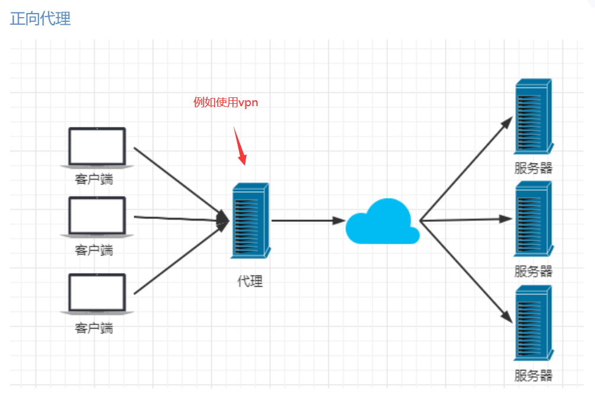
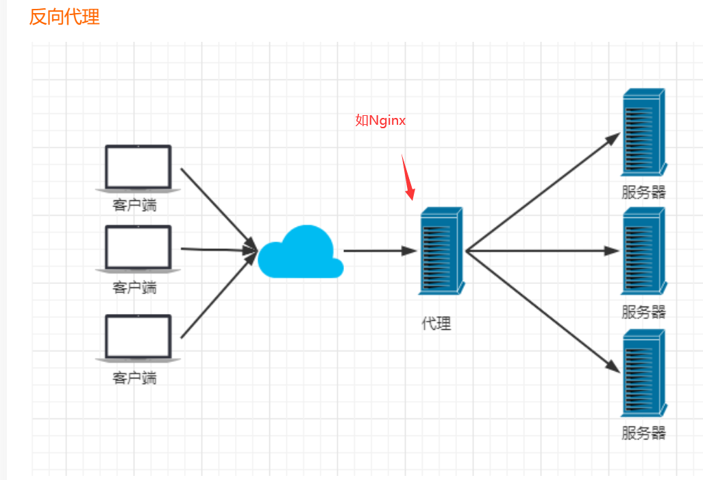
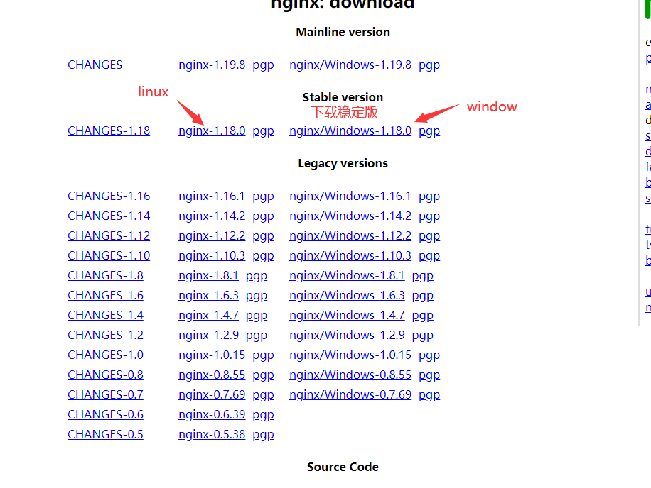
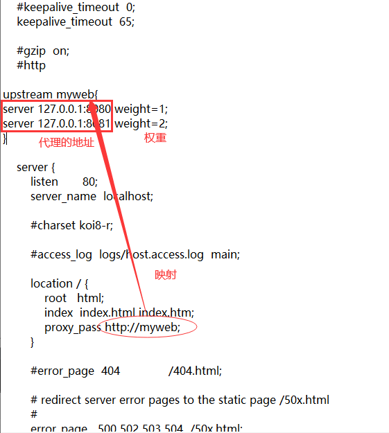
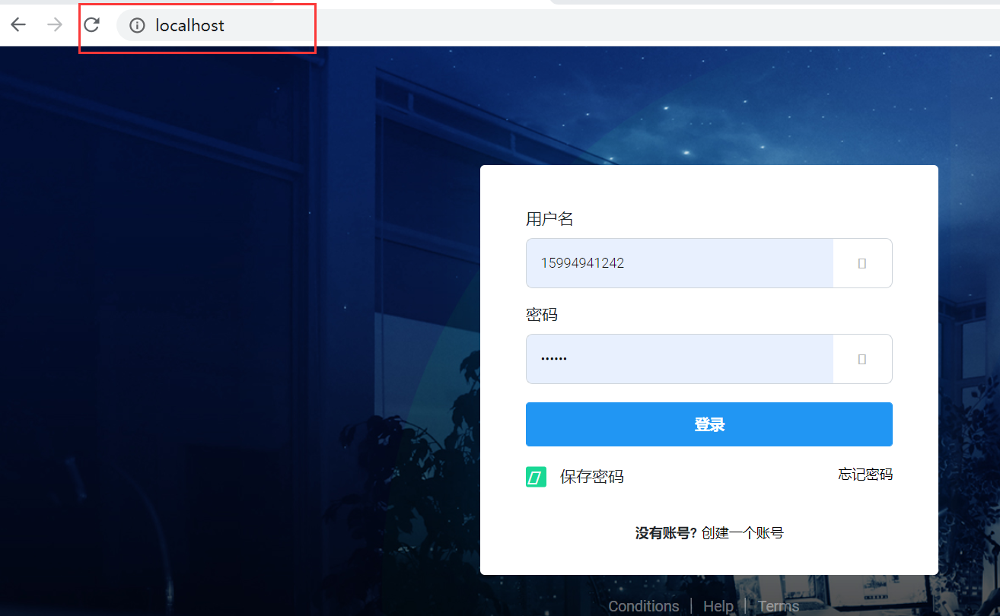

# 1.什么是Nginx？

- Nginx (engine x) 是一个高性能的HTTP和反向代理web服务器，同时也提供了IMAP/POP3/SMTP服务。Nginx是由伊戈尔·赛索耶夫为俄罗斯访问量第二的Rambler.ru站点（俄文：Рамблер）开发的，第一个公开版本0.1.0发布于2004年10月4日。2011年6月1日，nginx 1.0.4发布。
- 其特点是占有内存少，并发能力强，事实上nginx的并发能力在同类型的网页服务器中表现较好，中国大陆使用nginx网站用户有：百度、京东、新浪、网易、腾讯、淘宝等。在全球活跃的网站中有12.18%的使用比率，大约为2220万个网站。
- Nginx 是一个安装非常的简单、配置文件非常简洁（还能够支持perl语法）、Bug非常少的服务。
- Nginx 启动特别容易，并且几乎可以做到7*24不间断运行，即使运行数个月也不需要重新启动。你还能够不间断服务的情况下进行软件版本的升级。Nginx代码完全用C语言从头写成。官方数据测试表明能够支持高达 50,000 个并发连接数的响应。

# 2.Nginx的作用

Http代理，反向代理：作为web服务器最常用的功能之一，尤其是反向代理。





## Nginx提供的负载均衡策略有2种：

内置策略和扩展策略。

​	内置策略为轮询，加权轮询，Ip hash。

​	扩展策略，就天马行空，只有你想不到的没有他做不到的。


# 3.Nginx的安装

官网http://nginx.org/en/download.html下载即可



## 1）window下：

### a.启动Nginx：

(1)直接双击nginx.exe，双击后一个黑色的弹窗一闪而过

(2)打开cmd命令窗口，切换到nginx解压目录下，输入命令 `nginx.exe` ，回车即可

### b.检查Nginx是否启动成功：

直接在浏览器地址栏输入网址 http://localhost:80 回车，出现以下页面说明启动成功！


### c.关闭Nginx：

如果使用cmd命令窗口启动nginx， 关闭cmd窗口是不能结束nginx进程的，可使用两种方法关闭nginx

(1)输入nginx命令 `nginx -s stop`(快速停止nginx) 或 `nginx -s quit`(完整有序的停止nginx)

(2)使用taskkill `taskkill /f /t /im nginx.exe`

```bash
taskkill是用来终止进程的，
/f是强制终止 .
/t终止指定的进程和任何由此启动的子进程。
/im示指定的进程名称 .
```


## 2）linux下常用命令：

```bash
cd /usr/local/nginx/sbin/
./nginx  #启动
./nginx -s stop  #停止
./nginx -s quit  #安全退出
./nginx -s reload  #重新加载配置文件
ps aux|grep nginx  #查看nginx进程
```


# 4.项目实战：

## 1）打开已经打包好的jar包，并以不同的端口启动该项目

```bash
java -jar record-web-0.0.1-SNAPSHOT.jar --server.port=8080    #指定8080端口
java -jar record-web-0.0.1-SNAPSHOT.jar --server.port=8080    #指定8081端口
```

## 2）修改nginx中conf下的`nginx.conf`文件



## 3）重启nginx服务，访问本地80端口



