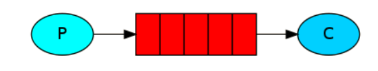
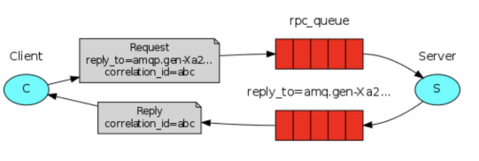
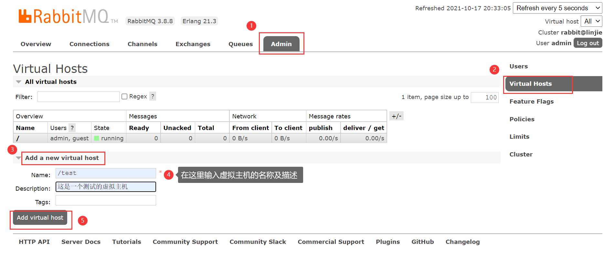
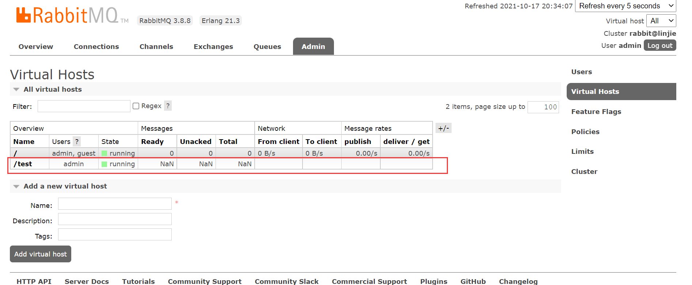
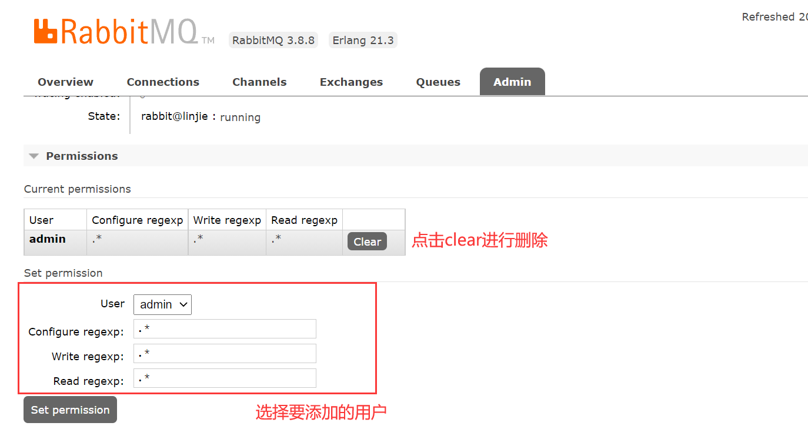
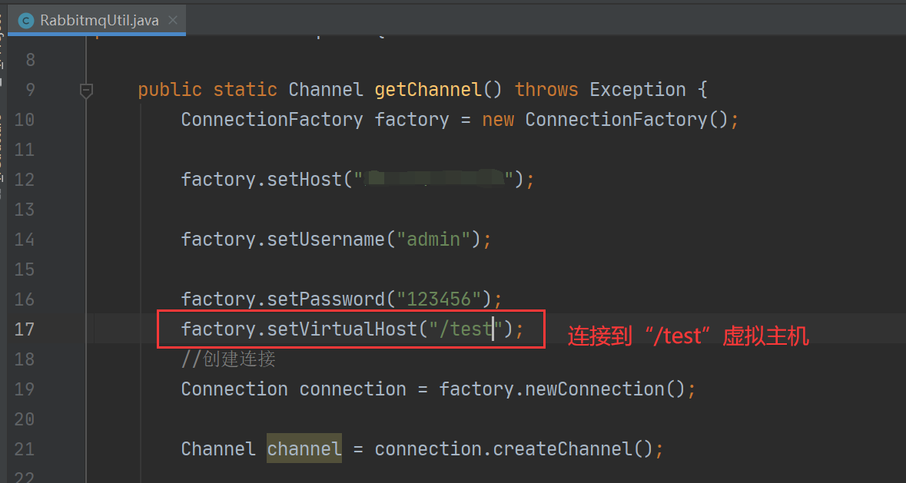
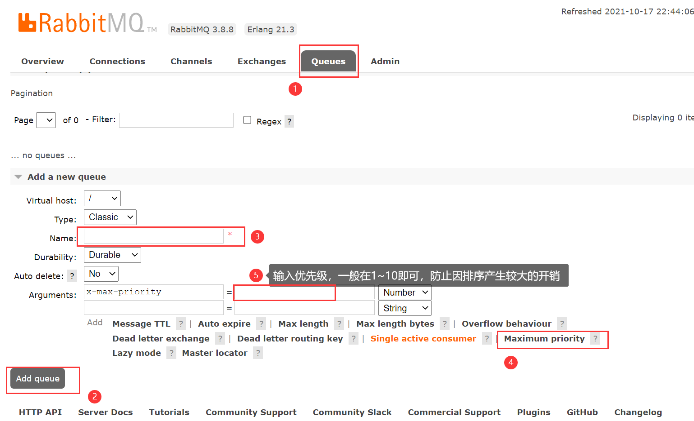
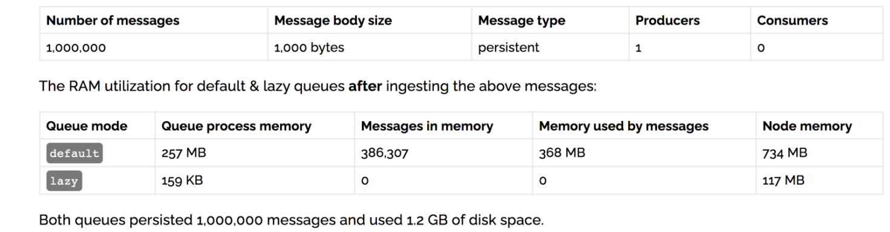

# 一、MQ的相关概念

## 1、什么是MQ？

MQ的全写是Message Queue，从字面上来看，本质是个队列，遵循先入先出的原则，只不过队列中存放的内容是message而已，还是一种跨进程的通信机制，用于上下游传递消息。在互联网架构中，MQ 是一种非常常见的上下游“逻辑解耦+物理解耦”的消息通信服务。使用了 MQ 之后，消息发送上游只需要依赖 MQ，不用依赖其他服务。

## 2、为什么使用MQ？MQ的优点？

### 1）流量削锋

举个例子，如果订单系统最多能处理一万次订单，这个处理能力应付正常时段的下单时绰绰有余，正常时段我们下单一秒后就能返回结果。但是在高峰期，如果有两万次下单操作系统是处理不了的，只能限制订单超过一万后不允许用户下单。使用消息队列做缓冲，我们可以取消这个限制，把一秒内下的订单分散成一段时间来处理，这时有些用户可能在下单十几秒后才能收到下单成功的操作，但是比不能下单的体验要好。

### 2）应用解耦

A 系统发送数据到 BCD 三个系统，通过接口调用发送。如果 E 系统也要这个数据呢？那如果 C 系统现在不需要了呢？A 系统跟其它各种乱七八糟的系统严重耦合，A 系统产生一条比较关键的数据，很多系统都需要 A 系统将这个数据发送过来。如果使用 MQ，A 系统产生一条数据，发送到 MQ 里面去，哪个系统需要数据自己去 MQ 里面消费。如果新系统需要数据，直接从 MQ 里消费即可；如果某个系统不需要这条数据了，就取消对 MQ 消息的消费即可。这样下来，A 系统压根儿不需要去考虑要给谁发送数据，不需要维护这个代码，也不需要考虑人家是否调用成功、失败超时等情况。

就是一个系统或者一个模块，调用了多个系统或者模块，互相之间的调用很复杂，维护起来很麻烦。但是其实这个调用是不需要直接同步调用接口的，如果用 MQ 给它异步化解耦。

### 3）异步处理

A 系统接收一个请求，需要在自己本地写库，还需要在 BCD 三个系统写库，自己本地写库要 3ms，BCD 三个系统分别写库要 300ms、450ms、200ms。最终请求总延时是 3 + 300 + 450 + 200 = 953ms，接近 1s，用户体验效果会比较差。如果使用 MQ，那么 A 系统连续发送 3 条消息到 MQ 队列中，假如耗时 5ms，A 系统从接受一个请求到返回响应给用户，总时长是 3 + 5 = 8ms。

## 3、常见的MQ分类

### 1）ActiveMQ

1. 优点：单机吞吐量万级，时效性 ms 级，可用性高，基于主从架构实现高可用性，消息可靠性较 低的概率丢失数据；
2. 缺点：官方社区现在对 ActiveMQ 5.x 维护越来越少，高吞吐量场景较少使用，现在也用的不多。

### 2）Kafak

1. 简介：kafak是为大数据而生的消息中间键。
2. 优点：性能卓越，单机写入 TPS 约在百万条/秒，最大的优点，就是吞吐量高；在大数据领域的实时计算以及日志采集被大规模使用。
3. 缺点：Kafka 单机超过 64 个队列/分区，Load 会发生明显的飙高现象，队列越多，load 越高，发送消 息响应时间变长，使用短轮询方式，实时性取决于轮询间隔时间，消费失败不支持重试；支持消息顺序， 但是一台代理宕机后，就会产生消息乱序；

### 3）RocketMQ

1. 简介：RocketMQ 出自阿里巴巴的开源产品，用 Java 语言实现，在设计时参考了 Kafka，并做出了自己的一 些改进。被阿里巴巴广泛应用在订单，交易，充值，流计算，消息推送，日志流式处理，binglog 分发等场 景。
2. 优点：单机吞吐量十万级,可用性非常高，分布式架构,消息可以做到 0 丢失,MQ 功能较为完善，还是分 布式的，扩展性好,支持 10 亿级别的消息堆积，不会因为堆积导致性能下降,源码是 java 我们可以自己阅 读源码，定制自己公司的 MQ；
3. 缺点：支持的客户端语言不多，目前是 java 及 c++，其中 c++不成熟；社区活跃度一般,没有在 MQ 核心中去实现 JMS 等接口,有些系统要迁移需要修改大量代码

### 4）RabbitMQ

1. 简介：2007 年发布，是一个在 AMQP(高级消息队列协议)基础上完成的，可复用的企业消息系统，是当前最主流的消息中间件之一。
2. 优点：由于 erlang 语言的高并发特性，性能较好；吞吐量到万级，MQ 功能比较完备,健壮、稳定、易 用、跨平台、支持多种语言 如：Python、Ruby、.NET、Java、JMS、C、PHP、ActionScript、XMPP、STOMP 等，支持 AJAX 文档齐全；开源提供的管理界面非常棒，用起来很好用,社区活跃度高；更新频率相当高；
3. 缺点：商业版需要收费,学习成本较高。

## 4、MQ有哪些常见的问题

### 1）消息的顺序问题：

消息有序指的是可以按照消息的发送顺序来消费。

假如生产者产生了 2 条消息：M1、M2，假定 M1 发送到 S1，M2 发送到 S2，如果要保证 M1 先于 M2 被消费，怎么做？


解决方案：

（1）保证生产者 - MQServer - 消费者是一对一对一的关系


缺陷：

- 并行度就会成为消息系统的瓶颈（吞吐量不够）
- 更多的异常处理，比如：只要消费端出现问题，就会导致整个处理流程阻塞，我们不得不花费更多的精力来解决阻塞的问题。 

（2）通过合理的设计或者将问题分解来规避。

- 不关注乱序的应用实际大量存在
- 队列无序并不意味着消息无序，所以从业务层面来保证消息的顺序而不仅仅是依赖于消息系统，是一种更合理的方式。

### 2）消息的重复问题：

造成消息重复的根本原因是：网络不可达。

所以解决这个问题的办法就是绕过这个问题。那么问题就变成了：如果消费端收到两条一样的消息，应该怎样处理？

消费端处理消息的业务逻辑保持幂等性。只要保持幂等性，不管来多少条重复消息，最后处理的结果都一样。保证每条消息都有唯一编号且保证消息处理成功与去重表的日志同时出现。利用一张日志表来记录已经处理成功的消息的 ID，如果新到的消息 ID 已经在日志表中，那么就不再处理这条消息。

**具体步骤：**

1）给每一条消息都设置MessageId：

```java
【生产者中的代码】
Message message = MessageBuilder.withBody(msg.getBytes()).setContentType(MessageProperties.CONTENT_TYPE_JSON)
        .setContentEncoding("utf-8").setMessageId(UUID.randomUUID()+"").build();
```

2）消费前先判断此消息是否已经被消费过了，若消费过了，直接丢弃，未消费则进行消费，消费完后修改messageId的状态，并存入日志表(也可以存到redis中，key为消息Id、value为状态)：

```java
//【redis中的方法】
@Resource(name = "redisTemplate")
private RedisTemplate redisTemplate;

public String get(String message){
    String status = redisTemplate.opsForValue().get(message)
    return status ;
}

public void set(String message){
    redisTemplate.opsForValue().set(message,1);	//1代表已经消费过了
}

【消费者中的方法】
String value = redisUtil.get(messageId)+"";
if(value.equals("1") ){ //表示已经消费
    return; //结束
}
……//未消费则在这里进行消费
redisUtil.set(message,"1");		//消费完后把value值改为“1”
```


## 5、JMS VS AMQP

### 1）JMS

通常所说的JMS（Java Message Service）实际上是指JMS API。JMS是由Sun公司早期提出的消息标准，旨在为java应用提供统一的消息操作，包括create、send、receive等。JMS已经成为Java Enterprise Edition的一部分。从使用角度看，JMS和JDBC担任差不多的角色，用户都是根据相应的接口可以和实现了JMS的服务进行通信，进行相关的操作。

 JMS提供了两种消息模型，peer-2-peer（点对点）以及publish-subscribe（发布订阅）模型。

- 当采用点对点模型时，消息将发送到一个队列，该队列的消息只能被一个消费者消费。
- 而采用发布订阅模型时，消息可以被多个消费者消费。在发布订阅模型中，生产者和消费者完全独立，不需要感知对方的存在。

### 2）AMQP

AMQP（advanced message queuing protocol）是一种协议，更准确的说是一种binary wire-level protocol（链接协议）。这是其和JMS的本质差别，AMQP不从API层进行限定，而是直接定义网络交换的数据格式。这使得实现了AMQP的provider天然性就是跨平台的。意味着我们可以使用Java的AMQP provider，同时使用一个python的producer加一个rubby的consumer。从这一点看，AQMP可以用http来进行类比，不关心实现的语言，只要大家都按照相应的数据格式去发送报文请求，不同语言的client均可以和不同语言的server链接。

在AMQP中，消息路由（messager outing）和JMS存在一些差别，在AMQP中增加了Exchange和binding的角色。producer将消息发送给Exchange，binding决定Exchange的消息应该发送到那个queue，而consumer直接从queue中消费消息。queue和exchange的bind有consumer来决定。

### 3）对比

|              | JMS                                                          | AMQP                                                         |
| ------------ | ------------------------------------------------------------ | ------------------------------------------------------------ |
| 定义         | Java api                                                     | Wire-protocol                                                |
| 跨语言       | 否                                                           | 是                                                           |
| 跨平台       | 否                                                           | 是                                                           |
| Model        | 提供两种消息模型：<br />（1）Peer-2-Peer<br />（2）Pub/sub   | 提供了五种消息模型：direct exchange、fanout exchange、topic change、headers exchange、system exchange |
| 支持消息类型 | 多种消息类型：<br />TextMessage<br />MapMessage<br />BytesMessage<br />StreamMessage<br />ObjectMessage<br />Message （只有消息头和属性） | byte[]<br />当实际应用时，有复杂的消息，可以将消息序列化后发送。 |
| 综合评价     | JMS 定义了JAVA API层面的标准；在java体系中，多个client均可以通过JMS进行交互，不需要应用修改代码，但是其对跨平台的支持较差； | AMQP定义了wire-level层的协议标准；天然具有跨平台、跨语言特性。 |


---

# 二、RabbitMQ

## 1、什么是RabbitMQ？

RabbitMQ是一款开源的，Erlang编写的，基于AMQP协议的消息中间件。

## 2、RabbitMQ的使用场景

- 服务间异步通信；
- 顺序消费；
- 定时任务；
- 请求削锋。

## 3、RabbitMQ的基本概念

- Broker： 简单来说就是消息队列服务器实体；
- Exchange： 消息交换机，它指定消息按什么规则，路由到哪个队列；
- Queue： 消息队列载体，每个消息都会被投入到一个或多个队列；
- Binding： 绑定，它的作用就是把exchange和queue按照路由规则绑定起来；
- Routing Key： 路由关键字，exchange根据这个关键字进行消息投递；
- VHost： vhost 可以理解为虚拟 broker ，即 mini-RabbitMQ server。其内部均含有独立的 queue、exchange 和 binding 等，但最最重要的是，其拥有独立的权限系统，可以做到 vhost 范围的用户控制。当然，从 RabbitMQ 的全局角度，vhost 可以作为不同权限隔离的手段（一个典型的例子就是不同的应用可以跑在不同的 vhost 中）。
- Producer： 消息生产者，就是投递消息的程序；
- Consumer： 消息消费者，就是接受消息的程序
- Channel： 消息通道，在客户端的每个连接里，可建立多个channel，每个channel代表一个会话任务。

由Exchange、Queue、RoutingKey三个才能决定一个从Exchange到Queue的唯一的线路。

## 4、RabbitMQ的工作模式

### 1）Simple



最简单的收发模式，只有一个消费者。

### 2）Work工作模式


- 多个消费者从同一个队列获取消息，默认是轮询的方式，也可以设置成竞争模式；

**消息确认：**（队列->消费者）

为什么需要消息确认？

在轮询的情况下，消费者从队列中获取到消息后，如果还未来得及进行消费就挂了，又由于默认情况下队列把消息发给消费者后会将消息立即删除，这样子的话，就会导致某些消息未被消费。

如何进行消息确认？

```java
//【消费者】
public static void main(String[] args) throws Exception{
    Channel channel = RabbitmqUtil.getChannel();
    /*一次只向消费者发送一条消息
     *在返回确认回执前, 不要向消费者发送新消息. 而是把消息发给下一个空闲的消费者
     */
    int prefetchCount = 1;
    channel.basicQos(prefetchCount);
    //收到消息后用来处理消息的回调对象
    DeliverCallback deliverCallback = (consumerTag,message)->{
        try {
            Thread.sleep(1000);
        } catch (InterruptedException e) {
            e.printStackTrace();
        }
        System.out.println("接收到的消息："+new String(message.getBody(),"UTF-8"));
        /* 发送回执
         * 第一个参数表示消息标记tag
         * 第二个参数表示是否批量应答，true表示批量应答
         * 比如说，当设置为true时：
		 * channel 上有传送 tag 的消息 5,6,7,8 
		 * 当前 tag 是 8 ，那么此时5-8 的这些还未应答的消息都会被确认收到消息应答。
		 * 如果设置为false，则只会应答 tag=8 的消息 5,6,7 这三个消息依然不会被确认收到消息应答
         */
        channel.basicAck(message.getEnvelope().getDeliveryTag(),false);
    };
    //消费者取消时的回调对象
    channel.basicConsume(ACK_QUEUE,false,deliverCallback,(consumerTag -> {
        System.out.println("消息被中断");
    }));
}
```

**消息持久化**

当rabbitmq关闭时, 我们队列中的消息仍然会丢失, 除非明确要求它不要丢失数据，要求rabbitmq不丢失数据要做如下两点: 

1. 队列设置为可持久化, 可以在定义队列时指定参数durable为true

   ```java
   //第二个参数是持久化参数durable
   ch.queueDeclare("helloworld", true, false, false, null);
   ```

2. 设置队列中消息的持久化

   ```java
   //第三个参数设置消息持久化
   ch.basicPublish("", "helloworld",MessageProperties.PERSISTENT_TEXT_PLAIN, msg.getBytes());
   ```

### 3）Publish/Subscibe发布订阅模式


- 把消息发送给所有的消费者，同一条消息所有的消费者都可以收到；
- 生产者职责：定义`fanout交换机`，向交换机发送数据；
- 消费者职责：定义`fanout交换机`，定义队列，进行交换机和队列的绑定，从队列获取数据。
- 应用场景：在我们的日志系统中，接收程序的每个运行副本都将获得消息。这样，我们就可以运行一个消费者并将日志保存到磁盘；同时我们可以运行另一个消费者在屏幕上打印日志。最终, 消息会被广播到所有消息接受者。

> **Exchanges 交换机**
>
> RabbitMQ消息传递模型的核心思想是，生产者永远不会将任何消息直接发送到队列。实际上，通常生产者甚至不知道消息是否会被传递到任何队列。
>
> 交换机是一个非常简单的东西。一边接收来自生产者的消息，另一边将消息推送到队列。交换器必须确切地知道如何处理它接收到的消息。它应该被添加到一个特定的队列中吗?它应该添加到多个队列中吗?或者它应该被丢弃。这些规则由exchange的类型定义。
>
> 类型：direct、topic、header和fanout（这里使用fanout）
>
> **绑定Bindings**
>
> ```java
> //将交换机定义为扇出模式
> channel.exchangeDeclare(EXCHANGE_NAME,"fanout");
> /*在某些情况下可以考虑使用临时队列，
> *即：随机生成名称的、非持久的、独占的、自动删除的队列（随着队列和消费者断开而删除）
> */
> String queueName = ch.queueDeclare().getQueue();
> /*进行交换机和队列的绑定
> *第一个参数为：队列名
> *第二个参数为：交换机名称
> *第三个参数为：routingKey（由于我们定义了fanout类型的交换机，routingKey将失效）
> */
> channel.queueBind(queueName,EXCHANGE_NAME,"");
> ```

### 4）routing路由模式


- 和发布/订阅模式类似，但交换机会根据routingkey将消息发送到指定的队列中，并且交换机必须声明为`direct`模式；
- 使用相同的bindingKey绑定多个队列是完全允许的。（如上图中的routingkey可以全是orange）。

```java
//将交换机定义为直连模式
channel.exchangeDeclare(EXCHANGE_NAME,"direct");
/*进行交换机和队列的绑定
 *第一个参数为：队列名
 *第二个参数为：交换机名称
 *第三个参数为：routingKey
 */
channel.queueBind(queueName,EXCHANGE_NAME,"orange");//只给Q1发送消息
```


### 5）topic主体模式


- 和routing路由模式类似，但是它使用“*”（`*`可以通配单个单词）或“#”（`#` 可以通配零个或多个单词）来匹配routingkey（用“.”做分割），类似于sql中的模糊查询，交换机必须定义为`topic`模式。

比如说：我们把消息发送到Q1中，routingkey为“a.orange.a”或“b.orange.b”都是可以的。

### 6）RPC模式



我们可以使用RabbitMQ的RPC模式去搭建一个RPC系统。

- **客户端：**

  在客户端定义一个RPCClient类,并定义一个call()方法,这个方法发送一个RPC请求,并等待接收响应结果。

  ```java
  RPCClient client = new RPCClient();
  String result = client.call("4");
  System.out.println( "第四个斐波那契数是: " + result);
  ```

- **回调队列 Callback Queue**

  客户端发送请求信息，并得到一个服务器端回复的响应信息。为了得到响应信息，我们需要在请求的时候发送一个“回调”队列地址。我们可以使用默认队列。

  下面是示例代码：

  ```java
  //定义回调队列,
  //自动生成对列名,非持久,独占,自动删除
  callbackQueueName = ch.queueDeclare().getQueue();
  
  //用来设置回调队列的参数对象
  BasicProperties props = new BasicProperties
                              .Builder()
                              .replyTo(callbackQueueName)
                              .build();
  //发送调用消息
  ch.basicPublish("", "rpc_queue", props, message.getBytes());
  ```

- **关联id (correlationId)**

  在上面的代码中，我们会为每个RPC请求创建一个回调队列。 这是非常低效的，这里还有一个更好的方法:让我们为每个客户端创建一个回调队列。

  这就提出了一个新的问题，在队列中得到一个响应时，我们不清楚这个响应所对应的是哪一条请求。这时候就需要使用关联id（correlationId）。我们将为每一条请求设置唯一的的id值。稍后，当我们在回调队列里收到一条消息的时候，我们将查看它的id属性，这样我们就可以匹配对应的请求和响应。如果我们发现了一个未知的id值，我们可以安全的丢弃这条消息，因为它不属于我们的请求。

- **完整代码**

【连接工具类】

```java
package com.lin.utils;

import com.rabbitmq.client.Channel;
import com.rabbitmq.client.Connection;
import com.rabbitmq.client.ConnectionFactory;

public class RabbitmqUtil {
    public static Channel getChannel() throws Exception {
        ConnectionFactory factory = new ConnectionFactory();
        factory.setHost("xxxxxxx");		//rabbitmq服务器地址
        factory.setUsername("admin");	//rabbitmq服务器用户名
        factory.setPassword("123456");	//rabbitmq服务器密码
        //创建连接
        Connection connection = factory.newConnection();
        Channel channel = connection.createChannel();
        return channel;
    }
}
```

【服务端类】

```java
package com.lin.RPCModel;

import com.lin.utils.RabbitmqUtil;
import com.rabbitmq.client.AMQP.BasicProperties;
import com.rabbitmq.client.Channel;
import com.rabbitmq.client.DeliverCallback;
import com.rabbitmq.client.Delivery;

import java.io.IOException;

public class RPCServer {

    protected static int fbnq(int n) {
        if(n == 1 || n == 2) return 1;

        return fbnq(n-1)+fbnq(n-2);
    }

    public static void main(String[] args) throws Exception {
        Channel channel = RabbitmqUtil.getChannel();
        channel.queueDeclare("rpc_queue", false, false, false, null);
        channel.queuePurge("rpc_queue");//清除队列中的内容
        channel.basicQos(1);
        DeliverCallback deliverCallback = new DeliverCallback() {
            @Override
            public void handle(String consumerTag, Delivery message) throws IOException {
                //处理收到的数据(要求第几个斐波那契数)
                String msg = new String(message.getBody(), "UTF-8");
                int n = Integer.parseInt(msg);
                //求出第n个斐波那契数
                int r = fbnq(n);
                String response = String.valueOf(r);

                //设置响应的id，与请求id一致，这样客户就可以把该响应与它的请求进行对应
                BasicProperties replyProps = new BasicProperties.Builder()
                        .correlationId(message.getProperties().getCorrelationId())
                        .build();
                /*
                 * 发送响应消息
                 * 1. 默认交换机
                 * 2. 由客户端指定的,用来传递响应消息的队列名
                 * 3. 参数(关联id)
                 * 4. 发回的响应消息
                 */
                channel.basicPublish("",message.getProperties().getReplyTo(),
                        replyProps,response.getBytes("UTF-8"));
                //发送确认消息
                channel.basicAck(message.getEnvelope().getDeliveryTag(),false);
            }
        };
        //消费者开始接收消息, 等待从 rpc_queue接收请求消息, 不自动确认
        channel.basicConsume("rpc_queue", false, deliverCallback,(consumerTag -> {
            System.out.println("消息被中断");
        }));
    }
}

```

【客户端类】

```java
package com.lin.RPCModel;

import com.lin.utils.RabbitmqUtil;
import com.rabbitmq.client.Channel;
import com.rabbitmq.client.AMQP.BasicProperties;
import com.rabbitmq.client.DeliverCallback;
import com.rabbitmq.client.Delivery;

import java.io.IOException;
import java.util.Scanner;
import java.util.UUID;
import java.util.concurrent.ArrayBlockingQueue;
import java.util.concurrent.BlockingQueue;

public class RPCClient {

    Channel channel = null;

    public RPCClient() throws Exception{
        channel = RabbitmqUtil.getChannel();
    }

    public String call(String msg) throws Exception{
        //自动生成对列名,非持久,独占,自动删除
        String replyQueueName = channel.queueDeclare().getQueue();
        //生成关联id
        String corrId = UUID.randomUUID().toString();

        //设置两个参数:
        //1. 请求和响应的关联id
        //2. 传递响应数据的queue
        BasicProperties props = new BasicProperties.Builder()
                .correlationId(corrId)
                .replyTo(replyQueueName)
                .build();
        //向 rpc_queue 队列发送请求数据, 请求第n个斐波那契数
        channel.basicPublish("","rpc_queue",props,msg.getBytes("UTF-8"));

        //用来保存结果的阻塞集合,取数据时,没有数据会暂停等待
        BlockingQueue<String> response = new ArrayBlockingQueue<String>(1);

        //接收响应数据的回调对象
        DeliverCallback deliverCallback = new DeliverCallback() {
            @Override
            public void handle(String consumerTag, Delivery message) throws IOException {
                //如果响应消息的关联id,与请求的关联id相同,我们来处理这个响应数据
                if (message.getProperties().getCorrelationId().contentEquals(corrId)) {
                    //把收到的响应数据,放入阻塞集合
                    response.offer(new String(message.getBody(), "UTF-8"));
                }
            }
        };

        channel.basicConsume(replyQueueName,true,deliverCallback,(consumerTag -> {
            System.out.println("消息被中断");
        }));
        return response.take();
    }

    public static void main(String[] args) throws Exception{
        RPCClient client = new RPCClient();
        while (true) {
            System.out.print("求第几个斐波那契数:");
            int n = new Scanner(System.in).nextInt();
            String r = client.call(""+n);
            System.out.println(r);
        }
    }

}
```

## 5、如何确保消息正确地发送至RabbitMQ？

**开启“发送方确认模式”。**

```java
Channel channel = RabbitmqUtil.getChannel();
//开启发布确认
channel.confirmSelect();
```

### 1）原理

1. 将信道设置成 confirm 模式（发送方确认模式），则所有在信道上发布的消息都会被指派一个唯一的 ID。
2. 一旦消息被投递到目的队列后，或者消息被写入磁盘后（可持久化的消息），信道会发送一个确认给生产者（包含消息唯一 ID）。

3. 如果 RabbitMQ 发生内部错误从而导致消息丢失，会发送一条 nack（notacknowledged，未确认）消息。

4. 发送方确认模式是异步的，生产者应用程序在等待确认的同时，可以继续发送消息。当确认消息到达生产者应用程序，生产者应用程序的回调方法就会被触发来处理确认消息。

### 2）发布确认的三种模式

#### I. 单个确认模式：

这是一种简单的确认方式，它是一种同步确认发布的方式，也就是发布一个消息之后只有它 被确认发布，后续的消息才能继续发布,waitForConfirmsOrDie(long)这个方法只有在消息被确认 的时候才返回，如果在指定时间范围内这个消息没有被确认那么它将抛出异常。

这种确认方式有一个最大的缺点就是：发布速度特别的慢，因为如果没有确认发布的消息就会阻塞所有后续消息的发布，这种方式最多提供每秒不超过数百条发布消息的吞吐量。当然对于某些应用程序来说这可能已经足够了。

代码案例：

```java
private final static int MESSAGE_COUNT = 100;
    
public static void publishMessageIndividually() throws Exception {
    try (Channel channel = RabbitmqUtil.getChannel()) {
        String queueName = UUID.randomUUID().toString();
        channel.queueDeclare(queueName, false, false, false, null);
        //开启发布确认
        channel.confirmSelect();
        for (int i = 0; i < MESSAGE_COUNT; i++) {
            String message = i + "";
            channel.basicPublish("", queueName, null, message.getBytes());
            //服务端返回 false 或超时时间内未返回，生产者可以消息重发
            boolean flag = channel.waitForConfirms();
            if(flag){
                System.out.println("消息发送成功");
            }
        }
    }
}
```


#### II.  批量确认模式：

上面那种方式非常慢，与单个等待确认消息相比，先发布一批消息然后一起确认可以极大地 提高吞吐量，当然这种方式的缺点就是:当发生故障导致发布出现问题时，不知道是哪个消息出现 问题了，我们必须将整个批处理保存在内存中，以记录重要的信息而后重新发布消息。当然这种 方案仍然是同步的，也一样阻塞消息的发布。

代码案例：

```java
private final static int MESSAGE_COUNT = 100;

public static void publishMessageBatch() throws Exception {
    try (Channel channel = RabbitmqUtil.getChannel()) {
        String queueName = UUID.randomUUID().toString();
        channel.queueDeclare(queueName, false, false, false, null);
        //开启发布确认
        channel.confirmSelect();
        //批量确认消息大小
        int batchSize = 10;
        //未确认消息个数
        int outstandingMessageCount = 0;
        for (int i = 0; i < MESSAGE_COUNT; i++) {
            String message = i + "";
            channel.basicPublish("", queueName, null, message.getBytes());
            outstandingMessageCount++;
            if (outstandingMessageCount == batchSize) {
                channel.waitForConfirms();
                outstandingMessageCount = 0;
            }
        }
        //为了确保还有剩余没有确认消息 再次确认
        if (outstandingMessageCount > 0) {
            channel.waitForConfirms();
        }
    }
}
```


#### III. 异步确认模式：

异步确认虽然编程逻辑比上两个要复杂，但是性价比最高，无论是可靠性还是效率都没得说， 他是利用回调函数来达到消息可靠性传递的，这个中间件也是通过函数回调来保证是否投递成功。

代码案例：

```java
private final static int MESSAGE_COUNT = 100;

public static void publishMessageAsync() throws Exception {
    try (Channel channel = RabbitmqUtil.getChannel()) {
        String queueName = UUID.randomUUID().toString();
        channel.queueDeclare(queueName, false, false, false, null);
        //开启发布确认
        channel.confirmSelect();
        /**
             * ConcurrentSkipListMap线程安全有序的一个哈希表，适用于高并发的情况
             * 1.轻松的将序号与消息进行关联
             * 2.轻松批量删除条目 只要给到序列号
             * 3.支持并发访问
             */
        ConcurrentSkipListMap<Long, String> outstandingConfirms = 
            new ConcurrentSkipListMap<>();
        /**
             * 确认收到消息的一个回调
             * 1.消息序列号
             * 2.true 可以确认小于等于当前序列号的消息
             * false 确认当前序列号消息
             */
        ConfirmCallback ackCallback = (sequenceNumber, multiple) -> {
            if (multiple) {
                //返回的是小于等于当前序列号的未确认消息 是一个 map
                ConcurrentNavigableMap<Long, String> confirmed =
                    outstandingConfirms.headMap(sequenceNumber, true);
                //清除该部分未确认消息
                confirmed.clear();
            } else {
                //只清除当前序列号的消息
                outstandingConfirms.remove(sequenceNumber);
            }
        };
        ConfirmCallback nackCallback = (sequenceNumber, multiple) -> {
            String message = outstandingConfirms.get(sequenceNumber);
            System.out.println("发布的消息" + message + "未被确认，序列号" + sequenceNumber);
        };
        /**
             * 添加一个异步确认的监听器
             * 1.确认收到消息的回调
             * 2.未收到消息的回调
             */
        channel.addConfirmListener(ackCallback, nackCallback);
        for (int i = 0; i < MESSAGE_COUNT; i++) {
            String message = "消息" + i;
            /**
                 * channel.getNextPublishSeqNo()获取下一个消息的序列号
                 * 通过序列号与消息体进行一个关联
                 * 全部都是未确认的消息体
                 */
            outstandingConfirms.put(channel.getNextPublishSeqNo(), message);
            channel.basicPublish("", queueName, null, message.getBytes());
        }
    }
}
```

> 总结：
>
> - 单独发布消息：
>
> 同步等待确认，简单，但吞吐量非常有限。 
>
> - 批量发布消息：
>
> 批量同步等待确认，简单，合理的吞吐量，一旦出现问题但很难推断出是那条 消息出现了问题。 
>
> - 异步处理： 
>
> 最佳性能和资源使用，在出现错误的情况下可以很好地控制，但是实现起来稍微难些

## 6、 如何确保消息接收方消费了消息？

**接收方确认机制**

消费者接收每一条消息后都必须进行确认（消息接收和消息确认是两个不同操作）。只有消费者确认了消息，RabbitMQ 才能安全地把消息从队列中删除。

这里并没有用到超时机制，RabbitMQ 仅通过 Consumer 的连接中断来确认是否需要重新发送消息。也就是说，只要连接不中断，RabbitMQ 给了 Consumer 足够长的时间来处理消息。保证数据的最终一致性；

下面罗列几种特殊情况

1. 如果消费者接收到消息，在确认之前断开了连接或取消订阅，RabbitMQ 会认为消息没有被分发，然后重新分发给下一个订阅的消费者。（可能存在消息重复消费的隐患，需要去重）；
2. 如果消费者接收到消息却没有确认消息，连接也未断开，则 RabbitMQ 认为该消费者繁忙，将不会给该消费者分发更多的消息。

（具体代码实现过程可以参考上面“Work工作模式”）

## 7、如何保证消息不被重复消费？

（或：如何保证消息消费时的幂等性）

参考上面“消息的重复问题”

## 8、如何保证RabbitMQ消息的可靠传输？

消息不可靠的情况可能是消息丢失、劫持等原因；

这里只考虑丢失的情况，丢失可分为一下三种：

### 1）生产者丢失消息：

从生产者弄丢数据这个角度来看，RabbitMQ提供transaction和confirm模式来确保生产者不丢消息；

**transaction机制：**发送消息前，开启事务（channel.txSelect()）,然后发送消息，如果发送过程中出现什么异常，事务就会回滚（channel.txRollback()）,如果发送成功则提交事务（channel.txCommit()）。然而，这种方式有个缺点：吞吐量下降；

**confirm机制：**这个机制用的较多，一旦channel进入confirm模式，所有在该信道上发布的消息都将会被指派一个唯一的ID（从1开始），一旦消息被投递到所有匹配的队列之后，rabbitMQ就会发送一个ACK给生产者（包含消息的唯一ID），这就使得生产者知道消息已经正确到达目的队列了。如果rabbitMQ没能处理该消息，则会发送一个Nack消息给生产者，生产者可以进行重试操作。

### 2）消息列表丢失消息：

处理消息队列丢数据的情况，一般是开启持久化磁盘的配置，即持久化。

这个持久化配置可以和confirm机制配合使用，你可以在消息持久化磁盘后，再给生产者发送一个Ack信号。这样，如果消息持久化磁盘之前，rabbitMQ阵亡了，那么生产者收不到Ack信号，生产者会自动重发。

### 3）消费者丢失消息：

消费者丢数据一般是因为采用了自动确认消息模式，改为手动确认消息即可！

## 9、如何保证高可用的？

RabbitMQ 有三种模式：

- 单机模式：生产中基本不会使用；

- 普通集群模式：

  多台机器上启动多个 RabbitMQ 实例，每个机器启动一个。你创建的 queue，只会放在一个 RabbitMQ 实例上，但是每个实例都同步 queue 的元数据（元数据可以认为是 queue 的一些配置信息，通过元数据，可以找到 queue 所在实例）。你消费的时候，实际上如果连接到了另外一个实例，那么那个实例会从 queue 所在实例上拉取数据过来。这方案主要是提高吞吐量的，就是说让集群中多个节点来服务某个 queue 的读写操作。

- 镜像模式：

  这种模式，才是所谓的 RabbitMQ 的高可用模式。跟普通集群模式不一样的是，在镜像集群模式下，你创建的 queue，无论元数据还是 queue 里的消息都会存在于多个实例上，就是说，每个 RabbitMQ 节点都有这个 queue 的一个完整镜像，包含 queue 的全部数据的意思。然后每次你写消息到 queue 的时候，都会自动把消息同步到多个实例的 queue 上。RabbitMQ 有很好的管理控制台，就是在后台新增一个策略，这个策略是镜像集群模式的策略，指定的时候是可以要求数据同步到所有节点的，也可以要求同步到指定数量的节点，再次创建 queue 的时候，应用这个策略，就会自动将数据同步到其他的节点上去了。这样的话，好处在于，你任何一个机器宕机了，没事儿，其它机器（节点）还包含了这个 queue 的完整数据，别的 consumer 都可以到其它节点上去消费数据。坏处在于，第一，这个性能开销也太大了吧，消息需要同步到所有机器上，导致网络带宽压力和消耗很重！RabbitMQ 一个 queue 的数据都是放在一个节点里的，镜像集群下，也是每个节点都放这个 queue 的完整数据。

## 10、virtual host是什么？

在RabbitMQ中叫做虚拟消息服务器VirtualHost，每个VirtualHost相当于一个相对独立的RabbitMQ服务器，每个VirtualHost之间是相互隔离的。exchange、queue、message不能互通。

创建virtual host：`/test`

1. 进入虚拟机管理界面：

2. 添加新的虚拟机’/test’,名称必须以"/"开头：

   

3. 查看添加的结果：

   

4. 设置虚拟机的用户访问权限：

   

5. 连接到/test虚拟主机：

   

## 11、死信队列

### 1）死信的概念

死信，顾名思义就是无法被消费的消息，字面意思可以这样理 解，一般来说，producer 将消息投递到 broker 或者直接到 queue 里了，consumer 从 queue 取出消息 进行消费，但某些时候由于特定的原因导致 queue 中的某些消息无法被消费，这样的消息如果没有 后续的处理，就变成了死信，有死信自然就有了死信队列。

应用场景：

### 2）死信的来源

- 消息TTL过期；
- 队列达到最大长度；
- 消息被拒绝（basic.reject 或 basic.nack）并且requeu=false。

## 12、延迟队列

### 1）延迟队列概念

延时队列，队列内部是有序的，最重要的特性就体现在它的延时属性上，延时队列中的元素是希望在指定时间到了以后或之前取出和处理，简单来说，延时队列就是用来存放需要在指定时间被处理的元素的队列。

### 2）延迟队列的使用场景

1. 订单在十分钟之内未支付则自动取消 

2. 新创建的店铺，如果在十天内都没有上传过商品，则自动发送消息提醒。 

3. 用户注册成功后，如果三天内没有登陆则进行短信提醒。 
4. 用户发起退款，如果三天内没有得到处理则通知相关运营人员。 
5. 预定会议后，需要在预定的时间点前十分钟通知各个与会人员参加会议

这些场景都有一个特点，需要在某个事件发生之后或者之前的指定时间点完成某一项任务，如： 发生订单生成事件，在十分钟之后检查该订单支付状态，然后将未支付的订单进行关闭；看起来似乎 使用定时任务，一直轮询数据，每秒查一次，取出需要被处理的数据，然后处理不就完事了吗？如果 数据量比较少，确实可以这样做，比如：对于“如果账单一周内未支付则进行自动结算”这样的需求， 如果对于时间不是严格限制，而是宽松意义上的一周，那么每天晚上跑个定时任务检查一下所有未支 付的账单，确实也是一个可行的方案。但对于数据量比较大，并且时效性较强的场景，如：“订单十 分钟内未支付则关闭“，短期内未支付的订单数据可能会有很多，活动期间甚至会达到百万甚至千万 级别，对这么庞大的数据量仍旧使用轮询的方式显然是不可取的，很可能在一秒内无法完成所有订单 的检查，同时会给数据库带来很大压力，无法满足业务要求而且性能低下。

### 3）TTL是什么

TTL 是 RabbitMQ 中一个消息或者队列的属性，表明一条消息或者该队列中的所有 消息的最大存活时间，单位是毫秒。换句话说，如果一条消息设置了 TTL 属性或者进入了设置 TTL 属性的队列，那么这条消息如果在 TTL 设置的时间内没有被消费，则会成为"死信"。如果同时配置了队列的 TTL 和消息的 TTL，那么较小的那个值将会被使用，有两种方式设置 TTL。

```java
//第一种：消息设置 TTL 
private final static String NORMAL_EXCHANGE = "normal_exchange";

public static void main(String[] args) throws Exception{
    Channel channel = RabbitmqUtil.getChannel();
    //在生产者设置消息过期时间：10000ms
    AMQP.BasicProperties properties = 
        new AMQP.BasicProperties().builder().expiration("10000").build();

    for(int i = 0 ; i < 10 ; i ++){
        String message = "info" + i;
        channel.basicPublish(NORMAL_EXCHANGE,"zhangsan",
                             properties,message.getBytes());
        System.out.println("生产者发送消息："+message);
    }
}

//第二种：队列设置 TTL 
Map<String, Object> map = new HashMap<>();
map.put("x-message-ttl", 10000);
channel.queueDeclare(NORMAL_QUEUE, false, false, false, map);
```

> **两者的区别**
>
> 如果设置了队列的 TTL 属性，那么一旦消息过期，就会被队列丢弃（如果配置了死信队列被丢到死信队 列中），而第一种方式，消息即使过期，也不一定会被马上丢弃，因为消息是否过期是在即将投递到消费者 之前判定的，如果当前队列有严重的消息积压情况，则已过期的消息也许还能存活较长时间；另外，还需要注意的一点是，如果不设置 TTL，表示消息永远不会过期，如果将 TTL 设置为 0，则表示除非此时可以 直接投递该消息到消费者，否则该消息将会被丢弃。

## 13、优先级队列

### 1）使用场景

在我们系统中有一个订单催付的场景，我们的客户在天猫下的订单,淘宝会及时将订单推送给我们，如 果在用户设定的时间内未付款那么就会给用户推送一条短信提醒，很简单的一个功能对吧，但是，tmall 商家对我们来说，肯定是要分大客户和小客户的对吧，比如像苹果，小米这样大商家一年起码能给我们创 造很大的利润，所以理应当然，他们的订单必须得到优先处理，而曾经我们的后端系统是使用 redis 来存 放的定时轮询，大家都知道 redis 只能用 List 做一个简简单单的消息队列，并不能实现一个优先级的场景，所以订单量大了后采用 RabbitMQ 进行改造和优化,如果发现是大客户的订单给一个相对比较高的优先级， 否则就是默认优先级。

### 2）添加方式

1. 在控制台页面添加：

   

2. 在队列中代码添加优先级：

   ```java
   Map<String, Object> params = new HashMap();
   params.put("x-max-priority", 10);
   channel.queueDeclare("hello", true, false, false, params);
   ```

## 14、惰性队列

### 1）使用场景

​		RabbitMQ 从 3.6.0 版本开始引入了惰性队列的概念。惰性队列会尽可能的将消息存入磁盘中，而在消 费者消费到相应的消息时才会被加载到内存中，它的一个重要的设计目标是能够支持更长的队列，即支持更多的消息存储。当消费者由于各种各样的原因(比如消费者下线、宕机亦或者是由于维护而关闭等)而致使长时间内不能消费消息造成堆积时，惰性队列就很有必要了。 

​		默认情况下，当生产者将消息发送到 RabbitMQ 的时候，队列中的消息会尽可能的存储在内存之中， 这样可以更加快速的将消息发送给消费者。即使是持久化的消息，在被写入磁盘的同时也会在内存中驻留 一份备份。当 RabbitMQ 需要释放内存的时候，会将内存中的消息换页至磁盘中，这个操作会耗费较长的 时间，也会阻塞队列的操作，进而无法接收新的消息。虽然 RabbitMQ 的开发者们一直在升级相关的算法， 但是效果始终不太理想，尤其是在消息量特别大的时候。

### 2）两种模式

队列具备两种模式：default 和 lazy。

默认的为 default 模式，在 3.6.0 之前的版本无需做任何变更。lazy 模式即为惰性队列的模式，可以通过调用 channel.queueDeclare 方法的时候在参数中设置，也可以通过 Policy 的方式设置，如果一个队列同时使用这两种方式设置的话，那么 Policy 的方式具备更高的优先级。 如果要通过声明的方式改变已有队列的模式的话，那么只能先删除队列，然后再重新声明一个新的。 在队列声明的时候可以通过“x-queue-mode”参数来设置队列的模式，取值为“default”和“lazy”。

下面示 例中演示了一个惰性队列的声明细节： 

```java
Map args = new HashMap(); args.put("x-queue-mode", "lazy"); channel.queueDeclare("myqueue", false, false, false, args);
```

### 3）内存开销对比



在发送 1 百万条消息，每条消息大概占 1KB 的情况下，普通队列占用内存是 1.2GB，而惰性队列仅仅 占用 1.5MB。

