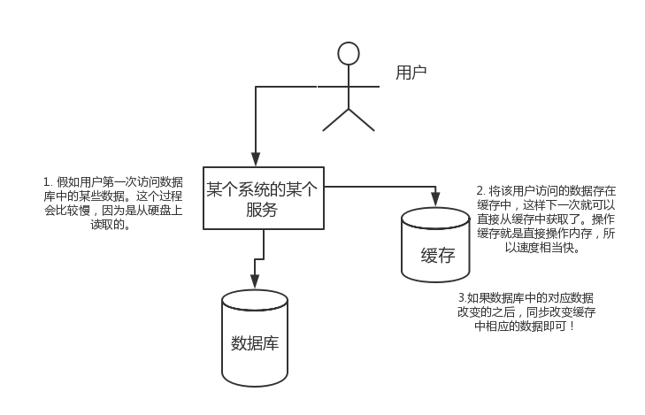
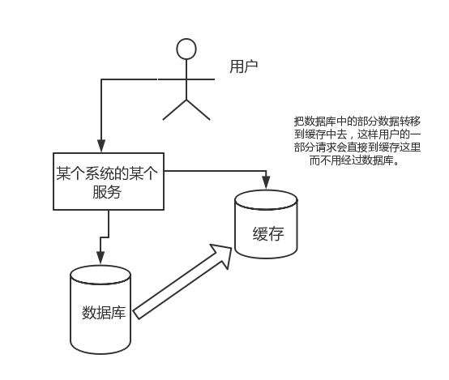
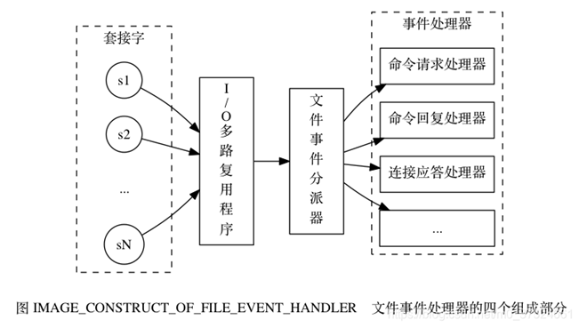
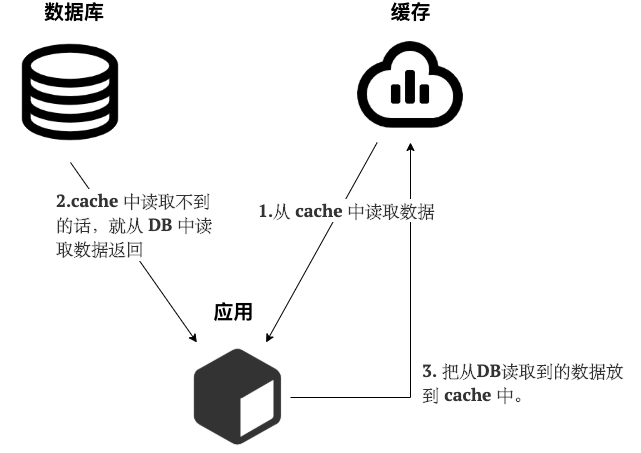
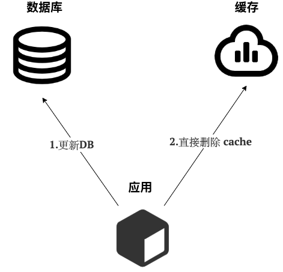
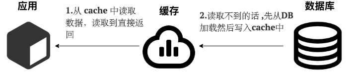
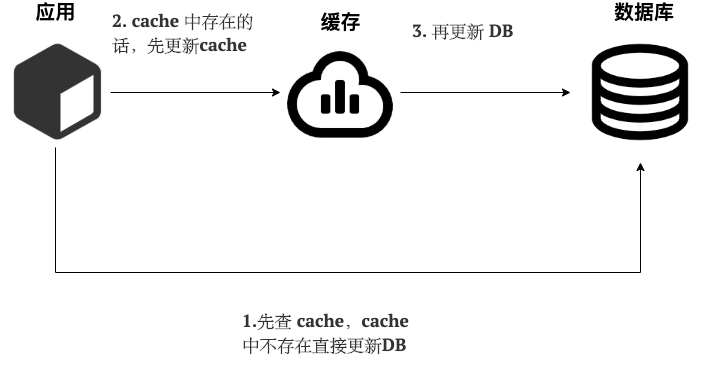
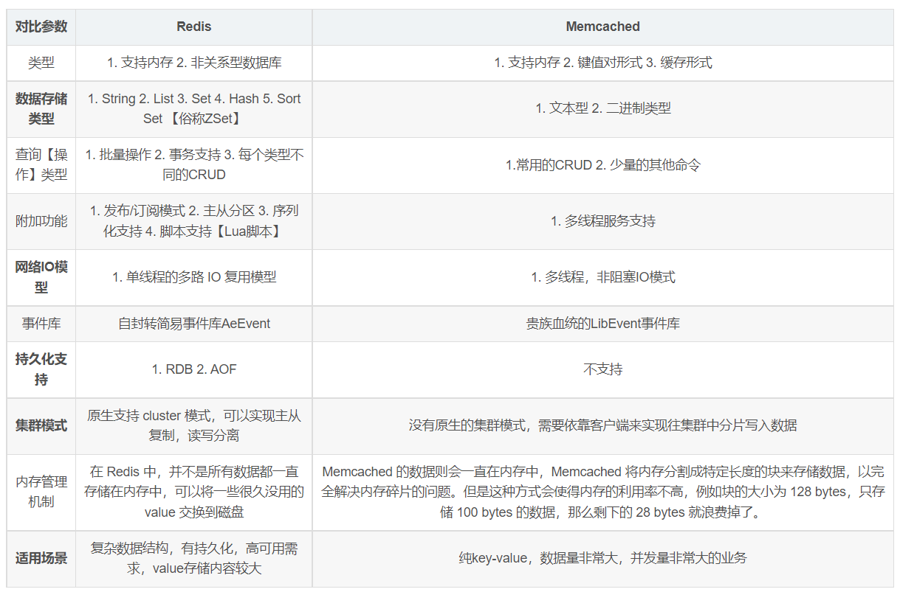

# 一、概述

## 1、什么是redis

C语言

非关系型数据库

内存数据库

有五种基本的数据结构

## 2、Redis的优缺点

优点

- 读写性能非常快

- 支持持久化（rdb，aof）

- 支持主从复制

- 五种基本的数据结构（string、list、hash、set、zset）

- 支持事务


缺点

- 受物理内存限制

- 不具备自动容错和恢复功能

- 难以在线扩容


## 3、为什么使用它

### 1）高性能

假如用户第一次访问数据库中的某些数据。这个过程会比较慢，因为是从硬盘上读取的。将该用户访问的数据存在数缓存中，这样下一次再访问这些数据的时候就可以直接从缓存中获取了。操作缓存就是直接操作内存，所以速度相当快。如果数据库中的对应数据改变的之后，同步改变缓存中相应的数据即可！



### 2）高并发

直接操作缓存能够承受的请求是远远大于直接访问数据库的，所以我们可以考虑把数据库中的部分数据转移到缓存中去，这样用户的一部分请求会直接到缓存这里而不用经过数据库。



## 4、为什么快

1）完全基于内存，绝大部分请求是纯粹的内存操作，非常快速。数据存在内存中，类似于 HashMap，HashMap 的优势就是查找和操作的时间复杂度都是O(1)；

2）数据结构简单，对数据操作也简单，Redis 中的数据结构是专门进行设计的；

3）采用单线程，避免了不必要的上下文切换和竞争条件，也不存在多进程或者多线程导致的切换而消耗 CPU，不用去考虑各种锁的问题，不存在加锁释放锁操作，没有因为可能出现死锁而导致的性能消耗；

4）使用多路 I/O 复用模型，非阻塞 IO；

5）使用底层模型不同，它们之间底层实现方式以及与客户端之间通信的应用协议不一样，Redis 直接自己构建了 VM 机制 ，因为一般的系统调用系统函数的话，会浪费一定的时间去移动和请求。

## 5、基本数据类型

### 1）string

常用命令：`set`，`get`，`strlen`（返回长度），`exists`，`decr`,`incr`,`setex`

使用场景：点赞量、浏览量、分布式锁，共享session

### 2）list

常用命令：`rpush`、`rpop`、`lpush`、`lpop`、`lrange`、`llen`

使用场景：粉丝列表、文章评论列表等

### 3）set

常用命令：`sadd`，`spop`，`smembers`（查看所有元素）,`sismember`（检查某个元素是否存在set中，只能接收单个元素）,`scard`，`sinterstore`，`sunion`

使用场景：交集、并集、差集，共同好友

### 4）hash

常用命令：`hset`，`hexists`，`hget`，`hgetall`（获取在哈希表中指定key的所有字段和值），`hkeys`，`hvals`

使用场景：结构化的数据，比如一个对象（个人详情）

### 5）zset

常用命令：`zadd`，`zcard`，`zscore`（查看权重），`zrange`，`zrevrange`，`zrem`（删除）

使用场景：获取排名前几名的用户、成绩表

## 6、特殊数据类型

### 1）geospatial

使用场景：地理位置

### 2）hyperloglog

使用场景：计算基数

### 3）bitmaps

使用场景：状态位、标识位

---

# 二、持久化

## 1、RDB

### 1）简述

RDB是Redis默认的持久化方式。按照一定的时间将内存的数据以快照的形式保存到硬盘中，对应产生的数据文件为dump.rdb。通过配置文件中的save参数来定义快照的周期。

### 2）优缺点

优点

- 只有一个文件 dump.rdb，方便持久化；
- 容灾性好，一个文件可以保存到安全的磁盘；
- 性能最大化，fork 子进程来完成写操作，让主进程继续处理命令，所以是 IO 最大化。使用单独子进程来进行持久化，主进程不会进行任何 IO 操作，保证了 redis 的高性能；
- 相对于数据集大时，比 AOF 的启动效率更高；

缺点

- 数据安全性低。RDB 是间隔一段时间进行持久化，如果持久化之间 redis 发生故障，会发生数据丢失。所以这种方式更适合数据要求不严谨的时候)


## 2、AOF

### 1）简述

AOF持久化(即AppendOnlyFile持久化)，则是将Redis执行的每次写命令记录到单独的日志文件中，当重启Redis会重新将持久化的日志中文件恢复数据。

### 2）优缺点

优点

- 数据安全，aof 持久化可以配置 appendfsync 属性，有 always，每进行一次 命令操作就记录到 aof 文件中一次。
- 通过 append 模式写文件，即使中途服务器宕机，可以通过 redis-check-aof 工具解决数据一致性问题。
- AOF 机制的 rewrite 模式。AOF 文件没被 rewrite 之前（文件过大时会对命令 进行合并重写），可以删除其中的某些命令（比如误操作的 flushall）)

缺点

- 相对rdb，aof文件大，恢复速度慢


### 3）如何选择持久化方式

1. 一般来说， 如果想达到足以媲美PostgreSQL的数据安全性，你应该同时使用两种持久化功能。在这种情况下，当 Redis 重启的时候会优先载入AOF文件来恢复原始的数据，因为在通常情况下AOF文件保存的数据集要比RDB文件保存的数据集要完整。

2. 如果你非常关心你的数据， 但仍然可以承受数分钟以内的数据丢失，那么你可以只使用RDB持久化。

3. 有很多用户都只使用AOF持久化，但并不推荐这种方式，因为定时生成RDB快照（snapshot）非常便于进行数据库备份， 并且 RDB 恢复数据集的速度也要比AOF恢复的速度要快，除此之外，使用RDB还可以避免AOF程序的bug。

4. 如果你只希望你的数据在服务器运行的时候存在，你也可以不使用任何持久化方式。

---

# 三、过期键的删除策略

## 1、过期策略

- 定时过期：每个设置过期时间的key都需要创建一个定时器，到过期时间就会立即清除。该策略可以立即清除过期的数据，对内存很友好；但是会占用大量的CPU资源去处理过期的数据，从而影响缓存的响应时间和吞吐量。

- 惰性过期：只有当访问一个key时，才会判断该key是否已过期，过期则清除。该策略可以最大化地节省CPU资源，却对内存非常不友好。极端情况可能出现大量的过期key没有再次被访问，从而不会被清除，占用大量内存。

- 定期过期：每隔一定的时间，会扫描一定数量的数据库的expires字典中一定数量的key，并清除其中已过期的key。该策略是前两者的一个折中方案。通过调整定时扫描的时间间隔和每次扫描的限定耗时，可以在不同情况下使得CPU和内存资源达到最优的平衡效果。

Redis中同时使用了惰性过期和定期过期两种过期策略。

## 2、为什么redis要使用过期键

缓解内存消耗

用作验证码

## 3、Redis内存淘汰策略

### 1）全局性

- noeviction：当内存不足以容纳新写入数据时，新写入操作会报错。

- allkeys-lru：当内存不足以容纳新写入数据时，在键空间中，移除最近最少使用的key。

- allkeys-random：当内存不足以容纳新写入数据时，在键空间中，随机移除某个key。

- allkeys-lfu（4.0后新增）


### 2）选择性

- volatile-lru：当内存不足以容纳新写入数据时，在设置了过期时间的键空间中，移除最近最少使用的key。

- volatile-random：当内存不足以容 纳新写入数据时，在设置了过期时间的键空间中，随机移除某个key。

- volatile-ttl：当内存不足以容纳新写入数据时，在设置了过期时间的键空间中，有更早过期时间的key优先移除。

- volatile-lfu（4.0后新增）


## 4、线程模型

### 1）简述Redis的单线程模型

Redis基于Reactor模式开发了自己的网络事件处理器：这个处理器被称为文件事件处理器（fileeventhandler）

文件事件处理器使用I/O多路复用（multiplexing）程序来同时监听多个套接字，并根据套接字目前执行的任务来为套接字关联不同的事件处理器。

当被监听的套接字准备好执行连接应答（accept）、读取（read）、写入（write）、关闭（close）等操作时，与操作相对应的文件事件就会产生，这时文件事件处理器就会调用套接字之前关联好的事件处理器来处理这些事件。

文件事件处理器以单线程方式运行，但通过使用I/O多路复用程序来监听多个套接字，文件事件处理器既实现了高性能的网络通信模型，又可以很好地与redis服务器中其他同样以单线程方式运行的模块进行对接，这保持了Redis内部单线程设计的简单性。



### 2）为什么要使用I/O多路复用技术

既实现了高性能的网络通信模型，又可以很好地与redis服务器中其他同样以单线程方式运行的模块进行对接，这保持了Redis内部单线程设计的简单性。

### 3）Redis4.0多线程的支持

增加的多线程主要是针对一些大键值对的删除操作的命令，使用这些命令就会使用主处理之外的其他线程来“异步处理”。

### 4）为什么4.0以前使用单线程

1. 单线程编程容易并且更容易维护；
2. Redis 的性能瓶颈不在 CPU ，主要在内存和网络；
3. 多线程就会存在死锁、线程上下文切换等问题，甚至会影响性能。

### 5）Redis6.0多线程

**Redis6.0 引入多线程主要是为了提高网络 IO 读写性能**，因为这个算是 Redis 中的一个性能瓶颈（Redis 的瓶颈主要受限于内存和网络）。

虽然，Redis6.0 引入了多线程，但是 Redis 的多线程只是在网络数据的读写这类耗时操作上使用了，执行命令仍然是单线程顺序执行。因此，不需要担心线程安全问题。

---

# 四、事务

## 1、什么是事务

ACID概述

原子性：事务是最小的执行单位，不允许分割。事务的原子性确保动作要么全部完成，要么完全不起作用；

一致性：执行事务前后，数据保持一致，多个事务对同一个数据读取的结果是相同的；

隔离性：并发访问数据库时，一个用户的事务不被其他事务所干扰，各并发事务之间数据库是独立的；

持久性：一个事务被提交之后。它对数据库中数据的改变是持久的，即使数据库发生故障也不应该对其有任何影响。

## 2、Redis事务操作命令

Redis 可以通过 `MULTI`，`EXEC`，`DISCARD` 和 `WATCH`等命令来实现事务(transaction)功能。

```shell
> MULTI
OK
> SET USER "Guide哥"
QUEUED
> GET USER
QUEUED
> EXEC
1) OK
2) "Guide哥"xxxxxxxxxx > MULTIOK> SET USER "Guide哥"QUEUED> GET USERQUEUED> DISCARDOK> MULTIOK> SET USER "Guide哥"QUEUED> GET USERQUEUED> EXEC1) OK2) "Guide哥"
```

使用 `MULTI` 命令后可以输入多个命令。Redis 不会立即执行这些命令，而是将它们放到队列，当调用了 [`EXEC`](https://redis.io/commands/exec) 命令将执行所有命令。

这个过程是这样的：

1. 开始事务（`MULTI`）。
2. 命令入队(批量操作 Redis 的命令，先进先出（FIFO）的顺序执行)。
3. 执行事务(`EXEC`)。

你也可以通过 `DISCARD`命令取消一个事务，它会清空事务队列中保存的所有命令。

```shell
> MULTI
OK
> SET USER "Guide哥"
QUEUED
> GET USER
QUEUED
> DISCARD
OK
```

`WATCH`命令用于监听指定的键，当调用 `EXEC` 命令执行事务时，如果一个被 `WATCH` 命令监视的键被修改的话，整个事务都不会执行，直接返回失败。

```shell
> WATCH USER
OK
> MULTI
> SET USER "Guide哥"
OK
> GET USER
Guide哥
> EXEC
ERR EXEC without MULTI
```

**Redis 是不支持 roll back 的，因而不满足原子性的（而且不满足持久性）。**

Redis 官网也解释了自己为啥不支持回滚。简单来说就是 Redis 开发者们觉得没必要支持回滚，这样更简单便捷并且性能更好。Redis 开发者觉得即使命令执行错误也应该在开发过程中就被发现而不是生产过程中。

---

# 五、缓存读写策略

## 1、cache-aside-pattern（旁路缓存模式）

### 1）读



1. 从cache中读取数据，读取到就直接返回；

2. cache中读取不到的话，就从DB中读取数据返回；

3. 再把数据放到cache中。


### 2）写



1. 先更新DB

2. 然后直接删除cache

### 3）问题

**问题1：在写数据的过程中，可以先删除cache，后更新DB么？**

不行，因为这样可能会造成数据库和缓存不一致的问题。比如说：请求一想要修改某个数据，那么这时候它会先删除这个数据，再去更新DB，如果这两步操作中间刚好有个请求B去查询这个数据，那么未修改的数据又会被重新放入到缓存中，造成数据库与缓存不一致的问题。

**问题2：在写数据的过程中，先更新DB，后删除cache就没有问题了么？**

理论上来说还是可能会出现数据不一致性的问题，不过概率非常小，因为缓存的写入速度是比数据库的写入速度快很多！比如说：请求一去读取缓存中没有的数据，那么这时候它要去DB中读取，这时候刚好有个请求二对这个数据进行修改，它会对先对DB进行修改，再删除缓存，而此时请求一又刚好还没有把数据放入到缓存中，这样也会造成读写不一致的问题，但概率极小。

**缺陷与解决方案**

缺陷1：首次请求数据不一定在cache中

解决办法：可以将热点数据可以提前放入cache中。

缺陷2：写操作比较频繁的话导致cache中的数据会被频繁被删除，这样会影响缓存命中率。

解决办法：

1）数据库和缓存数据强一致场景：更新DB的时候同样更新cache，不过我们需要加一个锁/分布式锁来保证更新cache的时候不存在线程安全问题。

2）可以短暂地允许数据库和缓存数据不一致的场景：更新DB的时候同样更新cache，但是给缓存加一个比较短的过期时间，这样的话就可以保证即使数据不一致的话影响也比较小。

## 2、readwrite-through-pattern（读写穿透）

### 1）读



1. 从cache中读取数据，读取到就直接返回。

2. 读取不到的话，先从DB加载，写入到cache后返回响应。（和旁路缓存模式不同的是它会先读如到cache，再从cache返回）


### 2）写



1. 先查cache，cache中不存在，直接更新DB。

2. cache中存在，则先更新cache，然后cache服务自己更新DB（同步更新cache和DB）。

### 3）评价

Read-Through Pattern 实际只是在 Cache-Aside Pattern 之上进行了封装。在 Cache-Aside Pattern 下，发生读请求的时候，如果 cache 中不存在对应的数据，是由客户端自己负责把数据写入 cache，而 Read-Through Pattern 则是 cache 服务自己来写入缓存的，这对客户端是透明的。

和 Cache Aside Pattern 一样， Read-Through Pattern 也有首次请求数据一定不再 cache 的问题，对于热点数据可以提前放入缓存中。

## 3、write-behind-pattern（异步缓存写入）

WriteBehindPattern和Read/WriteThroughPattern很相似，两者都是由cache服务来负责cache和DB的读写。

但是，两个又有很大的不同：Read/WriteThrough是同步更新cache和DB，而WriteBehindCaching则是只更新缓存，不直接更新DB，而是改为异步批量的方式来更新DB。

很明显，这种方式对数据一致性带来了更大的挑战，比如cache数据可能还没异步更新DB的话，cache服务可能就就挂掉了。

WriteBehindPattern下DB的写性能非常高，非常适合一些数据经常变化又对数据一致性要求没那么高的场景，比如浏览量、点赞量。

---

# 六、集群方案

## 1、哨兵模式

### 1）哨兵作用

集群监控：负责监控Redismaster和slave进程是否正常工作

消息通知：如果某个Redis实例有故障，那么哨兵负责发送消息作为报警通知给管理员

故障转移：如果masternode挂掉了，会自动转移到slavenode上

配置中心：如果故障转移发生了，通知client客户端新的master地址

## 2、RedisCluster架构

RedisCluster是一种服务端Sharding技术，3.0版本开始正式提供。RedisCluster并没有使用一致性hash，而是采用slot(槽)的概念，一共分成16384个槽。将请求发送到任意节点，接收到请求的节点会将查询请求发送到正确的节点上执行

## 3、RedisSharding架构

基于客户端分片

基于代理服务器分片

## 4、Redis主从架构

主从复制的核心原理（他们数据怎么同步的呢？）

你启动一台slave的时候，他会发送一个psync命令给master，如果是这个slave第一次连接到master，他会触发一个全量复制。master就会启动一个线程，生成RDB快照，还会把新的写请求都缓存在内存中，RDB文件生成后，master会将这个RDB发送给slave的，slave拿到之后做的第一件事情就是写进本地的磁盘，然后加载进内存，然后master会把内存里面缓存的那些新命名都发给slave。

## 5、分区

### 1）Redis是单线程，如何提高CPU利用率

### 2）为什么要做Redis分区

### 3）你知道有哪些Redis分区实现方案？

客户端分区

代理分区

查询路由

### 4）分区有什么缺点

---

# 七、分布式问题

## 1、Redis如何实现分布式锁

Redis中可以使用SETNX命令实现分布式锁。

当且仅当 key 不存在，将 key 的值设为 value。 若给定的 key 已经存在，则 SETNX 不做任何动作。

使用SETNX完成同步锁的流程及事项如下：

1. 使用SETNX命令获取锁，若返回0（key已存在，锁已存在）则获取失败，反之获取成功；

2. 为了防止获取锁后程序出现异常，导致其他线程/进程调用SETNX命令总是返回0而进入死锁状态，需要为该key设置一个“合理”的过期时间；

3. 释放锁，使用DEL命令将锁数据删除。

## 2、如何解决Redis的并发竞争Key问题

问题描述：同时有多个客户端去set一个key。

解决方案

**方案一：使用乐观锁**

watch命令可以很方便的是实现（需要注意的是，如果你的redis使用了数据分片的方式，那么这个方法就不适用了。）

使用时间戳，写入时保存一个时间戳，写入前先比较自己的时间戳是不是早于现有记录的时间戳，如果早于，就不写入了。

**方案二：分布式锁，在业务层进行控制，操作redis之前，先去申请一个分布式锁，拿到锁的才能操作。**

**方案三：通过消息队列进行串行化处理。这在高并发场景中是一种很常见的解决方案。**

---

# 八、缓存问题

## 1、缓存击穿

### 1）概念

指缓存中没有但数据库中有的数据（一般是缓存时间到期），这时由于并发用户特别多，同时读缓存没读到数据，又同时去数据库去取数据，引起数据库压力瞬间增大，造成过大压力。和缓存雪崩不同的是，缓存击穿指并发查同一条数据，缓存雪崩是不同数据都过期了，很多数据都查不到从而查数据库。

### 2）解决方案

1. 热点数据永不过期

2. 加互斥锁。


## 2、缓存穿透

### 1）概念

指缓存和数据库中都没有的数据，导致所有的请求都落到数据库上，造成数据库短时间内承受大量请求而崩掉。

### 2）解决方案

1. 添加”布隆过滤器“。

> 布隆过滤器是一种数据结构，对所有可能查询的参数以hash形式存储，在控制层先进行校验，不符合则丢弃，从而避免了对底层存储系统的查询压力（简单来说：利用高效的数据结构和算法快速判断出你这个Key是否在数据库中存在，不存在你return就好了，存在你就去查了DB刷新KV再return。）
>

2. 缓存空对象。从缓存取不到的数据，在数据库中也没有取到，这时也可以将key-value对写为key-null，缓存有效时间可以设置短点，如30秒（设置太长会导致正常情况也没法使用）。这样可以防止攻击用户反复用同一个id暴力攻击。

3. 接口层增加校验，如用户鉴权校验，id做基础校验，id<=0的直接拦截；

## 3、缓存雪崩

### 1）概念

指缓存同一时间大面积的失效，所以，后面的请求都会落到数据库上，造成数据库短时间内承受大量请求而崩掉。

### 2）解决方案

1. 缓存数据的过期时间设置随机，防止同一时间大量数据过期现象发生。
2. 一般并发量不是特别多的时候，使用最多的解决方案是加锁排队。

## 4、缓存预热

### 1）概念

系统上线后，将相关的缓存数据直接加载到缓存系统。这样就可以避免在用户请求的时候，先查询数据库，然后再将数据缓存的问题！用户直接查询事先被预热的缓存数据！

### 2）解决方案

1. 直接写个缓存刷新页面，上线时手工操作一下；
2. 数据量不大，可以在项目启动的时候自动进行加载；
3. 定时刷新缓存。

## 5、缓存降级

当访问量剧增、服务出现问题（如响应时间慢或不响应）或非核心服务影响到核心流程的性能时，仍然需要保证服务还是可用的，即使是有损服务。系统可以根据一些关键数据进行自动降级，也可以配置开关实现人工降级。

服务降级的目的，是为了防止Redis服务故障，导致数据库跟着一起发生雪崩问题。因此，对于不重要的缓存数据，可以采取服务降级策略，例如一个比较常见的做法就是，Redis出现问题，不去数据库查询，而是直接返回默认值给用户。

---

# 九、其他问题

## 1、Redis与Memcached的区别



## 2、Redis常见性能问题和解决方案？

1. Master最好不要做任何持久化工作，包括内存快照和AOF日志文件，特别是不要启用内存快照做持久化。
2. 如果数据比较关键，某个Slave开启AOF备份数据，策略为每秒同步一次。
3. 为了主从复制的速度和连接的稳定性，Slave和Master最好在同一个局域网内。
4. 尽量避免在压力较大的主库上增加从库
5. Master调用BGREWRITEAOF重写AOF文件，AOF在重写的时候会占大量的CPU和内存资源，导致服务load过高，出现短暂服务暂停现象。
6. 为了Master的稳定性，主从复制不要用图状结构，用单向链表结构更稳定，即主从关系为：Master<–Slave1<–Slave2<–Slave3…，这样的结构也方便解决单点故障问题，实现Slave对Master的替换，也即，如果Master挂了，可以立马启用Slave1做Master，其他不变。