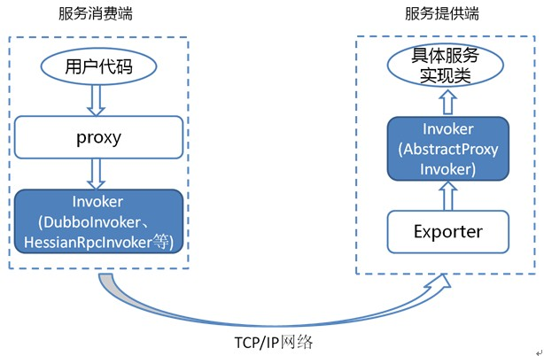

# 一、RPC基础

## 1、什么是 RPC？

RPC（Remote Procedure Call）—远程过程调用，它是一种通过网络从远程计算机程序上请求服务，而不需要了解底层网络技术的协议。比如两个不同的服务 A、B 部署在两台不同的机器上，那么服务 A 如果想要调用服务 B 中的某个方法该怎么办呢？使用 HTTP请求 当然可以，但是可能会比较慢而且一些优化做的并不好。 RPC 的出现就是为了解决这个问题。

## 2、RPC原理是什么？


1. 服务消费端（client）以本地调用的方式调用远程服务；
2. 客户端 Stub（client stub） 接收到调用后负责将方法、参数等序列化成能够进行网络传输的消息体`RpcRequest`,客户端 Stub（client stub） 找到远程服务的地址，并将消息发送到服务提供端；
3. 服务端 Stub（桩）收到消息将消息反序列化为Java对象: `RpcRequest`；
4. 服务端 Stub（桩）根据`RpcRequest`中的类、方法、方法参数等信息调用本地的方法；
5. 服务端 Stub（桩）得到方法执行结果并将组装成能够进行网络传输的消息体：`RpcResponse`（序列化）发送至消费方；
6. 客户端 Stub（client stub）接收到消息并将消息反序列化为Java对象:`RpcResponse` ，这样也就得到了最终结果。


## 3、RPC解决了什么问题？

让分布式或者微服务系统中不同服务之间的调用像本地调用一样简单。

## 4、既有 HTTP ,为啥用 RPC 进行服务调用?

### 1）RPC 只是一种设计而已

RPC 只是一种概念、一种设计，就是为了解决 **不同服务之间的调用问题**, 它一般会包含有 **传输协议** 和 **序列化协议** 这两个。

但是，HTTP 是一种协议，RPC框架可以使用 HTTP协议作为传输协议或者直接使用TCP作为传输协议，使用不同的协议一般也是为了适应不同的场景。

### 2）RPC框架功能更加齐全

成熟的 RPC框架还提供好了“服务自动注册与发现”、"智能负载均衡"、“可视化的服务治理和运维”、“运行期流量调度”等等功能，这些也算是选择 RPC 进行服务注册和发现的一方面原因吧！

# 二、Dubbo基础

## 1、Dubbo是什么

Apache Dubbo (incubating) |ˈdʌbəʊ| 是一款高性能、轻量级的开源 Java RPC 框架。

根据 Dubbo 官方文档的介绍，Dubbo 提供了六大核心能力：

1. 面向接口代理的高性能RPC调用。
2. 智能容错和负载均衡。
3. 服务自动注册和发现。
4. 高度可扩展能力。
5. 运行期流量调度。
6. 可视化的服务治理与运维。

## 2、为什么要用 Dubbo?

随着互联网的发展，网站的规模越来越大，用户数量越来越多。单一应用架构 、垂直应用架构无法满足我们的需求，这个时候分布式服务架构就诞生了。

分布式服务架构下，系统被拆分成不同的服务比如短信服务、安全服务，每个服务独立提供系统的某个核心服务。

我们可以使用 Java RMI（Java Remote Method Invocation）、Hessian这种支持远程调用的框架来简单地暴露和引用远程服务。但是！当服务越来越多之后，服务调用关系越来越复杂。当应用访问压力越来越大后，负载均衡以及服务监控的需求也迫在眉睫。我们可以用 F5 这类硬件来做负载均衡，但这样增加了成本，并且存在单点故障的风险。

不过，Dubbo 的出现让上述问题得到了解决。**Dubbo 帮助我们解决了什么问题呢？**

1. **负载均衡** ： 同一个服务部署在不同的机器时该调用那一台机器上的服务。
2. **服务调用链路生成** ： 随着系统的发展，服务越来越多，服务间依赖关系变得错踪复杂，甚至分不清哪个应用要在哪个应用之前启动，架构师都不能完整的描述应用的架构关系。Dubbo 可以为我们解决服务之间互相是如何调用的。
3. **服务访问压力以及时长统计、资源调度和治理** ：基于访问压力实时管理集群容量，提高集群利用率。
4. ……


另外，Dubbo 除了能够应用在分布式系统中，也可以应用在现在比较火的微服务系统中。不过，由于 Spring Cloud 在微服务中应用更加广泛，所以，我觉得一般我们提 Dubbo 的话，大部分是分布式系统的情况。

# 三、Dubbo架构

## 1、Dubbo架构中的核心角色有哪些？


上述节点简单介绍以及他们之间的关系：

- **Container：** 服务运行容器，负责加载、运行服务提供者。必须。
- **Provider：** 暴露服务的服务提供方，会向注册中心注册自己提供的服务。必须。
- **Consumer：** 调用远程服务的服务消费方，会向注册中心订阅自己所需的服务。必须。
- **Registry：** 服务注册与发现的注册中心。注册中心会返回服务提供者地址列表给消费者。非必须。
- **Monitor：** 统计服务的调用次数和调用时间的监控中心。服务消费者和提供者会定时发送统计数据到监控中心。 非必须。

## 2、Dubbo中的Invoker概念了解么？

简单来说，`Invoker` 就是 Dubbo 对远程调用的抽象。



按照 Dubbo 官方的话来说，`Invoker` 分为

- 服务提供 `Invoker`
- 服务消费 `Invoker`

假如我们需要调用一个远程方法，我们需要动态代理来屏蔽远程调用的细节吧！我们屏蔽掉的这些细节就依赖对应的 `Invoker` 实现， `Invoker` 实现了真正的远程服务调用。

## 3、Dubbo的工作原理了解么？

下图是 Dubbo 的整体设计，从下至上分为十层，各层均为单向依赖。

> 左边淡蓝背景的为服务消费方使用的接口，右边淡绿色背景的为服务提供方使用的接口，位于中轴线上的为双方都用到的接口。


- **config 配置层**：Dubbo相关的配置。支持代码配置，同时也支持基于 Spring 来做配置，以 `ServiceConfig`, `ReferenceConfig` 为中心
- **proxy 服务代理层**：调用远程方法像调用本地的方法一样简单的一个关键，真实调用过程依赖代理类，以 `ServiceProxy` 为中心。
- **registry 注册中心层**：封装服务地址的注册与发现。
- **cluster 路由层**：封装多个提供者的路由及负载均衡，并桥接注册中心，以 `Invoker` 为中心。
- **monitor 监控层**：RPC 调用次数和调用时间监控，以 `Statistics` 为中心。
- **protocol 远程调用层**：封装 RPC 调用，以 `Invocation`, `Result` 为中心。
- **exchange 信息交换层**：封装请求响应模式，同步转异步，以 `Request`, `Response` 为中心。
- **transport 网络传输层**：抽象 mina 和 netty 为统一接口，以 `Message` 为中心。
- **serialize 数据序列化层** ：对需要在网络传输的数据进行序列化。

## 4、Dubbo的SPI机制了解么？如何扩展Dubbo中的默认实现？

SPI（Service Provider Interface） 机制被大量用在开源项目中，它可以帮助我们动态寻找服务/功能（比如负载均衡策略）的实现。

SPI 的具体原理是这样的：我们将接口的实现类放在配置文件中，我们在程序运行过程中读取配置文件，通过反射加载实现类。这样，我们可以在运行的时候，动态替换接口的实现类。和 IoC 的解耦思想是类似的。

Java 本身就提供了 SPI 机制的实现。不过，Dubbo 没有直接用，而是对 Java原生的 SPI机制进行了增强，以便更好满足自己的需求。

**那我们如何扩展 Dubbo 中的默认实现呢？**

比如说我们想要实现自己的负载均衡策略，我们创建对应的实现类 `XxxLoadBalance` 实现 `LoadBalance` 接口或者 `AbstractLoadBalance` 类。

```java
package com.xxx;
 
import org.apache.dubbo.rpc.cluster.LoadBalance;
import org.apache.dubbo.rpc.Invoker;
import org.apache.dubbo.rpc.Invocation;
import org.apache.dubbo.rpc.RpcException; 
 
public class XxxLoadBalance implements LoadBalance {
    public <T> Invoker<T> select(List<Invoker<T>> invokers, Invocation invocation) throws RpcException {
        // ...
    }
}
```

其他还有很多可供扩展的选择，你可以在[官方文档@SPI扩展实现](https://dubbo.apache.org/zh/docs/v2.7/dev/impls/)这里找到。

## 5、Dubbo微内核架构了解么？

Dubbo 采用 微内核（Microkernel） + 插件（Plugin） 模式，简单来说就是微内核架构。微内核只负责组装插件。

微内核架构包含两类组件：**核心系统（core system）** 和 **插件模块（plug-in modules）**。


核心系统提供系统所需核心能力，插件模块可以扩展系统的功能。因此， 基于微内核架构的系统，非常易于扩展功能。

我们常见的一些IDE，都可以看作是基于微内核架构设计的。绝大多数 IDE比如IDEA、VSCode都提供了插件来丰富自己的功能。

正是因为Dubbo基于微内核架构，才使得我们可以随心所欲替换Dubbo的功能点。比如你觉得Dubbo 的序列化模块实现的不满足自己要求，没关系啊！你自己实现一个序列化模块就好了啊！

通常情况下，微核心都会采用 Factory、IoC、OSGi 等方式管理插件生命周期。Dubbo 不想依赖 Spring 等 IoC 容器，也不想自已造一个小的 IoC 容器（过度设计），因此采用了一种最简单的 Factory 方式管理插件 ：**JDK 标准的 SPI 扩展机制** （`java.util.ServiceLoader`）。

## 6、关于Dubbo架构的一些自测小问题

### 1）注册中心的作用了解么？

注册中心负责服务地址的注册与查找，相当于目录服务，服务提供者和消费者只在启动时与注册中心交互。

### 2）服务提供者宕机后，注册中心会做什么？

注册中心会立即推送事件通知消费者。

### 3）监控中心的作用呢？

监控中心负责统计各服务调用次数，调用时间等。

### 4）注册中心和监控中心都宕机的话，服务都会挂掉吗？

不会。两者都宕机也不影响已运行的提供者和消费者，消费者在本地缓存了提供者列表。注册中心和监控中心都是可选的，服务消费者可以直连服务提供者。

# 四、Dubbo的负载均衡策略

## 1、什么是负载均衡？

我们的系统中的某个服务的访问量特别大，我们将这个服务部署在了多台服务器上，当客户端发起请求的时候，多台服务器都可以处理这个请求。那么，如何正确选择处理该请求的服务器就很关键。假如，你就要一台服务器来处理该服务的请求，那该服务部署在多台服务器的意义就不复存在了。负载均衡就是为了避免单个服务器响应同一请求，容易造成服务器宕机、崩溃等问题，我们从负载均衡的这四个字就能明显感受到它的意义。

## 2、Dubbo提供的负载均衡策略有哪些？

### 1）Randomloadbalance

根据权重随机选择（对加权随机算法的实现）。这是Dubbo默认采用的一种负载均衡策略。

` RandomLoadBalance` 具体的实现原理非常简单，假如有两个提供相同服务的服务器 S1,S2，S1的权重为7，S2的权重为3。

我们把这些权重值分布在坐标区间会得到：S1->[0, 7) ，S2->(7, 10]。我们生成[0, 10) 之间的随机数，随机数落到对应的区间，我们就选择对应的服务器来处理请求。


### 2）LeastActiveLoadBalance

`LeastActiveLoadBalance` 直译过来就是**最小活跃数负载均衡**。

这个名字起得有点不直观，不仔细看官方对活跃数的定义，你压根不知道这玩意是干嘛的。

我这么说吧！初始状态下所有服务提供者的活跃数均为 0（每个服务提供者的中特定方法都对应一个活跃数，我在后面的源码中会提到），每收到一个请求后，对应的服务提供者的活跃数 +1，当这个请求处理完之后，活跃数 -1。

因此，**Dubbo 就认为谁的活跃数越少，谁的处理速度就越快，性能也越好，这样的话，我就优先把请求给活跃数少的服务提供者处理。**

**如果有多个服务提供者的活跃数相等怎么办？**

很简单，那就再走一遍 `RandomLoadBalance` 。

### 3）ConsistentHashLoadBalance

`ConsistentHashLoadBalance` 小伙伴们应该也不会陌生，在分库分表、各种集群中就经常使用这个负载均衡策略。

`ConsistentHashLoadBalance` 即**一致性Hash负载均衡策略**。 `ConsistentHashLoadBalance` 中没有权重的概念，具体是哪个服务提供者处理请求是由你的请求的参数决定的，也就是说相同参数的请求总是发到同一个服务提供者。


另外，Dubbo 为了避免数据倾斜问题（节点不够分散，大量请求落到同一节点），还引入了虚拟节点的概念。通过虚拟节点可以让节点更加分散，有效均衡各个节点的请求量。


### 4）Roundrobinloadbalance

加权轮询负载均衡。

轮询就是把请求依次分配给每个服务提供者。加权轮询就是在轮询的基础上，让更多的请求落到权重更大的服务提供者上。比如假如有两个提供相同服务的服务器 S1,S2，S1的权重为7，S2的权重为3。如果我们有 10 次请求，那么 7 次会被 S1处理，3次被 S2处理。

但是，如果是 `RandomLoadBalance` 的话，很可能存在10次请求有9次都被 S1 处理的情况（概率性问题）。

Dubbo 中的 `RoundRobinLoadBalance` 的代码实现被修改重建了好几次，Dubbo-2.6.5 版本的 `RoundRobinLoadBalance` 为平滑加权轮询算法。

# 五、Dubbo序列化协议

## 1、Dubbo支持哪些序列化方式？

Dubbo 支持多种序列化方式：JDK自带的序列化、hessian2、JSON、Kryo、FST、Protostuff，ProtoBuf等等。

Dubbo 默认使用的序列化方式是 hession2。

## 2、谈谈你对这些序列化协议了解？

一般我们不会直接使用 JDK 自带的序列化方式。主要原因有两个：

1. **不支持跨语言调用** : 如果调用的是其他语言开发的服务的时候就不支持了。
2. **性能差** ：相比于其他序列化框架性能更低，主要原因是序列化之后的字节数组体积较大，导致传输成本加大。

JSON 序列化由于性能问题，我们一般也不会考虑使用。

像 Protostuff，ProtoBuf、hessian2这些都是跨语言的序列化方式，如果有跨语言需求的话可以考虑使用。

Kryo和FST这两种序列化方式是 Dubbo 后来才引入的，性能非常好。不过，这两者都是专门针对 Java 语言的。Dubbo 官网的一篇文章中提到说推荐使用 Kryo 作为生产环境的序列化方式。

