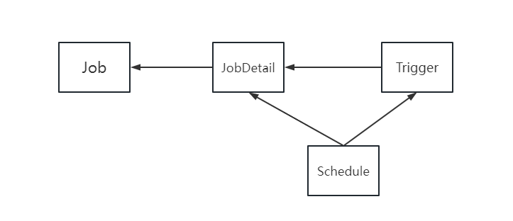
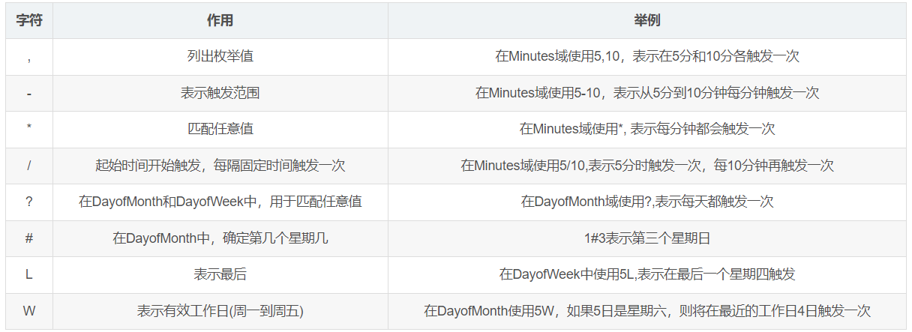

# 一、Quartz

## 1、Quartz简介

Quartz 是 OpenSymphony 开源组织在 Job Scheduling 领域又一个开源项目，是完全由 Java 开发的一个开源任务日程管理系统，“任务进度管理器”就是一个在预先确定（被纳入日程）的时间到达时，负责执行（或者通知）其他软件组件的系统。 Quartz 是一个开源的作业调度框架，它完全由 Java 写成，并设计用于 J2SE 和 J2EE 应用中，它提供了巨大的灵活性而不牺牲简单性

当定时任务愈加复杂时，使用 Spring 注解 @Schedule 已经不能满足业务需要

在项目开发中，经常需要定时任务来帮助我们来做一些内容，如定时派息、跑批对账、将任务纳入日程或者从日程中取消，开始，停止，暂停日程进度等。SpringBoot 中现在有两种方案可以选择，第一种是 SpringBoot 内置的方式简单注解就可以使用，当然如果需要更复杂的应用场景还是得 Quartz 上场，Quartz 目前是 Java 体系中最完善的定时方案

## 2、优点

- 丰富的 `Job` 操作 `API`
- 支持多种配置
- `SpringBoot` 无缝集成
- 支持持久化
- 支持集群
- `Quartz` 还支持开源，是一个功能丰富的开源作业调度库，可以集成到几乎任何 `Java` 应用程序中

## 3、核心概念

### 1）Schedule

Quartz 中的任务调度器，通过 Trigger 和 JobDetail 可以用来调度、暂停和删除任务。调度器就相当于一个容器，装载着任务和触发器，该类是一个接口，代表一个 Quartz 的独立运行容器，`Trigger` 和 `JobDetail` 可以注册到 Scheduler 中，两者在 Scheduler 中拥有各自的组及名称，组及名称是 Scheduler 查找定位容器中某一对象的依据，Trigger 的组及名称必须唯一，JobDetail 的组和名称也必须唯一（但可以和 Trigger 的组和名称相同，因为它们是不同类型的）

### 2）Trigger

Quartz 中的触发器，是一个类，描述触发 Job 执行的时间触发规则，主要有 `SimpleTrigger` 和 `CronTrigger` 这两个子类。当且仅当需调度一次或者以固定时间间隔周期执行调度，`SimpleTrigger` 是最适合的选择；而 `CronTrigger` 则可以通过 Cron 表达式定义出各种复杂时间规则的调度方案：如工作日周一到周五的 15：00 ~ 16：00 执行调度等

### 3）JobDetail

`Quartz` 中需要执行的任务详情，包括了任务的唯一标识和具体要执行的任务，可以通过 `JobDataMap` 往任务中传递数据

### 4）Job

`Quartz` 中具体的任务，包含了执行任务的具体方法。是一个接口，只定义一个方法 `execute()` 方法，在实现接口的 `execute()` 方法中编写所需要定时执行的 `Job`

> - **job**：任务 - 你要做什么事
> - **Trigger**：触发器 - 你什么时候去做
> - **Scheduler**：任务调度 - 你什么时候需要做什么事

四者其关系如下图所示：



- **Job** 为作业的接口，为任务调度的对象；
- **JobDetail** 用来描述 **Job** 的实现类及其他相关的静态信息；
- **Trigger** 做为作业的定时管理工具，一个 **Trigger** 只能对应一个作业实例，而一个作业实例可对应多个触发器；
- **Scheduler** 做为定时任务容器，是 Quartz 最上层的东西，它提携了所有触发器和作业，使它们协调工作，每个 **Scheduler** 都存有 **JobDetail** 和 **Trigger** 的注册，一个 **Scheduler** 中可以注册多个 **JobDetail** 和多个 **Trigger**

## 4、作业存储类型

- **RAMJobStore**

RAM 也就是内存，默认情况下 Quartz 会将任务调度存储在内存中，这种方式性能是最好的，因为内存的速度是最快的。不好的地方就是数据缺乏持久性，但程序崩溃或者重新发布的时候，所有运行信息都会丢失。

- **JDBC 作业存储**

存到数据库之后，可以做单点也可以做集群，当任务多了之后，可以统一进行管理，随时停止、暂停、修改任务。关闭或者重启服务器，运行的信息都不会丢失。缺点就是运行速度快慢取决于连接数据库的快慢


## 5、Cron 表达式

`Cron` 表达式是一个字符串，包括 6~7 个时间元素，在  Quartz 中可以用于指定任务的执行时间。

```java
CronScheduleBuilder expression =CronScheduleBuilder.cronSchedule("0/5 * * * * ?");
```

### 1）语法

Seconds Minutes Hours DayofMonth Month DayofWeek  

秒	       分钟	  小时    日期天/日     日期月份  星期

### 2）元素说明

| 时间元素   | 可出现的字符  | 有效数值范围 |
| ---------- | ------------- | ------------ |
| Seconds    | , - * /       | 0-59         |
| Minutes    | , - * /       | 0-59         |
| Hours      | , - * /       | 0-23         |
| DayofMonth | , - * / ? L W | 0-31         |
| Month      | , - * /       | 1-12         |
| DayofWeek  | , - * / ? L # | 1-7或SUN-SAT |

### 3）字符说明



表示式生成器：https://cron.qqe2.com/

# 二、整合SpringBoot

- `SpringBoot` 版本：`2.0.9.RELEASE`
- `MySQL` 版本：`5.7.35`

## 1、数据库准备

Quartz 存储任务信息有两种方式，使用内存或者使用数据库来存储，这里我们采用 MySQL 数据库存储的方式，首先需要新建 Quartz 的相关表，sql 脚本下载地址：http://www.quartz-scheduler.org/downloads/，名称为 tables_mysql.sql，创建成功后数据库中多出 11 张表

## 2、`Maven` 主要依赖

```xml
<dependency>
    <groupId>org.springframework.boot</groupId>
    <artifactId>spring-boot-starter-quartz</artifactId>
</dependency>
<!-- 5.1.* 版本适用于MySQL Server的5.6.*、5.7.*和8.0.* -->
<dependency>
	<groupId>mysql</groupId>
    <artifactId>mysql-connector-java</artifactId>
	<version>5.1.38</version>
</dependency>
<dependency>
	<groupId>com.alibaba</groupId>
	<artifactId>druid-spring-boot-starter</artifactId>
    <version>1.1.10</version>
</dependency>
<!--mybatis-->
<dependency>
	<groupId>org.mybatis.spring.boot</groupId>
	<artifactId>mybatis-spring-boot-starter</artifactId>
	<version>1.3.2</version>
</dependency>
<!--pagehelper分页-->
<dependency>
    <groupId>com.github.pagehelper</groupId>
    <artifactId>pagehelper-spring-boot-starter</artifactId>
	<version>1.3.0</version>
</dependency>

```

这里使用 `druid` 作为数据库连接池，`Quartz` 默认使用 `c3p0`

## 3、配置文件

### 1）配置数据源

```java
import com.alibaba.druid.pool.DruidDataSource;
import lombok.Data;
import org.quartz.SchedulerException;
import org.quartz.utils.ConnectionProvider;

import java.sql.Connection;
import java.sql.SQLException;

@Data
public class DruidPoolingconnectionProvider implements ConnectionProvider {

    // JDBC驱动
    public String driver;

    // JDBC连接串
    public String URL;

    // 数据库用户名
    public String user;

    // 数据库用户密码
    public String password;

    // 数据库最大连接数
    public int maxConnections;

    // 数据库SQL查询每次连接返回执行到连接池，以确保它仍然是有效的。
    public String validationQuery;

    private boolean validateOnCheckout;

    private int idleConnectionValidationSeconds;

    public String maxCachedStatementsPerConnection;

    private String discardIdleConnectionsSeconds;

    public static final int DEFAULT_DB_MAX_CONNECTIONS = 10;

    public static final int DEFAULT_DB_MAX_CACHED_STATEMENTS_PER_CONNECTION = 120;

    // Druid连接池
    private DruidDataSource datasource;

    @Override
    public Connection getConnection() throws SQLException {
        return datasource.getConnection();
    }

    @Override
    public void shutdown() {
        datasource.close();
    }

    @Override
    public void initialize() throws SQLException {
        if (this.URL == null) {
            throw new SQLException("DBPool could not be created: DB URL cannot be null");
        }
        if (this.driver == null) {
            throw new SQLException("DBPool driver could not be created: DB driver class name cannot be null!");
        }
        if (this.maxConnections < 0) {
            throw new SQLException("DBPool maxConnections could not be created: Max connections must be greater than zero!");
        }
        datasource = new DruidDataSource();
        try{
            datasource.setDriverClassName(this.driver);
        } catch (Exception e) {
            try {
                throw new SchedulerException("Problem setting driver class name on datasource: " + e.getMessage(), e);
            } catch (SchedulerException ignored) {
            }
        }
        datasource.setUrl(this.URL);
        datasource.setUsername(this.user);
        datasource.setPassword(this.password);
        datasource.setMaxActive(this.maxConnections);
        datasource.setMinIdle(1);
        datasource.setMaxWait(0);
        datasource.setMaxPoolPreparedStatementPerConnectionSize(DEFAULT_DB_MAX_CONNECTIONS);
        if (this.validationQuery != null) {
            datasource.setValidationQuery(this.validationQuery);
            if(!this.validateOnCheckout)
                datasource.setTestOnReturn(true);
            else
                datasource.setTestOnBorrow(true);
            datasource.setValidationQueryTimeout(this.idleConnectionValidationSeconds);
        }
    }
}
```

### 2）quartz.properties

默认情况下，`Quartz` 会加载 `classpath` 下的 `quartz.properties` 作为配置文件。如果找不到，则会使用 `quartz` 框架自己 `jar` 包下 `org/quartz` 底下的 `quartz.properties` 文件

```properties
#主要分为scheduler、threadPool、jobStore、dataSource等部分


org.quartz.scheduler.instanceId=AUTO
org.quartz.scheduler.instanceName=DefaultQuartzScheduler
#如果您希望Quartz Scheduler通过RMI作为服务器导出本身，则将“rmi.export”标志设置为true
#在同一个配置文件中为'org.quartz.scheduler.rmi.export'和'org.quartz.scheduler.rmi.proxy'指定一个'true'值是没有意义的,如果你这样做'export'选项将被忽略
org.quartz.scheduler.rmi.export=false
#如果要连接（使用）远程服务的调度程序，则将“org.quartz.scheduler.rmi.proxy”标志设置为true。您还必须指定RMI注册表进程的主机和端口 - 通常是“localhost”端口1099
org.quartz.scheduler.rmi.proxy=false
org.quartz.scheduler.wrapJobExecutionInUserTransaction=false


#实例化ThreadPool时，使用的线程类为SimpleThreadPool
org.quartz.threadPool.class=org.quartz.simpl.SimpleThreadPool
#threadCount和threadPriority将以setter的形式注入ThreadPool实例
#并发个数  如果你只有几个工作每天触发几次 那么1个线程就可以,如果你有成千上万的工作，每分钟都有很多工作 那么久需要50-100之间.
#只有1到100之间的数字是非常实用的
org.quartz.threadPool.threadCount=5
#优先级 默认值为5
org.quartz.threadPool.threadPriority=5
#可以是“true”或“false”，默认为false
org.quartz.threadPool.threadsInheritContextClassLoaderOfInitializingThread=true


#在被认为“misfired”(失火)之前，调度程序将“tolerate(容忍)”一个Triggers(触发器)将其下一个启动时间通过的毫秒数。默认值（如果您在配置中未输入此属性）为60000（60秒）
org.quartz.jobStore.misfireThreshold=5000
# 默认存储在内存中,RAMJobStore快速轻便，但是当进程终止时，所有调度信息都会丢失
#org.quartz.jobStore.class=org.quartz.simpl.RAMJobStore

#持久化方式，默认存储在内存中，此处使用数据库方式
org.quartz.jobStore.class=org.quartz.impl.jdbcjobstore.JobStoreTX
#您需要为JobStore选择一个DriverDelegate才能使用。DriverDelegate负责执行特定数据库可能需要的任何JDBC工作
# StdJDBCDelegate是一个使用“vanilla”JDBC代码（和SQL语句）来执行其工作的委托,用于完全符合JDBC的驱动程序
org.quartz.jobStore.driverDelegateClass=org.quartz.impl.jdbcjobstore.StdJDBCDelegate
#可以将“org.quartz.jobStore.useProperties”配置参数设置为“true”（默认为false），以指示JDBCJobStore将JobDataMaps中的所有值都作为字符串，
#因此可以作为名称 - 值对存储而不是在BLOB列中以其序列化形式存储更多复杂的对象。从长远来看，这是更安全的，因为您避免了将非String类序列化为BLOB的类版本问题
org.quartz.jobStore.useProperties=true
#表前缀
org.quartz.jobStore.tablePrefix=QRTZ_
#数据源别名，自定义
org.quartz.jobStore.dataSource=qzDS


#使用阿里的druid作为数据库连接池
org.quartz.dataSource.qzDS.connectionProvider.class=org.example.config.DruidPoolingconnectionProvider
org.quartz.dataSource.qzDS.URL=jdbc:mysql://127.0.0.1:3306/test_quartz?characterEncoding=utf8&useSSL=false&autoReconnect=true&serverTimezone=UTC
org.quartz.dataSource.qzDS.user=root
org.quartz.dataSource.qzDS.password=123456
org.quartz.dataSource.qzDS.driver=com.mysql.jdbc.Driver
org.quartz.dataSource.qzDS.maxConnections=10
#设置为“true”以打开群集功能。如果您有多个Quartz实例使用同一组数据库表，则此属性必须设置为“true”，否则您将遇到破坏
#org.quartz.jobStore.isClustered=false

```

### 3）application.properties

```properties
server.port=8080

#JDBC 配置：MySQL Server 版本为 5.7.35
spring.datasource.druid.url=jdbc:mysql://127.0.0.1:3306/test_quartz?characterEncoding=utf8&useSSL=false&autoReconnect=true&serverTimezone=UTC
spring.datasource.druid.username=root
spring.datasource.druid.password=123456
spring.datasource.druid.driver-class-name=com.mysql.jdbc.Driver
spring.datasource.type=com.alibaba.druid.pool.DruidDataSource

#druid 连接池配置
spring.datasource.druid.initial-size=3
spring.datasource.druid.min-idle=3
spring.datasource.druid.max-active=10
spring.datasource.druid.max-wait=60000

#指定 mapper 文件路径
mybatis.mapper-locations=classpath:org/example/mapper/*.xml
mybatis.configuration.cache-enabled=true
#开启驼峰命名
mybatis.configuration.map-underscore-to-camel-case=true
#打印 SQL 语句
mybatis.configuration.log-impl=org.apache.ibatis.logging.stdout.StdOutImpl
```

### 4）QuartzConfig

```java
@Configuration
public class QuartzConfig implements SchedulerFactoryBeanCustomizer {

    @Bean
    public Properties properties() throws IOException {
        PropertiesFactoryBean propertiesFactoryBean = new PropertiesFactoryBean();
        // 对quartz.properties文件进行读取
        propertiesFactoryBean.setLocation(new ClassPathResource("/quartz.properties"));
        // 在quartz.properties中的属性被读取并注入后再初始化对象
        propertiesFactoryBean.afterPropertiesSet();
        return propertiesFactoryBean.getObject();
    }

    @Bean
    public SchedulerFactoryBean schedulerFactoryBean() throws IOException {
        SchedulerFactoryBean schedulerFactoryBean = new SchedulerFactoryBean();
        schedulerFactoryBean.setQuartzProperties(properties());
        return schedulerFactoryBean;
    }

    /*
     * quartz初始化监听器
     */
    @Bean
    public QuartzInitializerListener executorListener() {
        return new QuartzInitializerListener();
    }

    /*
     * 通过SchedulerFactoryBean获取Scheduler的实例
     */
    @Bean
    public Scheduler scheduler() throws IOException {
        return schedulerFactoryBean().getScheduler();
    }

    /**
     * 使用阿里的druid作为数据库连接池
     */
    @Override
    public void customize(@NotNull SchedulerFactoryBean schedulerFactoryBean) {
        schedulerFactoryBean.setStartupDelay(2);
        schedulerFactoryBean.setAutoStartup(true);
        schedulerFactoryBean.setOverwriteExistingJobs(true);
    }
}
```

### 5）创建任务类HelloJob

```java
@Slf4j
public class HelloJob implements Job {

    @Override
    public void execute(JobExecutionContext jobExecutionContext) {
        System.out.println("HelloJob is executing"+new Date());
    }
}
```

### 6）业务 Service 层

```java
@Slf4j
@Service
public class QuartzServiceImpl implements QuartzService {

    @Autowired
    private JobDetailMapper jobDetailMapper;

    @Autowired
    private Scheduler scheduler;

    @Override
    public PageInfo<JobAndTriggerDto> getJobAndTriggerDetails(Integer pageNum, Integer pageSize) {
        PageHelper.startPage(pageNum, pageSize);
        List<JobAndTriggerDto> list = jobDetailMapper.getJobAndTriggerDetails();
        PageInfo<JobAndTriggerDto> pageInfo = new PageInfo<>(list);
        return pageInfo;
    }

    /**
     * 新增定时任务
     *
     * @param jName 任务名称
     * @param jGroup 任务组
     * @param tName 触发器名称
     * @param tGroup 触发器组
     * @param cron cron表达式
     */
    @Override
    public void addjob(String jName, String jGroup, String tName, String tGroup, String cron) {
        try {
            // 构建JobDetail
            JobDetail jobDetail = JobBuilder.newJob(HelloJob.class)
                    .withIdentity(jName, jGroup)
                    .build();
            // 按新的cronExpression表达式构建一个新的trigger
            CronTrigger trigger = TriggerBuilder.newTrigger()
                    .withIdentity(tName, tGroup)
                    .startNow()
                    .withSchedule(CronScheduleBuilder.cronSchedule(cron))
                    .build();
            // 启动调度器
            scheduler.start();
            scheduler.scheduleJob(jobDetail, trigger);
        } catch (Exception e) {
            log.info("创建定时任务失败" + e);
        }
    }

    @Override
    public void pausejob(String jName, String jGroup) throws SchedulerException {
        scheduler.pauseJob(JobKey.jobKey(jName, jGroup));
    }

    @Override
    public void resumejob(String jName, String jGroup) throws SchedulerException {
        scheduler.resumeJob(JobKey.jobKey(jName, jGroup));
    }

    @Override
    public void rescheduleJob(String jName, String jGroup, String cron) throws SchedulerException {
        TriggerKey triggerKey = TriggerKey.triggerKey(jName, jGroup);
        // 表达式调度构建器
        CronScheduleBuilder scheduleBuilder = CronScheduleBuilder.cronSchedule(cron);
        CronTrigger trigger = (CronTrigger) scheduler.getTrigger(triggerKey);
        // 按新的cronExpression表达式重新构建trigger
        trigger = trigger.getTriggerBuilder().withIdentity(triggerKey).withSchedule(scheduleBuilder).build();
        // 按新的trigger重新设置job执行，重启触发器
        scheduler.rescheduleJob(triggerKey, trigger);
    }

    @Override
    public void deletejob(String jName, String jGroup) throws SchedulerException {
        scheduler.pauseTrigger(TriggerKey.triggerKey(jName, jGroup));
        scheduler.unscheduleJob(TriggerKey.triggerKey(jName, jGroup));
        scheduler.deleteJob(JobKey.jobKey(jName, jGroup));
    }
}

```

### 7）Controller层

```java
@Slf4j
@Controller
@RequestMapping(path = "/quartz")
public class QuartzController {

    @Autowired
    private QuartzService quartzService;

    /**
     * 新增定时任务
     *
     * @param jName 任务名称
     * @param jGroup 任务组
     * @param tName 触发器名称
     * @param tGroup 触发器组
     * @param cron cron表达式
     * @return ResultMap
     */
    @PostMapping(path = "/addjob")
    @ResponseBody
    public ResultMap addjob(String jName, String jGroup, String tName, String tGroup, String cron) {
        try {
            quartzService.addjob(jName, jGroup, tName, tGroup, cron);
            return new ResultMap().success().message("添加任务成功");
        } catch (Exception e) {
            e.printStackTrace();
            return new ResultMap().error().message("添加任务失败");
        }
    }

    /**
     * 暂停任务
     *
     * @param jName 任务名称
     * @param jGroup 任务组
     * @return ResultMap
     */
    @PostMapping(path = "/pausejob")
    @ResponseBody
    public ResultMap pausejob(String jName, String jGroup) {
        try {
            quartzService.pausejob(jName, jGroup);
            return new ResultMap().success().message("暂停任务成功");
        } catch (SchedulerException e) {
            e.printStackTrace();
            return new ResultMap().error().message("暂停任务失败");
        }
    }

    /**
     * 恢复任务
     *
     * @param jName 任务名称
     * @param jGroup 任务组
     * @return ResultMap
     */
    @PostMapping(path = "/resumejob")
    @ResponseBody
    public ResultMap resumejob(String jName, String jGroup) {
        try {
            quartzService.resumejob(jName, jGroup);
            return new ResultMap().success().message("恢复任务成功");
        } catch (SchedulerException e) {
            e.printStackTrace();
            return new ResultMap().error().message("恢复任务失败");
        }
    }

    /**
     * 重启任务
     *
     * @param jName 任务名称
     * @param jGroup 任务组
     * @param cron cron表达式
     * @return ResultMap
     */
    @PostMapping(path = "/reschedulejob")
    @ResponseBody
    public ResultMap rescheduleJob(String jName, String jGroup, String cron) {
        try {
            quartzService.rescheduleJob(jName, jGroup, cron);
            return new ResultMap().success().message("重启任务成功");
        } catch (SchedulerException e) {
            e.printStackTrace();
            return new ResultMap().error().message("重启任务失败");
        }
    }

    /**
     * 删除任务
     *
     * @param jName 任务名称
     * @param jGroup 任务组
     * @return ResultMap
     */
    @PostMapping(path = "/deletejob")
    @ResponseBody
    public ResultMap deletejob(String jName, String jGroup) {
        try {
            quartzService.deletejob(jName, jGroup);
            return new ResultMap().success().message("删除任务成功");
        } catch (SchedulerException e) {
            e.printStackTrace();
            return new ResultMap().error().message("删除任务失败");
        }
    }

    /**
     * 查询任务
     *
     * @param pageNum 页码
     * @param pageSize 每页显示多少条数据
     * @return Map
     */
    @GetMapping(path = "/queryjob")
    @ResponseBody
    public ResultMap queryjob(Integer pageNum, Integer pageSize) {
        PageInfo<JobAndTriggerDto> pageInfo = quartzService.getJobAndTriggerDetails(pageNum, pageSize);
        Map<String, Object> map = new HashMap<>();
        if (!StringUtils.isEmpty(pageInfo.getTotal())) {
            map.put("JobAndTrigger", pageInfo);
            map.put("number", pageInfo.getTotal());
            return new ResultMap().success().data(map).message("查询任务成功");
        }
        return new ResultMap().fail().message("查询任务成功失败，没有数据");
    }
}

```

