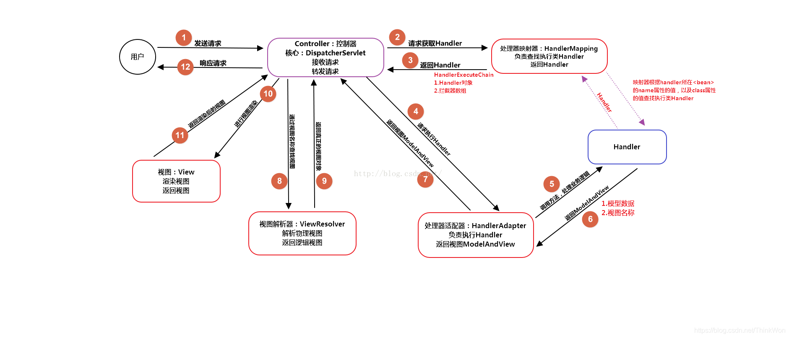

# 一、概述

## 1、MVC是什么？有什么好处？

mvc是一种设计模式（设计模式就是日常开发中编写代码的一种好的方法和经验的总结）。模型（model）-视图（view）-控制器（controller），三层架构的设计模式。用于实现前端页面的展现与后端业务数据处理的分离。

mvc设计模式的好处

1. 分层设计，实现了业务系统各个组件之间的解耦，有利于业务系统的可扩展性，可维护性。
2. 有利于系统的并行开发，提升开发效率。

## 2、什么是Spring MVC？

（简单介绍下你对Spring MVC的理解）

Spring MVC是一个基于Java的实现了MVC设计模式的请求驱动类型的轻量级Web框架，通过把模型-视图-控制器分离，将web层进行职责解耦，把复杂的web应用分成逻辑清晰的几部分，简化开发，减少出错，方便组内开发人员之间的配合。

## 3、Spring MVC的优点

1. 可以支持各种视图技术,而不仅仅局限于JSP；
2. 与Spring框架集成（如IoC容器、AOP等）；
3. 清晰的角色分配：前端控制器(dispatcherServlet) , 请求到处理器映射（handlerMapping), 处理器适配器（HandlerAdapter), 视图解析器（ViewResolver）；
4. 支持各种请求资源的映射策略。

## 4、SpringMVC的主要组件

（1）前端控制器 DispatcherServlet（不需要程序员开发）

作用：接收请求、响应结果，相当于转发器，有了DispatcherServlet 就减少了其它组件之间的耦合度。

（2）处理器映射器HandlerMapping（不需要程序员开发）

作用：根据请求的URL来查找Handler

（3）处理器适配器HandlerAdapter

注意：在编写Handler的时候要按照HandlerAdapter要求的规则去编写，这样适配器HandlerAdapter才可以正确的去执行Handler。

（4）处理器Handler（需要程序员开发）

（5）视图解析器 ViewResolver（不需要程序员开发）

作用：进行视图的解析，根据视图逻辑名解析成真正的视图（view）

（6）视图View（需要程序员开发jsp）

View是一个接口， 它的实现类支持不同的视图类型（jsp，freemarker，pdf等等）

> **什么是DispatcherServlet**
> Spring的MVC框架是围绕DispatcherServlet来设计的，它用来处理所有的HTTP请求和响应。
>
> **什么是Spring MVC框架的控制器？**
> 控制器提供一个访问应用程序的行为，此行为通常通过服务接口实现。控制器解析用户输入并将其转换为一个由视图呈现给用户的模型。Spring用一个非常抽象的方式实现了一个控制层，允许用户创建多种用途的控制器。
>
> **Spring MVC的控制器是不是单例模式,如果是,有什么问题,怎么解决？**
> 答：是单例模式,所以在多线程访问的时候有线程安全问题,不要用同步,会影响性能的,解决方案是在控制器里面不能写字段。

## 5、请描述Spring MVC的工作流程？

（请描述Spring MVC的工作原理/描述一下 DispatcherServlet 的工作流程？）

1. 用户发送请求至前端控制器DispatcherServlet；
2. DispatcherServlet收到请求后，调用HandlerMapping处理器映射器，请求获取Handle；
3. 处理器映射器根据请求url找到具体的处理器，生成处理器对象及处理器拦截器(如果有则生成)一并返回给DispatcherServlet；
4. DispatcherServlet 调用 HandlerAdapter处理器适配器；
5. HandlerAdapter 经过适配调用 具体处理器(Handler，也叫后端控制器)；
6. Handler执行完成返回ModelAndView；
7. HandlerAdapter将Handler执行结果ModelAndView返回给DispatcherServlet；
8. DispatcherServlet将ModelAndView传给ViewResolver视图解析器进行解析；
9. ViewResolver解析后返回具体View；
10. DispatcherServlet对View进行渲染视图（即将模型数据填充至视图中）
11. DispatcherServlet响应用户。

# 二、注解

## 1、注解原理是什么？

注解本质是一个继承了Annotation的特殊接口，其具体实现类是Java运行时生成的动态代理类。我们通过反射获取注解时，返回的是Java运行时生成的动态代理对象。通过代理对象调用自定义注解的方法，会最终调用AnnotationInvocationHandler的invoke方法。该方法会从memberValues这个Map中索引出对应的值。而memberValues的来源是Java常量池。

## 2、Spring MVC常用的注解有哪些？

- @RequestMapping：用于处理请求 url 映射的注解，可用于类或方法上。用于类上，则表示类中的所有响应请求的方法都是以该地址作为父路径；

- @RequestBody：注解实现接收http请求的json数据，将json转换为java对象；

- @ResponseBody：注解实现将conreoller方法返回对象转化为json对象响应给客户。

- @Controller：@Controller 用于标记在一个类上，使用它标记的类就是一个Spring MVC Controller 对象。分发处理器将会扫描使用了该注解的类的方法，并检测该方法是否使用了@RequestMapping 注解。@Controller 只是定义了一个控制器类，而使用@RequestMapping 注解的方法才是真正处理请求的处理器。

  > 单单使用@Controller 标记在一个类上还不能真正意义上的说它就是Spring MVC 的一个控制器类，因为这个时候Spring 还不认识它。那么要如何做Spring 才能认识它呢？这个时候就需要我们把这个控制器类交给Spring 来管理。有两种方式：
  >
  > 1. 在Spring MVC 的配置文件中定义MyController 的bean 对象;
  >
  > 2. 在Spring MVC 的配置文件中告诉Spring 该到哪里去找标记为@Controller 的Controller 控制器。

- @PathVariable和@RequestParam的区别：

  请求路径上有个id的变量值，可以通过@PathVariable来获取 @RequestMapping(value = “/page/{id}”, method = RequestMethod.GET)，@RequestParam用来获得静态的URL请求入参 spring注解时action里用到。

# 三、其它常见面试题

## 1、Spring MVC和Struts2区别

相同点：

都是基于mvc的表现层框架，都用于web项目的开发。

不同点：

1. 前端控制器不一样。Spring MVC的前端控制器是servlet：DispatcherServlet。struts2的前端控制器是filter：StrutsPreparedAndExcutorFilter。

2. 请求参数的接收方式不一样。Spring MVC是使用方法的形参接收请求的参数，基于方法的开发，线程安全，可以设计为单例或者多例的开发，推荐使用单例模式的开发（执行效率更高），默认就是单例开发模式。struts2是通过类的成员变量接收请求的参数，是基于类的开发，线程不安全，只能设计为多例的开发。

3. Struts采用值栈存储请求和响应的数据，通过OGNL存取数据，Spring MVC通过参数解析器是将request请求内容解析，并给方法形参赋值，将数据和视图封装成ModelAndView对象，最后又将ModelAndView中的模型数据通过reques域传输到页面。Jsp视图解析器默认使用jstl。

4. 与spring整合不一样。Spring MVC是spring框架的一部分，不需要整合。在企业项目中，Spring MVC使用更多一些。

## 2、Spring MVC怎么样设定重定向和转发的？

（1）转发：在返回值前面加"forward:"，譬如"forward:user.do?name=method4"

（2）重定向：在返回值前面加"redirect:"，譬如"redirect:http://www.baidu.com"

> **转发和重定向的区别：**
>
> 1. 转发：浏览器URL的地址栏不变。重定向：浏览器URL的地址栏改变；
> 2. 转发是服务器行为，重定向是客户端行为；
> 3. 转发是浏览器只做了一次访问请求。重定向是浏览器做了至少两次的访问请求；
> 4. 转发2次跳转之间传输的信息不会丢失，重定向2次跳转之间传输的信息会丢失（request范围）。
>
> **转发和重定向的选择**
>
> 1. 重定向的速度比转发慢，因为浏览器还得发出一个新的请求，如果在使用转发和重定向都无所谓的时候建议使用转发。
>
> 2. 因为转发只能访问当前WEB的应用程序，所以不同WEB应用程序之间的访问，特别是要访问到另外一个WEB站点上的资源的情况，这个时候就只能使用重定向了。
>
> 【具体参考博客：[页面跳转的两种方式(转发和重定向)区别及应用场景分析](https://blog.csdn.net/liubin5620/article/details/79922692?ops_request_misc=&request_id=&biz_id=102&utm_term=%E8%BD%AC%E5%8F%91%E5%92%8C%E9%87%8D%E5%AE%9A%E5%90%91%E7%9A%84%E5%8C%BA%E5%88%AB&utm_medium=distribute.pc_search_result.none-task-blog-2~all~sobaiduweb~default-0-79922692.nonecase&spm=1018.2226.3001.4187)】

## 3、JSP四大作用域

page (作用范围最小)、request、session、application（作用范围最大）。

1. 存储在`application`对象中的属性可以被**同一个WEB应用程序**中的所有Servlet和JSP页面访问。（属性作用范围最大）
2. 存储在`session`对象中的属性可以被**属于同一个会话（浏览器打开直到关闭称为一次会话，且在此期间会话不失效）**的所有Servlet和JSP页面访问。
3. 存储在`request`对象中的属性可以被**属于同一个请求**的所有Servlet和JSP页面访问（在有转发的情况下可以跨页面获取属性值），例如使用PageContext.forward和PageContext.include方法连接起来的多个Servlet和JSP页面。
4. 存储在`pageContext`对象中的属性仅可以被**当前JSP页面**的当前响应过程中调用的各个组件访问，例如，正在响应当前请求的JSP页面和它调用的各个自定义标签类。