# 一、基本概念

## 1、权限管理

基本上涉及到用户参与的系统都要进行权限管理，权限管理属于系统安全的范畴，权限管理实现`对用户访问系统的控制`，按照`安全规则`或者`安全策略`控制用户`可以访问而且只能访问自己被授权的资源`。

权限管理包括用户**身份认证**和**授权**两部分，简称**认证授权**。对于需要访问控制的资源用户首先经过身份认证，认证通过后用户具有该资源的访问权限方可访问。

## 2、认证

**身份认证**，就是判断一个用户是否为合法用户的处理过程。最常用的简单身份认证方式是系统通过核对用户输入的用户名和口令，看其是否与系统中存储的该用户的用户名和口令一致，来判断用户身份是否正确。对于采用指纹等系统，则出示指纹；对于硬件Key等刷卡系统，则需要刷卡。

## 3、授权

**授权**，即访问控制，控制谁能访问哪些资源。主体进行身份认证后需要分配权限方可访问系统的资源，对于某些资源没有权限是无法访问的

## 4、解决方案

和其他领域不同，在 Java 企业级开发中，安全管理框架非常少，目前比较常见的就是：

- Shiro：Shiro 本身是一个老牌的安全管理框架，有着众多的优点，例如轻量、简单、易于集成、可以在JavaSE环境中使用等。不过，在微服务时代，Shiro 就显得力不从心了，在微服务面前和扩展方面，无法充分展示自己的优势。
- 开发者自定义：也有很多公司选择自定义权限，即自己开发权限管理。但是一个系统的安全，不仅仅是登录和权限控制这么简单，我们还要考虑种各样可能存在的网络政击以及防彻策略，从这个角度来说，开发者白己实现安全管理也并非是一件容易的事情，只有大公司才有足够的人力物力去支持这件事情。
- Spring Security：Spring Security，作为spring 家族的一员，在和 Spring 家族的其他成员如 Spring Boot Spring Clond等进行整合时，具有其他框架无可比拟的优势，同时对 OAuth2 有着良好的支持，再加上Spring Cloud对 Spring Security的不断加持（如推出 Spring Cloud Security )，让 Spring Securiy 不知不觉中成为微服务项目的首选安全管理方案。


---

# 二、Spring Security

## 1、定义

Spring Security是一个功能强大、可高度定制的身份验证和访问控制框架。它是保护基于Spring的应用程序的事实标准。

Spring Security是一个面向Java应用程序提供身份验证和安全性的框架。与所有Spring项目一样，Spring Security的真正威力在于它可以轻松地扩展以满足定制需求。

> Spring Security是一个功能强大、可高度定制的**身份验证**和**访问控制**的框架。或者说用来实现系统中权限管理的框架。

## 2、整体架构

在Spring Security的架构设计中，**认证**\<Authentication>和**授权**\<Authorization>是分开的，无论使用什么样的认证方式。都不会影响授权，这是两个独立的存在，这种独立带来的好处之一，就是可以非常方便地整合一些外部的解决方案。


### 1）认证Authentication

#### （1）AuthenticationManager

在Spring Security中认证是由`AuthenticationManager`接口来负责的，接口定义为：

```java
public interface AuthenticationManager { 
	Authentication authenticate(Authentication authentication) 
  														throws AuthenticationException;
}
```

- 返回 Authentication 表示认证成功
- 返回 AuthenticationException 异常，表示认证失败。

AuthenticationManager 主要实现类为 ProviderManager，在 ProviderManager 中管理了众多 AuthenticationProvider 实例。在一次完整的认证流程中，Spring Security 允许存在多个 AuthenticationProvider ，用来实现多种认证方式，这些 AuthenticationProvider 都是由 ProviderManager 进行统一管理的。


#### （2）Authentication

认证以及认证成功的信息主要是由 Authentication 的实现类进行保存的，其接口定义为：

```java
public interface Authentication extends Principal, Serializable {
	Collection<? extends GrantedAuthority> getAuthorities();//获取用户权限信息
	Object getCredentials();//获取用户凭证信息，一般指密码
	Object getDetails();//获取用户详细信息		
	Object getPrincipal();//获取用户身份信息，用户名、用户对象等
	boolean isAuthenticated();//用户是否认证成功
	void setAuthenticated(boolean isAuthenticated) throws IllegalArgumentException;
}
```

#### （3）SecurityContextHolder

SecurityContextHolder 用来获取登录之后用户信息。Spring Security 会将登录用户数据保存在 Session 中。但是，为了使用方便，Spring Security在此基础上还做了一些改进，其中最主要的一个变化就是线程绑定。当用户登录成功后，Spring Security 会将登录成功的用户信息保存到 SecurityContextHolder 中。SecurityContextHolder 中的数据保存默认是通过ThreadLocal 来实现的，使用 ThreadLocal 创建的变量只能被当前线程访问，不能被其他线程访问和修改，也就是用户数据和请求线程绑定在一起。当登录请求处理完毕后，Spring Security 会将 SecurityContextHolder 中的数据拿出来保存到 Session 中，同时将 SecurityContexHolder 中的数据清空。以后每当有请求到来时，Spring Security 就会先从 Session 中取出用户登录数据，保存到 SecurityContextHolder 中，方便在该请求的后续处理过程中使用，同时在请求结束时将 SecurityContextHolder 中的数据拿出来保存到 Session 中，然后将 Security SecurityContextHolder 中的数据清空。这一策略非常方便用户在 Controller、Service 层以及任何代码中获取当前登录用户数据。

### 2）授权Authorization

当完成认证后，接下米就是授权了。在 Spring Security 的授权体系中，有两个关键接口，

#### （1）AccessDecisionManager

AccessDecisionManager (访问决策管理器)，用来决定此次访问是否被允许。

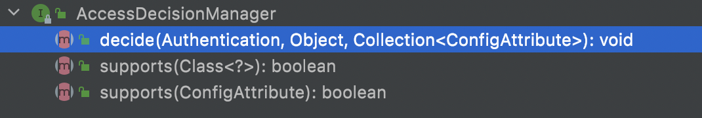

#### （2）AccessDecisionVoter

AccessDecisionVoter (访问决定投票器)，投票器会检查用户是否具备应有的角色，进而投出赞成、反对或者弃权票。


AccesDecisionVoter 和 AccessDecisionManager 都有众多的实现类，在 AccessDecisionManager 中会挨个遍历 AccessDecisionVoter，进而决定是否允许用户访问，因而 AaccesDecisionVoter 和 AccessDecisionManager 两者的关系类似于 AuthenticationProvider 和 ProviderManager 的关系。

#### （3）ConfigAttribute

ConfigAttribute，用来保存授权时的角色信息。


在 Spring Security 中，用户请求一个资源(通常是一个接口或者一个 Java 方法)需要的角色会被封装成一个 ConfigAttribute 对象，在 ConfigAttribute 中只有一个 getAttribute方法，该方法返回一个 String 字符串，就是角色的名称。一般来说，角色名称都带有一个 `ROLE_` 前缀，投票器 AccessDecisionVoter 所做的事情，其实就是比较用户所具各的角色和请求某个资源所需的 ConfigAtuibute 之间的关系。

## 3、实现原理

[官网文档](https://docs.spring.io/spring-security/site/docs/5.5.4/reference/html5/#servlet-architecture)

开发者只需要引入一个依赖，就可以让 Spring Security 对应用进行保护。Spring Security 又是如何做到的呢？

在 Spring Security 中*认证、授权* 等功能都是基于**过滤器**完成的。


需要注意的是，默认过滤器并不是直接放在 Web 项目的原生过滤器链中，而是通过一个
FlterChainProxy 来统一管理。Spring Security 中的过滤器链通过 FilterChainProxy 嵌入到 Web项目的原生过滤器链中。FilterChainProxy  作为一个顶层的管理者，将统一管理 Security Filter。FilterChainProxy 本身是通过 Spring 框架提供的 DelegatingFilterProxy 整合到原生的过滤器链中。

### 1）Security Filters

那么在 Spring Security 中给我们提供那些过滤器? 默认情况下那些过滤器会被加载呢？

| 过滤器                                    | 过滤器作用                                               | 默认是否加载 |
| ----------------------------------------- | -------------------------------------------------------- | ------------ |
| ChannelProcessingFilter                   | 过滤请求协议 HTTP 、HTTPS                                | NO           |
| `WebAsyncManagerIntegrationFilter`        | 将 WebAsyncManger 与 SpringSecurity 上下文进行集成       | YES          |
| `SecurityContextPersistenceFilter`        | 在处理请求之前,将安全信息加载到 SecurityContextHolder 中 | YES          |
| `HeaderWriterFilter`                      | 处理头信息加入响应中                                     | YES          |
| CorsFilter                                | 处理跨域问题                                             | NO           |
| `CsrfFilter`                              | 处理 CSRF 攻击                                           | YES          |
| `LogoutFilter`                            | 处理注销登录                                             | YES          |
| OAuth2AuthorizationRequestRedirectFilter  | 处理 OAuth2 认证重定向                                   | NO           |
| Saml2WebSsoAuthenticationRequestFilter    | 处理 SAML 认证                                           | NO           |
| X509AuthenticationFilter                  | 处理 X509 认证                                           | NO           |
| AbstractPreAuthenticatedProcessingFilter  | 处理预认证问题                                           | NO           |
| CasAuthenticationFilter                   | 处理 CAS 单点登录                                        | NO           |
| OAuth2LoginAuthenticationFilter           | 处理 OAuth2 认证                                         | NO           |
| Saml2WebSsoAuthenticationFilter           | 处理 SAML 认证                                           | NO           |
| `UsernamePasswordAuthenticationFilter`    | 处理表单登录                                             | YES          |
| OpenIDAuthenticationFilter                | 处理 OpenID 认证                                         | NO           |
| `DefaultLoginPageGeneratingFilter`        | 配置默认登录页面                                         | YES          |
| `DefaultLogoutPageGeneratingFilter`       | 配置默认注销页面                                         | YES          |
| ConcurrentSessionFilter                   | 处理 Session 有效期                                      | NO           |
| DigestAuthenticationFilter                | 处理 HTTP 摘要认证                                       | NO           |
| BearerTokenAuthenticationFilter           | 处理 OAuth2 认证的 Access Token                          | NO           |
| `BasicAuthenticationFilter`               | 处理 HttpBasic 登录                                      | YES          |
| `RequestCacheAwareFilter`                 | 处理请求缓存                                             | YES          |
| `SecurityContextHolderAwareRequestFilter` | 包装原始请求                                             | YES          |
| JaasApiIntegrationFilter                  | 处理 JAAS 认证                                           | NO           |
| RememberMeAuthenticationFilter            | 处理 RememberMe 登录                                     | NO           |
| `AnonymousAuthenticationFilter`           | 配置匿名认证                                             | YES          |
| OAuth2AuthorizationCodeGrantFilter        | 处理OAuth2认证中授权码                                   | NO           |
| `SessionManagementFilter`                 | 处理 session 并发问题                                    | YES          |
| `ExceptionTranslationFilter`              | 处理认证/授权中的异常                                    | YES          |
| `FilterSecurityInterceptor`               | 处理授权相关                                             | YES          |
| SwitchUserFilter                          | 处理账户切换                                             | NO           |

可以看出，Spring Security 提供了 30 多个过滤器。默认情况下Spring Boot 在对 Spring Security 进入自动化配置时，会创建一个名为 SpringSecurityFilerChain 的过滤器，并注入到 Spring 容器中，这个过滤器将负责所有的安全管理，包括用户认证、授权、重定向到登录页面等。具体可以参考WebSecurityConfiguration的源码:

### 2）SpringBootWebSecurityConfiguration

这个类是 spring boot 自动配置类，通过这个源码得知，默认情况下对所有请求进行权限控制:

```java
@Configuration(proxyBeanMethods = false)
@ConditionalOnDefaultWebSecurity
@ConditionalOnWebApplication(type = Type.SERVLET)
class SpringBootWebSecurityConfiguration {
	@Bean
	@Order(SecurityProperties.BASIC_AUTH_ORDER)
	SecurityFilterChain defaultSecurityFilterChain(HttpSecurity http) 
    throws Exception {
			http.authorizeRequests().anyRequest()
      .authenticated().and().formLogin().and().httpBasic();
		return http.build();
	}
}
```

**这就是为什么在引入 Spring Security 中没有任何配置情况下，请求会被拦截的原因！**

通过上面对自动配置分析，我们也能看出默认生效条件为：

```java
class DefaultWebSecurityCondition extends AllNestedConditions {

	DefaultWebSecurityCondition() {
		super(ConfigurationPhase.REGISTER_BEAN);
	}

	@ConditionalOnClass({ SecurityFilterChain.class, HttpSecurity.class })
	static class Classes {

	}

	@ConditionalOnMissingBean({ WebSecurityConfigurerAdapter.class, SecurityFilterChain.class })
	static class Beans {

	}

}
```

- 条件一 classpath中存在 SecurityFilterChain.class, HttpSecurity.class（肯定有）
- 条件二 没有自定义 WebSecurityConfigurerAdapter.class, SecurityFilterChain.class

默认情况下，条件都是满足的。WebSecurityConfigurerAdapter 这个类极其重要，Spring Security 核心配置都在这个类中：


如果要对 Spring Security 进行自定义配置，就要自定义这个类实例，通过覆盖类中方法达到修改默认配置的目的。

### 3）流程分析


1. 请求 /hello 接口，在引入 spring security 之后会先经过一系列过滤器；
2. 在请求到达 FilterSecurityInterceptor时，发现请求并未认证。请求拦截下来，并抛出 AccessDeniedException 异常。
3. 抛出 AccessDeniedException 的异常会被 ExceptionTranslationFilter 捕获，这个 Filter 中会调用 LoginUrlAuthenticationEntryPoint#commence 方法给客户端返回 302，要求客户端进行重定向到 /login 页面。
4. 客户端发送 /login 请求。
5. /login 请求会再次被拦截器中 DefaultLoginPageGeneratingFilter 拦截到，并在拦截器中返回生成登录页面。

**就是通过这种方式，Spring Security 默认过滤器中生成了登录页面，并返回！**

### 4）默认用户生成

1. 查看 SpringBootWebSecurityConfiguration#defaultSecurityFilterChain 方法表单登录


2. 处理登录为 FormLoginConfigurer 类中 调用 UsernamePasswordAuthenticationFilter这个类实例

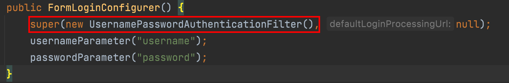

3. 查看类中 UsernamePasswordAuthenticationFilter#attempAuthentication 方法得知实际调用 AuthenticationManager 中 authenticate 方法


4. 调用 ProviderManager 类中方法 authenticate


5. 调用了 ProviderManager 实现类中 AbstractUserDetailsAuthenticationProvider类中方法


6. 最终调用实现类 DaoAuthenticationProvider 类中方法比较


### 5）UserDetailService

通过刚才源码分析也能得知 UserDetailService 是顶层父接口，接口中 loadUserByUserName 方法是用来在认证时进行用户名认证方法，默认实现使用是内存实现，如果想要修改数据库实现我们只需要自定义 UserDetailService 实现，最终返回 UserDetails 实例即可。

```java
public interface UserDetailsService {
	UserDetails loadUserByUsername(String username) throws UsernameNotFoundException;
}
```


### 6）UserDetailsServiceAutoConfiguration

梳理关键部分：

```java
@Configuration(proxyBeanMethods = false)
@ConditionalOnClass(AuthenticationManager.class)
@ConditionalOnBean(ObjectPostProcessor.class)
@ConditionalOnMissingBean(
		value = { AuthenticationManager.class, AuthenticationProvider.class, UserDetailsService.class,
				AuthenticationManagerResolver.class },
		type = { "org.springframework.security.oauth2.jwt.JwtDecoder",
				"org.springframework.security.oauth2.server.resource.introspection.OpaqueTokenIntrospector",
				"org.springframework.security.oauth2.client.registration.ClientRegistrationRepository" })
public class UserDetailsServiceAutoConfiguration {
  //....
  @Bean
	@Lazy
	public InMemoryUserDetailsManager inMemoryUserDetailsManager(SecurityProperties properties,
			ObjectProvider<PasswordEncoder> passwordEncoder) {
		SecurityProperties.User user = properties.getUser();
		List<String> roles = user.getRoles();
		return new InMemoryUserDetailsManager(
				User.withUsername(user.getName()).password(getOrDeducePassword(user, passwordEncoder.getIfAvailable()))
						.roles(StringUtils.toStringArray(roles)).build());
	}
  //...
}
```

**结论：**

1. 从自动配置源码中得知当 classpath 下存在 AuthenticationManager 类
2. 当前项目中，系统没有提供 AuthenticationManager.class、 AuthenticationProvider.class、UserDetailsService.class、
   	AuthenticationManagerResolver.class、实例

**默认情况下都会满足，此时Spring Security会提供一个 InMemoryUserDetailsManager 实例**


```java
@ConfigurationProperties(prefix = "spring.security")
public class SecurityProperties {
	private final User user = new User();
	public User getUser() {
		return this.user;
  }
  //....
	public static class User {
		private String name = "user";
		private String password = UUID.randomUUID().toString();
		private List<String> roles = new ArrayList<>();
		private boolean passwordGenerated = true;
		//get set ...
	}
}
```

**这就是默认生成 user 以及 uuid 密码过程! 另外看明白源码之后，就知道只要在配置文件中加入如下配置可以对内存中用户和密码进行覆盖。**

```properties
spring.security.user.name=root
spring.security.user.password=root
spring.security.user.roles=admin,users
```

### 7）总结

- AuthenticationManager、ProviderManger、以及 AuthenticationProvider 关系


- **WebSecurityConfigurerAdapter** 扩展 Spring Security 所有默认配置

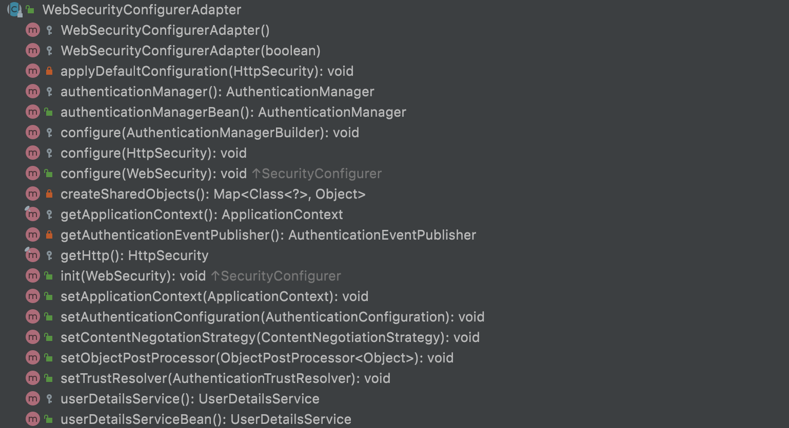

- **UserDetailService** 用来修改默认认证的数据源信息


---

# 三、自定义认证

## 1、自定义资源权限规则

- /index  公共资源
- /hello .... 受保护资源 权限管理

在项目中添加如下配置就可以实现对资源权限规则设定：

```java
@Configuration
public class WebSecurityConfigurer extends WebSecurityConfigurerAdapter {
    @Override
    protected void configure(HttpSecurity http) throws Exception {
        http.authorizeHttpRequests()
                .mvcMatchers("/index").permitAll()
                .anyRequest().authenticated()
                .and().formLogin();
    }
}
```

> 说明
>
> - permitAll() 代表放行该资源,该资源为公共资源 无需认证和授权可以直接访问
> - anyRequest().authenticated() 代表所有请求,必须认证之后才能访问
> - formLogin() 代表开启表单认证
>
> 注意: 放行资源必须放在所有认证请求之前!

## 2、自定义登录界面

1. 引入thymeleaf

```xml
<!--thymeleaf-->
<dependency>
  <groupId>org.springframework.boot</groupId>
  <artifactId>spring-boot-starter-thymeleaf</artifactId>
</dependency>
```

2. 定义登录页面 controller

```java
@Controller
public class LoginController {

    @RequestMapping("/login.html")
    public String login() {
        return "login";
    }
}
```

3. 在 templates 中定义登录界面

```html
<!DOCTYPE html>
<html lang="en" xmlns:th="https://www.thymeleaf.org">
<head>
    <meta charset="UTF-8">
    <title>登录</title>
</head>
<body>
<h1>用户登录</h1>
<form method="post" th:action="@{/doLogin}">
    用户名:<input name="uname" type="text"/><br>
    密码:<input name="passwd" type="password"/><br>
    <input type="submit" value="登录"/>
</form>
</body>
</html>
```

**需要注意的是**

- 登录表单 method 必须为 `post`，action 的请求路径为 `/doLogin`
- 用户名的 name 属性为 `uname`
- 密码的 name 属性为 `passwd`

配置 Spring Security 配置类

```java
@Configuration
public class WebSecurityConfigurer extends WebSecurityConfigurerAdapter {
    @Override
    protected void configure(HttpSecurity http) throws Exception {
         http.authorizeHttpRequests()
                .mvcMatchers("/login.html").permitAll()
                .mvcMatchers("/index").permitAll()
                .anyRequest().authenticated()
                .and()
                .formLogin()
                .loginPage("/login.html")
                .loginProcessingUrl("/doLogin")
                .usernameParameter("uname")			//默认为“username”
                .passwordParameter("passwd")		//默认为“password”
                .successForwardUrl("/index") 	 //forward 跳转      注意:不会跳转到之前请求路径
                //.defaultSuccessUrl("/index")   //redirect 重定向    注意:如果之前请求路径,会有优先跳转之前请求路径
                .failureUrl("/login.html")
                .and()
                .csrf().disable();//这里先关闭 CSRF
    }
}
```

successForwardUrl 、defaultSuccessUrl 这两个方法都可以实现成功之后跳转

- successForwardUrl  默认使用 `forward `跳转      `注意:不会跳转到之前请求路径`

- defaultSuccessUrl   默认使用 `redirect` 跳转      `注意:如果之前请求路径,会有优先跳转之前请求路径,可以传入第二个参数进行修改`

## 3、自定义登录成功处理(前后分离)

有时候页面跳转并不能满足我们，特别是在前后端分离开发中就不需要成功之后跳转页面。只需要给前端返回一个 JSON 通知登录成功还是失败与否。这个时候可以通过自定义 `AuthenticationSucccessHandler` 实现。

```java
public interface AuthenticationSuccessHandler {

	/**
	 * Called when a user has been successfully authenticated.
	 * @param request the request which caused the successful authentication
	 * @param response the response
	 * @param authentication the <tt>Authentication</tt> object which was created during
	 * the authentication process.
	 */
	void onAuthenticationSuccess(HttpServletRequest request, HttpServletResponse response,
			Authentication authentication) throws IOException, ServletException;
}
```

**根据接口的描述信息,也可以得知登录成功会自动回调这个方法，进一步查看它的默认实现，你会发现successForwardUrl、defaultSuccessUrl也是由它的子类实现的**

1. 自定义 AuthenticationSuccessHandler 实现

```java
public class MyAuthenticationSuccessHandler implements AuthenticationSuccessHandler {
    @Override
    public void onAuthenticationSuccess(HttpServletRequest request, HttpServletResponse response, Authentication authentication) throws IOException, ServletException {
        Map<String, Object> result = new HashMap<String, Object>();
        result.put("msg", "登录成功");
        result.put("status", 200);
        response.setContentType("application/json;charset=UTF-8");
        String s = new ObjectMapper().writeValueAsString(result);
        response.getWriter().println(s);
    }
}
```

2. 配置 AuthenticationSuccessHandler

```java
@Configuration
public class WebSecurityConfigurer extends WebSecurityConfigurerAdapter {
    @Override
    protected void configure(HttpSecurity http) throws Exception {
        http.authorizeHttpRequests()
                //...
                .and()
                .formLogin()
                //....
                .successHandler(new MyAuthenticationSuccessHandler())
                .failureUrl("/login.html")
                .and()
                .csrf().disable();//这里先关闭 CSRF
    }
}
```

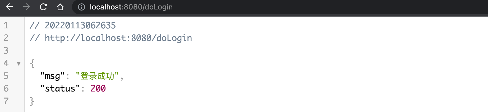

## 4、显示登录失败信息

为了能更直观在登录页面看到异常错误信息，可以在登录页面中直接获取异常信息。Spring Security 在登录失败之后会将异常信息存储到 `request` 、`session`作用域中 key 为 `SPRING_SECURITY_LAST_EXCEPTION` 命名属性中，源码可以参考 SimpleUrlAuthenticationFailureHandler ：

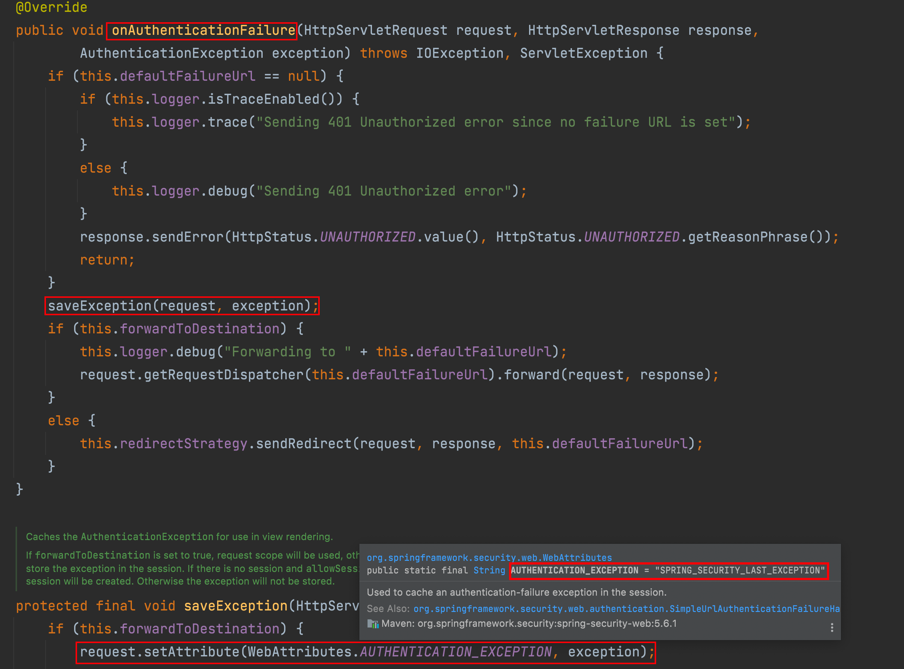

1. 显示异常信息

```html
<!DOCTYPE html>
<html lang="en" xmlns:th="https://www.thymeleaf.org">
<head>
    <meta charset="UTF-8">
    <title>登录</title>
</head>
<body>
  ....
  <div th:text="${SPRING_SECURITY_LAST_EXCEPTION}"></div>
</body>
</html>
```

2. 配置

```java
@Configuration
public class WebSecurityConfigurer extends WebSecurityConfigurerAdapter {

    @Override
    protected void configure(HttpSecurity http) throws Exception {
        http.authorizeHttpRequests()
              	//..
                .and()
                .formLogin()
                //....
                //.failureUrl("/login.html")
                .failureForwardUrl("/login.html")
                .and()
                .csrf().disable();//这里先关闭 CSRF
    }
}

```

- failureUrl、failureForwardUrl 关系类似于之前提到的 successForwardUrl 、defaultSuccessUrl 方法
  - failureUrl 失败以后的重定向跳转
  - failureForwardUrl 失败以后的 forward 跳转 `注意:因此获取 request 中异常信息,这里只能使用failureForwardUrl`

> 若使用failureUrl ，则需将前端页面改为：
>
> ```html
> <div th:text="${session.SPRING_SECURITY_LAST_EXCEPTION}"></div>
> ```

## 5、自定义登录失败处理(前后分离)

和自定义登录成功处理一样，Spring Security 同样为前后端分离开发提供了登录失败的处理，这个类就是  AuthenticationFailureHandler，源码为：

```java
public interface AuthenticationFailureHandler {

	/**
	 * Called when an authentication attempt fails.
	 * @param request the request during which the authentication attempt occurred.
	 * @param response the response.
	 * @param exception the exception which was thrown to reject the authentication
	 * request.
	 */
	void onAuthenticationFailure(HttpServletRequest request, HttpServletResponse response,
			AuthenticationException exception) throws IOException, ServletException;

}
```

**根据接口的描述信息,也可以得知登录失败会自动回调这个方法，进一步查看它的默认实现，你会发现failureUrl、failureForwardUrl也是由它的子类实现的。**

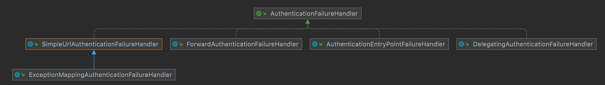

1. 自定义 AuthenticationFailureHandler 实现

```java
public class MyAuthenticationFailureHandler implements AuthenticationFailureHandler {

    @Override
    public void onAuthenticationFailure(HttpServletRequest request, HttpServletResponse response, AuthenticationException exception) throws IOException, ServletException {
        Map<String, Object> result = new HashMap<String, Object>();
        result.put("msg", "登录失败: "+exception.getMessage());
        result.put("status", 500);
        response.setContentType("application/json;charset=UTF-8");
        String s = new ObjectMapper().writeValueAsString(result);
        response.getWriter().println(s);
    }
}
```

2. 配置 AuthenticationFailureHandler

```java
@Configuration
public class WebSecurityConfigurer extends WebSecurityConfigurerAdapter {

    @Override
    protected void configure(HttpSecurity http) throws Exception {
        http.authorizeHttpRequests()
	              //...
                .and()
                .formLogin()
               	//..
                .failureHandler(new MyAuthenticationFailureHandler())
                .and()
                .csrf().disable();//这里先关闭 CSRF
    }
}
```

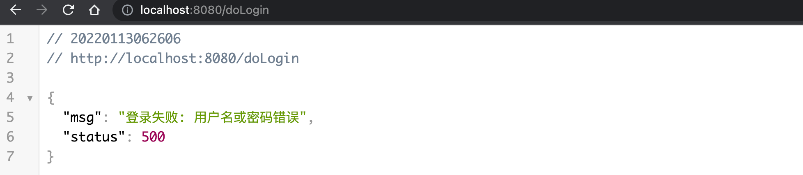

## 6、注销登录

Spring Security 中也提供了默认的注销登录配置，在开发时也可以按照自己需求对注销进行个性化定制。

### 1）开启注销登录`默认开启`

```java
@Configuration
public class WebSecurityConfigurer extends WebSecurityConfigurerAdapter {
@Override
    protected void configure(HttpSecurity http) throws Exception {
        http.authorizeHttpRequests()
                //...
                .and()
                .formLogin()
                //...
                .and()
                .logout()
                .logoutUrl("/logout")
                .invalidateHttpSession(true)
                .clearAuthentication(true)
                .logoutSuccessUrl("/login.html")
                .and()
                .csrf().disable();//这里先关闭 CSRF
    }
}
```

- 通过 logout() 方法开启注销配置
- logoutUrl 指定退出登录请求地址，默认是 GET 请求，路径为 `/logout`
- invalidateHttpSession 退出时是否是 session 失效，默认值为 true
- clearAuthentication 退出时是否清除认证信息，默认值为 true
- logoutSuccessUrl 退出登录时跳转地址

### 2）配置多个注销登录请求

如果项目中有需要，开发者还可以配置多个注销登录的请求，同时还可以指定请求的方法：

```java
@Configuration
public class WebSecurityConfigurer extends WebSecurityConfigurerAdapter {
		@Override
    protected void configure(HttpSecurity http) throws Exception {
        http.authorizeHttpRequests()
                //...
                .and()
                .formLogin()
                //...
                .and()
                .logout()
                .logoutRequestMatcher(new OrRequestMatcher(
                        new AntPathRequestMatcher("/logout1","GET"),
                        new AntPathRequestMatcher("/logout","GET")
                ))
                .invalidateHttpSession(true)
                .clearAuthentication(true)
                .logoutSuccessUrl("/login.html")
                .and()
                .csrf().disable();//这里先关闭 CSRF
    }
}
```

### 3）前后端分离注销登录配置(前后分离)

如果是前后端分离开发，注销成功之后就不需要页面跳转了，只需要将注销成功的信息返回前端即可，此时我们可以通过自定义 LogoutSuccessHandler  实现来返回注销之后信息：

```java
public class MyLogoutSuccessHandler implements LogoutSuccessHandler {
    @Override
    public void onLogoutSuccess(HttpServletRequest request, HttpServletResponse response, Authentication authentication) throws IOException, ServletException {
        Map<String, Object> result = new HashMap<String, Object>();
        result.put("msg", "注销成功");
        result.put("status", 200);
        response.setContentType("application/json;charset=UTF-8");
        String s = new ObjectMapper().writeValueAsString(result);
        response.getWriter().println(s);
    }
}
```

配置：

```java
@Configuration
public class WebSecurityConfigurer extends WebSecurityConfigurerAdapter {
    @Override
    protected void configure(HttpSecurity http) throws Exception {
        http.authorizeHttpRequests()
          			//....
                .and()
                .formLogin()
 								//...
                .and()
                .logout()
                //.logoutUrl("/logout")
                .logoutRequestMatcher(new OrRequestMatcher(
                        new AntPathRequestMatcher("/logout1","GET"),
                        new AntPathRequestMatcher("/logout","GET")
                ))
                .invalidateHttpSession(true)
                .clearAuthentication(true)
                //.logoutSuccessUrl("/login.html")
                .logoutSuccessHandler(new MyLogoutSuccessHandler())
                .and()
                .csrf().disable();//这里先关闭 CSRF
    }
}
```

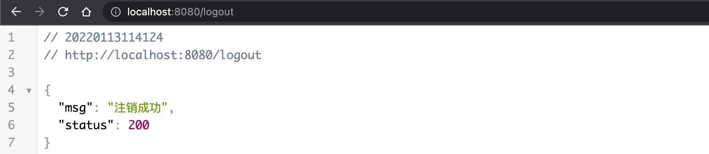


---

# 四、登录用户数据获取

## 1、SpringContextHolder

Spring Security 会将登录用户数据保存在 Session 中。但是，为了使用方便,Spring Security在此基础上还做了一些改进，其中最主要的一个变化就是线程绑定。当用户登录成功后,Spring Security 会将登录成功的用户信息保存到 SecurityContextHolder 中。

​	SecurityContextHolder 中的数据保存默认是通过ThreadLocal 来实现的，使用 ThreadLocal 创建的变量只能被当前线程访问，不能被其他线程访问和修改，也就是用户数据和请求线程绑定在一起。当登录请求处理完毕后，Spring Security 会将 SecurityContextHolder 中的数据拿出来保存到 Session 中，同时将 SecurityContexHolder 中的数据清空。以后每当有请求到来时，Spring Security 就会先从 Session 中取出用户登录数据，保存到SecurityContextHolder 中，方便在该请求的后续处理过程中使用，同时在请求结束时将 SecurityContextHolder 中的数据拿出来保存到 Session 中，然后将SecurityContextHolder 中的数据清空。

​	实际上 SecurityContextHolder 中存储是 SecurityContext，在 SecurityContext 中存储是 Authentication。

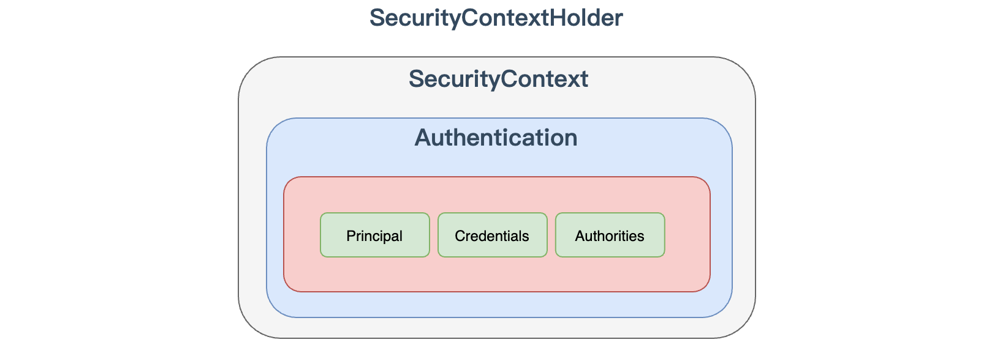

这种设计是典型的策略设计模式：

```java
public class SecurityContextHolder {
	public static final String MODE_THREADLOCAL = "MODE_THREADLOCAL";
	public static final String MODE_INHERITABLETHREADLOCAL = "MODE_INHERITABLETHREADLOCAL";
	public static final String MODE_GLOBAL = "MODE_GLOBAL";
	private static final String MODE_PRE_INITIALIZED = "MODE_PRE_INITIALIZED";
	private static SecurityContextHolderStrategy strategy;
  //....
	private static void initializeStrategy() {
		if (MODE_PRE_INITIALIZED.equals(strategyName)) {
			Assert.state(strategy != null, "When using " + MODE_PRE_INITIALIZED
					+ ", setContextHolderStrategy must be called with the fully constructed strategy");
			return;
		}
		if (!StringUtils.hasText(strategyName)) {
			// Set default
			strategyName = MODE_THREADLOCAL;
		}
		if (strategyName.equals(MODE_THREADLOCAL)) {
			strategy = new ThreadLocalSecurityContextHolderStrategy();
			return;
		}
		if (strategyName.equals(MODE_INHERITABLETHREADLOCAL)) {
			strategy = new InheritableThreadLocalSecurityContextHolderStrategy();
			return;
		}
		if (strategyName.equals(MODE_GLOBAL)) {
			strategy = new GlobalSecurityContextHolderStrategy();
			return;
		}
    //.....
  }
}
```

1. `MODE_THREADLOCAL`：这种存放策略是将 SecurityContext 存放在 ThreadLocal中，大家知道 Threadlocal 的特点是在哪个线程中存储就要在哪个线程中读取，这其实非常适合 web 应用，因为在默认情况下，一个请求无论经过多少 Filter 到达 Servlet，都是由一个线程来处理的。这也是 SecurityContextHolder 的默认存储策略，这种存储策略意味着如果在具体的业务处理代码中，开启了子线程，在子线程中去获取登录用户数据，就会获取不到。
2. `MODE_INHERITABLETHREADLOCAL`：这种存储模式适用于多线程环境，如果希望在子线程中也能够获取到登录用户数据，那么可以使用这种存储模式。
3. `MODE_GLOBAL`：这种存储模式实际上是将数据保存在一个静态变量中，在 JavaWeb开发中，这种模式很少使用到。

## 2、SecurityContextHolderStrategy

通过 SecurityContextHolder 可以得知，SecurityContextHolderStrategy 接口用来定义存储策略方法

```java
public interface SecurityContextHolderStrategy {
	void clearContext();
	SecurityContext getContext();
	void setContext(SecurityContext context);
	SecurityContext createEmptyContext();
}
```

接口中一共定义了四个方法：

- `clearContext`：该方法用来清除存储的 SecurityContext对象。
- `getContext`：该方法用来获取存储的 SecurityContext 对象。
- `setContext`：该方法用来设置存储的 SecurityContext 对象。
- `create Empty Context`：该方法则用来创建一个空的 SecurityContext 对象。

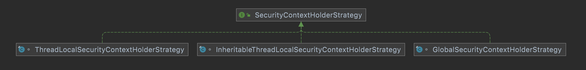

从上面可以看出每一个实现类对应一种策略的实现。

## 3、代码中获取认证之后的用户数据(前后分离)

```java
@RestController
public class HelloController {
    @RequestMapping("/hello")
    public String hello() {
      Authentication authentication = SecurityContextHolder
        .getContext().getAuthentication();
      User principal = (User) authentication.getPrincipal();
      System.out.println("身份 :"+principal.getUsername());
      System.out.println("凭证 :"+authentication.getCredentials());
      System.out.println("权限 :"+authentication.getAuthorities());
      return "hello security";
    }
}
```

多线程情况下获取用户数据：

```java
@RestController
public class HelloController {
    @RequestMapping("/hello")
    public String hello() {
      new Thread(()->{
        Authentication authentication = SecurityContextHolder
          .getContext().getAuthentication();
        User principal = (User) authentication.getPrincipal();
        System.out.println("身份 :"+principal.getUsername());
        System.out.println("凭证 :"+authentication.getCredentials());
        System.out.println("权限 :"+authentication.getAuthorities());
      }).start();
      return "hello security";
    }
}
```

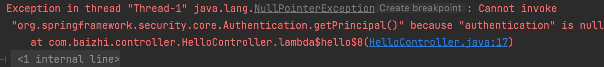

## 4、页面上获取用户信息(前后不分离)

1. 引入依赖

```xml
<dependency>
  <groupId>org.thymeleaf.extras</groupId>
  <artifactId>thymeleaf-extras-springsecurity5</artifactId>
  <version>3.0.4.RELEASE</version>
</dependency>
```

2. 页面加入命名空间

```html
<html lang="en" xmlns:th="https://www.thymeleaf.org" 
xmlns:sec="http://www.thymeleaf.org/extras/spring-security">
```

3. 页面中使用

```html
<!--获取认证用户名-->
<ul>
  <li sec:authentication="principal.username"></li>
  <li sec:authentication="principal.authorities"></li>
  <li sec:authentication="principal.accountNonExpired"></li>
  <li sec:authentication="principal.accountNonLocked"></li>
  <li sec:authentication="principal.credentialsNonExpired"></li>
</ul>
```


---

# 五、自定义数据源

## 1、认证流程分析

[官网地址](https://docs.spring.io/spring-security/reference/servlet/authentication/architecture.html)

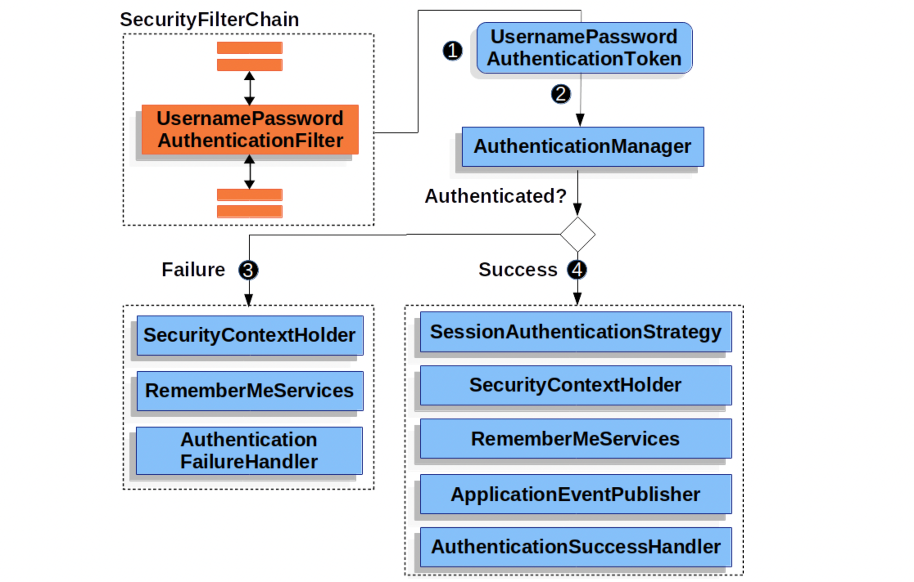

- 发起认证请求，请求中携带用户名、密码，该请求会被`UsernamePasswordAuthenticationFilter` 拦截
- 在`UsernamePasswordAuthenticationFilter`的`attemptAuthentication`方法中将请求中用户名和密码，封装为`Authentication`(UsernamePasswordAuthenticationToken)对象，并交给`AuthenticationManager` 进行认证
- 认证成功，将认证信息存储到 SecurityContextHodler 以及调用记住我等，并回调 `AuthenticationSuccessHandler` 处理
- 认证失败，清除 SecurityContextHodler 以及 记住我中信息，回调 `AuthenticationFailureHandler` 处理

## 2、三者关系

从上面分析中得知，AuthenticationManager 是认证的核心类，但实际上在底层真正认证时还离不开 ProviderManager 以及  AuthenticationProvider 。他们三者关系是样的呢？

- `AuthenticationManager` 是一个认证管理器，它定义了 Spring Security 过滤器要执行认证操作。
- `ProviderManager`是AuthenticationManager接口的实现类。Spring Security 认证时默认使用就是 ProviderManager。
- `AuthenticationProvider` 就是针对不同的身份类型执行的具体的身份认证。

**AuthenticationManager 与 ProviderManager**


​	ProviderManager 是 AuthenticationManager 的唯一实现，也是 Spring Security 默认使用实现。从这里不难看出默认情况下AuthenticationManager 就是一个ProviderManager。（其它的是内部类或者是私有类）

**ProviderManager 与 AuthenticationProvider**

摘自官方: https://docs.spring.io/spring-security/reference/servlet/authentication/architecture.html

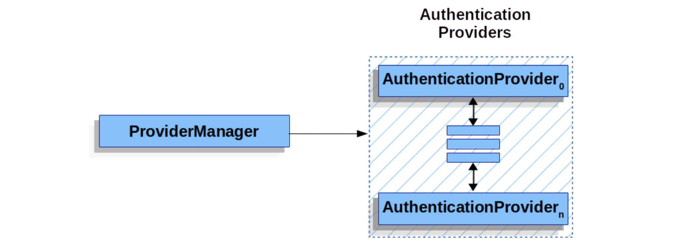

​	在 Spring Seourity 中，允许系统同时支持多种不同的认证方式，例如同时支持用户名/密码认证、ReremberMe 认证、手机号码动态认证等，而不同的认证方式对应了不同的 AuthenticationProvider，所以一个完整的认证流程可能由多个 AuthenticationProvider 来提供。

​	多个 AuthenticationProvider 将组成一个列表，这个列表将由 ProviderManager 代理。换句话说，在ProviderManager 中存在一个 AuthenticationProvider 列表，在Provider Manager 中遍历列表中的每一个 AuthenticationProvider 去执行身份认证，最终得到认证结果。

​	ProviderManager 本身也可以再配置一个 AuthenticationManager 作为 parent，这样当ProviderManager 认证失败之后，就可以进入到 parent 中再次进行认证。理论上来说，ProviderManager 的 parent 可以是任意类型的 AuthenticationManager，但是通常都是由ProviderManager 来扮演 parent 的角色，也就是 ProviderManager 是 ProviderManager 的 parent。

​	ProviderManager 本身也可以有多个，多个ProviderManager 共用同一个 parent。有时，一个应用程序有受保护资源的逻辑组（例如，所有符合路径模式的网络资源，如/api/**），每个组可以有自己的专用 AuthenticationManager。通常，每个组都是一个ProviderManager，它们共享一个父级。然后，父级是一种 ` 全局 `资源，作为所有提供者的后备资源。

根据上面的介绍，我们绘出新的 AuthenticationManager、ProvideManager 和 AuthentictionProvider 关系

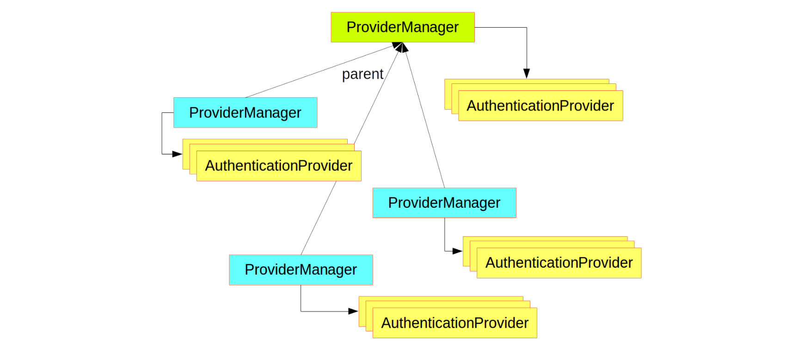

 弄清楚认证原理之后我们来看下具体认证时数据源的获取。默认情况下` AuthenticationProvider`  是由 `DaoAuthenticationProvider`类来实现认证的，在`DaoAuthenticationProvider` 认证时又通过 `UserDetailsService`完成数据源的校验。他们之间调用关系如下：


> **总结** 
>
> AuthenticationManager 是认证管理器，在 Spring Security 中有全局AuthenticationManager，也可以有局部AuthenticationManager。全局的AuthenticationManager用来对全局认证进行处理，局部的AuthenticationManager用来对某些特殊资源认证处理。当然无论是全局认证管理器还是局部认证管理器都是由 ProviderManger 进行实现。 每一个ProviderManger中都代理一个AuthenticationProvider的列表，列表中每一个实现代表一种身份认证方式。认证时底层数据源需要调用 UserDetailService 来实现。

## 3、配置全局 AuthenticationManager

### 1）默认的全局 AuthenticationManager

```java
@Configuration
public class WebSecurityConfigurer extends WebSecurityConfigurerAdapter {
  @Autowired
  public void initialize(AuthenticationManagerBuilder builder) {
    //builder..
  }
}
```

- springboot 对 security 进行自动配置时自动在工厂中创建一个全局AuthenticationManager

**总结**

1. 默认自动配置创建全局AuthenticationManager 默认找当前项目中是否存在自定义 UserDetailService 实例 自动将当前项目 UserDetailService 实例设置为数据源
2. 默认自动配置创建全局AuthenticationManager 在工厂中使用时直接在代码中注入即可

### 2）自定义全局 AuthenticationManager

```java
@Configuration
public class WebSecurityConfigurer extends WebSecurityConfigurerAdapter {
  @Override
  public void configure(AuthenticationManagerBuilder builder) {
  	//builder ....
  }
}
```

**总结**

一旦通过 configure 方法自定义 AuthenticationManager实现：

- 就会将工厂中自动配置AuthenticationManager 进行覆盖；
- 需要在实现中指定认证数据源对象 UserDetaiService 实例；
- 这种方式创建AuthenticationManager对象工厂内部本地一个 AuthenticationManager 对象 不允许在其他自定义组件中进行注入。（其它地方无法使用@Autowired的方式注入AuthenticationManager 实例）可以用下面的方法将AuthenticationManager暴露。

用来在工厂中暴露自定义AuthenticationManager 实例

```java
@Configuration
public class WebSecurityConfigurer extends WebSecurityConfigurerAdapter {
  
    //1.自定义AuthenticationManager  推荐  并没有在工厂中暴露出来
    @Override
    public void configure(AuthenticationManagerBuilder builder) throws Exception {
        System.out.println("自定义AuthenticationManager: " + builder);
        builder.userDetailsService(userDetailsService());
    }

    //作用: 用来将自定义AuthenticationManager在工厂中进行暴露,可以在任何位置注入
    @Override
    @Bean
    public AuthenticationManager authenticationManagerBean() throws Exception {
        return super.authenticationManagerBean();
    }
}

```

## 4、自定义数据源实战

### 1）自定义内存数据源

```java
@Configuration
public class WebSecurityConfigurer extends WebSecurityConfigurerAdapter {

    @Bean
    public UserDetailsService userDetailsService(){
        InMemoryUserDetailsManager inMemoryUserDetailsManager
                = new InMemoryUserDetailsManager();
        UserDetails u1 = User.withUsername("zhangs")
                .password("{noop}111").roles("USER").build();	//{noop}表示明文密码
        inMemoryUserDetailsManager.createUser(u1);
        return inMemoryUserDetailsManager;
    }

    @Override
    protected void configure(AuthenticationManagerBuilder auth) 
      throws Exception {
        auth.userDetailsService(userDetailsService());
    }  	
}
```

### 2）自定义数据库数据源

1. 设计表结构

   ```sql
   -- 用户表
   CREATE TABLE `user`
   (
       `id`                    int(11) NOT NULL AUTO_INCREMENT,
       `username`              varchar(32)  DEFAULT NULL,
       `password`              varchar(255) DEFAULT NULL,
       `enabled`               tinyint(1) DEFAULT NULL,
       `accountNonExpired`     tinyint(1) DEFAULT NULL,
       `accountNonLocked`      tinyint(1) DEFAULT NULL,
       `credentialsNonExpired` tinyint(1) DEFAULT NULL,
       PRIMARY KEY (`id`)
   ) ENGINE=InnoDB AUTO_INCREMENT=4 DEFAULT CHARSET=utf8;
   -- 角色表
   CREATE TABLE `role`
   (
       `id`      int(11) NOT NULL AUTO_INCREMENT,
       `name`    varchar(32) DEFAULT NULL,
       `name_zh` varchar(32) DEFAULT NULL,
       PRIMARY KEY (`id`)
   ) ENGINE=InnoDB AUTO_INCREMENT=4 DEFAULT CHARSET=utf8;
   -- 用户角色关系表
   CREATE TABLE `user_role`
   (
       `id`  int(11) NOT NULL AUTO_INCREMENT,
       `uid` int(11) DEFAULT NULL,
       `rid` int(11) DEFAULT NULL,
       PRIMARY KEY (`id`),
       KEY   `uid` (`uid`),
       KEY   `rid` (`rid`)
   ) ENGINE=InnoDB AUTO_INCREMENT=5 DEFAULT CHARSET=utf8;
   ```

2. 插入测试数据

   ```sql
   -- 插入用户数据
   BEGIN;
     INSERT INTO `user`
     VALUES (1, 'root', '{noop}123', 1, 1, 1, 1);
     INSERT INTO `user`
     VALUES (2, 'admin', '{noop}123', 1, 1, 1, 1);
     INSERT INTO `user`
     VALUES (3, 'blr', '{noop}123', 1, 1, 1, 1);
   COMMIT;
   -- 插入角色数据
   BEGIN;
     INSERT INTO `role`
     VALUES (1, 'ROLE_product', '商品管理员');
     INSERT INTO `role`
     VALUES (2, 'ROLE_admin', '系统管理员');
     INSERT INTO `role`
     VALUES (3, 'ROLE_user', '用户管理员');
   COMMIT;
   -- 插入用户角色数据
   BEGIN;
     INSERT INTO `user_role`
     VALUES (1, 1, 1);
     INSERT INTO `user_role`
     VALUES (2, 1, 2);
     INSERT INTO `user_role`
     VALUES (3, 2, 2);
     INSERT INTO `user_role`
     VALUES (4, 3, 3);
   COMMIT;
   ```

3. 项目中引入依赖

   ```xml
   <dependency>
     <groupId>org.mybatis.spring.boot</groupId>
     <artifactId>mybatis-spring-boot-starter</artifactId>
     <version>2.2.0</version>
   </dependency>
   <dependency>
     <groupId>mysql</groupId>
     <artifactId>mysql-connector-java</artifactId>
     <version>5.1.38</version>
   </dependency>
   <dependency>
     <groupId>com.alibaba</groupId>
     <artifactId>druid</artifactId>
     <version>1.2.7</version>
   </dependency>
   ```

4. 配置 springboot 配置文件

   ```properties
   # datasource
   spring.datasource.type=com.alibaba.druid.pool.DruidDataSource
   spring.datasource.driver-class-name=com.mysql.jdbc.Driver
   spring.datasource.url=jdbc:mysql://localhost:3306/security?characterEncoding=UTF-8&useSSL=false
   spring.datasource.username=root
   spring.datasource.password=root
   
   # mybatis
   mybatis.mapper-locations=classpath:com/baizhi/mapper/*.xml
   mybatis.type-aliases-package=com.baizhi.entity
   
   # log
   logging.level.com.baizhi=debug
   ```

5. 创建 entity

   - 创建 user 对象

     ```java
     public class User  implements UserDetails {
         private Integer id;
         private String username;
         private String password;
         private Boolean enabled;
         private Boolean accountNonExpired;
         private Boolean accountNonLocked;
         private Boolean credentialsNonExpired;
         private List<Role> roles = new ArrayList<>();
     
         @Override
         public Collection<? extends GrantedAuthority> getAuthorities() {
             List<GrantedAuthority> grantedAuthorities = new ArrayList<>();
             roles.forEach(role->grantedAuthorities.add(new SimpleGrantedAuthority(role.getName())));
             return grantedAuthorities;
         }
     
         @Override
         public String getPassword() {
             return password;
         }
     
         @Override
         public String getUsername() {
             return username;
         }
     
         @Override
         public boolean isAccountNonExpired() {
             return accountNonExpired;
         }
     
         @Override
         public boolean isAccountNonLocked() {
             return accountNonLocked;
         }
     
         @Override
         public boolean isCredentialsNonExpired() {
             return credentialsNonExpired;
         }
     
         @Override
         public boolean isEnabled() {
             return enabled;
         }
     		//get/set....
     }
     ```

   - 创建 role 对象

     ```java
     public class Role {
         private Integer id;
         private String name;
         private String nameZh;
       	//get set..
     }
     ```

6. 创建 UserDao 接口

   ```java
   @Mapper
   public interface UserDao {
       //根据用户名查询用户
       User loadUserByUsername(String username);
     	
     	//根据用户id查询角色
     	List<Role> getRolesByUid(Integer uid);
   }
   ```

7. 创建 UserMapper 实现

   ```xml
   <?xml version="1.0" encoding="UTF-8"?>
   <!DOCTYPE mapper PUBLIC "-//mybatis.org//DTD Mapper 3.0//EN" "http://mybatis.org/dtd/mybatis-3-mapper.dtd">
   <mapper namespace="com.baizhi.dao.UserDao">
       <!--查询单个-->
       <select id="loadUserByUsername" resultType="User">
           select id,
                  username,
                  password,
                  enabled,
                  accountNonExpired,
                  accountNonLocked,
                  credentialsNonExpired
           from user
           where username = #{username}
       </select>
   
       <!--查询指定行数据-->
       <select id="getRolesByUid" resultType="Role">
           select r.id,
                  r.name,
                  r.name_zh nameZh
           from role r,
                user_role ur
           where r.id = ur.rid
             and ur.uid = #{uid}
       </select>
   </mapper>
   ```

8. 创建 UserDetailService 实例

   ```java
   @Component
   public class MyUserDetailService implements UserDetailsService {
   
       private  final UserDao userDao;
   
       @Autowired
       public MyUserDetailService(UserDao userDao) {
           this.userDao = userDao;
       }
   
       @Override
       public UserDetails loadUserByUsername(String username) throws UsernameNotFoundException {
           User user = userDao.loadUserByUsername(username);
           if(ObjectUtils.isEmpty(user))throw new RuntimeException("用户不存在");
           user.setRoles(userDao.getRolesByUid(user.getId()));
           return user;
       }
   }
   ```

9. 配置 authenticationManager 使用自定义UserDetailService

   ```java
   @Configuration
   public class WebSecurityConfigurer extends WebSecurityConfigurerAdapter {
     
       private final UserDetailsService userDetailsService;
   
       @Autowired
       public WebSecurityConfigurer(UserDetailsService userDetailsService) {
           this.userDetailsService = userDetailsService;
       }
   
       @Override
       protected void configure(AuthenticationManagerBuilder builder) throws Exception {
           builder.userDetailsService(userDetailsService);
       }
     
     	
     	@Override
       protected void configure(HttpSecurity http) throws Exception {
         //web security..
       }
   }
   ```

10. 启动测试即可。


---

# 六、添加验证码验证

1. 引入依赖

```xml
<dependency>
  <groupId>com.github.penggle</groupId>
  <artifactId>kaptcha</artifactId>
  <version>2.3.2</version>
</dependency>
```

2. 配置验证码

```java
@Configuration
public class KaptchaConfig {
    @Bean
    public Producer kaptcha() {
        Properties properties = new Properties();
        properties.setProperty("kaptcha.image.width", "150");
        properties.setProperty("kaptcha.image.height", "50");
        properties.setProperty("kaptcha.textproducer.char.string", "0123456789");
        properties.setProperty("kaptcha.textproducer.char.length", "4");
        Config config = new Config(properties);
        DefaultKaptcha defaultKaptcha = new DefaultKaptcha();
        defaultKaptcha.setConfig(config);
        return defaultKaptcha;
    }
}
```

## 1、传统Web应用

1. 生成验证码 controller

```java
@Controller
public class KaptchaController {

    @Autowired
    private Producer producer;

    @GetMapping("/vc.jpg")
    public void getVerifyCode(HttpServletResponse response, HttpSession session) throws IOException{
        response.setContentType("image/png");
        String code = producer.createText();
        session.setAttribute("code",code);
        BufferedImage bi = producer.createImage(code);
        ServletOutputStream os = response.getOutputStream();
        ImageIO.write(bi,"jpg",os);
    }

}
```

2. 自定义验证码异常类

```java
public class KaptchaNotMatchException extends AuthenticationException {

    public KaptchaNotMatchException(String msg) {
        super(msg);
    }

    public KaptchaNotMatchException(String msg, Throwable throwable) {
        super(msg, throwable);
    }

}
```

3. 自定义filter验证验证码

```java
public class KaptchaFilter extends UsernamePasswordAuthenticationFilter {

    public static final String CODE = "code";

    private String code = CODE;

    public String getCode() {
        return code;
    }

    public void setCode(String code) {
        this.code = code;
    }

    @Override
    public Authentication attemptAuthentication(HttpServletRequest request, HttpServletResponse response) throws AuthenticationException {
        //1.判断是否是 post 方式
        if (!request.getMethod().equals("POST")) {
            throw new AuthenticationServiceException("Authentication method not supported: " + request.getMethod());
        }
         //2.获取验证码
        String code = request.getParameter(getCode());
        String sessionCode = (String) request.getSession().getAttribute("code");
        if (!ObjectUtils.isEmpty(code) && !ObjectUtils.isEmpty(sessionCode) && code.equalsIgnoreCase(sessionCode)) {
            return super.attemptAuthentication(request, response);
        }
        throw new KaptchaNotMatchException("验证码错误！");

    }
}
```

4. 放行以及配置验证码 filter

```java
@Configuration
public class WebSecurityConfigurer extends WebSecurityConfigurerAdapter {

    @Bean
    public UserDetailsService userDetailsService() {
        InMemoryUserDetailsManager inMemoryUserDetailsManager = new InMemoryUserDetailsManager();
        inMemoryUserDetailsManager.createUser(User.withUsername("user").password("{noop}123456").roles("admin").build());
        return inMemoryUserDetailsManager;
    }

    @Override
    protected void configure(AuthenticationManagerBuilder auth) throws Exception {
        auth.userDetailsService(userDetailsService());
    }

    @Override
    @Bean
    public AuthenticationManager authenticationManagerBean() throws Exception {
        return super.authenticationManagerBean();
    }

    @Bean
    public KaptchaFilter kaptchaFilter() throws Exception {
        KaptchaFilter kaptchaFilter = new KaptchaFilter();
        kaptchaFilter.setCode("code");
        kaptchaFilter.setAuthenticationManager(authenticationManagerBean());
        kaptchaFilter.setAuthenticationSuccessHandler((request, response, authentication) -> {
            Map<String, Object> result = new HashMap<String, Object>();
            result.put("msg", "登录成功");
            result.put("status", 200);
            response.setContentType("application/json;charset=UTF-8");
            String s = new ObjectMapper().writeValueAsString(result);
            response.getWriter().println(s);
        });
        kaptchaFilter.setAuthenticationFailureHandler((request, response, exception) -> {
            Map<String, Object> result = new HashMap<String, Object>();
            result.put("msg", "登录失败: " + exception.getMessage());
            result.put("status", 500);
            response.setContentType("application/json;charset=UTF-8");
            String s = new ObjectMapper().writeValueAsString(result);
            response.getWriter().println(s);
        });
        kaptchaFilter.setFilterProcessesUrl("/doLogin");
        kaptchaFilter.setUsernameParameter("uname");
        kaptchaFilter.setPasswordParameter("passwd");
        return kaptchaFilter;
    }

    @Override
    protected void configure(HttpSecurity http) throws Exception {
        http.authorizeRequests()
                .mvcMatchers("/vc.jpg", "/login.html").permitAll()
                .anyRequest().authenticated()
                .and()
                .formLogin()
                .loginPage("/login.html")
                .and()
                .logout()
                .logoutUrl("/logout")
                .and().csrf().disable();
        http.addFilterAt(kaptchaFilter(), UsernamePasswordAuthenticationFilter.class);
    }
}
```

5. 登录页面

```html
<!DOCTYPE html>
<html lang="en" xmlns:th="https://www.thymeleaf.org">
<head>
    <meta charset="UTF-8">
    <title>Title</title>
</head>
<body>
<form method="post" th:action="@{/doLogin}">
    用户名:<input name="uname" type="text"/><br>
    密码:<input name="passwd" type="password"/><br>
    验证码: <input name="code" type="text"/> <br>
    <input type="submit" value="登录"/>
</form>
</body>
</html>
```

## 2、前后端分离Web应用

1. 生成验证码

```java
@RestController
public class KaptchaController {
    private final Producer producer;

    @Autowired
    public KaptchaController(Producer producer) {
        this.producer = producer;
    }

    @GetMapping("/vc.png")
    public String getVerifyCode(HttpSession session) throws IOException {
        //1.生成验证码
        String code = producer.createText();
        session.setAttribute("kaptcha", code);//可以更换成 redis 实现
        BufferedImage bi = producer.createImage(code);
        //2.写入内存
        FastByteArrayOutputStream fos = new FastByteArrayOutputStream();
        ImageIO.write(bi, "png", fos);
        //3.生成 base64
        return Base64.encodeBase64String(fos.toByteArray());
    }
}
```

2. 定义验证码异常类

```java
public class KaptchaNotMatchException extends AuthenticationException {

    public KaptchaNotMatchException(String msg) {
        super(msg);
    }

    public KaptchaNotMatchException(String msg, Throwable cause) {
        super(msg, cause);
    }
}
```

3. 在自定义LoginKaptchaFilter中加入验证码验证

```java
//自定义 filter
public class LoginKaptchaFilter extends UsernamePasswordAuthenticationFilter {

    public static final String FORM_KAPTCHA_KEY = "kaptcha";

    private String kaptchaParameter = FORM_KAPTCHA_KEY;

    public String getKaptchaParameter() {
        return kaptchaParameter;
    }

    public void setKaptchaParameter(String kaptchaParameter) {
        this.kaptchaParameter = kaptchaParameter;
    }

    @Override
    public Authentication attemptAuthentication(HttpServletRequest request, HttpServletResponse response) throws AuthenticationException {
        if (!request.getMethod().equals("POST")) {
            throw new AuthenticationServiceException("Authentication method not supported: " + request.getMethod());
        }
        try {
            //1.获取请求数据
            Map<String, String> userInfo = new ObjectMapper().readValue(request.getInputStream(), Map.class);
            String kaptcha = userInfo.get(getKaptchaParameter());//用来获取数据中验证码
            String username = userInfo.get(getUsernameParameter());//用来接收用户名
            String password = userInfo.get(getPasswordParameter());//用来接收密码
            //2.获取 session 中验证码
            String sessionVerifyCode = (String) request.getSession().getAttribute("kaptcha");
            if (!ObjectUtils.isEmpty(kaptcha) && !ObjectUtils.isEmpty(sessionVerifyCode) &&
                    kaptcha.equalsIgnoreCase(sessionVerifyCode)) {
                //3.获取用户名 和密码认证
                UsernamePasswordAuthenticationToken authRequest = new UsernamePasswordAuthenticationToken(username, password);
                setDetails(request, authRequest);
                return this.getAuthenticationManager().authenticate(authRequest);
            }
        } catch (IOException e) {
            e.printStackTrace();
        }
        throw new KaptchaNotMatchException("验证码不匹配!");
    }
}
```

4. 配置

```java
@Configuration
public class SecurityConfig extends WebSecurityConfigurerAdapter {

    @Bean
    public UserDetailsService userDetailsService() {
        InMemoryUserDetailsManager inMemoryUserDetailsManager = new InMemoryUserDetailsManager();
        inMemoryUserDetailsManager.createUser(User.withUsername("root").password("{noop}123").roles("admin").build());
        return inMemoryUserDetailsManager;
    }

    @Override
    protected void configure(AuthenticationManagerBuilder auth) throws Exception {
        auth.userDetailsService(userDetailsService());
    }

    @Bean
    @Override
    public AuthenticationManager authenticationManagerBean() throws Exception {
        return super.authenticationManagerBean();
    }

    //配置
    @Bean
    public LoginKaptchaFilter loginKaptchaFilter() throws Exception {
        LoginKaptchaFilter loginKaptchaFilter = new LoginKaptchaFilter();
        //1.认证 url
        loginKaptchaFilter.setFilterProcessesUrl("/doLogin");
        //2.认证 接收参数
        loginKaptchaFilter.setUsernameParameter("uname");
        loginKaptchaFilter.setPasswordParameter("passwd");
        loginKaptchaFilter.setKaptchaParameter("kaptcha");
        //3.指定认证管理器
        loginKaptchaFilter.setAuthenticationManager(authenticationManagerBean());
        //4.指定成功时处理
        loginKaptchaFilter.setAuthenticationSuccessHandler((req, resp, authentication) -> {
            Map<String, Object> result = new HashMap<String, Object>();
            result.put("msg", "登录成功");
            result.put("用户信息", authentication.getPrincipal());
            resp.setContentType("application/json;charset=UTF-8");
            resp.setStatus(HttpStatus.OK.value());
            String s = new ObjectMapper().writeValueAsString(result);
            resp.getWriter().println(s);
        });
        //5.认证失败处理
        loginKaptchaFilter.setAuthenticationFailureHandler((req, resp, ex) -> {
            Map<String, Object> result = new HashMap<String, Object>();
            result.put("msg", "登录失败: " + ex.getMessage());
            resp.setStatus(HttpStatus.INTERNAL_SERVER_ERROR.value());
            resp.setContentType("application/json;charset=UTF-8");
            String s = new ObjectMapper().writeValueAsString(result);
            resp.getWriter().println(s);
        });
        return loginKaptchaFilter;
    }

    @Override
    protected void configure(HttpSecurity http) throws Exception {
        http.authorizeRequests()
                .mvcMatchers("/vc.png").permitAll()
                .anyRequest().authenticated()
                .and()
                .formLogin()
                .and()
                .exceptionHandling()
                .authenticationEntryPoint((req, resp, ex) -> {
                    resp.setContentType("application/json;charset=UTF-8");
                    resp.setStatus(HttpStatus.UNAUTHORIZED.value());
                    resp.getWriter().println("必须认证之后才能访问!");
                })
                .and()
                .logout()
                .and()
                .csrf().disable();

        http.addFilterAt(loginKaptchaFilter(), UsernamePasswordAuthenticationFilter.class);
    }

}
```


---

# 七、密码加密

## 1、加密意义

2011 年12月21 日，有人在网络上公开了一个包含600万个 CSDN 用户资料的数据库，数据全部为明文储存，包含用户名、密码以及注册邮箱。事件发生后 CSDN 在微博、官方网站等渠道发出了声明，解释说此数据库系2009 年备份所用，因不明原因泄漏，已经向警方报
案，后又在官网发出了公开道歉信。在接下来的十多天里，金山、网易、京东、当当、新浪等多家公司被卷入到这次事件中。整个事件中最触目惊心的莫过于 CSDN 把用户密码明文存储，由于很多用户是多个网站共用一个密码，因此一个网站密码泄漏就会造成很大的安全隐患。由于有了这么多前车之鉴，我们现在做系统时，密码都要加密处理。

在前面的案例中，凡是涉及密码的地方，我们都采用明文存储，在实际项目中这肯定是不可取的，因为这会带来极高的安全风险。在企业级应用中，密码不仅需要加密，还需要加`盐`，最大程度地保证密码安全。

## 2、常见方案

### 1）Hash算法

​		最早我们使用类似 SHA-256 、SHA-512 、MD5等这样的单向 Hash 算法。用户注册成功后，保存在数据库中不再是用户的明文密码，而是经过 SHA-256 加密计算的一个字行串，当用户进行登录时，用户输入的明文密码用 SHA-256 进行加密，加密完成之后，再和存储在数据库中的密码进行比对，进而确定用户登录信息是否有效。如果系统遭遇攻击，最多也只是存储在数据库中的密文被泄漏。

​		这样就绝对安全了吗？由于[彩虹表](https://baike.baidu.com/item/%E5%BD%A9%E8%99%B9%E8%A1%A8/689313?fr=aladdin)这种攻击方式的存在以及随着计算机硬件的发展，每秒执行数十亿次 HASH计算己经变得轻轻松松，这意味着即使给密码加密加盐也不再安全。

### 2）单向自适应函数

在Spring Security 中，我们现在是用一种自适应单向函数 (Adaptive One-way Functions)来处理密码问题，这种自适应单向函数在进行密码匹配时，会有**意占用大量系统资源**（例如CPU、内存等），这样可以增加恶意用户攻击系统的难度。在Spring Securiy 中，开发者可以通过 bcrypt、PBKDF2、sCrypt 以及 argon2 来体验这种自适应单向函数加密。由于自适应单向函数有意占用大量系统资源，因此每个登录认证请求都会大大降低应用程序的性能，但是 Spring Secuity 不会采取任何措施来提高密码验证速度，因为它正是通过这种方式来增强系统的安全性。

- **BCryptPasswordEncoder**

  BCryptPasswordEncoder 使用 bcrypt 算法对密码进行加密，为了提高密码的安全性，bcrypt算法故意降低运行速度，以增强密码破解的难度。同时 BCryptP asswordEncoder “为自己带盐”开发者不需要额外维护一个“盐” 字段，使用 BCryptPasswordEncoder 加密后的字符串就已经“带盐”了，即使相同的明文每次生成的加密字符串都不相同。

- **Argon2PasswordEncoder**

  Argon2PasswordEncoder 使用 Argon2 算法对密码进行加密，Argon2 曾在 Password Hashing Competition 竞赛中获胜。为了解决在定制硬件上密码容易被破解的问题，Argon2也是故意降低运算速度，同时需要大量内存，以确保系统的安全性。

- **Pbkdf2PasswordEncoder**

  Pbkdf2PasswordEncoder 使用 PBKDF2 算法对密码进行加密，和前面几种类似，PBKDF2

  算法也是一种故意降低运算速度的算法，当需要 FIPS (Federal Information Processing Standard,美国联邦信息处理标准）认证时，PBKDF2 算法是一个很好的选择。

- **SCryptPasswordEncoder**

  SCryptPasswordEncoder 使用scrypt 算法对密码进行加密，和前面的几种类似，serypt 也是一种故意降低运算速度的算法，而且需要大量内存。

## 3、PasswordEncode

通过对认证流程源码分析得知，实际密码比较是由PasswordEncoder完成的，因此只需要使用PasswordEncoder 不同实现就可以实现不同方式加密。

```java
public interface PasswordEncoder {
    
	String encode(CharSequence rawPassword);
    
	boolean matches(CharSequence rawPassword, String encodedPassword);
    
	default boolean upgradeEncoding(String encodedPassword) {
		return false;
	}
}
```

- encode 用来进行明文加密的
- matches 用来比较密码的方法
- upgradeEncoding 用来给密码进行升级的方法

默认提供加密算法如下：


## 4、DelegatingPasswordEncoder

根据上面 PasswordEncoder的介绍，可能会以为 Spring security 中默认的密码加密方案应该是四种自适应单向加密函数中的一种，其实不然，在 spring Security 5.0之后，默认的密码加密方案其实是 DelegatingPasswordEncoder。从名字上来看，DelegatingPaswordEncoder 是一个代理类，而并非一种全新的密码加密方案，DeleggtinePasswordEncoder 主要用来代理上面介绍的不同的密码加密方案。为什么采DelegatingPasswordEncoder 而不是某一个具体加密方式作为默认的密码加密方案呢？主要考虑了如下两方面的因素：

- 兼容性：使用 DelegatingPasswrordEncoder 可以帮助许多使用旧密码加密方式的系统顺利迁移到 Spring security 中，它允许在同一个系统中同时存在多种不同的密码加密方案。

- 便捷性：密码存储的最佳方案不可能一直不变，如果使用 DelegatingPasswordEncoder作为默认的密码加密方案，当需要修改加密方案时，只需要修改很小一部分代码就可以实现。

### 1）DelegatingPasswordEncoder源码

```java
public class DelegatingPasswordEncoder implements PasswordEncoder {
  ....
}
```

- encode 用来进行明文加密的
- matches 用来比较密码的方法
- upgradeEncoding 用来给密码进行升级的方法

### 2）PasswordEncoderFactories源码

```java
public class PasswordEncoderFactories {
	@SuppressWarnings("deprecation")
	public static PasswordEncoder createDelegatingPasswordEncoder() {
		String encodingId = "bcrypt";
		Map<String, PasswordEncoder> encoders = new HashMap<>();
		encoders.put(encodingId, new BCryptPasswordEncoder());
		encoders.put("ldap", new org.springframework.security.crypto.password.LdapShaPasswordEncoder());
		encoders.put("MD4", new org.springframework.security.crypto.password.Md4PasswordEncoder());
		encoders.put("MD5", new org.springframework.security.crypto.password.MessageDigestPasswordEncoder("MD5"));
		encoders.put("noop", org.springframework.security.crypto.password.NoOpPasswordEncoder.getInstance());
		encoders.put("pbkdf2", new Pbkdf2PasswordEncoder());
		encoders.put("scrypt", new SCryptPasswordEncoder());
		encoders.put("SHA-1", new org.springframework.security.crypto.password.MessageDigestPasswordEncoder("SHA-1"));
		encoders.put("SHA-256", new org.springframework.security.crypto.password.MessageDigestPasswordEncoder("SHA-256"));
		encoders.put("sha256", new org.springframework.security.crypto.password.StandardPasswordEncoder());
		encoders.put("argon2", new Argon2PasswordEncoder());

		return new DelegatingPasswordEncoder(encodingId, encoders);
	}

	private PasswordEncoderFactories() {}
}
```

## 5、如何使用PasswordEncoder

- 查看WebSecurityConfigurerAdapter类中源码

```java
static class LazyPasswordEncoder implements PasswordEncoder {
    private ApplicationContext applicationContext;
    private PasswordEncoder passwordEncoder;

    LazyPasswordEncoder(ApplicationContext applicationContext) {
        this.applicationContext = applicationContext;
    }

    @Override
    public String encode(CharSequence rawPassword) {
        return getPasswordEncoder().encode(rawPassword);
    }

    @Override
    public boolean matches(CharSequence rawPassword,
                           String encodedPassword) {
        return getPasswordEncoder().matches(rawPassword, encodedPassword);
    }

    @Override
    public boolean upgradeEncoding(String encodedPassword) {
        return getPasswordEncoder().upgradeEncoding(encodedPassword);
    }

    private PasswordEncoder getPasswordEncoder() {
        if (this.passwordEncoder != null) {
            return this.passwordEncoder;
        }
        PasswordEncoder passwordEncoder = getBeanOrNull(PasswordEncoder.class);
        if (passwordEncoder == null) {
            passwordEncoder = PasswordEncoderFactories.createDelegatingPasswordEncoder();
        }
        this.passwordEncoder = passwordEncoder;
        return passwordEncoder;
    }

    private <T> T getBeanOrNull(Class<T> type) {
        try {
            return this.applicationContext.getBean(type);
        } catch(NoSuchBeanDefinitionException notFound) {
            return null;
        }
    }

    @Override
    public String toString() {
        return getPasswordEncoder().toString();
    }
}
```

通过源码分析得知如果在工厂中指定了PasswordEncoder，就会使用指定PasswordEncoder，否则就会使用默认DelegatingPasswordEncoder。

## 6、实战

### 1）固定加密方案

```java
@Configuration
public class SecurityConfig extends WebSecurityConfigurerAdapter {
     @Bean
     public PasswordEncoder BcryptPasswordEncoder() {
         return new BCryptPasswordEncoder();
     }
  	 @Bean
    public UserDetailsService userDetailsService() {
        InMemoryUserDetailsManager inMemoryUserDetailsManager = new InMemoryUserDetailsManager();
        inMemoryUserDetailsManager.createUser(User.withUsername("root").password("$2a$10$WGFkRsZC0kzafTKOPcWONeLvNvg2jqd3U09qd5gjJGSHE5b0yoy6a").roles("xxx").build());
        return inMemoryUserDetailsManager;
    }
}
```

### 2）灵活加密方案

```java
@Configuration
public class SecurityConfig extends WebSecurityConfigurerAdapter {
  	 @Bean
    public UserDetailsService userDetailsService() {
        InMemoryUserDetailsManager inMemoryUserDetailsManager = new InMemoryUserDetailsManager();
        inMemoryUserDetailsManager.createUser(User.withUsername("root").password("{bcrypt}$2a$10$WGFkRsZC0kzafTKOPcWONeLvNvg2jqd3U09qd5gjJGSHE5b0yoy6a").roles("xxx").build());
        return inMemoryUserDetailsManager;
    }
}
```

## 7、密码自动加密实战

推荐使用DelegatingPasswordEncoder 的另外一个好处就是自动进行密码加密方案的升级，这个功能在整合一些老的系统时非常有用。

方法：让我们自定义的MyUserDetailService除了实现UserDetailsService接口外，并且实现UserDetailsPasswordService，重写其中的方法`updatePassword`来实现密码的自动升级。

1. 准备库

```sql
-- 用户表
CREATE TABLE `user`
(
    `id`                    int(11) NOT NULL AUTO_INCREMENT,
    `username`              varchar(32)  DEFAULT NULL,
    `password`              varchar(255) DEFAULT NULL,
    `enabled`               tinyint(1) DEFAULT NULL,
    `accountNonExpired`     tinyint(1) DEFAULT NULL,
    `accountNonLocked`      tinyint(1) DEFAULT NULL,
    `credentialsNonExpired` tinyint(1) DEFAULT NULL,
    PRIMARY KEY (`id`)
) ENGINE=InnoDB AUTO_INCREMENT=4 DEFAULT CHARSET=utf8;
-- 角色表
CREATE TABLE `role`
(
    `id`      int(11) NOT NULL AUTO_INCREMENT,
    `name`    varchar(32) DEFAULT NULL,
    `name_zh` varchar(32) DEFAULT NULL,
    PRIMARY KEY (`id`)
) ENGINE=InnoDB AUTO_INCREMENT=4 DEFAULT CHARSET=utf8;
-- 用户角色关系表
CREATE TABLE `user_role`
(
    `id`  int(11) NOT NULL AUTO_INCREMENT,
    `uid` int(11) DEFAULT NULL,
    `rid` int(11) DEFAULT NULL,
    PRIMARY KEY (`id`),
    KEY   `uid` (`uid`),
    KEY   `rid` (`rid`)
) ENGINE=InnoDB AUTO_INCREMENT=5 DEFAULT CHARSET=utf8;
```

2. 插入数据

```sql
-- 插入用户数据
BEGIN;
  INSERT INTO `user`
  VALUES (1, 'root', '{noop}123', 1, 1, 1, 1);
  INSERT INTO `user`
  VALUES (2, 'admin', '{noop}123', 1, 1, 1, 1);
  INSERT INTO `user`
  VALUES (3, 'blr', '{noop}123', 1, 1, 1, 1);
COMMIT;
-- 插入角色数据
BEGIN;
  INSERT INTO `role`
  VALUES (1, 'ROLE_product', '商品管理员');
  INSERT INTO `role`
  VALUES (2, 'ROLE_admin', '系统管理员');
  INSERT INTO `role`
  VALUES (3, 'ROLE_user', '用户管理员');
COMMIT;
-- 插入用户角色数据
BEGIN;
  INSERT INTO `user_role`
  VALUES (1, 1, 1);
  INSERT INTO `user_role`
  VALUES (2, 1, 2);
  INSERT INTO `user_role`
  VALUES (3, 2, 2);
  INSERT INTO `user_role`
  VALUES (4, 3, 3);
COMMIT;
```

3. 整合MyBatis

```xml
<dependency>
    <groupId>mysql</groupId>
    <artifactId>mysql-connector-java</artifactId>
    <version>5.1.38</version>
</dependency>

<dependency>
  <groupId>org.mybatis.spring.boot</groupId>
  <artifactId>mybatis-spring-boot-starter</artifactId>
  <version>2.2.0</version>
</dependency>

<dependency>
  <groupId>com.alibaba</groupId>
  <artifactId>druid</artifactId>
  <version>1.2.8</version>
</dependency>
```

4. 配置application文件

```properties
spring.datasource.type=com.alibaba.druid.pool.DruidDataSource
spring.datasource.driver-class-name=com.mysql.jdbc.Driver
spring.datasource.url=jdbc:mysql://localhost:3306/security?characterEncoding=UTF-8&serverTimezone=UTC&useSSL=false
spring.datasource.username=root
spring.datasource.password=root
mybatis.mapper-locations=classpath:/mapper/*.xml
mybatis.type-aliases-package=com.baizhi.entity
logging.level.com.baizhi.dao=debug
```

5. 编写实体类User

```java
public class User implements UserDetails {
    private Integer id;
    private String username;
    private String password;
    private Boolean enabled;
    private Boolean accountNonExpired;
    private Boolean accountNonLocked;
    private Boolean credentialsNonExpired;
    private List<Role> roles = new ArrayList<>();
    @Override
    public Collection<? extends GrantedAuthority> getAuthorities() {
        List<SimpleGrantedAuthority> authorities = new ArrayList<>();
        for (Role role : roles) {
            authorities.add(new SimpleGrantedAuthority(role.getName()));
        }
        return authorities;
    }

    @Override
    public String getPassword() {
        return password;
    }

    public void setPassword(String password) {
        this.password = password;
    }

    @Override
    public String getUsername() {
        return username;
    }

    public void setUsername(String username) {
        this.username = username;
    }

    @Override
    public boolean isAccountNonExpired() {
        return accountNonExpired;
    }

    public void setAccountNonExpired(Boolean accountNonExpired) {
        this.accountNonExpired = accountNonExpired;
    }

    @Override
    public boolean isAccountNonLocked() {
        return accountNonLocked;
    }

    public void setAccountNonLocked(Boolean accountNonLocked) {
        this.accountNonLocked = accountNonLocked;
    }

    @Override
    public boolean isCredentialsNonExpired() {
        return credentialsNonExpired;
    }

    public void setCredentialsNonExpired(Boolean credentialsNonExpired) {
        this.credentialsNonExpired = credentialsNonExpired;
    }

    @Override
    public boolean isEnabled() {
        return enabled;
    }

    public void setEnabled(Boolean enabled) {
        this.enabled = enabled;
    }

    public void setRoles(List<Role> roles) {
        this.roles = roles;
    }

    public Integer getId() {
        return id;
    }

    public void setId(Integer id) {
        this.id = id;
    }
}
```

6. 编写实体类Role

```java
public class Role {
    private Integer id;
    private String name;
    private String nameZh;

    public Integer getId() {
        return id;
    }

    public void setId(Integer id) {
        this.id = id;
    }

    public String getName() {
        return name;
    }

    public void setName(String name) {
        this.name = name;
    }

    public String getNameZh() {
        return nameZh;
    }

    public void setNameZh(String nameZh) {
        this.nameZh = nameZh;
    }
}
```

7. 创建dao

```java
@Mapper
public interface UserDao {
    List<Role> getRolesByUid(Integer uid);
    User loadUserByUsername(String username);
  	Integer updatePassword(@Param("username") String username,@Param("password") String password);
}
```

8. 编写mapper

```xml
<!DOCTYPE mapper
        PUBLIC "-//mybatis.org//DTD Mapper 3.0//EN"
        "http://mybatis.org/dtd/mybatis-3-mapper.dtd">
<mapper namespace="com.baizhi.dao.UserDao">


    <select id="loadUserByUsername" resultType="User">
        select id,
               username,
               password,
               enabled,
               accountNonExpired,
               accountNonLocked,
               credentialsNonExpired
        from `user`
        where username = #{username}
    </select>


    <select id="getRolesByUid" resultType="Role">
        select r.id,
               r.name,
               r.name_zh nameZh
        from `role` r,
             `user_role` ur
        where r.id = ur.rid
          and ur.uid = #{uid}
    </select>
  
  	<update id="updatePassword">
      update `user` set password=#{password}
      where username=#{username}
  	</update>

</mapper>
```

9. 编写service实现

```java
@Service
public class MyUserDetailService implements UserDetailsService,UserDetailsPasswordService {
    private final UserDao userDao;

    @Autowired
    public MyUserDetailService(UserDao userDao) {
        this.userDao = userDao;
    }

    @Override
    public UserDetails loadUserByUsername(String username) throws UsernameNotFoundException {
        User user = userDao.loadUserByUsername(username);
        if (ObjectUtils.isEmpty(user)) {
            throw new RuntimeException("用户不存在!");
        }
        user.setRoles(userDao.getRolesByUid(user.getId()));
        return user;
    }
  
  	 @Override
    public UserDetails updatePassword(UserDetails user, String newPassword) {
        Integer result = userDao.updatePassword(user.getUsername(), newPassword);
        if (result == 1) {
            ((User) user).setPassword(newPassword);
        }
        return user;
    }
}
```

10. 配置securityconfig

```java
@Configuration
public class SecurityConfig extends WebSecurityConfigurerAdapter {


    private final MyUserDetailService myUserDetailService;

    @Autowired
    public SecurityConfig(MyUserDetailService myUserDetailService) {
        this.myUserDetailService = myUserDetailService;
    }
      @Override
    protected void configure(AuthenticationManagerBuilder auth) throws Exception {
        //查询数据库
        auth.userDetailsService(myUserDetailService);
    }

}
```

11. 启动项目测试。


---

# 八、RememberMe

## 1、简介

传统的登录方式基于 Session会话，一旦用户的会话超时过期，就要再次登录，这样太过于烦琐。如果能有一种机制，让用户会话过期之后，还能继续保持认证状态，就会方便很多，RememberMe 就是为了解决这一需求而生的。

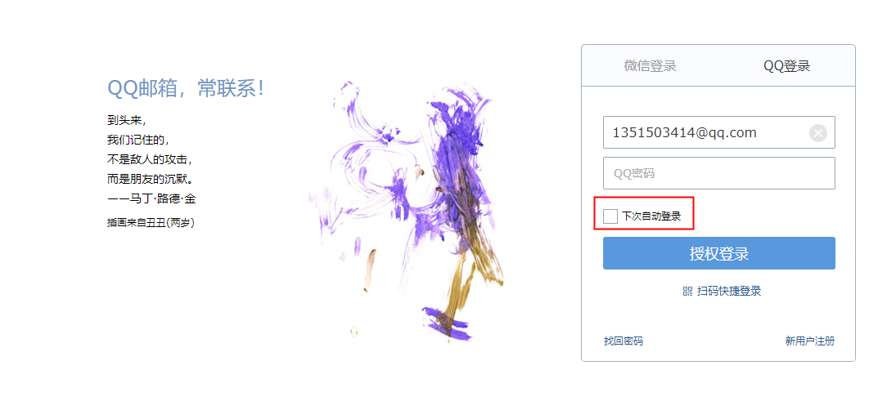

具体的实现思路就是通过 Cookie 来记录当前用户身份。当用户登录成功之后，会通过一定算法，将用户信息、时间戳等进行加密，加密完成后，通过响应头带回前端存储在cookie中，当浏览器会话过期之后，如果再次访问该网站，会自动将 Cookie 中的信息发送给服务器，服务器对 Cookie中的信息进行校验分析，进而确定出用户的身份，Cookie中所保存的用户信息也是有时效的，例如三天、一周等。

## 2、基本使用

### 1）开启记住我

```java
@Configuration
public class SecurityConfig extends WebSecurityConfigurerAdapter {
    //....
    @Override
    protected void configure(HttpSecurity http) throws Exception {
        http.authorizeRequests()
                .mvcMatchers("/login.html").permitAll()
                .anyRequest().authenticated()
                .and()
                .formLogin()
                //...
                .and()
                .rememberMe() //开启记住我功能
                .and()
                .csrf().disable();
    }
}
```

### 2）使用记住我

可以看到一旦打开了记住我功能，登录页面中会多出一个 RememberMe 选项。


### 3）测试记住我

登录时勾选 RememberMe 选项，然后重启服务端之后，在测试接口是否能免登录访问。

可以在`application.properties`文件中修改会话过期的时间：

```properties
server.servlet.session.timeout = 1		# 1分钟过期，默认是30分钟过期
```

## 3、原理分析

### 1）RememberMeAuthenticationFilter

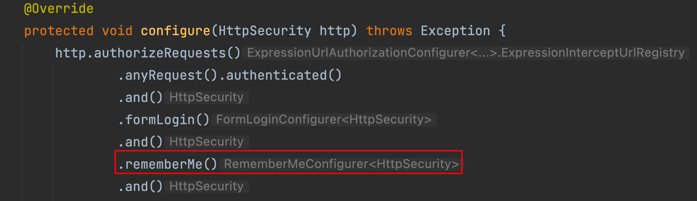

从上图中，当在SecurityConfig配置中开启了"记住我"功能之后,在进行认证时如果勾选了"记住我"选项，此时打开浏览器控制台，分析整个登录过程。首先当我们登录时，在登录请求中多了一个 RememberMe 的参数。


很显然，这个参数就是告诉服务器应该开启 RememberMe功能的。如果自定义登录页面开启 RememberMe 功能应该多加入一个一样的请求参数就可以啦。该请求会被 `RememberMeAuthenticationFilter`进行拦截然后自动登录具体参见源码：


1. 请求到达过滤器之后，首先判断 SecurityContextHolder 中是否有值，没值的话表示用户尚未登录（或会话已过期），此时调用 autoLogin 方法进行自动登录。
2. 当自动登录成功后返回的rememberMeAuth 不为null 时，表示自动登录成功，此时调用 authenticate 方法对 key 进行校验，并且将登录成功的用户信息保存到 SecurityContextHolder 对象中，然后调用登录成功回调，并发布登录成功事件。需要注意的是，登录成功的回调并不包含 RememberMeServices 中的 loginSuccess 方法。
3. 如果自动登录失败，则调用 remenberMeServices.loginFail方法处理登录失败回调。onUnsuccessfulAuthentication 和 onSuccessfulAuthentication 都是该过滤器中定义的空方法，并没有任何实现这就是 RememberMeAuthenticationFilter 过滤器所做的事情，成功将 RememberMeServices的服务集成进来。

### 2）RememberMeServices

这里一共定义了三个方法：

1. autoLogin 方法可以从请求中提取出需要的参数，完成自动登录功能。
2. loginFail 方法是自动登录失败的回调。
3. 1oginSuccess 方法是自动登录成功的回调。


### 3）TokenBasedRememberMeServices

在开启记住我后如果没有加入额外配置默认实现就是由TokenBasedRememberMeServices进行的实现。查看这个类源码中 processAutoLoginCookie 方法实现：

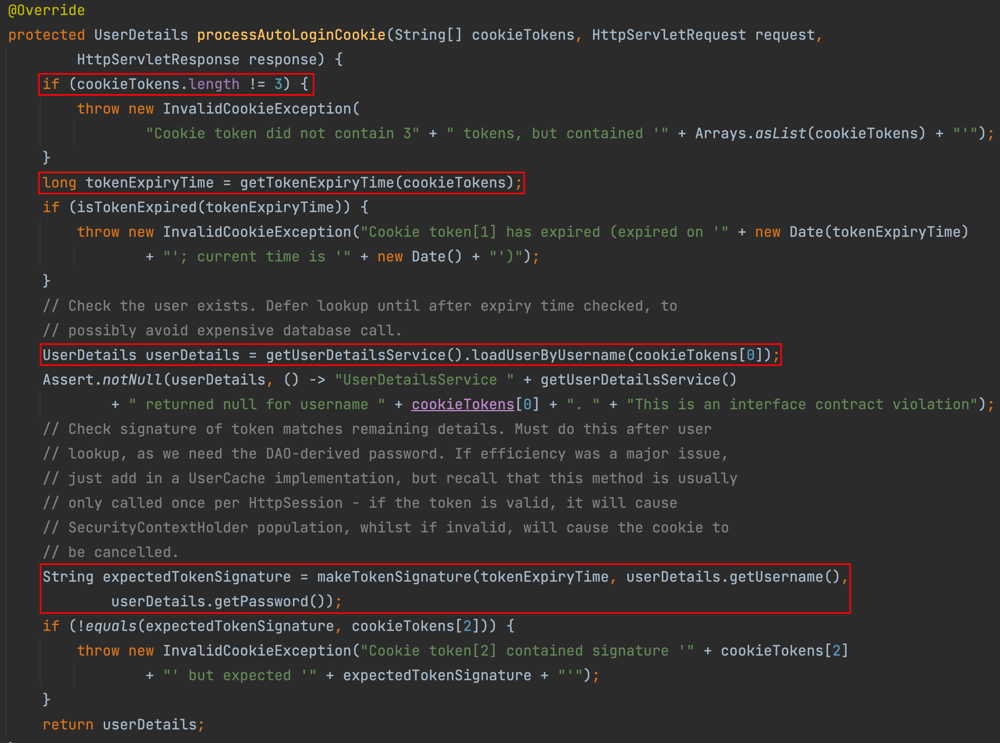

processAutoLoginCookie 方法主要用来验证 Cookie 中的令牌信息是否合法：

1. 首先判断 cookieTokens 长度是否为3，不为3说明格式不对，则直接抛出异常。

2. 从cookieTokens 数组中提取出第 1项，也就是过期时间，判断令牌是否过期，如果己经过期，则拋出异常。
3. 根据用户名 （cookieTokens 数组的第1项）查询出当前用户对象。
4. 调用 makeTokenSignature 方法生成一个签名，签名的生成过程如下：首先将用户名、令牌过期时间、用户密码以及 key 组成一个宇符串，中间用“：”隔开，然后通过 MD5 消息摘要算法对该宇符串进行加密，并将加密结果转为一个字符串返回。
5. 判断第4 步生成的签名和通过 Cookie 传来的签名是否相等（即 cookieTokens 数组的第2项），如果相等，表示令牌合法，则直接返回用户对象，否则拋出异常。

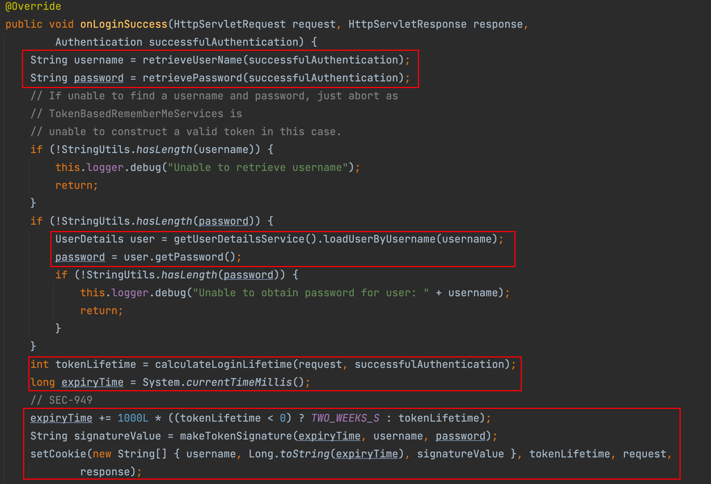

1. 在这个回调中，首先获取用户名和密码信息，如果用户密码在用户登录成功后从successfulAuthentication对象中擦除，则从数据库中重新加载出用户密码。

2. 计算出令牌的过期时间，令牌默认有效期是两周。
3. 根据令牌的过期时间、用户名以及用户密码，计算出一个签名。
4. 调用 setCookie 方法设置 Cookie， 第一个参数是一个数组，数组中一共包含三项。用户名、过期时间以及签名，在setCookie 方法中会将数组转为字符串，并进行 Base64编码后响应给前端。

### 4）总结

当用户通过用户名/密码的形式登录成功后，系统会根据用户的用户名、密码以及令牌的过期时间计算出一个签名，这个签名使用 MD5 消息摘要算法生成，是不可逆的。然后再将用户名、令牌过期时间以及签名拼接成一个字符串，中间用“:” 隔开，对拼接好的字符串进行Base64 编码，然后将编码后的结果返回到前端，也就是我们在浏览器中看到的令牌。当会话过期之后，访问系统资源时会自动携带上Cookie中的令牌，服务端拿到 Cookie中的令牌后，先进行 Bae64解码，解码后分别提取出令牌中的三项数据：接着根据令牌中的数据判断令牌是否已经过期，如果没有过期，则根据令牌中的用户名查询出用户信息：接着再计算出一个签名和令牌中的签名进行对比，如果一致，表示会牌是合法令牌，自动登录成功，否则自动登录失败。


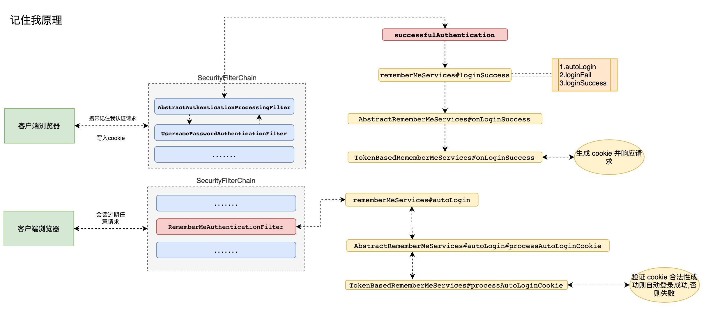

## 4、内存令牌PersistentTokenBasedRememberMeServices

区别于TokenBasedRememberMeServices，PersistentTokenBasedRememberMeServices会在每次使用记住我自动登陆后刷新令牌。

### 1）原理

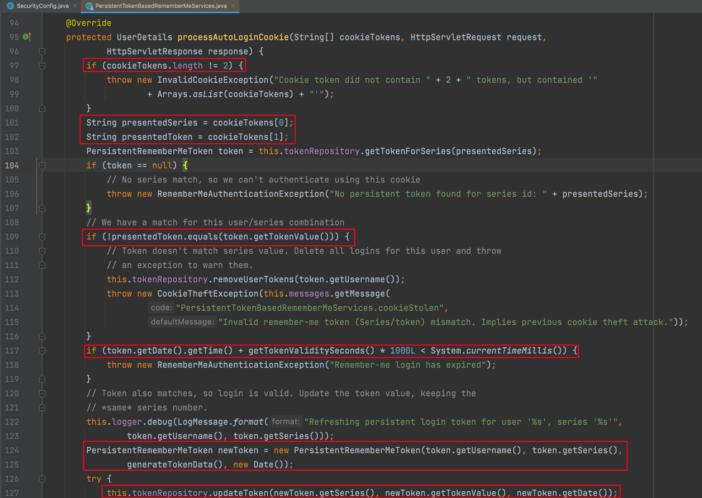

1. 不同于 TokonBasedRemornberMeServices 中的 processAutologinCookie 方法，这里cookieTokens 数组的长度为2，第一项是series，第二项是 token。
2. 从cookieTokens数组中分到提取出 series 和 token． 然后根据 series 去内存中查询出一个 PersistentRememberMeToken对象。如果查询出来的对象为null，表示内存中并没有series对应的值，本次自动登录失败。如果查询出来的 token 和从 cookieTokens 中解析出来的token不相同，说明自动登录会牌已经泄漏（恶意用户利用令牌登录后，内存中的token变了)，此时移除当前用户的所有自动登录记录并抛出异常。
3. 根据数据库中查询出来的结果判断令牌是否过期，如果过期就抛出异常。
4. 生成一个新的 PersistentRememberMeToken 对象，用户名和series 不变，token 重新
   生成，date 也使用当前时间。newToken 生成后，根据 series 去修改内存中的 token 和 date(即每次自动登录后都会产生新的 token 和 date）
5. 调用 addCookie 方法添加 Cookie， 在addCookie 方法中，会调用到我们前面所说的
   setCookie 方法，但是要注意第一个数组参数中只有两项：series 和 token（即返回到前端的令牌是通过对 series 和 token 进行 Base64 编码得到的）
6. 最后将根据用户名查询用户对象并返回。

### 2）具体实现

```java
@Override
protected void configure(HttpSecurity http) throws Exception {
    http.authorizeRequests().anyRequest().authenticated()
        .and()
        .formLogin()
        .and()
        .rememberMe()
        .rememberMeServices(rememberMeServices())
        .and()
        .csrf()
        .disable();
}

@Bean
public RememberMeServices rememberMeServices(){
    return new PersistentTokenBasedRememberMeServices(
        UUID.randomUUID().toString(),       //参数 1: 自定义一个生成令牌 key 默认 UUID
        userDetailsService(),               //参数 2:认证数据源
        new InMemoryTokenRepositoryImpl()); //参数 3:令牌存储方式
}
```

## 5、持久化令牌

使用持久化令牌将令牌保存到数据库中，当服务器出现宕机恢复的时候也能使用到之前保存好的令牌。

1. 引入依赖

```xml
<dependency>
  <groupId>com.alibaba</groupId>
  <artifactId>druid</artifactId>
  <version>1.2.8</version>
</dependency>

<dependency>
  <groupId>mysql</groupId>
  <artifactId>mysql-connector-java</artifactId>
  <version>5.1.38</version>
</dependency>

<dependency>
  <groupId>org.mybatis.spring.boot</groupId>
  <artifactId>mybatis-spring-boot-starter</artifactId>
  <version>2.2.0</version>
</dependency>
```

2. 配置数据源

```properties
spring.thymeleaf.cache=false
spring.datasource.type=com.alibaba.druid.pool.DruidDataSource
spring.datasource.driver-class-name=com.mysql.jdbc.Driver
spring.datasource.url=jdbc:mysql://localhost:3306/security?characterEncoding=UTF-8
spring.datasource.username=root
spring.datasource.password=root
mybatis.mapper-locations=classpath:mapper/*.xml
mybatis.type-aliases-package=com.entity
```

3. 配置持久化令牌

方式一：配置`rememberMeServices`

（需要在数据库中创建对应的表，表结构可在`JdbcTokenRepositoryImpl`中查看）

```java
@Autowired
    private DataSource source;

    //…………配置数据源

    @Override
    protected void configure(HttpSecurity http) throws Exception {
        http.authorizeRequests().anyRequest().authenticated()
                .and()
                .formLogin()
                .and()
                .rememberMe()
                .rememberMeServices(rememberMeServices())
                .and()
                .csrf()
                .disable();
    }

    @Bean
    public RememberMeServices rememberMeServices(){
        JdbcTokenRepositoryImpl jdbcTokenRepository = new JdbcTokenRepositoryImpl();
        jdbcTokenRepository.setDataSource(source);
        return new PersistentTokenBasedRememberMeServices(
                UUID.randomUUID().toString(),
                userDetailsService(),
                jdbcTokenRepository);
    }
```

方式二：配置`tokenRepository`

```java
@Override
protected void configure(HttpSecurity http) throws Exception {
    http.authorizeRequests().anyRequest().authenticated()
        .and()
        .formLogin()
        .and()
        .rememberMe()
        .tokenRepository(persistentTokenRepository())
        .and()
        .csrf()
        .disable();
}

@Bean
public PersistentTokenRepository persistentTokenRepository(){
    JdbcTokenRepositoryImpl jdbcTokenRepository = new JdbcTokenRepositoryImpl();
    jdbcTokenRepository.setCreateTableOnStartup(true);         //只需要没有表时设置为 true
    jdbcTokenRepository.setDataSource(source);
    return  jdbcTokenRepository;
}
```

## 6、实战

### 1）传统项目

通过源码分析得知必须在认证请求中加入参数remember-me值为"true,on,yes,1"其中任意一个才可以完成记住我功能,这个时候修改认证界面：

```html
<!DOCTYPE html>
<html lang="en">
<head>
    <meta charset="UTF-8">
    <title>登录</title>
</head>
    <body>
    	<h1>用户登录</h1>
        <form method="post" th:action="@{/doLogin}">
            用户名:<input name="uname" type="text"/><br>
            密码:<input name="passwd" type="password"/><br>
            记住我: <input type="checkbox" name="remember-me" value="on|yes|true|1"/><br>
            <input type="submit" value="登录"/>
        </form>
    </body>
</html>
```

配置中开启记住我

```java
@Override
protected void configure(HttpSecurity http) throws Exception {
    http.authorizeRequests()
        .mvcMatchers("/login.html").permitAll()
        .anyRequest().authenticated()
        .and()
        .formLogin()
        .loginPage("/login.html")
        .loginProcessingUrl("/doLogin")
        .defaultSuccessUrl("/", true)
        .and()
        .rememberMe()
        .rememberMeServices(rememberMeServices())
        .and()
        .csrf().disable();
}
```


### 2）分离项目

1. 自定义`Filter`：

```java
public class LoginFilter extends UsernamePasswordAuthenticationFilter {

    @Override
    public Authentication attemptAuthentication(HttpServletRequest request, HttpServletResponse response) throws AuthenticationException {
        System.out.println("===============================");
        if (!request.getMethod().equals("POST")) {
            throw new AuthenticationServiceException("Authentication method not supported: " + request.getMethod());
        }
        if (request.getContentType().equalsIgnoreCase(MediaType.APPLICATION_JSON_VALUE)) {
            try {
                Map<String, String> userInfo = new ObjectMapper().readValue(request.getInputStream(), Map.class);
                String username = userInfo.get(getUsernameParameter());
                String password = userInfo.get(getPasswordParameter());
                String rememberValue = userInfo.get(AbstractRememberMeServices.DEFAULT_PARAMETER);
                if (!ObjectUtils.isEmpty(rememberValue)) {
                    request.setAttribute(AbstractRememberMeServices.DEFAULT_PARAMETER, rememberValue);
                }
                System.out.println("用户名: " + username + " 密码: " + password + " 是否记住我: " + rememberValue);
                UsernamePasswordAuthenticationToken authenticationToken = new UsernamePasswordAuthenticationToken(username, password);
                setDetails(request, authenticationToken);
                return this.getAuthenticationManager().authenticate(authenticationToken);
            } catch (IOException e) {
                e.printStackTrace();
            }
        }
        return super.attemptAuthentication(request, response);
    }
}
```

2. 自定义`RememberMeService`：

```java
/**
 * 自定义记住我 services 实现类
 */
public class MyPersistentTokenBasedRememberMeServices extends PersistentTokenBasedRememberMeServices {
    public MyPersistentTokenBasedRememberMeServices(String key, UserDetailsService userDetailsService, PersistentTokenRepository tokenRepository) {
        super(key, userDetailsService, tokenRepository);
    }
    /**
     * 自定义前后端分离获取 remember-me 方式
     */
    @Override
    protected boolean rememberMeRequested(HttpServletRequest request, String parameter) {
        String paramValue = request.getAttribute(parameter).toString();
        if (paramValue != null) {
            if (paramValue.equalsIgnoreCase("true") || paramValue.equalsIgnoreCase("on")
                    || paramValue.equalsIgnoreCase("yes") || paramValue.equals("1")) {
                return true;
            }
        }
        return false;
    }
}
```

3. 完成配置`SecurityConfig`：

```java
@Configuration
public class SecurityConfig extends WebSecurityConfigurerAdapter {

    @Bean
    public UserDetailsService userDetailsService() {
        InMemoryUserDetailsManager manager = new InMemoryUserDetailsManager();
        manager.createUser(User.withUsername("root").password("{noop}123456").roles("admin", "root").build());
        return manager;
    }

    @Override
    protected void configure(AuthenticationManagerBuilder auth) throws Exception {
        auth.userDetailsService(userDetailsService());
    }

    @Bean
    @Override
    public AuthenticationManager authenticationManagerBean() throws Exception {
        return super.authenticationManagerBean();
    }

    @Bean
    public RememberMeServices rememberMeServices(){
        return new MyRememberMeService(UUID.randomUUID().toString(),userDetailsService(),new InMemoryTokenRepositoryImpl());
    }

    //自定义 filter 交给工厂管理
    @Bean
    public LoginFilter loginFilter() throws Exception{
        LoginFilter loginFilter = new LoginFilter();
        loginFilter.setFilterProcessesUrl("/doLogin");
        loginFilter.setUsernameParameter("uname");
        loginFilter.setPasswordParameter("passwd");
        loginFilter.setAuthenticationManager(authenticationManagerBean());
        loginFilter.setRememberMeServices(rememberMeServices());
        //认证成功处理
        loginFilter.setAuthenticationSuccessHandler(((request, response, authentication) -> {
            Map<String, Object> result = new HashMap<String, Object>();
            result.put("msg", "登录成功");
            result.put("用户信息", authentication.getPrincipal());
            response.setContentType("application/json;charset=UTF-8");
            response.setStatus(HttpStatus.OK.value());
            String s = new ObjectMapper().writeValueAsString(result);
            response.getWriter().println(s);
        }));
        //认证失败处理
        loginFilter.setAuthenticationFailureHandler((req, resp, ex) -> {
            Map<String, Object> result = new HashMap<String, Object>();
            result.put("msg", "登录失败: " + ex.getMessage());
            resp.setStatus(HttpStatus.INTERNAL_SERVER_ERROR.value());
            resp.setContentType("application/json;charset=UTF-8");
            String s = new ObjectMapper().writeValueAsString(result);
            resp.getWriter().println(s);
        });
        return loginFilter;
    }

    @Override
    protected void configure(HttpSecurity http) throws Exception {
        http.authorizeRequests()
                .anyRequest().authenticated()
                .and()
                .formLogin()
                .and()
                .rememberMe() //开启记住我功能  cookie 进行实现  1.认证成功保存记住我 cookie 到客户端   2.只有 cookie 写入客户端成功才能实现自动登录功能
                .rememberMeServices(rememberMeServices())  //设置自动登录使用哪个 rememberMeServices
                .and()
                .exceptionHandling()
                .authenticationEntryPoint((request, response, authException) -> {
                    response.setContentType(MediaType.APPLICATION_JSON_UTF8_VALUE);
                    response.setStatus(HttpStatus.UNAUTHORIZED.value());
                    response.getWriter().println("请认证之后再去处理!");
                })
                .and()
                .logout()
                .logoutRequestMatcher(new OrRequestMatcher(
                        new AntPathRequestMatcher("/logout", HttpMethod.DELETE.name()),
                        new AntPathRequestMatcher("/logout", HttpMethod.GET.name())
                ))
                .logoutSuccessHandler((req, resp, auth) -> {
                    Map<String, Object> result = new HashMap<String, Object>();
                    result.put("msg", "注销成功");
                    result.put("用户信息", auth.getPrincipal());
                    resp.setContentType("application/json;charset=UTF-8");
                    resp.setStatus(HttpStatus.OK.value());
                    String s = new ObjectMapper().writeValueAsString(result);
                    resp.getWriter().println(s);
                })
                .and()
                .csrf().disable();

        // at: 用来某个 filter 替换过滤器链中哪个 filter
        // before: 放在过滤器链中哪个 filter 之前
        // after: 放在过滤器链中那个 filter 之后
        http.addFilterAt(loginFilter(), UsernamePasswordAuthenticationFilter.class);
    }
}
```


# 九、会话管理

## 1、简介

当浏览器调用登录接口登录成功后，服务端会和浏览器之间建立一个会话 (Session) 浏览器在每次发送请求时都会携带一个 Sessionld，服务端则根据这个 `Sessionld`来判断用户身份。当浏览器关闭后，服务端的 Session 并不会自动销毁，需要开发者手动在服务端调用 Session销毁方法，或者等 Session 过期时间到了自动销毁。在Spring Security 中，与HttpSession相关的功能由 `SessionManagementFiter` 和`SessionAutheaticationStrateey` 接口来处理，SessionManagomentFilter 过滤器将 Session 相关操作委托给 SessionAuthenticationStrateey 接口去完成。

## 2、会话并发管理

### 1）简介

会话并发管理就是指在当前系统中，同一个用户可以同时创建多少个会话，如果一台设备对应一个会话，那么也可以简单理解为同一个用户可以同时在多少台设备上进行登录。默认情况下，同一用户在多少台设备上登录并没有限制，不过开发者可以在 Spring Security 中对此进行配置。

### 2）开启会话管理

```java
@Configuration
public class SecurityConfig extends WebSecurityConfigurerAdapter {

  	//...
    @Override
    protected void configure(HttpSecurity http) throws Exception {
        http.authorizeRequests()
                .anyRequest().authenticated()
                .and()
                .formLogin()
                .and()
                .rememberMe()
                .and()
                .csrf().disable()
                .sessionManagement()  //开启会话管理
                .maximumSessions(1);  //设置会话并发数为 1
    }

    @Bean
    public HttpSessionEventPublisher httpSessionEventPublisher() {
        return new HttpSessionEventPublisher();
    }
}
```

1. `sessionManagement()`用来开启会话管理、`maximumSessions` 指定会话的并发数为 1。
2. `HttpSessionEventPublisher` 提供一一个`HttpSessionEventPublisher`实例。Spring Security中通过一个 Map 集合来集护当前的 Http Session 记录，进而实现会话的并发管理。当用户登录成功时，就向集合中添加一条Http Session 记录；当会话销毁时，就从集合中移除一条 Httpsession 记录。`HttpSesionEvenPublisher` 实现了 `HttpSessionListener` 接口，可以监听到 HttpSession 的创建和销毀事件，并将 Http Session 的创建/销毁事件发布出去，这样，当有 HttpSession 销毀时，Spring Security 就可以感知到该事件了。

### 3）测试

配置完成后，启动项目。这次测试我们需要两个浏览器，如果使用了 Chrome 浏览器，可以使用 Chrome 浏览器中的多用户方式（相当于两个浏览器）先在第一个浏览器中输入 http://localhost:8080，此时会自动跳转到登录页面，完成登录操作，就可以访问到数据了；接下来在第二个浏览器中也输入 http://localhost:8080，也需要登录，完成登录操作；当第二个浏览器登录成功后，再回到第一个浏览器，刷新页面。结果出现下图：

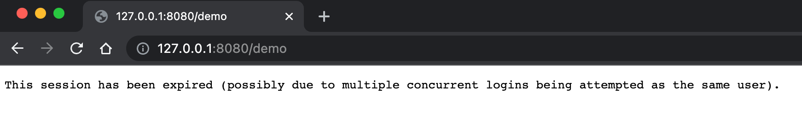

## 3、会话失效处理

### 1）传统web开发护理

```java
protected void configure(HttpSecurity http) throws Exception {
  http.authorizeRequests()
    .anyRequest().authenticated()
    .and()
    ....
    .sessionManagement()  //开启会话管理
    .maximumSessions(1)  //允许同一个用户只允许创建一个会话
    .expiredUrl("/login");//会话过期处理：跳转到登录页
}
```


### 2）前后端分离开发处理

```java
@Override
protected void configure(HttpSecurity http) throws Exception {
  http.authorizeRequests()
    .anyRequest().authenticated()
    .....
    .sessionManagement()  //开启会话管理
    .maximumSessions(1)  //允许同一个用户只允许创建一个会话
    //.expiredUrl("/login")//会话过期处理  传统 web 开发
    .expiredSessionStrategy(event -> {
      HttpServletResponse response = event.getResponse();
      response.setContentType("application/json;charset=UTF-8");
      Map<String, Object> result = new HashMap<>();
      result.put("status", 500);
      result.put("msg", "当前会话已经失效,请重新登录!");
      String s = new ObjectMapper().writeValueAsString(result);
      response.setContentType("application/json;charset=UTF-8");
      response.getWriter().println(s);
      response.flushBuffer();
    });//前后端分离开发处理
}
```


## 4、禁止再次登录

默认的效果是一种被 “挤下线”的效果，后面登录的用户会把前面登录的用户 “挤下线”。还有一种是禁止后来者登录，即一旦当前用户登录成功，后来者无法再次使用相同的用户登录，直到当前用户主动注销登录，配置如下：`maxSessionsPreventsLogin(true)`

```java
@Override
protected void configure(HttpSecurity http) throws Exception {
  http.authorizeRequests()
    .anyRequest().authenticated()
    .and()
    ....
    .sessionManagement()  //开启会话管理
    .maximumSessions(1)  //允许同一个用户只允许创建一个会话
    //.expiredUrl("/login")//会话过期处理  传统 web 开发
    .expiredSessionStrategy(event -> {
      HttpServletResponse response = event.getResponse();
      response.setContentType("application/json;charset=UTF-8");
      Map<String, Object> result = new HashMap<>();
      result.put("status", 500);
      result.put("msg", "当前会话已经失效,请重新登录!");
      String s = new ObjectMapper().writeValueAsString(result);
      response.getWriter().println(s);
      response.flushBuffer();
    })//前后端分离开发处理
    .maxSessionsPreventsLogin(true);//登录之后禁止再次登录
}
```


## 5、集群会话共享

前面所讲的会话管理都是单机上的会话管理，如果当前是集群环境，前面所讲的会话管理方案就会失效。此时可以利用 spring-session 结合 redis 实现 session 共享。

1. 引入依赖

```xml
<dependency>
  <groupId>org.springframework.boot</groupId>
  <artifactId>spring-boot-starter-data-redis</artifactId>
</dependency>
<dependency>
  <groupId>org.springframework.session</groupId>
  <artifactId>spring-session-data-redis</artifactId>
</dependency>
```


2. 编写配置

```properties
spring.redis.host=localhost
spring.redis.port=6379
spring.redis.password=123456
```


3. 配置`security`

```java
@Configuration
public class SecurityConfig extends WebSecurityConfigurerAdapter {


    private final FindByIndexNameSessionRepository sessionRepository;


    @Autowired
    public SecurityConfig(FindByIndexNameSessionRepository sessionRepository) {
        this.sessionRepository = sessionRepository;
    }

    @Bean
    public UserDetailsService userDetailsService() {
        ....
    }

    @Override
    protected void configure(AuthenticationManagerBuilder auth) throws Exception {
        auth.userDetailsService(userDetailsService());
    }

    @Override
    protected void configure(HttpSecurity http) throws Exception {
        http.authorizeRequests()
                .anyRequest().authenticated()
                .and()
                .formLogin()
                .and()
                .rememberMe()
                .and()
                .csrf().disable()
                .sessionManagement()  //开启会话管理
                .maximumSessions(1)  //允许同一个用户只允许创建一个会话*/
                //.expiredUrl("/login")//会话过期处理  传统 web 开发
                .expiredSessionStrategy(event -> {
                    HttpServletResponse response = event.getResponse();
                    response.setContentType("application/json;charset=UTF-8");
                    Map<String, Object> result = new HashMap<>();
                    result.put("status", 500);
                    result.put("msg", "当前会话已经失效,请重新登录!");
                    String s = new ObjectMapper().writeValueAsString(result);
                    response.getWriter().println(s);
                    response.flushBuffer();
                }).sessionRegistry(sessionRegistry());//前后端分离开发处理
        //.maxSessionsPreventsLogin(true);//登录之后禁止再次登录*/
    }

    @Bean
    public SpringSessionBackedSessionRegistry sessionRegistry() {
        return new SpringSessionBackedSessionRegistry(sessionRepository);
    }

}
```

4. 测试


---

# 十、CSRF漏洞保护

## 1、简介

CSRF (Cross-Site Request Forgery 跨站请求伪造)，也可一键式攻击 (one-click-attack），通常缩写为 CSRF 或者 XSRF。

CSRF 攻击是一种挟持用户在当前已登录的浏览器上发送恶意请求的攻击方法。相对于XSS利用用户对指定网站的信任，CSRF则是利用网站对用户网页浏览器的信任。简单来说，CSRF是致击者通过一些技术手段欺骗用户的浏览器，去访问一个用户曾经认证过的网站并执行恶意请求，例如发送邮件、发消息、甚至财产操作 (如转账和购买商品）。由于客户端(浏览器)已经在该网站上认证过，所以该网站会认为是真正用户在操作而执行请求（实际上这个并非用户的本意）。

**例子：**

假设 blr 现在登录了某银行的网站准备完成一项转账操作，转账的链接如下：

**https: //bank .xxx .com/withdraw?account=blr&amount=1000&for=zhangsan**

可以看到，这个链接是想从 blr 这个账户下转账 1000 元到 zhangsan 账户下，假设blr 没有注销登录该银行的网站，就在同一个浏览器新的选项卡中打开了一个危险网站，这个危险网站中有一幅图片，代码如下：

```html

```

一旦用户打开了这个网站，这个图片链接中的请求就会自动发送出去。由于是同一个浏览器并且用户尚未注销登录，所以该请求会自动携带上对应的有效的 Cookie 信息，进而完成一次转账操作。这就是跨站请求伪造。

## 2、CSRF防御

**CSRF**攻击的根源在于浏览器默认的身份验证机制(自动携带当前网站的Cookie信息)，这种机制虽然可以保证请求时来自用户的某个浏览器，但是无法确保这请求是用户授权发送。攻击者和用户发送的请求一模一样，这意味着我们没有办法去直接拒绝这里的某一个请求。如果能在合法请求中额外携带一个攻击者无法获取的參数，就可以成功区分出两种不同的请求，进而直接拒绝掉恶意请求。在 SpringSecurity 中就提供了这种机制来防御 CSRF 攻击，这种机制我们称之为**令牌同步模式**。

这是目前主流的 CSRF 攻击防御方案。具体的操作方式就是在每一个 HTTP 请求中，除了默认自动携带的 Cookie 参数之外，再提供一个安全的、随机生成的字符串，我们称之为 CSRF 令牌。这个 CSRF 令牌由服务端生成，生成后在 HttpSession 中保存一份。当前端请求到达后，将请求携带的 CSRF 令牌信息和服务端中保存的令牌进行对比，如果两者不相等，则拒绝掉该 HTTP 请求。

源码可查看`CsrfFilter.class`。

> **注意:** 
>
> 考虑到会有一些外部站点链接到我们的网站，所以我们要求请求是幂等的，这样对子HEAD、OPTIONS、TRACE 等方法就没有必要使用 CSRF 令牌了，强行使用可能会导致令牌泄露！

**开启CSRF防御**

```java
@Configuration
public class SecurityConfig extends WebSecurityConfigurerAdapter {
    @Override
    protected void configure(HttpSecurity http) throws Exception {
        http.
          ...
          formLogin()
          .and()
          .csrf(); //开启 csrf
    }
}
```

**查看登录页面源码**

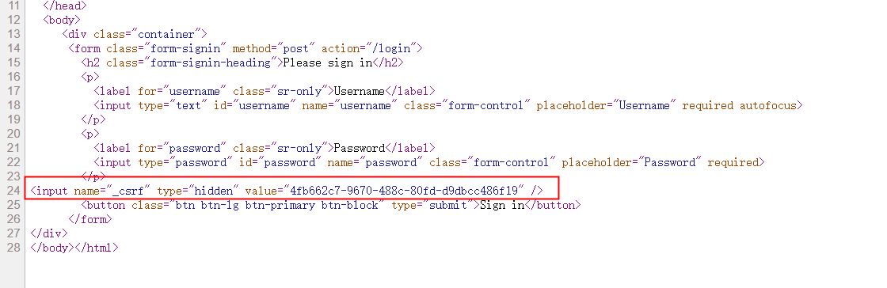

## 3、传统项目

1. 导入依赖

```xml
<dependency>
    <groupId>org.springframework.boot</groupId>
    <artifactId>spring-boot-starter-security</artifactId>
</dependency>
<dependency>
    <groupId>org.springframework.boot</groupId>
    <artifactId>spring-boot-starter-thymeleaf</artifactId>
</dependency>
<dependency>
    <groupId>org.springframework.boot</groupId>
    <artifactId>spring-boot-starter-web</artifactId>
</dependency>
<dependency>
    <groupId>org.thymeleaf.extras</groupId>
    <artifactId>thymeleaf-extras-springsecurity5</artifactId>
</dependency>
```

2. 配置SpringSecurity

```java
@Configuration
public class SecurityConfig extends WebSecurityConfigurerAdapter {

    @Bean
    public UserDetailsService userDetailsService() {
        InMemoryUserDetailsManager inMemoryUserDetailsManager = new InMemoryUserDetailsManager();
        inMemoryUserDetailsManager.createUser(User.withUsername("root").password("{noop}123456").roles("admin").build());
        return inMemoryUserDetailsManager;
    }

    @Override
    protected void configure(AuthenticationManagerBuilder auth) throws Exception {
        auth.userDetailsService(userDetailsService());
    }

    @Override
    protected void configure(HttpSecurity http) throws Exception {
        http.authorizeRequests()
                .anyRequest().authenticated()
                .and()
                .formLogin()
                .and()
                .csrf();

    }
}
```

3. 配置application文件

```properties
spring.thymeleaf.cache=false
spring.thymeleaf.mode=HTML
spring.thymeleaf.encoding=UTF-8
spring.thymeleaf.prefix=classpath:/templates/
spring.thymeleaf.suffix=.html
```

4. 编写页面

```html
<!DOCTYPE html>
<html lang="en">
<head>
    <meta charset="UTF-8">
    <title>测试开启 CSRF</title>
</head>
<body>

<h1>主页</h1>
    <form method="post" th:action="@{/hello}">
        信息: <input name="name" type="text"> <br>
        <input type="submit" value="提交">
    </form>
</body>
</html>
```

5. 编写Controller

```java
@Controller
public class HelloController {

    @PostMapping("/hello")
    @ResponseBody
    public String hello() {
        System.out.println("hello ok!");
        return "Hello ok";
    }

    @GetMapping("/index")
    public String index() {
        return "index";
    }

}
```

6. 模拟恶意网站：

```html
<form action="http://loacal:8080/index" method="post">
    <input name="name" type="hidden" value="blr"/>
    <input name="money" type="hidden" value="10000">
    <input type="submit" value="点我">
</form>
```

当恶意网站想要调用我们的`/index`接口时，由于没有`_csrf`令牌，将调用失败。

## 4、前后端分离项目

1. 编写Filter.class

```java
/**
 * 自定义前后端分离认证 Filter
 */
public class LoginFilter extends UsernamePasswordAuthenticationFilter {

    @Override
    public Authentication attemptAuthentication(HttpServletRequest request, HttpServletResponse response) throws AuthenticationException {
        System.out.println("========================================");
        //1.判断是否是 post 方式请求
        if (!request.getMethod().equals("POST")) {
            throw new AuthenticationServiceException("Authentication method not supported: " + request.getMethod());
        }
        //2.判断是否是 json 格式请求类型
        if (request.getContentType().equalsIgnoreCase(MediaType.APPLICATION_JSON_VALUE)) {
            //3.从 json 数据中获取用户输入用户名和密码进行认证 {"uname":"xxx","password":"xxx"}
            try {
                Map<String, String> userInfo = new ObjectMapper().readValue(request.getInputStream(), Map.class);
                String username = userInfo.get(getUsernameParameter());
                String password = userInfo.get(getPasswordParameter());
                System.out.println("用户名: " + username + " 密码: " + password);
                UsernamePasswordAuthenticationToken authRequest = new UsernamePasswordAuthenticationToken(username, password);
                setDetails(request, authRequest);
                return this.getAuthenticationManager().authenticate(authRequest);
            } catch (IOException e) {
                e.printStackTrace();
            }
        }
        return super.attemptAuthentication(request, response);
    }
}
```

2. 配置SpringSecurity

```java
@Configuration
public class SecurityConfig extends WebSecurityConfigurerAdapter {

    @Bean
    public UserDetailsService userDetailsService() {
        InMemoryUserDetailsManager inMemoryUserDetailsManager = new InMemoryUserDetailsManager();
        inMemoryUserDetailsManager.createUser(User.withUsername("root").password("{noop}123456").roles("admin").build());
        return inMemoryUserDetailsManager;
    }

    @Override
    protected void configure(AuthenticationManagerBuilder auth) throws Exception {
        auth.userDetailsService(userDetailsService());
    }

    @Override
    @Bean
    public AuthenticationManager authenticationManagerBean() throws Exception {
        return super.authenticationManagerBean();
    }

    //自定义 filter 交给工厂管理
    @Bean
    public LoginFilter loginFilter() throws Exception {
        LoginFilter loginFilter = new LoginFilter();
        loginFilter.setFilterProcessesUrl("/doLogin");//指定认证 url
        loginFilter.setAuthenticationManager(authenticationManagerBean());
        //认证成功处理
        loginFilter.setAuthenticationSuccessHandler((req, resp, authentication) -> {
            Map<String, Object> result = new HashMap<String, Object>();
            result.put("msg", "登录成功");
            result.put("用户信息", authentication.getPrincipal());
            resp.setContentType("application/json;charset=UTF-8");
            resp.setStatus(HttpStatus.OK.value());
            String s = new ObjectMapper().writeValueAsString(result);
            resp.getWriter().println(s);
        });
        //认证失败处理
        loginFilter.setAuthenticationFailureHandler((req, resp, ex) -> {
            Map<String, Object> result = new HashMap<String, Object>();
            result.put("msg", "登录失败: " + ex.getMessage());
            resp.setStatus(HttpStatus.INTERNAL_SERVER_ERROR.value());
            resp.setContentType("application/json;charset=UTF-8");
            String s = new ObjectMapper().writeValueAsString(result);
            resp.getWriter().println(s);
        });
        return loginFilter;
    }

    @Override
    protected void configure(HttpSecurity http) throws Exception {
        http.authorizeRequests().anyRequest().authenticated()
                .and()
                .formLogin()
                //.and().csrf().disable();
                .and()
                .csrf()
                .csrfTokenRepository(cookieCsrfTokenRepository());
        http.addFilterAt(loginFilter(), UsernamePasswordAuthenticationFilter.class);
    }

    @Bean
    public CookieCsrfTokenRepository cookieCsrfTokenRepository() {
        CookieCsrfTokenRepository repository = new CookieCsrfTokenRepository();
        repository.setHeaderName("_MY_XSRF");   //修改令牌名
        repository.setCookieHttpOnly(false);    //将令牌保存到 cookie 中 允许 cookie 前端获取
        return repository;
    }
}
```

3. 测试

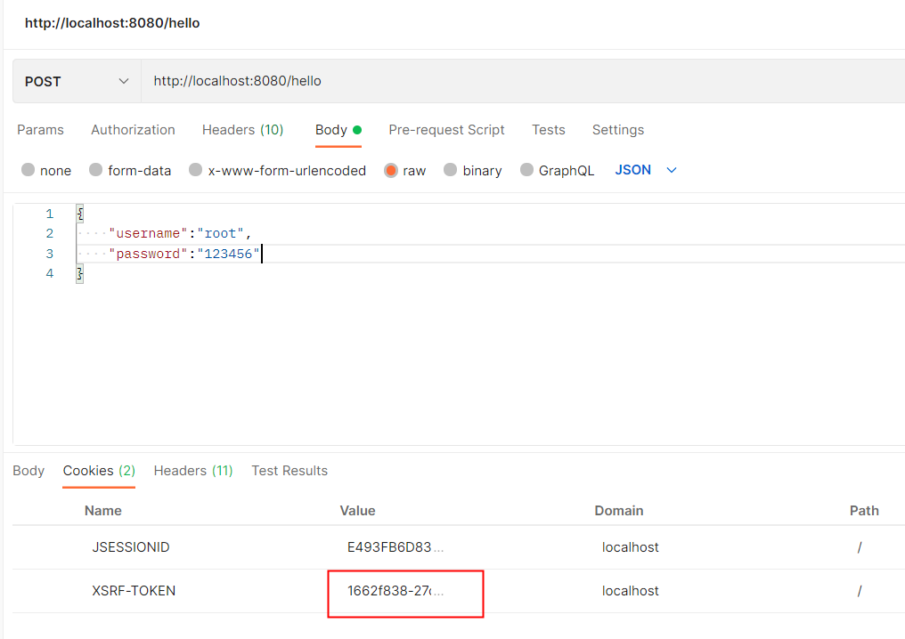


前端系统在每次访问时需要先获取到`XSRF-TOKEN`中的值，并放入到请求头中：

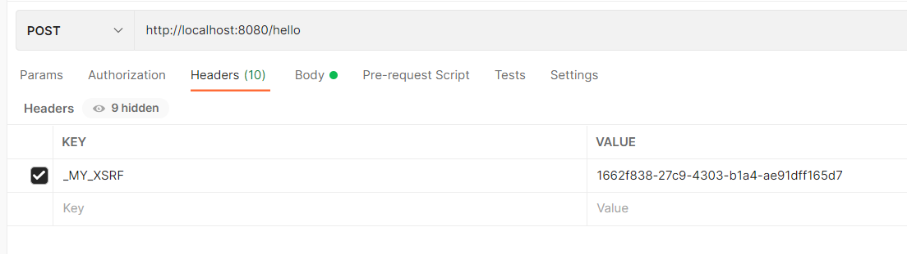


---

# 十一、跨域

## 1、什么是CORS

CORS (Cross-Origin Resource Sharing ）是由 W3C制定的一种跨域资源共享技术标准，其目的就是为了解决前端的跨域请求。在JavaEE 开发中，最常见的前端跨域请求解决方案是早期的JSONP，但是 JSONP 只支持 GET 请求，这是一个很大的缺陷，而 CORS 则支特多种 HTTTP请求方法，也是目前主流的跨域解决方案。

CORS 中新增了一组HTTP 请求头字段，通过这些字段，服务器告诉浏览器，那些网站通过浏览器有权限访问哪些资源。同时规定，对那些可能修改服务器数据的HTTP请求方法 （如GET以外的HTTP 请求等)，浏览器必须首先使用 OPTIONS 方法发起一个预检请求(PREFLIGHT），预检请求的目的是查看服务端是否支持即将发起的跨域请求，如果服务端允许，才发送实际的 HTTP 请求。在预检请求的返回中，服务器端也可以通知客户端，是否需要携带身份凭证（如 Cookies、HTTP 认证信息等）。

> CORS: 同源/同域 = 协议+主机+端口

### 1）简单请求

GET 请求为例，如果需要发起一个跨域请求，则请求头如下：

```http
Host: localhost:8080
Origin: http://localhost:8081
Referer:http://localhost:8081/index.html
```

如果服务端支持该跨域请求，那么返回的响应头中将包含如下字段：

```http
Access-Control-Allow-Origin:http://localhost: 8081
```

Access-Control-Allow-Origin 字段用来告诉浏览器可以访问该资源的域，当浏览器收到这样的响应头信息之后，提取出 Access-Control-Allow-Origin 字段中的值， 发现该值包含当前页面所在的域，就知道这个跨域是被允许的，因此就不再对前端的跨域请求进行限制。这属于简单请求，即不需要进行预检请求的跨域。

### 2）非简单请求

对于一些非简单请求，会首先发送一个预检请求。预检请求类似下面这样：

```http
OPTIONS /put HTTP/1.1
Host: localhost:8080
Connection: keep-alive
Accept: */*
Access-Control-Request-Method:PUT
Origin: http://localhost: 8081
Referer:http://localhost:8081/index.html
```

请求方法是 OPTIONS，请求头Origin 就告诉服务端当前页面所在域，请求头 Access-Control-Request-Methods 告诉服务器端即将发起的跨域请求所使用的万法。服务端对此进行判断，如果允许即将发起的跨域请求，则会给出如下响应：

```http
HTTP/1.1 200
Access-Control-Allow-Origin:http://localhost: 8081
Access-Control-Request-Methods: PUT
Access-Control-Max-Age: 3600
```

Access-Control-Allow-Metbods 字段表示允许的跨域方法：Access-Control-Max-Age 字段表示预检请求的有效期，单位为秒，在有效期内如果发起该跨域请求，则不用再次发起预检请求。预检请求结朿后，接下来就会发起一个真正的跨域请求，跨域请求和前面的简单请求跨域步骤类似。

## 2、Spring跨域解决方案

### 1）@CrossOrigin

Spring 中第一种处理跨域的方式是通过`@CrossOrigin` 注解来标记支持跨域，该注解可以添加在方法上，也可以添加在 Controller 上。当添加在 Controller 上时，表示 Controller 中的所有接口都支持跨域，具体配置如下：

```java
@RestController
public Class HelloController{
	@CrossOrigin (origins ="http://localhost:8081")
	@PostMapping ("/post")
	public String post (){
		return "hello post";
	}
}
```

@CrossOrigin 注解各属性含义如下：

- **alowCredentials：**浏览器是否应当发送凭证信息，如 Cookie。
- **allowedFeaders：** 请求被允许的请求头宇段，`*`表示所有宇段。

- **exposedHeaders：**哪些响应头可以作为响应的一部分暴露出来。(注意，这里只可以一一列举，通配符 * 在这里是无效的。)

- **maxAge：**预检请求的有效期，有效期内不必再次发送预检请求，默认是`1800 `秒。

- **methods：**允许的请求方法，`*` 表示允许所有方法。

- **origins：**允许的域，`*`表示允许所有域。

### 2）addCrosMapping

@CrossOrigin 注解需要添加在不同的 Controller 上。所以还有一种全局配置方法，就是通过重写 `WebMvcConfigurerComposite`#addCorsMappings方法来实现，具体配置如下：

```java
@Configuration
public class WebMvcConfig implements WebMvcConfigurer|
  @Override
  public void addCorsMappings (CorsRegistry registry){
    registry.addMapping("/**") //处理的请求地址
    .allowedMethods ("*")
    .allowedorigins("*")
    .allowedHeaders ("*")
    .allowCredentials (false)
    .exposedHeaders ("")
    .maxAge (3600) ;
  }
}
```

### 3）CrosFilter

Cosr Filter 是Spring Web 中提供的一个处理跨域的过滤器，开发者也可以通过该过该过滤器处理跨域。

```java
@Configuration
public class WebMvcConfig{
	@Bean
	FilterRegistrationBean<CorsFilter> corsFilter(){
		FilterRegistrationBean<CorsFilter› registrationBean = new FilterRegistrationBean<>();
		CorsConfigurationcors corsConfiguration = new CorsConfiguration();
		corsConfiguration.setAllowedHeaders(Arrays.asList("*"));
		corsConfiguration.setAllowedMethods(Arrays.asList("*"));
		corsConfiguration.setAllowedOrigins(Arrays.asList("*"));
      	corsConfiguration.setMaxAge(3600L);
	  	UrlBasedCorsConfigurationSource source = new 
      	UrlBasedCorsConfigurationSource();
    	source.registerCorsConfiguration("/**", corsConfiguration);     
    	registrationBean.setFilter(new CorsFilter (source)) ;
    	registrationBean.setOrder (-1) ;
		return registrationBean;
  	}
}
```

## 3、Spring Security跨域解决方案

### 1）原理分析

当我们为项目添加了 Spring Security 依赖之后，发现上面三种跨域方式有的失效了，有的可以继续使用，这是怎么回事？

通过@CrossOrigin 注解或者重写 addCorsMappings 方法配置跨域，统统失效了，通CorsFilter 配置的跨域，有没有失效则要看过滤器的优先级，如果过滤器优先级高于 SpringSecurity 过滤器，即先于 Spring Security 过滤器执行，则 CorsFiter 所配置的跨域处理依然有效；如果过滤器优先级低于 Spring Security 过滤器，则 CorsFilter 所配置的跨域处理就会失效。

为了理清楚这个问题，我们先简略了解一下 Filter、DispatchserServlet 以及Interceptor 执行顺序。

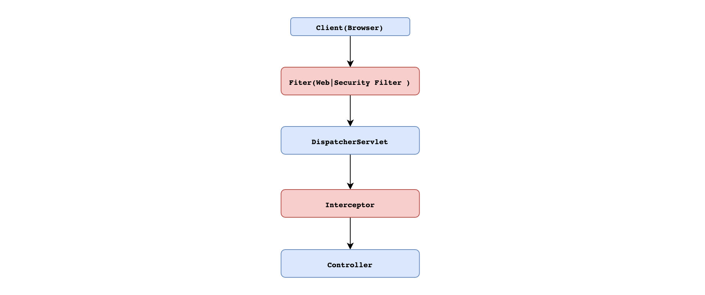

理清楚了执行顺序，我们再来看跨域请求过程。由于非简单请求都要首先发送一个预检请求（request），而预检请求并不会携带认证信息，所以预检请求就有被 Spring Security 拦截的可能。因此通过@CrossOrigin 注解或者重写 addCorsMappings 方法配置跨域就会失效。如果使用 CorsFilter 配置的跨域，只要过滤器优先级高于 SpringSecurity 过滤器就不会有问题。反之同样会出现问题。

### 2）解决方案

Spring Security 中也提供了更专业的方式来解决预检请求所面临的问题。如：

```java
@Configuration
public class SecurityConfig extends WebSecurityConfigurerAdapter {
		@Override
    protected void configure(HttpSecurity http) throws Exception {
        http.authorizeRequests().anyRequest()
                .authenticated()
                .and()
                .formLogin()
                .and()
                .cors() //跨域处理方案
                .configurationSource(configurationSource())
                .and()
                .csrf().disable();
    }

    CorsConfigurationSource configurationSource() {
        CorsConfiguration corsConfiguration = new CorsConfiguration();
        corsConfiguration.setAllowedHeaders(Arrays.asList("*"));
        corsConfiguration.setAllowedMethods(Arrays.asList("*"));
        corsConfiguration.setAllowedOrigins(Arrays.asList("*"));
        corsConfiguration.setMaxAge(3600L);
        UrlBasedCorsConfigurationSource source = new UrlBasedCorsConfigurationSource();
        source.registerCorsConfiguration("/**", corsConfiguration);
        return source;
    }
}
```


---

# 十二、异常处理

## 1、异常体系

Spring Security 中异常主要分为两大类:

- AuthenticationException:  认证异常
- AccessDeniedException:    授权异常

其中认证所涉及异常类型比较多，默认提供的异常类型如下：


相比于认证异常，权限异常类就要少了很多，默认提供的权限异常如下：


在实际项目开发中，如果默认提供异常无法满足需求时，就需要根据实际需要来自定义异常类。

## 2、自定义异常处理配置

```java
@Configuration
public class SecurityConfig extends WebSecurityConfigurerAdapter {
    @Override
    protected void configure(HttpSecurity http) throws Exception {
        http.authorizeRequests().anyRequest()
                .authenticated()
          			//.....
                .and()
                .exceptionHandling()//异常处理
                .authenticationEntryPoint((request, response, e) -> {
                  response.setContentType("application/json;charset=UTF-8");
                  response.setStatus(HttpStatus.UNAUTHORIZED.value());
                  response.getWriter().write("尚未认证，请进行认证操作！");
                })
                .accessDeniedHandler((request, response, e) -> {
                  response.setContentType("application/json;charset=UTF-8");
                  response.setStatus(HttpStatus.FORBIDDEN.value());
                  response.getWriter().write("无权访问!");
                });
    }
}
```


# 十三、授权

## 1、权限管理

#### 1）认证

**`身份认证`**，就是判断一个用户是否为合法用户的处理过程。Spring Security 中支持多种不同方式的认证，但是无论开发者使用那种方式认证，都不会影响授权功能使用。因为 Spring Security 很好做到了认证和授权解耦。

#### 2）授权

**`授权`**，即访问控制，控制谁能访问哪些资源。简单的理解授权就是根据系统提前设置好的规则，给用户分配可以访问某一个资源的权限，用户根据自己所具有权限，去执行相应操作。

## 2、权限管理核心概念

在前面学习认证过程中，我们得知认证成功之后会将当前登录用户信息保存到 Authentication 对象中，Authentication 对象中有一个 getAuthorities() 方法，用来返回当前登录用户具备的权限信息，也就是当前用户具有权限信息。该方法的返回值为 Collection<? extends GrantedAuthority>，当需要进行权限判断时，就回根据集合返回权限信息调用相应方法进行判断。


那么问题来了，针对于这个返回值 GrantedAuthority 应该如何理解呢? 是角色还是权限?

我们针对于授权可以是`基于角色权限管理`和`基于资源权限管理` ，从设计层面上来说，角色和权限是两个完全不同的东西：权限是一些具体操作，角色则是某些权限集合。如：READ_BOOK 和 ROLE_ADMIN 是完全不同的。因此至于返回值是什么取决于你的业务设计情况：

- 基于角色权限设计就是: `用户<=>角色<=>资源` 三者关系 返回就是用户的`角色` 

- 基于资源权限设计就是: `用户<=>权限<=>资源` 三者关系 返回就是用户的`权限` 

- 基于角色和资源权限设计就是: `用户<=>角色<=>权限<=>资源` 返回统称为用户的`权限`

为什么可以统称为权限，因为从代码层面角色和权限没有太大不同都是权限，特别是在 Spring Security 中，角色和权限处理方式基本上都是一样的。唯一区别 SpringSecurity 在很多时候会自动给角色添加一个`ROLE_`前缀，而权限则不会自动添加。

## 3、权限管理策略

Spring Security 中提供的权限管理策略主要有两种类型:

### 1）基于过滤器(URL)的权限管理 (FilterSecurityInterceptor)

**原理**

基于过滤器的权限管理主要是用来拦截 HTTP 请求，拦截下来之后，根据 HTTP 请求地址进行权限校验。

**代码演示**

- 开发 controller

```java
@RestController
public class DemoController {

    @GetMapping("/admin")
    public String admin() {
        return "admin ok";
    }

    @GetMapping("/user")
    public String user() {
        return "user ok";
    }

    @GetMapping("/getInfo")
    public String getInfo() {
        return "info ok";
    }
}
```

- 配置授权

```java
@Configuration
public class SecurityConfig extends WebSecurityConfigurerAdapter {


    //创建内存数据源
    public UserDetailsService userDetailsService() {
        InMemoryUserDetailsManager inMemoryUserDetailsManager = new InMemoryUserDetailsManager();
        inMemoryUserDetailsManager.createUser(User.withUsername("root").password("{noop}123").roles("ADMIN").build());
        inMemoryUserDetailsManager.createUser(User.withUsername("win7").password("{noop}123").roles("USER").build());
        inMemoryUserDetailsManager.createUser(User.withUsername("lisi").password("{noop}123").roles("READ_BOOK").build());
        return inMemoryUserDetailsManager;
    }

    @Override
    protected void configure(AuthenticationManagerBuilder auth) throws Exception {
        auth.userDetailsService(userDetailsService());
    }

    @Override
    protected void configure(HttpSecurity http) throws Exception {
        http.authorizeHttpRequests()
                .antMatchers("/admin/**").hasRole("ADMIN")
                .antMatchers("/user/**").hasAnyRole("USER", "ADMIN")
                .antMatchers("/getInfo").hasRole("READ_BOOK")
                .anyRequest().authenticated()
                .and().formLogin()
                .and().csrf().disable();
    }
}
```

- 启动项目测试

**拓展：权限表达式**


| 方法                                                         | 说明                                                        |
| ------------------------------------------------------------ | ----------------------------------------------------------- |
| hasAuthority(String authority)                               | 当前用户是否具备指定权限                                    |
| hasAnyAuthority(String... authorities)                       | 当前用户是否具备指定权限中任意一个                          |
| hasRole(String role)                                         | 当前用户是否具备指定角色                                    |
| hasAnyRole(String... roles);                                 | 当前用户是否具备指定角色中任意一个                          |
| permitAll();                                                 | 放行所有请求/调用                                           |
| denyAll();                                                   | 拒绝所有请求/调用                                           |
| isAnonymous();                                               | 当前用户是否是一个匿名用户                                  |
| isAuthenticated();                                           | 当前用户是否已经认证成功                                    |
| isRememberMe();                                              | 当前用户是否通过 Remember-Me 自动登录                       |
| isFullyAuthenticated();                                      | 当前用户是否既不是匿名用户又不是通过 Remember-Me 自动登录的 |
| hasPermission(Object targetId, Object permission);           | 当前用户是否具备指定目标的指定权限信息                      |
| hasPermission(Object targetId, String targetType, Object permission); | 当前用户是否具备指定目标的指定权限信息                      |

### 2）基于 AOP (方法)的权限管理   (MethodSecurityInterceptor)

**原理**

基于方法的权限管理主要是通过 A0P 来实现的，Spring Security 中通过 `MethodSecurityInterceptor` 来提供相关的实现。不同在于 `FilterSecurityInterceptor` 只是在请求之前进行前置处理，`MethodSecurityInterceptor` 除了前置处理之外还可以进行后置处理。前置处理就是在请求之前判断是否具备相应的权限，后置处理则是对方法的执行结果进行二次过滤。前置处理和后置处理分别对应了不同的实现类。

**用法**

- 开启权限

```java
@Configuration
@EnableGlobalMethodSecurity(prePostEnabled=true,securedEnabled=true, jsr250Enabled=true)
public class SecurityConfig extends WebsecurityConfigurerAdapter{
    //......
}
```

使用`@EnableGlobalMethodSecurity`注解来开启方法权限认证功能。

> **prePostEnabled**: 开启 Spring Security 提供的四个权限注解：
>
> - @PostAuthorize： 在目前标方法执行之后进行权限校验。
> - @PostFiter： 在目标方法执行之后对方法的返回结果进行过滤。
> - @PreAuthorize：在目标方法执行之前进行权限校验。
> - @PreFiter：在目前标方法执行之前对方法参数进行过滤。
>
> **securedEnabled**: 开启 Spring Security 提供的 @Secured 注解支持，该注解不支持权限表达式：
>
> - @Secured：访问目标方法必须具各相应的角色。
>
> **jsr250Enabled**: 开启 JSR-250 提供的注解，主要是@DenyAll、@PermitAll、@RolesAll 同样这些注解也不支持权限表达式
>
> - @DenyAll：拒绝所有访问。
> - @PermitAll：允许所有访问。
> - @RolesAllowed：访问目标方法必须具备相应的角色。

这些基于方法的权限管理相关的注解，一般来说只要设置 **`prePostEnabled=true`** 就够用了。

**代码演示**

1. 开启注解使用

```java
@Configuration
@EnableGlobalMethodSecurity(prePostEnabled=true,securedEnabled=true, jsr250Enabled=true)
public class SecurityConfig extends WebsecurityConfigurerAdapter{
    //......
}
```

2. 使用注解

```java
@RestController
@RequestMapping("/hello")
public class AuthorizeMethodController {

    @PreAuthorize("hasRole('ADMIN') and authentication.name=='root'")
    @GetMapping
    public String hello() {
        return "hello";
    }

    @PreAuthorize("authentication.name==#name")
    @GetMapping("/name")
    public String hello(String name) {
        return "hello:" + name;
    }

    @PreFilter(value = "filterObject.id%2!=0",filterTarget = "users")
    @PostMapping("/users")  //filterTarget 必须是 数组  集合
    public void addUsers(@RequestBody List<User> users) {
        System.out.println("users = " + users);
    }

    @PostAuthorize("returnObject.id==1")
    @GetMapping("/userId")
    public User getUserById(Integer id) {
        return new User(id, "blr");
    }

    @PostFilter("filterObject.id%2==0")
    @GetMapping("/lists")
    public List<User> getAll() {
        List<User> users = new ArrayList<>();
        for (int i = 0; i < 10; i++) {
            users.add(new User(i, "blr:" + i));
        }
        return users;
    }

    @Secured({"ROLE_USER"}) //只能判断角色
    @GetMapping("/secured")
    public User getUserByUsername() {
        return new User(99, "secured");
    }

    @Secured({"ROLE_ADMIN","ROLE_USER"}) //具有其中一个即可
    @GetMapping("/username")
    public User getUserByUsername2(String username) {
        return new User(99, username);
    }

    @PermitAll
    @GetMapping("/permitAll")
    public String permitAll() {
        return "PermitAll";
    }

    @DenyAll
    @GetMapping("/denyAll")
    public String denyAll() {
        return "DenyAll";
    }

    @RolesAllowed({"ROLE_ADMIN","ROLE_USER"}) //具有其中一个角色即可
    @GetMapping("/rolesAllowed")
    public String rolesAllowed() {
        return "RolesAllowed";
    }
}
```

## 4、原理分析


- **`ConfigAttribute`** 在 Spring Security 中，用户请求一个资源(通常是一个接口或者一个 Java 方法)需要的角色会被封装成一个 ConfigAttribute 对象，在 ConfigAttribute 中只有一个 getAttribute方法，该方法返回一个 String 字符串，就是角色的名称。一般来说，角色名称都带有一个 `ROLE_` 前缀，投票器 AccessDecisionVoter 所做的事情，其实就是比较用户所具各的角色和请求某个资源所需的 ConfigAtuibute 之间的关系。
- **`AccesDecisionVoter`**和**`AccessDecisionManager`** 都有众多的实现类，在 AccessDecisionManager 中会换个遍历 AccessDecisionVoter，进而决定是否允许用户访问，因而 AaccesDecisionVoter 和 AccessDecisionManager 两者的关系类似于 AuthenticationProvider 和 ProviderManager 的关系。

## 5、动态管理权限实战

动态管理权限规则就是我们将 URL 拦截规则和访问 URI 所需要的权限都保存在数据库中，这样，在不修改源代码的情况下，只需要修改数据库中的数据，就可以对权限进行调整。

`用户<--中间表--> 角色 <--中间表--> 菜单`

1. 数据库设计

```sql
SET NAMES utf8mb4;
SET FOREIGN_KEY_CHECKS = 0;
-- ----------------------------
-- Table structure for menu
-- ----------------------------
DROP TABLE IF EXISTS `menu`;
CREATE TABLE `menu` (
  `id` int(11) NOT NULL AUTO_INCREMENT,
  `pattern` varchar(128) DEFAULT NULL,
  PRIMARY KEY (`id`)
) ENGINE=InnoDB AUTO_INCREMENT=4 DEFAULT CHARSET=utf8;

-- ----------------------------
-- Records of menu
-- ----------------------------
BEGIN;
INSERT INTO `menu` VALUES (1, '/admin/**');
INSERT INTO `menu` VALUES (2, '/user/**');
INSERT INTO `menu` VALUES (3, '/guest/**');
COMMIT;

-- ----------------------------
-- Table structure for menu_role
-- ----------------------------
DROP TABLE IF EXISTS `menu_role`;
CREATE TABLE `menu_role` (
  `id` int(11) NOT NULL AUTO_INCREMENT,
  `mid` int(11) DEFAULT NULL,
  `rid` int(11) DEFAULT NULL,
  PRIMARY KEY (`id`),
  KEY `mid` (`mid`),
  KEY `rid` (`rid`),
  CONSTRAINT `menu_role_ibfk_1` FOREIGN KEY (`mid`) REFERENCES `menu` (`id`),
  CONSTRAINT `menu_role_ibfk_2` FOREIGN KEY (`rid`) REFERENCES `role` (`id`)
) ENGINE=InnoDB AUTO_INCREMENT=5 DEFAULT CHARSET=utf8;

-- ----------------------------
-- Records of menu_role
-- ----------------------------
BEGIN;
INSERT INTO `menu_role` VALUES (1, 1, 1);
INSERT INTO `menu_role` VALUES (2, 2, 2);
INSERT INTO `menu_role` VALUES (3, 3, 3);
INSERT INTO `menu_role` VALUES (4, 3, 2);
COMMIT;

-- ----------------------------
-- Table structure for role
-- ----------------------------
DROP TABLE IF EXISTS `role`;
CREATE TABLE `role` (
  `id` int(11) NOT NULL AUTO_INCREMENT,
  `name` varchar(32) DEFAULT NULL,
  `nameZh` varchar(32) DEFAULT NULL,
  PRIMARY KEY (`id`)
) ENGINE=InnoDB AUTO_INCREMENT=4 DEFAULT CHARSET=utf8;

-- ----------------------------
-- Records of role
-- ----------------------------
BEGIN;
INSERT INTO `role` VALUES (1, 'ROLE_ADMIN', '系统管理员');
INSERT INTO `role` VALUES (2, 'ROLE_USER', '普通用户');
INSERT INTO `role` VALUES (3, 'ROLE_GUEST', '游客');
COMMIT;

-- ----------------------------
-- Table structure for user
-- ----------------------------
DROP TABLE IF EXISTS `user`;
CREATE TABLE `user` (
  `id` int(11) NOT NULL AUTO_INCREMENT,
  `username` varchar(32) DEFAULT NULL,
  `password` varchar(255) DEFAULT NULL,
  `enabled` tinyint(1) DEFAULT NULL,
  `locked` tinyint(1) DEFAULT NULL,
  PRIMARY KEY (`id`)
) ENGINE=InnoDB AUTO_INCREMENT=4 DEFAULT CHARSET=utf8;

-- ----------------------------
-- Records of user
-- ----------------------------
BEGIN;
INSERT INTO `user` VALUES (1, 'admin', '{noop}123', 1, 0);
INSERT INTO `user` VALUES (2, 'user', '{noop}123', 1, 0);
INSERT INTO `user` VALUES (3, 'blr', '{noop}123', 1, 0);
COMMIT;

-- ----------------------------
-- Table structure for user_role
-- ----------------------------
DROP TABLE IF EXISTS `user_role`;
CREATE TABLE `user_role` (
  `id` int(11) NOT NULL AUTO_INCREMENT,
  `uid` int(11) DEFAULT NULL,
  `rid` int(11) DEFAULT NULL,
  PRIMARY KEY (`id`),
  KEY `uid` (`uid`),
  KEY `rid` (`rid`),
  CONSTRAINT `user_role_ibfk_1` FOREIGN KEY (`uid`) REFERENCES `user` (`id`),
  CONSTRAINT `user_role_ibfk_2` FOREIGN KEY (`rid`) REFERENCES `role` (`id`)
) ENGINE=InnoDB AUTO_INCREMENT=5 DEFAULT CHARSET=utf8;

-- ----------------------------
-- Records of user_role
-- ----------------------------
BEGIN;
INSERT INTO `user_role` VALUES (1, 1, 1);
INSERT INTO `user_role` VALUES (2, 1, 2);
INSERT INTO `user_role` VALUES (3, 2, 2);
INSERT INTO `user_role` VALUES (4, 3, 3);
COMMIT;
SET FOREIGN_KEY_CHECKS = 1;
```

2. 引入依赖

```xml
<dependency>
  <groupId>org.springframework.boot</groupId>
  <artifactId>spring-boot-starter-security</artifactId>
</dependency>
<dependency>
  <groupId>org.springframework.boot</groupId>
  <artifactId>spring-boot-starter-web</artifactId>
</dependency>

<dependency>
  <groupId>mysql</groupId>
  <artifactId>mysql-connector-java</artifactId>
  <version>5.1.38</version>
</dependency>
<dependency>
  <groupId>com.alibaba</groupId>
  <artifactId>druid</artifactId>
  <version>1.2.8</version>
</dependency>
<dependency>
  <groupId>org.mybatis.spring.boot</groupId>
  <artifactId>mybatis-spring-boot-starter</artifactId>
  <version>2.2.2</version>
</dependency>
```

3. 配置properties文件

```properties
server.port=8080
spring.datasource.type=com.alibaba.druid.pool.DruidDataSource
spring.datasource.driver-class-name=com.mysql.jdbc.Driver
spring.datasource.url=jdbc:mysql://localhost:3306/springsecurity?characterEncoding=UTF-8
spring.datasource.username=root
spring.datasource.password=root
mybatis.mapper-locations=classpath:com/lin/mapper/*.xml
mybatis.type-aliases-package=com.lin.entity
```

4. 创建实体类

```java
public class Role {
    private Integer id;
    private String name;
    private String nameZh;

    public Integer getId() {
        return id;
    }

    public void setId(Integer id) {
        this.id = id;
    }

    public String getName() {
        return name;
    }

    public void setName(String name) {
        this.name = name;
    }

    public String getNameZh() {
        return nameZh;
    }

    public void setNameZh(String nameZh) {
        this.nameZh = nameZh;
    }
}
```


```java
public class User implements UserDetails {
    private Integer id;
    private String password;
    private String username;
    private boolean enabled;
    private boolean locked;
    private List<Role> roles;

    @Override
    public Collection<? extends GrantedAuthority> getAuthorities() {
        return roles.stream().map(r -> new SimpleGrantedAuthority(r.getName())).collect(Collectors.toList());
    }

    @Override
    public String getPassword() {
        return password;
    }

    @Override
    public String getUsername() {
        return username;
    }

    @Override
    public boolean isAccountNonExpired() {
        return true;
    }

    @Override
    public boolean isAccountNonLocked() {
        return !locked;
    }

    @Override
    public boolean isCredentialsNonExpired() {
        return true;
    }

    @Override
    public boolean isEnabled() {
        return enabled;
    }

    public void setId(Integer id) {
        this.id = id;
    }

    public void setPassword(String password) {
        this.password = password;
    }

    public void setUsername(String username) {
        this.username = username;
    }

    public void setEnabled(boolean enabled) {
        this.enabled = enabled;
    }

    public void setLocked(boolean locked) {
        this.locked = locked;
    }

    public void setRoles(List<Role> roles) {
        this.roles = roles;
    }

    public Integer getId() {
        return id;
    }

    public List<Role> getRoles() {
        return roles;
    }
}
```


```java
public class Menu {
    private Integer id;
    private String pattern;
    private List<Role> roles;

    public List<Role> getRoles() {
        return roles;
    }

    public void setRoles(List<Role> roles) {
        this.roles = roles;
    }

    public Integer getId() {
        return id;
    }

    public void setId(Integer id) {
        this.id = id;
    }

    public String getPattern() {
        return pattern;
    }

    public void setPattern(String pattern) {
        this.pattern = pattern;
    }
}
```

5. 创建 mapper 接口

```java
@Mapper
public interface UserMapper {
    List<Role> getUserRoleByUid(Integer uid);
    User loadUserByUsername(String username);
}
```

```java
@Mapper
public interface MenuMapper {
    List<Menu> getAllMenu();
}
```

6. 创建 mapper 文件

```xml
<!DOCTYPE mapper
        PUBLIC "-//mybatis.org//DTD Mapper 3.0//EN"
        "http://mybatis.org/dtd/mybatis-3-mapper.dtd">
<mapper namespace="com.blr.mapper.UserMapper">

    <select id="loadUserByUsername" resultType="com.blr.entity.User">
        select *
        from user
        where username = #{username};
    </select>

    <select id="getUserRoleByUid" resultType="com.blr.entity.Role">
        select r.*
        from role r,
             user_role ur
        where ur.uid = #{uid}
          and ur.rid = r.id
    </select>
</mapper>
```

```xml
<!DOCTYPE mapper
        PUBLIC "-//mybatis.org//DTD Mapper 3.0//EN"
        "http://mybatis.org/dtd/mybatis-3-mapper.dtd">
<mapper namespace="com.blr.mapper.MenuMapper">
    <resultMap id="MenuResultMap" type="com.blr.entity.Menu">
        <id property="id" column="id"/>
        <result property="pattern" column="pattern"></result>
        <collection property="roles" ofType="com.blr.entity.Role">
            <id column="rid" property="id"/>
            <result column="rname" property="name"/>
            <result column="rnameZh" property="nameZh"/>
        </collection>
    </resultMap>
  
    <select id="getAllMenu" resultMap="MenuResultMap">
        select m.*, r.id as rid, r.name as rname, r.nameZh as rnameZh
        from menu m
                 left join menu_role mr on m.`id` = mr.`mid`
                 left join role r on r.`id` = mr.`rid`
    </select>
</mapper>
```

7. 创建 service 接口

```java
@Service
public class UserService implements UserDetailsService {
    private final UserMapper userMapper;

    @Autowired
    public UserService(UserMapper userMapper) {
        this.userMapper = userMapper;
    }

    @Override
    public UserDetails loadUserByUsername(String username) throws UsernameNotFoundException {
        User user = userMapper.loadUserByUsername(username);
        if (user == null) {
            throw new UsernameNotFoundException("用户不存在");
        }
        user.setRoles(userMapper.getUserRoleByUid(user.getId()));
        return user;
    }
}
```

```java
@Service
public class MenuService {
    private final MenuMapper menuMapper;

    @Autowired
    public MenuService(MenuMapper menuMapper) {
        this.menuMapper = menuMapper;
    }

    public List<Menu> getAllMenu() {
        return menuMapper.getAllMenu();
    }
}
```

8. 创建测试controller

```java
@RestController
public class HelloController {
    @GetMapping("/admin/hello")
    public String admin() {
        return "hello admin";
    }

    @GetMapping("/user/hello")
    public String user() {
        return "hello user";
    }

    @GetMapping("/guest/hello")
    public String guest() {
        return "hello guest";
    }

    @GetMapping("/hello")
    public String hello() {
        return "hello";
    }
}
```

9. 创建 CustomSecurityMetadataSource

```java
@Component
public class CustomSecurityMetadataSource implements FilterInvocationSecurityMetadataSource {
    private final MenuService menuService;

    @Autowired
    public CustomSecurityMetadataSource(MenuService menuService) {
        this.menuService = menuService;
    }

    AntPathMatcher antPathMatcher = new AntPathMatcher();

    @Override
    public Collection<ConfigAttribute> getAttributes(Object object) throws IllegalArgumentException {
        String requestURI = ((FilterInvocation) object).getRequest().getRequestURI();
        List<Menu> allMenu = menuService.getAllMenu();
        for (Menu menu : allMenu) {
            if (antPathMatcher.match(menu.getPattern(), requestURI)) {
                String[] roles = menu.getRoles().stream().map(r -> r.getName()).toArray(String[]::new);
                return SecurityConfig.createList(roles);
            }
        }
        return null;
    }

    @Override
    public Collection<ConfigAttribute> getAllConfigAttributes() {
        return null;
    }

    @Override
    public boolean supports(Class<?> clazz) {
        return FilterInvocation.class.isAssignableFrom(clazz);
    }
}
```

10. 配置 Security 配置

```java
@Configuration
public class SecurityConfig extends WebSecurityConfigurerAdapter {
    private final CustomSecurityMetadataSource customSecurityMetadataSource;
    private final UserService userService;

    @Autowired
    public SecurityConfig(CustomSecurityMetadataSource customSecurityMetadataSource, UserService userService) {
        this.customSecurityMetadataSource = customSecurityMetadataSource;
        this.userService = userService;
    }

    @Override
    protected void configure(AuthenticationManagerBuilder auth) throws Exception {
        auth.userDetailsService(userService);
    }

    @Override
    protected void configure(HttpSecurity http) throws Exception {
        ApplicationContext applicationContext = http.getSharedObject(ApplicationContext.class);
        http.apply(new UrlAuthorizationConfigurer<>(applicationContext))
                .withObjectPostProcessor(new ObjectPostProcessor<FilterSecurityInterceptor>() {
                    @Override
                    public <O extends FilterSecurityInterceptor> O postProcess(O object) {
                        object.setSecurityMetadataSource(customSecurityMetadataSource);
                        object.setRejectPublicInvocations(true);
                        return object;
                    }
                });
        http.formLogin()
                .and()
                .csrf().disable();
    }
}
```

11. 启动服务进行测试。


# 十四、OAuth2
