# 一、Webpack的基本使用

## 1、什么是webpack

### 1）概念

webpack 是前端项目工程化的具体解决方案。

### 2）主要功能

它提供了友好的前端模块化开发支持，以及代码压缩混淆、处理浏览器端 JavaScript 的兼容性、性 能优化等强大的功能。

### 3）好处

让程序员把工作的重心放到具体功能的实现上，提高了前端开发效率和项目的可维护性。 

### 4）注意

目前 Vue，React 等前端项目，基本上都是基于 webpack 进行工程化开发的。

## 2、webpack的安装与使用

### 1）安装

在终端运行如下的命令，安装 webpack 相关的两个包：

`npm install webpack@5.42.1 webpack-cli@4.7.2 -D `

### 2）配置

1. 在项目根目录中，创建名为 webpack.config.js 的 webpack 配置文件，并初始化如下的基本配置：

```js
module.exports = {
    mode: 'development' //mode 用来指定构建模式，可选值又development 和 production
}
```

> **mode 的可选值**
>
> 1. development
>
>    - 不会对打包生成的文件进行代码压缩和性能优化；
>
>    - 打包速度快，适合在开发阶段使用。
>
> 2. production
>
>    - 会对打包生成的文件进行代码压缩和性能优化；
>
>    - 打包速度很慢，仅适合在项目发布阶段使用。

2. 在 `package.json`的scripts节点下，新增dev脚本如下：

```json
"scripts": {
	"dev": "webpack"	//script 节点下的脚本，可以通过 npm run执行，例如 npm run dev
}
```

3. 在终端中运行 npm run dev 命令，启动 webpack 进行项目的打包构建。

## 3、webpack讲解

### 1）webpack.config.js 文件的作用

webpack.config.js 是 webpack 的配置文件。webpack 在真正开始打包构建之前，会先读取这个配置文件， 从而基于给定的配置，对项目进行打包。 

注意：由于 webpack 是基于 node.js 开发出来的打包工具，因此在它的配置文件中，支持使用 node.js 相关的语法和模块进行 webpack 的个性化配置。

### 2）webpack 中的默认约定

在 webpack 4.x 和 5.x 的版本中，有如下的默认约定：

① 默认的打包入口文件为 src -> index.js

② 默认的输出文件路径为 dist -> main.js

注意：可以在 webpack.config.js 中修改打包的默认约定

### 3）自定义打包的入口与出口

在 webpack.config.js 配置文件中，通过 entry 节点指定打包的入口。通过 output 节点指定打包的出口。 示例代码如下：

```js
const path = require('path')	//导入node.js中专门操作路径的模块

module.exports = {
    entry: path.join(__dirname,'./src/index.js'),//打包入口文件的路径
    output: {
        path: path.join(__dirname,'./dist'),//输出文件的存放路径
        filename: 'bundle.js'//输出文件的名称
    }
}
```

## 4、webpack中的插件

### 1）webpack插件的作用

通过安装和配置第三方的插件，可以拓展 webpack 的能力，从而让 webpack 用起来更方便。最常用的 webpack 插件有如下两个：

- webpack-dev-server
- html-webpack-plugin

### 2）webpack-dev-server

**1. 作用**

每当修改了源代码，webpack 会自动进行项目的打包和构建

**2. 原理**

1. 不配置 webpack-dev-server 的情况下，webpack 打包生成的文件，会存放到实际的物理磁盘上
   - 严格遵守开发者在 webpack.config.js 中指定配置；
   - 根据 output 节点指定路径进行存放。
2. 配置了 webpack-dev-server 之后，打包生成的文件存放到了内存中 
   -  不再根据 output 节点指定的路径，存放到实际的物理磁盘上；
   -  提高了实时打包输出的性能，因为内存比物理磁盘速度快很多。

**3. devServer节点**

在 webpack.config.js 配置文件中，可以通过 devServer 节点对 webpack-dev-server 插件进行更多的配置， 示例代码如下：

```js
devServer: {
    open: true, // 初次打包完成后，自动打开浏览器
    host: '127.0.0.1', // 实时打包所使用的主机地址
    post: '80' //实时打包所使用的端口号
}
```

注意：凡是修改了 webpack.config.js 配置文件，或修改了 package.json 配置文件，必须重启实时打包的服务器，否则最新的配置文件无法生效！

### 3）html-webpack-plugin

- webpack 中的 HTML 插件（类似于一个模板引擎插件）
- 可以通过此插件自定制 index.html 页面的内容

## 5、webpack中的loader

### 1）loader概述

在实际开发过程中，webpack 默认只能打包处理以 `.js` 后缀名结尾的模块。其他非 `.js` 后缀名结尾的模块， webpack 默认处理不了，需要调用 loader 加载器才可以正常打包，否则会报错！

loader 加载器的作用：协助 webpack 打包处理特定的文件模块。比如：

- css-loader 可以打包处理 .css 相关的文件
- less-loader 可以打包处理 .less 相关的文件
- babel-loader 可以打包处理 webpack 无法处理的高级 JS 语法

### 2）loader的调用过程

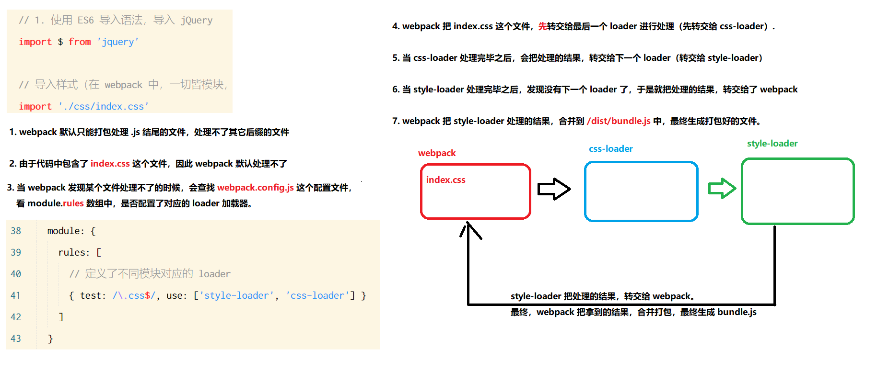

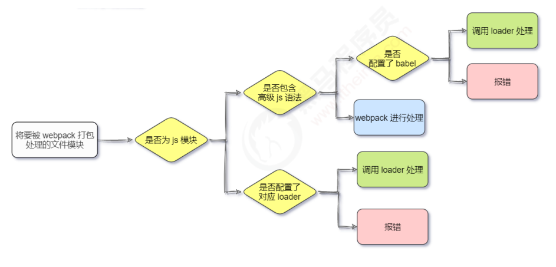

### 3）打包处理案例

**1. css 文件**

1. 运行 `npm i style-loader@3.0.0 css-loader@5.2.6 -D` 命令，安装处理 css 文件的 loader
2. 在 webpack.config.js 的 module -> rules 数组中，添加 loader 规则如下：

```js
module: {			//所有第三方文件模块的匹配规则
	rules: [		//文件后缀名的匹配规则
        { test: /\.css$/, use: ['style-loader','css-loader']}
    ]
}
```

其中，test 表示匹配的文件类型， use 表示对应要调用的 loader。

注意：

- use 数组中指定的 loader 顺序是固定的
- 多个 loader 的调用顺序是：从后往前调用

**2. less文件**

1. 运行 `npm i less-loader@10.0.1 less@4.1.1 -D` 命令
2. 在 webpack.config.js 的 module -> rules 数组中，添加 loader 规则如下：

```js
module: {			//所有第三方文件模块的匹配规则
	rules: [		//文件后缀名的匹配规则
        { test: /\.less$/, use: ['style-loader','css-loader','less-loader']}
    ]
}
```

**3. 高级语法**

webpack 只能打包处理一部分高级的 JavaScript 语法。对于那些 webpack 无法处理的高级 js 语法，需要借 助于 babel-loader 进行打包处理。例如 webpack 无法处理下面的 JavaScript 代码：

```js
//1. 定义了名为info的装饰器
function info(target){
    //2. 为目标添加静态属性info
    target.info = 'Person info'
}

//3.为Person类应用info装饰器
@info
class Person{}

//4.打印Person的静态属性info
console.log(Person.info)
```

1. 运行如下的命令安装对应的依赖包： `npm i babel-loader@8.2.2 @babel/core@7.14.6 @babel/plugin-proposal-decorators@7.14.5 -D`

2. 在 webpack.config.js 的 module -> rules 数组中，添加 loader 规则如下：

```js
module: {			//所有第三方文件模块的匹配规则
	rules: [		//文件后缀名的匹配规则
        { test: /\.js$/, use: 'babel-loader',exclude: /node_modules/}
        //注意：必须使用exclude指定排除项，因为node_modules目录下的第三方包不需要被打包
    ]
}
```

3. 在项目根目录下，创建名为 babel.config.js 的配置文件，定义 Babel 的配置项如下：

```js
module.exports = {
    //声明 babel 可用的插件
    plugins: [['@babel/plugin-proposal-decorators',{legacy: true}]]
}
```

**4. url相关的文件**

1. 运行 npm i url-loader@4.1.1 file-loader@6.2.0 -D 命令
2. 在 webpack.config.js 的 module -> rules 数组中，添加 loader 规则如下：

```js
module: {			//所有第三方文件模块的匹配规则
	rules: [		//文件后缀名的匹配规则
        { test: /\.jpg|png|gif$/, use: ['url-loader?limit=22299']}
    ]
}
```

其中 `?` 之后的是 loader 的参数项：

- limit 用来指定图片的大小，单位是字节（byte）
- 只有 ≤ limit 大小的图片，才会被转为 base64 格式的图片

## 6、打包发布

### 1）为什么要打包发布

项目开发完成之后，需要使用 webpack 对项目进行打包发布，主要原因有以下两点：

- 开发环境下，打包生成的文件存放于内存中，无法获取到最终打包生成的文件 
- 开发环境下，打包生成的文件不会进行代码压缩和性能优化 

为了让项目能够在生产环境中**高性能**的运行，因此需要对项目进行打包发布。

### 2）配置 webpack 的打包发布

在 package.json 文件的 scripts 节点下，新增 build 命令如下：

```json
"scripts": {
	"dev": "webpack", // 开发环境下，运行dev命令
    "build": "webpack --mode production" //项目发布时，运行build命令
}
```

--model 是一个参数项，用来指定 webpack 的运行模式。production 代表生产环境，会对打包生成的文件 进行代码压缩和性能优化。

**注意：**通过 --model 指定的参数项，会覆盖 webpack.config.js 中的 model 选项。

### 3）把 JavaScript 文件统一生成到 js 目录中

在 webpack.config.js 配置文件的 output 节点中，进行如下的配置：

```js
output: {
    path: path.join(__dirname,'dist'),
    // 明确告诉webpack 把生成的bundle.js文件放到dist目录下的js子目录中
    filename: 'js/bundle.js'
}
```

### 4）把图片文件统一生成到 image 目录中

修改 webpack.config.js 中的 url-loader 配置项，新增 outputPath 选项即可指定图片文件的输出路径：

```js
module: {
	rules: [
        { 
            test: /\.jpg|png|gif$/, 
            use: {
                loader: 'url-loader',
                options: {
                    limit: 22288,
                    // 明确指定把打包生成的图片文件，存储到dist目录下的 image 文件夹中
                    outputPath: 'image',
                }
            }
        }
    ]
}
```

### 5）自动清理 dist 目录下的旧文件

为了在每次打包发布时自动清理掉 dist 目录中的旧文件，可以安装并配置 clean-webpack-plugin 插件：

1. 安装 dist目录 的webpack插件

`npm install clean-webpack-plugin@3.0.0 -D`

2. 按需导入插件、得到插件的构造函数之后，创建插件的实例对象(webpack.config.js)

```js
const { CleanWebPackPlugin } = require('clean-webpack-plugin')
const cleanPlugin = new CleanWebpackPlugin()
```

3. 把创建的 cleanPlugin 插件实例对象，挂载到plugins节点中(webpack.config.js)

```js
plugins: [ cleanPlugin ]
```


---

# 二、Vue基础

## 1、Vue简介

### 1）什么是vue

官方给出的概念：Vue (读音 /vjuː/，类似于 view) 是一套用于构建用户界面的前端框架。

### 2）vue的特性

**1. 数据驱动视图**

在使用了 vue 的页面中，vue 会监听数据的变化，从而自动重新渲染页面的结构。示意图如下：

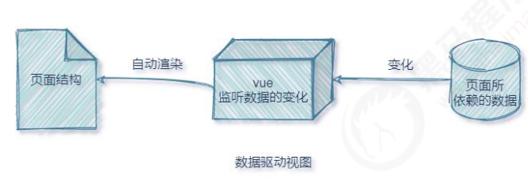

**好处：**当页面数据发生变化时，页面会自动重新渲染！ 

**注意：**数据驱动视图是单向的数据绑定。

**2. 双向数据绑定**

在填写表单时，双向数据绑定可以辅助开发者在不操作 DOM 的前提下，自动把用户填写的内容同步到数据源中。示意图如下：

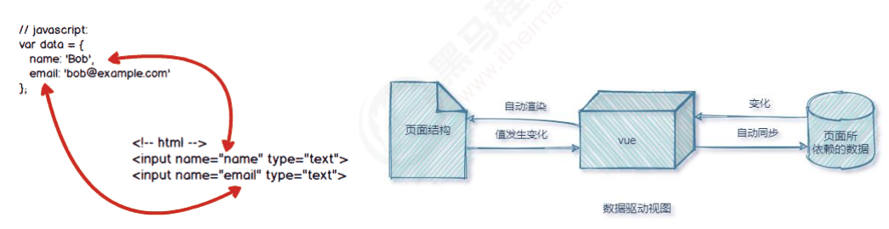

好处：开发者不再需要手动操作 DOM 元素，来获取表单元素最新的值。

### 3）什么是MVVM

MVVM 是 vue 实现数据驱动视图和双向数据绑定的核心原理。MVVM 指的是 Model、View 和 ViewModel， 它把每个 HTML 页面都拆分成了这三个部分，如图所示：

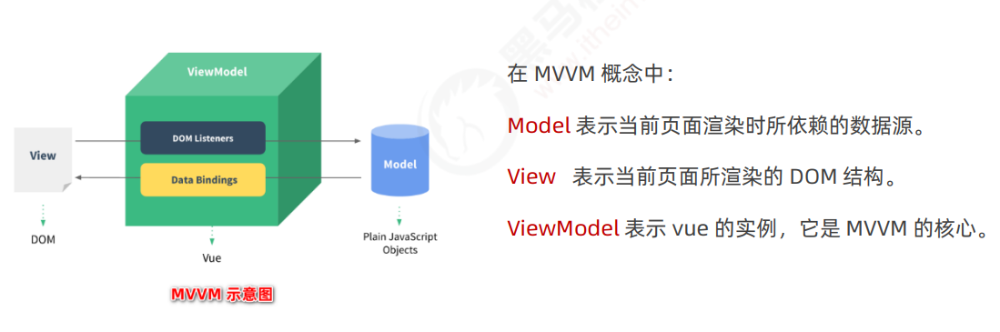

### 4）MVVC的工作原理

ViewModel 作为 MVVM 的核心，是它把当前页面的数据源（Model）和页面的结构（View）连接在了一起。

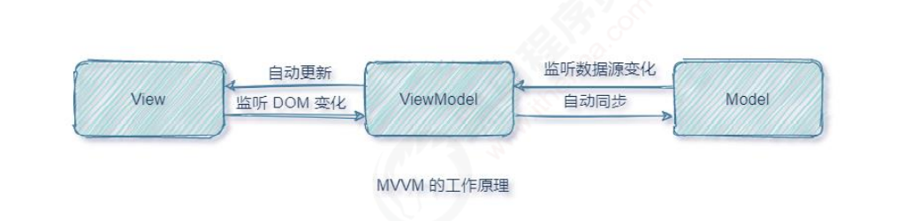

当数据源发生变化时，会被 ViewModel 监听到，VM 会根据最新的数据源自动更新页面的结构；

当表单元素的值发生变化时，也会被 VM 监听到，VM 会把变化过后最新的值自动同步到 Model 数据源中。

### 5）vue的版本

当前，vue 共有 3 个大版本，其中： 

- 2.x 版本的 vue 是目前企业级项目开发中的主流版本 
- 3.x 版本的 vue 于 2020-09-19 发布，生态还不完善，尚未在企业级项目开发中普及和推广 
- 1.x 版本的 vue 几乎被淘汰，不再建议学习与使用

总结：

- 3.x 版本的 vue 是未来企业级项目开发的趋势； 
- 2.x 版本的 vue 在未来（1 ~ 2年内）会被逐渐淘汰。

## 2、vue 的基本使用

### 1）基本使用步骤

1. 导入 vue.js 的 script 脚本文件
2. 在页面中声明一个将要被 vue 所控制的 DOM 区域
3. 创建 vm 实例对象（vue 实例对象）

```html
<body>
    <!-- 2.在页面中声明一个将要被 vue 所控制的DOM区域 -->
    <div id="app">{{username}}</div>
    
    <!-- 1.导入 vue.js 的script脚本 -->
    <script src=""></script>
    <script>
    	const vm = new Vue({
            el: '#app',
            data: {
                username: 'zs'
            }
        })
    </script>
</body>
```

### 2）基本代码与MVVM的对应关系

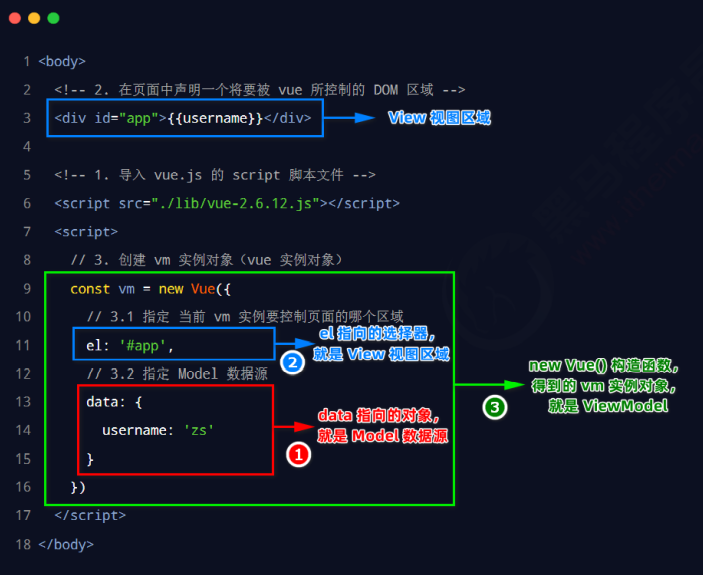

## 3、vue的调试工具

**1. 安装 vue-devtools 调试工具** 

vue 官方提供的 vue-devtools 调试工具，能够方便开发者对 vue 项目进行调试与开发。 

- Chrome 浏览器在线安装 vue-devtools ： https://chrome.google.com/webstore/detail/vuejs-devtools/nhdogjmejiglipccpnnnanhbledajbpd 
- FireFox 浏览器在线安装 vue-devtools ： https://addons.mozilla.org/zh-CN/firefox/addon/vue-js-devtools/

**2. 配置 Chrome 浏览器中的 vue-devtools**

点击 Chrome 浏览器右上角的 按钮，选择更多工具 -> 扩展程序 -> Vue.js devtools 详细信息，并勾选如下的两个选项：

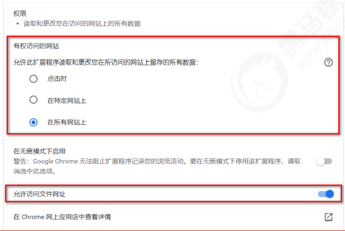

注意：修改完配置项，须重启浏览器才能生效！

**3. 使用 vue-devtools 调试 vue 页面**

在浏览器中访问一个使用了 vue 的页面，打开浏览器的开发者工具，切换到 Vue 面板，即可使用 vue-devtools  调试当前的页面。

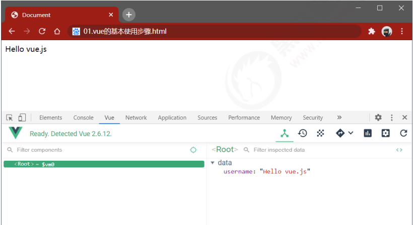

## 4、vue的指令与过滤器

### 1）内容渲染指令

内容渲染指令用来辅助开发者渲染 DOM 元素的文本内容。常用的内容渲染指令有如下 3 个：

#### 1. v-text 

用法示例：

```html
<!-- 把username对应的值，渲染到第一个p标签中 -->
<p v-text="username"></p>

<!-- 把gender 对应的值，渲染到第二个p标签中 -->
<!-- 注意：第二个p标签中，默认的文本“性别”会被gender的值覆盖掉 -->
<p v-text="gender">性别</p>
```

注意：v-text 指令会覆盖元素内默认的值。

#### 2. {{ }} 

vue 提供的 {{ }} 语法，专门用来解决 v-text 会覆盖默认文本内容的问题。这种 {{ }} 语法的专业名称是插值表达 式（英文名为：Mustache）。

```html
<!-- 使用{{}}插值表达式，将对应的值渲染到元素的内容节点中 -->
<!-- 同时保留元素自身的默认值 -->
<p>姓名：{{username}}</p>
<p>性别：{{gender}}</p>
```

注意：相对于 v-text 指令来说，插值表达式在开发中更常用一些！因为它不会覆盖元素中默认的文本内容。

#### 3. v-html

v-text 指令和插值表达式只能渲染纯文本内容。如果要把包含 HTML 标签的字符串渲染为页面的 HTML 元素， 则需要用到 v-html 这个指令。

### 2）属性绑定指令

如果需要为元素的属性动态绑定属性值，则需要用到 v-bind 属性绑定指令。用法示例如下：

```html
<input type="text" v-bind:placeholder="inputValue">
```

**属性绑定指令的简写形式**：

由于 v-bind 指令在开发中使用频率非常高，因此，vue 官方为其提供了简写形式（简写为英文的 : ）。

```html
<input type="text" :placeholder="inputValue">
```

### 3）事件绑定指令

vue 提供了 v-on 事件绑定指令，用来辅助程序员为 DOM 元素绑定事件监听。语法格式如下：

```html
<div id="app">
    <h3>count 的值为：{{count}}</h3> 
    <button v-on:click="addCount">+1</button>
</div>

<script>
    const vm = new Vue({
        el: '#app',
        data: {count: '0'},
        methods:{
			addCount(){
                this.count += 1
            }
        }
    })
</script>
```

注意：原生 DOM 对象有 onclick、oninput、onkeyup 等原生事件，替换为 vue 的事件绑定形式后， 分别为：v-on:click、v-on:input、v-on:keyup。

#### **1. 事件绑定的简写形式**

由于 v-on 指令在开发中使用频率非常高，因此，vue 官方为其提供了简写形式（简写为英文的 @ ）。

```html
<button @click="addCount">+1</button>
```

#### 2. 事件参数对象

在原生的 DOM 事件绑定中，可以在事件处理函数的形参处，接收事件参数对象 event。同理，在 v-on 指令 （简写为 @ ）所绑定的事件处理函数中，同样可以接收到事件参数对象 event，示例代码如下：

```html
<div id="app">
    <h3>count 的值为：{{count}}</h3> 
    <button v-on:click="addCount">+1</button>
</div>

<script>
    const vm = new Vue({
        el: '#app',
        data: {count: '0'},
        methods:{
			addCount(e){
                const nowBgColor = e.target.style.backgroundColor
                e.target.style.backgroundColor = nowBgColor === 'red' ? '' : 'red'
                this.count += 1
            }
        }
    })
</script>
```

#### 3. 绑定事件并传参

在使用 v-on 指令绑定事件时，可以使用 ( ) 进行传参，示例代码如下：

```html
<h3>count 的值为：{{count}}</h3> 
<button v-on:click="addCount(2)">+2</button>
// ---分割线---
<script>
methods:{
	// 在形参出用step接受传递过来的参数值
	addNewCount(step){
		this.count += step
	}
}
</script>
```

#### 4. $event

$event 是 vue 提供的特殊变量，用来表示原生的事件参数对象 event。$event 可以解决事件参数对象 event  被覆盖的问题。示例用法如下：

```html
<h3>count 的值为：{{count}}</h3> 
<button v-on:click="addCount(2,$event)">+2</button>
// ---分割线---
<script>
methods:{
	// 在形参出用step接受传递过来的参数值
	addNewCount(step,e){
       const nowBgColor = e.target.style.backgroundColor
       e.target.style.backgroundColor = nowBgColor === 'cyan'? '' : 'cyan'
		this.count += step
	}
}
</script>
```

#### 5. 事件修饰符

在事件处理函数中调用 event.preventDefault() 或 event.stopPropagation() 是非常常见的需求。因此， vue 提供了事件修饰符的概念，来辅助程序员更方便的对事件的触发进行控制。常用的 5 个事件修饰符如下：

| 事件修饰符 | 说明                                                  |
| ---------- | ----------------------------------------------------- |
| .prevent   | 阻止默认行为(例如：阻止a链接的跳转、阻止表单的提交等) |
| .stop      | 阻止事件冒泡                                          |
| .capture   | 以捕获模式触发当前的事件处理函数                      |
| .once      | 绑定的事件只触发1次                                   |
| .self      | 只有在 event.target 是当前元素自身时触发事件处理函数  |

语法格式如下：

```html
<!-- 触发click点击事件时，阻止a链接的默认跳转行为 -->
<a href="https://www.baidu.com" @click.prevent="onLinkClick">百度首页</a>
```

#### 6. 按键修饰符

在监听键盘事件时，我们经常需要判断详细的按键。此时，可以为键盘相关的事件添加按键修饰符，例如：

```html
<!-- 只有在`key`是`Enter`时调用`vm.submit()` -->
<input @keyup.enter="submit">

<!-- 只有在`key`是`Ecs`时调用`vm.clearInput()` -->
<input @keyup.ecs=clearInput>
```

### 4）双向数据绑定

vue 提供了 v-model 双向数据绑定指令，用来辅助开发者在不操作 DOM 的前提下，快速获取表单的数据。

```html
<p>用户名是：{{username}}</p>
<input type="text" v-model="username"/>
```

#### v-model 指令的修饰符

为了方便对用户输入的内容进行处理，vue 为 v-model 指令提供了 3 个修饰符，分别是：

| 修饰符  | 作用                           |
| ------- | ------------------------------ |
| .number | 自动将用户的输入值转为数值类型 |
| .trim   | 自动过滤用户输入的首尾空白字符 |
| .lazy   | 在“change”时而非“input”时更新  |

```html
<input type="text" v-model.number="n1">
```

### 5）条件渲染指令

条件渲染指令用来辅助开发者按需控制 DOM 的显示与隐藏。条件渲染指令有如下两个，分别是：

- v-if
- v-show

#### 1. v-if 和 v-show 的区别

**实现原理不同：**

- v-if 指令会动态地创建或移除 DOM 元素，从而控制元素在页面上的显示与隐藏； 
- v-show 指令会动态为元素添加或移除 style="display: none;" 样式，从而控制元素的显示与隐藏； 

**性能消耗不同：** 

v-if 有更高的切换开销，而 v-show 有更高的初始渲染开销。

因此：

- 如果需要非常频繁地切换，则使用 v-show 较好
- 如果在运行时条件很少改变，则使用 v-if 较好

#### 2. v-else

v-if 可以单独使用，或配合 v-else 指令一起使用：

```html
<div v-if="Math.random() > 0.5">
	随机数大于0.5
</div>
<div v-else>
	随机数小于等于0.5
</div>
```

注意：v-else 指令必须配合 v-if 指令一起使用，否则它将不会被识别！

#### 3. v-else-if

v-else-if 指令，顾名思义，充当 v-if 的“else-if 块”，可以连续使用：

```html
<div v-if="type === 'A'">优秀</div>
<div v-else-if="type === 'B'">良好</div>
<div v-else-if="type === 'C'">一般</div>
<div v-else>差</div>
```

注意：v-else-if 指令必须配合 v-if 指令一起使用，否则它将不会被识别！

### 6）列表渲染指令

vue 提供了 v-for 列表渲染指令，用来辅助开发者基于一个数组来循环渲染一个列表结构。v-for 指令需要使 用 item in items 形式的特殊语法，其中：

- items 是待循环的数组
- item 是被循环的每一项

```html
<ul>
    <li v-for="item in list">姓名是：{{item.name}}</li>
</ul>
// ---分割线
<script>
	data:{
        list:[
            { id: 1, name: 'zs' },
            { id: 2, name: 'ls' }
        ]
    }
</script>
```

#### 1. v-for 中的索引

v-for 指令还支持一个可选的第二个参数，即当前项的索引。语法格式为 (item, index) in items，示例代码如下：

```html
<ul>
    <li v-for="(item,index) in list">索引是：{{index}}，姓名是：{{item.name}}</li>
</ul>
// ---分割线---
<script>
	data:{
        list:[
            { id: 1, name: 'zs' },
            { id: 2, name: 'ls' }
        ]
    }
</script>
```

注意：v-for 指令中的 item 项和 index 索引都是形参，可以根据需要进行重命名。例如 (user, i) in userlist。

#### 2. 使用 key 维护列表的状态

当列表的数据变化时，默认情况下，vue 会尽可能的复用已存在的 DOM 元素，从而提升渲染的性能。但这种 默认的性能优化策略，会导致有状态的列表无法被正确更新。 **为了给 vue一个提示，以便它能跟踪每个节点的身份，从而在保证有状态的列表被正确更新的前提下，提升渲染的性能。**此时，需要为每项提供一个唯一的 key 属性：

```html
<ul>
    <li v-for="(user,id) in userList" :key="user.id">
        <input type="checkbox" />
         姓名：{{user.name}}
    </li>
</ul>
```

> **key 的注意事项：**
>
> - key 的值只能是字符串或数字类型
> - key 的值必须具有唯一性（即：key 的值不能重复）
> - 建议把数据项 id 属性的值作为 key 的值（因为 id 属性的值具有唯一性）
> - 使用 index 的值当作 key 的值没有任何意义（因为 index 的值不具有唯一性）
> - 建议使用 v-for 指令时一定要指定 key 的值（既提升性能、又防止列表状态紊乱）

### 7）过滤器

过滤器（Filters）是 vue 为开发者提供的功能，常用于文本的格式化。过滤器可以用在两个地方：插值表达式 和 v-bind 属性绑定。

过滤器（Filters）是 vue 为开发者提供的功能，常用于文本的格式化。过滤器可以用在两个地方：插值表达式 和 v-bind 属性绑定。

```html
<!-- 在双花括号中通过“管道符”调用 capitalize 过滤器，对 message 的值进行格式化 -->
<p>{{message | capitalize}}</p>

<!-- 在 v-bind 中通过“管道符”调用 formatId 过滤器，对 rawId 的值进行格式化 -->
<div v-bind:id="rawId | formatId"></div>
```

#### 1）定义过滤器

在创建 vue 实例期间，可以在 filters 节点中定义过滤器，示例代码如下：

```js
const vm = new Vue({
    el: '#app',
    data: {
        message: 'hello vue.js',
        info: 'title info'
    },
    filters: {			//在filters 节点下定义“过滤器”
        capitalize(str){
            return str.charAt(0).toUpperCase() + str.slice(1)
        }
    }
})
```

#### 2）私有过滤器和全局过滤器

在 filters 节点下定义的过滤器，称为“私有过滤器”，因为它只能在当前 vm 实例所控制的 el 区域内使用。 如果希望在多个 vue 实例之间共享过滤器，则可以按照如下的格式定义全局过滤器：

```vue
Vue.filter('capitalize',(str) => {
	return str.charAt(0).toUpperCase() + str.slice(1)
})
```

#### 3）连续调用多个过滤器

过滤器可以串联地进行调用，例如：

```html
{{message | filterA | filterB }}
```

#### 4）过滤器传参

过滤器的本质是 JavaScript 函数，因此可以接收参数，格式如下：

```html
<p>{{ message | filterA(arg1,arg2)}}</p>

Vue.filter('filterA',(msg,arg1,arg2) => {
	//过滤器的代码逻辑
})
```

#### 5）过滤器的兼容性

过滤器仅在 vue 2.x 和 1.x 中受支持，在 vue 3.x 的版本中剔除了过滤器相关的功能。 

在企业级项目开发中：

- 如果使用的是 2.x 版本的 vue，则依然可以使用过滤器相关的功能 
- 如果项目已经升级到了 3.x 版本的 vue，官方建议使用计算属性或方法代替被剔除的过滤器功能

## 5、侦听器

### 1）什么是侦听器

watch 侦听器允许开发者监视数据的变化，从而针对数据的变化做特定的操作。

```js
const vm = new Vue({
	el: '#app',
	data: { username: ''},
	watch: {
		username(newVal,oldVal){
			console.log(newVal,oldVal)
		}
	}
})
```

### 2） immediate 选项

默认情况下，组件在初次加载完毕后不会调用 watch 侦听器。如果想让 watch 侦听器立即被调用，则需要使 用 immediate 选项。示例代码如下：

```js
watch: {
    username: {
        // handler 是固定写法，表示当 username 的值变化时，自动调用 handler 处理函数
        handler: async function (newVal) {
            if (newVal === '') return
            const { data: res } = await axios.get('https://www.escook.cn/api/finduser/' + newVal)
            console.log(res)
        },
        // 表示页面初次渲染好之后，就立即触发当前的 watch 侦听器
        immediate: true
    }
}
```

### 3）deep选项

如果 watch 侦听的是一个对象，如果对象中的属性值发生了变化，则无法被监听到。此时需要使用 deep 选 项，代码示例如下：

```js
watch: {
    username: {
        handler: async function (newVal) {
            console.log(newVal)
        },
        deep: true
    }
}
```

### 4）监听对象单个属性的变化

如果只想监听对象中单个属性的变化，则可以按照如下的方式定义 watch 侦听器：

```js
const vm = new Vue({
	el: '#app',
	data: {
        info: { username: 'admin'}
    },
	watch: {
		'info.username':{
            handler(newVal){
                console.log(newVal)
            }
        }
	}
})
```

## 6、计算属性

### 1）什么是计算属性

计算属性指的是通过一系列运算之后，最终得到一个属性值。 这个动态计算出来的属性值可以被模板结构或 methods 方法使用。示例代码如下：

```js
var vm = new Vue({
    el: '#app',
    data:{
        r: 0, g: 0, b: 0
    },
    computed:{
        rgb(){return `rgb(${this.r},${this.g},${this.b})`}
    },
    methods:{
        show(){ console.log(this.rgb) }
    }
})
```

### 2）计算属性的特点

- 虽然计算属性在声明的时候被定义为方法，但是计算属性的本质是一个属性
- 计算属性会缓存计算的结果，只有计算属性依赖的数据变化时，才会重新进行运算

## 7、vue-cli

> **单页面应用程序**
>
> 单页面应用程序（英文名：Single Page Application）简称 SPA，顾名 思义，指的是一个 Web 网站中只有唯一的一个 HTML 页面，所有的功能与交互都在这唯一的一个页面内完成。
>
> 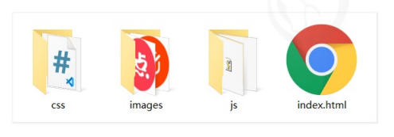

### 1）什么是vue-cli

vue-cli 是 Vue.js 开发的标准工具。它简化了程序员基于 webpack 创建工程化的 Vue 项目的过程。 

引用自 vue-cli 官网上的一句话： 程序员可以专注在撰写应用上，而不必花好几天去纠结 webpack 配置的问题。

中文官网：https://cli.vuejs.org/zh/

### 2）安装和使用

vue-cli 是 npm 上的一个全局包，使用 npm install 命令，即可方便的把它安装到自己的电脑上： 

`npm install -g @vue/cli`

基于 vue-cli 快速生成工程化的 Vue 项目：

`vue create 项目的名称`

### 3）vue 项目的运行流程

在工程化的项目中，vue 要做的事情很单纯：通过 main.js 把 App.vue 渲染到 index.html 的指定区域中。 

其中： 

1. App.vue 用来编写待渲染的模板结构 
2. index.html 中需要预留一个 el 区域 
3. main.js 把 App.vue 渲染到了 index.html 所预留的区域中

## 8、vue组件

### 1）什么是组件化开发

组件化开发指的是：根据封装的思想，把页面上可重用的 UI 结构封装为组件，从而方便项目的开发和维护。

### 2）vue 中的组件化开发 

- vue 是一个支持组件化开发的前端框架。 
- vue 中规定：组件的后缀名是 .vue。

### 3）vue组件的三个组成部分

每个 .vue 组件都由 3 部分构成，分别是：

- template -> 组件的模板结构
- script -> 组件的 JavaScript 行为
- style -> 组件的样式

其中，每个组件中必须包含 template 模板结构，而 script 行为和 style 样式是可选的组成部分。

#### 1. template

vue 规定：每个组件对应的模板结构，需要定义到`<template>` 节点中。

```vue
<template>
	
</template>
```

注意：

- template 是 vue 提供的容器标签，只起到包裹性质的作用，它不会被渲染为真正的 DOM 元素；
- template 中只能包含唯一的根节点。

#### 2. script

vue 规定：开发者可以在`<script>` 节点中封装组件的 JavaScript 业务逻辑。

```vue
<script>
    export default {}
</script>
```

> **.vue 组件中的 data 必须是函数**
>
> vue 规定：.vue 组件中的 data 必须是一个函数，不能直接指向一个数据对象。 因此在组件中定义 data 数据节点时，下面的方式是错误的：
>
> ```js
> data: {
>     count: 0
> }
> ```
>
> 会导致多个组件实例共用同一份数据的问题，请参考官方给出的示例： https://cn.vuejs.org/v2/guide/components.html#data-必须是一个函数

#### 3. script

vue 规定：组件内的`<style>`节点是可选的，开发者可以在`<style>`节点中编写样式美化当前组件的 UI 结构。

```vue
<style>
</style>
```

> **让 style 中支持 less 语法**
>
> 在`<style>`标签上添加 lang="less" 属性，即可使用 less 语法编写组件的样式：
>
> ```vue
> <style lang="less">
> </style>
> ```

### 4）组件之间的父子关系

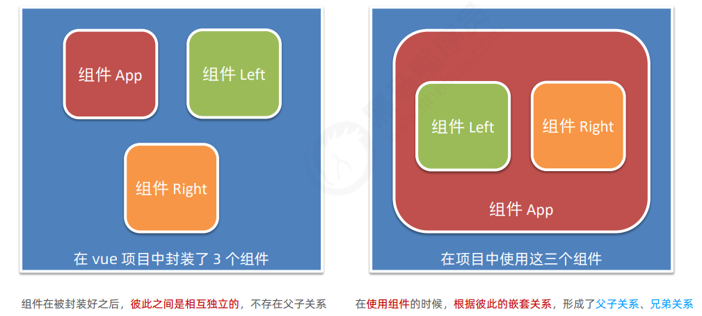

#### 1. 使用组件的三个步骤

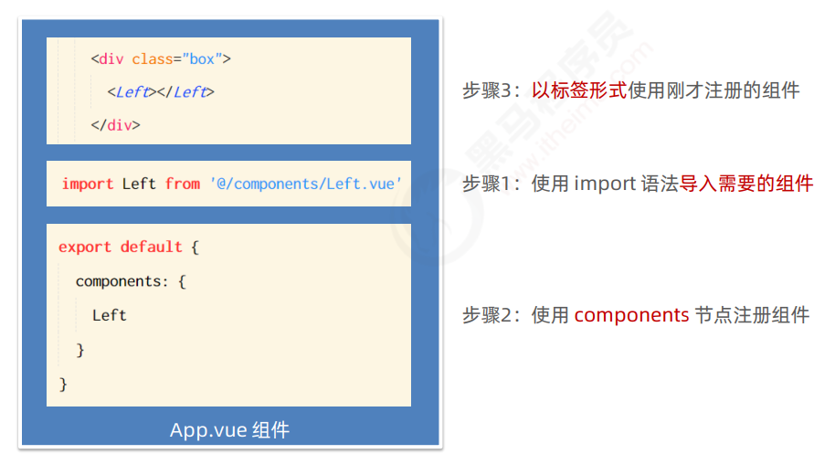

注意：通过componts注册的是私有子组件。

#### 2. 注册全局组件

在 vue 项目的 main.js 入口文件中，通过 Vue.component() 方法，可以注册全局组件。示例代码如下：

```js
import Count from '@/components/Count.vue'

Vue.component('MyCount',Count)
```

### 5）组件的props

props 是组件的自定义属性，在封装通用组件的时候，合理地使用 props 可以极大的提高组件的复用性！ 它的语法格式如下：

```js
export default {
    // 组件的自定义属性
    props: ['自定义属性A','自定义属性B','其他自定义属性...']
    
    // 组件的私有数据
    data(){
        return{}
    }
}
```

#### 1. props 是只读的

vue 规定：组件中封装的自定义属性是只读的，程序员不能直接修改 props 的值。否则会直接报错：

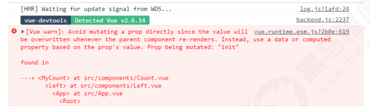

要想修改 props 的值，可以把 props 的值转存到 data 中，因为 data 中的数据都是可读可写的！

```js
props: ['init']
    
// 组件的私有数据
data(){
    return{
        count: this.init	//把 this.init 的值转存到count
    }
}
```

#### 2. default 默认值

在声明自定义属性时，可以通过 default 来定义属性的默认值。示例代码如下：

```js
export default {
    props: {
        init: {
            default: 0
        }
    }
}
```

#### 3. type值类型

在声明自定义属性时，可以通过 type 来定义属性的值类型。示例代码如下：

```js
export default {
    props: {
        init: {
            default: 0,
            type: Number
        }
    }
}
```

#### 4. props的required必填项

在声明自定义属性时，可以通过 required 选项，将属性设置为必填项，强制用户必须传递属性的值。示例代码如下：

```js
export default {
    props: {
        init: {
            type: Number,
            required: true
        }
    }
}
```

### 6）组件之间的样式冲突问题

默认情况下，写在 .vue 组件中的样式会全局生效，因此很容易造成多个组件之间的样式冲突问题。 

导致组件之间样式冲突的根本原因是：

1. 单页面应用程序中，所有组件的 DOM 结构，都是基于唯一的 index.html 页面进行呈现的；
2. 每个组件中的样式，都会影响整个 index.html 页面中的 DOM 元素。

#### 1. scoped属性

vue 为 style 节点提供了 scoped 属性，从而防止组件之间的样式冲突问题：

<style scoped>
</style>

#### 2. 样式穿透

如果给当前组件的 style 节点添加了 scoped 属性，则当前组件的样式对其子组件是不生效的。如果想让某些样 式对子组件生效，可以使用 /deep/ 深度选择器。

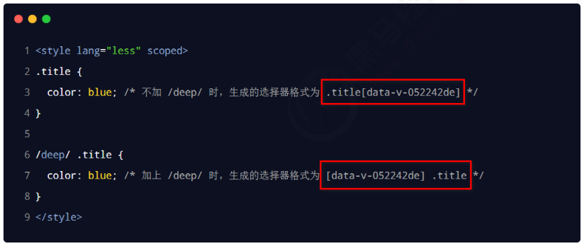


---

# 三、生命周期

## 1、组件的生命周期

生命周期（Life Cycle）是指一个组件从创建 -> 运行 -> 销毁的整个阶段，强调的是一个时间段。 

生命周期函数：是由 vue 框架提供的内置函数，会伴随着组件的生命周期，自动按次序执行。

注意：生命周期强调的是时间段，生命周期函数强调的是时间点。

## 2、组件生命周期函数的分类

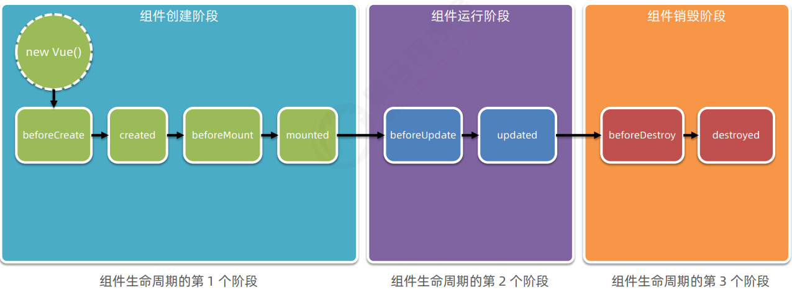


## 3、组件间的数据共享

### 1）组件之间的关系

在项目开发中，组件之间的最常见的关系分为如下两种：

1. 父子关系
2. 兄弟关系

### 2）父子组件的数据共享

父子组件之间的数据共享又分为： ① 父 -> 子共享数据 ② 子 -> 父共享数据

#### 1. 父组件向子组件共享数据 

父组件向子组件共享数据需要使用自定义属性。示例代码如下：

```vue
<Son :msg="message" :user="userinfo"></Son>

<script>
data(){
	return{
		message: 'hello vue.js',
		userInfo: { name: 'zs', age: 20 }
	}
}
</script>
```

子组件：

```vue
<template>
	<div>
        <h5>Son 组件</h5>
        <p>父组件传递过来的 msg 值是：{{ msg }}</p>
        <p>父组件传递过来的 user 值是：{{ user }}</p>
    </h5>
    </div>
</template>
<script>
    props:['msg','user']
</script>
```

#### 2. 子组件向父组件共享数据

子组件向父组件共享数据使用自定义事件。示例代码如下：

子组件：

```js
export default{
    data(){
        retrun { count:0 }
    },
    methods:{
        add(){
            this.count += 1
            // 修改数据时，通过$emit()触发自定义事件
            this.$emit('numchange',this.count)
        }
    }
}
```

父组件

```js
<Son @numchange="getNewCount"></Son>

export default{
	data(){
		return { countFormSon: 0 }
	},
	methods:{
		getNewCount(val){
			this.countFrom = val
		}
	}
}
```

#### 3. 兄弟组件之间的数据共享

在 vue2.x 中，兄弟组件之间数据共享的方案是 EventBus。

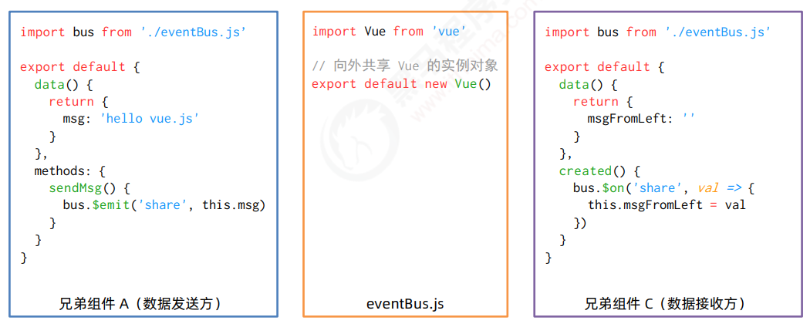

**EventBus 的使用步骤**

1. 创建 eventBus.js 模块，并向外共享一个 Vue 的实例对象
2. 在数据发送方，调用 bus.$emit('事件名称', 要发送的数据) 方法触发自定义事件
3. 在数据接收方，调用 bus.$on('事件名称', 事件处理函数) 方法注册一个自定义事件

## 4、ref引用

### 1）什么是ref引用

ref 用来辅助开发者在不依赖于 jQuery 的情况下，获取 DOM 元素或组件的引用。

每个 vue 的组件实例上，都包含一个 $refs 对象，里面存储着对应的 DOM 元素或组件的引用。默认情况下， 组件的 $refs 指向一个空对象。

### 2）使用ref引用DOM元素

```html
<h3 ref="myh3">MyRef 组件</h3>
<button @click="getRef">获取 $refs 引用</button>

<script>
methods:{
	getRef(){
		console.info(this.$ref.myh3)
		this.$refs.myh3.style.color = 'red'
	}
}
</script>
```

### 3）使用 ref 引用组件实例

如果想要使用 ref 引用页面上的组件实例，则可以按照如下的方式进行操作：

```html
<my-counter ref="counterRef"></my-counter>
<button @click="getRef">获取 $refs 引用</button>

<script>
methods:{
	getRef(){
		console.info(this.$ref.counterRef)
		// 通过 $refs 调用组件的 add 方法
		this.$refs.counterRef.add()
	}
}
</script>
```

> **this.$nextTick(cb) 方法**
>
> 组件的 $nextTick(cb) 方法，会把 cb 回调推迟到下一个 DOM 更新周期之后执行。通俗的理解是：等组件的 DOM 更新完成之后，再执行 cb 回调函数。从而能保证 cb 回调函数可以操作到最新的 DOM 元素。


---

# 四、Vue进阶

## 1、动态组件

### 1）什么是动态组件

动态组件指的是动态切换组件的显示与隐藏。

### 2）如何实现动态组件渲染

vue 提供了一个内置的 `<component>` 组件，专门用来实现动态组件的渲染。示例代码如下：

```vue
<template>
    <div>
        <button @click="cp = 'Left'">
            显示左侧
        </button>
        <button @click="cp = 'Right'">
            显示右侧
        </button>
        <component :is="cp"></component>   //动态主件绑定需要通过 :is
    </div>
</template>
<script>
    export default{
    	data(){
        return{
            cp:'Left'
        	}
    	 }
    }
</script>
```

#### 1. 使用 keep-alive 保持状态

默认情况下，切换动态组件时无法保持组件的状态。此时可以使用 vue 内置的  组件保持动态组 件的状态。示例代码如下：

```vue
<keep-alive>
    <component :is="cp"></component>   //动态主件绑定需要通过 :is
</keep-alive>
```

#### 2. keep-alive 对应的生命周期函数

当组件被缓存时，会自动触发组件的 deactivated 生命周期函数。

当组件被激活时，会自动触发组件的 activated 生命周期函数。

```js
export default{
    created() { console.log("组件被创建了") },
    destoryed() { console.log("组件被销毁了") },
    
    activated() { console.log("组件被激活了") },
    deactivated() { console.log("组件被缓存了") }
}
```

#### 3. keep-alive 的 include 属性

include 属性用来指定：只有名称匹配的组件会被缓存。多个组件名之间使用英文的逗号分隔：

```vue
<keep-alive include = "MyLeft, MyRight">
    <component :is="cp"></component>
</keep-alive>
```

#### 4. keep-alive 的 exclude 属性

```vue
<keep-alive exclude = "MyRight">       //将Right主件排除缓存
    <component :is="cp"></component>
</keep-alive>
```

## 2、插槽

### 1）什么是插槽

插槽（Slot）是 vue 为组件的封装者提供的能力。允许开发者在封装组件时，把不确定的、希望由用户指定的部分定义为插槽。

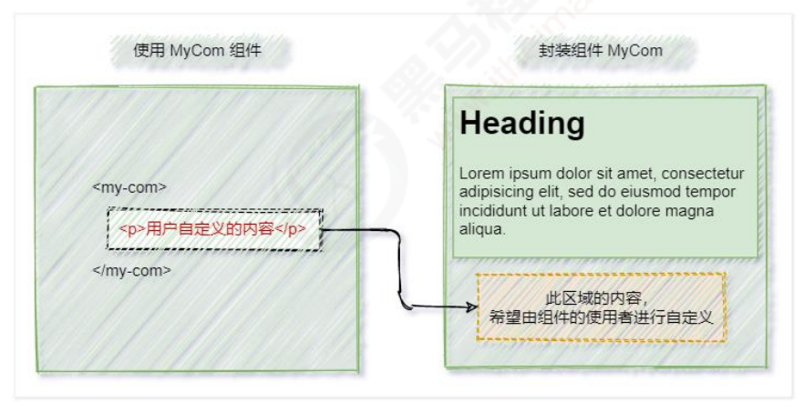

可以把插槽认为是组件封装期间，为用户预留的内容的占位符。

### 2）体验插槽的基础用法

在封装组件时，可以通过  元素定义插槽，从而为用户预留内容占位符。示例代码如下：

```vue
<template>
	<p>这是 MyCom1 组件的第1个p标签</p>
	<slot></slot>
	<p>这是 MyCom1 组件最后一个p标签</p>
</template>
```

```vue
<my-com-1>
	<p>用户自定义</p>
</my-com-1>
```

#### 1. 没有预留插槽的内容会被丢弃

如果在封装组件时没有预留任何  插槽，则用户提供的任何自定义内容都会被丢弃。示例代码如下：

```vue
<template>
	<p>这是 MyCom1 组件的第1个p标签</p>
	<p>这是 MyCom1 组件最后一个p标签</p>
</template>
```

```vue
<my-com-1>
   <!-- 自定义的内容会被丢弃 -->
	<p>用户自定义</p>
</my-com-1>
```

#### 2. 后备内容

封装组件时，可以为预留的  插槽提供后备内容（默认内容）。如果组件的使用者没有为插槽提供任何 内容，则后备内容会生效。示例代码如下：

```vue
<template>
	<p>这是 MyCom1 组件的第1个p标签</p>
	<slot>这是后备内容</slot>
	<p>这是 MyCom1 组件最后一个p标签</p>
</template>
```

### 3）具名插槽

如果在封装组件时需要预留多个插槽节点，则需要为每个  插槽指定具体的 name 名称。这种带有具体 名称的插槽叫做“具名插槽”。示例代码如下：

```html
<div class="container">
    <header>
    	<slot name="header"></slot>
    </header>
    <main>
    	<slot name="main"></slot>
    </main>
    <footer>
    	<slot name="footer"></slot>
    </footer>
</div>
```

#### 1. 为具名插槽提供内容

```html
<my-com-2>
	<template v-slot:header>
    	<h1>滕王阁序</h1>
    </template>
    
    <template v-slot:default>
    	<p>豫章故郡，洪都新府。</p>
       <p>星分翼轸，地接衡庐。</p>
       <p>襟三江而带五湖，控蛮荆而引瓯越。</p> 
    </template>
    
    <template v-slot:footer>
    	<p></p>
    </template>
</my-com-2>
```

#### 2. 具名插槽的简写形式

跟 v-on 和 v-bind 一样，v-slot 也有缩写，即把参数之前的所有内容 (v-slot:) 替换为字符 #。例如 v-slot:header 可以被重写为 #header：

### 4）作用域插槽

在封装组件的过程中，可以为预留的插槽绑定 props 数据，这种带有 props 数据的叫做“作用域插槽”。示例代码如下：

```vue
<tbody>
   <!-- 下面的 slot 是一个作用域插槽 -->
	<slot v-for="item in list" :user="item"></slot>
</tbody>
```

#### 1. 使用作用域插槽

可以使用 v-slot: 的形式，接收作用域插槽对外提供的数据。示例代码如下：

```vue
<my-com-3>
   <!-- 1.接受作用域插槽对外提供数据 -->
	<template v-slot:default="scope">
		<tr>
            <!-- 2.使用作用域插槽的数据 -->
            <td>{{scope}}</td>
       </tr>
    </template>
</my-com-3>
```

#### 2. 解构插槽 Prop

作用域插槽对外提供的数据对象，可以使用解构赋值简化数据的接收过程。示例代码如下：

```vue
<my-com-3>
   	<!-- v-slot: 可以简写成 # -->
    <!-- 作用域插槽对外提供的数据对象，可以通过“解构赋值”简化接受的过程 -->
	<template #default="{user}">
		<tr>
            <td>{{user.id}}</td>
            <td>{{user.name}}</td>
            <td>{{user.state}}</td>
       </tr>
    </template>
</my-com-3>
```

## 3、自定义指令

### 1）什么是自定义指令

vue 官方提供了 v-text、v-for、v-model、v-if 等常用的指令。除此之外 vue 还允许开发者自定义指令。

### 2）自定义指令的分类

vue 中的自定义指令分为两类，分别是：

#### 1. 私有自定义指令

在每个 vue 组件中，可以在 directives 节点下声明私有自定义指令。示例代码如下：

```vue
<template>
	<!-- 声明自定义指令时，指令的名字是 color -->
	<!-- 使用自定义指令时，需要加上v-指令 -->
	<h1 v-color> APP组件 </h1>
</template>
<script>
export default{
    directives:{
        color: {
            // 为绑定到 HTML 元素设置红色的文字
            bind(el){
                // 形参的el是绑定了此指令的、原生的 DOM 对象
                el.style.color = 'red'
            }
        }
	}
}
</script>
```

在 template 结构中使用自定义指令时，可以通过等号（=）的方式，为当前指令动态绑定参数值：

```vue
<template>
	<h1 v-color="color"> APP组件 </h1>
</template>
<script>
export default{
    data(){
     	return {
            color: 'red'	//定义 color 颜色
        }   
    }
}
</script>
```

在声明自定义指令时，可以通过形参中的第二个参数，来接收指令的参数值：

```js
directives:{
    color: {
        bind(el, binding){
            // 通过binding对象的.value属性，获取动态的参数值
            el.style.color = binding.value
        }
    }
}
```

bind 函数只调用 1 次：当指令第一次绑定到元素时调用，当 DOM 更新时 bind 函数不会被触发。 update 函 数会在每次 DOM 更新时被调用。示例代码如下：

```js
directives:{
    color: {
        //当指令第一次被绑定到元素时被调用
        bind(el, binding){
            el.style.color = binding.value
        },
        //每次 DOM 更新时被调用
        update(el,binding){
            el.style.color = binding.value
        }
    }
}
```

如果 insert 和update 函数中的逻辑完全相同，则对象格式的自定义指令可以简写成函数格式：

```js
directives:{
    color(el,binding) {
		el.style.color = binding.value
    }
}
```

#### 2. 全局自定义指令

全局共享的自定义指令需要通过“Vue.directive()”进行声明，示例代码如下：

```js
// 参数1：字符串，表示全局自定义指令的名字
// 参数2：对象，用来接收指令的参数值
Vue.directive('color',function(el,binding){
	el.style.color = binding.value
})
```

# 五、路由

## 1、前端路由的概念与原理

### 1）什么是路由

路由（英文：router）就是对应关系。

### 2）SPA与前端路由

SPA 指的是一个 web 网站只有唯一的一个 HTML 页面，所有组件的展示与切换都在这唯一的一个页面内完成。 此时，不同组件之间的切换需要通过前端路由来实现。

结论：在 SPA 项目中，不同功能之间的切换，要依赖于前端路由来完成！

### 3）什么是前端路由

通俗易懂的概念：Hash 地址与组件之间的对应关系。

### 4）前端路由的工作方式

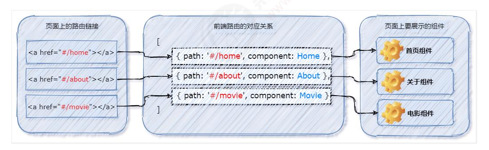

1. 用户点击了页面上的路由链接
2. 导致了 URL 地址栏中的 Hash 值发生了变化
3. 前端路由监听了到 Hash 地址的变化
4. 前端路由把当前 Hash 地址对应的组件渲染都浏览器中

**结论：**前端路由，指的是 Hash 地址与组件之间的对应关系！

## 2、vue-router的基本用法

### 1）什么是vue-router

vue-router 是 vue.js 官方给出的路由解决方案。它只能结合 vue 项目进行使用，能够轻松的管理 SPA 项目中组件的切换。

vue-router 是 vue.js 官方给出的路由解决方案。它只能结合 vue 项目进行使用，能够轻松的管理 SPA 项目 中组件的切换。

### 2）vue-router安装和配置的步骤

#### 1. 在项目中安装 vue-router

在 vue2 的项目中，安装 vue-router 的命令如下：

`npm i vue-router@3.5.2 -S`

#### 2. 创建路由模块

在 src 源代码目录下，新建 router/index.js 路由模块，并初始化如下的代码：

```js
// 1.导入Vue和VueRouter的包
import Vue from 'vue'
import VueRouter from 'vue-router'

// 2.调用Vue.use()函数，把 VueRouter 安装为 Vue 的插件
Vue.use(VueRouter)

// 3.创建路由的实例对象
const router = new VueRouter()

// 4.向外共享路由的实例对象
export default router
```

#### 3. 导入并挂载路由模块

在 src/main.js 入口文件中，导入并挂载路由模块。示例代码如下：

```js
import Vue from 'vue'
import App from './App.vue'
// 1.导入路由模块
import router from '@/router'

new Vue({
    render: h => h(App),
    //2.挂载路由模块
    router: router
}).$mount('#app')
```

#### 4. 声明路由链接和占位符

在 src/App.vue 组件中，使用 vue-router 提供的  和  声明路由链接和占位符：

```vue
<template>
	<div class="app-container">
        <h1>App组件</h1>
        <!-- 1.定义路由链接 -->
        <router-link to="/home">首页</router-link>
        <router-link to="/movie">电影</router-link>
        <router-link to="/about">关于</router-link>
        
        <hr/>
        
        <!-- 2.定义路由的占位符 -->
        <router-view></router-view>
    </div>
</template>
```

#### 5. 声明路由的匹配规则

在 src/router/index.js 路由模块中，通过 routes 数组声明路由的匹配规则。示例代码如下：

```js
// 1. 导入需要使用路由切换展示的组件
import Home from '@/components/Home.vue'
import Home from '@/components/Home.vue'
import Home from '@/components/Home.vue'

// 2. 创建路由的实例对象
const router = new VueRouter({
    // 在routes数组中，声明路由的匹配规则
    routes:[
        //path 表示匹配的hash地址；component表示要展示的路由组件
        { path: '/home', component: Home },
        { path: '/movie', component: Movie },
        { path: '/about', component: About }
    ]
})
```

## 3、vue-router的常见用法

### 1）路由重定向

路由重定向指的是：用户在访问地址 A 的时候，强制用户跳转到地址 C ，从而展示特定的组件页面。 通过路由规则的 redirect 属性，指定一个新的路由地址，可以很方便地设置路由的重定向：

```js
const router = new VueRouter({
    // 在routes数组中，声明路由的匹配规则
    routes:[
        //当用户访问 / 时，通过redirect 属性跳转到/home对应的路由规则
        { path: '/',redirect: '/home' }
        { path: '/home', component: Home },
        { path: '/movie', component: Movie },
        { path: '/about', component: About }
    ]
})
```

### 2）嵌套路由

通过路由实现组件的嵌套展示，叫做嵌套路由。

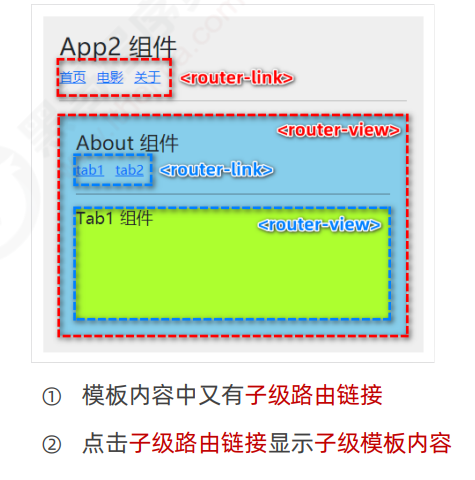

#### 1. 声明子路由链接和子路由占位符

在 About.vue 组件中，声明 tab1 和 tab2 的子路由链接以及子路由占位符。示例代码如下：

```vue
<template>
	<div class="about-container">
        <h3>About 组件</h3>
        <!-- 1.在关于页面中，声明两个子路由链接 -->
        <router-link to="/about/tab1">tab1</router-link>
        <router-link to="/about/tab2">tab2</router-link>
        
        <hr/>
        
        <!-- 2.在关于页面中，声明子路由的占位符 -->
        <router-view></router-view>
    </div>
</template>
```

#### 2. 通过 children 属性声明子路由规则

在 src/router/index.js 路由模块中，导入需要的组件，并使用 children 属性声明子路由规则：

```js
import Tab1 from '@/components/tabs/Tab1.vue'
import Tab2 from '@/components/tabs/Tab2.vue'

const router = new VueRouter({
    // 在routes数组中，声明路由的匹配规则
    routes:[
        { 
            path: '/about', 
            component: About,
            children: [
                { path: 'tab1',component: Tab1 },
                { path: 'tab2',component: Tab2 }
            ]
        }
    ]
})
```

### 3）动态路由匹配

#### 1. 动态路由的概念

动态路由指的是：把 Hash 地址中可变的部分定义为参数项，从而提高路由规则的复用性。 在 vue-router 中使用英文的冒号（:）来定义路由的参数项。示例代码如下：

```js
{ path: '/movie/:id', component: Movie }

// 将以下3个路由规则合并成了一个，提高路由规则的复用性
{ path: '/movie/1', component: Movie }
{ path: '/movie/2', component: Movie }
{ path: '/movie/3', component: Movie }
```

#### 2. $route.params 参数对象

在动态路由渲染出来的组件中，可以使用 this.$route.params 对象访问到动态匹配的参数值。

```vue
<template>
	<div class="movie-container">
        <h3>Movie 组件 -- {{this.$route.params.id}}</h3>
        <h3>Movie 组件 -- {{id}}</h3>
    </div>
</template>

<script>
export default{
    name: 'Movie',
    props: ['id']	//使用props接受路由规则中匹配到的参数项
}
</script>
```

为了简化路由参数的获取形式，vue-router 允许在路由规则中开启 props 传参。

### 4）全局前置守卫

每次发生路由的导航跳转时，都会触发全局前置守卫。因此，在全局前置守卫中，程序员可以对每个路由进行访问权限的控制：

```js
//创建路由实例对象
const router = new VueRouter({ ... })
                              
//调用路由实例对象的 beforeEach 方法，即可声明“全局前置守卫”
//每次发生路由导航跳转的时候，都会自动触发回调函数
router.beforeEach((to,from,next) =>{
    // to 是将要访问的路由的信息对象
    // from 是将要离开的路由的信息对象
    // next 是一个函数，调用next()表示放行
})                          
```

示例：

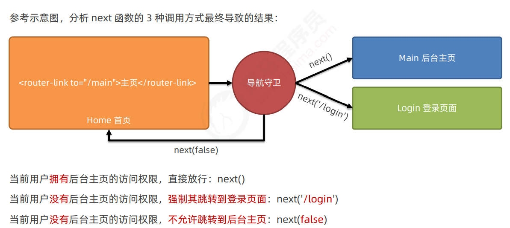

```js
router.beforeEach((to,from,next) => {
	if(to.path === '/main'){
        const token = localStorage.getItem('token')
        if(token){
            next() //访问的是后台主页，且有token的值
        }else{
            next('/login')	//访问的是后台主页，但是没有token的值
        }
    }else{
        next()		//访问的不是后台主页，直接放行
    }
})
```

## 4、声明式导航 & 编程式导航

### 1）概念

在浏览器中，点击链接实现导航的方式，叫做**声明式导航**。例如：普通网页中点击  链接、vue 项目中点击  都属于声明式导航

在浏览器中，调用 API 方法实现导航的方式，叫做**编程式导航**。例如：普通网页中调用 location.href 跳转到新页面的方式，属于编程式导航

### 2）编程式导航API

vue-router 提供了许多编程式导航的 API，其中最常用的导航 API 分别是：

| API                               | 描述                                           |
| --------------------------------- | ---------------------------------------------- |
| this.$router.push('hash 地址')    | 跳转到指定 hash 地址，并增加一条历史记录       |
| this.$router.replace('hash 地址') | 跳转到指定的 hash 地址，并替换掉当前的历史记录 |
| this.$router.go(数值 n)           | 实现导航历史前进、后退                         |

**push 和 replace 的区别**

- push会增加一条历史记录
- replace不会增加历史记录，而是替换掉当前的历史记录

**$router.go 的简化用法**

在实际开发中，一般只会前进和后退一层页面。因此 vue-router 提供了如下两个便捷方法：

- $router.back() ：在历史记录中，后退到上一个页面 
- $router.forward()：在历史记录中，前进到下一个页面

# 六、补充知识

## 1、ES6模块化

### 1）什么是ES6模块化规范

ES6模块化规范是浏览器端与服务器端通用的模块化开发规范。它的出现极大的降低了前端开发者的模块化学 习成本@开发者不需再额外学习AMD、CMD或CommonJS等模块化规范。

ES6模块化规范中定义：

- 每个js文件都是一个独立的模块；
- 导入其它模块成员使用import关键字；
- 向外共享模块成员使用export关键字。

### 2）在node.js中体验ES6模块化

node.js中默认仅支持CommonJS模块化规范，若想基于node.js体验与学习ES6的模块化语法，可以按照如下两个步骤进行配置：

1. 确保安装了VI4．15．1或更高版本的node.js
2. 在package.json的根节点中添加`"type"："module"`节点

### 3）基本语法

#### 1. 默认导出与默认导入

默认导出的语法：`export default`默认导出的成员。

```js
let n1 = 10		//定义模块化私有成员 n1
let n2 = 20 	//定义模块化私有成员 n2（外界访问不到n2，因为它没有被共享出去）
function show(){}	//定义模块化私有方法show

export default{		//使用export default默认导出语法，向外共享 n1 和 show 两个成员
    n1,
    show
}
```

默认导入的语法：`import 接受名称 from '模块标识符'`

```js
// 从01_m1.js 模块中导入 export default 向外共享的成员，并使用 m1 接受
import m1 from './01_m1.js'

// 打印输出的结果为：
// { n1: 10, show:[Function: show] }
console.log(m1)
```

**注意**：

每个模块中，只允许使用唯一的一次`export default`，否则会报错！

#### 2. 按需导出与按需导入

按需导入的语法：`export 按需导入的成员`

```js
// 当前模块为03_m2.js

// 向外按需导出变量 s1
export let s1 = 'aaa'
// 向外按需导出变量 s2
export let s2 = 'ccc'
// 向外按需导出方法 say
export function say(){}
```

按需导入的语法：`import { s1 } from '模块标识符'`

```js
// 导入模块成员
import { s1, s2, say } from './03_m2.js'

console.log(s1)	// 打印输出aaa
console.log(s2) // 打印输出ccc
console.log(say) // 打印输出[Function: say]
```

**注意**：

1. 每个模块中可以使用多次按需导出
2. 按需导入的成员名称必须和按需导出的名称保持一致
3. 按需导入时，可以使用as关键字进行重命名
4. 按需导入可以和默认导入一起使用

#### 3. 直接导入并执行模块中的代码

如果只想单纯地执行某个模块中的代码，并不需要得到模块中向外共享的成员。此时，可以直接导入并执行模 块代码，示例代码如下：

```js
// 当前文件模块为 05_m3.js

// 在当前模块中执行一个for循环操作
for(let i = 0; i < 3; i++){
    console.log(i)
}

// -------分割线(06_m3.js)--------
//直接导入并执行模块代码，不需要得到模块向外共享的成员
import './05_m3.js'
```

## 2、Promise

### 1）概念

#### 1. 回调地狱

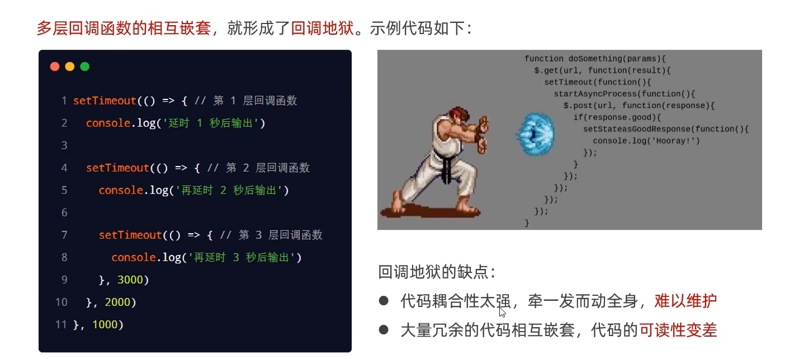

为了解决回调地狱的问题，ES6中新增了Promise的概念。

#### 2. 基本概念

**1) Promise是一个构造函数**

我们可以创建Promise的实例const p=new Promise()

new出来的Promise实例对象，代表一个异步操作

**2) Promise.prototype上包含一个.then()方法**

每一次newPromise()构造函数得到的实例对象

都可以通过原型链的方式访问到.then()方法，例如p.then()

**3) .then()方法用来预先指定成功和失败的回调函数**

p.then（成功的回调函数，失败的回调函数）

p.then(result=>{},error=>{}) 调用.then()方法时，成功的回调函数是必选的、失败的回调函数是可选的

### 2）案例 - 文件读取

#### 1. 基于回调函数

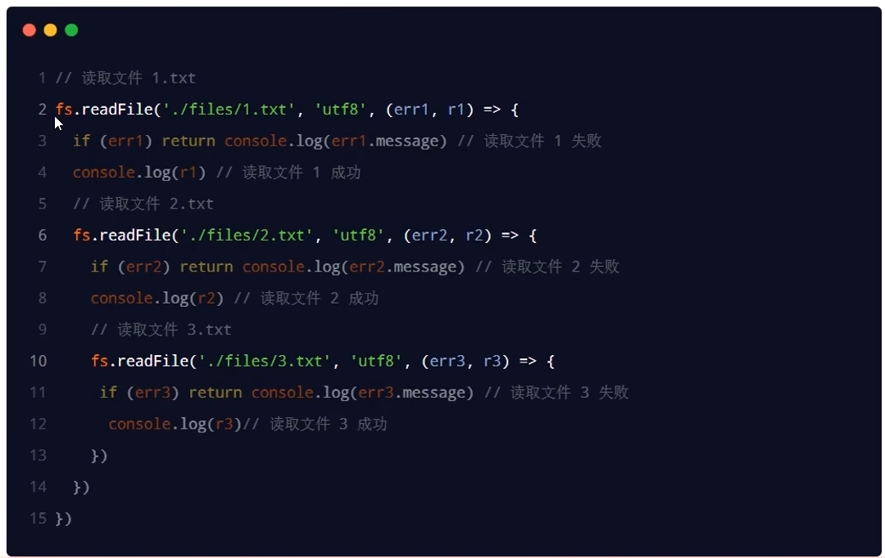

#### 2. 基于 Promise 随机读取

由于node.js官方提供的fs模块仅支持以回调函数的方式读取文件，不支持Promise的调用方式。因此，需 要先运行如下的命令，安装then-fs这个第三方包，从而支持我们基于Promise的方式读取文件的内容：

```shell
npm install then-fs
```

调用then-fs提供的readFile()方法，可以异步地读取文件的内容，它的返回值是Promise的实例对象。因 此可以调用.then()方法为每个Promise异步操作指定成功和失败之后的回调函数。示例代码如下：

```js
/**
 *	基于 Promise 的方式读取文件
 */
import thenFs from 'then-fs'

thenFs.readFile('./file/1.txt','utf-8').then(r1 => { console.log(r1) }, err1 => { console.log(r2) })
thenFs.readFile('./file/2.txt','utf-8').then(r2 => { console.log(r1) }, err1 => { console.log(r2) })
thenFs.readFile('./file/3.txt','utf-8').then(r3 => { console.log(r1) }, err1 => { console.log(r2) })
```

注意：因为Promise是异步执行的，因此上述代码无法保证文件的读取顺序，需要进一步的改进！

#### 3. 基于 Promise 顺序读取

Promise支持链式调用，从而来解决回调地狱的问题。示例代码如下：

```js
thenFs.readFile('./file/1.txt','utf-8')
.then(r1 => { 
    console.log(r1)
    return thenFs.readFile('./file/2.txt','utf-8')
})
.then((r2) => {
    console.log(r2)
    return thenFs.readFile('./file/3.txt','utf-8')
})
.then((r3) => {
    console.log(r3)
})
```

#### 4. 基于Promise封装读文件的方法

1. getFile方法的定义

```js
// 1. 方法的名称为 getFile
// 2. 方法接受一个形参 fpath，表示要读取的文件的路径
function getFile(fpath){
    // 3. 方法的返回值为Promise的实例对象
    return new Promise(function(resolve,reject){
        // 4.下面这行代码，表示这是一个具体的、读文件的异步操作
        fs.readFile(fpath,'utf-8',(err, dataStr) => {
            if(err)				//读取失败
                return reject(err)
            resolve(dataStr)	//读取成功
        })
    })
}
```

2. 调用封装方法

```js
getFile('./file/11.txt').then((r1) => { console.log(r1) },(err) => console.log(err.message))

getFile('./file/11.txt').then((r1) => { console.log(r1) }).catch(err => console.log(err.message))
```

### 3）异常捕获

在Promise的链式操作中如果发生了错误，可以使用Promis巳prototyp巳catch方法进行捕获和处理：

```js
thenFs.readFile('./file/111.txt','utf-8')
.then(r1 => { 
    console.log(r1)
    return thenFs.readFile('./file/2.txt','utf-8')
})
.then((r2) => {
    console.log(r2)
    return thenFs.readFile('./file/3.txt','utf-8')
})
.then((r3) => {
    console.log(r3)
})
.catch(err => {		// 捕获第1行发生的错误，并输出错误的信息
    console.log(err.message)
})
```

如果不希望前面的错误导致后续的.then无法丐执行，则可以将.catch的调用提前，示例代码如下：

```js
thenFs.readFile('./file/111.txt','utf-8')
.catch(err => {		// 捕获第1行发生的错误，由于错误已被及时处理，将不影响r2、r3的执行
    console.log(err.message)
})
.then(r1 => { 
    console.log(r1)
    return thenFs.readFile('./file/2.txt','utf-8')
})
.then((r2) => {
    console.log(r2)
    return thenFs.readFile('./file/3.txt','utf-8')
})
.then((r3) => {
    console.log(r3)
})
```

### 4）Promise.all()

`Promise.all()`方法会发起并行的Promise异步操作，等所有的异步操作全部结束后才会执行下一步的.then 操作（等待机制）。示例代码如下：

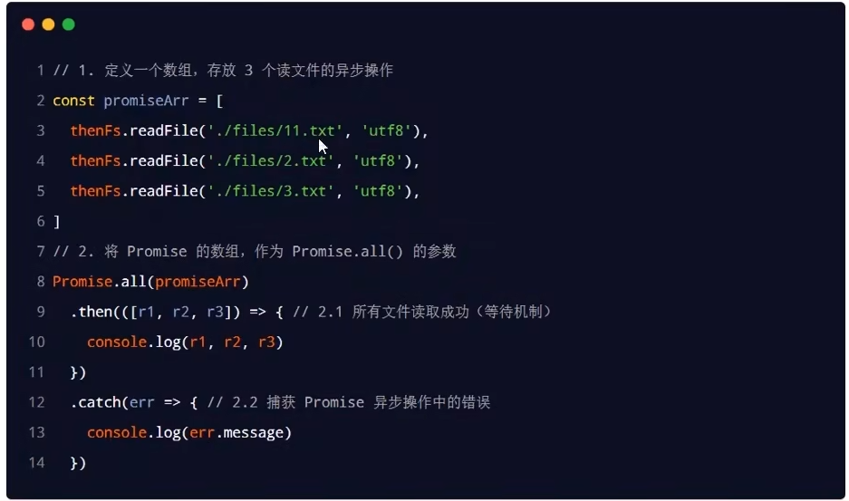

注意：数组中Promise实例的顺序，就是最终结果的顺序。

### 5）Promise.race()

Promise.race()方法会发起并行的Promise异步操作，只要任何一个异步操作完成，就立即执行下一步的 .then操作（赛跑机制）。示例代码如下：

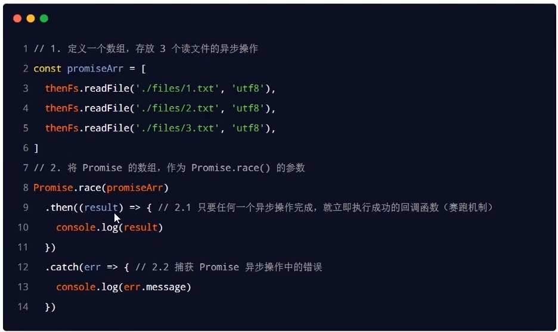

## 3、async/await

### 1）什么是async/await

async/await是ES8（ECMAScript2017）引入的新语法，用来简化Promise异步操作。在async/await出 现之前，开发者只能通过链式.then()的方式处理Promise异步操作。示例代码如下：

```js
thenFs.readFile('./file/1.txt','utf-8')
.then(r1 => { 
    console.log(r1)
    return thenFs.readFile('./file/2.txt','utf-8')
})
.then((r2) => {
    console.log(r2)
    return thenFs.readFile('./file/3.txt','utf-8')
})
.then((r3) => {
    console.log(r3)
})
```

- .then链式调用的优点： 解决了回调地狱的问题 
- .then链式调用的缺点： 代码冗、阅读性差、 不易理解

### 2）async/await的基本使用

使用async/await简化Promise异步操作的示例代码如下：

```js
import thenFs from 'then-fs'

//按照顺序读取文件1，2，3的内容
async function getAllFile(){
    const r1 = await thenFs.readFile('./files/1.txt','utf-8')
    console.log(r1)
    const r2 = await thenFs.readFile('./files/2.txt','utf-8')
    console.log(r2)
    const r3 = await thenFs.readFile('./files/3.txt','utf-8')
    console.log(r3)
}

getAllFile()
```

注意：

- 如果在function中使用了await,则function必须被async修饰
- 在async方法中，第一个await之前的代码会同步执行，await之后的代码会异步执行

示例：

```js
console.log('A')
async function getAllFile(){
    console.log('B')
    const r1 = await thenFs.readFile('./files/1.txt','utf-8')
    const r2 = await thenFs.readFile('./files/2.txt','utf-8')
    const r3 = await thenFs.readFile('./files/3.txt','utf-8')
    console.log(r1,r2,r3)
    console.log('D')
}

getAllFile()
console.log('C')

//最终输出：A B C 111 222 333 D
```

## 4、EventLoop

### 1）JavaScript是单线程语言

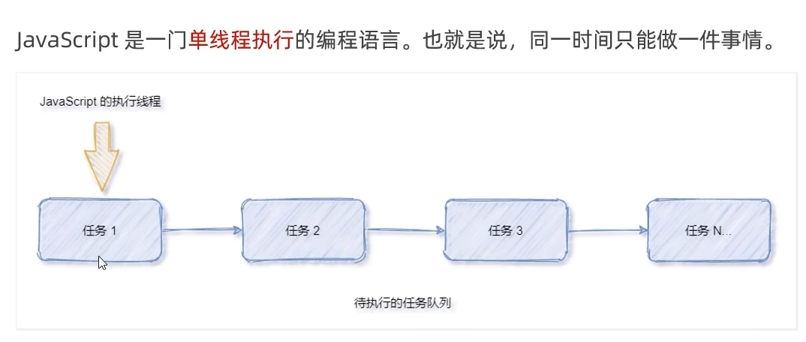

单线程执行任务队列的问题： 如果前一个任务非常耗时，则后续的任务就不得不一直等待，从而导致程序假死的问题。

### 2）同步任务和异步任务

为了防止某个耗时任务导致程序假死的问题，JavaScript把待执行的任务分为了两类：

1. 同步任务(synchronous) ，又叫做非耗时任务，指的是在主线程上排队执行的那些任务。只有前一个任务执行完毕，才能执行后一个任务
2. 异步任务(asynchronous)，又叫做耗时任务，异步任务由JavaScript委托给宿主环境进行执行。当异步任务执行完成后，会通知JavaScript主线程执行异步任务的回调函数

### 3）执行过程

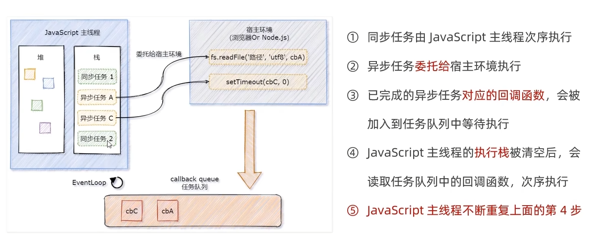

### 4）EventLoop的基本概念

JavaScript主线程从“任务队列“中读取异步 任务的回调函数，放到执行栈中依次执行。这 个过程是循环不断的所以整个的这种运行机 制又称为EventLoop（事件循环）。

结合EventLoop进行代码输出分析：

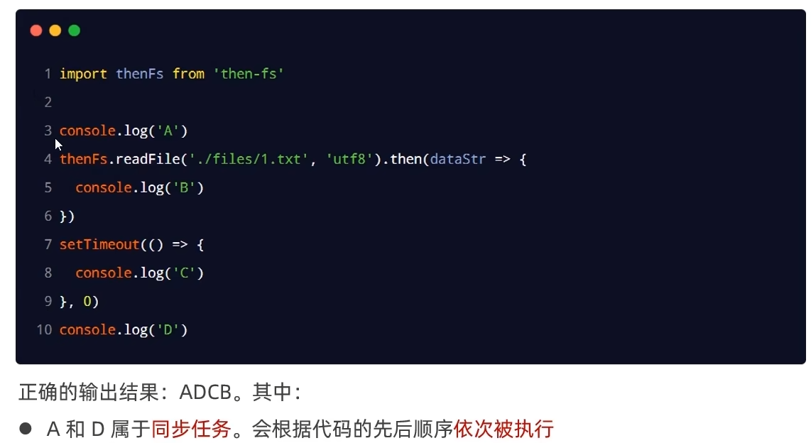

## 5、宏任务和微任务

### 1）什么是宏任务和微任务

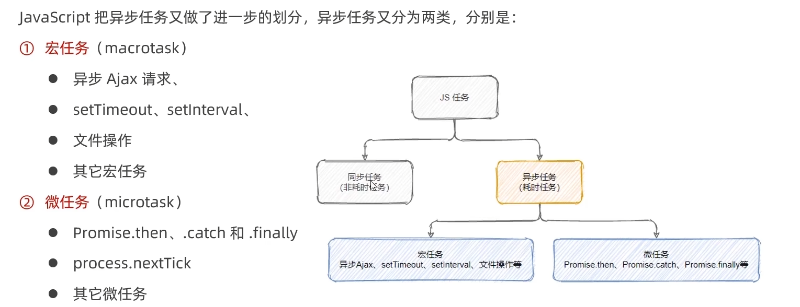

### 2）宏任务和微任务的执行顺序

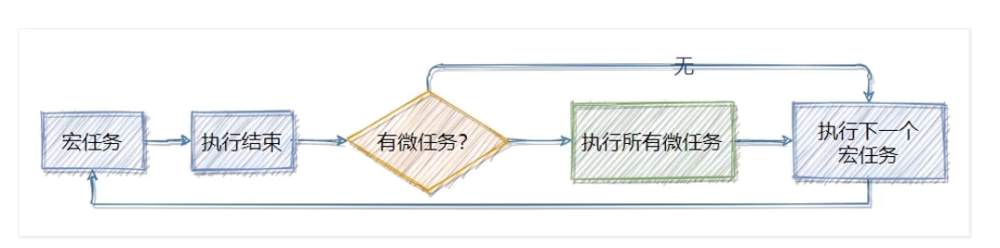

每一个宏任务执行完之后，都会检查是否存在待执行的微任务， 如果有，则执行完所有微任务之后，再继续执行下一个宏任务。

### 3）代码分析-1

```js
setTimeout(fucntion(){
	console.log('1')           
})

new Promise(function(resolve){
    console.log('2')
    resolove()
}).then(function(){
    console.log('3')
})

console.log('4')

//答案：2413
```

1. 先执行所有的同步任务：执行第6行、第12行代码
2. 再执行微任务：执行第9行代码；**（同步任务，异步任务执行后都会检查微任务）**
3. 再执行下一个宏任务：执行第2行代码

### 4）代码分析-2

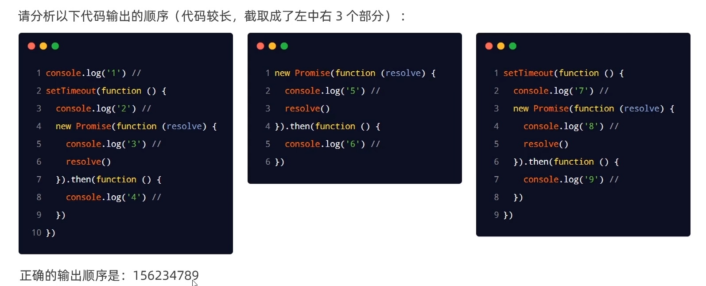

## 6、数组中的方法

### 1）forEach

```js
const arr = ['小红'，'小明','小爱','小东']

arr.forEach((item,index) => {
    console.log('ok')
    if(item === '小爱'){
        console.log(index)
        return
    }
})
```

forEach循环一旦开始，无法在中间被停止。代码中“ok”将被打印四次，return关键字无法起作用。

### 2）some

```js
arr.some((item,index) => {
    console.log('ok')
    if(item === '小爱'){
        console.log(index)
        return
    }
})
```

在找到对应项后，可以通过 `return true` 固定的语法来终止 some 循环。

### 3）every

```js
const arr = [
    { name: '西瓜', state: true },
    { name: '榴莲', state: false},
    { name: '草莓', state: true}
]

const result = arr.every(item => item.state)
console.log(result)	//false
```

只有数组中每一项state都为true时，result才会返回true。

### 4）reduce

```js
const arr = [
    { name: '西瓜', state: true, price: 5, count: 2 },
    { name: '榴莲', state: false, price: 90, count: 1},
    { name: '草莓', state: true, price: 25, count: 3}
]

//arr.filter(item => item.state).reduce((累加结果,当前项) => { return 累加结果+=当前项 },初始值)

const result = arr.filter(item => item.state).reduce((amt,item)=>{
    return amt += item.price * item.count
},0)
console.log(result)

//可简写：
arr.filter(item => item.state).reduce((amt,item)=> amt += item.price * item.count,0)
```

