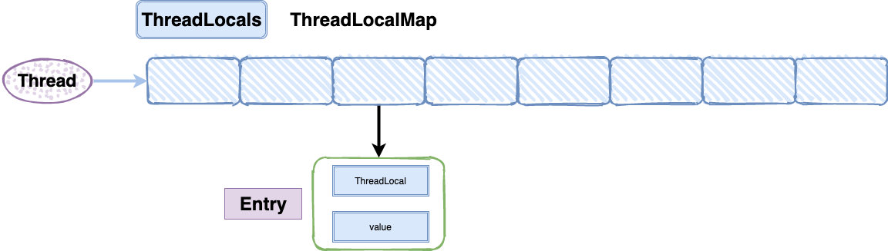

# 一、基础知识

## 1、为什么要使用并发编程

充分利用多核CPU的计算能力：通过并发编程的形式可以将多核CPU的计算能力发挥到极致，性能得到提升

方便进行业务拆分，提升系统并发能力和性能：在一些特殊的业务场景下，先天的就适合于并发编程。

## 2、并发会带来什么问题

并发编程的目的就是为了能提高程序的执行效率，提高程序运行速度，但是并发编程并不总是能提高程序运行速度的，而且并发编程可能会遇到很多问题，比如：*内存泄漏、上下文切换、线程安全、死锁等*问题。

## 3、并发编程的三要素

- 原子性

- 可见性

- 有序性


## 4、出现线程安全问题的原因

- *线程切换*带来的原子性问题；
- *缓存*导致的可见性问题；
- *编译优化*带来的有序性问题。

## 5、并行和并发有什么区别

## 6、线程和进程的区别

## 7、多线程

### 1）什么是多线程

多线程是指程序中包含多个执行流，即在一个程序中可以同时运行多个不同的线程来执行不同的任务。

### 2）多线程的好处

可以提高CPU的利用率。在多线程程序中，一个线程必须等待的时候，CPU可以运行其它的线程而不是等待，这样就大大提高了程序的效率。也就是说允许单个程序创建多个并行执行的线程来完成各自的任务。

### 3）多线程的劣势

线程需要*占用内存*，线程越多占用内存也越多

多线程需要协调和管理，所以需要CPU时间跟踪线程

线程之间对共享资源的访问会相互影响，必须解决竞用共享资源的问题

## 8、什么是上下文切换

当前任务在执行完CPU时间片切换到另一个任务之前会先保存自己的状态，以便下次再切换回这个任务时，可以再加载这个任务的状态。任务从保存到再加载的过程就是一次上下文切换。

## 9、守护线程和用户线程有什么区别呢

用户(User)线程：运行在前台，执行具体的任务，如程序的主线程、连接网络的子线程等都是用户线程；

守护(Daemon)线程：运行在后台，为其他前台线程服务。也可以说守护线程是JVM中非守护线程的“佣人”。一旦所有用户线程都结束运行，守护线程会随JVM一起结束工作

## 10、创建线程的四种方式

1）继承Thread类

2）实现Runnable接口

3）实现Callable接口

4）使用Executors工具类创建线程池

## 11、Runable和Callable的区别

Runnable接口run方法无返回值；Callable接口call方法有返回值，是个泛型，和Future、FutureTask配合可以用来获取异步执行的结果；

Runnable接口run方法只能抛出运行时异常，且无法捕获处理；Callable接口call方法允许抛出异常，可以获取异常信息。

## 12、线程的run()和start()有什么区别

每个线程都是通过某个特定Thread对象所对应的方法run()来完成其操作的，run()方法称为线程体。通过调用Thread类的start()方法来启动一个线程。

start()方法用于启动线程，run()方法用于执行线程的运行时代码。run()可以重复调用，而start()只能调用一次。

start()方法来启动一个线程，真正实现了多线程运行。调用start()方法无需等待run方法体代码执行完毕，可以直接继续执行其他的代码；此时线程是处于就绪状态，并没有运行。然后通过此Thread类调用方法run()来完成其运行状态，run()方法运行结束，此线程终止。然后CPU再调度其它线程。

run()方法是在本线程里的，只是线程里的一个函数，而不是多线程的。如果直接调用run()，其实就相当于是调用了一个普通函数而已，直接调用run()方法必须等待run()方法执行完毕才能执行下面的代码，所以执行路径还是只有一条，根本就没有线程的特征，所以在多线程执行时要使用start()方法而不是run()方法。

## 13、什么是Future？

Future<V>接口是用来获取异步计算结果的，说白了就是对具体的Runnable或者Callable对象任务执行的结果进行获取(get()),取消(cancel()),判断是否完成等操作。

## 14、什么是FutureTask？

FutureTask表示一个异步运算的任务。FutureTask里面可以传入一个Callable的具体实现类，可以对这个异步运算的任务的结果进行等待获取、判断是否已经完成、取消任务等操作。只有当运算完成的时候结果才能取回，如果运算尚未完成get方法将会阻塞。一个FutureTask对象可以对调用了Callable和Runnable的对象进行包装，由于FutureTask也是Runnable接口的实现类，所以FutureTask也可以放入线程池中。

## 15、CompletableFuture？

什么是CompletableFuture？

CompletableFuture实现了CompletionStage接口和Future接口，前者是对后者的一个扩展，增加了异步回调、流式处理、多个Future组合处理的能力，使Java在处理多任务的协同工作时更加顺畅便利。

## 16、有了Future，为什么要用CompletableFuture

（1）Future不支持手动完成

我提交了一个任务，但是执行太慢了，我通过其他路径已经获取到了任务结果，现在没法把这个任务结果通知到正在执行的线程，所以必须主动取消或者一直等待它执行完成

（2）Future不支持进一步的非阻塞调用

通过Future的get方法会一直阻塞到任务完成，但是想在获取任务之后执行额外的任务，因为Future不支持回调函数，所以无法实现这个功能

（3）不支持链式调用

对于Future的执行结果，我们想继续传到下一个Future处理使用，从而形成一个链式的pipline调用，这在Future中是没法实现的。

（4）不支持多个Future合并

比如我们有10个Future并行执行，我们想在所有的Future运行完毕之后，执行某些函数，是没法通过Future实现的。

（5）Future不支持异常处理

Future的API没有任何的异常处理的api，所以在异步运行时，如果出了问题是不好定位的。

## 17、请说出与线程同步以及线程调度相关的方法

- wait()：使一个线程处于等待（阻塞）状态，并且释放所持有的对象的锁；

- sleep()：使一个正在运行的线程处于睡眠状态，是一个静态方法，调用此方法要处理InterruptedException异常；
- notify()：唤醒一个处于等待状态的线程，当然在调用此方法的时候，并不能确切的唤醒某一个等待状态的线程，而是由JVM确定唤醒哪个线程，而且与优先级无关；

- notityAll()：唤醒所有处于等待状态的线程，该方法并不是将对象的锁给所有线程，而是让它们竞争，只有获得锁的线程才能进入就绪状态；


## 18、sleep()和wait()有什么区别？

1)同

两者都可以暂停线程的执行

2)异

- 类的不同：sleep()是Thread线程类的静态方法，wait()是Object类的方法。

- 是否释放锁：sleep()不释放锁；wait()释放锁。

- 用途不同：wait通常被用于线程间交互/通信，sleep通常被用于暂停执行。

- 用法不同：wait()方法被调用后，线程不会自动苏醒，需要别的线程调用同一个对象上的notify()或者notifyAll()方法。sleep()方法执行完成后，线程会自动苏醒。或者可以使用wait(longtimeout)超时后线程会自动苏醒。


## 19、为什么线程通信的方法wait(),notify()和notifyAll()被定义在Object类里？而sleep()和yield()方法却被定义在Thread类中而且还是静态方法呢？

首先得说一下同步队列、等待队列这些东西，我们会把我们想要互斥使用的资源定义到object类里面去，当线程想要获得这个资源时，它得先去获得这个资源的锁，这种资源是互斥访问的，同一时间只能有一个线程去获得这个资源的锁，并拿到这个锁去访问这个资源，而正在等待这个资源的线程会被放到等待队列中，正在竞争这个资源的线程会被放到同步队列中。而当这个资源想让正在访问这个资源的线程阻塞起来时，就可以调用wait方法，那么当前线程就会被阻塞起来，正在同步队列中的线程就可以去竞争获得这把锁，只有拿到这把锁的线程才能去访问这个资源，而当我们调用notify方法时，它会随机唤醒等待队列中的线程，将它放入到同步队列中，并让同步队列中的队列去争夺锁，而notifyAll会唤醒等待队列中的所有线程，将他们都放入到同步队列中，让所有在同步队列中的线程去争夺锁。这些通信方法有一个共同的特点：就是*通过资源来通知线程通信，他们都必须获得锁的线程才会去执行该方法。*而sleep和yield方法是当前线程主动执行的，所以他们被定义在Thread类中，sleep会使当前线程睡眠，但不会释放占有资源的锁，而yield方法会给优先级大于等于它的线程优先执行，如果他们不是静态方法，那么还需要new一个Thread出来，那就不是让当前线程进行sleep或yield了。

## 20、yield方法有什么作用？

使当前线程从执行状态（运行状态）变为可执行态（就绪状态）。

当前线程到了就绪状态，那么接下来哪个线程会从就绪状态变成执行状态呢？可能是当前线程，也可能是其他线程，看系统的分配了。

## 21、线程的sleep()方法和yield()方法有什么区别？

sleep()方法给其他线程运行机会时不考虑线程的优先级，因此会给低优先级的线程以运行的机会；yield()方法只会给相同优先级或更高优先级的线程以运行的机会；

线程执行sleep()方法后转入阻塞（blocked）状态，而执行yield()方法后转入就绪（ready）状态；

sleep()方法声明抛出InterruptedException，而yield()方法没有声明任何异常；

sleep()方法比yield()方法（跟操作系统CPU调度相关）具有更好的可移植性，通常不建议使用yield()方法来控制并发线程的执行。

## 22、notify()和notifyAll()有什么区别？

如果线程调用了对象的wait()方法，那么线程便会处于该对象的等待池中，等待池中的线程不会去竞争该对象的锁。

notifyAll()会唤醒所有的线程，notify()只会唤醒一个线程。

notifyAll()调用后，会将全部线程由等待池移到锁池，然后参与锁的竞争，竞争成功则继续执行，如果不成功则留在锁池等待锁被释放后再次参与竞争。而notify()只会唤醒一个线程，具体唤醒哪一个线程由虚拟机控制。

## 23、Java中线程的6种状态


- **初始(NEW)：**新创建一个线程对象，还没有调用start()方法
- **运行(RUNNABLE)：**Java线程中将就绪（ready）和运行中（running）两种状态笼统的称为“运行”。
- **阻塞(BLOCKED)：**线程阻塞在进入synchronized关键字修饰的方法或代码块(获取锁)时的状态。
- **等待(WAITING)：**处于这种状态的线程不会被分配CPU执行时间，它们要等待被显式地唤醒，否则会处于无限期等待的状态。
- **超时等待(TIMED_WAITING)：**处于这种状态的线程不会被分配CPU执行时间，不过无须无限期等待被其他线程显示地唤醒，在达到一定时间后它们会自动唤醒。
- **终止(TERMINATED)：**表示该线程已经执行完毕。

## 24、生产者消费者模板

```java
class Message {
    private int id;
    private String message;

    public Message(int id, String message) {
        this.id = id;
        this.message = message;
    }

    @Override
    public String toString() {
        return "Message{" +
                "id=" + id +
                ", message='" + message + '\'' +
                '}';
    }
}

class MessageQueue {

    private LinkedList<Message> queue = new LinkedList<>();
    private int capcity;

    public MessageQueue(int capcity) {
        this.capcity = capcity;
    }

    public Message take() {
        synchronized (queue) {
            while (queue.isEmpty()) {
                try {
                    queue.wait();
                    System.out.println("队列为空，消费者【" + Thread.currentThread().getName() + "】等待……");
                } catch (InterruptedException e) {
                    e.printStackTrace();
                }
            }
            Message message = queue.removeFirst();
            System.out.println("消费者【" + Thread.currentThread().getName() + "】消费消息" + message);
            queue.notifyAll();
            return message;
        }
    }

    public void put(Message message) {
        synchronized (queue) {
            while (queue.size() == capcity) {
                try {
                    queue.wait();
                    System.out.println("队列已满，生产者【" + Thread.currentThread().getName() + "】等待……");
                } catch (InterruptedException e) {
                    e.printStackTrace();
                }
            }
            System.out.println("生产者【" + Thread.currentThread().getName() + "】存放消息" + message);
            queue.addLast(message);
            queue.notifyAll();
        }
    }
}

public class Solution {

    public static void main(String[] args) {
        MessageQueue messageQueue = new MessageQueue(2);
        for (int i = 0; i < 3; i++) {
            int id = i;
            new Thread(() -> {
                messageQueue.put(new Message(id, "消息" + id));
            }, "生产者").start();
        }
        new Thread(() -> {
            while (true) {
                try {
                    Thread.sleep(1000);
                } catch (InterruptedException e) {
                    e.printStackTrace();
                }
                messageQueue.take();
            }
        }, "消费者").start();
    }
}
```


## 25、什么是线程中断

线程中断即线程运行过程中被其他线程给打断了，它与 stop 最大的区别是：stop 是由系统强制终止线程，而线程中断则是给目标线程发送一个中断信号，如果目标线程没有接收线程中断的信号并结束线程，线程则不会终止，具体是否退出或者执行其他逻辑取决于目标线程。

线程中断三个重要的方法：

| 方法                             | 作用                                                         |
| -------------------------------- | ------------------------------------------------------------ |
| java.lang.Thread#interrupt()     | 调用目标线程的interrupt()方法，给目标线程发一个中断信号，线程被打上中断标记。 |
| java.lang.Thread#isInterrupted() | 判断目标线程是否被中断，不会清除中断标记。                   |
| java.lang.Thread#interrupted()   | 判断目标线程是否被中断，会清除中断标记。                     |

示例：

```java
private static void test2() {
    Thread thread = new Thread(() -> {
        while (true) {
            Thread.yield();

            // 响应中断
            if (Thread.currentThread().isInterrupted()) {
                System.out.println("Java技术栈线程被中断，程序退出。");
                return;
            }
        }
    });
    thread.start();
    thread.interrupt();
}
```


## 26、什么是线程死锁？

多个线程同时被阻塞，它们中的一个或者全部都在等待某个资源被释放。由于线程被无限期地阻塞，因此程序不可能正常终止。它的四个必要条件：互斥、不可剥夺、请求并等待、循环等待。

下面通过例子说明线程死锁，代码来自并发编程之美。

```java
public class DeadLockDemo {
    private static Object resource1 = new Object();//资源 1
    private static Object resource2 = new Object();//资源 2

    public static void main(String[] args) {
        new Thread(() -> {
            synchronized (resource1) {
                System.out.println(Thread.currentThread() + "get resource1");
                try {
                    Thread.sleep(1000);
                } catch (InterruptedException e) {
                    e.printStackTrace();
                }
                System.out.println(Thread.currentThread() + "waiting get resource2");
                synchronized (resource2) {
                    System.out.println(Thread.currentThread() + "get resource2");
                }
            }
        }, "线程 1").start();

        new Thread(() -> {
            synchronized (resource2) {
                System.out.println(Thread.currentThread() + "get resource2");
                try {
                    Thread.sleep(1000);
                } catch (InterruptedException e) {
                    e.printStackTrace();
                }
                System.out.println(Thread.currentThread() + "waiting get resource1");
                synchronized (resource1) {
                    System.out.println(Thread.currentThread() + "get resource1");
                }
            }
        }, "线程 2").start();
    }
}
```


# 二、并发关键字

## 1、Synchronize

### 1)   synchronized的作用

synchronized关键字是用来控制线程同步的，就是在多线程的环境下，控制synchronized代码段不被多个线程同时执行。synchronized可以修饰类、方法、变量、静态代码块。

### 2)   最主要的三种使用方式

- 修饰实例方法：作用于当前对象实例加锁，进入同步代码前要获得当前对象实例的锁
- 修饰静态方法：也就是给当前类加锁，会作用于类的所有对象实例
- 修饰代码块：指定加锁对象，对给定对象加锁，进入同步代码块前要获得给定对象的锁。

### 3)   底层原理

想要了解synchronized的底层原理，需通过JDK*反汇编指令*`Javap –c -v`(包名)来查看。


可以看出在执行同步代码块之前之后都有一个monitor字样，其中前面的是monitorenter，后面的是离开monitorexit，不难想象一个线程也执行同步代码块，首先要获取锁，而获取锁的过程就是monitorenter，在执行完代码块之后，要释放锁，释放锁就是执行monitorexit指令。

> **为什么会有两个monitorexit呢？**
>
> 这个主要是防止在同步代码块中线程因异常退出，而锁没有得到释放，这必然会造成死锁（等待的线程永远获取不到锁）。因此最后一个monitorexit是保证在异常情况下，锁也可以得到释放，避免死锁。

### 4)   可重入锁的原理

重入锁是指一个线程获取到该锁之后，该线程可以继续获得该锁。底层原理维护一个计数器，当线程获取该锁时，计数器加一，再次获得该锁时继续加一，释放锁时，计数器减一，当计数器值为0时，表明该锁未被任何线程所持有，其它线程可以竞争获取锁。

### 5)   多线程中synchronized锁升级的原理是什么

在锁对象的对象头里面有一个threadid字段，在第一次访问的时候threadid为空，jvm让其持有偏向锁，并将threadid设置为其线程id，再次进入的时候会先判断threadid是否与其线程id一致，如果一致则可以直接使用此对象，如果不一致，则升级偏向锁为轻量级锁，通过自旋循环一定次数来获取锁，执行一定次数之后，如果还没有正常获取到要使用的对象，此时就会把锁从轻量级升级为重量级锁，此过程就构成了synchronized锁的升级。

锁的升级的目的：锁升级是为了减低了锁带来的性能消耗。在Java6之后优化synchronized的实现方式，使用了偏向锁升级为轻量级锁再升级到重量级锁的方式，从而减低了锁带来的性能消耗。

## 2、volatile

### 1)   为了解决缓存不一致性问题，通常来说哪种解决方法（硬件）

1. 通过在**总线加LOCK#锁**的方式

在早期的CPU当中，是通过在总线上加LOCK#锁的形式来解决缓存不一致的问题。因为CPU和其他部件进行通信都是通过总线来进行的，如果对总线加LOCK#锁的话，也就是说阻塞了其他CPU对其他部件访问（如内存），从而使得只能有一个CPU能使用这个变量的内存。

（锁住总线期间，其他CPU无法访问内存，导致效率低下）

2. 通过**缓存一致性协议**

最出名的就是Intel的MESI协议，MESI协议保证了每个缓存中使用的共享变量的副本是一致的。它核心的思想是：当CPU写数据时，如果发现操作的变量是共享变量，即在其他CPU中也存在该变量的副本，会发出信号通知其他CPU将该变量的缓存行置为无效状态，因此当其他CPU需要读取这个变量时，发现自己缓存中缓存该变量的缓存行是无效的，那么它就会从内存重新读取。

### 2)   volatile关键字的作用

1. 保证可见性。

   当一个共享变量被volatile修饰时，它会保证修改的值会立即被更新到主存，当有其他线程需要读取时，它会去内存中读取新值。

2. 禁止指令重排。

   一般来说，处理器为了提高程序运行效率，可能会对输入代码进行优化，它不保证程序中各个语句的执行先后顺序同代码中的顺序一致，但是它会保证程序最终执行结果和代码顺序执行的结果是一致的。虽然重排序不会影响单个线程内程序执行的结果，但是在多线程下会导致程序运行不正确。

### 3)   什么是JMM

在Java虚拟机规范中试图定义一种Java内存模型（Java Memory Model，JMM）来屏蔽各个硬件平台和操作系统的内存访问差异，以实现让Java程序在各种平台下都能达到一致的内存访问效果。

Java内存模型规定所有的变量都是存在主存当中（物理内存），每个线程都有自己的工作内存。线程对变量的所有操作都必须在工作内存中进行，而不能直接对主存进行操作。并且每个线程不能访问其他线程的工作内存。


### 4)   原理和实现机制

观察加入volatile关键字和没有加入volatile关键字时所生成的汇编代码发现，加入volatile关键字时，会多出一个lock前缀指令。lock前缀指令实际上相当于一个内存屏障（也成内存栅栏），内存屏障会提供3个功能

1. 它确保指令重排序时不会把其后面的指令排到内存屏障之前的位置，也不会把前面的指令排到内存屏障的后面；即在执行到内存屏障这句指令时，在它前面的操作已经全部完成；
2. 它会强制将对缓存的修改操作立即写入主存；
3. 如果是写操作，它会导致其他CPU中对应的缓存行无效。

### 5)   具体应用

双重校验锁实现对象单例

此处volatile的作用：

instance = new Singleton();中：

```shell
#1：mem = allocate();//Allocate memory for Singleton object.  
#2：instance = mem;//Note that instance is now non-null, but has not been  initialized.  
#3：ctorSingleton(instance);//Invoke constructor for Singleton passing  instance.  
```

不加的话可能发生指令重排，<u>导致某个线程返回一个在instance还没有实例化的对象</u>（执行#3）  

### 6)  volatile和synchronized区别

- volatile是变量修饰符；synchronized可以修饰类、方法、变量。
- volatile仅能实现变量的修改可见性，不能保证原子性；而synchronized则可以保证变量的修改可见性和原子性。
- volatile不会造成线程的阻塞；synchronized可能会造成线程的阻塞。
- volatile标记的变量不会被编译器优化；synchronized标记的变量可以被编译器优化。
- volatile关键字是线程同步的轻量级实现，所以volatile性能肯定比synchronized关键字要好。但是volatile关键字只能用于变量而synchronized关键字可以修饰方法以及代码块。synchronized关键字在JavaSE1.6之后进行了主要包括为了减少获得锁和释放锁带来的性能消耗而引入的偏向锁和轻量级锁以及其它各种优化之后执行效率有了显著提升，实际开发中使用synchronized关键字的场景还是更多一些。

# 三、Lock体系

## 1.  乐观锁&悲观锁

### 1)   乐观锁

乐观锁是一种乐观思想，即认为读多写少，遇到并发写的可能性低，每次去拿数据的时候都认为别人不会修改，所以不会上锁，但是在更新的时候会判断一下在此期间别人有没有去更新这个数据，采取在写时先读出当前版本号，然后加锁操作（比较跟上一次的版本号，如果一样则更新），如果失败则要重复读-比较-写的操作。

java中的乐观锁基本都是通过CAS操作实现的，CAS是一种更新的原子操作，比较当前值跟传入值是否一样，一样则更新，否则失败。

### 2)   悲观锁

悲观锁是就是悲观思想，即认为写多，遇到并发写的可能性高，每次去拿数据的时候都认为别人会修改，所以每次在读写数据的时候都会上锁，这样别人想读写这个数据就会block直到拿到锁。java中的悲观锁就是Synchronized,AQS框架下的锁则是先尝试cas乐观锁去获取锁，获取不到，才会转换为悲观锁，如RetreenLock。

## 2.  Lock与Synchronized的区别

Lock支持非公平锁(默认)和公平锁，而synchronized不支持

Lock不是Java语言内置的，synchronized是Java语言的关键字，因此是内置特性。Lock是一个类，通过这个类可以实现同步访问；

synchronized在发生异常时，会自动释放线程占有的锁，因此不会导致死锁现象发生；而Lock在发生异常时，如果没有主动通过unLock()去释放锁，则很可能造成死锁现象，因此使用Lock时需要在finally块中释放锁；

Lock可以让等待锁的线程响应中断(lockInterruptibly），而synchronized却不行，使用synchronized时，等待的线程会一直等待下去，不能够响应中断；

通过Lock可以知道有没有成功获取锁，而synchronized却无法办到。

## 3.  Lock相比synchronized的优点

支持非公平锁(默认)和公平锁；

整体上来说Lock是synchronized的扩展版，Lock提供了无条件的、可轮询的(tryLock方法)、定时的(tryLock带参方法)、可中断的(lockInterruptibly)、可多条件队列的(newCondition方法)锁操作。

## 4.  AQS

### 1) AQS是什么

AQS的全称是AbstractQueuedSynchronizer即抽象队列同步器，AQS就是一个并发包的基础组件，用来实现各种锁，各种同步组件的。它包含了state变量、加锁线程、等待队列等并发中的核心组件，用来维护加锁状态，像ReentrantLock这种东西只是一个外层的API，内核中的锁机制实现都是依赖AQS来实现的。

### 2) 它的内部结构

AQS有一个state标记位，值为1时表示有线程占用，其他线程需要进入到同步队列等待，同步队列是一个双向链表。当获得锁的线程需要等待某个条件时，会进入condition的等待队列，等待队列可以有多个。当condition条件满足时，线程会从等待队列重新进入同步队列进行获取锁的竞争。

### 3)  简单阐述以下ReentrantLock加锁和释放锁的底层原理

假设现在有一个线程A尝试用ReentrantLock的lock()方法进行加锁，

ReentrantLock中有个内部类Sync继承了AbstractQueuedSynchronizer，AQS中有个

核心的变量叫做state，是int类型，代表了加锁的状态。初始状态为0，

另外，这个AQS内部还有一个关键变量，用来记录当前加锁的是哪个线程，初始化状态下，这个变量是null。接着，线程A来调用ReentrantLock的lock()方法尝试进行加锁，这个加锁的过程，直接就是用CAS操作将state值从0变为1。线程A加锁成功了之后，就可以设置当前加锁线程是自己。如果此时线程A想要进行锁的重入，会判断一下当前加锁线程就是自己，那么他自己就可以可重入多次加锁，每次加锁就是把state的值给累加1。如果此时有个线程B也想过来加锁，

因为state的值当前为1，将加锁失败，如果线程B需要等待某个条件时，会进入condition的等待队列，否则加入同步队列中进行获取锁的竞争。当线程A执行完毕后，通过不断释放锁直到state值为0时，才会彻底的释放锁，并将“加锁线程”变量也设置为null。此时线程B才能获得锁。

## 5.  Condition类

### 1)   为什么要使用Condition类

Condition是在java1.5中才出现的，它用来替代传统的Object的wait()、notify()实现线程间的协作，相比使用Object的wait()、notify()，使用Condition的await()、signal()这种方式实现线程间协作更加安全和高效。因此通常来说比较推荐使用Condition，阻塞队列实际上是使用了Condition来模拟线程间协作。

### 2)   如何使用

Condition是个接口，基本的方法就是await()和signal()方法

Condition依赖于Lock接口，生成一个Condition的基本代码是lock.newCondition()

调用Condition的await()和signal()方法，都必须在lock保护之内，就是说必须在lock.lock()和lock.unlock之间才可以使用

Conditon中的await()对应Object的wait()；

Condition中的signal()对应Object的notify()；

Condition中的signalAll()对应Object的notifyAll()。

### 3）面试题

线程一输出a 5次，线程二输出b 5次，线程三输出c 5次。现在要求输出abcabcabcabcabcabc，请问如何实现。

1. **使用wait和notify**

```java
class WaitNotify{
    private int loop;
    private int flag;

    public WaitNotify(int loop,int flag){
        this.loop = loop;
        this.flag = flag;
    }

    public void print(String str,int curFlag, int nextFlag){
        for(int i = 0 ; i < loop; i ++){
            synchronized (this){
                while(flag != curFlag){
                    try {
                        this.wait();
                    } catch (InterruptedException e) {
                        e.printStackTrace();
                    }
                }
                System.out.print(str);
                flag = nextFlag;
                notifyAll();
            }
        }
    }

}

public class Solution {

    public static void main(String[] args) {
        WaitNotify waitNotify = new WaitNotify(5,1);
        new Thread(()->{
            waitNotify.print("a",1,2);
        }).start();
        new Thread(()->{
            waitNotify.print("b",2,3);
        }).start();
        new Thread(()->{
            waitNotify.print("c",3,1);
        }).start();
    }
}
```


2. **使用Condition**

版本一：

```java
class AwaitSignal extends ReentrantLock {
    private int loop;

    public AwaitSignal(int loop){
        this.loop = loop;
    }

    public void print(String str, Condition current, Condition next){
        for(int i = 0 ; i < loop; i ++){
            lock();
            try{
                current.await();
                System.out.print(str);
                next.signal();
            }catch (InterruptedException e){
                e.printStackTrace();
            }finally {
                unlock();
            }
        }
    }

}

public class Solution {

    public static void main(String[] args) throws InterruptedException {
        AwaitSignal awaitSignal = new AwaitSignal(5);
        Condition a = awaitSignal.newCondition();
        Condition b = awaitSignal.newCondition();
        Condition c = awaitSignal.newCondition();
        new Thread(()->{
            awaitSignal.print("a",a,b);
        }).start();
        new Thread(()->{
            awaitSignal.print("b",b,c);
        }).start();
        new Thread(()->{
            awaitSignal.print("c",c,a);
        }).start();
        Thread.sleep(1000);
        awaitSignal.lock();
        try{
            System.out.println("开始……");
            a.signal();
        }finally {
            awaitSignal.unlock();
        }
    }
}
```

版本二：

```java
class AwaitSignal {
    private int flag;
    private int loop;
    private ReentrantLock lock = new ReentrantLock();

    public ReentrantLock getLock() {
        return lock;
    }

    public AwaitSignal(int loop, int flag) {
        this.loop = loop;
        this.flag = flag;
    }

    public void print(String str, int curFlag, int nextFlag, Condition cur, Condition next) {
        for (int i = 0; i < loop; i++) {
            lock.lock();
            try {
                while (curFlag != flag) {
                    cur.await();
                }
                System.out.print(str);
                flag = nextFlag;
                next.signal();
            } catch (InterruptedException e) {
                e.printStackTrace();
            } finally {
                lock.unlock();
            }
        }
    }
}

public class Main {

    public static void main(String[] args) {
        AwaitSignal awaitSignal = new AwaitSignal(5,1);
        Condition condition1 = awaitSignal.getLock().newCondition();
        Condition condition2 = awaitSignal.getLock().newCondition();
        Condition condition3 = awaitSignal.getLock().newCondition();
        new Thread(()->{
            awaitSignal.print("a",1,2,condition1,condition2);
        }).start();
        new Thread(()->{
            awaitSignal.print("b",2,3,condition2,condition3);
        }).start();
        new Thread(()->{
            awaitSignal.print("c",3,1,condition3,condition1);
        }).start();
    }

}
```


## 6.  ReentrantLock

### 什么是可重入锁（ReentrantLock）

ReentrantLock重入锁，是实现Lock接口的一个类，也是在实际编程中使用频率很高的一个锁，支持重入性，表示能够对共享资源能够重复加锁，即当前线程获取该锁再次获取不会被阻塞。

  重入锁的实现原理：  1. 在线程获取锁的时候，如果已经获取锁的线程是当前线程的话则直接再次获取成功；  2. 由于锁会被获取n次，那么只有锁在被释放同样的n次之后，该锁才算是完全释放成功。  

## 7.  ReadWriteLock

（ReentrantReadWriteLock）

### 1）为什么要有ReadWriteLock？

ReentrantLock某些时候有局限。如果使用ReentrantLock，可能本身是为了防止线程A在写数据、线程B在读数据造成的数据不一致，但这样，如果线程C在读数据、线程D也在读数据，读数据是不会改变数据的，没有必要加锁，但是还是加锁了，降低了程序的性能。因为这个，才诞生了读写锁ReadWriteLock。

### 2）ReadWriteLock是什么？

ReadWriteLock是一个读写锁接口，读写锁是用来提升并发程序性能的锁分离技术，ReentrantReadWriteLock是ReadWriteLock接口的一个具体实现，实现了读写的分离，读锁是共享的，写锁是独占的，读和读之间不会互斥，读和写、写和读、写和写之间才会互斥，提升了读写的性能。

### 3）它的三个重要特性

公平选择性：支持非公平（默认）和公平的锁获取方式，吞吐量还是非公平优于公平。

重进入：读锁和写锁都支持线程重进入。

锁降级：遵循获取写锁、获取读锁再释放写锁的次序，写锁能够降级成为读锁。

### 4）读写锁使用场景

使用ReentrantReadWriteLock来保证数据库及缓存的**强一致性**。

- **读数据**


- **更新数据**


> 注意：
>
> 此种方案适合于读多写少的场景，如果系统并没有要求数据的强一致性的话，我们一般直接采用“**先更新数据库，再删除缓存**”，这种方案虽然也会出现脏数据，但是概率极低，而且redis也有过期时间，能够保证最终一致性。

# 四、原子操作类

## 1.  CAS

### 1）什么是CAS?

CAS是compare and swap的缩写，即我们所说的比较交换。

cas是一种基于锁的操作，而且是乐观锁。在java中锁分为乐观锁和悲观锁。悲观锁是将资源锁住，等一个之前获得锁的线程释放锁之后，下一个线程才可以访问。而乐观锁采取了一种宽泛的态度，通过某种方式不加锁来处理资源，比如通过给记录加version来获取数据，性能较悲观锁有很大的提高。

CAS操作包含三个操作数——内存位置（V）、预期原值（A）和新值(B)。如果内存地址里面的值和A的值是一样的，那么就将内存里面的值更新成B。CAS是通过无限循环来获取数据的，如果在第一轮循环中，a线程获取地址里面的值被b线程修改了，那么a线程需要自旋，到下次循环才有可能机会执行。

java.util.concurrent.atomic包下的类大多是使用CAS操作来实现的

### 2）CAS的会产生什么问题？

1. **循环时间长开销大**

对于资源竞争严重（线程冲突严重）的情况，CAS自旋的概率会比较大，从而浪费更多的CPU资源，效率低于synchronized。

2. **只能保证一个共享变量的原子操作**

当对一个共享变量执行操作时，我们可以使用循环CAS的方式来保证原子操作，但是对多个共享变量操作时，循环CAS就无法保证操作的原子性，这个时候就可以用锁。

3. **ABA问题**

比如说一个线程one从内存位置V中取出A，这时候另一个线程two也从内存中取出A，并且two进行了一些操作变成了B，然后two又将V位置的数据变成A，这时候线程one进行CAS操作发现内存中仍然是A，然后one操作成功。尽管线程one的CAS操作成功，但可能存在潜藏的问题。从Java1.5开始JDK的atomic包里提供了一个类AtomicStampedReference来解决ABA问题。

### 3）如何解决ABA问题

使用版本号或时间戳，如：J.U.C包提供了一个带有时间戳的原子引用类AtomicStampedReference来解决该问题

### 4）什么是自旋

很多synchronized里面的代码只是一些很简单的代码，执行时间非常快，此时等待的线程都加锁可能是一种不太值得的操作，因为线程阻塞涉及到用户态和内核态切换的问题。既然synchronized里面的代码执行得非常快，不妨让等待锁的线程不要被阻塞，而是在synchronized的边界做忙循环，这就是自旋。如果做了多次循环发现还没有获得锁，再阻塞，这样可能是一种更好的策略。

## 2.  为什么需要AtomicInteger原子操作类

对于Java中的运算操作，例如自增或自减，若没有进行额外的同步操作，在多线程环境下就是线程不安全的。num++解析为num=num+1，明显，这个操作不具备原子性，多线程并发共享这个变量时必然会出现问题。

## 3.  说一下atomic的原理

（1）Atomic包中的类基本的特性就是在多线程环境下，当有多个线程同时对单个（包括基本类型及引用类型）变量进行操作时，具有排他性，即当多个线程同时对该变量的值进行更新时，仅有一个线程能成功，而未成功的线程可以向自旋锁一样，继续尝试，一直等到执行成功。

（2）AtomicInteger类主要利用CAS(compareandswap)+volatile和native方法来保证原子操作，从而避免synchronized的高开销，执行效率大为提升。

（3）CAS的原理是拿期望的值和原本的一个值作比较，如果相同则更新成新的值。UnSafe类的objectFieldOffset()方法是一个本地方法，这个方法是用来拿到“原来的值”的内存地址，返回值是valueOffset。另外value是一个volatile变量，在内存中可见，因此JVM可以保证任何时刻任何线程总能拿到该变量的最新值。

# 五、并发容器

## 1.  ConcurrentHashMap

它是如何实现线程安全的？

jdk1.6


segment继承了ReentrantLock充当锁的角色，为每一个segment提供了线程安全的保障；

segment维护了哈希散列表的若干个桶，每个桶由HashEntry构成的链表。

jdk1.8

ConcurrentHashMap抛弃了原有的Segment分段锁，而采用了CAS+synchronized来保证并发安全性。

## 2.  CopyOnWriteArrayList

### 1)   CopyOnWriteArrayList是什么？

CopyOnWriteArrayList是一个并发容器。CopyOnWriteArrayList(免锁容器)的好处之一是当多个迭代器同时遍历和修改这个列表时，不会抛出ConcurrentModificationException。在CopyOnWriteArrayList中，写入将导致创建整个底层数组的副本，而源数组将保留在原地，使得复制的数组在被修改时，读取操作可以安全地执行。

### 2)   设计思想

- 读写分离，读和写分开
- 最终一致性
- 使用另外开辟空间的思路，来解决并发冲突

### 3)   使用场景

读多写少

### 4)   缺点

- 由于写操作的时候，需要拷贝数组，会消耗内存，如果原数组的内容比较多的情况下，可能导致younggc或者fullgc。
- 不能用于实时读的场景，像拷贝数组、新增元素都需要时间，所以调用一个set操作后，读取到数据可能还是旧的，虽然CopyOnWriteArrayList能做到最终一致性,但是还是没法满足实时性要求。
- 由于实际使用中可能没法保证CopyOnWriteArrayList到底要放置多少数据，万一数据稍微有点多，每次add/set都要重新复制数组，这个代价实在太高昂了。在高性能的互联网应用中，这种操作分分钟引起故障。

## 3.  ThreadLocal

> [ThreadLocal深入学习](/notes/java/threadLocal深入学习)
>

### 1)   什么是ThreadLocal？

ThreadLocal叫做线程变量，意思是ThreadLocal中填充的变量属于当前线程，该变量对其他线程而言是隔离的，也就是说该变量是当前线程独有的变量。ThreadLocal为变量在每个线程中都创建了一个副本，那么每个线程可以访问自己内部的副本变量。

### 2)   作用

ThreadLocal的作用主要是做数据隔离，填充的数据只属于当前线程，变量的数据对别的线程而言是相对隔离的，在多线程环境下，可以防止自己的变量被其它线程篡改。

### 3)   ThreadLocal与Synchronized的区别

Synchronized用于线程间的数据共享，而ThreadLocal则用于线程间的数据隔离。

Synchronized是利用锁的机制，使变量或代码块在某一时该只能被一个线程访问。而ThreadLocal为每一个线程都提供了变量的副本，使得每个线程在某一时间访问到的并不是同一个对象，这样就隔离了多个线程对数据的数据共享。而Synchronized却正好相反，它用于在多个线程间通信时能够获得数据共享。

### 4)   应用场景

#### 1.Spring中

Spring采用Threadlocal的方式，来保证单个线程中的数据库操作使用的是同一个数据库连接（TransactionSynchronizationManager）

#### 2.存储用户Session。

```java
private static final ThreadLocal threadSession = new ThreadLocal();
 
public static Session getSession() throws InfrastructureException {
    Session s = (Session) threadSession.get();
    try {
        if (s == null) {
            s = getSessionFactory().openSession();
            threadSession.set(s);
        }
    } catch (HibernateException ex) {
        throw new InfrastructureException(ex);
    }
    return s;
}
```

#### 3.解决日期问题

[使用ThreadLocal解决日期问题](/notes/java/threadLocal深入学习)

### 5）Thread的原理

每个Thread内部都有一个Map即ThreadLocalMap，我们每当定义一个ThreadLocal变量，就相当于往这个Map里面存放了一个key，并定义了一个对应的value。每当使用ThreadLocal，就相当于get(key)，寻找对应的的value。

### 6)   ThreadLocalMap的底层结构是怎样的

通过观察源码，我们可以发现其中的Entry继承了WeakReference，也没有看到HashMap中的next，所以不存在链表了，因此它是一个数组的形式。

```java
static class ThreadLocalMap {

        static class Entry extends WeakReference<ThreadLocal<?>> {
            /** The value associated with this ThreadLocal. */
            Object value;

            Entry(ThreadLocal<?> k, Object v) {
                super(k);
                value = v;
            }
        }
        ……
    }    
```




### 7)   ThreadLocal对象存放在哪？

在Java中，栈内存归属于单个线程，每个线程都会有一个栈内存，其存储的变量只能在其所属线程中可见，即栈内存可以理解成线程的私有内存，而堆内存中的对象对所有线程可见，堆内存中的对象可以被所有线程访问。但ThreadLocal的实例以及其值并不是存放在栈上的。因为ThreadLocal实例实际上也是被其创建的类持有（更顶端应该是被线程持有），而ThreadLocal的值其实也是被线程实例持有，它们都是位于堆上，只是通过一些技巧将可见性修改成了线程可见。

### 8)   如何共享线程的ThreadLocal数据

使用InheritableThreadLocal可以实现多个线程访问ThreadLocal的值，我们在主线程中创建一个InheritableThreadLocal的实例，然后在子线程中得到这个InheritableThreadLocal实例设置的值。

### 9)   ThreadLocal内存泄漏问题

#### 1.内存泄露的原因

```java
/**
 * The entries in this hash map extend WeakReference, using
 * its main ref field as the key (which is always a
 * ThreadLocal object).  Note that null keys (i.e. entry.get()
 * == null) mean that the key is no longer referenced, so the
 * entry can be expunged from table.  Such entries are referred to
 * as "stale entries" in the code that follows.
 */
static class Entry extends WeakReference<ThreadLocal<?>> {
    /** The value associated with this ThreadLocal. */
    Object value;

    Entry(ThreadLocal<?> k, Object v) {
        super(k);
        value = v;
    }
}
```

ThreadLocalMap中使用的key为ThreadLocal的弱引用，而value是强引用。所以，如果ThreadLocal没有被外部强引用的情况下，在垃圾回收的时候，key会被清理掉，而value不会被清理掉。这样一来，ThreadLocalMap中就会出现key为null的Entry。假如我们不做任何措施的话，value永远无法被GC回收，这个时候就可能会产生内存泄露。ThreadLocalMap实现中已经考虑了这种情况，在调用set()、get()、remove()方法的时候，会清理掉key为null的记录。使用完ThreadLocal方法后最好手动调用remove()方法。

#### 2.解决方案

每次使用完ThreadLocal，都调用它的remove()方法，清除数据。

#### 3.为什么ThreadLocalMap的key要设计成弱引用？

不妨反过来想想，如果使用强引用，当ThreadLocal对象（假设为ThreadLocal@123456）的引用（即：TL_INT，是一个强引用，指向ThreadLocal@123456）被回收了，ThreadLocalMap本身依然还持有ThreadLocal@123456的强引用，如果没有手动删除这个key，则ThreadLocal@123456不会被回收，所以只要当前线程不消亡，ThreadLocalMap引用的那些对象就不会被回收，可以认为这导致Entry内存泄漏。

那使用弱引用的好处呢？

如果使用弱引用，那指向ThreadLocal@123456对象的引用就两个：TL_INT强引用，和ThreadLocalMap中Entry的弱引用。一旦TL_INT被回收，则指向ThreadLocal@123456的就只有弱引用了，在下次gc的时候，这个ThreadLocal@123456就会被回收。

那么问题来了，ThreadLocal@123456对象只是作为ThreadLocalMap的一个key而存在的，现在它被回收了，但是它对应的value并没有被回收，内存泄露依然存在！而且key被删了之后，变成了null，value更是无法被访问到了！针对这一问题，ThreadLocalMap类的设计本身已经有了这一问题的解决方案，那就是在每次get()/set()/remove()ThreadLocalMap中的值的时候，会自动清理key为null的value。如此一来，value也能被回收了。

既然对key使用弱引用，能使key自动回收，那为什么不对value使用弱引用？答案显而易见，假设往ThreadLocalMap里存了一个value，gc过后value便消失了，那就无法使用ThreadLocalMap来达到存储全线程变量的效果了。（但是再次访问该key的时候，依然能取到value，此时取得的value是该value的初始值。即在删除之后，如果再次访问，取到null，会重新调用初始化方法。）

## 4.  BlockingQueue

### 1)   什么是阻塞队列

阻塞队列（BlockingQueue）是一个支持两个附加操作的队列。

这两个附加的操作是：在队列为空时，获取元素的线程会等待队列变为非空。当队列满时，存储元素的线程会等待队列可用。

阻塞队列常用于生产者和消费者的场景，生产者是往队列里添加元素的线程，消费者是从队列里拿元素的线程。阻塞队列就是生产者存放元素的容器，而消费者也只从容器里拿元素。

### 2)   它有哪些实现类 

- **ArrayBlockingQueue：**由数组结构组成的有界阻塞队列；
- **LinkedBlockingQueue：**由链表结构组成的有界（但大小默认值为integer.MAX_VALUE）阻塞队列；
- **DelayQueue：**使用优先级队列实现的延迟无界阻塞队列；
- **PriorityBlockingQueue：**支持优先级排序的无界阻塞队列；
- **SynchronousQueue：**一个不存储元素的阻塞队列，也即单个元素的队列；
- **LinkedTransferQueue：**由链表组成的无界阻塞队列；
- **LinkedBlockingDeque：**由链表组成的双向阻塞队列；

### 3)   用处

BlockingQueue接口是Queue的子接口，它的主要用途并不是作为容器，而是作为线程同步的的工具，因此他具有一个很明显的特性，当生产者线程试图向BlockingQueue放入元素时，如果队列已满，则线程被阻塞，当消费者线程试图从中取出一个元素时，如果队列为空，则该线程会被阻塞，正是因为它所具有这个特性，所以在程序中多个线程交替向BlockingQueue中放入元素，取出元素，它可以很好的控制线程之间的通信。<>

# 六、线程池

## 1.  什么是线程池？

线程池顾名思义就是事先创建若干个可执行的线程放入一个池（容器）中，需要的时候从池中获取线程不用自行创建，使用完毕不需要销毁线程而是放回池中，从而减少创建和销毁线程对象的开销。

## 2.  主要优点

- 降低资源消耗。通过重复利用已创建的线程降低线程创建和销毁造成的销耗。
- 提高响应速度。当任务到达时，任务可以不需要等待线程创建就能立即执行。
- 提高线程的可管理性。线程是稀缺资源，如果无限制的创建，不仅会销耗系统资源，还会降低系统的稳定性，使用线程池可以进行统一的分配，调优和监控。

## 3.  列举常用的线程池

### 1）newCachedThreadPool

创建一个可缓存线程池，如果线程池长度超过处理需要，可灵活回收空闲线程，若无可回收，则新建线程。

**源码**

```java
public static ExecutorService newCachedThreadPool(ThreadFactory threadFactory) {
        return new ThreadPoolExecutor(0, Integer.MAX_VALUE,
                                      60L, TimeUnit.SECONDS,
                                      new SynchronousQueue<Runnable>(),
                                      threadFactory);
    }
```

**特点**

核心线程数是0，最大线程数是Integer.MAX_VALUE，救急线程的空闲生存时间是60s，意味着：

- 全部是救急线程（60s后可回收）
- 救急线程可以无限创建
- 队列采用了SynchronousQueue实现（无容量，没有线程来取是放不进去的）

**评价**

> 整个线程池表现为线程数量会根据任务不断增长，没有上限，当任务执行完毕，空闲1分钟后释放线程。
>
> 适合任务数比较密集，但每个任务执行时间较短的情况。

### 2）newFixedThreadPool

创建固定大小的线程池。每次提交一个任务就创建一个线程，直到线程达到线程池的最大大小。

**源码**

```java
public static ExecutorService newFixedThreadPool(int nThreads, ThreadFactory threadFactory) {
    return new ThreadPoolExecutor(nThreads, nThreads,
                                  0L, TimeUnit.MILLISECONDS,
                                  new LinkedBlockingQueue<Runnable>(),
                                  threadFactory);
}
```

**特点**

- 核心线程数=最大线程数（没有救急线程被创建），因此也无需超时等待时间。
- 阻塞队列是无界队列，可放任意数量的任务。

**评价**

> 适用于任务量已知，相对耗时的任务。

### 3）newSingleThreadExecutor

创建一个单线程的线程池。

**源码**

```java
public static ExecutorService newSingleThreadExecutor() {
        return new FinalizableDelegatedExecutorService
            (new ThreadPoolExecutor(1, 1,
                                    0L, TimeUnit.MILLISECONDS,
                                    new LinkedBlockingQueue<Runnable>()));
    }
```

**使用场景**

希望多个任务排队执行。线程数固定为1，任务多于1时，会放入无界队列排队。任务执行完毕，这唯一的线程也不会释放。

**区别**

- 自己创建一个单线程串行执行任务，如果执行失败而终止没有任何的补救措施，而线程池还会新建一个线程，保证池的正常工作。

- Executors.newSingleThreadExecutor()线程数始终为1，不能修改。

  FinalizableDelegatedExecutorService应用的是装饰者模式，只对外暴露了ExecutorService接口，因此不能调用ThreadPoolExecutor中特有的方法；

- Executors.newFixedThreadPool(1)初始为1，以后可以修改

  对外暴露的是ThreadPoolExecutor对象，可以强转后调用setCorePoolSize()等方法进行修改。

### 4）newScheduleThreadPool

创建一个大小无限的线程池。此线程池支持定时以及周期性执行任务的需求。

### 5）newWorkStealingPool

jdk1.8提供的线程池，底层使用的是ForkJoinPool实现，创建一个拥有多个任务队列的线程池，可以减少连接数，创建当前可用cpu核数的线程来并行执行任务。

## 4.  线程池有哪几种状态

- **RUNNING**：这是最正常的状态，接受新的任务，处理等待队列中的任务。
- **SHUTDOWN**：不接受新的任务提交，但是会继续处理等待队列中的任务。
- **STOP**：不接受新的任务提交，不再处理等待队列中的任务，中断正在执行任务的线程。
- **TIDYING**：所有的任务都销毁了，workCount为0，线程池的状态在转换为TIDYING状态时，会执行钩子方法terminated()。
- **TERMINATED**：terminated()方法结束后，线程池的状态就会变成这个。

## 5.  Executor和Executors的区别？

Executors工具类的不同方法按照我们的需求创建了不同的线程池，来满足业务的需求。

Executor接口对象能执行我们的线程任务。

## 6.  线程池中submit()和execute()方法有什么区别？

**接收参数。**execute()只能执行Runnable类型的任务。submit()可以执行Runnable和Callable类型的任务。

**返回值。**submit()方法可以返回持有计算结果的Future对象，而execute()没有。

**异常处理。**submit()方便Exception处理。

## 7.  线程池为什么要使用阻塞队列而不使用非阻塞队列？

阻塞队列可以保证任务队列中没有任务时阻塞获取任务的线程，使得线程进入wait状态，释放cpu资源。当队列中有任务时才唤醒对应线程从队列中取出消息进行执行。使得在线程不至于一直占用cpu资源。不用阻塞队列也是可以的，不过实现起来比较麻烦而已。

## 8.  自定义线程池

### 1)   为什么要自定义线程池

阿里巴巴规范规定不允许使用Executors去创建，而是通过ThreadPoolExecutor的方式，这样的处理方式让写的同学更加明确线程池的运行规则，规避资源耗尽的风险。

  newFixedThreadPool和newSingleThreadExecutor：  主要问题是堆积的请求处理队列可能会耗费非常大的内存，甚至OOM。  newCachedThreadPool和newScheduledThreadPool：  主要问题是线程数最大数是Integer.MAX_VALUE，可能会创建数量非常多的线程，甚至OOM。  

### 2)   ThreadPoolExecutor中的参数

- **corePoolSize：**核心线程数，线程数定义了最小可以同时运行的线程数量。
- **maximumPoolSize：**线程池中允许存在的工作线程的最大数量
- **keepAliveTime：**线程池中的线程数量大于corePoolSize的时候，如果这时没有新的任务提交，核心线程外的线程不会立即销毁，而是会等待，直到等待的时间超过了keepAliveTime才会被回收销毁
- **unit**：keepAliveTime参数的时间单位
- **workQueue**：当新任务来的时候会先判断当前运行的线程数量是否达到核心线程数，如果达到的话，任务就会被存放在队列中
- **threadFactory**：为线程池提供创建新线程的线程工厂
- **handler**：表示当workQueue已满，且池中的线程数达到maximumPoolSize时，线程池拒绝添加新任务时采取的策略。

### 3)   ThreadPoolExecutor拒绝（饱和）策略

**ThreadPoolExecutor**.**AbortPolicy**()：

丢弃任务，并抛出拒绝执行RejectedExecutionException异常信息。

默认的拒绝策略。最科学的的还是AbortPolicy提供的处理方式：抛出异常，由开发人员进行处理。

**ThreadPoolExecutor**.**CallerRunsPolicy**()：

由向线程池提交任务的线程来执行该任务

可能造成的问题：在非线程池以外直接调用任务的run方法，可能会造成线程安全上的问题

**ThreadPoolExecutor.DiscardPolicy()：**

直接抛弃当前的任务，什么也不做

可能造成的问题：默默的忽略掉被拒绝任务，也没有输出日志或者提示，开发人员不会知道线程池的处理过程出现了错误

**ThreadPoolExecutor**.**DiscardOldestPolicy**()：

丢弃阻塞队列workQueue中最老的一个任务，并将新任务加入。

## 9.  如果你提交任务时，线程池队列已满，这时会发生什么

（1）如果使用的是无界队列LinkedBlockingQueue，也就是无界队列的话，没关系，继续添加任务到阻塞队列中等待执行，因为LinkedBlockingQueue可以近乎认为是一个无穷大的队列，可以无限存放任务

（2）如果使用的是有界队列比如ArrayBlockingQueue，任务首先会被添加到ArrayBlockingQueue中，ArrayBlockingQueue满了，会根据maximumPoolSize的值增加线程数量，如果增加了线程数量还是处理不过来，ArrayBlockingQueue继续满，那么则会使用拒绝策略RejectedExecutionHandler处理满了的任务，默认是AbortPolicy。

## 10. 创建多少线程合适？

- 过少会导致程序不能充分地利用系统资源、容易导致饥饿；
- 过多会导致更多的线程上下文切换，占用更多内存。

> CPU密集型运算：
>
> 通常采用"CPU核数+1"能够实现最优的CPU利用率，+1是保证当线程由于页缺失故障（操作系统）或其它原因导致暂停，额外的这个线程就能顶上去，保证CPU时钟周期不被浪费。
>
> I/O密集型运算：
>
> CPU不总是处于繁忙状态，例如：当你执行业务计算时，这时候会使用CPU资源，但当你执行IO操作时、远程调用RPC时，包括进行数据库操作时，这时候CPU就闲下来了，你可以利用多线程提高它的利用率。
>
> l 经验公式如下：
>
> 线程数=核数*期望CPU利用率*总时间(CPU计算时间+等待时间)/CPU计算时间
>
> 例如：4核CPU计算时间是50%，其它等待时间是50%，期望CPU被100%利用，套用公式：4*100%*100%/50%=8
>
> 例如：4核CPU计算时间是10%，其它等待时间是90%，期望CPU被100%利用，套用公式：4*100%*100%/10%=40

## 11.提交任务


## 12.tomcat线程池

### 1）Tomcat在哪里使用到线程池？

> Tomcat的组成：
>
> > 
>
> 
>
> - Server：表示一个Tomcat实例 (单例的)；Server代表整个catalina servlet容器；包含一个或多个service子容器。主要是用来管理容器下各个Serivce组件的生命周期。
> - Service：代表Tomcat中一组提供服务、处理请求的组件。是一个分组结构，包括多个Connector和一个Container。


- LimitLatch用来限流，可以控制最大连接个数，类似J.U.C中的Semaphore；
- Acceptor只负责【接受新的socket连接】
- Poller只负责监听socket channel是否有【可读的I/O事件】
- 一旦可读，封装一个任务对象（socketProcessor），提交给Executor线程池处理。
- Executor线程池中的工作线程负责最终职责【处理请求】

### 2）不同之处

Tomcat线程池扩展了ThreadPoolExecutor，行为稍有不同

如果总线程数达到maximumPoolSize。这时不会立即抛出RejectedExecutionExecption异常，而是再次尝试将任务放入队列中，如果还是失败，才抛出异常。


# 七、并发工具

## 1.  CountDownLatch（倒计时器）

CountDownLatch是一个同步工具类，用来协调多个线程之间的同步。这个工具通常用来控制线程等待，它可以让某一个线程等待直到倒计时结束，再开始执行。

案例

```java
public class Main {
    public static void main(String[] args) {
        CountDownLatch latch = new CountDownLatch(3);
        new Thread(()->{
            try {
                Thread.sleep(2000);
                latch.countDown();
            } catch (InterruptedException e) {
                e.printStackTrace();
            }
        },"线程一").start();
        new Thread(()->{
            try {
                Thread.sleep(1000);
                latch.countDown();
            } catch (InterruptedException e) {
                e.printStackTrace();
            }
        },"线程二").start();
        new Thread(()->{
            try {
                Thread.sleep(1500);
                latch.countDown();
            } catch (InterruptedException e) {
                e.printStackTrace();
            }
        },"线程三").start();
        new Thread(()->{
            try {
                latch.await();
            } catch (InterruptedException e) {
                e.printStackTrace();
            }
            System.out.println("其它线程已经执行完毕……");
        },"汇总线程").start();

    }
}
```


## 2.  CyclicBarrier（循环栅栏）

主要应用场景和CountDownLatch类似。CyclicBarrier的字面意思是可循环使用（Cyclic）的屏障（Barrier）。它要做的事情是，让一组线程到达一个屏障（也可以叫同步点）时被阻塞，直到最后一个线程到达屏障时，屏障才会开门，所有被屏障拦截的线程才会继续干活。比如说：多人网络游戏要等到所有人都加入后再开始。

案例：

```java
public class Main {
    public static void main(String[] args) {
        CyclicBarrier cyclicBarrier = new CyclicBarrier(2);
        new Thread(() -> {
            try {
                Thread.sleep(1500);
                cyclicBarrier.await();
                System.out.println("t1 FINISH");
            } catch (InterruptedException | BrokenBarrierException e) {
                e.printStackTrace();
            }
        }, "t1").start();
        new Thread(() -> {
            try {
                Thread.sleep(1000);
                cyclicBarrier.await();
                System.out.println("t2 FINISH");
            } catch (InterruptedException | BrokenBarrierException e) {
                e.printStackTrace();
            }
        }, "t2").start();
    }
}
```


## 3.  Semaphore（信号量）

synchronized和ReentrantLock都是一次只允许一个线程访问某个资源，Semaphore(信号量)可以指定多个线程同时访问某个资源。（类似与停车位。）

案例：

```java
public class Main {
    public static void main(String[] args) {
        Semaphore semaphore = new Semaphore(3);
        for (int i = 0; i < 10; i++) {
            new Thread(() -> {
                try {
                    semaphore.acquire();
                    System.out.println("我是线程" + Thread.currentThread().getName());
                    try{
                        Thread.sleep(2000);
                    }catch (InterruptedException e){
                        e.printStackTrace();
                    }
                } catch (InterruptedException e){
                    e.printStackTrace();
                }finally {
                    semaphore.release();
                }
            }).start();
        }
    }
}
```


## 4.  CountDownLatch和CyclicBarrier的区别

CountDownLatch与CyclicBarrier都是用于控制并发的工具类，都可以理解成维护的就是一个计数器，但是这两者还是各有不同侧重点的：

（1）CountDownLatch一般用于某个线程A等待若干个其他线程执行完任务之后，它才执行；而CyclicBarrier一般用于一组线程互相等待至某个状态，然后这一组线程再同时执行；CountDownLatch强调一个线程等多个线程完成某件事情。CyclicBarrier是多个线程互等，等大家都完成，再携手共进。

（2）调用CountDownLatch的countDown方法后，当前线程并不会阻塞，会继续往下执行；而调用CyclicBarrier的await方法，会阻塞当前线程，直到CyclicBarrier指定的线程全部都到达了指定点的时候，才能继续往下执行；

（3）CountDownLatch方法比较少，操作比较简单，而CyclicBarrier提供的方法更多，比如能够通过getNumberWaiting()，isBroken()这些方法获取当前多个线程的状态，并且CyclicBarrier的构造方法可以传入barrierAction，指定当所有线程都到达时执行的业务功能；

（4）CountDownLatch是不能复用的，而CyclicBarrier是可以复用的。CountDownLatch减为0后会重新变为初始设置的值，而CyclicBarrier减为0后一直为0。