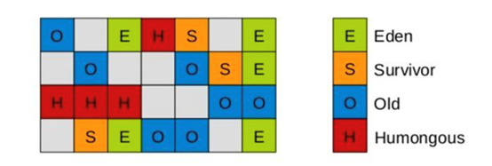

# 一、运行时数据区域


## 1、程序计数器

### 1）特点

内存空间小，线程私有。

### 2）作用

字节码解释器工作是就是通过改变这个计数器的值来选取下一条需要执行指令的字节码指令，分支、循环、跳转、异常处理、线程恢复等基础功能都需要依赖计数器完成

如果线程正在执行一个Java方法，这个计数器记录的是正在执行的虚拟机字节码指令的地址；如果正在执行的是Native方法，这个计数器的值则为(Undefined)。此内存区域是唯一一个在Java虚拟机规范中没有规定任何OutOfMemoryError情况的区域。

## 2、Java虚拟机栈

### 1）特点

线程私有，生命周期和线程一致。

### 2）作用

描述的是Java方法执行的内存模型：每个方法在执行时都会创建一个栈帧(StackFrame)用于存储**局部变量表、操作数栈、动态链接、方法出口**等信息。每一个方法从调用直至执行结束，就对应着一个栈帧从虚拟机栈中入栈到出栈的过程。

### 3）包含

**局部变量表**

局部变量表中存储了基本数据类型（boolean、byte、char、short、int、float、long、double）的局部变量（包括参数）、和对象的引用（String、数组、对象等），但是不存储对象的内容。局部变量表所需的内存空间在编译期间完成分配，在方法运行期间不会改变局部变量表的大小。

> **变量槽**
>
> 局部变量的容量以变量槽（VariableSlot）为最小单位，每个变量槽最大存储32位的数据类型。对于64位的数据类型（long、double），JVM会为其分配两个连续的变量槽来存储。以下简称Slot。
>
> JVM通过索引定位的方式使用局部变量表，索引的范围从0开始至局部变量表中最大的Slot数量。普通方法与static方法在第0个槽位的存储有所不同。非static方法的第0个槽位存储方法所属对象实例的引用。
>
> **Slot复用？**
>
> 为了尽可能的节省栈帧空间，局部变量表中的Slot是可以复用的。方法中定义的局部变量，其作用域不一定会覆盖整个方法。当方法运行时，如果已经超出了某个变量的作用域，即变量失效了，那这个变量对应的Slot就可以交给其他变量使用，也就是所谓的Slot复用。
>
> Slot复用虽然节省了栈帧空间，但是会伴随一些额外的副作用。比如，Slot的复用会直接影响到系统的垃圾收集行为。
>

**操作数栈**

操作数栈是一个先进后出栈。操作数栈的元素可以是任意的Java数据类型。方法刚开始执行时，操作数栈是空的，在方法执行过程中，通过字节码指令对操作数栈进行压栈和出栈的操作。通常进行算数运算的时候是通过操作数栈来进行的，又或者是在调用其他方法的时候通过操作数栈进行参数传递。操作数栈可以理解为栈帧中用于计算的临时数据存储区。

**动态链接**

 **返回地址**

### 4）栈可能出现的异常

- StackOverflowError：线程请求的栈深度大于虚拟机所允许的深度。

- OutOfMemoryError：栈进行动态扩展时如果无法申请到足够内存，会抛出OutOfMemoryError异常。


### 5）如何设置栈参数？

使用`-Xss`设置栈大小，通常几百K就够用了。由于栈是线程私有的，线程数越多，占用栈空间越大。

## 3、本地方法栈

区别于Java虚拟机栈的是，Java虚拟机栈为虚拟机执行Java方法(也就是字节码)服务，而本地方法栈则为虚拟机使用到的Native方法服务。也会有StackOverflowError和OutOfMemoryError异常。

## 4、Java堆

### 1）概念

对于绝大多数应用来说，这块区域是JVM所管理的内存中最大的一块。线程共享。

### 2）作用

主要是存放对象实例和数组。内部会划分出多个线程私有的分配缓冲区(ThreadLocalAllocationBuffer,TLAB)。可以位于物理上不连续的空间，但是逻辑上要连续。

Java堆分为年轻代（YoungGeneration）和老年代（OldGeneration）；年轻代又分为伊甸园（Eden）和幸存区（Survivor区）；幸存区又分为FromSurvivor空间和ToSurvivor空间。

### 3）存储过程

1、年轻代存储“新生对象”，我们新创建的对象存储在年轻代中。当年轻内存占满后，会触发MinorGC，清理年轻代内存空间。

2、老年代存储长期存活的对象和大对象。年轻代中存储的对象，经过多次GC后仍然存活的对象会移动到老年代中进行存储。老年代空间占满后，会触发FullGC。

### 4）存在的异常

OutOfMemoryErorr：如果堆中没有内存完成实例分配，并且堆也无法再扩展时，抛出该异常。

### 5）Java堆设置常用参数

**-Xms：**堆内存初始大小

**-Xmx（MaxHeapSize）：**堆内存最大允许大小，一般不要大于物理内存的80%

**-XX:NewSize（-Xns）：**年轻代内存初始大小

**-XX:MaxNewSize（-Xmn）：**年轻代内存最大允许大小，也可以缩写

**-XX:NewRatio：**新生代和老年代的比值，值为4表示新生代:老年代=1:4，即年轻代占堆的1/5；

**-XX:SurvivorRatio=8：**年轻代中Eden区与Survivor区的容量比例值，默认为8。

表示两个Survivor:eden=2:8，即一个Survivor占年轻代的1/10

**-XX:MaxTenuringThreshold=15：**表示如果在幸存区移动多少次没有被垃圾回收，进入老年代

**-XX:+HeapDumpOnOutOfMemoryError：**内存溢出时，导出堆信息到文件

**-XX:+HeapDumpPath：**堆Dump路径

  -Xmx20m-Xms5m  -XX:+HeapDumpOnOutOfMemoryError  -XX:HeapDumpPath=d:/a.dump  

**-XX:OnOutOfMemoryError：**当发生OOM内存溢出时，执行一个脚本

  -XX:OnOutOfMemoryError=D:/tools/jdk1.7_40/bin/printstack.bat%p  （%p表示线程的idpid）  

### 6）Java中的对象一定在堆上分配吗？

Java对象内存分配策略：


在Java中，典型的对象不在堆上分配的情况有两种：TLAB（ThreadLocalAllocationBuffer）和栈上分配（严格来说TLAB也是属于堆，只是在TLAB比较特殊）。

**1）在栈上分配：**

JVM会对某个对象进行逃逸分析，逃逸分析的一个结果就是对于某些未逃逸对象可以直接在栈上分配，由于该对象一定是局部的，所以栈上分配不会有问题。

缺点：可能出现系统不稳定的情况，或因分析过程耗时但却无法有效判别出非逃逸对象而导致性能（即时编译的收益）有所下降。

**2）在TLAB上分配：**

把内存分配的动作按照线程划分在不同的空间之中进行，即每个线程在Java堆中预先分配一小块内存，称为本地线程分配缓冲（ThreadLocalAllocationBuffer,TLAB）。

优点：JVM在内存新生代EdenSpace中开辟了一小块区域，由线程私有，称作TLAB（Thread-localallocationbuffer），默认设定为占用EdenSpace的1%。在Java程序中很多对象都是小对象且用过即丢，它们不存在线程共享也适合被快速GC，所以对于小对象通常JVM会优先分配在TLAB上，并且TLAB上的分配由于是线程私有所以没有锁开销。因此在实践中分配多个小对象的效率通常比分配一个大对象的效率要高。

### 7）为什么不直接在堆上分配？

我们知道堆是由所有线程共享的，既然如此那它就是竞争资源，对于竞争资源，必须采取必要的同步，所以当使用new关键字在堆上分配对象时，是需要锁的。既然有锁，就必定存在锁带来的开销，而且由于是对整个堆加锁，相对而言锁的粒度还是比较大的，影响效率。而无论是TLAB还是栈都是线程私有的，私有即避免了竞争。

所以对于某些特殊情况，可以采取避免在堆上分配对象的办法，以提高对象创建和销毁的效率。

## 5、方法区

### 1）概念

属于共享内存区域，存储已被虚拟机加载的类信息、常量、静态变量、即时编译器编译后的代码等数据。

### 2）常量池


#### 1. 含义

常量池中存储编译器生成的各种字面量和符号引用。字面量就是Java中常量的意思。比如文本字符串，final修饰的常量等。方法引用则包括类和接口的全限定名，方法名和描述符，字段名和描述符等。

属于方法区一部分，用于存放编译期生成的各种字面量和符号引用。编译器和运行期(String的intern())都可以将常量放入池中。内存有限，无法申请时抛出OutOfMemoryError。

#### 2. 作用

常量池避免了频繁的创建和销毁对象而影响系统性能，其实现了对象的共享。

#### 3. 包含

##### I. 字面量

###### a）基本数据类型的值

Integer常量池

Integer中有一个valueOf方法，它判断变量是否在IntegerCache的最小值（-128）和最大值（127）之间，如果在，则返回常量池中的内容，否则new一个Integer对象。

而IntegerCache是Integer的静态内部类，作用就是将[-128,127]之间的数“缓存”在IntegerCache类的cache数组中，valueOf方法就是调用常量池的cache数组

IntegerCache类中，包含一个构造方法，三个静态变量：low最小值、high最大值、和Integer数组，还有一个静态代码块。静态代码块的作用就是在IntegerCache类加载的时候，对high最大值以及Integer数组初始化。也就是说当IntegerCache类加载的时候，最大最小值，和Integer数组就已经初始化好了。这个Integer数组其实就是包含了-128到127之间的所有值。

###### b） 字符串

String常量池

String通常有两种创建对象的方式

String str=new String("abcd");

使用new创建的对象，存放在堆中。每次调用都会创建一个新的对象。

String str="abcd";

先在栈上创建一个String类的对象引用变量str，然后通过符号引用去字符串常量池中找有没有“abcd”，如果没有，则将“abcd”存放到字符串常量池中，并将栈上的str变量引用指向常量池中的“abcd”。如果常量池中已经有“abcd”了，则不会再常量池中创建“abcd”，而是直接将str引用指向常量池中的“abcd”。

> **1、关于字符串+号连接问题**
>
> 对于字符串常量的+号连接，在程序编译期，JVM就会将其优化为+号连接后的值。所以在编译期其字符串常量的值就确定了。
>
> String a="a1";
>
> String b="a"+1;
>
> System.out.println((a==b));//result=true
>
> 对于字符串引用的+号连接问题，由于字符串引用在编译期是无法确定下来的，在程序的运行期动态分配并创建新的地址存储对象。
>
> String str1="a";
>
> String str2="ab";
>
> String str3=str1+"b";
>
> System.out.print(str2==str3);//false
>
> jad反编译工具反编译代码
>
> String s="a";
>
> String s1="ab";
>
> String s2=(newStringBuilder()).append(s).append("b").toString();
>
> 发现new了一个StringBuilder对象，然后使用append方法优化了+操作符。new在堆上创建对象，而Strings1=“ab”则是在常量池中创建对象，两个应用所指向的内存地址是不同的，所以s1==s2结果为false。
>
> **2、String对象的intern方法**
>
> **例一：**
>
> String s="ab";
>
> String s1="a";
>
> String s2="b";
>
> String s3=s1+s2;
>
> System.out.println(s3==s);//false
>
> System.out.println(s3.intern()==s);//true
>
> s1+s2实际上在堆上new了一个StringBuilder对象，而s在常量池中创建对象“ab”，所以s3==s为false。但是s3调用intern方法，返回的是s3的内容（ab）在常量池中的地址值。所以s3.intern()==s结果为true。
>
> **例二：**
>
> String s1=new String("1")+new String("1");
>
> s1.intern();
>
> Strings2="11";
>
> System.out.println(s1==s2);
>
> 运行结果：
>
> JDK6运行结果：false
>
> JDK7运行结果：true
>
> 1.6
>
> s1.intern()运行时，首先去常量池查找，发现没有该常量，则在常量池中开辟空间存储"11"，返回常量池中的值（注意这里也没有使用该返回值），第三行中，s2直接指向常量池里边的字符串，所以s1和s2不相等。
>
> 1.7
>
> 由于字符串常量池在堆空间中，所以在s1.intern()运行时，发现字符串常量池没有常量，则添加堆中“11”对象的引用到字符串常量池，这个引用返回堆空间“11”地址（注意这里也没有使用该返回值），这时s2通过查找字符串常量池中的常量，查到的是s1.intern()存在字符串常量池里的“11”对象的引用，既然都是指向堆上的“11”对象，所以s1和s2相等。
>

###### c） final修饰的常量

使用final修饰的字符串

final String str1="a";

String str2="ab";

String str3=str1+"b";

System.out.print(str2==str3);//true

final修饰的变量是一个常量，编译期就能确定其值。所以str1+"b"就等同于"a"+"b"，所以结果是true。

##### II. 符号引用

类和接口的全限定名；

方法名和描述符；

字段名和描述符。

### 3）三个池的概念


#### 1. 常量池

常量池，也叫Class常量池(常量池==Class常量池)。Java文件被编译成Class文件，Class文件中除了包含类的版本、字段、方法、接口等描述信息外，还有一项就是常量池，常量池是当Class文件被Java虚拟机加载进来后存放在方法区各种字面量(Literal)和符号引用。

#### 2. 运行时常量池

运行时常量池是方法区的一部分。运行时常量池是当Class文件被加载到内存后，Java虚拟机会将Class文件常量池里的内容转移到运行时常量池里(运行时常量池也是每个类都有一个)。运行时常量池相对于Class文件常量池的另外一个重要特征是具备动态性，Java语言并不要求常量一定只有编译期才能产生，也就是并非预置入Class文件中常量池的内容才能进入方法区运行时常量池，运行期间也可能将新的常量放入池中。

#### 3. 字符串常量池

字符串常量池又称为：字符串池，全局字符串池,英文也叫StringPool。在工作中，String类是我们使用频率非常高的一种对象类型。JVM为了提升性能和减少内存开销，避免字符串的重复创建，其维护了一块特殊的内存空间。字符串常量池由String类私有的维护。

### 4）注意

JDK1.8使用元空间MetaSpace替代方法区，元空间并不在JVM中，而是使用本地内存。元空间两个参数：

MetaSpaceSize：初始化元空间大小，控制发生GC阈值

MaxMetaspaceSize：限制元空间大小上限，防止异常占用过多物理内存

## 6、直接内存

在JDK1.4中新加入NIO(NewInput/Output)类，引入了一种基于通道(Channel)和缓存(Buffer)的I/O方式，它可以使用Native函数库直接分配堆外内存，然后通过一个存储在Java堆中的DirectByteBuffer对象作为这块内存的引用进行操作。可以避免在Java堆和Native堆中来回的数据耗时操作。

OutOfMemoryError：会受到本机内存限制，如果内存区域总和大于物理内存限制从而导致动态扩展时出现该异常。

---


# 二、垃圾回收器与内存分配策略

## 1、概述

程序计数器、虚拟机栈、本地方法栈3个区域随线程生灭(因为是线程私有)，栈中的栈帧随着方法的进入和退出而有条不紊地执行着出栈和入栈操作。而Java堆和方法区则不一样，一个接口中的多个实现类需要的内存可能不一样，一个方法中的多个分支需要的内存也可能不一样，我们只有在程序处于运行期才知道哪些对象会创建，这部分内存的分配和回收都是动态的，垃圾回收器所关注的就是这部分内存。

## 2、什么是垃圾

在JVM进行垃圾回收之前，首先就是判断哪些对象是垃圾，也就是说，要判断哪些对象是可以被销毁的，其占有的空间是可以被回收的。根据JVM的架构划分，我们知道，在Java世界中，几乎所有的对象实例都在堆中存放，所以垃圾回收也主要是针对堆来进行的。

在JVM的眼中，垃圾就是指那些在堆中存在的，已经“死亡”的对象。而对于“死亡”的定义，我们可以简单的将其理解为“不可能再被任何途径使用的对象”。那怎样才能确定一个对象是存活还是死亡呢？这就涉及到了垃圾判断算法，其主要包括*引用计数法*和*可达性分析法*。

## 3、四种引用

### 1）强引用

如Object obj = new Object()，这类引用是Java程序中最普遍的。只要强引用还存在，垃圾收集器就永远不会回收掉被引用的对象。

**使用场景：**例如数组

### 2）软引用

它用来描述一些可能还有用，但并非必须的对象。在系统内存不够用时，这类引用关联的对象将被垃圾收集器回收。JDK1.2之后提供了SoftReference类来实现软引用。

**使用场景：**创建缓存

```java
// 软引用  
String str = new String("abc");  
SoftReference<String> softReference  = new SoftReference<String>(str);  
```

### 3）弱引用

它也是用来描述非必须对象的，但它的强度比软引用更弱些，被弱引用关联的对象只能生存到下一次垃圾收集发生之前。当垃圾收集器工作时，无论当前内存是否足够，都会回收掉只被弱引用关联的对象。在JDK1.2之后，提供了WeakReference类来实现弱引用。

**使用场景：**WeakHashMap类中的key，ThreadLocalMap中的key

```java
public static void main(String[] args) {
    //这里不要使用 str= "哈哈哈哈"
    // 这样导致系统会使用常量池来管理这个字符串，造成强引用
    String str = new String("哈哈哈哈");
    WeakReference wr = new WeakReference(str);
    str = null;
    System.out.println(wr.get());//输出：哈哈哈哈
    //强制垃圾回收
    System.gc();
    System.runFinalization();
    System.out.println(wr.get());//输出：null
}
```

### 4）虚引用

也称为幻引用，最弱的一种引用关系，完全不会对其生存时间构成影响，也无法通过虚引用来取得一个对象实例。为一个对象设置虚引用关联的唯一目的是希望能在这个对象被收集器回收时收到一个系统通知。JDK1.2之后提供了PhantomReference类来实现虚引用。

**使用场景：**用于对象销毁前的一些操作，比如说资源释放等。

```java
public static void main(String[] args) {
    String str = new String("哈哈哈");
    ReferenceQueue rq = new ReferenceQueue();
    PhantomReference pr = new PhantomReference(str, rq);
    str = null;

    //并不能通过虚引用来获取被引用的对象
    System.out.println(pr.get());//输出：null
    System.gc();
    System.runFinalization();
    //取出引用队列中最先进入队列的引用和pr比较
    System.out.println(rq.poll() == pr);//输出：true
}
```

关于引用队列-ReferenceQueue：

- ReferenceQueue用于保存被回收后对象的引用；
- 软引用和弱引用可以单独使用，但虚引用不能，虚引用必须和ReferenceQueue联合使用；
- 与软引用和弱引用不同，虚引用在对象被释放之前，将把它对应的虚引用添加到关联的ReferenceQueue中，这使得可以在对象被回收之前采取行动。

 

## 4、如何判断对象可以回收

### 1）引用计数法

给对象添加一个引用计数器。但是难以解决循环引用问题。

### 2）可达性分析法

将一系列的根对象作为起始点，从这些节点开始向下搜索，搜索所走过的路径称为引用链，如果一个对象到根对象没有任何引用链相连，那么这个对象就不是可达的，也称之为不可达对象。

## 5、可作为GCRoots的对象：

- 虚拟机栈(栈帧中的本地变量表)中引用的对象

- 方法区中的类静态属性引用的对象

- 方法区中的常量池引用的对象

- 本地方法栈中JNI(即一般说的Native方法)引用的对象

- 活跃线程（已启动且未停止的Java线程）


> 即使在可达性分析算法中不可达的对象，也并非是“非死不可”的，这时候它们暂时出于“缓刑”阶段，一个对象的真正死亡至少要经历两次标记过程：如果对象在进行中可达性分析后发现没有与GCRoots相连接的引用链，那他将会被第一次标记并且进行一次筛选，筛选条件是此对象是否有必要执行finalize()方法。当对象没有覆盖finalize()方法，或者finalize()方法已经被虚拟机调用过，虚拟机将这两种情况都视为“没有必要执行”。
>
> 如果这个对象被判定为有必要执行finalize()方法，那么这个对象就会放置在一个叫做F-Queue的队列中，并在稍后由一个由虚拟机自动建立的、低优先级的Finalizer线程去执行它。这里所谓的“执行”是指虚拟机会出发这个方法，并不承诺或等待他运行结束。finalize()方法是对象逃脱死亡命运的最后一次机会，稍后GC将对F-Queue中的对象进行第二次小规模的标记，如果对象要在finalize()中成功拯救自己——只要重新与引用链上的任何一个对象建立关联即可。
>
> finalize()方法只会被系统自动调用一次。  

## 6、垃圾回收算法

### 1）标记清除

#### 1. 含义

标记-清除（TracingCollector）算法是最基础的收集算法，为了解决引用计数法的问题而提出。它使用了根集的概念，它分为“标记”和“清除”两个阶段：首先标记出所需回收的对象，在标记完成后统一回收掉所有被标记的对象，它的标记过程其实就是前面的可达性分析法中判定垃圾对象的标记过程。

#### 2. 优点

不需要进行对象的移动，并且仅对不存活的对象进行处理，在存活对象比较多的情况下极为高效。

#### 3. 缺点

1） 标记和清除过程的效率都不高；

2） 这种方法需要使用一个空闲列表来记录所有的空闲区域以及大小，对空闲列表的管理会增加分配对象时的工作量；

3） 标记清除后会产生*大量不连续的内存碎片*，虽然空闲区域的大小是足够的，但却可能没有一个单一区域能够满足这次分配所需的大小，因此本次分配还是会失败，不得不触发另一次垃圾收集动作。

### 2）标记整理算法

#### 1. 含义

标记 - 整理（CompactingCollector）算法标记的过程与“标记-清除”算法中的标记过程一样，但对标记后出的垃圾对象的处理情况有所不同，它不是直接对可回收对象进行清理，而是让所有的对象都向一端移动，然后直接清理掉端边界以外的内存。在基于“标记-整理”算法的收集器的实现中，一般增加句柄和句柄表。

#### 2. 优点

经过整理之后，新对象的分配只需要通过指针碰撞便能完成，比较简单；

使用这种方法，空闲区域的位置是始终可知的，也不会再有碎片的问题了。

#### 3. 缺点

GC暂停的时间会增长，因为你需要将所有的对象都拷贝到一个新的地方，还得更新它们的引用地址。

### 3）复制算法

#### 1. 含义

复制（CopyingCollector）算法的提出是为了克服句柄的开销和解决堆碎片的垃圾回收。它将内存按容量分为大小相等的两块，每次只使用其中的一块（对象面），当这一块的内存用完了，就将还存活着的对象复制到另外一块内存上面（空闲面），然后再把已使用过的内存空间一次清理掉。

#### 2. 评价

复制算法比较适合于新生代（短生存期的对象），在老年代（长生存期的对象）中，对象存活率比较高，如果执行较多的复制操作，效率将会变低，所以老年代一般会选用其他算法，如“标记-整理”算法。一种典型的基于复制算法的垃圾回收是stop-and-copy算法，它将堆分成对象区和空闲区，在对象区与空闲区的切换过程中，程序暂停执行。

#### 3. 优点

标记阶段和复制阶段可以同时进行；每次只对一块内存进行回收，运行高效；只需移动栈顶指针，按顺序分配内存即可，实现简单；内存回收时不用考虑内存碎片的出现。

#### 4. 缺点

需要一块能容纳下所有存活对象的额外的内存空间。因此，可一次性分配的最大内存缩小了一半。

### 4）分代收集算法

#### 1. 含义

分代收集（GenerationalCollector）算法将堆内存划分为新生代、老年代和永久代。新生代又被进一步划分为Eden和Survivor区，其中Survivor由FromSpace（Survivor0）和ToSpace（Survivor1）组成。所有通过new创建的对象的内存都在堆中分配，其大小可以通过-Xmx和-Xms来控制。分代收集，是基于这样一个事实：不同的对象的生命周期是不一样的。因此，可以将不同生命周期的对象分代，不同的代采取不同的回收算法进行垃圾回收，以便提高回收效率。

- **新生代**

几乎所有新生成的对象首先都是放在年轻代的。新生代内存按照8:1:1的比例分为一个Eden区和两个Survivor（Survivor0，Survivor1）区。大部分对象在Eden区中生成。当新对象生成，Eden空间申请失败（因为空间不足等），则会发起一次GC（ScavengeGC）。回收时先将Eden区存活对象复制到一个Survivor0区，然后清空Eden区，当这个Survivor0区也存放满了时，则将Eden区和Survivor0区存活对象复制到另一个Survivor1区，然后清空Eden和这个Survivor0区，此时Survivor0区是空的，然后将Survivor0区和Survivor1区交换，即保持Survivor1区为空，如此往复。当Survivor1区不足以存放Eden和Survivor0的存活对象时，就将存活对象直接存放到老年代。当对象在Survivor区躲过一次GC的话，其对象年龄便会加1，默认情况下，如果对象年龄达到15岁，就会移动到老年代中。若是老年代也满了就会触发一次FullGC，也就是新生代、老年代都进行回收。新生代大小可以由-Xmn来控制，也可以用-XX:SurvivorRatio来控制Eden和Survivor的比例。

- **老年代**

在新生代中经历了N次垃圾回收后仍然存活的对象，就会被放到年老代中。因此，可以认为老年代中存放的都是一些生命周期较长的对象。内存比新生代也大很多（大概比例是1:2），当老年代内存满时触发FullGC，FullGC发生频率比较低，老年代对象存活时间比较长，存活率高。一般来说，大对象会被直接分配到老年代。所谓的大对象是指需要大量连续存储空间的对象，最常见的一种大对象就是大数组。当然分配的规则并不是百分之百固定的，这要取决于当前使用的是哪种垃圾收集器组合和JVM的相关参数。

- **永久代**

用于存放静态文件（class类、方法）和常量等。永久代对垃圾回收没有显著影响，但是有些应用可能动态生成或者调用一些class，例如Hibernate等，在这种时候需要设置一个比较大的持久代空间来存放这些运行过程中新增的类。对永久代的回收主要回收两部分内容：废弃常量和无用的类。永久代在JavaSE8特性中已经被移除了，取而代之的是元空间（MetaSpace），因此也不会再出现java.lang.OutOfMemoryError:PermGenerror的错误了。 

#### 2. 特点

特别地，在分代收集算法中，对象的存储具有以下特点：

- 对象优先在Eden区分配。

- 大对象直接进入老年代。

- 长期存活的对象将进入老年代，默认为15岁。


>   为什么是15？在32位的HotSpot虚拟机中，如果对象处于未被锁定的状态下，那么MarkWord的32bit空间中25bit用于存储对象哈希码，4bit用于存储对象分代年龄，2bit用于存储锁标志位，1bit固定为0，其中对象的分代年龄占4位，也就是从0000到1111，而其值最大为15，所以分代年龄也就不可能超过15这个数值了。  
>

#### 3. GC的分类

1） 新生代GC（MinorGC/ScavengeGC）

发生在新生代的垃圾收集动作。因为Java对象大多都具有朝生夕灭的特性，因此MinorGC非常频繁（不一定等Eden区满了才触发），一般回收速度也比较快。在新生代中，每次垃圾收集时都会发现有大量对象死去，只有少量存活，因此可选用复制算法来完成收集。

2） 老年代GC（MajorGC/FullGC）

发生在老年代的垃圾回收动作。MajorGC经常会伴随至少一次MinorGC。由于老年代中的对象生命周期比较长，因此MajorGC并不频繁，一般都是等待老年代满了后才进行FullGC，而且其速度一般会比MinorGC慢10倍以上。另外，如果分配了DirectMemory，在老年代中进行FullGC时，会顺便清理掉DirectMemory中的废弃对象。而老年代中因为对象存活率高、没有额外空间对它进行分配担保，就必须使用“标记-清除”算法或“标记-整理”算法来进行回收。

#### 4. 补充

1） 新生代采用空闲指针的方式来控制GC触发，指针保持最后一个分配的对象在新生代区间的位置，当有新的对象要分配内存时，用于检查空间是否足够，不够就触发GC。当连续分配对象时，对象会逐渐从Eden到Survivor，最后到老年代。

2） 在某些场景下，老年代的对象可能引用新生代的对象，那标记存活对象的时候，需要扫描老年代中的所有对象。因为该对象拥有对新生代对象的引用，那么这个引用也会被称为GCRoots。那是不是要做全堆扫描呢？成本也太高了吧?

3） HotSpot给出的解决方案是一项叫做卡表（CardTable）的技术，该技术将整个堆划分为一个个大小为512字节的卡，并且维护一个卡表，用来存储每张卡的一个标识位。这个标识位代表对应的卡是否可能存有指向新生代对象的引用。如果可能存在，那么我们就认为这张卡是脏的。

4） 在进行MinorGC的时候，我们便可以不用扫描整个老年代，而是在卡表中寻找脏卡，并将脏卡中的对象加入到MinorGC的GCRoots里。当完成所有脏卡的扫描之后，Java虚拟机便会将所有脏卡的标识位清零。

5） 由于MinorGC伴随着存活对象的复制，而复制需要更新指向该对象的引用。因此，在更新引用的同时，我们又会设置引用所在的卡的标识位。这个时候，我们可以确保脏卡中必定包含指向新生代对象的引用。

6） 想要保证每个可能有指向新生代对象引用的卡都被标记为脏卡，那么Java虚拟机需要截获每个引用型实例变量的写操作，并作出对应的写标识位操作。

7） 卡表能用于减少老年代的全堆空间扫描，这能很大的提升GC效率。

## 7、垃圾回收器

### 1）Serial收集器

串行收集器采用单线程方式进行收集，且在GC线程工作时，系统不允许应用线程打扰。此时，应用程序进入暂停状态，即Stop-the-world。Stop-the-world暂停时间的长短，是衡量一款收集器性能高低的重要指标。**Serial是针对新生代的垃圾回收器，采用“复制”算法。**

### 2）ParNew收集器

并行收集器充分利用了多处理器的优势，采用多个GC线程并行收集。可想而知，多条GC线程执行显然比只使用一条GC线程执行的效率更高。一般来说，与串行收集器相比，在多处理器环境下工作的并行收集器能够极大地缩短Stop-the-world时间。**ParNew是针对新生代的垃圾回收器，采用“复制”算法，可以看成是Serial的多线程版本。**

### 3）ParallelScavenge收集器

**ParallelScavenge是针对新生代的垃圾回收器，采用“复制”算法，**和ParNew类似，但更注重吞吐率。在ParNew的基础上演化而来的ParallelScanvenge收集器被誉为“*吞吐量优先*”收集器。吞吐量就是CPU用于运行用户代码的时间与CPU总消耗时间的比值，即吞吐量=运行用户代码时间/（运行用户代码时间+垃圾收集时间）。如虚拟机总运行了100分钟，其中垃圾收集花掉1分钟，那吞吐量就是99%。但要注意停顿时间与吞吐量这两个目标是相悖的，降低停顿时间的同时也会引起吞吐的降低。垃圾收集停顿时间缩短是以牺牲吞吐量和新生代空间位代价换取的。因此需要将目标控制在一个合理的范围中。

控制参数：

`-XX：MaxGCPauseMills`：期望收集时间上限，用来控制收集对应用程序停顿的影响。

`-XX：GCTimeRatio=n`：设置ParallelScavenge垃圾回收时间占程序运行时间的百分比。公式为1/(1+n)，用来控制吞吐量。

`-XX：UseAdaptiveSizePolicy`：自动分代大小调节策略。

`-XX:ParallelGCThreads=n`：设置ParallelScavenge收集时使用的CPU数。并行收集线程数。

### 4）SerialOld收集器

SerialOld是Serial收集器的老年代版本，单线程收集器，采用“标记-整理”算法。这个收集器的主要意义也是在于给Client模式下的虚拟机使用。

### 5）ParallelOld收集器

ParallelOld是ParallelScanvenge收集器的老年代版本，多线程收集器，采用“标记-整理”算法。

### 6）CMS收集器

#### 1. 目的

CMS（ConcurrentMarkSweep）收集器是一种*以获取最短回收停顿时间为目标*的收集器。CMS收集器仅作用于**老年代**的收集，采用*“标记-清除”*算法。

#### 2. 步骤

初始标记（CMSinitialmark）

并发标记（CMSconcurrentmark）

重新标记（CMSremark）

并发清除（CMSconcurrentsweep）

#### 3. 步骤的解释

其中，初始标记、重新标记这两个步骤仍然需要Stop-the-world。初始标记仅仅只是标记一下GCRoots能直接关联到的对象，速度很快，并发标记阶段就是进行GCRootsTracing的过程，而重新标记阶段则是为了修正并发标记期间因用户程序继续运作而导致标记产生变动的那一部分对象的标记记录，这个阶段的停顿时间一般会比初始阶段稍长一些，但远比并发标记的时间短。

CMS以流水线方式拆分了收集周期，将耗时长的操作单元保持与应用线程并发执行。只将那些必需STW才能执行的操作单元单独拎出来，控制这些单元在恰当的时机运行，并能保证仅需短暂的时间就可以完成。这样，在整个收集周期内，只有两次短暂的暂停（初始标记和重新标记），达到了近似并发的目的。

#### 4. 优点

并发收集，低停顿。

#### 5. 缺点

CMS收集器对CPU资源非常敏感；

CMS收集器无法处理浮动垃圾；

CMS收集器是基于“标记-清除”算法，该算法的缺点都有。

> **浮动垃圾（CMS）含义** 
>
>  并发清理阶段用户线程还在运行，这段时间就可能产生新的垃圾，新的垃圾在此次GC无法清除，只能等到下次清理。这些垃圾有个专业名词：浮动垃圾。
>
> **为什么重新标记无法解决浮动垃圾**
>
> 重新标记的作用在于：之前并发标记时，因为GC和用户程序是并发运行的，可能导致一部分已经标记为 从 GC Roots 不可达 的对象，因为用户程序的（并发）运行，又可达了，Remark 的作用就是将这部分对象又标记为可达对象。至于 “浮动垃圾”，因为 CMS 在 并发标记 时是并发的，GC 线程和用户线程并发执行，这个过程当然可能会因为线程的交替执行而导致新产生的垃圾（即浮动垃圾）没有被标记到；而 重新标记 的作用只是修改之前 并发标记 所获得的不可达对象，所以是没有办法处理“浮动垃圾”的。

#### 6. 评价

CMS收集器之所以能够做到并发，根本原因在于采用基于“标记-清除”的算法并对算法过程进行了细粒度的分解。前面已经介绍过“标记-清除”算法将产生大量的内存碎片这对新生代来说是难以接受的，因此新生代的收集器并未提供CMS版本。

### 7）G1收集器

#### 1. 使用范围

新生代和老年代

G1（GarbageFirst）重新定义了堆空间，打破了原有的分代模型，将堆划分为一个个区域。这么做的目的是在进行收集时不必在全堆范围内进行，这是它最显著的特点。区域划分的好处就是带来了停顿时间可预测的收集模型：用户可以指定收集操作在多长时间内完成，即G1提供了接近实时的收集特性。

#### 2. 特点

1） 并行与并发

G1能充分利用多CPU、多核环境下的硬件优势，使用多个CPU来缩短Stop-the-world停顿的时间，部分其他收集器原来需要停顿Java线程执行的GC操作，G1收集器仍然可以通过并发的方式让Java程序继续运行。

2） 分代收集

打破了原有的分代模型，将堆划分为一个个区域。

3） 空间整合

与CMS的“标记-清除”算法不同，G1从整体来看是基于“标记-整理”算法实现的收集器，从局部（两个Region之间）上来看是基于“复制”算法实现的。但无论如何，这两种算法都意味着G1运作期间不会产生内存空间碎片，收集后能提供规整的可用内存。这种特性有利于程序长时间运行，分配大对象时不会因为无法找到连续内存空间而提前触发下一次GC。

4） 可预测的停顿

这是G1相对于CMS的一个优势，降低停顿时间是G1和CMS共同的关注点。

#### 3. 说说G1的模型

G1将堆分成许多相同大小的区域单元，每个单元称为Region，Region是一块地址连续的内存空间，堆内存会被切分成为很多个固定大小的Region，每个是连续范围的虚拟内存。堆内存中一个Region的大小可以通过-XX:G1HeapRegionSize参数指定，其区间最小为1M、最大为32M，默认把堆内存按照2048份均分。

每个Region被标记了E、S、O和H，这些区域在逻辑上被映射为Eden，Survivor和老年代。存活的对象从一个区域转移（即复制或移动）到另一个区域，区域被设计为并行收集垃圾，可能会暂停所有应用线程。

 

如上图所示，区域可以分配到Eden，Survivor和老年代。此外，还有第四种类型，被称为巨型区域（HumongousRegion）。Humongous区域是为了那些存储超过50%标准Region大小的对象而设计的，它用来专门存放巨型对象。如果一个H区装不下一个巨型对象，那么G1会寻找连续的H分区来存储。为了能找到连续的H区，有时候不得不启动FullGC。

G1收集器之所以能建立可预测的停顿时间模型，是因为它可以有计划地避免在整个Java堆中进行全区域的垃圾收集。G1会通过一个合理的计算模型，*计算出每个Region的收集成本并量化*，这样一来，收集器在给定了“停顿”时间限制的情况下，总是能选择一组恰当的Region作为收集目标，让其收集开销满足这个限制条件，以此达到实时收集的目的。

  对于打算从CMS或者ParallelOld收集器迁移过来的应用，按照官方的建议，如果发现符合如下特征，可以考虑更换成G1收集器以追求更佳性能：  实时数据占用了超过半数的堆空间；  对象分配率或“晋升”的速度变化明显；  期望消除耗时较长的GC或停顿（超过0.5~1秒）。  

#### 4. G1收集的运作过程

1）初始标记

仅仅只是标记一下GCRoots能直接关联到的对象，并且修改TAMS（NextTopatMarkStart）的值，让下一阶段用户程序并发运行时，能在正确可用的Region中创建新对象，这阶段需要停顿java线程，但耗时很短。

2）并发标记

是从GCRoots开始堆中对象进行可达性分析，找出存活的对象，这阶段耗时较长，但可与用户程序并发执行。

3）最终标记

是为了修正并发标记期间因用户程序继续运作而导致标记产生变动的那一部分标记记录（虚拟机将这段时间对象变化记录在线程RememberedSetLogs里面，最终标记阶段需要把RememberedSetLogs的数据合并到RememberedSet中）这阶段需要停顿线程，但是可并行执行（即最终标记线程同时执行））。

4）筛选标记

首先对各个Region的回收价值和成本进行排序，根据用户所期望的GC停顿时间来制定回收计划。这个阶段也可以做到与用户程序一起并发执行，但是因为只回收一部分Region，时间是用户可控制的，而且停顿用户线程将大幅提高收集效率。

#### 5. G1的GC模式可以分为两种

- YoungGC：在分配一般对象（非巨型对象）时，当所有Eden区域使用达到最大阀值并且无法申请足够内存时，会触发一次YoungGC。每次YoungGC会回收所有Eden以及Survivor区，并且将存活对象复制到Old区以及另一部分的Survivor区。

- MixedGC：当越来越多的对象晋升到老年代时，为了避免堆内存被耗尽，虚拟机会触发一个混合的垃圾收集器，即MixedGC，该算法并不是一个OldGC，除了回收整个新生代，还会回收一部分的老年代，这里需要注意：是一部分老年代，而不是全部老年代，可以选择哪些Old区域进行收集，从而可以对垃圾回收的耗时时间进行控制。G1没有FullGC概念，需要FullGC时，调用SerialOldGC进行全堆扫描。


## 8、垃圾收集相关的常用参数及其含义

- 查看JVM使用的默认垃圾收集器：`java-XX:+PrintCommandLineFlags-version`

- `UseSerialGC`：虚拟机运行在Client模式下的默认值，打开次开关后，使用Serial+SerialOld的收集器组合进行内存回收；
- UseParNewGC：打开次开关后，使用ParNew+SerialOld的收集器组合进行内存回收；

- UseConcMarkSweepGC：打开次开关后，使用ParNew+CMS+SerialOld的收集器组合进行内存回收，SerialOld收集器将作为CMS收集器出现ConcurrentModeFailure失败后的备用收集器使用；

- UseParallelGC：虚拟机运行在Server模式下的默认值，打开此开关后，使用ParallelScavenge+SerialOld（PSMarkSweep）的收集器组合进行内存回收(JDK8默认打开了UseParallelGC参数)；
- UseParallelOldGC：打开此开关后，使用ParallelScavenge+ParallelOld的收集器组合进行内存回收


# 三、虚拟机类加载机制

## 1、类加载过程

### 1）加载

#### 1. 含义

加载指的是将类的class文件读入到内存，并为之创建一个java.lang.Class对象，也就是说，当程序中使用任何类时，系统都会为之建立一个java.lang.Class对象。

#### 2. 来源

从本地文件系统加载class文件（绝大部分示例程序的类加载方式）

从JAR包加载class文件（这种方式也是很常见的，前面介绍JDBC编程时用到的数据库驱动类就放在JAR文件中Class.forName(driver)，JVM可以从JAR文件中直接加载该class文件）；

通过网络加载class文件；

把一个Java源文件动态编译，并执行加载。

#### 3. 加载时机

类加载器通常无须等到“首次使用”该类时才加载该类，Java虚拟机规范允许系统预先加载某些类。

### 2）链接

#### 1. 含义

当类被加载之后，系统为之生成一个对应的Class对象，接着将会进入链接阶段，链接阶段负责把类的二进制数据合并到JRE中。

#### 2. 阶段

##### 1）验证

1. 含义：验证阶段用于检验被加载的类是否有正确的内部结构，并和其他类协调一致。

2. 种类：

   - **文件格式验证：**主要验证字节流是否符合Class文件格式规范，并且能被当前的虚拟机加载处理。例如：主，次版本号是否在当前虚拟机处理的范围之内。常量池中是否有不被支持的常量类型。指向常量的中的索引值是否存在不存在的常量或不符合类型的常量。

   - **元数据验证：**对字节码描述的信息进行语义的分析，分析是否符合java的语言语法的规范。
   - **字节码验证：**最重要的验证环节，分析数据流和控制，确定语义是合法的，符合逻辑的。主要的针对元数据验证后对方法体的验证。保证类方法在运行时不会有危害出现。
   - **符号引用验证：**主要是针对符号引用转换为直接引用的时候，是会延伸到第三解析阶段，主要去确定访问类型等涉及到引用的情况，主要是要保证引用一定会被访问到，不会出现类等无法访问的问题。

##### 2）准备

类准备阶段负责为类的静态变量分配内存，并设置默认初始值。

##### 3）解析

将常量池中的符号引用解析为直接引用（将类的二进制数据中的符号引用替换成直接引用。）说明一下：符号引用：符号引用是以一组符号来描述所引用的目标，符号可以是任何的字面形式的字面量，只要不会出现冲突能够定位到就行。布局和内存无关。直接引用：是指向目标的指针，偏移量或者能够直接定位的句柄。该引用是和内存中的布局有关的，并且一定加载进来的。

### 3）初始化

初始化是为类的静态变量赋予正确的初始值。

> 准备阶段和初始化阶段看似有点矛盾，其实是不矛盾的，如果类中有语句：privatestaticinta=10，它的执行过程是这样的，首先字节码文件被加载到内存后，先进行链接的验证这一步骤，验证通过后准备阶段，给a分配内存，因为变量a是static的，所以此时a等于int类型的默认初始值0，即a=0,然后到解析，到初始化这一步骤时，才把a的真正的值10赋给a,此时a=10。

## 2、类加载时机

1） 创建类的实例，也就是new一个对象；

2） 访问某个类或接口的静态变量，或者对该静态变量赋值；

3） 调用类的静态方法；

4） 反射（Class.forName）；

5） 初始化一个类的子类（会首先初始化子类的父类）；

6） JVM启动时标明的启动类，即文件名和类名相同的那个类。

> **注意**
>
> 对于一个final类型的静态变量，如果该变量的值在编译时就可以确定下来，那么这个变量相当于“宏变量”。Java编译器会在编译时直接把这个变量出现的地方替换成它的值，因此即使程序使用该静态变量，也不会导致该类的初始化。反之，如果final类型的静态Field的值不能在编译时确定下来，则必须等到运行时才可以确定该变量的值，如果通过该类来访问它的静态变量，则会导致该类被初始化。
>

## 3、类加载器

### 1）含义

类加载器负责加载所有的类，其为所有被载入内存中的类生成一个java.lang.Class实例对象。一旦一个类被加载到JVM中，同一个类就不会被再次载入了。

### 2）分类

#### 1. 根类加载器（bootstrapclassloader）

它用来加载Java的核心类，是用原生代码来实现的，并不继承自java.lang.ClassLoader（负责加载$JAVA_HOME中jre/lib/rt.jar里所有的class，由C++实现，不是ClassLoader子类）。由于引导类加载器涉及到虚拟机本地实现细节，开发者无法直接获取到启动类加载器的引用，所以不允许直接通过引用进行操作。

#### 2. 扩展类加载器（extensionsclassloader）

它负责加载JRE的扩展目录，lib/ext或者由java.ext.dirs系统属性指定的目录中的JAR包的类。由Java语言实现，父类加载器为null。

#### 3. 系统类加载器（systemclassloader）

该类加载器也称为应用程序类加载器，它负责加载用户类路径（Classpath）上所指定的类库，开发者可以直接使用该类加载器，如果应用程序中没有自定义过自己的类加载器，一般情况下这个就是程序中默认的类加载器。

### 3）类加载器加载Class大致要经过如下8个步骤

1、检测此Class是否载入过，即在缓冲区中是否有此Class，如果有直接进入第8步，否则进入第2步。

2、如果没有父类加载器，则要么Parent是根类加载器，要么本身就是根类加载器，则跳到第4步，如果父类加载器存在，则进入第3步。

3、请求使用父类加载器去载入目标类，如果载入成功则跳至第8步，否则接着执行第5步。

4、请求使用根类加载器去载入目标类，如果载入成功则跳至第8步，否则跳至第7步。

5、当前类加载器尝试寻找Class文件，如果找到则执行第6步，如果找不到则执行第7步。

6、从文件中载入Class，成功后跳至第8步。

7、抛出ClassNotFountException异常。

8、返回对应的java.lang.Class对象。

## 4、类加载机制

### 1）全盘负责

所谓全盘负责，就是当一个类加载器负责加载某个Class时，该Class所依赖和引用其他Class也将由该类加载器负责载入，除非显示使用另外一个类加载器来载入。

### 2）双亲委派

#### 1. 含义

所谓的双亲委派，则是先让父类加载器试图加载该Class，只有在父类加载器无法加载该类时才尝试从自己的类路径中加载该类。通俗的讲，就是某个特定的类加载器在接到加载类的请求时，首先将加载任务委托给父加载器，依次递归，如果父加载器可以完成类加载任务，就成功返回；只有父加载器无法完成此加载任务时，才自己去加载。

#### 2. 工作原理

如果一个类加载器收到了类加载请求，它并不会自己先去加载，而是把这个请求委托给父类的加载器去执行，如果父类加载器还存在其父类加载器，则进一步向上委托，依次递归，请求最终将到达顶层的启动类加载器，如果父类加载器可以完成类加载任务，就成功返回，倘若父类加载器无法完成此加载任务，子加载器才会尝试自己去加载，这就是双亲委派模式，即每个儿子都很懒，每次有活就丢给父亲去干，直到父亲说这件事我也干不了时，儿子自己才想办法去完成。

#### 3. 优点

采用双亲委派模式的是好处是Java类随着它的类加载器一起具备了一种带有优先级的层次关系，通过这种层级关可以*避免类的重复加载*，当父亲已经加载了该类时，就没有必要子ClassLoader再加载一次。

其次是考虑到安全因素，java核心api中定义类型不会被随意替换，假设通过网络传递一个名为java.lang.Integer的类，通过双亲委托模式传递到启动类加载器，而启动类加载器在核心JavaAPI发现这个名字的类，发现该类已被加载，并不会重新加载网络传递的过来的java.lang.Integer，而直接返回已加载过的Integer.class，这样便可以防止核心API库被随意篡改。（沙箱安全机制）

### 3）缓存机制

缓存机制将会保证所有加载过的Class都会被缓存，当程序中需要使用某个Class时，类加载器先从缓存区中搜寻该Class，只有当缓存区中不存在该Class对象时，系统才会读取该类对应的二进制数据，并将其转换成Class对象，存入缓冲区中。这就是为什么修改了Class后，必须重新启动JVM，程序所做的修改才会生效的原因。

# 四、HotSpot虚拟机对象探秘

## 1、对象的创建

1） 遇到new指令时，首先检查这个指令的参数是否能在常量池中定位到一个类的符号引用，并且检查这个符号引用代表的类是否已经被加载、链接和初始化过。如果没有，执行相应的类加载。

2） 类加载检查通过之后，为新对象分配内存(内存大小在类加载完成后便可确认)。在堆的空闲内存中划分一块区域(‘指针碰撞-内存规整’或‘空闲列表-内存交错’的分配方式)。

3） 前面讲的每个线程在堆中都会有私有的分配缓冲区(TLAB)，这样可以很大程度避免在并发情况下频繁创建对象造成的线程不安全。

4） 内存空间分配完成后会初始化为0(不包括对象头)，接下来就是填充对象头，把对象是哪个类的实例、如何才能找到类的元数据信息、对象的哈希码、对象的GC分代年龄等信息存入对象头。

5） 执行new指令后执行init方法后才算一份真正可用的对象创建完成。

## 2、对象的内存布局

### 1）对象头

包含两部分

**第一部分用于存储对象自身的运行时数据，**如哈希码、GC分代年龄、锁状态标志、线程持有的锁、偏向线程ID、偏向时间戳等，32位虚拟机占32bit，64位虚拟机占64bit。官方称为‘MarkWord’。

**第二部分是类型指针，**即对象指向它的类的元数据指针，虚拟机通过这个指针确定这个对象是哪个类的实例。另外，如果是Java数组，对象头中还必须有一块用于记录数组长度的数据，因为普通对象可以通过Java对象元数据确定大小，而数组对象不可以。

### 2）实例数据

程序代码中所定义的各种类型的字段内容(包含父类继承下来的和子类中定义的)。

### 3）对齐填充

不是必然需要，主要是占位，保证对象大小是某个字节的整数倍。

## 3、对象的访问定位

使用对象时，通过栈上的reference数据来操作堆上的具体对象。

1） 通过句柄访问

Java堆中会分配一块内存作为句柄池。reference存储的是句柄地址。

2） 使用直接指针访问

reference中直接存储对象地址。

> **比较**
>
> 使用句柄的最大好处是reference中存储的是稳定的句柄地址，在对象移动(GC)时只改变实例数据指针地址，reference自身不需要修改。直接指针访问的最大好处是速度快，节省了一次指针定位的时间开销。如果是对象频繁GC那么句柄方法好，如果是对象频繁访问则直接指针访问好。
>

# 五、JVM调优

## 1、jvm调优目标

使用较小的内存占用来获得较高的吞吐量或者较低的延迟。

## 2、重要指标

1） 内存占用：程序正常运行需要的内存大小。

2） 延迟：由于垃圾收集而引起的程序停顿时间。

3） 吞吐量：用户程序运行时间占用户程序和垃圾收集占用总时间的比值。

## 3、调优参考数据

### 1）系统运行日志

系统运行日志就是在程序代码中打印出的日志，描述了代码级别的系统运行轨迹（执行的方法、入参、返回值等），一般系统出现问题，系统运行日志是首先要查看的日志。

### 2）堆栈错误信息

当系统出现异常后，可以根据堆栈信息初步定位问题所在，比如根据“java.lang.OutOfMemoryError:Javaheapspace”可以判断是堆内存溢出；根据“java.lang.StackOverflowError”可以判断是栈溢出；根据“java.lang.OutOfMemoryError:PermGenspace”可以判断是方法区溢出等。

### 3）GC日志

程序启动时用-XX:+PrintGCDetails和-Xloggc:/data/jvm/gc.log可以在程序运行时把gc的详细过程记录下来，或者直接配置“-verbose:gc”参数把gc日志打印到控制台，通过记录的gc日志可以分析每块内存区域gc的频率、时间等，从而发现问题，进行有针对性的优化。

### 4）线程快照

根据线程快照可以看到线程在某一时刻的状态，当系统中可能存在请求超时、死循环、死锁等情况是，可以根据线程快照来进一步确定问题。通过执行虚拟机自带的“jstackpid”命令，可以dump出当前进程中线程的快照信息

### 5）堆转储快照

程序启动时可以使用“-XX:+HeapDumpOnOutOfMemory”和“-XX:HeapDumpPath=/data/jvm/dumpfile.hprof”，当程序发生内存溢出时，把当时的内存快照以文件形式进行转储（也可以直接用jmap命令转储程序运行时任意时刻的内存快照），事后对当时的内存使用情况进行分析。

## 4、jvm调优工具

### 1）jps（JVMprocessStatus）

用jps可以查看虚拟机启动的所有进程、执行主类的全名、JVM启动参数，比如当执行了JPSTest类中的main方法后（main方法持续执行），执行jps-l可看到下面的JPSTest类的pid为31354，加上-v参数还可以看到JVM启动参数。

### 2）jstat（JVMStatisticsMonitoringTool）

用jstat监视虚拟机信息jstat-gc[pid]50010：每500毫秒打印一次Java堆状况（各个区的容量、使用容量、gc时间等信息），打印10次

### 3）jmap（MemoryMapforJava）

用jmap（MemoryMapforJava）查看堆内存信息执行jmap-histopid可以打印出当前堆中所有每个类的实例数量和内存占用，如下，classname是每个类的类名（[B是byte类型，[C是char类型，[I是int类型），bytes是这个类的所有示例占用内存大小，instances是这个类的实例数量

执行jmap-dump可以转储堆内存快照到指定文件，比如执行jmap-dump:format=b,file=/data/jvm/dumpfile_jmap.hprof3361可以把当前堆内存的快照转储到dumpfile_jmap.hprof文件中，然后可以对内存快照进行分析。

### 4）jconsole、jvisualvm

利用jconsole、jvisualvm分析内存信息(各个区如Eden、Survivor、Old等内存变化情况)

### 5）分析堆转储快照

- ü前面说到配置了“-XX:+HeapDumpOnOutOfMemory”参数可以在程序发生内存溢出时dump出当前的内存快照，也可以用jmap命令随时dump出当时内存状态的快照信息，dump的内存快照一般是以.hprof为后缀的二进制格式文件。


- jhat（JVMHeapAnalysisTool）命令来分析内存快照


它的本质实际上内嵌了一个微型的服务器，可以通过浏览器来分析对应的内存快照，比如执行jhat-port9810-J-Xmx4G/data/jvm/dumpfile_jmap.hprof表示以9810端口启动jhat内嵌的服务器

- jvisualvm


jvisualvm也可以分析内存快照，在jvisualvm菜单的“文件”-“装入”，选择堆内存快照，快照中的信息就以图形界面展示出来了，如下，主要可以查看每个类占用的空间、实例的数量和实例的详情等

- 第三方工具，比如eclipsemat


它比jvisualvm功能更专业，出了查看每个类及对应实例占用的空间、数量，还可以查询对象之间的调用链，可以查看某个实例到GCRoot之间的链，等等

## 5、jvm调优经验

### 1）新生代、老年代应该配置多大最合适呢？

答案是不一定，调优就是找答案的过程，物理内存一定的情况下，新生代设置越大，老年代就越小，FullGC频率就越高，但FullGC时间越短；相反新生代设置越小，老年代就越大，FullGC频率就越低，但每次FullGC消耗的时间越大。建议如下：

建议

-Xms和-Xmx的值设置成相等，堆大小默认为-Xms指定的大小，默认空闲堆内存小于40%时，JVM会扩大堆到-Xmx指定的大小；空闲堆内存大于70%时，JVM会减小堆到-Xms指定的大小。如果在FullGC后满足不了内存需求会动态调整，这个阶段比较耗费资源。

新生代尽量设置大一些，让对象在新生代多存活一段时间，每次MinorGC都要尽可能多的收集垃圾对象，防止或延迟对象进入老年代的机会，以减少应用程序发生FullGC的频率。

老年代如果使用CMS收集器，新生代可以不用太大，因为CMS的并行收集速度也很快，收集过程比较耗时的并发标记和并发清除阶段都可以与用户线程并发执行。

方法区大小的设置，1.6之前的需要考虑系统运行时动态增加的常量、静态变量等，1.7只要差不多能装下启动时和后期

动态加载的类信息就行。

### 2）代码实现方面

避免创建过大的对象及数组：过大的对象或数组在新生代没有足够空间容纳时会直接进入老年代，如果是短命的大对象，会提前出发FullGC。

避免同时加载大量数据，如一次从数据库中取出大量数据，或者一次从Excel中读取大量记录，可以分批读取，用完尽快清空引用。

当集合中有对象的引用，这些对象使用完之后要尽快把集合中的引用清空，这些无用对象尽快回收避免进入老年代。

可以在合适的场景（如实现缓存）采用软引用、弱引用，比如用软引用来为ObjectA分配实例：SoftReferenceobjectA=newSoftReference();在发生内存溢出前，会将objectA列入回收范围进行二次回收，如果这次回收还没有足够内存，才会抛出内存溢出的异常。

避免产生死循环，产生死循环后，循环体内可能重复产生大量实例，导致内存空间被迅速占满。

尽量避免长时间等待外部资源（数据库、网络、设备资源等）的情况，缩小对象的生命周期，避免进入老年代，如果不能及时返回结果可以适当采用异步处理的方式等。

 