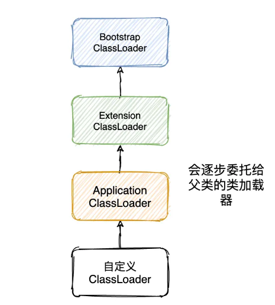
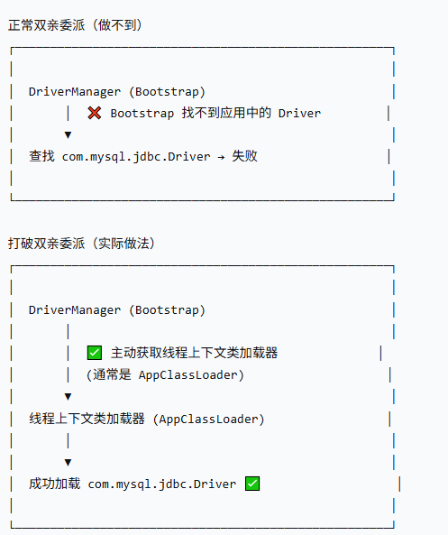

# 一、概念

## 1、类加载器的层次结构



JDK 8 的时候一共有三种类加载器：

1）启动类加载器（Bootstrap ClassLoader），它是属于虚拟机自身的一部分，主要负责加载<JAVA_HOME>\lib目录中被<Xbootclasspath>指定的路径中的并且文件名是被虚拟机识别的文件，它是所有类加载器的父亲。

2）扩展类加载器（Extension ClassLoader），它是 Java 实现的，独立于虚拟机，主要负责加载<JAVA_HOME>\lib\ext目录中被 java.ext.dirs 系统变量所指定的路径的类库。

3）应用程序类加载器（Application ClassLoader），它是 Java 实现的，独立于虚拟机。主要负责加载用户类路径（classPath）上的类库，如果我们没有实现自定义的类加载器那么这个加载器就是我们程序中的默认加载器。

## 2、什么是打破双亲委派

**正常双亲委派**：先让父类加载器加载，父类找不到才自己加载。

**打破双亲委派**：**绕过父类加载器，自己优先/直接加载类**。

## 3、代码实现

### 1）自定义类加载器

```java
package jvm.breakparent;


public class BreakParentClassLoader extends ClassLoader{

    private String classPath;

    public BreakParentClassLoader(String classPath) {
        this.classPath = classPath;
    }


    @Override
    protected Class<?> loadClass(String name, boolean resolve) throws ClassNotFoundException {
        synchronized (getClassLoadingLock(name)) {
            Class<?> c = findLoadedClass(name);
            if (c != null) {
                return c;
            }

            try {
                if (!name.startsWith("java.") && !name.startsWith("javax.")) {
                    System.out.println("[自定义类加载器]优先自己加载：" + name);
                    c = findClass(name);
                }
            } catch (Exception e) {
                // 自己找不到，交给父类
                System.out.println("[自定义加载器] 自己找不到: " + name + "，委托给父类");
            }


            if (c == null) {
                if (getParent() != null) {
                    System.out.println("[自定义加载器] 委托给父类加载：" + name);
                    c = getParent().loadClass(name);
                } else {
                    c = findBootstrapClass(name);
                }
            }

            if (c == null) {
                throw new ClassNotFoundException(name);
            }

            if (resolve) {
                resolveClass(c);
            }

            return c;
        }

    }

    @Override
    protected Class<?> findClass(String name) throws ClassNotFoundException {
        try {
            System.out.println("[自定义加载器] 查找文件: " + classPath);
            System.out.println("[自定义加载器] 文件是否存在: " + Files.exists(Paths.get(classPath)));

            byte[] data = Files.readAllBytes(Paths.get(classPath));
            return defineClass(name, data, 0, data.length);
        } catch (IOException e) {
            System.out.println("[自定义加载器] 读取文件失败: " + e.getMessage());
            throw new ClassNotFoundException(name, e);
        }
    }


    // 通过反射调用（不推荐，仅供学习）
    private Class<?> findBootstrapClass(String name) {
        try {
            Method method = ClassLoader.class.getDeclaredMethod(
                    "findBootstrapClassOrNull", String.class);
            method.setAccessible(true);
            return (Class<?>) method.invoke(this, name);
        } catch (Exception e) {
            return null;
        }
    }
}
```

### 2）被加载的测试类

```java
package jvm.breakparent;


// TestClass.java - 放在当前目录下编译
public class TestClass {
    static {
        System.out.println("TestClass 被加载，加载器: " + TestClass.class.getClassLoader());
    }
    
    public void hello() {
        System.out.println("Hello from TestClass, 加载器: " + getClass().getClassLoader());
    }
}
```

### 3）测试打破双亲委派

```java
package jvm.breakparent;


public class BreakDelegateTest {

    public static void main(String[] args) throws Exception{

        String classPath = "F:\\study\\juc\\src\\main\\java\\jvm\\breakparent\\TestClass.class";

        BreakParentClassLoader myLoader = new BreakParentClassLoader(classPath);


        System.out.println("=== 测试打破双亲委派 ===");
        System.out.println("我的加载器: " + myLoader);
        System.out.println("我的父加载器: " + myLoader.getParent());
        System.out.println();

        // 加载 TestClass
        Class<?> clazz = myLoader.loadClass("jvm.breakparent.TestClass");
        System.out.println("加载结果: " + clazz);
        System.out.println("类的加载器: " + clazz.getClassLoader());

        // 创建实例并调用
        Object obj = clazz.getDeclaredConstructor().newInstance();
        clazz.getMethod("hello").invoke(obj);

        // 对比：如果用系统类加载器加载，结果是同一个吗？
        System.out.println("\n=== 对比系统类加载器 ===");
        Class<?> systemClazz = ClassLoader.getSystemClassLoader().loadClass("jvm.breakparent.TestClass");
        System.out.println("系统类加载器加载结果: " + systemClazz);
        System.out.println("是否同一个Class对象: " + (clazz == systemClazz));

    }

}
```

结果：

```shell
=== 测试打破双亲委派 ===
我的加载器: jvm.breakparent.BreakParentClassLoader@14ae5a5
我的父加载器: sun.misc.Launcher$AppClassLoader@18b4aac2

[自定义类加载器]优先自己加载：jvm.breakparent.TestClass
[自定义加载器] 查找文件: F:\study\juc\src\main\java\jvm\breakparent\TestClass.class
[自定义加载器] 文件是否存在: false
[自定义加载器] 读取文件失败: F:\study\juc\src\main\java\jvm\breakparent\TestClass.class
[自定义加载器] 自己找不到: jvm.breakparent.TestClass，委托给父类
[自定义加载器] 委托给父类加载：jvm.breakparent.TestClass
加载结果: class jvm.breakparent.TestClass
类的加载器: sun.misc.Launcher$AppClassLoader@18b4aac2
TestClass 被加载，加载器: sun.misc.Launcher$AppClassLoader@18b4aac2
Hello from TestClass, 加载器: sun.misc.Launcher$AppClassLoader@18b4aac2

=== 对比系统类加载器 ===
系统类加载器加载结果: class jvm.breakparent.TestClass
是否同一个Class对象: true

Process finished with exit code 0

```

# 二、实际案例

## 1、JDBC

### 1）代码

```java
import java.sql.Connection;
import java.sql.DriverManager;
import java.sql.ResultSet;
import java.sql.Statement;

public class JdbcDemo {
    public static void main(String[] args) throws Exception {
        // 1. 注册驱动（JDBC 4.0+ 可省略，会自动加载）
        Class.forName("com.mysql.cj.jdbc.Driver");
        
        // 2. 获取连接
        String url = "jdbc:mysql://localhost:3306/test?useSSL=false&serverTimezone=UTC";
        String user = "root";
        String password = "123456";
        Connection conn = DriverManager.getConnection(url, user, password);
        
        // 3. 执行查询
        Statement stmt = conn.createStatement();
        ResultSet rs = stmt.executeQuery("SELECT * FROM user");
        
        // 4. 处理结果
        while (rs.next()) {
            System.out.println(rs.getString("name"));
        }
        
        // 5. 关闭资源
        rs.close();
        stmt.close();
        conn.close();
    }
}
```

maven依赖

```xml
<dependency>
    <groupId>com.mysql</groupId>
    <artifactId>mysql-connector-j</artifactId>
    <version>8.0.33</version>
</dependency>
```

> `Class.forName`必须放到`DriverManager`前面，后续会解释

### 2）核心矛盾

```java
// 1. 先手动 Class.forName 加载驱动类
Class.forName("com.mysql.jdbc.Driver");

// 2. 获取连接
Connection conn = DriverManager.getConnection(url, user, password);
```

这里涉及两个关键类：

- **`java.sql.DriverManager`**：属于 Java 核心库（`rt.jar`），由**根类加载器 (Bootstrap ClassLoader)** 加载。
- **`com.mysql.jdbc.Driver`**：属于应用程序的 JAR 包，由**系统类加载器 (AppClassLoader)** 加载。

当 `DriverManager.getConnection()` 被调用时，它内部需要**找到所有注册的 `Driver` 实现**。

如果严格按照“双亲委派模型”：

1. `DriverManager` 调用 `DriverManager.getConnection()`
2. 它想找 `com.mysql.jdbc.Driver` 类
3. 因为它自己是由 Bootstrap 加载的，它的类加载器是 Bootstrap
4. Bootstrap 会**向上委托**（其实它已经是顶层了），然后**自己去寻找** `com.mysql.jdbc.Driver`
5. **Bootstrap 只认识 `rt.jar` 等核心库**，找不到应用的 `mysql-connector-java.jar` ❌

**结果：** 明明 `Class.forName("com.mysql.jdbc.Driver")` 已经执行了，但 `DriverManager` 就是找不到这个驱动类，因为它用的加载器不对。

### 3）解决方案

JDK 的设计者引入了**线程上下文类加载器 (Thread Context Class Loader)**。

**核心思想：** 让“父亲”（Bootstrap 加载的类）去使用“儿子”（AppClassLoader）的类加载器来加载类。这完全违背了“父子”的正常委托方向。

**流程图：**



### 4）源码分析

下面是一个**高度简化**的 DriverManager 源码逻辑，方便理解：

```java
// 这是 java.sql.DriverManager 类中的核心逻辑（简化版）
public class DriverManager {
    
    // 注册驱动的方法
    public static synchronized void registerDriver(Driver driver) {
        // 当 Class.forName("com.mysql.jdbc.Driver") 执行时
        // 驱动会在其静态代码块中调用这个方法
        registeredDrivers.add(driver);
    }
    
    // 获取连接的方法
    public static Connection getConnection(String url, ...) {
        // 【关键】这里打破了双亲委派！
        // 1. 获取当前线程的上下文类加载器
        ClassLoader callerClassLoader = Thread.currentThread().getContextClassLoader();
        
        // 2. 遍历所有已注册的驱动
        for (Driver driver : registeredDrivers) {
            // 3. 【核心】用线程上下文类加载器去加载驱动类
            //    这不再是 Bootstrap 去找，而是让 AppClassLoader 去找
            Class<?> driverClass = Class.forName(driver.getClass().getName(), true, callerClassLoader);
            
            // 4. 检查是否能接受这个 URL
            if (driver.acceptsURL(url)) {
                return driver.connect(url, ...);
            }
        }
        return null;
    }
}
```

### 5）完整执行流程

1. **`main` 方法启动**（由系统类加载器加载）
2. **调用 `Class.forName("com.mysql.jdbc.Driver")`**
   - MySQL Driver 的静态代码块执行
   - 调用 `DriverManager.registerDriver(new Driver())`
   - 此时，一个 `Driver` 对象被放到了 `DriverManager` 的列表中
3. **调用 `DriverManager.getConnection(url)`**
   - `DriverManager` 类内部获取 `Thread.currentThread().getContextClassLoader()`，这个值默认是系统类加载器（AppClassLoader）
   - 使用这个类加载器，而不是自己（Bootstrap）的加载器，去验证和使用驱动类
   - 成功找到 MySQL 驱动并建立连接

### 6）总结

**JDBC 打破双亲委派的本质**：为了让“上层核心库”（Bootstrap 加载）能够使用“下层应用类”（AppClassLoader 加载），`DriverManager` 不直接依赖双亲委派，而是主动通过**线程上下文类加载器**“反向”获取了应用类加载器，从而成功加载 JDBC 驱动。

## 2、Tomcat 

> Tomcat 有三个核心诉求 JDK 默认的满足不了。一是多应用隔离，跑在同一个 Tomcat 里的 10 个 Web 应用可能用了不同版本的 Spring，必须互不干扰；二是热部署，应用更新后不用重启整个 Tomcat，直接干掉旧的 WebAppClassLoader，创建新的重新加载；三是共享公共库，比如 Tomcat 自己的 servlet-api.jar 只需要加载一份，所有应用共用。所以 Tomcat 设计了 Common、Catalina、Shared、WebApp 这一套层次结构的类加载器来满足这些需求。

`WebappClassLoader` 是 Tomcat 等 Web 容器实现**应用隔离**和**热部署**的核心组件。它最著名的特征就是**打破了双亲委派模型**。

下面通过对比和源码逻辑，详细讲解它的工作过程。

### 1）为什么要打破双亲委派？

假设一个 Tomcat 部署了两个 Web 应用：

```shell
Tomcat
├── webapp-A
│   └── lib/commons-lang3-2.5.jar
└── webapp-B
    └── lib/commons-lang3-3.0.jar  (版本不同)
```

**如果使用标准双亲委派：**

1. `AppClassLoader` 加载 `commons-lang3-2.5.jar` 中的 `StringUtils` 类
2. 这个类被缓存到 `AppClassLoader`
3. Webapp-B 通过委派也会拿到 2.5 版本的 `StringUtils`
4. **问题**：Webapp-B 实际需要 3.0 版本，导致 `NoSuchMethodError` ❌

**解决方案**：每个 Web 应用用自己的类加载器**优先加载自己的类**。

### 2）Tomcat 类加载器层次结构

```shell
                    Bootstrap
                       ↑
                    Extension
                       ↑
              System (AppClassLoader)
                       ↑
              ┌────────┴────────┐
              ↓                 ↓
        CommonLoader      (CatalinaLoader)  [Tomcat内部]
              ↑
        WebappClassLoader (app A)
              ↑
        WebappClassLoader (app B)
```

### 3）WebappClassLoader 的加载顺序

```java
// Tomcat WebappClassLoaderBase.loadClass() 简化逻辑
public Class<?> loadClass(String name, boolean resolve) {
    
    // 1. 检查是否已加载
    clazz = findLoadedClass(name);
    
    // 2. 【防破坏】java.* 和 javax.* 必须交给父类（不能自己加载）
    if (name.startsWith("javax.") || name.startsWith("java.")) {
        try {
            clazz = getParent().loadClass(name);
            return clazz;
        } catch (ClassNotFoundException e) { }
    }
    
    // 3. 【优先】在当前 Web 应用的 lib 中查找（打破双亲委派的关键）
    try {
        clazz = findClass(name);  // 从 WEB-INF/classes 和 WEB-INF/lib 加载
        return clazz;
    } catch (ClassNotFoundException e) { }
    
    // 4. 【委托】当前应用找不到，委托给父加载器
    try {
        clazz = getParent().loadClass(name);
        return clazz;
    } catch (ClassNotFoundException e) { }
    
    throw new ClassNotFoundException(name);
}
```

### 4）对比

|      | 标准双亲委派   | Tomcat WebappClassLoader                         |
| :--- | :------------- | :----------------------------------------------- |
| 1    | 委托给父类     | **java/javax 类委托给父类**                      |
| 2    | 父类再向上委托 | **优先自己加载应用类（WEB-INF/classes 和 lib）** |
| 3    | 最终自己加载   | 自己加载不到再委托给父类                         |
| 4    | -              | 最终抛出异常                                     |

**核心区别：** Tomcat 把“自己优先加载”放在了“委托父类”**之前**。

### 5）工作流程图

```shell
loadClass("com.example.UserService")
    │
    ├── 1. 检查已加载？ → 有则返回
    │
    ├── 2. 是 java/javax 开头的核心类？ 
    │       ↓ 是
    │       └──→ getParent().loadClass() → Bootstrap/Extension
    │
    ├── 3. 【关键】尝试从当前 Web 应用加载
    │       │
    │       ├── 查找 WEB-INF/classes/com/example/UserService.class
    │       ├── 查找 WEB-INF/lib/*.jar 中的类
    │       │
    │       └── 找到 → defineClass() → 返回 ✅
    │
    ├── 4. 当前应用找不到，委托给父加载器 (CommonLoader)
    │       │
    │       └── CommonLoader → 可能继续向上到 AppClassLoader
    │
    └── 5. 都找不到 → ClassNotFoundException ❌
```

### 6）热部署原理

```shell
// 重新部署时
context.stop();    // 停止 Web 应用
// 废弃旧的 WebappClassLoader，等待 GC
oldLoader = null;

context.start();   // 启动新 Web 应用
// 创建新的 WebappClassLoader
newLoader = new WebappClassLoader();
newLoader.loadClass(...);  // 重新加载所有类
```

**关键：** 旧类加载器不再被引用 → 被 GC 回收 → 它加载的所有类也被卸载。

> **类加载器能不能卸载已经加载的类？**
>
> 能，但条件很苛刻。一个类要被卸载，必须同时满足三个条件：这个类的所有实例都被回收了，加载这个类的 ClassLoader 实例被回收了，这个类的 Class 对象没有被引用。启动类加载器、扩展类加载器这些系统级的加载器基本不可能被回收，所以它们加载的类也不会被卸载。自定义类加载器加载的类在满足条件后可以被 GC 回收掉。

### 7）常见问题

#### Q1：为什么要打破双亲委派？

**A**：为了**隔离**。不同 Web 应用可能依赖同一个第三方库的不同版本，标准双亲委派会导致版本冲突。Tomcat 让每个 Web 应用用自己的类加载器优先加载，实现了类隔离。

#### Q2：核心类为什么还要委托给父类？

**A**：安全考虑。`java.lang.String` 这类核心类必须由 Bootstrap 加载器加载，防止 Web 应用恶意篡改核心类。

#### Q3：热部署的原理是什么？

**A**：销毁旧的 WebappClassLoader，创建新的。旧的加载器不再被引用后会被 GC 回收，它加载的所有类也会被卸载。下次请求时新加载器重新加载所有类，实现热替换。

#### Q4：Tomcat 如何保证多个 Web 应用间类隔离？

**A**：每个 Web 应用有独立的 WebappClassLoader 实例，加载自己 `WEB-INF/lib` 和 `WEB-INF/classes` 下的类。不同加载器加载的同名类在 JVM 中被视为不同的类型。