# 一、基础知识

## 1、集合和数组的区别

- 数组是固定长度的；集合可变长度的。

- 数组可以存储基本数据类型，也可以存储引用数据类型；集合只能存储引用数据类型。

- 数组存储的元素必须是同一个数据类型；集合存储的对象可以是不同数据类型。


## 2、集合框架的优点

- 容量自增长；

- 提供了高性能的数据结构和算法，使编码更轻松，提高了程序速度和质量；

- 可以方便地扩展或改写集合，提高代码复用性和可操作性。

- 通过使用JDK自带的集合类，可以降低代码维护和学习新API成本。


## 3、无序性的含义

无序性不等于随机性，无序性是指存储的数据在底层数组中并非按照数组索引的顺序添加，而是根据数据的哈希值决定的。

## 4、不可重复性的含义

不可重复性是指添加的元素按照equals()判断时，返回false，需要同时重写equals()方法和HashCode()方法。

## 5、集合框架底层的数据结构

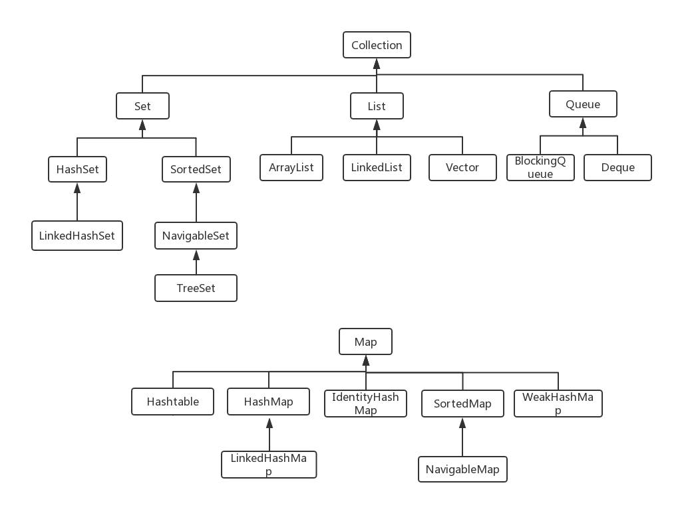

### 1）Collection

#### 1.List

- Arraylist：Object[]数组

- Vector：Object[]数组

- LinkedList：双向链表(JDK1.6之前为循环链表，JDK1.7取消了循环)


#### 2.Set

- HashSet（无序唯一）：基于HashMap实现的，底层采用HashMap来保存元素

- LinkedHashSet：LinkedHashSet是HashSet的子类，并且其内部是通过LinkedHashMap来实现的。有点类似于我们之前说的LinkedHashMap其内部是基于HashMap实现一样，不过还是有一点点区别的

- TreeSet（有序唯一）：红黑树(自平衡的排序二叉树)


#### 3.Queue

- PriorityQueue：Object[]数组来实现二叉堆

- ArrayQueue：Object[]数组+双指针


### 2）Map

-  HashMap：JDK1.8之前HashMap由数组+链表组成的，数组是HashMap的主体，链表则是主要为了解决哈希冲突而存在的（“拉链法”解决冲突）。JDK1.8以后在解决哈希冲突时有了较大的变化，当链表长度大于阈值（默认为8）（将链表转换成红黑树前会判断，如果当前数组的长度小于64，那么会选择先进行数组扩容，而不是转换为红黑树）时，将链表转化为红黑树，以减少搜索时间；

-  LinkedHashMap：LinkedHashMap其实是对HashMap进行了拓展，使用了双向链表来保证了顺序性。

-  Hashtable：数组+链表组成的，数组是Hashtable的主体，链表则是主要为了解决哈希冲突而存在的

-  TreeMap：红黑树（自平衡的排序二叉树）


## 6、为什么HashMap中String、Integer这样的包装类适合作为Key

String、Integer等包装类的特性能够保证Hash值的不可更改性和计算准确性，能够有效的减少Hash碰撞的几率

都是final类型，即不可变性，保证key的不可更改性，不会存在获取hash值不同的情况

内部已重写了equals()、hashCode()等方法，遵守了HashMap内部的规范，不容易出现Hash值计算错误的情况

## 7、Object作为HashMap的Key，应该注意什么

重写hashCode()和equals()方法

重写hashCode()是因为需要计算存储数据的存储位置，需要注意不要试图从散列码计算中排除掉一个对象的关键部分来提高性能，这样虽然能更快但可能会导致更多的Hash碰撞

重写equals()方法，需要遵守自反性、对称性、传递性、一致性以及对于任何非null的引用值x，x.equals(null)必须返回false的这几个特性，目的是为了保证key在哈希表中的唯一性

> **详解：**
>
> 当你使用Object类作为map的key时，如果你不从写hashcode方法，那么他会继承父类，对整个类进行hashcode计算，如果碰到两个对象中的属性都是一样的，实际生活场景我们希望比较的是它的内容是否相同，而不是它存储的地址是否相同，并且两个不同对象的地址也不可能相同，而要比较他们是否相同，得先让他们放到同一个map中的bucket位置。重写hashcode方法后，如果我们不重写它的equals方法，那么当发生两个相同对象（指的是属性相同，但是两个不同对象）hash碰撞时（此时两个对象的hashcode相同），当使用equals方法判断时，还是会去比较两个key的地址是否相同，如果不重写equals方法，map将以链表（或二叉树）的形式将这两个对象存储在一个bucker的位置。
>

---

# 二、区别

## 1、comparable和comparator的区别

comparable接口出自java.lang包，它有一个compareTo(Objectobj)方法用来排序；

```java
class Person implements Comparable<Person>{
    private String name;
    private int age;

    @Override
    public int compareTo(Person person) {
        return person.age == this.age ? this.age - person.age : this.name.compareTo(person.name);
    }
}
```

comparator接口出自java.util包，它有一个compare(Objectobj1,Objectobj2)方法用来排序；

```java
List<String> list = new ArrayList<>();
Collections.sort(list, new Comparator<String>() {
    @Override
    public int compare(String o1, String o2) {
        return 0;
    }
});
```

一般我们需要对一个集合使用自定义排序时，我们就要重写compareTo()方法或compare()方法。

## 2、Collection和Collections有什么区别？

java.util.Collection是一个集合接口（集合类的一个顶级接口）。它提供了对集合对象进行基本操作的通用接口方法。Collection接口在Java类库中有很多具体的实现。Collection接口的意义是为各种具体的集合提供了最大化的统一操作方式，其直接继承接口有List与Set。

Collections则是集合类的一个工具类，其中提供了一系列静态方法，用于对集合中元素进行排序、搜索以及线程安全等各种操作。

## 3、Iterator和ListIterator有什么区别？

Iterator可以遍历Set和List集合，而ListIterator只能遍历List。

Iterator只能单向遍历，而ListIterator可以双向遍历（向前/后遍历）。

ListIterator实现Iterator接口，然后添加了一些额外的功能，比如添加一个元素、替换一个元素、获取前面或后面元素的索引位置。

## 4、List

### 1）ArrayList和Vector的区别

- 线程安全：Vector使用了Synchronized来实现线程同步，是线程安全的，而ArrayList是非线程安全的。

- 性能：ArrayList在性能方面要优于Vector。

- 扩容机制：ArrayList和Vector都会根据实际的需要动态的调整容量，只不过在Vector扩容每次会增加1倍，而ArrayList只会增加50%。


### 2） ArrayList和LinkedList的区别

- 数据结构实现：ArrayList是动态数组的数据结构实现，而LinkedList是双向链表的数据结构实现。

- 随机访问效率：ArrayList比LinkedList在随机访问的时候效率要高，因为LinkedList是线性的数据存储方式，所以需要移动指针从前往后依次查找。

- 增加和删除效率：在非首尾的增加和删除操作，LinkedList要比ArrayList效率要高，因为ArrayList增删操作要影响数组内的其他数据的下标。

- 内存空间占用：LinkedList比ArrayList更占内存，因为LinkedList的节点除了存储数据，还存储了两个引用，一个指向前一个元素，一个指向后一个元素。

- 线程安全：ArrayList和LinkedList都是不同步的，也就是不保证线程安全。


## 5、Set

### HashSet、LinkedHashSet和TreeSet三者的异同

- HashSet是Set接口的主要实现类，HashSet的底层是HashMap，线程不安全的，可以存储null值；

- LinkedHashSet是HashSet的子类，能够按照添加的顺序遍历；

- TreeSet底层使用红黑树，能够按照添加元素的顺序进行遍历，排序的方式有自然排序和定制排序。


## 6、Queue

### 1）Queue与Deque的区别

Queue是单端队列，只能从一端插入元素，另一端删除元素，实现上一般遵循先进先出（FIFO）规则。

Queue扩展了Collection的接口，根据因为容量问题而导致操作失败后处理方式的不同可以分为两类方法:一种在操作失败后会抛出异常（add、remove、element），另一种则会返回特殊值（offer、poll、peek）。

Deque是双端队列，在队列的两端均可以插入或删除元素。

Deque扩展了Queue的接口,增加了在队首和队尾进行插入和删除的方法，同样根据失败后处理方式的不同分为两类：

| 操作           | 抛出异常      | 返回特殊值      |
| -------------- | ------------- | --------------- |
| 向队首添加元素 | addFirst(E e) | offerFirst(E e) |
| 向队尾添加元素 | addLast(E e)  | offerLast(E e)  |
| 移除队首元素   | removeFirst() | pollFirst()     |
| 移除队尾元素   | removeLast()  | pollLast()      |
| 查看队首元素   | getFirst()    | peekFirst()     |
| 查看队尾元素   | getLast()     | peekLast()      |

### 2）ArrayDeque与LinkedList的区别

- ArrayDeque和LinkedList都实现了Deque接口，两者都具有队列的功能

- ArrayDeque是基于可变长的数组和双指针来实现，而LinkedList则通过链表来实现。

- ArrayDeque不支持存储NULL数据，但LinkedList支持。

- ArrayDeque是在JDK1.6才被引入的，而LinkedList早在JDK1.2时就已经存在。

- ArrayDeque插入时可能存在扩容过程,不过均摊后的插入操作依然为O(1)。虽然LinkedList不需要扩容，但是每次插入数据时均需要申请新的堆空间，均摊性能相比更慢。

- 从性能的角度上，选用ArrayDeque来实现队列要比LinkedList更好。


#### 3）PriorityQueue

- PriorityQueue是在JDK1.5中被引入的，其与Queue的区别在于元素出队顺序是与优先级相关的，即总是优先级最高的元素先出队。

- PriorityQueue利用了二叉堆的数据结构来实现的，底层使用可变长的数组来存储数据

- PriorityQueue通过堆元素的上浮和下沉，实现了在O(logn)的时间复杂度内插入元素和删除堆顶元素

- PriorityQueue是非线程安全的，且不支持存储NULL和non-comparable的对象。

- PriorityQueue默认是小顶堆，但可以接收一个Comparator作为构造参数，从而来自定义元素优先级的先后。


## 7、Map

### 1）HashMap和Hashtable的区别

1. 线程安全：HashMap是非线程安全的，HashTable是线程安全的,因为HashTable内部的方法基本都经过synchronized修饰。（如果你要保证线程安全的话就使用ConcurrentHashMap吧！）

2. 效率：因为线程安全的问题，HashMap要比HashTable效率高一点。另外，HashTable基本被淘汰，不要在代码中使用它；

3. 对Nullkey和Nullvalue的支持：HashMap可以存储null的key和value，但null作为键只能有一个，null作为值可以有多个；HashTable不允许有null键和null值，否则会抛出NullPointerException

4. 初始容量大小和每次扩充容量大小的不同：创建时如果不指定容量初始值，Hashtable默认的初始大小为11，之后每次扩充，容量变为原来的2n+1。HashMap默认的初始化大小为16。之后每次扩充，容量变为原来的2倍。

5. 创建时如果给定了容量初始值，那么Hashtable会直接使用你给定的大小，而HashMap会将其扩充为2的幂次方大小（HashMap中的tableSizeFor()方法保证

6. 底层数据结构：JDK1.8以后的HashMap在解决哈希冲突时有了较大的变化，当链表长度大于阈值（默认为8）（将链表转换成红黑树前会判断，如果当前数组的长度小于64，那么会选择先进行数组扩容，而不是转换为红黑树）时，将链表转化为红黑树，以减少搜索时间。Hashtable没有这样的机制。


### 2）HashMap和HashSet的区别

- HashSet底层就是基于HashMap实现的

- HashMap实现了Map接口，HashSet实现Set接口

- HashMap用来存储键值对，HashSet仅存储对象

- HashMap调用put()向map中添加元素，HashSet调用add()方法向Set中添加元素

- HashMap使用键（Key）计算hashcode，HashSet使用成员对象来计算hashcode值，对于两个对象来说hashcode可能相同，所以equals()方法用来判断对象的相等性


### 3）HashMap和TreeMap的区别

- TreeMap和HashMap都继承自AbstractMap，但是需要注意的是TreeMap它还实现了NavigableMap接口和SortedMap接口。

- 实现NavigableMap接口让TreeMap有了对集合内元素的搜索的能力。

- 实现SortMap接口让TreeMap有了对集合中的元素根据键排序的能力。默认是按key的升序排序，不过我们也可以指定排序的比较器。

- 综上，相比于HashMap来说TreeMap主要多了对集合中的元素根据键排序的能力以及对集合内元素的搜索的能力。


### 4）ConcurrentHashMap和Hashtable的区别

ConcurrentHashMap和Hashtable的区别主要体现在实现线程安全的方式上不同。

1. **底层数据结构**

JDK1.7的ConcurrentHashMap底层采用分段的数组+链表实现；

JDK1.8采用的数据结构跟HashMap1.8的结构一样，数组+链表/红黑二叉树。

Hashtable和JDK1.8之前的HashMap的底层数据结构类似都是采用数组+链表的形式，数组是HashMap的主体，链表则是主要为了解决哈希冲突而存在的。

2. **实现线程安全的方式**

在JDK1.7的时候，ConcurrentHashMap（分段锁）对整个桶数组进行了分割分段(Segment)，每一把锁只锁容器其中一部分数据，多线程访问容器里不同数据段的数据，就不会存在锁竞争，提高并发访问率。到了JDK1.8的时候已经摒弃了Segment的概念，而是直接用Node数组+链表+红黑树的数据结构来实现，并发控制使用synchronized和CAS来操作。（JDK1.6以后对synchronized锁做了很多优化）整个看起来就像是优化过且线程安全的HashMap，虽然在JDK1.8中还能看到Segment的数据结构，但是已经简化了属性，只是为了兼容旧版本；

Hashtable(同一把锁):使用synchronized来保证线程安全，效率非常低下。当一个线程访问同步方法时，其他线程也访问同步方法，可能会进入阻塞或轮询状态，如使用put添加元素，另一个线程不能使用put添加元素，也不能使用get，竞争会越来越激烈效率越低。

---

# 三、源码分析

## 1、ArrayList

### 1）优缺点

优点：

- ArrayList底层以数组实现，是一种随机访问模式。ArrayList实现了RandomAccess接口，因此查找的时候非常快。

- ArrayList在顺序添加一个元素的时候非常方便。


缺点：

- 删除元素的时候，需要做一次元素复制操作。如果要复制的元素很多，那么就会比较耗费性能。

- 插入元素的时候，也需要做一次元素复制操作，缺点同上。


 适用场景

- 顺序添加、随机访问的场景。


### 2）为什么ArrayList的elementData加上transient修饰？

1.8ArrayList 中的数组定义如下：

```java
transient Object[] elementData; // non-private to simplify nested class access
```

再看一下 ArrayList 的定义：

```java
public class ArrayList<E> extends AbstractList<E>
        implements List<E>, RandomAccess, Cloneable, java.io.Serializable
```

可以看到 ArrayList 实现了 Serializable 接口，这意味着 ArrayList 支持序列化。transient 的作用是说不希望 elementData 数组被序列化，重写了 writeObject 实现：

```java
private void writeObject(java.io.ObjectOutputStream s)
    throws java.io.IOException{
    // Write out element count, and any hidden stuff
    int expectedModCount = modCount;
    s.defaultWriteObject();

    // Write out size as capacity for behavioural compatibility with clone()
    s.writeInt(size);

    // Write out all elements in the proper order.
    for (int i=0; i<size; i++) {
        s.writeObject(elementData[i]);
    }

    if (modCount != expectedModCount) {
        throw new ConcurrentModificationException();
    }
}
```

每次序列化时，先调用 defaultWriteObject() 方法序列化 ArrayList 中的非 transient 元素，然后遍历 elementData，只序列化已存入的元素，这样既加快了序列化的速度，又减小了序列化之后的文件大小。

### 3）说说ArrayList的初始大小？

ArrayList可以通过构造方法在初始化的时候指定底层数组的大小。

通过无参构造方法的方式ArrayList()初始化，则赋值底层数Object[] elementData为一个默认空数组Object[] DEFAULTCAPACITY_EMPTY_ELEMENTDATA = {}所以数组容量为0，只有真正对数据进行添加add时，才分配默认DEFAULT_CAPACITY = 10的初始容量。

```java
/**
 * Default initial capacity.
 */
private static final int DEFAULT_CAPACITY = 10;
```

### 3）数组的长度是有限制的，而ArrayList是可以存放任意数量对象，长度不受限制，那么它是怎么实现的呢？

其实实现方式比较简单，他就是通过数组扩容的方式去实现的。

就比如我们现在有一个长度为10的数组，现在我们要新增一个元素，发现已经满了，那ArrayList会怎么做呢？

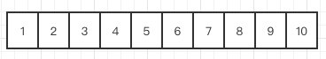

第一步他会重新定义一个长度为10+10/2的数组也就是新增一个长度为15的数组。

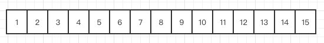

然后把原数组的数据，原封不动的复制到新数组中，这个时候再把指向原数的地址换到新数组，ArrayList就这样完成了一次改头换面。

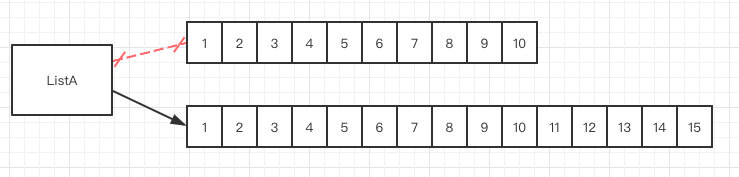

### 4）1.7和1.8版本初始化的时候的区别

ArrayList从1.7开始变化有点大，一个是初始化的时候，1.7以前会调用this(10)才是真正的容量为10，1.7及本身以后是默认走了空数组，采用延迟加载的方式，只有第一次add的时候容量会变成10。

### 5）为什么ArrayList增删慢？

它有两种新增元素的方式：（指定位置新增，也有直接新增的），在这之前他会有一步校验长度的判断**ensureCapacityInternal**，就是说如果长度不够，是需要扩容的。

```java
public boolean add(E e) {
    ensureCapacityInternal(size + 1);  // 检查是否需要扩容，Increments modCount!!
    elementData[size++] = e;
    return true;
}
```

在扩容的时候，老版本的jdk和8以后的版本是有区别的，8之后的效率更高了，采用了位运算，**右移**一位，其实就是除以2这个操作。

```java
private void grow(int minCapacity) {
    // overflow-conscious code
    int oldCapacity = elementData.length;
    int newCapacity = oldCapacity + (oldCapacity >> 1);
    if (newCapacity - minCapacity < 0)
        newCapacity = minCapacity;
    if (newCapacity - MAX_ARRAY_SIZE > 0)
        newCapacity = hugeCapacity(minCapacity);
    // minCapacity is usually close to size, so this is a win:
    elementData = Arrays.copyOf(elementData, newCapacity);
}
```

**指定位置**新增的时候，在校验之后的操作很简单，就是数组的copy，大家可以看下代码。

```java
public void add(int index, E element) {
    rangeCheckForAdd(index);			//检验index是否合法

    ensureCapacityInternal(size + 1);  // 检查是否需要扩容，Increments modCount!!
    System.arraycopy(elementData, index, elementData, index + 1,
                     size - index);
    elementData[index] = element;
    size++;
}
```

**指定位置新增过程：**

比如有下面这样一个数组我需要在index 5的位置去新增一个元素A

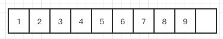

那从代码里面我们可以看到，他复制了一个数组，是从index 5的位置开始的，然后把它放在了index 5+1的位置

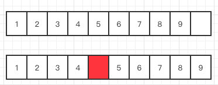

给我们要新增的元素腾出了位置，然后在index的位置放入元素A就完成了新增的操作了

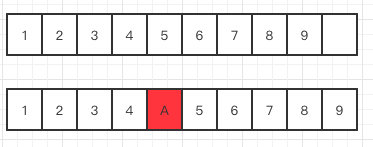

由于ArrayList每次新增都涉及到数组的复制，因此效率比较低。

### 6）ArrayList的删除是如何实现的

删除的原理和新增是一样的，本质上还是数组的copy。

```java
public E remove(int index) {
    rangeCheck(index);

    modCount++;
    E oldValue = elementData(index);

    int numMoved = size - index - 1;		//从index到数组尾的长度
    if (numMoved > 0)
        System.arraycopy(elementData, index+1, elementData, index,
                         numMoved);			//数组复制
    elementData[--size] = null; // clear to let GC do its work

    return oldValue;
}
```

**删除过程**

我们现在要删除下面这个数组中的index5这个位置

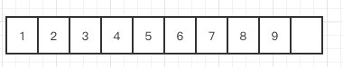

那代码他就复制一个index5+1开始到最后的数组，然后把它放到index开始的位置

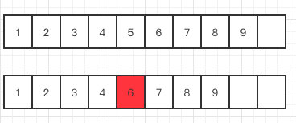

ndex5的位置就成功被”删除“了其实就是被覆盖了，给了你被删除的感觉。

同理他的效率也低，因为数组如果很大的话，一样需要复制和移动的位置就大了。


## 2、HashMap

### 1）数据结构

1.8：数组+链表/红黑树

1.7：数组+链表

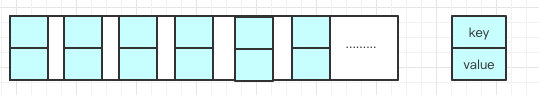

由**数组和链表组合构成**的数据结构。

数组里面每个地方都存了Key-Value这样的实例，在Java7叫Entry在Java8中叫Node。

### 2）HashMap的插入原理

   i.  判断数组是否为空，为空进行初始化;

  ii.  不为空，计算k的hash值，通过(n-1)&hash计算应当存放在数组中的下标index;

  iii.  查看table[index]是否存在数据，没有数据就构造一个Node节点存放在table[index]中；

  iv.  存在数据，说明发生了hash冲突(存在二个节点key的hash值一样),继续判断key是否相等，相等，用新的value替换原数据(onlyIfAbsent为false)；

  v.  如果不相等，判断当前节点类型是不是树型节点，如果是树型节点，创造树型节点插入红黑树中；(如果当前节点是树型节点证明当前已经是红黑树了)

  vi.  如果不是树型节点，创建普通Node加入链表中；判断链表长度是否大于8并且数组长度大于64，大于的话链表转换为红黑树；

 vii.  插入完成之后判断当前节点数是否大于阈值，如果大于开始扩容为原数组的二倍。

### 3）说说Hashmap的初始值

一般如果newHashMap()不传值，默认大小是16，负载因子是0.75，如果自己传入初始大小k，初始化大小为大于k的2的整数次方，例如如果传10，大小为16。

### 4）HashMap的工作原理

HashMap基于hashing原理，我们通过put()和get()方法储存和获取对象。当我们将键值对传递给put()方法时，它调用键对象的hashCode()方法来计算hashcode，然后找到bucket位置来储存值对象。当获取对象时，通过键对象的equals()方法找到正确的键值对，然后返回值对象。HashMap使用链表来解决碰撞问题，当发生碰撞了，对象将会储存在链表的下一个节点中。HashMap在每个链表节点中储存键值对对象。

当两个不同的键对象的hashcode相同时会发生什么？它们会储存在同一个bucket位置的链表中。键对象的equals()方法用来找到键值对。

### 5）HashMap是如何扩容的

数组容量是有限的，数据多次插入的，到达一定的数量就会进行扩容，也就是resize。

有两个决定因素：

- Capacity：HashMap当前长度。
- LoadFactor：负载因子，默认值0.75f。

扩容分为两步：

1. 扩容：创建一个新的Entry空数组，长度是原数组的2倍。

2. ReHash：遍历原Entry数组，把所有的Entry重新Hash到新数组。

> **为什么不直接复制到新数组，而要重新Hash？**
>
> 因为长度扩大以后，Hash的规则也随之改变。
>
> Hash的公式---> index = HashCode（Key） & （Length - 1）

### 6）为什么1.7使用的是尾插法，而1.8改用头插法？

在多线程条件下可能会发生”条件竞争“。

比方说：

我们现在往一个容量大小为2的put两个值，负载因子是0.75是不是我们在put第二个的时候就会进行resize？

2*0.75 = 1 所以插入第二个就要resize了

现在我们要在容量为2的容器里面**用不同线程**插入A，B，C。

还未resize前：

看到链表的指向A->B->C

**Tip：A的下一个指针是指向B的**

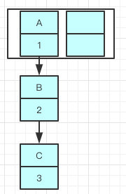

因为resize的赋值方式，也就是使用了**单链表的头插入方式，同一位置上新元素总会被放在链表的头部位置**，在旧数组中同一条Entry链上的元素，通过重新计算索引位置后，有可能被放到了新数组的不同位置上。

就可能出现下面的情况，大家发现问题没有？

B的下一个指针指向了A

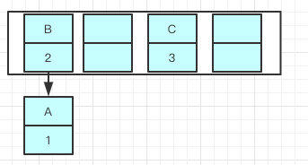

一旦几个线程都调整完成，就可能出现环形链表

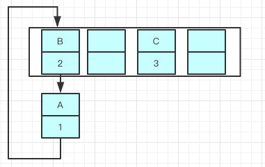

如果这个时候去取值，悲剧就出现了——Infinite Loop。

因为java8之后链表有红黑树的部分，大家可以看到代码已经多了很多if else的逻辑判断了，红黑树的引入巧妙的将原本O(n)的时间复杂度降低到了O(logn)。

使用头插会改变链表的上的顺序，但是如果使用尾插，在扩容时会保持链表元素原本的顺序，就不会出现链表成环的问题了。

就是说原本是A->B，在扩容后那个链表还是A->B

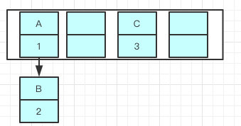

Java7在多线程操作HashMap时可能引起死循环，原因是扩容转移后前后链表顺序倒置，在转移过程中修改了原来链表中节点的引用关系。

Java8在同样的前提下并不会引起死循环，原因是扩容转移后前后链表顺序不变，保持之前节点的引用关系。

> **那是不是意味着Java8就可以把HashMap用在多线程中呢？**
>
> 我认为即使不会出现死循环，但是通过源码看到put/get方法都没有加同步锁，多线程情况最容易出现的就是：无法保证上一秒put的值，下一秒get的时候还是原值，所以线程安全还是无法保证。


### 7）Hashmap初始长度为什么是2的幂？

为了位运算的方便，**位与运算比算数计算的效率高了很多**，之所以选择**2的幂**，是为了服务将Key映射到index的算法。index的计算公式：index = HashCode（Key） & （Length- 1），15的的二进制是1111，Length-1的值是所有二进制位全为1，这种情况下，index的结果等同于HashCode(key)后几位的值。

### 8）一般在多线程的场景，如何使用map集合

- 使用Collections.synchronizedMap(Map)创建线程安全的map集合；
- Hashtable
- ConcurrentHashMap

不过出于线程并发度的原因，我们都会舍弃前两者使用最后的ConcurrentHashMap，他的性能和效率明显高于前两者。

### 9）你知道HashMap的哈希函数怎么设计的吗？为什么怎么设计？

hash函数是先拿到key的hashcode，是一个32位的int值，然后让hashcode的高16位和低16位进行异或操作。

```java
static final int hash(Object key) {
    int h;
    return (key == null) ? 0 : (h = key.hashCode()) ^ (h >>> 16);
}
```

这个也叫扰动函数，这么设计有二点原因

- 一定要尽可能降低hash碰撞，越分散越好；

- 算法一定要尽可能高效，因为这是高频操作,因此采用位运算；


### 10）为什么采用hashcode的高16位和低16位异或能降低hash碰撞？hash函数能不能直接用key的hashcode？

因为key.hashCode()函数调用的是key键值类型自带的哈希函数，返回int型散列值。int值范围为-2147483648~2147483647，前后加起来大概40亿的映射空间。只要哈希函数映射得比较均匀松散，一般应用是很难出现碰撞的。但问题是一个40亿长度的数组，内存是放不下的。你想，如果HashMap数组的初始大小才16，用之前需要对数组的长度取模运算，得到的余数才能用来访问数组下标。

源码中模运算就是把散列值和数组长度-1做一个"与"操作，位运算比取余%运算要快。

```java
bucketIndex = indexFor(hash, table.length);

static int indexFor(int h, int length) {
     return h & (length-1);
}
```

顺便说一下，这也正好解释了为什么 HashMap 的数组长度要取2的整数幂。因为这样（数组长度-1）正好相当于一个“低位掩码”。“与”操作的结果就是散列值的高位全部归零，只保留低位值，用来做数组下标访问。以初始长度16为例，16-1=15。二进制表示是00000000 00000000 00001111。和某散列值做“与”操作如下，结果就是截取了最低的四位值。

```
  10100101 11000100 00100101
& 00000000 00000000 00001111
----------------------------------
  00000000 00000000 00000101    //高位全部归零，只保留末四位
```

但这时候问题就来了，这样就算我的散列值分布再松散，要是只取最后几位的话，碰撞也会很严重。更要命的是如果散列本身做得不好，分布上成等差数列的漏洞，如果正好让最后几个低位呈现规律性重复，就无比蛋疼。

这时候“扰动函数”的价值就体现出来了，说到这里大家应该猜出来了。看下面这个图，

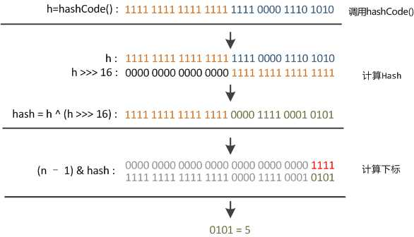

右移16位，正好是32bit的一半，自己的高半区和低半区做异或，就是为了混合原始哈希码的高位和低位，以此来加大低位的随机性。而且混合后的低位掺杂了高位的部分特征，这样高位的信息也被变相保留下来。

最后我们来看一下Peter Lawley的一篇专栏文章《An introduction to optimising a hashing strategy》里的的一个实验：他随机选取了352个字符串，在他们散列值完全没有冲突的前提下，对它们做低位掩码，取数组下标。

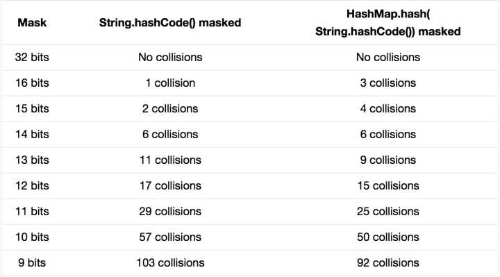

结果显示，当HashMap数组长度为512的时候（2^9），也就是用掩码取低9位的时候，在没有扰动函数的情况下，发生了103次碰撞，接近30%。而在使用了扰动函数之后只有92次碰撞。碰撞减少了将近10%。看来扰动函数确实还是有功效的。

另外Java1.8相比1.7做了调整，1.7做了四次移位和四次异或，但明显Java 8觉得扰动做一次就够了，做4次的话，多了可能边际效用也不大，所谓为了效率考虑就改成一次了。

下面是1.7的hash代码：

```java
static int hash(int h) {
    h ^= (h >>> 20) ^ (h >>> 12);
    return h ^ (h >>> 7) ^ (h >>> 4);
}
```

下面是1.8的hash代码：

```java
static final int hash(Object key) {
    int h;
    return (key == null) ? 0 : (h = key.hashCode()) ^ (h >>> 16);
}
```

### 11）1.8除了对hash函数做了优化，1.8还有别的优化吗？

1. 数组+链表改成了数组+链表或红黑树；

2. 链表的插入方式从头插法改成了尾插法，简单说就是插入时，如果数组位置上已经有元素，1.7将新元素放到数组中，原始节点作为新节点的后继节点，1.8遍历链表，将元素放置到链表的最后；

3. 扩容的时候1.7需要对原数组中的元素进行重新hash定位在新数组的位置，1.8采用更简单的判断逻辑，位置不变或索引+旧容量大小；

4. 在插入时，1.7先判断是否需要扩容，再插入，1.8先进行插入，插入完成再判断是否需要扩容


### 12）你分别跟我讲讲为什么要做这几点优化？

1)    防止发生hash冲突，链表长度过长，将时间复杂度由O(n)降为O(logn);

2)    因为1.7头插法扩容时，头插法会使链表发生反转，多线程环境下会产生环；

3)    这是由于扩容是扩大为原数组大小的2倍，用于计算数组位置的掩码仅仅只是高位多了一个1

> 扩容的时候为什么1.8 不用重新hash就可以直接定位原节点在新数据的位置呢?
>
> 这是由于扩容是扩大为原数组大小的2倍，用于计算数组位置的掩码仅仅只是高位多了一个1，怎么理解呢？
>
> 扩容前长度为16，用于计算(n-1) & hash 的二进制n-1为0000 1111，扩容为32后的二进制就高位多了1，为0001 1111。
>
> 因为是& 运算，1和任何数 & 都是它本身，那就分二种情况，如下图：原数据hashcode高位第4位为0和高位为1的情况；
>
> 第四位高位为0，重新hash数值不变，第四位为1，重新hash数值比原来大16（旧数组的容量）
> 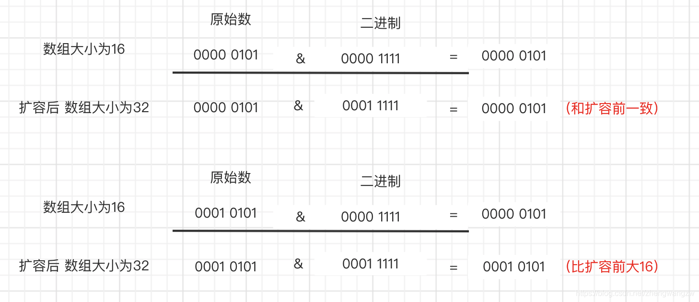

### 13）链表转红黑树和红黑树转链表的阈值？为什么？

阈值是8，红黑树转链表阈值为6。

因为根据泊松分布，在hash函数设计合理的情况下，发生hash碰撞8次的几率为百万分之6，概率说话。因为8够用了，至于为什么转回来是6，因为如果hash碰撞次数在8附近徘徊，会一直发生链表和红黑树的互相转化，为了预防这种情况的发生。

### 14）为什么HashMap使用红黑树而不使用AVL树

 AVL以及红黑树是高度平衡的树数据结构。它们非常相似，真正的区别在于在任何添加/删除操作时完成的旋转操作次数。

 两种实现都缩放为：O(lg N)，其中N是叶子的数量，但实际上AVL树在查找密集型任务上更快：利用更好的平衡，树遍历平均更短。另一方面，插入和删除方面，AVL树速度较慢：需要更多的旋转次数才能在修改时正确地重新平衡数据结构。

 在AVL树中，从根到任何叶子的最短路径和最长路径之间的差异最多为1。在红黑树中，差异可以是2倍。

 两个都是O（log n）查找，但平衡AVL树可能需要O（log n）旋转，而红黑树将需要最多两次旋转使其达到平衡（尽管可能需要检查O（log n）节点以确定旋转的位置）。旋转本身是O（1）操作，因为你只是移动指针。

## 3、Hashtable

### 1）Hashmap和Hashtable的区别

- Hashtable是不允许键或值为null的，HashMap的键值则都可以为null

-  实现方式不同：Hashtable继承了Dictionary类，而HashMap继承的是AbstractMap类。Dictionary是JDK1.0添加的

-  初始化容量不同：HashMap的初始容量为：16，Hashtable初始容量为：11，两者的负载因子默认都是：0.75

-  扩容机制不同：当现有容量大于总容量负载因子时，HashMap扩容规则为当前容量翻倍，Hashtable扩容规则为当前容量翻倍+1

-  迭代器不同：HashMap中的Iterator迭代器是fail-fast的，Hashtable的Iterator迭代器也是fail-fast，但它的Enumerator是fail-safe的


### 2）什么是fail-fast？它的原理

 **含义**

快速失败（fail—fast）是java集合中的一种机制，在用迭代器遍历一个集合对象时，如果遍历过程中对集合对象的内容进行了修改（增加、删除），则会抛出ConcurrentModificationException。

 **原理**

迭代器在遍历时直接访问集合中的内容，并且在遍历过程中使用一个modCount变量。

集合在被遍历期间如果内容发生变化，就会改变modCount的值。

每当迭代器使用hashNext()/next()遍历下一个元素之前，都会检测modCount变量是否为expectedmodCount值，是的话就返回遍历；否则抛出异常，终止遍历。

### 3）什么是fail-safe？它的原理

 **含义**

fail-safe:这种遍历基于容器的一个克隆。因此，对容器内容的修改不影响遍历。java.util.concurrent包下的容器都是安全失败的,可以在多线程下并发使用,并发修改。常见的的使用fail-safe方式遍历的容器有ConcerrentHashMap和CopyOnWriteArrayList等。

 **原理**

采用安全失败机制的集合容器，在遍历时不是直接在集合内容上访问的，而是先复制原有集合内容，在拷贝的集合上进行遍历。由于迭代时是对原集合的拷贝进行遍历，所以在遍历过程中对原集合所作的修改并不能被迭代器检测到，所以不会触发ConcurrentModificationException。

 **缺点**

1)    基于拷贝内容的优点是避免了ConcurrentModificationException，但同样地，迭代器并不能访问到修改后的内容，即：迭代器遍历的是开始遍历那一刻拿到的集合拷贝，在遍历期间原集合发生的修改迭代器是不知道的。

2)    需要复制集合，产生大量的无效对象，开销大

## 4、ConcurrentHashMap

### 1）如何处理HashMap的安全问题？

- 使用Collections.synchronizedMap(Map)创建线程安全的map集合；
- Hashtable
- ConcurrentHashMap

不过出于线程并发度的原因，我都会舍弃前两者使用最后的ConcurrentHashMap，他的性能和效率明显高于前两者。

### 2）Collections.synchronizedMap是怎么实现线程安全的？

在SynchronizedMap内部维护了一个普通对象Map，还有排斥锁mutex，如图

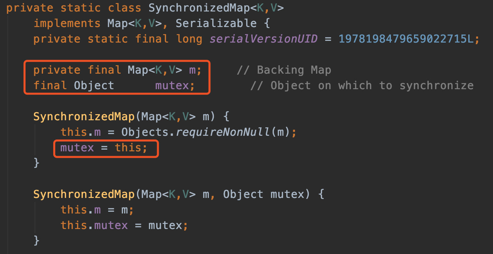

我们在调用这个方法的时候就需要传入一个Map，可以看到有两个构造器，如果你传入了mutex参数，则将对象排斥锁赋值为传入的对象。

如果没有，则将对象排斥锁赋值为this，即调用synchronizedMap的对象，就是上面的Map。

创建出synchronizedMap之后，再操作map的时候，就会对方法上锁，如图全是锁。（装饰着模式）

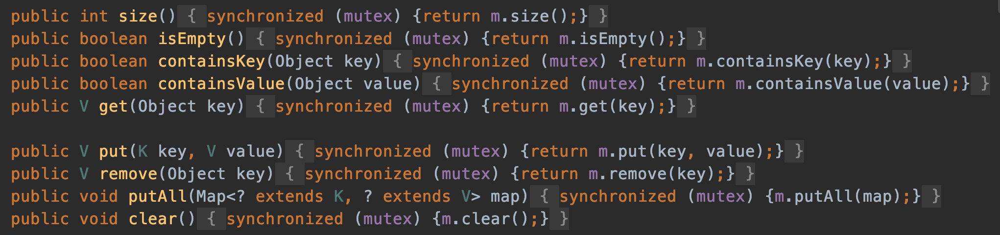

### 3）说说它的数据结构？以及它并发度高的原因。

ConcurrentHashMap 底层是基于 `数组 + 链表` 组成的，不过在 jdk1.7 和 1.8 中具体实现稍有不同。

#### a) 1.7

##### 1. 数据结构

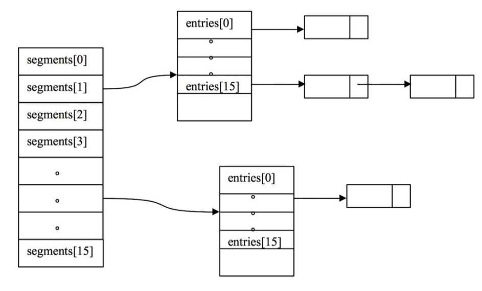

如图所示，是由 Segment 数组、HashEntry 组成，和 HashMap 一样，仍然是**数组加链表**。

Segment 是 ConcurrentHashMap 的一个内部类，主要的组成如下：

```java
static final class Segment<K,V> extends ReentrantLock implements Serializable {

    private static final long serialVersionUID = 2249069246763182397L;

    // 和 HashMap 中的 HashEntry 作用一样，真正存放数据的桶
    transient volatile HashEntry<K,V>[] table;

    transient int count;
        // 记得快速失败（fail—fast）么？
    transient int modCount;
        // 大小
    transient int threshold;
        // 负载因子
    final float loadFactor;

}
```


##### 2. 并发度高的原因

原理上来说，ConcurrentHashMap 采用了分段锁技术，其中 Segment 继承于 ReentrantLock。

不会像 HashTable 那样不管是 put 还是 get 操作都需要做同步处理，理论上 ConcurrentHashMap 支持 CurrencyLevel (Segment 数组数量)的线程并发。

每当一个线程占用锁访问一个 Segment 时，不会影响到其他的 Segment。

就是说如果容量大小是16他的并发度就是16，可以同时允许16个线程操作16个Segment而且还是线程安全的。


##### 3. put 方法

```java
public V put(K key, V value) {
    Segment<K,V> s;
    if (value == null)
        throw new NullPointerException();//这就是为啥他不可以put null值的原因
    int hash = hash(key);
    
    //计算出segment下标
    int j = (hash >>> segmentShift) & segmentMask;
    
    //获得segment对象，判断是否为null，是则创建segment
    if ((s = (Segment<K,V>)UNSAFE.getObject          
         (segments, (j << SSHIFT) + SBASE)) == null) 
        //这时不能确定是否真的为null，因为其它线程也发现该segment为null，
        //因此在ensureSegment 里采用cas方式保证 segment 安全性
        s = ensureSegment(j);
    //进入segment的put流程
    return s.put(key, hash, value, false);
}
```

他先定位到Segment，然后调用Segment的put操作。

```java
final V put(K key, int hash, V value, boolean onlyIfAbsent) {
    //尝试加锁
    HashEntry<K,V> node = tryLock() ? null :
    // 如果不成功，进入 scanAndLockForPut 流程
    //如果是多核cpu，最多tryLock 64 次，进入 lock流程
    //在尝试期间，还可以顺便看该节点在链表中有没有，如果没有顺便创建出来
    scanAndLockForPut(key, hash, value);
    //进行到这里segment已经被成功加锁，可以安全执行
    V oldValue;
    try {
        HashEntry<K,V>[] tab = table;
        int index = (tab.length - 1) & hash;
        HashEntry<K,V> first = entryAt(tab, index);
        for (HashEntry<K,V> e = first;;) {
            if (e != null) {
                //更新
                K k;
                if ((k = e.key) == key ||
                    (e.hash == hash && key.equals(k))) {
                    oldValue = e.value;
                    if (!onlyIfAbsent) {
                        e.value = value;
                        ++modCount;
                    }
                    break;
                }
                e = e.next;
            }
            else {
                // 新增
                // 1）之前等待锁时，node已经被创建，next 指向链表头
                if (node != null)
                    node.setNext(first);
                else
                    // 2）创建新node
                    node = new HashEntry<K,V>(hash, key, value, first);
                int c = count + 1;
                // 3）扩容
                if (c > threshold && tab.length < MAXIMUM_CAPACITY)
                    rehash(node);
                else
                    // 将 node 作为链表头
                    setEntryAt(tab, index, node);
                ++modCount;
                count = c;
                oldValue = null;
                break;
            }
        }
    } finally {
        unlock();
    }
    return oldValue;
}
```

##### 4. get 方法

get时并未加锁，用了UNSAFE中的方法保证了可见性，扩容过程中，get先发生就从旧表取内容，get发生后就从新表取内容。

```java
public V get(Object key) {
    Segment<K,V> s; // manually integrate access methods to reduce overhead
    HashEntry<K,V>[] tab;
    int h = hash(key);
    // u 为 segment 对象在数组中的偏移量
    long u = (((h >>> segmentShift) & segmentMask) << SSHIFT) + SBASE;
    // s 即为 segment
    if ((s = (Segment<K,V>)UNSAFE.getObjectVolatile(segments, u)) != null &&
        (tab = s.table) != null) {
        for (HashEntry<K,V> e = (HashEntry<K,V>) UNSAFE.getObjectVolatile
             (tab, ((long)(((tab.length - 1) & h)) << TSHIFT) + TBASE);
             e != null; e = e.next) {
            K k;
            if ((k = e.key) == key || (e.hash == h && key.equals(k)))
                return e.value;
        }
    }
    return null;
}
```


##### 5. size方法

- 计算元素个数前，先不加锁计算两次，如果前后两次结果一样，认为个数正确返回；
- 如果不一样，进行重试，重试次数超过3，将所有segment锁住，重新计算个数返回。

```java
public int size() {
    // Try a few times to get accurate count. On failure due to
    // continuous async changes in table, resort to locking.
    final Segment<K,V>[] segments = this.segments;
    int size;
    boolean overflow; // true if size overflows 32 bits
    long sum;         // sum of modCounts
    long last = 0L;   // previous sum
    int retries = -1; // first iteration isn't retry
    try {
        for (;;) {
            if (retries++ == RETRIES_BEFORE_LOCK) {
                // 超过重试次数，需要创建所有 segment 并加锁
                for (int j = 0; j < segments.length; ++j)
                    ensureSegment(j).lock(); // force creation
            }
            sum = 0L;
            size = 0;
            overflow = false;
            for (int j = 0; j < segments.length; ++j) {
                Segment<K,V> seg = segmentAt(segments, j);
                if (seg != null) {
                    sum += seg.modCount;
                    int c = seg.count;
                    if (c < 0 || (size += c) < 0)
                        overflow = true;
                }
            }
            if (sum == last)
                break;
            last = sum;
        }
    } finally {
        if (retries > RETRIES_BEFORE_LOCK) {
            for (int j = 0; j < segments.length; ++j)
                segmentAt(segments, j).unlock();
        }
    }
    return overflow ? Integer.MAX_VALUE : size;
}
```


##### 6. 缺陷

- Segment 数组默认大小为16，也就是说默认支持的并发度就是16，而这个容量初始化指定后就不能改变了，并不像1.8那样随着扩容可以支持更高的并发度，并且不是懒加载初始化（初始化时会创建Segment[0]）；
- HashEntry[] table中采用的是链表的形式，并不会转换成红黑树，在碰撞激烈的情况下效率较低。


#### b) 1.8

##### 1. 数据结构

其中抛弃了原有的 Segment 分段锁，而采用了 `CAS + synchronized` 来保证并发安全性。

跟HashMap很像，也把之前的HashEntry改成了Node，但是作用不变，把值和next采用了volatile去修饰，保证了可见性，并且也引入了红黑树，在链表大于一定值的时候会转换（默认是8）。

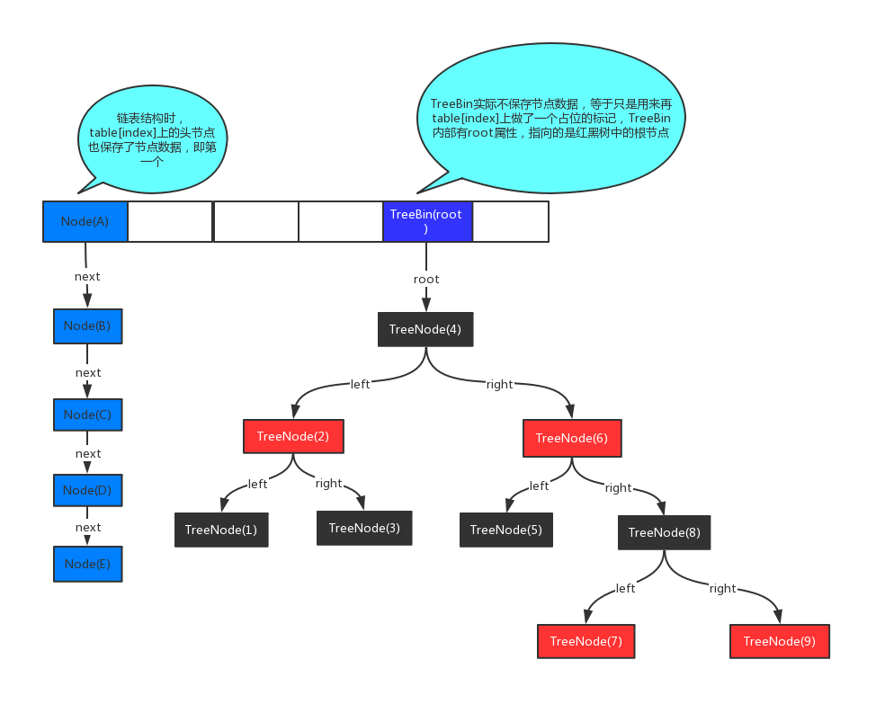

##### 2. get方法

```java
public V get(Object key) {
    Node<K,V>[] tab; Node<K,V> e, p; int n, eh; K ek;
    // spread 方法能确保返回的结果为正数
    int h = spread(key.hashCode());
    if ((tab = table) != null && (n = tab.length) > 0 &&
        (e = tabAt(tab, (n - 1) & h)) != null) {
        // 如果头结点已经是要找的key
        if ((eh = e.hash) == h) {
            if ((ek = e.key) == key || (ek != null && key.equals(ek)))
                return e.val;
        }
        // hash为负数表示该bin在扩容或是treebin，这时调用 find 方法来查找
        else if (eh < 0)
            return (p = e.find(h, key)) != null ? p.val : null;
        // 正常遍历链表，用 equals 比较
        while ((e = e.next) != null) {
            if (e.hash == h &&
                ((ek = e.key) == key || (ek != null && key.equals(ek))))
                return e.val;
        }
    }
    return null;
}
```


##### 3. put方法

put方法只会在桶下标发生冲突的情况下加synchronize锁，而且锁的只是链表的头节点，其它情况采用cas锁，这是他为什么并发度高的原因。

```java
public V put(K key, V value) {
        return putVal(key, value, false);
    }

/** Implementation for put and putIfAbsent */
final V putVal(K key, V value, boolean onlyIfAbsent) {
    if (key == null || value == null) throw new NullPointerException();
    // 其中spread方法会综合高低位，具有很好的hash性，保证hash为正整数
    int hash = spread(key.hashCode());
    int binCount = 0;		//binCount 是链表或树的长度
    for (Node<K,V>[] tab = table;;) {	//这里用死循环
        // f 是链表头节点
        // fh 是链表头节点的hash
        // i 是链表在table中的下标
        Node<K,V> f; int n, i, fh;
        // 要创建 table
        if (tab == null || (n = tab.length) == 0)
            // 初始化 table，使用了cas，无需synchronize，创建成功进入下一轮循环
            tab = initTable();
        // 要创建链表头节点
        else if ((f = tabAt(tab, i = (n - 1) & hash)) == null) {
            // 添加链表表头使用cas，无需synchronize
            if (casTabAt(tab, i, null,
                         new Node<K,V>(hash, key, value, null)))
                break;                   // no lock when adding to empty bin
        }
        // 帮忙扩容
        else if ((fh = f.hash) == MOVED)
            // 帮忙之后进入下一轮循环
            tab = helpTransfer(tab, f);
        // 桶下标冲突
        else {
            V oldVal = null;
            // 锁住链表头节点
            synchronized (f) {
                // 再次确认链表头节点没有移动
                if (tabAt(tab, i) == f) {
                    //头节点的hash码大于等于0，表示是普通节点（链表）
                    //小于0是可能是树节点，也可能是ForwardingNode节点
                    if (fh >= 0) {		
                        binCount = 1;
                        // 遍历链表
                        for (Node<K,V> e = f;; ++binCount) {
                            K ek;
                            // 找到相同的key
                            if (e.hash == hash &&
                                ((ek = e.key) == key ||
                                 (ek != null && key.equals(ek)))) {
                                oldVal = e.val;
                                // onlyIfAbsent 为false，进行覆盖操作
                                if (!onlyIfAbsent)
                                    e.val = value;
                                break;
                            }
                            Node<K,V> pred = e;
                            // 已经是最后的节点了，新增Node，追加链表尾
                            if ((e = e.next) == null) {
                                pred.next = new Node<K,V>(hash, key,
                                                          value, null);
                                break;
                            }
                        }
                    }
                    else if (f instanceof TreeBin) {	//头节点是树节点
                        Node<K,V> p;
                        binCount = 2;
                        // putTreeVal 会看key是否已经在树中，是，则返回对应的TreeNode
                        if ((p = ((TreeBin<K,V>)f).putTreeVal(hash, key,
                                                              value)) != null) {
                            oldVal = p.val;
                            if (!onlyIfAbsent)
                                p.val = value;
                        }
                    }
                }
            }
            if (binCount != 0) {
                if (binCount >= TREEIFY_THRESHOLD)
                    // 如果链表长度 >= 树化阈值，将链表转换成红黑树
                    treeifyBin(tab, i);
                if (oldVal != null)
                    return oldVal;
                break;
            }
        }
    }
    // 增加 size 计数
    addCount(1L, binCount);
    return null;
}
```


##### 4. initTable方法

```java
private final Node<K,V>[] initTable() {
    Node<K,V>[] tab; int sc;
    while ((tab = table) == null || tab.length == 0) {
        if ((sc = sizeCtl) < 0)
            Thread.yield(); // lost initialization race; just spin
        // 使用cas尝试将SIZECTL设置为-1（表示初始化table）
        else if (U.compareAndSwapInt(this, SIZECTL, sc, -1)) {
            // 获得锁，创建table，这时其它线程会在while循环直yield，直至table创建
            try {
                if ((tab = table) == null || tab.length == 0) {
                    int n = (sc > 0) ? sc : DEFAULT_CAPACITY;
                    @SuppressWarnings("unchecked")
                    Node<K,V>[] nt = (Node<K,V>[])new Node<?,?>[n];
                    table = tab = nt;
                    sc = n - (n >>> 2);
                }
            } finally {
                sizeCtl = sc;
            }
            break;
        }
    }
    return tab;
}
```


##### 5. addCount方法

```java
// check是之前binCount的个数
private final void addCount(long x, int check) {
    //CountCell为累加单元，类似LongAdder的思想。
    CounterCell[] as; long b, s;
    if (
        // 已经有了 counterCells，向cell累加
        (as = counterCells) != null ||
        // 还没有，向 baseCount 累加
        !U.compareAndSwapLong(this, BASECOUNT, b = baseCount, s = b + x)) {
        CounterCell a; long v; int m;
        boolean uncontended = true;
        if (
            // 还没有 counterCells
            as == null || (m = as.length - 1) < 0 ||
            // 还没有 cell
            (a = as[ThreadLocalRandom.getProbe() & m]) == null ||
            // cell cas增加计数失败
            !(uncontended = U.compareAndSwapLong(a, CELLVALUE, v = a.value, v + x))) {
            // 创建累加单元数组和cell，累加重试
            fullAddCount(x, uncontended);
            return;
        }
        if (check <= 1)
            return;
        //获取元素个数
        s = sumCount();
    }
    if (check >= 0) {
        Node<K,V>[] tab, nt; int n, sc;
        while (s >= (long)(sc = sizeCtl) && (tab = table) != null &&
               (n = tab.length) < MAXIMUM_CAPACITY) {
            int rs = resizeStamp(n);
            if (sc < 0) {
                if ((sc >>> RESIZE_STAMP_SHIFT) != rs || sc == rs + 1 ||
                    sc == rs + MAX_RESIZERS || (nt = nextTable) == null ||
                    transferIndex <= 0)
                    break;
                // newtable 已经创建了，帮忙扩容
                if (U.compareAndSwapInt(this, SIZECTL, sc, sc + 1))
                    transfer(tab, nt);
            }
            // 需要扩容，这是 newtable 未创建
            else if (U.compareAndSwapInt(this, SIZECTL, sc,
                                         (rs << RESIZE_STAMP_SHIFT) + 2))
                transfer(tab, null);
            s = sumCount();
        }
    }
}
```


##### 6. size方法

size计算实际放生在put，remove改变集合的操作中

- 没有竞争发生，向baseCount累加计数
- 有竞争发生，新建counterCells，向其中的一个cell累加计数
  - counterCells 初始有两个
  - 如果计数竞争比较激烈，会创建新的cell来累加计数

```java
public int size() {
    long n = sumCount();
    return ((n < 0L) ? 0 :
            (n > (long)Integer.MAX_VALUE) ? Integer.MAX_VALUE :
            (int)n);
}

final long sumCount() {
    CounterCell[] as = counterCells; CounterCell a;
    // 将 baseCount 计数与所有 cell 计数累加
    long sum = baseCount;
    if (as != null) {
        for (int i = 0; i < as.length; ++i) {
            if ((a = as[i]) != null)
                sum += a.value;
        }
    }
    return sum;
}
```

