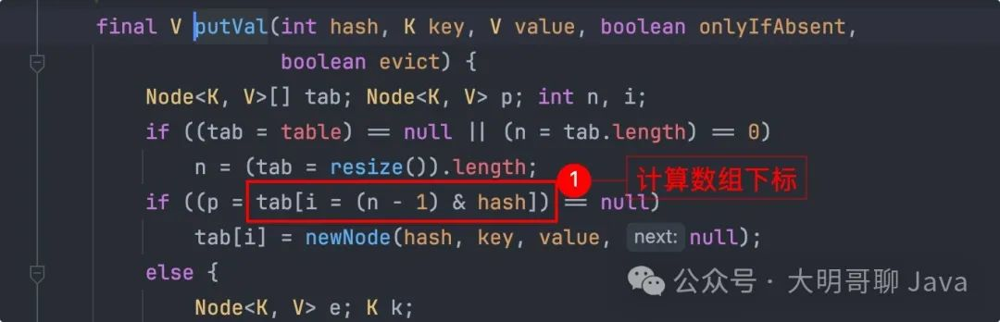
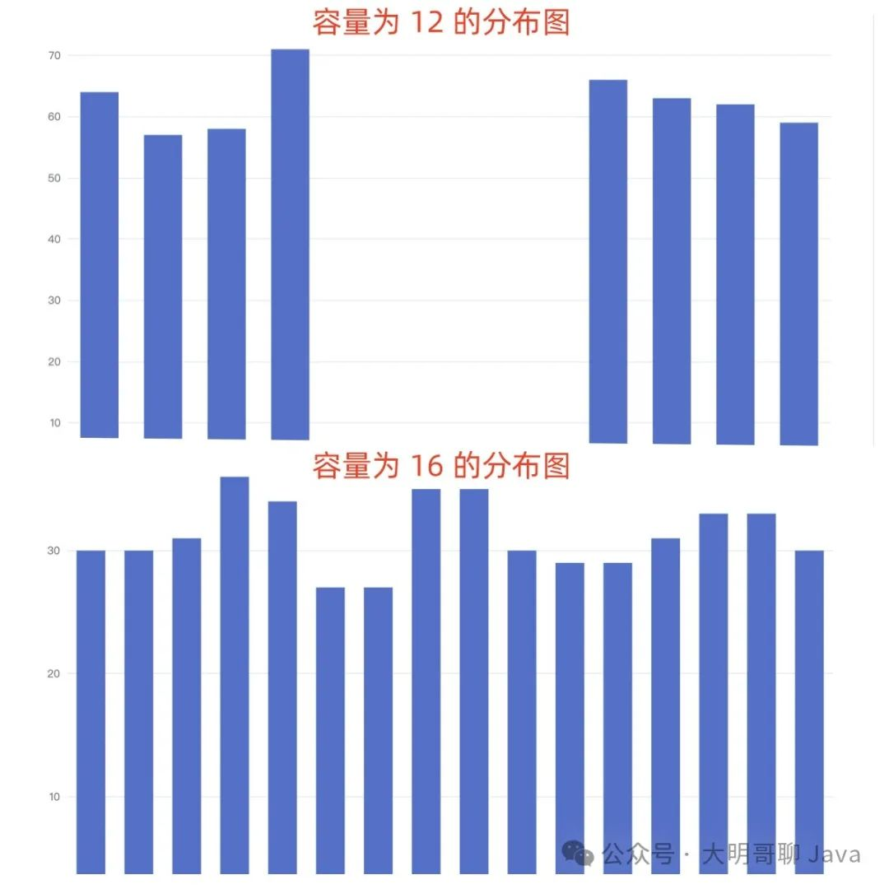
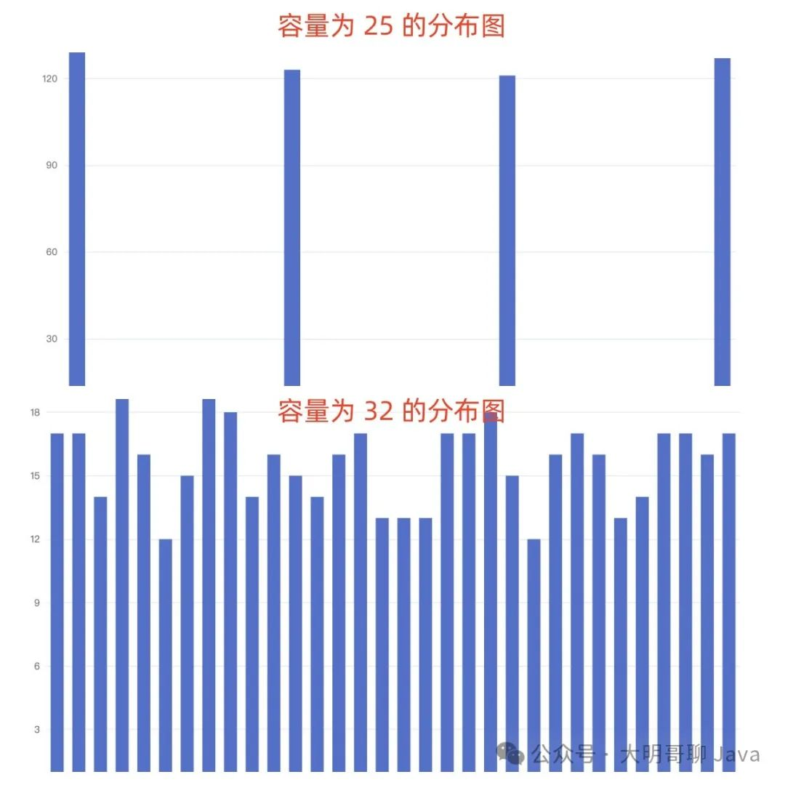
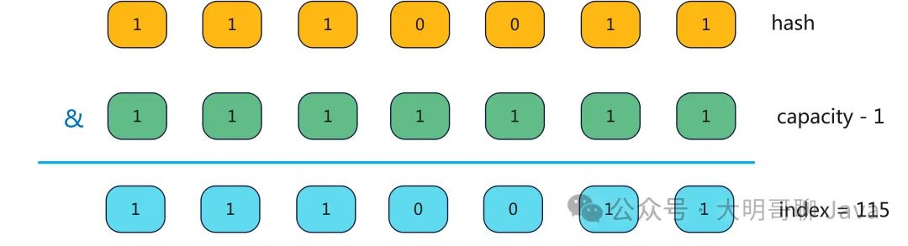
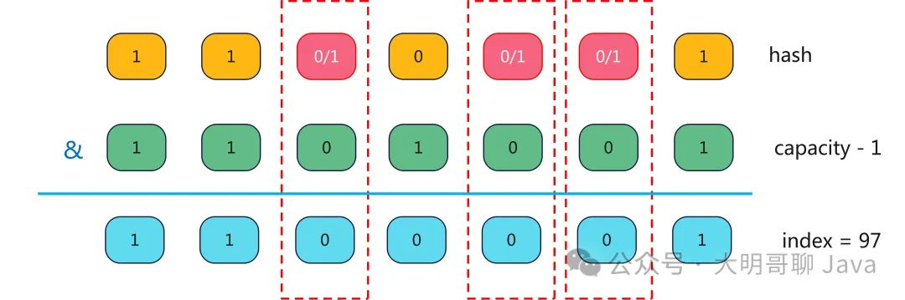
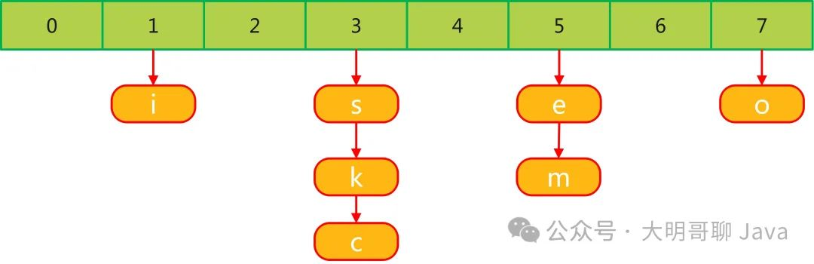
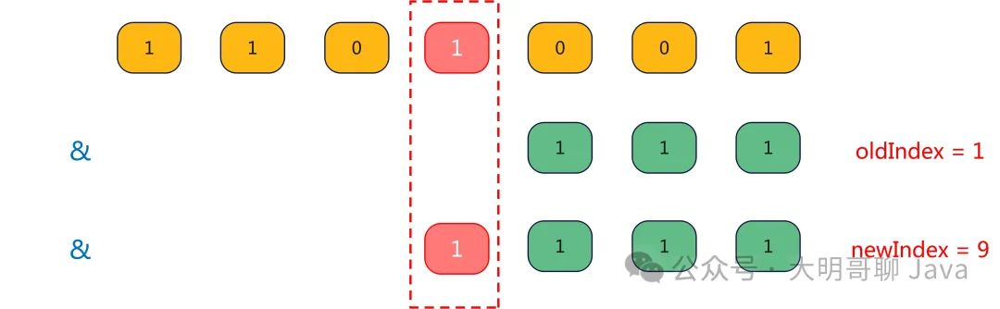

# HashMap的容量为什么一定是2^n？

## 1、优点：

**位运算效率**：与使用取模（%）操作相比，使用位运算来计算索引位置更加高效。当容量是 `2^n`  时，计算索引的公式可以从 `(hash % capacity)` 简化为 `(hash & (capacity - 1))`，这个操作仅涉及位与运算，比取模操作更快。

**元素分布更加均匀**：利用哈希码的低位直接作为数组索引，确保了元素能够被均匀分布在整个 `HashMap` 中，从而在理想情况下减少了哈希冲突，提高了 HashMap 的整体性能。

**扩容性能更佳**：`HashMap` 的初始容量是`2^n`，扩容也是以 2 倍的形式进行扩容，这样在进行扩容重新分布元素时，我们只需要对参与计算的最高位进行检测，如果为 1 就向高位移动 `2^(n-1)` 位，为 0 就保持不动。无需重新计算所有 key 的 hash 值再来重新分布。


## 2、详解

HashMap 的默认容量是 `1 << 4`，也就是`2^4`，也就是16。当我们指定容量大小的时候，如果这个值不是 `2^n`，HashMap 就会将其处理为 `2^n`。

```java
public HashMap(int initialCapacity) {
    this(initialCapacity, DEFAULT_LOAD_FACTOR);
}

public HashMap(int initialCapacity, float loadFactor) {
    // 处理初始容量
    this.threshold = tableSizeFor(initialCapacity);
}
```

使用 `tableSizeFor()` 对初始容量进行处理：

```java
static final int tableSizeFor(int cap) {
    int n = cap - 1;
    n |= n >>> 1;
    n |= n >>> 2;
    n |= n >>> 4;
    n |= n >>> 8;
    n |= n >>> 16;
    return (n < 0) ? 1 : (n >= MAXIMUM_CAPACITY) ? MAXIMUM_CAPACITY : n + 1;
}
```

这个方法用于计算给定容量 `cap` 最接近的、大于或等于该值的 `2^n` 的数。可能有小伙伴看到这个方法就懵逼了，大明哥用 21 来详细介绍下，它是如何处理得到 32 的。

- `int n = cap - 1`：这一步的目的是为了简化后面的位操作`n = 21 - 1 = 20`，二进制为：`10100`；

- `n |= n >>> 1;`

- - 右移一位并进行位或运算，目的是把最高位的 1 右边的第一个位也设置为 1。
  - `n >>> 1` 右移一位得到 `01010` ，然后与 `10100` 位或运算，得到 `11110`，为 30。

- `n |= n >>> 2;`

- - `n >>> 2` 右移两位得到 `00111`，然后与 `11110` 位或运算，得到 `11111`，为 32。
  - 由于此时 n 已经全部都是 1 了，所以再进行右移和位或操作，`n` 保持不变，即 `11111`，为 32。

然后重复这个过程，分别是 `n >>> 4`、`n >>> 8`、`n >>> 16`。每一步都将前面步骤中生成的 1 向右扩散，确保从最初的最高位 1 到最低位，所有位都被设置为 1。

为什么 HashMap 要进行这样的操作呢 ？主要有如下三个原因：

1. **位运算效率**：与使用取模（%）操作相比，使用位运算来计算索引位置更加高效。当容量是 `2^n`  时，计算索引的公式可以从 `(hash % capacity)` 简化为 `(hash & (capacity - 1))`，这个操作仅涉及位与运算，比取模操作更快。
2. **元素分布更加均匀**：利用哈希码的低位直接作为数组索引，确保了元素能够被均匀分布在整个 `HashMap` 中，从而在理想情况下减少了哈希冲突，提高了 HashMap 的整体性能。
3. **扩容性能更佳**：`HashMap` 的初始容量是`2^n`，扩容也是以 2 倍的形式进行扩容，这样在进行扩容 hash 重分布时，只有两种情况：要么保持不变 ，要么在原索引位置上 + n，性能比打散重新再分布性能更好。

### 1）位运算效率

因为位运算仅仅只涉及到简单的二进制位操作，而不需要复杂的算术计算。而取模运算涉及到除法运算，除法运算确是 CPU 中相对复杂和耗时的操作之一，因为它涉及到多步骤的算术计算。

所以，相比于位运算，取模运算需要更多的CPU周期来完成。

如果我们不将 HashMap 的容量约定为 `2^n`，是无法将 % 运算转换为 & 运算的。而`x % 2^n = x & (2^n - 1)`，可以把 % 运算转换为 & 运算，这样性能就大大提高了。

那为什么 `x % 2^n = x & (2^ - 1)`呢？

当我们用一个数 `x` 去取模 `2^n` 时，实际上是在找出 `x` 中能够被 `2^n` 整除的最大部分的余数。在二进制中，`2^n` 总是像 `100...0`（后面跟着 n 个 0）。因此，`x` 除以 `2^n` 的余数只与 `x` 的二进制表示中的最低 n 位有关，这正是按位与操作 `x & (2^n - 1)` 所保留的部分。

看不懂？举个例子，假设 n = 4，x = 25。`25 % 2^4` 它是等于 `25 / 2^4` 的余数，即 `25 >> 4`（11001 右移 4 位），而被移除到的部分（4 位 `1001`）就是我们的余数，即`x` 除以 `2^n` 的余数只与 `x` 的二进制表示中的最低 n 位有关。而 `25 & （16 -1） = 11001 & 1111 = 1001`。

所以你会看到 HashMap 在获取数组下标时采用的方式就是位运算，例如 `put()`：



### 2）分布更加均匀

我们先写个简单的案例测试下，我们新建一个 Student 对象，利用它的 hashcode 分别与 12、16 、 25 、32，按照 HashMap 那样定位 index 的方式来计算值（公式：`(table.length - 1) & (key.hashCode ^ (key.hashCode >> 16))`），然后放入到 HashMap 中去，看看 HashMap 的结果就可以知道分布情况了。

- Student 对象

```java
@Data
@AllArgsConstructor
public class Student{
    private String name;

    private Integer age;
}
```

- 测试程序：

```java
public class HashMapTest {
    public static void main(String[] args) {
        Map<Integer,Integer> resultMap = new HashMap<>();
        int k = 16;   // 修改这个
        // 循环创建 500 个对象
        for (int i = 0; i < 500 ; i++) {
            Student student = new Student("skjava-" + i,i);
            int h = student.hashCode();
            int hash1 = h ^ (h>>>16);
            int hash = (k - 1) & hash1;
            if (resultMap.containsKey(hash)) {
                int count = resultMap.get(hash);
                resultMap.put(hash,count + 1);
            } else {
                resultMap.put(hash,1);
            }
        }

        resultMap.forEach((key,value) -> System.out.println("key:" + key + "    value:" + value));
    }
}
```

最终得到的结果分布图如下：





从上图可以看出只有容量为 16 和 32 的分布是均匀的，而 12 和 25 分布都极其不均匀。为什么会出现这种情况？我们以 s 的 hash （115 = 1110011）值为例。最接近的 127，则 `"s".hashCode() & (127 - 1)` 如下图：



那如果 capacity 为106 呢？


你会发现标红色虚线部分，无论是 0 还是 1 产生的结果都是一样的，所以如果 capacity 为 106，则它产生的 hash 冲突比  127 大的多。

> 所以，容量为 `2^n` ，它能够利用哈希码的低位直接作为数组索引，确保了元素能够被均匀分布在整个 `HashMap` 中，从而在理想情况下减少了哈希冲突。

### 3）扩容性能更佳

当 HashMap 的容量超过阈值后，就会进行扩容操作，扩容就会设计到 hash 重分布的。而重分布的过程是重新计算所有 key 的 hash 值，然后再重新分布，这个过程非常繁重且性能极低。如果我们将 HashMap 的容量保持为 `2^n`，就避免了这个过程，会变得非常简单而又高效。

加入我们有这样一批 key：`s`、`i`、`k`、`e`、`c`、`o`、`m`，为了更好地演示，HashMap 的初始容量为8，所以数据分布如下：



现在我们扩容到 16 去，`index = hash & (16-1)`，上面 7 个字母调整位置如表：

| key  | key 二进制值 | key ^ (16-1) | 原始位置 | 扩容 16后位置 | 结果      |
| :--- | :----------- | :----------- | :------- | :------------ | :-------- |
| s    | 1110011      | 0011         | 3        | 3             | 不动      |
| i    | 1101001      | 1001         | 1        | 9             | 移动 8 位 |
| k    | 1101011      | 1011         | 3        | 11            | 移动 8 位 |
| e    | 1100101      | 0101         | 5        | 5             | 不动      |
| c    | 1100011      | 0011         | 3        | 3             | 不动      |
| o    | 1101111      | 1111         | 7        | 15            | 移动 8 位 |
| m    | 1101101      | 1101         | 5        | 13            | 移动 8 位 |

看不明白？下图 `s` 的 index 变化图：


再看 `i` 的 index 变化图：



从上图 `s` 和 `i` 的变化图中可以看出，HashMap 的扩容是否需要移位，由扩容后 key 的 hashcode 参与计算的最高位是否 1 所决定，并且移动的方向只有一个，即向高位移动。因此，在扩容后，我们不需要对每个 key 都进行计算然后来重新分配位置，我们只需要对最高位进行检测，如果为 1 就向高位移动 `2^(n-1)` 位，为 0 就保持不动，从而优化了性能。