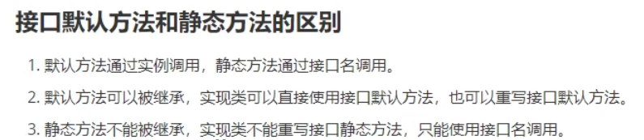
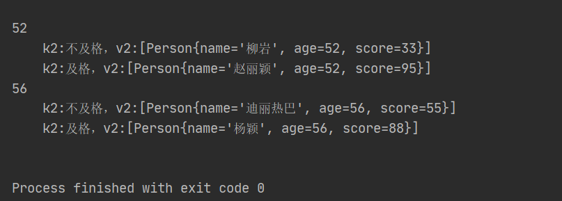

# 一、Open JDK和Oracle JDK的区别

Open JDK是Sun把Java开源而形成的项目。也就是说Open JDK是Java SE派台版的开源和免费实现，它由SUN和Java社区提供支持，2009年Oracle收购了Sun公司，自此Java的维护方之一的Sun也变成了Oracle。

大多数JDK都是在Open JDK的基础上进一步编写实现的。Oracle JDK是由Oracle公司开发，Oracle JDK是基于Open JDK源代码的商业版本。需要在商业许可的情况下才能使用。

# 二、JDK1.8新特性

## 1、Lambda表达式

### 1）标准格式

```java
(参数类型 参数名称) ->{
    代码体;
}
```

### 2）案例

```java
interface TestLambda{
    void test();
}

public class Solution {
    public static void hello(TestLambda lambda){
        lambda.test();
    }


    public static void main(String[] args) {
        hello(()->{
            System.out.println("这是一个Lambda表达式");
        });
    }
}
```


### 3）总结

Lambda表达式就是对**接口**中**抽象**方法的重写。


### 4）原理

匿名内部类在编译的时候会生成一个class文件（新的类$）

Lambda在程序过程运行时会形成一个类在类中新增一个方法，这个方法的方法体就是Lambda表达式中的代码；还会形成一个匿名内部类，实现接口，重写抽象方法；在接口的重写方法中会调用新生成的方法。


### 5）省略格式

规则：

1. 小括号内参数的类型可以省略；
2. 如果小括号内有且仅有一个参数，则小括号可以省略；
3. 如果大括号内有且仅有一个语句，可以**<u>同时</u>**省略大括号、return关键字及语句分号；


### 6）前提条件

1. 方法的参数或变量的类型是接口；

```java
interface TestLambda{
    void test();
}

public class Solution {
    public static void main(String[] args) {
        //变量类型：
        TestLambda t = ()->{
            System.out.println("hello");
        };
    }
}
```

2. 这个接口中只能有一个抽象方法；


### 7）方法引用

- 对象名引用成员方法

```java
public static void main(String[] args){
    Date date = new Date();
    
    Supplier<Long> supplier = ()->date.getTime();
    System.out.println(supplier.get());
    
    Supplier<Long> supplier2 = date::getTime;
    System.out.println(supplier2.get());
}
```


- 类名引用静态方法

```java
public static void main(String[] args){
    Supplier<Long> supplier = ()->System.currentTimeMillis();
    System.out.println(supplier.get());

    Supplier<Long> supplier2 = System::currentTimeMillis;
    System.out.println(supplier2.get());
}
```


- 类名引用实例方法（Java面向对象中，类名只能调用静态方法，类名引用实例方法是有前提的，实际上是拿第一个参数作为方法的调用者）

```java
public static void main(String[] args){
    Function<String,Integer> f1 = (s)->{
        return s.length();
    };
    System.out.println("f1:"+f1.apply("abc"));

    Function<String,Integer> f2 = String::length;
    System.out.println("f2:"+f2.apply("abc"));
}
```


- 引用类的构造器

```java
class Person{
    private String name;
    private int age;

    public Person(){}

    public Person(String name,int age){
        this.name = name;
        this.age = age;
    }

    @Override
    public String toString() {
        return "Person{" +
                "name='" + name + '\'' +
                ", age=" + age +
                '}';
    }
}

public class Solution {

    public static void main(String[] args){
        //无参：
        Supplier<Person> supplier = ()->{ return new Person(); };
        System.out.println(supplier.get());

        Supplier<Person> supplier1 = Person::new;
        System.out.println(supplier1.get());

        //有参
        BiFunction<String,Integer,Person> biFunction = (String name,Integer age)->{return new Person(name,age);};
        Person person = biFunction.apply("小明", 14);
        System.out.println(person);

        BiFunction<String,Integer,Person> biFunction2 = Person::new;
        Person person2 = biFunction2.apply("小明", 14);
        System.out.println(person2);
    }
}
```


## 2、接口增强

### 1）默认方法（default）

```java
interface TestLambda{
    public default void hello(){
        System.out.println("Hello");
    }
}
```


### 2）静态方法（static）

```java
interface TestLambda{
    public static void hello(){
        System.out.println("Hello");
    }
}
```




## 3、集合之Stream()流式操作

### 1）含义

Stream流式思想类似与工厂车间的“生产流水线”，Stream不是一种数据结构，二十对数据进行加工处理。Stream()流可以看作式流水线的一个工序。在流水线上，通过多个工序让一个原材料加工成一个商品。

### 2）获取流常见的两种方式

1. 通过Collection接口中的默认方法Stream.stream()；
2. 通过Stream接口中的静态方法。

### 3）注意事项

1. Stream只能操作一次；

```java
public static void main(String[] args){
    Stream<String> stream = Stream.of("aa","bb","cc");
    long count = stream.count();
    //将抛出异常：java.lang.IllegalStateException: stream has already been operated upon or closed
    long count2 = stream.count();
}
```


2. Stream方法返回的是新的流；

```java
public static void main(String[] args){
    Stream<String> stream = Stream.of("aa","bb","cc");
    Stream<String> limit = stream.limit(1);
    System.out.println(limit == stream);    //返回false
}
```


3. Stream不调用终结方法，中间的操作不会执行。

```java
public static void main(String[] args){
    Stream<String> stream = Stream.of("aa","bb","cc");
    //程序不会有任何输出
    stream.filter((s)->{
        System.out.println(s);
        return true;
    });
}
```


### 4）常用操作

#### 1. foreach

```java
public static void main(String[] args){
    List<String> list = new ArrayList<>();
    Collections.addAll(list,"aa","bb","cc");
    Stream<String> stream = list.stream();
    stream.forEach(System.out::println);//等同于(s)-> System.out.println(s)
}
```

#### 2. count

```java
public static void main(String[] args){
    List<String> list = new ArrayList<>();
    Collections.addAll(list,"aa","bb","cc");
    long count = list.stream().count();
}
```


#### 3. filter

```java
public static void main(String[] args){
    List<String> list = new ArrayList<>();
    Collections.addAll(list,"aa","bb","cc");
    Stream<String> stream = list.stream();
    stream.filter((s)->s.length() == 2).forEach(System.out::println);//等同于(s)-> System.out.println(s)
}
```


#### 4. limit

#### 5. skip

#### 6. map

```java
@Test
public void testMap() {
    Stream<String> original = Stream.of("11", "22", "33");

    // Map可以将一种类型的流转换成另一种类型的流
    // 将Stream流中的字符串转成Integer

    // original.map(s -> Integer.parseInt(s)).forEach(System.out::println);
    original.map(Integer::parseInt).forEach(System.out::println);
}
```

#### 7. sorted

#### 8. distinct

#### 9. match

#### 10. max和min

#### 11. redure

```java
@Test
public void testReduce() {
    // T reduce(T identity, BinaryOperator<T> accumulator);
    // T identity: 默认值
    // BinaryOperator<T> accumulator: 对数据进行处理的方式
    // reduce如何执行?
    // 第一次, 将默认值赋值给x, 取出集合第一元素赋值给y
    // 第二次, 将上一次返回的结果赋值x, 取出集合第二元素赋值给y
    // 第三次, 将上一次返回的结果赋值x, 取出集合第三元素赋值给y
    // 第四次, 将上一次返回的结果赋值x, 取出集合第四元素赋值给y
    int reduce = Stream.of(4, 5, 3, 9).reduce(0, (x, y) -> {
        System.out.println("x = " + x + ", y = " + y);
        return x + y;
    });
    System.out.println("reduce = " + reduce); // 21

    // 获取最大值
    Integer max = Stream.of(4, 5, 3, 9).reduce(0, (x, y) -> {
        return x > y ? x : y;
    });
    System.out.println("max = " + max);
}
```


#### 12. mapToInt

```java
 @Test
public void testNumericStream() {
    // Integer占用的内存比int多,在Stream流操作中会自动装箱和拆箱
    Stream<Integer> stream = Stream.of(1, 2, 3, 4, 5);
    // 把大于3的打印出来
    // stream.filter(n -> n > 3).forEach(System.out::println);

    // IntStream mapToInt(ToIntFunction<? super T> mapper);
    // IntStream: 内部操作的是int类型的数据,就可以节省内存,减少自动装箱和拆箱
    /*IntStream intStream = Stream.of(1, 2, 3, 4, 5).mapToInt((Integer n) -> {
            return n.intValue();
        });*/

    IntStream intStream = Stream.of(1, 2, 3, 4, 5).mapToInt(Integer::intValue);
    intStream.filter(n -> n > 3).forEach(System.out::println);
}
```


#### 13. concat

```java
@Test
public void testContact() {
    Stream<String> streamA = Stream.of("张三");
    Stream<String> streamB = Stream.of("李四");

    // 合并成一个流
    Stream<String> newStream = Stream.concat(streamA, streamB);
    // 注意:合并流之后,不能操作之前的流啦.
    // streamA.forEach(System.out::println);

    newStream.forEach(System.out::println);
}
```


#### 14. 收集Stream流中的结果到集合中

```java
@Test
public void testStreamToCollection() {
    Stream<String> stream = Stream.of("aa", "bb", "cc", "bb");

    // 将流中数据收集到集合中
    // collect收集流中的数据到集合中
    // List<String> list = stream.collect(Collectors.toList());
    // System.out.println("list = " + list);

    // Set<String> set = stream.collect(Collectors.toSet());
    // System.out.println("set = " + set);

    // 收集到指定的集合中ArrayList
    // ArrayList<String> arrayList = stream.collect(Collectors.toCollection(ArrayList::new));
    // System.out.println("arrayList = " + arrayList);
    HashSet<String> hashSet = stream.collect(Collectors.toCollection(HashSet::new));
    System.out.println("hashSet = " + hashSet);
}
```


#### 15. 收集Stream流中的结果到数组中

```java
// 将流中数据收集到数组中
@Test
public void testStreamToArray() {
    Stream<String> stream = Stream.of("aa", "bb", "cc");

    // 转成Object数组不方便
    // Object[] objects = stream.toArray();
    // for (Object o : objects) {
    //     System.out.println("o = " + o);
    // }
    // String[]
    String[] strings = stream.toArray(String[]::new);
    for (String string : strings) {
        System.out.println("string = " + string + ", 长度: " + string.length());
    }
}
```


#### 16. 对流中数据进行聚合计算

```java
@Test
public void testStreamToOther() {
    Stream<Student> studentStream = Stream.of(
    new Student("赵丽颖", 58, 95),
    new Student("杨颖", 56, 88),
    new Student("迪丽热巴", 56, 99),
    new Student("柳岩", 52, 77));
    
    // 获取最大值
    // Optional<Student> collect = studentStream.collect(Collectors.maxBy((o1, o2) ->
    o1.getSocre() - o2.getSocre()));
    
    // 获取最小值
    // Optional<Student> collect = studentStream.collect(Collectors.minBy((o1, o2) ->
    o1.getSocre() - o2.getSocre()));
    // System.out.println(collect.get());
    
    // 求总和
    // int sumAge = studentStream.collect(Collectors.summingInt(s -> s.getAge()));
    // System.out.println("sumAge = " + sumAge);
    
    // 平均值
    // double avgScore = studentStream.collect(Collectors.averagingInt(s -> s.getSocre()));
    // System.out.println("avgScore = " + avgScore);
    
    // 统计数量
    // Long count = studentStream.collect(Collectors.counting());
    // System.out.println("count = " + count);
}
```


#### 17. 对流中数据进行分组

```java
// 分组
    @Test
    public void testGroup() {
        Stream<Person> studentStream = Stream.of(
                new Person("赵丽颖", 52, 95),
                new Person("杨颖", 56, 88),
                new Person("迪丽热巴", 56, 55),
                new Person("柳岩", 52, 33));

        // Map<Integer, List<Student>> map =
//        studentStream.collect(Collectors.groupingBy(Person::getAge));
        
        // 将分数大于60的分为一组,小于60分成另一组
        Map<String, List<Person>> map = studentStream.collect(Collectors.groupingBy((s) ->
        {
            if (s.getScore() > 60) {
                return "及格";
            } else {
                return "不及格";
            }
        }));
        map.forEach((k, v) -> {
            System.out.println(k + "::" + v);
        });
    }
```


#### 18. 对流中数据进行多级分组

```java
// 多级分组
    @Test
    public void testGroup() {
        Stream<Person> stream = Stream.of(
                new Person("赵丽颖", 52, 95),
                new Person("杨颖", 56, 88),
                new Person("迪丽热巴", 56, 55),
                new Person("柳岩", 52, 33));

        // 将分数大于60的分为一组,小于60分成另一组
        Map<Integer, Map<String, List<Person>>> map = stream.collect(Collectors.groupingBy(Person::getAge, Collectors.groupingBy(s -> {
            if (s.getScore() >= 60) {
                return "及格";
            } else {
                return "不及格";
            }
        })));

        map.forEach((k,v)->{
            System.out.println(k);
            v.forEach((k2,v2)->{
                System.out.println("\t"+"k2:"+k2+"，v2:"+v2);
            });
        });
    }
```

效果：



#### 19. 对流中数据进行分区

```java
// 分区
    @Test
    public void testPartition() {
        Stream<Person> studentStream = Stream.of(
                new Person("赵丽颖", 52, 95),
                new Person("杨颖", 56, 88),
                new Person("迪丽热巴", 56, 99),
                new Person("柳岩", 52, 77));
        // partitioningBy会根据值是否为true，把集合分割为两个列表，一个true列表，一个false列表。
        Map<Boolean, List<Person>> map = studentStream.collect(Collectors.partitioningBy(s ->
                s.getScore() > 90));
        map.forEach((k, v) -> {
            System.out.println(k + " == " + v);
        });
    }
```


#### 20. 对流中数据进行拼接

```java
// 拼接
@Test
public void testJoining() {
    Stream<Person> studentStream = Stream.of(
        new Person("赵丽颖", 52, 95),
        new Person("杨颖", 56, 88),
        new Person("迪丽热巴", 56, 99),
        new Person("柳岩", 52, 77));
    //根据字符串拼接：赵丽颖---杨颖---迪丽热巴---柳岩
    //String collect = studentStream.map(Person::getName).collect(Collectors.joining("---"));
    String collect = studentStream
        .map(Person::getName)
        .collect(Collectors.joining(">_<", "^_^", "^v^"));
    System.out.println(collect);
}
```


### 5）并行的Stream流

parallelStream其实就是一个并行执行的流。它通过默认的ForkJoinPool，可能提高多线程任务的速度。

1. **获取并行Stream流的两种方式；**
   1.  直接获取并行的流
   2.  将串行流转成并行流。

```java
@Test
public void testgetParallelStream() {
    ArrayList<Integer> list = new ArrayList<>();
    // 直接获取并行的流
    // Stream<Integer> stream = list.parallelStream();
    // 将串行流转成并行流
    Stream<Integer> stream = list.stream().parallel();
}
```

2. **代码：**

```java
@Test
public void test0Parallel() {
    long count = Stream.of(4, 5, 3, 9, 1, 2, 6)
        .parallel() // 将流转成并发流,Stream处理的时候将才去
        .filter(s -> {
            System.out.println(Thread.currentThread() + ", s = " + s);
            return true;
        })
        .count();
    System.out.println("count = " + count);
}

【效果】
Thread[ForkJoinPool.commonPool-worker-13,5,main], s = 3
Thread[ForkJoinPool.commonPool-worker-19,5,main], s = 6
Thread[main,5,main], s = 1
Thread[ForkJoinPool.commonPool-worker-5,5,main], s = 5
Thread[ForkJoinPool.commonPool-worker-23,5,main], s = 4
Thread[ForkJoinPool.commonPool-worker-27,5,main], s = 2
Thread[ForkJoinPool.commonPool-worker-9,5,main], s = 9
count = 7
```

3. **parallelStream线程安全问题**

```java
@Test
public void parallelStreamNotice() {
    ArrayList<Integer> list = new ArrayList<Integer>();
    for (int i = 0; i < 1000; i++) {
        list.add(i);
    }
    List<Integer> newList = new ArrayList<>();
    // 使用并行的流往集合中添加数据
    list.parallelStream()
        .forEach(s -> {
            newList.add(s);
        });
    System.out.println("newList = " + newList.size());
}
//运行结果：
//newList = 903
```

我们明明是往集合中添加1000个元素，而实际上只有903个元素。 解决方法： 加锁、使用线程安全的集合或者调用Stream的 toArray() / collect() 操作就是满足线程安全的了。

4. **parallelStream背后的技术**

parallelStream使用的是Fork/Join框架。Fork/Join框架自JDK 7引入。Fork/Join框架可以将一个大任务拆分为很多小 任务来异步执行。


## 5、Optional中避免NULL检查

ptional是一个没有子类的工具类，Optional是一个可以为null的容器对象。它的作用主要就是为了解决避免Null检 查，防止NullPointerException。

### 1）optionl类的创建方式：

- Optional.of(T t) : 创建一个 Optional 实例 

- Optional.empty() : 创建一个空的 Optional 实例 

- Optional.ofNullable(T t)：若 t 不为 null,创建 Optional 实例,否则创建空实例

### 2）Optional类的常用方法：

- isPresent() : 判断是否包含值,包含值返回true，不包含值返回false 
- get() : 如果Optional有值则将其返回，否则抛出NoSuchElementException 
- orElse(T t) : 如果调用对象包含值，返回该值，否则返回参数t 
- orElseGet(Supplier s) :如果调用对象包含值，返回该值，否则返回 s 获取的值 
- map(Function f): 如果有值对其处理，并返回处理后的Optional，否则返回 Optional.empty()

### 3）Optional类的基本使用

```JAVA
@Test
public void test02() {
    // Optional<String> userNameO = Optional.of("凤姐");
    // Optional<String> userNameO = Optional.of(null);
    // Optional<String> userNameO = Optional.ofNullable(null);
    Optional<String> userNameO = Optional.empty();
    // isPresent() : 判断是否包含值,包含值返回true，不包含值返回false。
    if (userNameO.isPresent()) {
        // get() : 如果Optional有值则将其返回，否则抛出NoSuchElementException。
        String userName = userNameO.get();
        System.out.println("用户名为:" + userName);
    } else {
        System.out.println("用户名不存在");
    }
}
```


## 6、新的时间和日期API

### 1）旧版日期时间API存在的问题

- 设计很差。在java.util和java.sql的包中都有日期类，java.util.Date同时包含日期和时间，而java.sql.Date仅包 含日期。此外用于格式化和解析的类在java.text包中定义。
- 非线程安全：java.util.Date 是非线程安全的，所有的日期类都是可变的，这是Java日期类最大的问题之一。
- 时区处理麻烦：日期类并不提供国际化，没有时区支持，因此Java引入了java.util.Calendar和 java.util.TimeZone类，但他们同样存在上述所有的问题。

### 2）新日期时间API介绍

JDK 8中增加了一套全新的日期时间API，这套API设计合理，是线程安全的。新的日期及时间API位于 java.time 包 中，下面是一些关键类。

`LocalDate` ：表示日期，包含年月日，格式为 `2019-10-16 `

`LocalTime` ：表示时间，包含时分秒，格式为 `16:38:54.158549300 `

`LocalDateTime` ：表示日期时间，包含年月日，时分秒，格式为 `2018-09-06T15:33:56.750 `

`DateTimeFormatter` ：日期时间格式化类。 

`Instant`：时间戳，表示一个特定的时间瞬间。 

`Duration`：用于计算2个时间(LocalTime，时分秒)的距离 

`Period`：用于计算2个日期(LocalDate，年月日)的距离 

`ZonedDateTime `：包含时区的时间

### 3）JDK 8的日期和时间类

LocalDate、LocalTime、LocalDateTime类的实例是不可变的对象，分别表示使用 ISO-8601 日历系统的日期、时 间、日期和时间。它们提供了简单的日期或时间，并不包含当前的时间信息，也不包含与时区相关的信息。

```java
// LocalDate:获取日期时间的信息。格式为 2019-10-16
    @Test
    public void test01() {
        // 创建指定日期
        LocalDate fj = LocalDate.of(1985, 9, 23);
        System.out.println("fj = " + fj); // 1985-09-23
        // 得到当前日期
        LocalDate nowDate = LocalDate.now();
        System.out.println("nowDate = " + nowDate); // 2019-10-16
        // 获取日期信息
        System.out.println("年: " + nowDate.getYear());
        System.out.println("月: " + nowDate.getMonthValue());
        System.out.println("日: " + nowDate.getDayOfMonth());
        System.out.println("星期: " + nowDate.getDayOfWeek());
    }

    // LocalTime类: 获取时间信息。格式为 16:38:54.158549300
    @Test
    public void test02() {
        // 得到指定的时间
        LocalTime time = LocalTime.of(12, 15, 28, 129_900_000);
        System.out.println("time = " + time);
        // 得到当前时间
        LocalTime nowTime = LocalTime.now();
        System.out.println("nowTime = " + nowTime);
        // 获取时间信息
        System.out.println("小时: " + nowTime.getHour());
        System.out.println("分钟: " + nowTime.getMinute());
        System.out.println("秒: " + nowTime.getSecond());
        System.out.println("纳秒: " + nowTime.getNano());
    }

    // LocalDateTime类: 获取日期时间信息。格式为 2018-09-06T15:33:56.750
    @Test
    public void test03() {
        LocalDateTime fj = LocalDateTime.of(1985, 9, 23, 9, 10, 20);
        System.out.println("fj = " + fj); // 1985-09-23T09:10:20
        // 得到当前日期时间
        LocalDateTime now = LocalDateTime.now();
        System.out.println("now = " + now); // 2019-10-16T16:42:24.497896800
        System.out.println(now.getYear());
        System.out.println(now.getMonthValue());
        System.out.println(now.getDayOfMonth());
        System.out.println(now.getHour());
        System.out.println(now.getMinute());
        System.out.println(now.getSecond());
        System.out.println(now.getNano());
    }
```

对日期时间的修改，对已存在的LocalDate对象，创建它的修改版，最简单的方式是使用withAttribute方法。 withAttribute方法会创建对象的一个副本，并按照需要修改它的属性。以下所有的方法都返回了一个修改属性的对 象，他们不会影响原来的对象。

```java
// LocalDateTime类: 对日期时间的修改
@Test
public void test05() {
    LocalDateTime now = LocalDateTime.now();
    System.out.println("now = " + now);
    // 修改日期时间
    LocalDateTime setYear = now.withYear(2078);
    System.out.println("修改年份: " + setYear);
    System.out.println("now == setYear: " + (now == setYear));
    System.out.println("修改月份: " + now.withMonth(6));
    System.out.println("修改小时: " + now.withHour(9));
    System.out.println("修改分钟: " + now.withMinute(11));
    // 再当前对象的基础上加上或减去指定的时间
    LocalDateTime localDateTime = now.plusDays(5);
    System.out.println("5天后: " + localDateTime);
    System.out.println("now == localDateTime: " + (now == localDateTime));
    System.out.println("10年后: " + now.plusYears(10));
    System.out.println("20月后: " + now.plusMonths(20));
    System.out.println("20年前: " + now.minusYears(20));
    System.out.println("5月前: " + now.minusMonths(5));
    System.out.println("100天前: " + now.minusDays(100));
}
```

日期时间的比较

```java
// 日期时间的比较
@Test
public void test06() {
    // 在JDK8中，LocalDate类中使用isBefore()、isAfter()、equals()方法来比较两个日期，可直接进行比较。
    LocalDate now = LocalDate.now();
    LocalDate date = LocalDate.of(2018, 8, 8);
    System.out.println(now.isBefore(date)); // false
    System.out.println(now.isAfter(date)); // true
}
```


### 4）JDK 8的时间格式化与解析

通过 java.time.format.DateTimeFormatter 类可以进行日期时间解析与格式化。

```java
// 日期格式化
@Test
public void test04() {
    // 得到当前日期时间
    LocalDateTime now = LocalDateTime.now();
    DateTimeFormatter formatter = DateTimeFormatter.ofPattern("yyyy-MM-dd HH:mm:ss");
    // 将日期时间格式化为字符串
    String format = now.format(formatter);
    System.out.println("format = " + format);
    // 将字符串解析为日期时间
    LocalDateTime parse = LocalDateTime.parse("1985-09-23 10:12:22", formatter);
    System.out.println("parse = " + parse);
}
```


### 5）JDK 8的 Instant 类

Instant 时间戳/时间线，内部保存了从1970年1月1日 00:00:00以来的秒和纳秒。

```java
// 时间戳
@Test
public void test07() {
    Instant now = Instant.now();
    System.out.println("当前时间戳 = " + now);
    
    // 获取从1970年1月1日 00:00:00的秒
    System.out.println(now.getNano());
    System.out.println(now.getEpochSecond());
    System.out.println(now.toEpochMilli());
    System.out.println(System.currentTimeMillis());
    
    Instant instant = Instant.ofEpochSecond(5);
    System.out.println(instant);
}
```


### 6）JDK 8的计算日期时间差类

Duration/Period类: 计算日期时间差。

1. Duration：用于计算2个时间(LocalTime，时分秒)的距离 
2. Period：用于计算2个日期(LocalDate，年月日)的距离

```java
// Duration/Period类: 计算日期时间差
@Test
public void test08() {
    // Duration计算时间的距离
    LocalTime now = LocalTime.now();
    LocalTime time = LocalTime.of(14, 15, 20);
    Duration duration = Duration.between(time, now);
    System.out.println("相差的天数:" + duration.toDays());
    System.out.println("相差的小时数:" + duration.toHours());
    System.out.println("相差的分钟数:" + duration.toMinutes());
    // Period计算日期的距离
    LocalDate nowDate = LocalDate.now();
    LocalDate date = LocalDate.of(1998, 8, 8);
    // 让后面的时间减去前面的时间
    Period period = Period.between(date, nowDate);
    System.out.println("相差的年:" + period.getYears());
    System.out.println("相差的月:" + period.getMonths());
    System.out.println("相差的天:" + period.getDays());
}
```

### 7）JDK 8的时间校正器

有时我们可能需要获取例如：将日期调整到“下一个月的第一天”等操作。可以通过时间校正器来进行。 

- TemporalAdjuster : 时间校正器。 
- TemporalAdjusters : 该类通过静态方法提供了大量的常用TemporalAdjuster的实现。

```java
// TemporalAdjuster类:自定义调整时间
@Test
public void test09() {
    LocalDateTime now = LocalDateTime.now();
    // 得到下一个月的第一天
    TemporalAdjuster firsWeekDayOfNextMonth = temporal -> {
        LocalDateTime dateTime = (LocalDateTime) temporal;
        LocalDateTime nextMonth = dateTime.plusMonths(1).withDayOfMonth(1);
        System.out.println("nextMonth = " + nextMonth);
        return nextMonth;
    };
    LocalDateTime nextMonth = now.with(firsWeekDayOfNextMonth);
    System.out.println("nextMonth = " + nextMonth);
}
```


### 8）JDK 8设置日期时间的时区

Java8 中加入了对时区的支持，LocalDate、LocalTime、LocalDateTime是不带时区的，带时区的日期时间类分别 为：ZonedDate、ZonedTime、ZonedDateTime。

其中每个时区都对应着 ID，ID的格式为 “区域/城市” 。例如 ：Asia/Shanghai 等。

ZoneId：该类中包含了所有的时区信息。

```java
// 设置日期时间的时区
@Test
public void test10() {
    // 1.获取所有的时区ID
    // ZoneId.getAvailableZoneIds().forEach(System.out::println);
    // 不带时间,获取计算机的当前时间
    LocalDateTime now = LocalDateTime.now(); // 中国使用的东八区的时区.比标准时间早8个小时
    System.out.println("now = " + now);
    // 2.操作带时区的类
    // now(Clock.systemUTC()): 创建世界标准时间
    ZonedDateTime bz = ZonedDateTime.now(Clock.systemUTC());
    System.out.println("bz = " + bz);
    // now(): 使用计算机的默认的时区,创建日期时间
    ZonedDateTime now1 = ZonedDateTime.now();
    System.out.println("now1 = " + now1); // 2019-10-19 T16:19:44.007153500 + 08:00[Asia / Shanghai]
    // 使用指定的时区创建日期时间
    ZonedDateTime now2 = ZonedDateTime.now(ZoneId.of("America/Vancouver"));
    System.out.println("now2 = " + now2); // 2019-10-19T01:21:44.248794200-07:00[America / Vancouver]
}
```

### 9）JDK 8新的日期和时间 API的优势

1. 新版的日期和时间API中，日期和时间对象是不可变的。操纵的日期不会影响老值，而是新生成一个实例。
2. 新的API提供了两种不同的时间表示方式，有效地区分了人和机器的不同需求。
3. TemporalAdjuster可以更精确的操纵日期，还可以自定义日期调整器。
4. 是线程安全的。


## 7、可重复注解

自从Java 5中引入 注解 以来，注解开始变得非常流行，并在各个框架和项目中被广泛使用。不过注解有一个很大的限制是：在同一个地方不能多次使用同一个注解。JDK 8引入了重复注解的概念，允许在同一个地方多次使用同一个注解。在JDK 8中使用@Repeatable注解定义重复注解。

重复注解的使用步骤：

1. 定义重复的注解容器注解

```java
@Retention(RetentionPolicy.RUNTIME)
@interface MyTests {
    MyTest[] value();
}
```

2. 定义一个可以重复的注解

```java
@Retention(RetentionPolicy.RUNTIME)
@Repeatable(MyTests.class)
@interface MyTest {
    String value();
}
```

3. 配置多个重复的注解

```java
@MyTest("tbc")
@MyTest("tba")
@MyTest("tba")
public class Demo01 {
    @MyTest("mbc")
    @MyTest("mba")
    public void test() throws NoSuchMethodException {
    }
}
```

4. 解析得到指定注解

```java
// 3.配置多个重复的注解
@MyTest("tbc")
@MyTest("tba")
@MyTest("tba")
public class Demo01 {
    @Test
    @MyTest("mbc")
    @MyTest("mba")
    public void test() throws NoSuchMethodException {
        // 4.解析得到类上的指定注解
        MyTest[] tests = Demo01.class.getAnnotationsByType(MyTest.class);
        for (MyTest test : tests) {
            System.out.println(test.value());
        }
        // 得到方法上的指定注解
        Annotation[] tests1 =
                Demo01.class.getMethod("test").getAnnotationsByType(MyTest.class);
        for (Annotation annotation : tests1) {
            System.out.println("annotation = " + annotation);
        }
    }
}
```


## 8、类型注解

JDK 8为@Target元注解新增了两种类型： TYPE_PARAMETER ， TYPE_USE 。 

- TYPE_PARAMETER ：表示该注解能写在类型参数的声明语句中。 类型参数声明如： \<T> 

- TYPE_USE ：表示注解可以在任何用到类型的地方使用。 


### 1）TYPE_PARAMETER的使用：

```java
@Target(ElementType.TYPE_PARAMETER)
@interface TyptParam {
}

public class Demo02<@TyptParam T> {
    public static void main(String[] args) {
    }

    public <@TyptParam E> void test(String a) {
    }
}
```

### 2）TYPE_USE的使用

```java
@Target(ElementType.TYPE_USE)
@interface NotNull {
}

public class Demo02<@TyptParam T extends String> {
    private @NotNull int a = 10;

    public static void main(@NotNull String[] args) {
        @NotNull int x = 1;
        @NotNull String s = new @NotNull String();
    }

    public <@TyptParam E> void test(String a) {
    }
}
```

