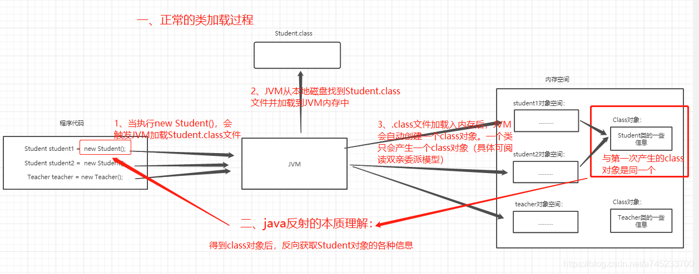

# 一、什么是反射

JAVA反射机制是在运行状态中，对于任意一个类，都能够知道这个类的所有属性和方法；对于任意一个对象，都能够调用它的任意一个方法和属性；这种动态获取的信息以及动态调用对象的方法的功能称为java语言的反射机制。

要想解剖一个类,必须先要获取到该类的字节码文件对象。而解剖使用的就是Class类中的方法。所以先要获取到每一个字节码文件对应的Class类型的对象。

反射就是把java类中的各种成分映射成一个个的Java对象，

例如：一个类有：成员变量、方法、构造方法、包等等信息，利用反射技术可以对一个类进行解剖，把个个组成部分映射成一个个对象。

> **Class对象的理解：**
>
> 1. Class类也是类的一种，和class关键字是不一样的；
> 2. 程序经过javac.exe命令以后，会生成一个或多个字节码文件（.class结尾），接着我们使用java.exe命令对某个字节码文件进行解释运行。相当于将某个字节码文件加载到内存中。此过程成为类的加载。加载到内存中的类，我们称为运行时类，此运行时类，就作为Class的一个实例，换句话来说，Class的实例就对应着一个运行时类；
> 3. 每个通过关键字class表示的类，在内存中有且只有一个与之对应的Class对象来描述其类型信息，无论创建多少个实例对象，其依据的都是用一个Class对象；
> 4. Class类只存私有构造函数，因此对应Class对象只能有JVM创建和加载；
> 5. Class类的对象作用是运行时提供或获得某个对象的类型信息，这点对于反射技术很重要。
>
> **Class实例可以是哪些结构的说明**
>
> 1. class：外部类，成员（成员内部类，静态内部类），局部内部类，匿名内部类；
> 2. interface：接口；
> 3. []：数组；
> 4. enum：枚举；
> 5. annotation：注解@annotation；
> 6. primitive type：基本的数据类型；
> 7. void

# 二、反射的原理



# 三、反射的优缺点

## 1、优点

在运行时获得类的各种内容，进行反编译，对于Java这种先编译再运行的语言，能够让我们很方便的创建灵活的代码，这些代码可以在运行时装配，无需在组件之间进行源代码的链接，更加容易实现面向对象。

## 2、缺点

1）反射会消耗一定的系统资源，因此，如果不需要动态地创建一个对象，那么就不需要用反射；

2）反射调用方法时可以忽略权限检查，因此可能会破坏封装性而导致安全问题。

# 四、反射的用途

1. 反编译：class-->.java
2. 通过反射机制访问**java**对象的属性，方法，构造方法等；
3. 反射最重要的用途就是开发各种通用框架。比如很多框架（Spring）都是配置化的（比如通过XML文件配置Bean），为了保证框架的通用性，他们可能需要根据配置文件加载不同的类或者对象，调用不同的方法，这个时候就必须使用到反射了，运行时动态加载需要的加载的对象。

# 五、反射的基本使用

## 1、获得Class实例

```java
//第一种方式获取Class对象  
Student stu1 = new Student();//这一new 产生一个Student对象，一个Class对象。
Class clazz1 = stu1.getClass();//获取Class对象
System.out.println(clazz1.getName());

//第二种方式获取Class对象
Class clazz2 = Student.class;
System.out.println(clazz2.getName());

//第三种方式获取Class对象
try {
    Class clazz3 = Class.forName("fanshe.Student");
    //注意此字符串必须是真实路径，就是带包名的类路径，包名.类名
    System.out.println(clazz3.getName());
} catch (ClassNotFoundException e) {
    e.printStackTrace();
}
```

注意：在运行期间，一个类，只有一个Class对象产生。 

三种方式常用第三种，第一种对象都有了还要反射干什么。第二种需要导入类的包，依赖太强，不导包就抛编译错误。一般都第三种，一个字符串可以传入也可写在配置文件中等多种方法。

## 2、获取构造方法

### 1）获取所有的构造函数

```java
//所有"公有的"构造方法：
public Constructor[] getConstructors()：
    
//获取所有的构造方法(包括私有、受保护、默认、公有)：
public Constructor[] getDeclaredConstructors()：
```

###  2）获取指定的构造函数

```java
//获取单个的"公有的"构造方法:
public Constructor getConstructor(Class... parameterTypes):

//获取"某个构造方法"可以是私有的，或受保护、默认、公有：
public Constructor getDeclaredConstructor(Class... parameterTypes):

//调用构造方法：
Constructor-->newInstance(Object... initargs)
```

### 3）案例

```java
Class clazz = Person.class;
Constructor declaredConstructor = clazz.getDeclaredConstructor(String.class);
declaredConstructor.setAccessible(true);
Object li = declaredConstructor.newInstance("李小龙");
System.out.println(li);
```

（可以使用`clazz.newInstance()`创建person实例，但是必须拥有无参构造函数）

## 3、获取成员变量

### 1）获取所有成员变量

```java
//获取所有的"公有字段"：
Field[] getFields():

//获取所有字段，包括：私有、受保护、默认、公有：
Field[] getDeclaredFields():
```

### 2）获取指定的成员变量

```java
//获取某个"公有的"字段：
public Field getField(String fieldName):

//获取某个字段(可以是私有的)：
public Field getDeclaredField(String fieldName):
```

### 3）设置字段的值

```java
public void set(Object obj,Object value):
//参数说明：
//obj:要设置的字段所在的对象；
//value:要为字段设置的值。
```

### 4）案例

```java
Class clazz = Person.class;
Field name = clazz.getDeclaredField("name");
name.setAccessible(true);
Person person = (Person)clazz.newInstance();
name.set(person,"张三");
System.out.println(person);

//【运行结果】
// Person{name='张三', age=0, id=0}
```

## 4、获取成员方法

### 1）获取所有成员方法

```java
//获取所有"公有方法"；（包含了父类的方法也包含Object类）
public Method[] getMethods():

//获取当前Class实例所有的成员方法，包括私有的(不包括继承的)
public Method[] getDeclaredMethods():
```

### 2）获取指定成员方法

```java
public Method getMethod(String name,Class<?>... parameterTypes):
//参数说明：
//name : 方法名
//Class ... : 形参的Class类型对象

public Method getDeclaredMethod(String name,Class<?>... parameterTypes)
```

### 3）调用方法

```java
public Object invoke(Object obj,Object... args):

//参数说明：
//obj : 要调用方法的对象；（如果是静态方法，可以直接填“null”）
//args:调用方式时所传递的实参。
```

### 4）案例

```java
Class clazz = Person.class;
Method showMethod = clazz.getDeclaredMethod("show", String.class);
showMethod.setAccessible(true);
Object o = clazz.newInstance();
showMethod.invoke(o,"Chinese");

//【运行结果】
// 我的国籍是Chinese
```

## 5、获取配置文件的内容

Student类：

```java
public class Student {
	public void show(){
		System.out.println("is show()");
	}
}
```


配置文件以txt文件为例子：

```properties
className = cn.fanshe.Student
methodName = show
```

测试类：

```java
import java.io.FileNotFoundException;
import java.io.FileReader;
import java.io.IOException;
import java.lang.reflect.Method;
import java.util.Properties;

	/*
	* 我们利用反射和配置文件，可以使：应用程序更新时，对源码无需进行任何修改
 	* 我们只需要将新类发送给客户端，并修改配置文件即可
   */
public class Demo {
   public static void main(String[] args) throws Exception {
        //通过反射获取Class对象
        Class stuClass = Class.forName(getValue("className"));//"cn.fanshe.Student"
        //2获取show()方法
        Method m = stuClass.getMethod(getValue("methodName"));//show
        //3.调用show()方法
        m.invoke(stuClass.getConstructor().newInstance());
   }

   //此方法接收一个key，在配置文件中获取相应的value
    public static String getValue(String key) throws IOException{
   		Properties pro = new Properties();//获取配置文件的对象
   		FileReader in = new FileReader("pro.txt");//获取输入流
   		pro.load(in);//将流加载到配置文件对象中
   		in.close();
   		return pro.getProperty(key);//返回根据key获取的value值
   }
}
//【控制台输出】
//is show()
```

需求：当我们升级这个系统时，不要Student类，而需要新写一个Student2的类时，这时只需要更改pro.txt的文件内容就可以了。代码就一点不用改动。