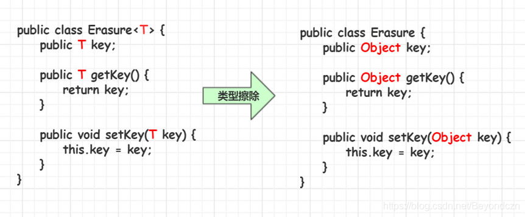
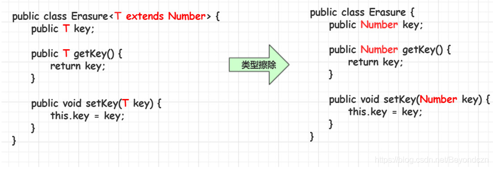
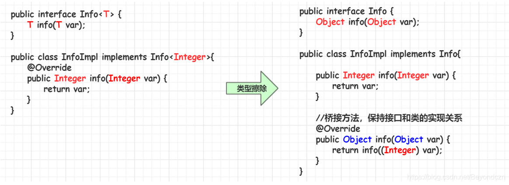

# 一、什么是泛型

## 1、背景

JAVA推出泛型以前，程序员可以构建一个元素类型为Object的集合，该集合能够存储任意的数据类型对象，而在使用该集合的过程中，需要程序员明确知道存储每个元素的数据类型，否则很容易引发ClassCastException异常。

## 2、概念

Java泛型（generics）是JDK5中引入的一个新特性，泛型提供了编译时类型安全监测机制，该机制允许我们在编译时检测到非法的类型数据结构。泛型的本质就是参数化类型，也就是所操作的数据类型被指定为一个参数。

## 3、好处

- 类型安全（避免编译时无异常，运行时出行ClassCastException）；
- 消除了强制类型的转换

---


# 二、泛型类

## 1、定义语法

```java
class 类名称 <泛型标识,泛型标识,……>{
    private 泛型标识 变量名;
    ……
}
```

## 2、常用的泛型标识符

- E - Element (在集合中使用，因为集合中存放的是元素)
- T - Type（表示Java 类，包括基本的类和我们自定义的类）
- K - Key（表示键，比如Map中的key）
- V - Value（表示值）
- N - Number（表示数值类型）
- ？ - （表示不确定的java类型）
- S、U、V - 2nd、3rd、4th types

## 3、使用语法

```java
类名<具体的数据类型> 对象名 = new 类名<具体的数据类型>();
//Java1.7以后，后面的<>中的具体的数据类型可以省略不写:
类名<具体的数据类型> 对象名 = new 类名<>(); 菱形语法
```

## 4、案例

```java
class Generic<T> {
    private T key;

    public Generic(T key) {
        this.key = key;
    }

    public T getKey() {
        return key;
    }

    public void setKey(T key) {
        this.key = key;
    }
}

public class Main {
    public static void main(String[] args) {
        Generic<String> generic1 = new Generic<>("abc");
        String key = generic1.getKey();
        System.out.println(key);
        Generic<Integer> generic2 = new Generic<>(123);
        Integer key1 = generic2.getKey();
        System.out.println(key1);
    }
}
```

## 5、注意事项

- 泛型类，如果没有指定具体的数据类型，此时，操作类型是Object

- 泛型的类型参数只能是类类型，不能是基本数据类型（因为基本数据类型不是Object的子类）

- 泛型类型在逻辑上可以看成是多个不同的类型，但实际上都是相同类型

  ```java
  //上面案例中
  System.out.println(generic1.getClass() == generic2.getClass()); //true
  ```

## 6、从泛型类派生子类

- 子类也是泛型类，子类和父类的泛型类型要一致：`class ChildGeneric<T> extends Generic<T>`

  ```java
  //父类
  public class Parent<E> {
      private E value;
      public E getValue() {
          return value;
      }
      public void setValue(E value) {
          this.value = value;
      }
  }
  
  /**
   * 泛型类派生子类，子类也是泛型类，那么子类的泛型标识要和父类一致。
   * @param <T>
   */
  public class ChildFirst<T> extends Parent<T> {
      @Override
      public T getValue() {
          return super.getValue();
      }
  }
  ```

- 子类不是泛型类，父类要明确泛型的数据类型：`class ChildGeneric extends Generic<String>`

  ```java
  /**
   * 泛型类派生子类，如果子类不是泛型类，那么父类要明确数据类型
   */
  public class ChildSecond extends Parent<Integer> {
      @Override
      public Integer getValue() {
          return super.getValue();
      }
      @Override
      public void setValue(Integer value) {
          super.setValue(value);
      }
  }
  ```

# 三、泛型接口

## 1、泛型接口的定义语法：

```java
interface 接口名称 <泛型标识，泛型标识，…> {
	泛型标识 方法名(); 
	.....
}
```

## 2、泛型接口的使用

- 实现类也是泛型类，实现类和接口的泛型类型要一致

  ```java
  /**
   * 泛型接口
   * @param <T>
   */
  public interface Generator<T> {
      T getKey();
  }
  /**
   * 泛型接口的实现类，是一个泛型类，
   * 那么要保证实现接口的泛型类泛型标识包含泛型接口的泛型标识
   * @param <T>
   * @param <E>
   */
  public class Pair<T,E> implements Generator<T> {
  
      private T key;
      private E value;
  
      public Pair(T key, E value) {
          this.key = key;
          this.value = value;
      }
  
      @Override
      public T getKey() {
          return key;
      }
  
      public E getValue() {
          return value;
      }
  }
  ```

- 实现类不是泛型类，接口要明确数据类型

  ```java
  /**
   * 实现泛型接口的类，不是泛型类，需要明确实现泛型接口的数据类型。
   */
  public class Apple implements Generator<String> {
      @Override
      public String getKey() {
          return "hello generic";
      }
  }
  ```

# 四、泛型方法

> 泛型类&泛型方法
>
> 泛型类：在实例化类的时候指明泛型的具体类型；
>
> 泛型方法，在调用方法的时候指明泛型的具体类型。
>
> （之前的实例代码中的方法都属于泛型类的普通方法而已，并不是泛型方法）

## 1、语法

```java
修饰符 <T，E, ...> 返回值类型 方法名(形参列表) { 
    方法体... 
}
```

- 修饰符与返回值中间\<T>非常重要，可以理解为声明此方法为泛型方法。
- 只有声明了\<T>的方法才是泛型方法，泛型类中的使用了泛型的成员方法并不是泛型方法。
- \<T>表明该方法将使用泛型类型T，此时才可以在方法中使用泛型类型T。
- 与泛型类的定义一样，此处T可以随便写为任意标识，常见的如T、E、K、V等形式的参数常用于表示泛型。

## 2、案例

```java
class Generic<T> {
    private T key;

    public T getKey() {				//普通方法
        return key;
    }

    public <T> void test(T t){		//泛型方法（此处的T和泛型类中的T无关系）
        System.out.println(t);
    }
}

public class Main {
    public static void main(String[] args) {
        Generic<String> generic1 = new Generic<>();
        generic1.test("abc");		//abc
    }
}
```

> 注意：
>
> 泛型类中的普通方法如上面代码中getKey()不能定义为static方法，而泛型方法可以定义为static方法；
>
> 因为：泛型类需要在创建对象时指定类型，而静态方法是通过类名直接调用的，此时成员方法类型未被指定，会报错。泛型方法能使方法独立于类而产生变化，如果static方法要使用泛型能力，就必须使其成为泛型方法。

## 3、泛型方法与可变参数

```java
public <E> void print(E... e){
	for (E e1 : e) {
		System.out.println(e);
	}
}
```

# 五、类型通配符

## 1、什么是类型通配符

- 类型通配符一般是使用"?"代替具体的类型实参。
- 所以，类型通配符是类型实参，而不是类型形参。

```java
class Box<E>{
    private E first;

    public E getFirst() {
        return first;
    }

    public void setFirst(E first) {
        this.first = first;
    }

    @Override
    public String toString() {
        return "Box{" +
                "first=" + first +
                '}';
    }
}

public class Main {
    public static void showBox(Box<Number> box){
        Number first = box.getFirst();
        System.out.println(first);
    }

    public static void main(String[] args) {
        Box<Number> box1 = new Box<>();
        box1.setFirst(100);
        showBox(box1);
        System.out.println("--------------");
        Box<Integer> box2 = new Box<>();
        box2.setFirst(200);
        showBox(box2);		//此处编译不能通过
    }
}
```

为了解决以上问题，我们需要使用类型通配符。

```java
public class Main {
    public static void showBox(Box<? extends Number> box){	//在这里使用类型通配符
        Number first = box.getFirst();
        System.out.println(first);
    }

    public static void main(String[] args) {
        Box<Number> box1 = new Box<>();
        box1.setFirst(100);
        showBox(box1);
        System.out.println("--------------");
        Box<Integer> box2 = new Box<>();
        box2.setFirst(200);
        showBox(box2);

    }
}
```

## 2、类型通配符的上限

`类/接口<? extends 实参类型>`

要求该泛型的类型，只能是实参类型，或实参类型的子类类型。

## 3、类型通配符的下限

`类/接口<? super 实参类型>`

要求该泛型的类型，只能是实参类型，或实参类型的父类类型。

# 六、类型擦除

## 1、概念

泛型是Java 1.5版本才引进的概念，在这之前是没有泛型的，但是泛型代码能够很好地和之前版本的代码兼容。那是因为，泛型信息只存在于代码编译阶段，在进入JVM之前，与泛型相关的信息会被擦除掉，我们称之为–类型擦除。

## 2、分类

- **无限制类型擦除**



- **有限制类型擦除**



- **擦除方法中类型定义的参数**


- **桥接方法**



（上述结论可以通过反射证明）

# 七、泛型数组

## 泛型数组的创建

1）可以声明带泛型的数组引用，但是不能直接创建带泛型的数组对象

```java
ArrayList<String>[] lists = new ArrayList<>[5];		//编译不能通过
ArrayList<String>[] lists;							//编译可通过
```

可替换为：

```java
ArrayList[] list = new ArrayList[5];
ArrayList<String>[] listArr = list;
或者
ArrayList<String>[] listArr = new ArrayList[5];
```

2）还可以通过java.lang.reflect.Array的newInstance(Class,int)创建T[]数组

```java
class Fruit<T>{
    private T[] arr;

    public Fruit(Class<T> clz,int len){
        arr = (T[]) Array.newInstance(clz,len);
    }

    public void set(int index,T value){
        arr[index] = value;
    }

    public T get(int index){
        return arr[index];
    }

    public T[] getArr(){
        return this.arr;
    }

}

public class Main {

    public static void main(String[] args) {
        Fruit<String> fruits = new Fruit<>(String.class,3);
        fruits.set(0,"苹果");
        fruits.set(1,"梨子");
        fruits.set(2,"西瓜");
        System.out.println(Arrays.toString(fruits.getArr()));
    }
}
```

