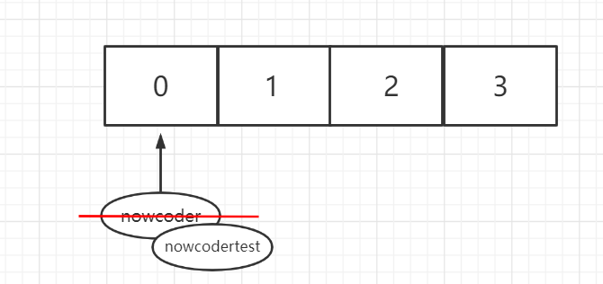
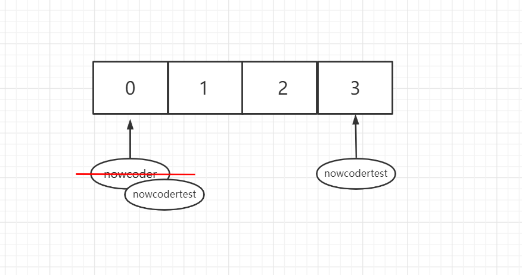
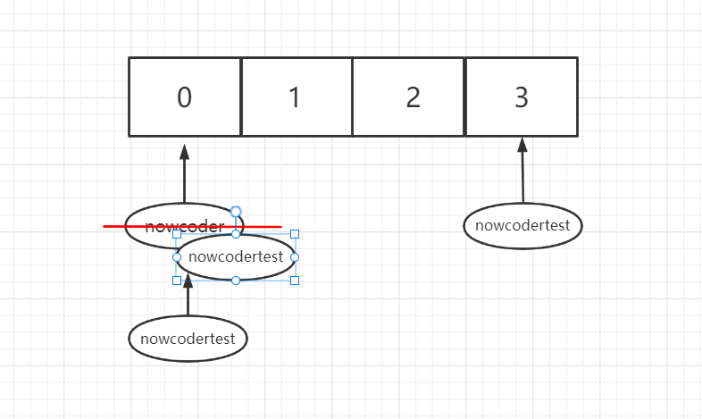

# 一、代码题

## 1、hashcode && equals

1）如下Java代码会输出什么？

```java
import java.util.HashSet;
import java.util.Set;
public class HashSetTest {
    public static final class Person {
        private String name = "";
        public Person(String n) {
            setName(n);
        }
        public String getName() {
            return name;
        }
        public void setName(String name) {
            this.name = (name == null) ? "" : name;
        }
        @Override
        public int hashCode() {
            return name.length();
        }
        @Override
        public boolean equals(Object obj) {
            if (!(obj instanceof Person)) {
                return false;
            }
            if (obj == this) {
                return true;
            }
            return this.name.equals(((Person) obj).name);
        }
    }
    public static void main(String[] args) {
        Set<Person> persons = new HashSet<Person>();
        Person person = new Person("nowcoder");
        persons.add(person);
        person.setName("nowcodertest");
        boolean isContains = persons.contains(person);
        int size = persons.size();
        System.out.println("isContains=" + isContains);
        System.out.println("size=" + size);
    }
}
```

A.isContains=false	size=1

B.isContains=true	size=1

C.isContains=false	size=2

D.isContains=true	size=2

> 正确答案: A  你的答案: B (错误)
>
> 分析：
>
> 为了更好的理解hashcode和equals方法，我们不妨分析下列代码：
>
> ```java
> class HashSetTest {
>  public static final class Person {
>      private String name = "";
> 
>      public Person(String n) {
>          setName(n);
>      }
> 
>      public String getName() {
>          return name;
>      }
> 
>      public void setName(String name) {
>          this.name = (name == null) ? "" : name;
>      }
> 
>      @Override
>      public int hashCode() {
>          return name.length();
>      }
> 
>      @Override
>      public boolean equals(Object obj) {
>          if (!(obj instanceof Person)) {
>              return false;
>          }
>          if (obj == this) {
>              return true;
>          }
>          return this.name.equals(((Person) obj).name);
>      }
> 
>      @Override
>      public String toString() {
>          return "Person{" +
>                  "name='" + name + '\'' +
>                  '}';
>      }
>  }
> 
>  public static void main(String[] args) {
>      Set<Person> persons = new HashSet<Person>();
>      Person person = new Person("nowcoder");
>      persons.add(person);
>      person.setName("nowcodertest");
>      boolean isContains = persons.contains(person);
>      persons.add(new Person("nowcodertest"));
>      persons.add(new Person("nowcoder"));
>      int size = persons.size();
>      System.out.println("isContains=" + isContains);     //为false
>      System.out.println("size=" + size);                 //结果为：3
>      System.out.println(persons);                        //[Person{name='nowcodertest'}, Person{name='nowcoder'}, Person{name='nowcodertest'}]
>  }
> }
> ```
>
> 步骤一：将实例Person("nowcoder")添加到persons中（我们假设在桶为0的位置），之后我们将桶为0的Person("nowcoder")修改为Person("nowcodertest")。
>
> 
>
> 步骤二：我们准备添加Person("nowcodertest")，通过计算hashcode将Person("nowcodertest")放在了桶3的位置（“nowcodertest”和“nowcode”的hashcode不同）
>
> 
>
> 步骤三：再次添加Person("nowcoder")，通过计算hashcode应该存在在桶0的位置（与步骤一相同），桶0已有元素，通过equals方法Person("nowcoder")与Person("nowcodertest")并不是同一个对象，会以链表的形式存放。以类似的方法可以分析原题可以得到正确答案。
>
> 

