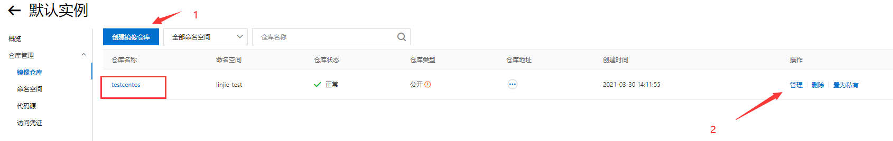
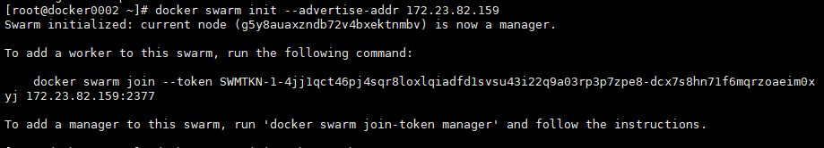
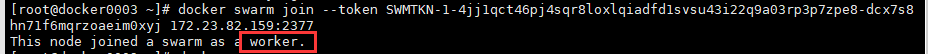
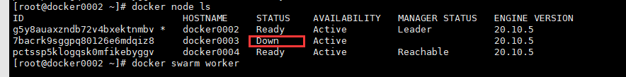

# 一、Docker

## 1.概述

### 1）简介

Docker 是一个开源的应用容器引擎，让开发者可以打包他们的应用以及依赖包到一个可移植的镜像中，然后发布到任何流行的 Linux或Windows机器上，也可以实现**虚拟化**。容器是完全使用**沙箱**机制，相互之间不会有任何接口。

一个完整的Docker有以下几个部分组成：

1. DockerClient客户端
2. Docker Daemon守护进程
3. Docker Image镜像
4. DockerContainer容器

### 2）优势


- **更高效的利用系统资源：**

由于容器不需要进行硬件虚拟以及运行完整操作系统等额外开销，Docker 对系统资源的利用率更高。无论是应用执行速度、内存损耗或者文件存储速度，都要比传统虚拟机技术更高效。因此，相比虚拟机技术，一个相同配置的主机，往往可以运行更多数量的应用。

- **更快速的启动时间：**

传统的虚拟机技术启动应用服务往往需要数分钟，而Docker 容器应用，由于直接运行于宿主内核，无需启动完整的操作系统，因此可以做到秒级、甚至毫秒级的启动时间。大大的节约了开发、测试、部署的时间。

- **一致的运行环境：**

开发过程中一个常见的问题是环境一致性问题。由于开发环境、测试环境、生产环境不一致，导致有些bug 并未在开发过程中被发现。而Docker 的镜像提供了除内核外完整的运行时环境，确保了应用运行环境一致性，从而不会再出现「这段代码在我机器上没问题啊」这类问题。

- **持续交付和部署：**

Docker是build once，run everywhere. 使用Docker 可以通过定制应用镜像来实现持续集成、持续交付、部署。开发人员可以通过Dockerfile 来进行镜像构建，并结合持续集成(Continuous Integration) 系统进行集成测试，而运维人员则可以直接在生产环境中快速部署该镜像，甚至结合持续部署(Continuous Delivery/Deployment) 系统进行自动部署。

- **更轻松的迁移：**

Docker 使用的分层存储以及镜像的技术，使得应用重复部分的复用更为容易，也使得应用的维护更新更加简单，基于基础镜像进一步扩展镜像也变得非常简单。此外，Docker 团队同各个开源项目团队一起维护了一大批高质量的官方镜像，既可以直接在生产环境使用，又可以作为基础进一步定制，大大的降低了应用服务的镜像制作成本。使用Dockerfile 使镜像构建透明化，不仅仅开发团队可以理解应用运行环境，也方便运维团队理解应用运行所需条件，帮助更好的生产环境中部署该镜像。


### 3）基本概念

- **镜像(Image)**

镜像，从认识上简单的来说，就是面向对象中的类，相当于一个模板。从本质上来说，镜像相当于一个文件系统。Docker 镜像是一个特殊的文件系统，除了提供容器运行时所需的程序、库、资源、配置等文件外，还包含了一些为运行时准备的一些配置参数（如匿名卷、环境变量、用户等）。镜像不包含任何动态数据，其内容在构建之后也不会被改变。

- **容器(Container)**

容器，从认识上来说，就是类创建的实例，就是依据镜像这个模板创建出来的实体。容器的实质是进程，但与直接在宿主执行的进程不同，容器进程运行于属于自己的独立的命名空间。因此容器可以拥有自己的root 文件系统、自己的网络配置、自己的进程空间，甚至自己的用户ID 空间。容器内的进程是运行在一个隔离的环境里，使用起来，就好像是在一个独立于宿主的系统下操作一样。这种特性使得容器封装的应用比直接在宿主运行更加安全。

- **仓库(Repository)**

仓库，从认识上来说，就好像软件包上传下载站，有各种软件的不同版本被上传供用户下载。镜像构建完成后，可以很容易的在当前宿主机上运行，但是，如果需要在其它服务器上使用这个镜像，我们就需要一个集中的存储、分发镜像的服务，Docker Registry 就是这样的服务。

- **分层存储**

因为镜像包含操作系统完整的root 文件系统，其体积往往是庞大的，因此在Docker设计时，就充分利用Union FS 的技术，将其设计为分层存储的架构。所以严格来说，镜像并非是像一个ISO 那样的打包文件，镜像只是一个虚拟的概念，其实际体现并非由一个文件组成，而是由一组文件系统组成，或者说，由多层文件系统联合组成。

## 2.安装Docker

### 1）环境准备

- Linux要求内核3.0以上
- CentOS 7

```shell
[root@iz2zeak7sgj6i7hrb2g862z ~]# uname -r
3.10.0-514.26.2.el7.x86_64	# 要求3.0以上
[root@iz2zeak7sgj6i7hrb2g862z ~]# cat /etc/os-release 
NAME="CentOS Linux"
VERSION="7 (Core)"
ID="centos"
ID_LIKE="rhel fedora"
VERSION_ID="7"
PRETTY_NAME="CentOS Linux 7 (Core)"
ANSI_COLOR="0;31"
CPE_NAME="cpe:/o:centos:centos:7"
HOME_URL="https://www.centos.org/"
BUG_REPORT_URL="https://bugs.centos.org/"

CENTOS_MANTISBT_PROJECT="CentOS-7"
CENTOS_MANTISBT_PROJECT_VERSION="7"
REDHAT_SUPPORT_PRODUCT="centos"
REDHAT_SUPPORT_PRODUCT_VERSION="7"
```

### 2）安装

```shell
#1.卸载旧版本
yum remove docker \
                  docker-client \
                  docker-client-latest \
                  docker-common \
                  docker-latest \
                  docker-latest-logrotate \
                  docker-logrotate \
                  docker-engine
#2.需要的安装包
yum install -y yum-utils

#3.设置镜像的仓库(默认是从国外的，不推荐)
yum-config-manager \
    --add-repo \
    https://download.docker.com/linux/centos/docker-ce.repo

#推荐使用国内的
yum-config-manager \
    --add-repo \
    https://mirrors.aliyun.com/docker-ce/linux/centos/docker-ce.repo
    
#更新yum软件包索引
yum makecache fast

#4.安装docker相关的 docker-ce 社区版 而ee是企业版
yum install docker-ce docker-ce-cli containerd.io # 这里我们使用社区版即可

#5.启动docker
systemctl start docker

#6. 使用docker version查看是否按照成功
docker version

#7. 测试
docker run hello-world
```

### 3）配置阿里云镜像加速

**登录阿里云找到容器服务**


**配置使用**

```shell
#1.创建一个目录
sudo mkdir -p /etc/docker

#2.编写配置文件
sudo tee /etc/docker/daemon.json <<-'EOF'
{
  "registry-mirrors": ["https://axdnppq7.mirror.aliyuncs.com"]
}
EOF

#3.重启服务
sudo systemctl daemon-reload
sudo systemctl restart docker
```


## 3.使用docker

### 1）容器的基本操作

#### a.启动一次操作容器

```shelll
docker run IMAGE_NAME [COMMAND] [ARG…]
```


#### b.启动交互式容器

```shell
docker run -it –name=自定义名称 IMAGE_NAME /bin/bash

#使用交互方式运行，进入容器查看内容
-i –interactive=true | false，默认是false		
-t –tty=true | false，默认是false
#给启动的容器自定义名称，方便后续的容器选择操作
–name 
-d					#后台方式运行
-it 				#使用交互方式运行，进入容器查看内容
-p 主机端口:容器端口   #指定容器的端口 -p 8080(宿主机):8080(容器)
-P(大写) 			   #随机指定端口

```


#### c.**查看容器**

```shell
#列出正在运行的容器
docker ps [-a] [-l]
#列出所有容器
-a all 
#列出最近的容器
-l latest 
```


#### d.查看指定容器

```shell
docker inspect name | id

#name指代具体的容器名称
#id则是容器的唯一id标识
#inspect命令可以详细的展示出容器的具体信息。
```


#### e.重新启动停止的容器

```shell
docker start [-i] 容器名

#实际使用时，没必要每次都重新启动一个新的容器，我们可以重新启动之前创建的容器，现实情况也需要我们这样使用。

docker restart 容器id	#重启容器
docker stop 容器id	#停止当前正在运行的容器
docker kill 容器id	#强制停止当前容器
```


#### g.删除停止的容器

```shell
docker rm name | id

#移除所有容器
docker rm -f $(docker ps -aq)
```


### 2）守护式容器

交互式容器在运行完命令退出后即停止，而实际中我们常常需要能够长时间运行，即使退出也能后台运行的容器，而守护式容器具备这一功能。守护式容器具有：

1. 能够长期运行；
2. 没有交互式会话；
3. 适合于运行应用程序和服务。


#### a.**以守护形式运行容器**

我们执行完需要的操作退出容器时，不要使用*exit*退出，可以利用*Ctrl+P+Q*代替，以守护式形式推出容器。


#### b.附加到运行中的容器

```shell
docker attach name | id
```


#### c.启动守护式容器（后台运行）

```shell
docker run -d IMAGE_NAME
```


#### d.查看容器日志

```shell
docker logs [-f] [-t] [–tail] IMAGE_NAME

# -f –follows=true | false，默认是false，显示更新
# -t –timestamps=true | false，默认是false，显示时间戳
# –tail=“all” | 行数，显示最新行数的日志
```


#### e.查看容器内进程

```shell
docker top IMAGE_NAME
```


#### f.运行中容器启动新进程

```shell
docker exec [-d] [-i] [-t] IMAGE_NAME [COMMAND] [ARG…]
```


#### g.停止守护式容器

```shell
#发送信号停止容器
docker stop 容器名

#强制停止
docker kill 容器名
```

### 3）镜像操作

#### a.列出镜像

```shell
docker images [OPTIONS] [REPOSITORY]
#显示所有镜像
-a，–all=false
#显示时过滤条件
-f，–filter=[]
#指定不使用截断的形式显示数据
–no-trunc=false
#只显示镜像的唯一id
-q，–quiet=false
```


#### b.查看镜像

```she
docker inspect [OPTIONS] CONTAINER|IMAGE [CONTAINER|IMAGE]
```


#### c.删除镜像

```shell
docker rmi [OPTIONS] IMAGE [IMAGE]
#强制删除镜像
-f，–force=false
#保留未打标签的父镜像
–no-prune=false
```


#### d.查找镜像

```shell
docker search [OPTIONS] TEAM
#仅显示自动化构建的镜像
–automated=false
#不以截断的方式输出
–no-trunc=false
#添加过滤条件
–filter
```


### 4）构建镜像

#### a.使用commit命令构建镜像

```shell
docker commit [OPTIONS] CONTAINER [REPOSITORY[:TAG]]
#参数：
#指定镜像的作者信息
-a，–author=“”
#提交信息
-m，–message=“”
#commit时是否暂停容器
-p，–pause=true
```


#### b.使用Dockerfile文件构建镜像

（这里使用阿里云容器镜像服务演示）

##### （1）进入阿里云容器镜像服务


##### （2）创建一个镜像仓库




##### （3）根据提示操作即可


# 二、Docker Compose

## 1.Docker Compose概述

- 前面我们使用 Docker 的时候，定义 Dockerfile 文件，然后使用 docker build、docker run 等命令操作容器。然而微服务架构的应用系统一般包含若干个微服务，每个微服务一般都会部署多个实例，如果每个微服务都要手动启停，那么效率之低，维护量之大可想而知
- **使用 Docker Compose 可以轻松、高效的管理容器，它是一个用于定义和运行多容器 Docker 的应用程序工具**


## 2.安装Docker Compose

官方：

```shell
sudo curl -L https://github.com/docker/compose/releases/download/1.21.2/docker-compose-$(uname -s)-$(uname -m) -o /usr/local/bin/docker-compose

#添加执行权限
sudo chmod +x /usr/local/bin/docker-compose
```

下载太慢，可以用以下镜像下载：

```shell
curl -L https://get.daocloud.io/docker/compose/releases/download/1.25.5/docker-compose-`uname -s`-`uname -m` > /usr/local/bin/docker-compose

#添加执行权限
sudo chmod +x /usr/local/bin/docker-compose
```

查看安装是否成功

```undefined
docker-compose version
```


## 3.快速体验

官网地址：https://docs.docker.com/compose/gettingstarted/

### 步骤一（设定）

#### 1）为项目创建目录

```shell
mkdir composetest
cd composetest
```

#### 2）在项目目录中创建一个名为`app.py`的文件，并将其粘贴到：

```shell
import time

import redis
from flask import Flask

app = Flask(__name__)
cache = redis.Redis(host='redis', port=6379)

def get_hit_count():
    retries = 5
    while True:
        try:
            return cache.incr('hits')
        except redis.exceptions.ConnectionError as exc:
            if retries == 0:
                raise exc
            retries -= 1
            time.sleep(0.5)

@app.route('/')
def hello():
    count = get_hit_count()
    return 'Hello World! I have been seen {} times.\n'.format(count)
```


#### 3）在项目目录中创建另一个名为的文件`requirements.txt`，并将其粘贴到

```shell
flask
redis
```


### 步骤二（创建Dockerfile文件）

#### 4）创建一个名为的文件`Dockerfile`并粘贴以下内容：

```shell
FROM python:3.7-alpine
WORKDIR /code
ENV FLASK_APP=app.py
ENV FLASK_RUN_HOST=0.0.0.0
RUN apk add --no-cache gcc musl-dev linux-headers
COPY requirements.txt requirements.txt
RUN pip install -r requirements.txt
EXPOSE 5000
COPY . .
CMD ["flask", "run"]
```


### 步骤三（定义服务）

#### 5）在项目目录中创建一个名为`docker-compose.yml`的文件，然后粘贴以下内容

```shell
version: "3.9"
services:
  web:
    build: .
    ports:
      - "5000:5000"
  redis:
    image: "redis:alpine"
```


### 步骤四（启动）

#### 6）在项目目录中，运行来启动应用程序`docker-compose up`

```shell
docker-compose up
```

#### 7）测试


一站式个人博客：https://docs.docker.com/compose/wordpress/


## 4.工程、服务、容器

- Docker Compose将所有管理的容器分为三层，分别是工程、服务、容器。
- Docker Compose运行目录下的所有文件（docker-compose.yml）组成一个工程，一个工程包含多个服务，每个服务中定义了容器运行的镜像、参数、依赖，一个服务可以包括多个容器实例。


## 5.Docker Compose常用命令与配置

### 1）ps：列出该目录下工程状态

```undefined
docker-compose ps
```


### 2）**logs**：查看服务日志输出

```undefined
docker-compose logs
```


### 3）**build**：构建或者重新构建服务

```shell
docker-compose build
```


### 4）**start**：启动指定服务已存在的容器

```shell
docker-compose start eureka
```


### 5）**stop**：停止已运行的服务的容器

```shell
docker-compose stop eureka
```


### 6）**rm**：删除指定服务的容器

```undefined
docker-compose rm eureka
```


### 7）up：构建、启动容器

```undefined
docker-compose up
```


### 8）**kill**：通过发送 SIGKILL 信号来停止指定服务的容器

```bash
docker-compose kill eureka
```


### 9）**pull**：下载服务镜像

- **scale**：设置指定服务运气容器的个数，以 service=num 形式指定

```shell
docker-compose scale user=3 movie=3
```


### 10）**run**：在一个服务上执行一个命令

```undefined
docker-compose run web bash
```


## 6.docker-compose.yml 属性

```shell
version: "3.9"
services:
  web:
    build: .
    ports:
      - "5000:5000"
  redis:
    image: "redis:alpine"
```


- **version**：指定 docker-compose.yml 文件的写法格式
- **services**：多个容器集合
- **build**：配置构建时，Compose 会利用它自动构建镜像，该值可以是一个路径，也可以是一个对象，用于指定 Dockerfile 参数

```undefined
build: ./dir
---------------
build:
    context: ./dir
    dockerfile: Dockerfile
    args:
        buildno: 1
```

- **command**：覆盖容器启动后默认执行的命令

```bash
command: bundle exec thin -p 3000
----------------------------------
command: [bundle,exec,thin,-p,3000]
```

- **dns**：配置 dns 服务器，可以是一个值或列表

```css
dns: 8.8.8.8
------------
dns:
    - 8.8.8.8
    - 9.9.9.9
```

- **dns_search**：配置 DNS 搜索域，可以是一个值或列表

```css
dns_search: example.com
------------------------
dns_search:
    - dc1.example.com
    - dc2.example.com
```

- **environment**：环境变量配置，可以用数组或字典两种方式

```bash
environment:
    RACK_ENV: development
    SHOW: 'ture'
-------------------------
environment:
    - RACK_ENV=development
    - SHOW=ture
```

- **env_file**：从文件中获取环境变量，可以指定一个文件路径或路径列表，其优先级低于 environment 指定的环境变量

```undefined
env_file: .env
---------------
env_file:
    - ./common.env
```

- **expose**：暴露端口，只将端口暴露给连接的服务，而不暴露给主机

```bash
expose:
    - "3000"
    - "8000"
```

- **image**：指定服务所使用的镜像

```undefined
image: java
```

- **network_mode**：设置网络模式

```bash
network_mode: "bridge"
network_mode: "host"
network_mode: "none"
network_mode: "service:[service name]"
network_mode: "container:[container name/id]"
```

- **ports**：对外暴露的端口定义，和 expose 对应

```objectivec
ports:   # 暴露端口信息  - "宿主机端口:容器暴露端口"
- "8763:8763"
- "8763:8763"
```

- **links**：将指定容器连接到当前连接，可以设置别名，避免ip方式导致的容器重启动态改变的无法连接情况

```bash
links:    # 指定服务名称:别名 
    - docker-compose-eureka-server:compose-eureka
```

- **volumes**：卷挂载路径

```csharp
volumes:
  - /lib
  - /var
```

- **logs**：日志输出信息

```undefined
--no-color          单色输出，不显示其他颜.
-f, --follow        跟踪日志输出，就是可以实时查看日志
-t, --timestamps    显示时间戳
--tail              从日志的结尾显示，--tail=200
```


## 7.项目实战

### 1）创建springboot项目

### 2）编写application.properties依赖

```properties
# 应用名称
spring.application.name=test-compose
# 应用服务 WEB 访问端口
server.port=8080

spring.redis.host=redis
```


### 3）创建testController

```java
@RestController
public class testController {

    @Autowired
    private StringRedisTemplate redisTemplate;

    @RequestMapping("/")
    public String test(){
        Long views = redisTemplate.opsForValue().increment("views");
        return "本网站被访问的次数"+views;
    }

}
```


### 4）在根目录下创建`Dockerfile`文件

```dockerfile
FROM java:8

COPY *.jar /app.jar

CMD ["--server.port=8080"]

EXPOSE 8080

ENTRYPOINT ["java","-jar","/app.jar"]
```


### 5）在根目录下创建`docker-compose.yml`文件

```yml
version: '3.7'
services:
  linapp:
    build: .
    image: linapp
    depends_on:
      - redis
    ports:
    - "8080:8080"
  redis:
    image: "redis:alpine"
```


### 6）移动文件到服务器上


### 7）使用`docker-compose`命令启动


### 8）结果


# 三、Docker Swarm

## 1.Swarm 认识

- Swarm 在 Docker 1.12 版本之前属于一个独立的项目，在 Docker 1.12 版本发布之后，该项目合并到了 Docker 中，成为 Docker 的一个子命令。目前，Swarm 是 Docker 社区提供的唯一一个原生支持 Docker 集群管理的工具。它可以把多个 Docker 主机组成的系统转换为单一的虚拟 Docker 主机，使得容器可以组成跨主机的子网网络。
- Swarm 是目前 Docker 官方唯一指定（绑定）的集群管理工具。Docker 1.12 内嵌了 swarm mode 集群管理模式。


## 2.工作原理


一个Swarm是由安装了Docker Engine的物理机或者虚拟机节点组成，这些节点上的Docker Engine都采用Swarm模式运行。

Swarm集群中的节点分为两类：manager和worker。

Manager节点用来处理集群管理任务：

- 维护集群状态
- 调度service
- 提供swarm模式[HTTP API](https://docs.docker.com/engine/api/) 端点

Worker节点：

Worker节点也是Docker Engine的实例，目的是用来运行Container。Worker节点不会像Manager节点那样提供集群的管理、任务调度和API。


## 3.集群体验

### 1）购买服务器

- **创建实例**

****

- **选择服务器**


- **确认订单**

### 2）搭建环境

- **使用xshell远程连接**

- **下载docker**

  （安装技巧）

  

### 3）搭建集群

#### a.查看本机ip

```shell
ip addr
```


（主机：docker02）

#### b.初始化节点

```shell
docker swarm init
```

（主机：docker02）

（这里使用私网演示）


#### c.加入节点

加入一个manager节点

```shell
docker swarm join-token manager
```

（主机：docker02）

（主机：docker04）

加入一个worker节点

```shell
docker swarm join-token worker
```

（主机：docker02）

（主机：docker03）


#### d.查看节点（manager层才能）

```shell
docker node ls
```


#### e.离开服务

```shell
docker swarm leave
```

(主机：docker03)


（主机：docker02）


#### f.创建服务

- 下载nginx来测试

```shell
docker service create -p 8080:80 --name my-nginx nginx
```


- 启动nginx服务

```shell
docker service ps my-nginx
```


- 查看已启动的服务

```shell
docker service ls
```

- 查看my-nginx服务的详细信息

```shell
docker inspect my-nginx
```


- 启动10个my-nginx副本

```shell
docker service update --replicas 10 my-nginx
```

（副本将较均匀的分配到3台服务器中）