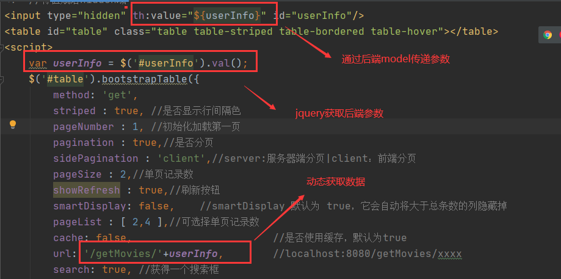

# 一、bootstrap：

## 1.bootstrap-table实现分表：

效果：


源码：

```html
<!DOCTYPE html>
<html lang="en" xmlns:th="http://www.thymeleaf.org">
<head>
    <meta charset="UTF-8">
    <meta name="viewport" content="width=device-width, initial-scale=1.0">
    <title>Document</title>

    <link rel="stylesheet" href="https://stackpath.bootstrapcdn.com/bootstrap/4.2.1/css/bootstrap.min.css">
    <link rel="stylesheet" href="https://unpkg.com/bootstrap-table@1.15.4/dist/bootstrap-table.min.css">
    <script src="http://apps.bdimg.com/libs/jquery/2.1.4/jquery.min.js"></script>
    <script src="https://cdnjs.cloudflare.com/ajax/libs/popper.js/1.14.6/umd/popper.min.js"></script>
    <script src="https://stackpath.bootstrapcdn.com/bootstrap/4.2.1/js/bootstrap.min.js"></script>
    <script src="https://unpkg.com/bootstrap-table@1.15.4/dist/bootstrap-table.min.js"></script>

</head>
<body>
<!--//将值赋给hidden域-->
<input type="hidden" th:value="${userInfo}" id="userInfo"/>
<table id="table" class="table table-striped table-bordered table-hover"></table>
<script>
    var userInfo = $('#userInfo').val();
    $('#table').bootstrapTable({
        method: 'get',
        striped : true, //是否显示行间隔色
        pageNumber : 1, //初始化加载第一页
        pagination : true,//是否分页
        sidePagination : 'client',//server:服务器端分页|client：前端分页
        pageSize : 2,//单页记录数
        showRefresh : true,//刷新按钮
        smartDisplay: false,    //smartDisplay 默认为 true，它会自动将大于总条数的列隐藏掉
        pageList : [ 2,4 ],//可选择单页记录数
        cache: false,                       //是否使用缓存，默认为true
        url: '/getMovies/'+userInfo,
        search: true, //获得一个搜索框
        searchOnEnterKey: true, //按下回车才进行搜索（false的时候是即时搜索）
        showColumns: true, //获得一个能选择显示某些列的按钮
        showRefresh: true, //获得一个刷新数据按钮
        showToggle: true, //获得一个切换为卡片式表格的按钮
        //汉化……
        formatLoadingMessage:function()
        {
            return "数据加载中...";
        },
        formatShowingRows:function(pageFrom, pageTo, totalRows)
        {
            return "第"+pageFrom+"-"+pageTo+"行，总共"+totalRows+"条数据";
        },
        formatRecordsPerPage:function(pageNumber)
        {
            return pageNumber+'行每页';
        },
        columns: [{
            'field': 'movieId',
            'title': 'Item ID',
            editable: true,
            sortable : true
        }, {
            'field': 'username',
            'title': 'Item Name',
            sortable : true
        }, {
            'field': 'title',
            'title': 'Item Price'
        }]
    })
</script>
</body>
</html>
```


#### 1）引入依赖（jquery必须在bootstrap-table前导入）：

```html
<link rel="stylesheet" href="https://stackpath.bootstrapcdn.com/bootstrap/4.2.1/css/bootstrap.min.css">
<link rel="stylesheet" href="https://unpkg.com/bootstrap-table@1.15.4/dist/bootstrap-table.min.css">
<script src="http://apps.bdimg.com/libs/jquery/2.1.4/jquery.min.js"></script>
<script src="https://cdnjs.cloudflare.com/ajax/libs/popper.js/1.14.6/umd/popper.min.js"></script>
<script src="https://stackpath.bootstrapcdn.com/bootstrap/4.2.1/js/bootstrap.min.js"></script>
<script src="https://unpkg.com/bootstrap-table@1.15.4/dist/bootstrap-table.min.js"></script>
```

#### 2）引入表格：

```html
<table id="table" class="table table-striped table-bordered table-hover"></table>
```

#### 3)获得后端服务器数据：

后端返回json数据格式：




4）参考文档：

https://www.yuque.com/pengloo53/web/bootstrap-table

https://www.cnblogs.com/logspool/p/12846092.html （自定义语言包）

https://www.cnblogs.com/landeanfen/p/5005367.html

https://www.cnblogs.com/laowangc/p/8875526.html


## 2.结合模态组+警告框：

### 1）效果


### 2）代码

```html
<!DOCTYPE html>
<html lang="en">
<head>
    <meta charset="UTF-8">
    <meta name="viewport" content="width=device-width, initial-scale=1.0">
    <title>Document</title>
    <script type="text/javascript" src="http://apps.bdimg.com/libs/jquery/2.1.4/jquery.min.js"></script>
    <link rel="stylesheet" href="https://cdn.jsdelivr.net/npm/bootstrap@3.3.7/dist/css/bootstrap.min.css" integrity="sha384-BVYiiSIFeK1dGmJRAkycuHAHRg32OmUcww7on3RYdg4Va+PmSTsz/K68vbdEjh4u" crossorigin="anonymous">
    <!-- 最新的 Bootstrap 核心 JavaScript 文件 -->
    <script src="https://cdn.jsdelivr.net/npm/bootstrap@3.3.7/dist/js/bootstrap.min.js" integrity="sha384-Tc5IQib027qvyjSMfHjOMaLkfuWVxZxUPnCJA7l2mCWNIpG9mGCD8wGNIcPD7Txa" crossorigin="anonymous"></script>

</head>
<body>
    <button type="button" class="btn btn-primary" data-toggle="modal" data-target="#myModal">
        加载按钮
      </button>
      
      <!-- Modal -->
      <div class="modal fade" id="myModal" data-backdrop="static" data-keyboard="false" tabindex="-1" aria-labelledby="staticBackdropLabel" aria-hidden="true">
        <div class="modal-dialog modal-lg">
          <div class="modal-content">
            <div class="modal-header">
              <h5 class="modal-title" id="staticBackdropLabel">修改信息</h5>
              <button type="button" class="close" data-dismiss="modal" aria-label="Close">
                <span aria-hidden="true">&times;</span>
              </button>
            </div>
            <form>
            <div class="modal-body">
                <span>用户信息：</span>
              <input type="text">
              <span>密码：</span>
              <input type="password">
            </div>
            <div class="modal-footer">
              <button id="close" type="button" class="btn btn-secondary" data-dismiss="modal">Close</button>
              <button id="submit" type="button" class="btn btn-primary">Understood</button>
            </form>
            </div>
          </div>
        </div>
      </div>
</body>
<script>
    $('#close').click(function(){
        commonUtil.message('未保存','danger')
    })
    $('#submit').click(function(){
        commonUtil.message('保存成功','success')
    })
</script>
<script>
    var commonUtil = {
    /**
     * 弹出消息框
     * @param msg 消息内容
     * @param type 消息框类型（参考bootstrap的alert）
     */
    alert: function(msg, type){
        if(typeof(type) =="undefined") { // 未传入type则默认为success类型的消息框
            type = "success";
        }
        // 创建bootstrap的alert元素
        var divElement = $("<div></div>").addClass('alert').addClass('alert-'+type).addClass('alert-dismissible').addClass('col-md-8 justify-content-end').addClass('col-md-offset-4');
        divElement.css({ // 消息框的定位样式
            "position": "absolute",
            "top": "80px"
        });
        divElement.text(msg); // 设置消息框的内容
        // 消息框添加可以关闭按钮
        var closeBtn = $('<button type="button" class="close" data-dismiss="alert" aria-label="Close"><span aria-hidden="true">×</span></button>');
        $(divElement).append(closeBtn);
        // 消息框放入到页面中
        $('body').append(divElement);
        return divElement;
    },
    
    /**
     * 短暂显示后上浮消失的消息框
     * @param msg 消息内容
     * @param type 消息框类型
     */
    message: function(msg, type) {
        var divElement = commonUtil.alert(msg, type); // 生成Alert消息框
        var isIn = false; // 鼠标是否在消息框中
        
        divElement.on({ // 在setTimeout执行之前先判定鼠标是否在消息框中
        　　mouseover : function(){isIn = true;},
        　　mouseout  : function(){isIn = false;}
        });

        // 短暂延时后上浮消失
        setTimeout(function() {
            var IntervalMS = 20; // 每次上浮的间隔毫秒
            var floatSpace = 60; // 上浮的空间(px)
            var nowTop = divElement.offset().top; // 获取元素当前的top值
            var stopTop = nowTop - floatSpace;    // 上浮停止时的top值
            divElement.fadeOut(IntervalMS * floatSpace); // 设置元素淡出
            
            var upFloat = setInterval(function(){ // 开始上浮
                if (nowTop >= stopTop) { // 判断当前消息框top是否还在可上升的范围内
                    divElement.css({"top": nowTop--}); // 消息框的top上升1px
                } else {
                    clearInterval(upFloat); // 关闭上浮
                    divElement.remove();    // 移除元素
                }
            }, IntervalMS);

            if (isIn) { // 如果鼠标在setTimeout之前已经放在的消息框中，则停止上浮
                clearInterval(upFloat);
                divElement.stop();
            }
            
            divElement.hover(function() { // 鼠标悬浮时停止上浮和淡出效果，过后恢复
                clearInterval(upFloat);
                divElement.stop();
            },function() {
                divElement.fadeOut(IntervalMS * (nowTop - stopTop)); // 这里设置元素淡出的时间应该为：间隔毫秒*剩余可以上浮空间
                upFloat = setInterval(function(){ // 继续上浮
                    if (nowTop >= stopTop) {
                        divElement.css({"top": nowTop--});
                    } else {
                        clearInterval(upFloat); // 关闭上浮
                        divElement.remove();    // 移除元素
                    }
                }, IntervalMS);
            });
        }, 1500);
    }
}
</script>
</html>
```


# 二、Javascript:

## 1.将下拉框中的内容填入到文本框中：

### 1）效果


### 2）实现代码

```html
<!DOCTYPE html>
<html lang="en">
<head>
    <meta charset="UTF-8">
    <meta name="viewport" content="width=device-width, initial-scale=1.0">
    <title>Document</title>
    <script src="https://cdn.bootcss.com/jquery/3.2.1/jquery.min.js"></script>
    <link href="https://cdn.bootcss.com/bootstrap/3.3.7/css/bootstrap.min.css" rel="stylesheet" />  
    <script src="https://cdn.bootcss.com/bootstrap/3.3.7/js/bootstrap.min.js"></script>  
</head>
<body>
    <div class="col-md-6">
        <div class="form-group row">
            <label class="col-sm-3 col-form-label">类型</label>
            <div class="col-sm-9">
                <input type="text" class="col-sm-8 form-control" id="mbtype"/>
                <select class="col-sm-3 form-control" id="mySelect" onchange="Change()"> 
                    <option value="科幻">科幻</option>
                    <option value="动作">动作</option>
                    <option value="爱情">爱情</option>
                    <option value="剧情">剧情</option>
                    <option value="喜剧">喜剧</option>
                    <option value="战争">战争</option>
                    <option value="历史">历史</option>
                    <option value="动漫">动漫</option>
                    <option value="悬疑">悬疑</option>
                    <option value="奇幻">奇幻</option>
                    <option value="惊悚">惊悚</option>
                    <option value="人性">人性</option>
                    <option value="灾难">灾难</option>
                    <option value="犯罪">犯罪</option>
                </select>
            </div>
        </div>
</body>
<script>
    var temp =""
    var mySelect 
    function Change(){
        //获取下拉框选中的值
        mySelect = $('#mySelect option:selected').val()
        if(($('#mbtype').val()).length > 12){
            alert('只能添加5个标签喔~')
            return;
        }
        else if(!(($('#mbtype').val()).indexOf(mySelect) != -1)){
            // this.mySelect = $('#mySelect option:selected').val()
            // console.log(($('#mbtype').val()).length)
            temp += (mySelect+" ")
            $('#mbtype').attr('value',temp)
            
        }
    }
</script>
</html>
```


# 三、VUE

## 1、搭建vue-cli程序

### 1）下载node.js

官网：https://nodejs.org/zh-cn/download/

### 2）成功后测试

```bash
node - v

npm -v
```

### 3）安装加速器

```bash
npm install cnpm -g
```

### 4）安装vue-cli

```bash
cnpm install vue-cli -g
```

（安装成功后会在`C:\Users\Lin\AppData\Roaming\npm\node_modules`目录下出现文件夹vue-cli，AppData为隐藏文件夹）

### 5）测试vue-cli是否安装成功

```bash 
vue list
```


### 6）安装第一个vue-cli项目

```bash
vue init webpack myvue
```


### 7）初始化

```bash
cd myvue
npm install
```

### 8）运行

```bash
npm run dev
```


# 四、ElementUI

## 1第一个Element-UI项目

1.新建vue-cli项目

```cmd
vue init webpack element-ui-test01
#element-ui-test01为项目名
```


2.在项目中添加`element-ui`库

```cmd
# 进入到项目目录
cd element-ui-test01
# 安装element-ui
npm install element-ui --save
```

3.在main.js中配置element-ui

```js
import Vue from 'vue'
import App from './App'
import router from './router'

//引入ElementUI
import ElementUI from 'element-ui'
import 'element-ui/lib/theme-chalk/index.css'
//配置使用ElementUI
Vue.use(ElementUI)

Vue.config.productionTip = false

/* eslint-disable no-new */
new Vue({
  el: '#app',
  router,
  components: { App },
  template: '<App/>'
})
```

4.启动项目

```cmd
npm start
```


## 2 在Idea中安装element插件


