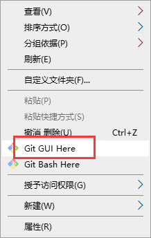
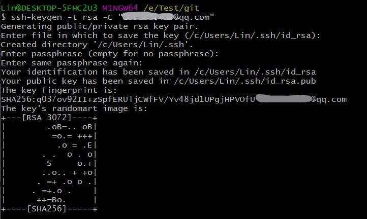
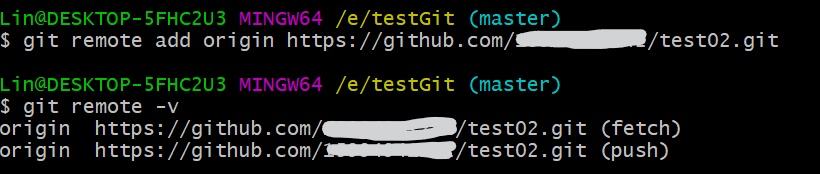

# 1、配置：

## 1）快速下载git:

https://npm.taobao.org/mirrors/git-for-windows/

## 2）在 http://gitee.com 新建仓库：

## 3）在本机新建的文件夹下右击，点击“git bash here”

## 4）查看当前配置：

`git config --list`

## 5）输入个人信息：

`git config --global user.name "****"`

`git config --global user.email "****@qq.com"`

## 6）生成本地密钥：

`ssh-keygen -t rsa -C "*******@qq.com"`

## 7）配置gitee：

# 2、使用：

## 1）连接远程仓库：

`git clone git@gitee.com:******/record-web.git`

## 2）提交本地文件到远程仓库：

### a.新建测试文件“application.yml”

### b.将新增的文件添加到暂存区：

`cd record-web/`

`git add .`

### c.查看状态：

`git status`

### d.提交到本地仓库：

`git commit -m "first commit"`

### e.提交到远程仓库：

`git push origin master`

# 3、git详解

## 1）本地仓库初始化

- 命令：git init
- 效果：

- 注意：.git目录中存放的是本地库相关的子目录和文件，不要删除，也不要胡乱修改。

## 2）设置签名

- 形式：

  用户名：tom

  Email地址：goodMorning@atguigu.com

- 作用：区分不同开发人员的身份

- 辨析：这里设置的签名和登录远程库（代码托管中心）的账号、密码没有任何的关系；

- 命令：

  - 项目级别/仓库级别：仅在当前本地库范围内有效

    - git config user.name tom_pro

    - git config user.email goodMorning_pro@atguigu.com

    - 信息保存位置：./git/config

      

  - 系统用户级别：登录当前操作系统的用户范围

    - git config  --global user.name tom_glb

    - git config --global user.email goodMorning_glb@atguigu.com

    - 信息保存位置：~/.gitconfig

      

  - 级别优先级

    - 就近原则：项目级别优先于系统用户级别，二者都有时采用项目级别的签名
    - 如果只有系统用户级别的签名，就以系统用户级别的签名为准
    - 不能二者都没有

## 3）基本操作

- 状态查看操作：`git status`

- 添加操作：`git add [file name]`

- 提交操作：`git commit -m "commit message" [file name]`

- 查看历史记录操作：

  - git log

    

  - git log --pretty=oneline

    

  - git log --oneline

    

  - git reflog

    

    （HEAD@{移动到当前版本需要多少步 }）

- 版本切换

  - 本质：**HEAD指针的移动**

  - 基于索引值操作[推荐]：

    `git reset --hard [局部索引值]`

    

  - 使用^符号

    - `git reset -hard HEAD^`
    - 注：一个^表示后退一步，n个表示后退n步

  - 使用~符号

    - `git reset --hard HEAD~n`
    - 注：n表示后退的步数

- 删除文件并返回：

  - 前提：删除前，文件存在时的状态提交到了本地库
  - 操作：git reset --hard [指针位置]
    - 删除操作已经提交到本地库：指针位置指向历史记录
    - 删除操作尚未提交到本地库：指针卫视使用HEAD

- 比较文件差异：

  - git diff [文件名]
    - 将工作区中的文件和暂存区进行比较
  - git diff  [本地库中历史版本] [文件名]
    - 将工作区中的文件和本地库历史记录比较
  - 不带文件名
    - 比较多个文件

## 4）分支管理

### a）什么是分支？

在版本控制过程中，使用多条线同时推进多个任务。

### b）分支的好处？

- 同时并行推进多个功能开发，提高开发效率
- 各个分支在开发过程中，如果某一个分支开发失败，不会对其他分支有任何影响，失败的分支删除重新开始即可

### c）分支操作

- 创建分支

  `git branch [分支名]`

- 查看分支

  `git branch -v`

- 切换分支

  `git checkout [分支名]`

- 合并分支

  - 第一步：切换到接受修改的分支上

    `git checkout [分支名]`

  - 第二步：执行merge命令

    `git merge [有新内容的分支名]`

- 解决冲突

  - 冲突的表现

    

  - 冲突的解决

    - 第一步 ：编辑文件，删除特殊符号
    - 第二部：把文件修改到满意的程度
    - 第三步：`git add [文件名]`
    - 第四步：`git commit -m "日志信息"`（注意：此时commit一定不能带具体文件名）

## 5）GITHUB

### a）别名

git remote add origin  http://gitlab.prod.k8s.lesso.com/00056617/lesso-sale.git

查看当前所有远程仓库地址别名：`git remote -v`

设置别名：`git remote add [别名] [远程地址]`

### b）推送

`git push [别名] [分支名]`

### c）克隆

- 命令：`git clone [远程地址]`
- 效果：
  - 完整的把远程库下载到本地
  - 创建origin远程地址别名
  - 初始化本地仓库

### d）团队邀请

### e）拉取

pull = fetch +  merge

git fetch [远程库地址别名] [远程分支名]

git merge [远程库地址别名/远程分支名]

## 6）SSH登录

- 进入当前用户家目录

  `cd ~`

- 删除.ssh目录

  `rm -rvf .ssh`

- 运行命令生成.ssh密钥目录

  `ssh-keygen -t rsa -C [github账号]`

- 进入.ssh目录查看文件列表

  `cd .ssh`

  `ls -lF`

- 查看id_rsa.pub文件内容

  `cat id_rsa.pub`

- 复制id_rsa.pub文件内容，登录GITHUB，点击头像—>Settings—>SSH and GPG keys

- New SSH Key

- 输入复制的密钥信息

- 回到Git bash创建远程地址别名

  `git remote add origin_ssh [远程仓库地址]`

- 推送文件进行测试

